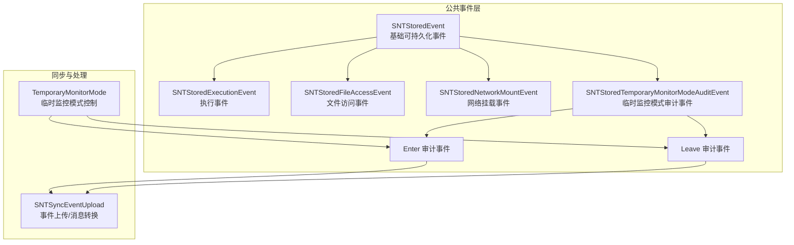
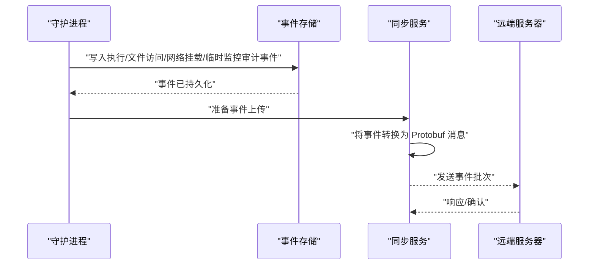
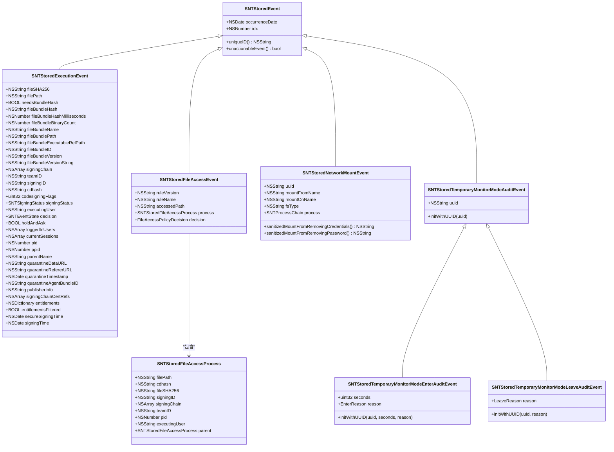
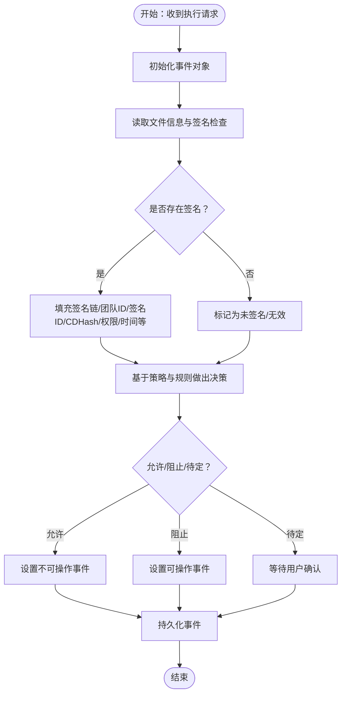
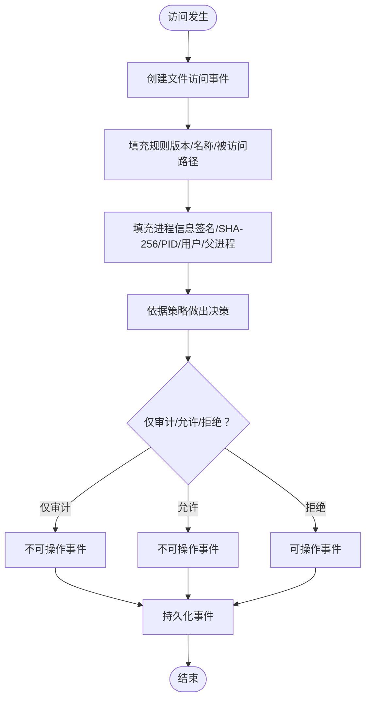
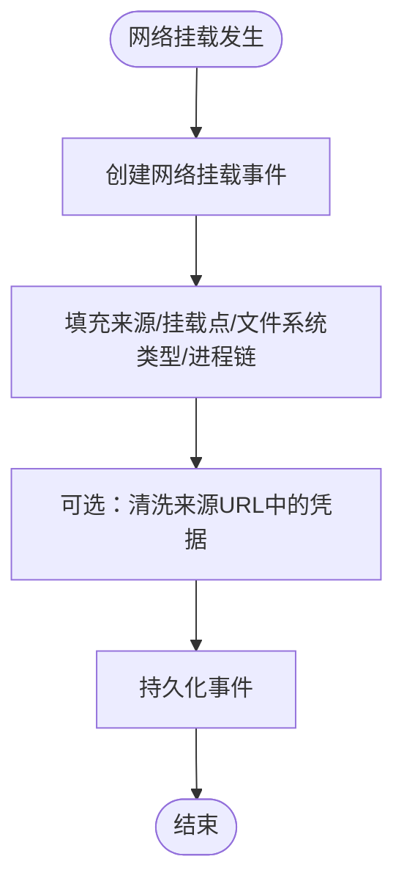
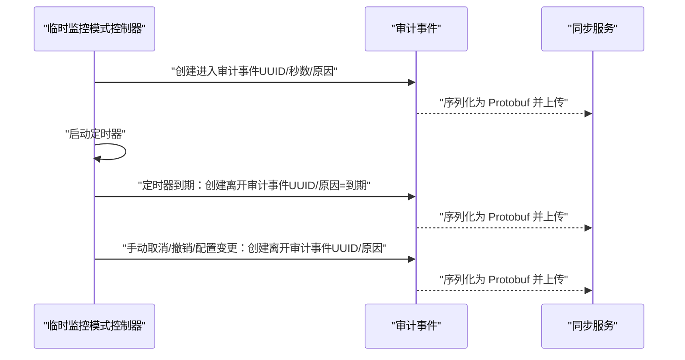
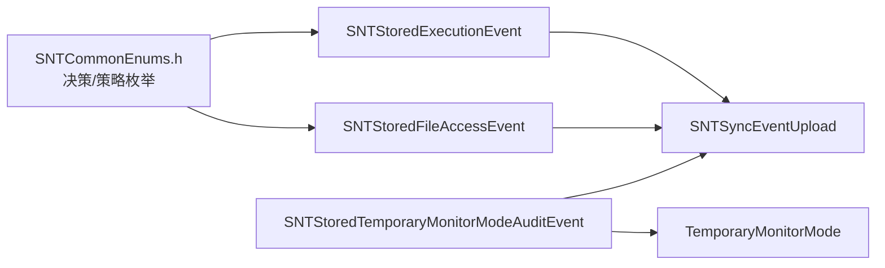

# 事件类型分类

<cite>
**本文引用的文件**
- [SNTStoredEvent.h](file://Source/common/SNTStoredEvent.h)
- [SNTStoredEvent.mm](file://Source/common/SNTStoredEvent.mm)
- [SNTStoredExecutionEvent.h](file://Source/common/SNTStoredExecutionEvent.h)
- [SNTStoredExecutionEvent.mm](file://Source/common/SNTStoredExecutionEvent.mm)
- [SNTStoredFileAccessEvent.h](file://Source/common/SNTStoredFileAccessEvent.h)
- [SNTStoredFileAccessEvent.mm](file://Source/common/SNTStoredFileAccessEvent.mm)
- [SNTStoredNetworkMountEvent.h](file://Source/common/SNTStoredNetworkMountEvent.h)
- [SNTStoredNetworkMountEvent.mm](file://Source/common/SNTStoredNetworkMountEvent.mm)
- [SNTStoredTemporaryMonitorModeAuditEvent.h](file://Source/common/SNTStoredTemporaryMonitorModeAuditEvent.h)
- [SNTStoredTemporaryMonitorModeAuditEvent.mm](file://Source/common/SNTStoredTemporaryMonitorModeAuditEvent.mm)
- [SNTCommonEnums.h](file://Source/common/SNTCommonEnums.h)
- [SNTStoredEventTest.mm](file://Source/common/SNTStoredEventTest.mm)
- [SNTStoredExecutionEventTest.mm](file://Source/common/SNTStoredExecutionEventTest.mm)
- [SNTSyncEventUpload.mm](file://Source/santasyncservice/SNTSyncEventUpload.mm)
- [TemporaryMonitorMode.mm](file://Source/santad/TemporaryMonitorMode.mm)
</cite>

## 目录
1. [引言](#引言)
2. [项目结构](#项目结构)
3. [核心组件](#核心组件)
4. [架构总览](#架构总览)
5. [详细组件分析](#详细组件分析)
6. [依赖分析](#依赖分析)
7. [性能考虑](#性能考虑)
8. [故障排查指南](#故障排查指南)
9. [结论](#结论)
10. [附录](#附录)

## 引言
本技术文档围绕 Santa 的事件类型分类体系展开，聚焦于以下事件类型：执行事件（SNTStoredExecutionEvent）、文件访问事件（SNTStoredFileAccessEvent）、网络挂载事件（SNTStoredNetworkMountEvent）、临时监控模式审计事件（SNTStoredTemporaryMonitorModeAuditEvent 及其派生类）。文档从定义、用途、数据结构、触发条件与业务含义入手，梳理各事件的属性字段、继承关系与序列化行为，并通过类图与流程图呈现关键处理链路，最后给出事件选择的最佳实践与性能建议。

## 项目结构
Santa 将“可持久化存储”的事件统一抽象为基类 SNTStoredEvent，并在该基类之上扩展出多种具体事件类型。这些事件类型均遵循安全编码协议（NSSecureCoding），支持归档/解档，便于落库与跨进程传输。相关文件分布于 Source/common 目录下，部分事件在同步服务中被转换为 Protobuf 消息以上传至服务器。

图表来源
- [SNTStoredEvent.h](file://Source/common/SNTStoredEvent.h#L1-L36)
- [SNTStoredEvent.mm](file://Source/common/SNTStoredEvent.mm#L1-L74)
- [SNTStoredExecutionEvent.h](file://Source/common/SNTStoredExecutionEvent.h#L1-L142)
- [SNTStoredFileAccessEvent.h](file://Source/common/SNTStoredFileAccessEvent.h#L1-L74)
- [SNTStoredNetworkMountEvent.h](file://Source/common/SNTStoredNetworkMountEvent.h#L1-L42)
- [SNTStoredTemporaryMonitorModeAuditEvent.h](file://Source/common/SNTStoredTemporaryMonitorModeAuditEvent.h#L1-L92)
- [SNTSyncEventUpload.mm](file://Source/santasyncservice/SNTSyncEventUpload.mm#L391-L443)
- [TemporaryMonitorMode.mm](file://Source/santad/TemporaryMonitorMode.mm#L278-L312)

章节来源
- [SNTStoredEvent.h](file://Source/common/SNTStoredEvent.h#L1-L36)
- [SNTStoredEvent.mm](file://Source/common/SNTStoredEvent.mm#L1-L74)

## 核心组件
本节对四种事件类型进行逐项解析，包括字段语义、触发场景、序列化与去重策略等。

- 执行事件（SNTStoredExecutionEvent）
  - 用途：记录一次二进制执行决策的完整上下文，包括签名信息、代码签名标志、沙箱权限、执行用户、进程树信息、隔离数据等。
  - 关键字段：文件哈希、路径、是否为包内二进制、包级聚合信息（包哈希、耗时、二进制数量、包名、包路径、主执行相对路径、包标识与版本信息）、签名链、团队 ID、签名 ID、CDHash、代码签名标志、签名状态、执行用户、决策、是否需要用户确认、当前登录用户与会话、进程与父进程 PID/名称、隔离数据（来源、引用者、时间戳、应用 Bundle ID）、发布者信息与证书引用、权限字典及过滤标记、可信签名时间与开发者签名时间。
  - 触发条件：当系统尝试执行一个二进制文件时，若需要做出允许/阻止/待定等决策，即生成该事件。
  - 去重与可操作性：唯一 ID 使用文件 SHA-256；当决策为允许（含多种允许变体）时视为不可操作事件（unactionableEvent 返回真），用于避免重复上报或缓存冲突。
  - 序列化：实现 NSSecureCoding，使用通用宏进行编码/解码，包含基础字段与复杂对象（证书数组、日期、整型标志位等）。

- 文件访问事件（SNTStoredFileAccessEvent）
  - 用途：记录对受监视路径的访问行为，包含规则版本/名称、被访问路径、执行进程及其签名信息、父进程、决策结果（允许/拒绝/仅审计）。
  - 关键字段：规则版本、规则名称、被访问路径、进程信息（可签名二进制的 SHA-256、CDHash、签名链、团队 ID、签名 ID、PID、执行用户、父进程）、决策。
  - 触发条件：当进程访问被监视的路径时，依据策略做出允许/拒绝/仅审计等决策。
  - 去重与可操作性：唯一 ID 组合规则名+规则版本+进程 SHA-256，避免高频路径导致的噪声；仅“仅审计”允许时不产生后续动作（unactionableEvent 为真）。
  - 序列化：实现 NSSecureCoding，进程信息作为嵌套对象独立编码/解码。

- 网络挂载事件（SNTStoredNetworkMountEvent）
  - 用途：记录网络文件系统的挂载行为，包含来源地址、挂载点、文件系统类型、触发进程链、敏感信息清洗接口。
  - 关键字段：唯一标识 uuid、来源名称、挂载点名称、文件系统类型、进程链。
  - 触发条件：系统执行网络挂载操作（如 SMB/NFS）时生成。
  - 去重与可操作性：唯一 ID 使用来源 URL；此类事件通常可进入退避缓存（unactionableEvent 为真），用于降低噪声。
  - 序列化：实现 NSSecureCoding，包含基础字段与进程链对象。
  - 安全清洗：提供去除凭据与仅去密码的清洗方法，保护隐私与安全。

- 临时监控模式审计事件（SNTStoredTemporaryMonitorModeAuditEvent 及其派生）
  - 用途：记录临时监控模式的进入与离开事件，携带会话 UUID、原因枚举、持续时长等，确保每次刷新/重启等场景均有审计记录。
  - 类型与字段：
    - 基类：持有会话 UUID，禁止直接实例化，提供安全编码支持。
    - Enter 审计事件：包含持续秒数与进入原因（按需请求、刷新、守护进程重启）。
    - Leave 审计事件：包含离开原因（到期、取消、撤销、同步服务器变更、重启）。
  - 触发条件：进入/离开临时监控模式时生成；守护进程定时器到期也会自动生成离开事件。
  - 去重与可操作性：基类内部维护随机唯一 UUID，防止缓存冲突；两类事件均不可操作（unactionableEvent 为假），确保全部上报。
  - 序列化：实现 NSSecureCoding，进入事件包含秒数与原因，离开事件包含原因。

章节来源
- [SNTStoredExecutionEvent.h](file://Source/common/SNTStoredExecutionEvent.h#L1-L142)
- [SNTStoredExecutionEvent.mm](file://Source/common/SNTStoredExecutionEvent.mm#L1-L181)
- [SNTStoredFileAccessEvent.h](file://Source/common/SNTStoredFileAccessEvent.h#L1-L74)
- [SNTStoredFileAccessEvent.mm](file://Source/common/SNTStoredFileAccessEvent.mm#L1-L111)
- [SNTStoredNetworkMountEvent.h](file://Source/common/SNTStoredNetworkMountEvent.h#L1-L42)
- [SNTStoredNetworkMountEvent.mm](file://Source/common/SNTStoredNetworkMountEvent.mm#L1-L108)
- [SNTStoredTemporaryMonitorModeAuditEvent.h](file://Source/common/SNTStoredTemporaryMonitorModeAuditEvent.h#L1-L92)
- [SNTStoredTemporaryMonitorModeAuditEvent.mm](file://Source/common/SNTStoredTemporaryMonitorModeAuditEvent.mm#L1-L144)

## 架构总览
下图展示事件类型在系统中的角色与流向：事件由守护进程采集并持久化，随后经同步服务转换为 Protobuf 消息上传；临时监控模式的进入/离开由守护进程定时器驱动并生成审计事件。

图表来源
- [SNTSyncEventUpload.mm](file://Source/santasyncservice/SNTSyncEventUpload.mm#L391-L443)
- [TemporaryMonitorMode.mm](file://Source/santad/TemporaryMonitorMode.mm#L278-L312)

## 详细组件分析

### 继承关系与数据模型对比
下图给出四类事件的类图，展示它们与基类的关系、关键属性与序列化能力。

图表来源
- [SNTStoredEvent.h](file://Source/common/SNTStoredEvent.h#L1-L36)
- [SNTStoredEvent.mm](file://Source/common/SNTStoredEvent.mm#L1-L74)
- [SNTStoredExecutionEvent.h](file://Source/common/SNTStoredExecutionEvent.h#L1-L142)
- [SNTStoredExecutionEvent.mm](file://Source/common/SNTStoredExecutionEvent.mm#L1-L181)
- [SNTStoredFileAccessEvent.h](file://Source/common/SNTStoredFileAccessEvent.h#L1-L74)
- [SNTStoredFileAccessEvent.mm](file://Source/common/SNTStoredFileAccessEvent.mm#L1-L111)
- [SNTStoredNetworkMountEvent.h](file://Source/common/SNTStoredNetworkMountEvent.h#L1-L42)
- [SNTStoredNetworkMountEvent.mm](file://Source/common/SNTStoredNetworkMountEvent.mm#L1-L108)
- [SNTStoredTemporaryMonitorModeAuditEvent.h](file://Source/common/SNTStoredTemporaryMonitorModeAuditEvent.h#L1-L92)
- [SNTStoredTemporaryMonitorModeAuditEvent.mm](file://Source/common/SNTStoredTemporaryMonitorModeAuditEvent.mm#L1-L144)

### 执行事件处理流程
执行事件在生成时会解析文件签名信息并填充相关字段；随后根据决策状态决定是否可操作。

图表来源
- [SNTStoredExecutionEvent.mm](file://Source/common/SNTStoredExecutionEvent.mm#L24-L48)
- [SNTStoredExecutionEvent.mm](file://Source/common/SNTStoredExecutionEvent.mm#L143-L181)
- [SNTStoredExecutionEventTest.mm](file://Source/common/SNTStoredExecutionEventTest.mm#L1-L74)

章节来源
- [SNTStoredExecutionEvent.mm](file://Source/common/SNTStoredExecutionEvent.mm#L24-L48)
- [SNTStoredExecutionEvent.mm](file://Source/common/SNTStoredExecutionEvent.mm#L143-L181)
- [SNTStoredExecutionEventTest.mm](file://Source/common/SNTStoredExecutionEventTest.mm#L1-L74)

### 文件访问事件处理流程
文件访问事件在访问发生时记录规则与进程信息，并依据策略决策。

图表来源
- [SNTStoredFileAccessEvent.mm](file://Source/common/SNTStoredFileAccessEvent.mm#L22-L52)
- [SNTStoredFileAccessEvent.mm](file://Source/common/SNTStoredFileAccessEvent.mm#L59-L68)

章节来源
- [SNTStoredFileAccessEvent.mm](file://Source/common/SNTStoredFileAccessEvent.mm#L22-L52)
- [SNTStoredFileAccessEvent.mm](file://Source/common/SNTStoredFileAccessEvent.mm#L59-L68)

### 网络挂载事件处理流程
网络挂载事件记录来源、挂载点与文件系统类型，并提供敏感信息清洗接口。

图表来源
- [SNTStoredNetworkMountEvent.mm](file://Source/common/SNTStoredNetworkMountEvent.mm#L21-L53)
- [SNTStoredNetworkMountEvent.mm](file://Source/common/SNTStoredNetworkMountEvent.mm#L70-L107)

章节来源
- [SNTStoredNetworkMountEvent.mm](file://Source/common/SNTStoredNetworkMountEvent.mm#L21-L53)
- [SNTStoredNetworkMountEvent.mm](file://Source/common/SNTStoredNetworkMountEvent.mm#L70-L107)

### 临时监控模式审计事件处理流程
进入/离开事件由守护进程与定时器共同生成，进入事件携带时长与原因，离开事件携带原因。

图表来源
- [TemporaryMonitorMode.mm](file://Source/santad/TemporaryMonitorMode.mm#L278-L312)
- [SNTStoredTemporaryMonitorModeAuditEvent.mm](file://Source/common/SNTStoredTemporaryMonitorModeAuditEvent.mm#L27-L106)
- [SNTSyncEventUpload.mm](file://Source/santasyncservice/SNTSyncEventUpload.mm#L391-L443)

章节来源
- [TemporaryMonitorMode.mm](file://Source/santad/TemporaryMonitorMode.mm#L278-L312)
- [SNTStoredTemporaryMonitorModeAuditEvent.mm](file://Source/common/SNTStoredTemporaryMonitorModeAuditEvent.mm#L27-L106)
- [SNTSyncEventUpload.mm](file://Source/santasyncservice/SNTSyncEventUpload.mm#L391-L443)

## 依赖分析
- 事件基类与派生类
  - 所有事件均继承自 SNTStoredEvent，复用基础字段（发生时间、索引）与安全编码能力。
- 决策与策略枚举
  - 执行事件使用 SNTEventState 表示允许/阻止的多种细分；文件访问事件使用 FileAccessPolicyDecision 表示策略决策。
- 同步与序列化
  - 同步服务将临时监控模式审计事件转换为 Protobuf 消息，确保跨系统传输一致性。
- 进程链与签名工具
  - 执行事件依赖签名检查工具填充签名链与状态；网络挂载事件依赖进程链对象描述触发进程。

图表来源
- [SNTCommonEnums.h](file://Source/common/SNTCommonEnums.h#L91-L228)
- [SNTStoredExecutionEvent.h](file://Source/common/SNTStoredExecutionEvent.h#L1-L142)
- [SNTStoredFileAccessEvent.h](file://Source/common/SNTStoredFileAccessEvent.h#L1-L74)
- [SNTStoredTemporaryMonitorModeAuditEvent.h](file://Source/common/SNTStoredTemporaryMonitorModeAuditEvent.h#L1-L92)
- [SNTSyncEventUpload.mm](file://Source/santasyncservice/SNTSyncEventUpload.mm#L391-L443)
- [TemporaryMonitorMode.mm](file://Source/santad/TemporaryMonitorMode.mm#L278-L312)

章节来源
- [SNTCommonEnums.h](file://Source/common/SNTCommonEnums.h#L91-L228)
- [SNTSyncEventUpload.mm](file://Source/santasyncservice/SNTSyncEventUpload.mm#L391-L443)

## 性能考虑
- 编码/解码开销
  - 所有事件实现 NSSecureCoding，包含大量字符串、日期与数组字段，归档/解档存在一定 CPU 与内存开销。建议：
    - 在高并发场景下批量归档/解档，减少频繁分配。
    - 对高频字段（如文件哈希、进程 SHA-256）优先使用紧凑表示，避免冗余拷贝。
- 去重与缓存
  - 执行事件以文件哈希为唯一 ID，文件访问事件以规则+进程 SHA-256 为唯一 ID，网络挂载事件以来源 URL 为唯一 ID。合理利用去重可显著降低上传量与数据库压力。
  - 对“仅审计”类事件（文件访问允许/仅审计、网络挂载）可采用退避缓存策略，避免重复上报。
- 临时监控模式
  - 进入/离开事件均不可操作（unactionableEvent 为假），确保全部审计记录；同时基类维护随机唯一 UUID 防止缓存冲突，保障每次刷新/重启都有独立记录。
- 序列化到 Protobuf
  - 同步服务将事件转换为 Protobuf，建议启用压缩（如 zstd/gzip）以降低带宽占用，但需权衡 CPU 压力。

## 故障排查指南
- 唯一 ID 与不可操作性
  - 若发现某些事件未被上报或被去重，请检查唯一 ID 生成逻辑与决策状态映射。例如执行事件在允许状态下应被视为不可操作事件；文件访问事件在仅审计状态下也应被视为不可操作事件。
- 归档/解档失败
  - 确认事件对象实现了 NSSecureCoding，且字段类型与编码宏匹配。测试用例展示了正确的归档/解档流程与断言。
- 签名信息缺失
  - 执行事件在签名检查失败时会标记为未签名/无效，此时不应依赖签名链字段。请检查文件签名状态与证书链完整性。
- 网络挂载敏感信息泄露
  - 使用提供的清洗方法移除来源 URL 中的用户名/密码，避免日志与上传数据泄露。

章节来源
- [SNTStoredEventTest.mm](file://Source/common/SNTStoredEventTest.mm#L27-L112)
- [SNTStoredExecutionEventTest.mm](file://Source/common/SNTStoredExecutionEventTest.mm#L1-L74)
- [SNTStoredExecutionEvent.mm](file://Source/common/SNTStoredExecutionEvent.mm#L143-L181)
- [SNTStoredFileAccessEvent.mm](file://Source/common/SNTStoredFileAccessEvent.mm#L59-L68)
- [SNTStoredNetworkMountEvent.mm](file://Source/common/SNTStoredNetworkMountEvent.mm#L70-L107)

## 结论
Santa 的事件类型分类以 SNTStoredEvent 为基座，围绕执行、文件访问、网络挂载与临时监控模式审计四类核心场景构建了清晰的数据模型与处理流程。通过合理的唯一 ID 设计、决策状态映射与序列化机制，系统在保证可观测性的同时兼顾了性能与隐私安全。建议在实际部署中结合业务需求选择合适的事件类型，并配合去重与缓存策略优化资源消耗。

## 附录
- 字段与枚举参考
  - 决策与策略枚举定义参见 SNTCommonEnums.h，涵盖执行事件的允许/阻止细分与文件访问策略决策。
- 测试用例参考
  - 事件基类与派生类的唯一 ID、不可操作性与归档/解档行为均可在测试文件中验证。

章节来源
- [SNTCommonEnums.h](file://Source/common/SNTCommonEnums.h#L91-L228)
- [SNTStoredEventTest.mm](file://Source/common/SNTStoredEventTest.mm#L27-L112)
- [SNTStoredExecutionEventTest.mm](file://Source/common/SNTStoredExecutionEventTest.mm#L1-L74)