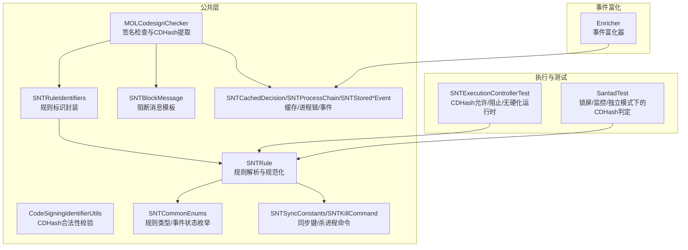
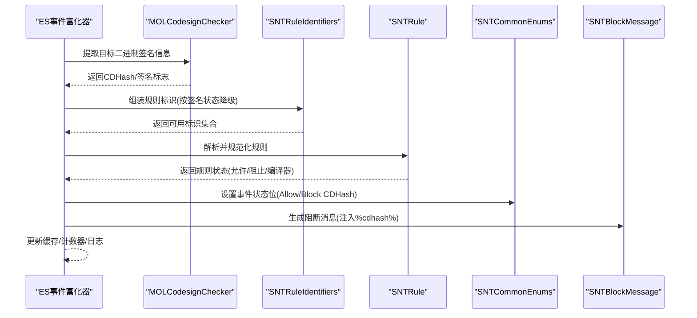
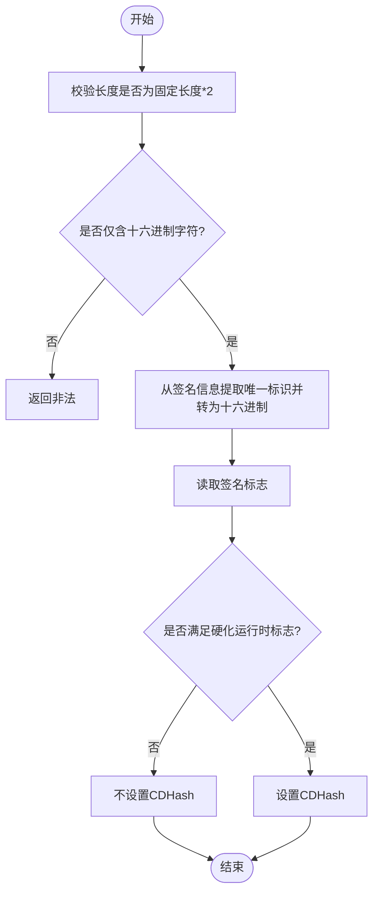
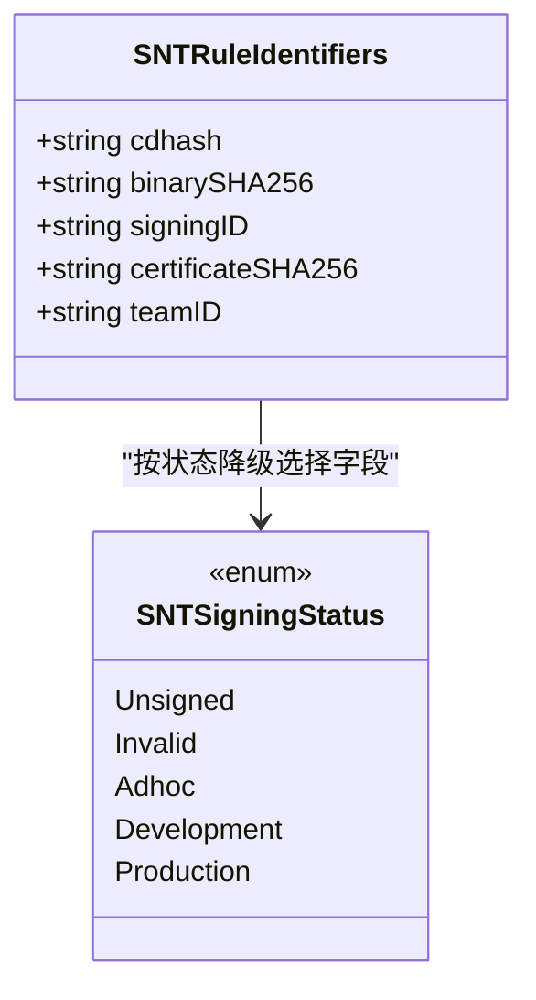
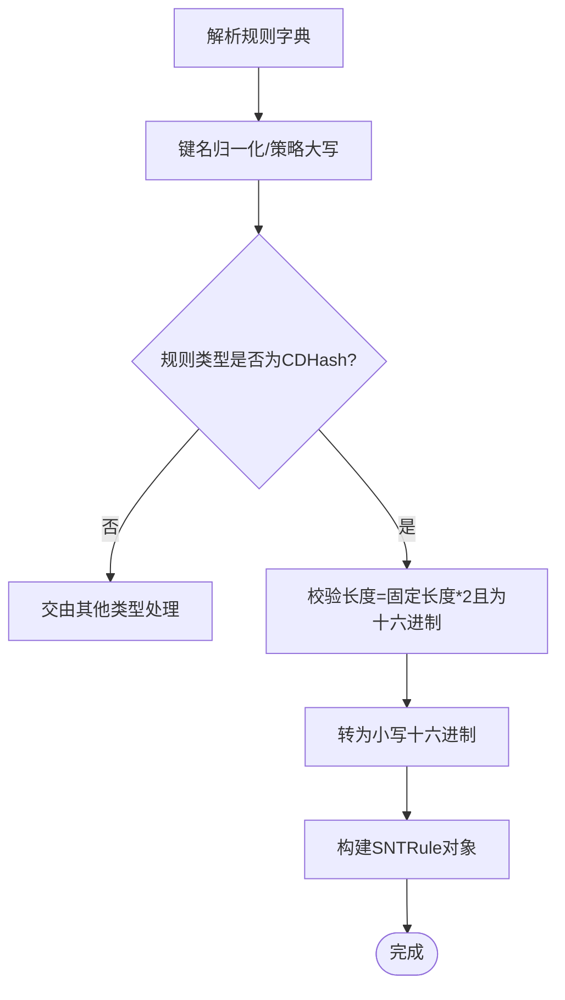
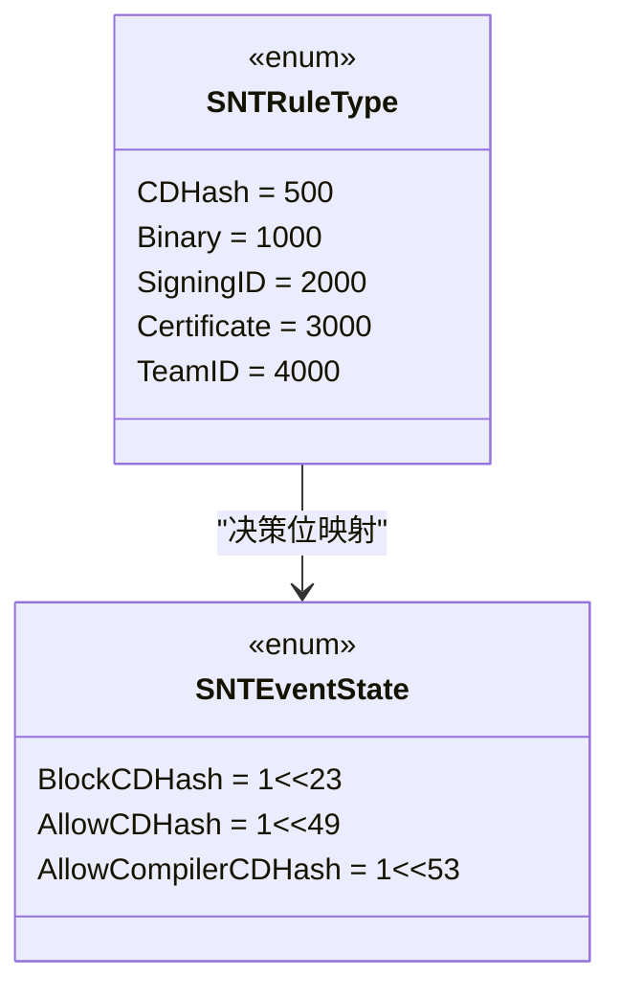
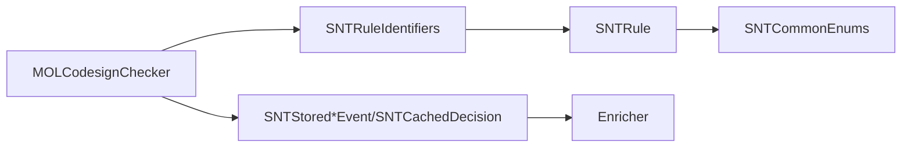

# CDHash规则

<cite>
**本文引用的文件**
- [Source/common/CodeSigningIdentifierUtils.h](file://Source/common/CodeSigningIdentifierUtils.h)
- [Source/common/CodeSigningIdentifierUtils.mm](file://Source/common/CodeSigningIdentifierUtils.mm)
- [Source/common/MOLCodesignChecker.h](file://Source/common/MOLCodesignChecker.h)
- [Source/common/MOLCodesignChecker.mm](file://Source/common/MOLCodesignChecker.mm)
- [Source/common/SNTRuleIdentifiers.h](file://Source/common/SNTRuleIdentifiers.h)
- [Source/common/SNTRuleIdentifiers.mm](file://Source/common/SNTRuleIdentifiers.mm)
- [Source/common/SNTRule.h](file://Source/common/SNTRule.h)
- [Source/common/SNTRule.mm](file://Source/common/SNTRule.mm)
- [Source/common/SNTCommonEnums.h](file://Source/common/SNTCommonEnums.h)
- [Source/common/SNTBlockMessage.mm](file://Source/common/SNTBlockMessage.mm)
- [Source/common/SNTBlockMessageTest.mm](file://Source/common/SNTBlockMessageTest.mm)
- [Source/common/SNTCachedDecision.h](file://Source/common/SNTCachedDecision.h)
- [Source/common/SNTProcessChain.h](file://Source/common/SNTProcessChain.h)
- [Source/common/SNTStoredExecutionEvent.h](file://Source/common/SNTStoredExecutionEvent.h)
- [Source/common/SNTStoredFileAccessEvent.h](file://Source/common/SNTStoredFileAccessEvent.h)
- [Source/common/SNTSyncConstants.h](file://Source/common/SNTSyncConstants.h)
- [Source/common/SNTKillCommand.h](file://Source/common/SNTKillCommand.h)
- [Source/santad/SNTExecutionControllerTest.mm](file://Source/santad/SNTExecutionControllerTest.mm)
- [Source/santad/SantadTest.mm](file://Source/santad/SantadTest.mm)
- [Source/santad/EventProviders/EndpointSecurity/Enricher.h](file://Source/santad/EventProviders/EndpointSecurity/Enricher.h)
- [Source/santad/EventProviders/EndpointSecurity/Enricher.mm](file://Source/santad/EventProviders/EndpointSecurity/Enricher.mm)
</cite>

## 目录
1. [简介](#简介)
2. [项目结构](#项目结构)
3. [核心组件](#核心组件)
4. [架构总览](#架构总览)
5. [详细组件分析](#详细组件分析)
6. [依赖关系分析](#依赖关系分析)
7. [性能考量](#性能考量)
8. [故障排查指南](#故障排查指南)
9. [结论](#结论)
10. [附录：CDHash规则配置示例](#附录cdhash规则配置示例)

## 简介
本文件面向Santa的CDHash规则系统，系统化阐述CDHash（代码签名哈希）规则的工作原理、实现机制与最佳实践。CDHash是基于可执行文件的代码签名唯一标识，用于在二进制授权中进行精确匹配或模糊匹配（如编译器链路场景）。本文从数据来源、规则解析、决策流程、性能与缓存策略等方面进行深入分析，并提供配置示例与排障建议。

## 项目结构
围绕CDHash规则的关键代码分布在以下模块：
- 公共工具与模型：CDHash校验、签名检查、规则标识、通用枚举、阻断消息模板、缓存决策、进程链、事件对象、同步常量、杀进程命令等。
- 执行控制与测试：执行控制器测试与守护进程测试覆盖了CDHash允许/阻止/无硬化运行时等典型场景。
- ES事件富化：事件富化器负责在不触发外部工作的情况下尽可能本地化地丰富事件信息，避免热路径上的额外开销。

**图表来源**
- [Source/common/MOLCodesignChecker.h](file://Source/common/MOLCodesignChecker.h#L65-L75)
- [Source/common/CodeSigningIdentifierUtils.h](file://Source/common/CodeSigningIdentifierUtils.h#L31-L40)
- [Source/common/SNTRuleIdentifiers.h](file://Source/common/SNTRuleIdentifiers.h#L31-L46)
- [Source/common/SNTRule.h](file://Source/common/SNTRule.h#L15-L38)
- [Source/common/SNTCommonEnums.h](file://Source/common/SNTCommonEnums.h#L57-L66)
- [Source/common/SNTBlockMessage.mm](file://Source/common/SNTBlockMessage.mm#L191-L243)
- [Source/common/SNTCachedDecision.h](file://Source/common/SNTCachedDecision.h#L40-L45)
- [Source/common/SNTProcessChain.h](file://Source/common/SNTProcessChain.h#L24-L30)
- [Source/common/SNTStoredExecutionEvent.h](file://Source/common/SNTStoredExecutionEvent.h#L74-L80)
- [Source/common/SNTStoredFileAccessEvent.h](file://Source/common/SNTStoredFileAccessEvent.h#L45-L50)
- [Source/common/SNTSyncConstants.h](file://Source/common/SNTSyncConstants.h#L46-L46)
- [Source/common/SNTKillCommand.h](file://Source/common/SNTKillCommand.h#L31-L34)
- [Source/santad/SNTExecutionControllerTest.mm](file://Source/santad/SNTExecutionControllerTest.mm#L311-L365)
- [Source/santad/SantadTest.mm](file://Source/santad/SantadTest.mm#L508-L558)
- [Source/santad/EventProviders/EndpointSecurity/Enricher.h](file://Source/santad/EventProviders/EndpointSecurity/Enricher.h#L35-L74)

**章节来源**
- [Source/common/MOLCodesignChecker.h](file://Source/common/MOLCodesignChecker.h#L65-L75)
- [Source/common/CodeSigningIdentifierUtils.h](file://Source/common/CodeSigningIdentifierUtils.h#L31-L40)
- [Source/common/SNTRuleIdentifiers.h](file://Source/common/SNTRuleIdentifiers.h#L31-L46)
- [Source/common/SNTRule.h](file://Source/common/SNTRule.h#L15-L38)
- [Source/common/SNTCommonEnums.h](file://Source/common/SNTCommonEnums.h#L57-L66)
- [Source/common/SNTBlockMessage.mm](file://Source/common/SNTBlockMessage.mm#L191-L243)
- [Source/common/SNTCachedDecision.h](file://Source/common/SNTCachedDecision.h#L40-L45)
- [Source/common/SNTProcessChain.h](file://Source/common/SNTProcessChain.h#L24-L30)
- [Source/common/SNTStoredExecutionEvent.h](file://Source/common/SNTStoredExecutionEvent.h#L74-L80)
- [Source/common/SNTStoredFileAccessEvent.h](file://Source/common/SNTStoredFileAccessEvent.h#L45-L50)
- [Source/common/SNTSyncConstants.h](file://Source/common/SNTSyncConstants.h#L46-L46)
- [Source/common/SNTKillCommand.h](file://Source/common/SNTKillCommand.h#L31-L34)
- [Source/santad/SNTExecutionControllerTest.mm](file://Source/santad/SNTExecutionControllerTest.mm#L311-L365)
- [Source/santad/SantadTest.mm](file://Source/santad/SantadTest.mm#L508-L558)
- [Source/santad/EventProviders/EndpointSecurity/Enricher.h](file://Source/santad/EventProviders/EndpointSecurity/Enricher.h#L35-L74)

## 核心组件
- CDHash合法性校验：确保输入为固定长度且仅含十六进制字符。
- 签名检查器：从签名信息中提取CDHash，同时提供证书链、团队ID、签名ID等上下文。
- 规则标识封装：以结构体/对象形式承载CDHash与其他标识符，按签名状态降级选择有效字段。
- 规则模型：解析并规范化规则字典，强制CDHash标识为小写十六进制，校验长度与格式。
- 枚举与事件状态：定义CDHash规则类型与允许/阻止事件位，便于决策与统计。
- 阻断消息模板：在阻断时注入CDHash变量，便于用户理解与审计。
- 缓存/进程链/事件：记录执行事件的CDHash，支持后续决策与审计。
- 同步常量/杀进程命令：提供CDHash相关指标键与按CDHash杀进程能力。

**章节来源**
- [Source/common/CodeSigningIdentifierUtils.mm](file://Source/common/CodeSigningIdentifierUtils.mm#L43-L48)
- [Source/common/MOLCodesignChecker.mm](file://Source/common/MOLCodesignChecker.mm#L288-L291)
- [Source/common/SNTRuleIdentifiers.mm](file://Source/common/SNTRuleIdentifiers.mm#L34-L80)
- [Source/common/SNTRule.mm](file://Source/common/SNTRule.mm#L150-L161)
- [Source/common/SNTCommonEnums.h](file://Source/common/SNTCommonEnums.h#L57-L66)
- [Source/common/SNTBlockMessage.mm](file://Source/common/SNTBlockMessage.mm#L191-L243)
- [Source/common/SNTCachedDecision.h](file://Source/common/SNTCachedDecision.h#L40-L45)
- [Source/common/SNTProcessChain.h](file://Source/common/SNTProcessChain.h#L24-L30)
- [Source/common/SNTStoredExecutionEvent.h](file://Source/common/SNTStoredExecutionEvent.h#L74-L80)
- [Source/common/SNTStoredFileAccessEvent.h](file://Source/common/SNTStoredFileAccessEvent.h#L45-L50)
- [Source/common/SNTSyncConstants.h](file://Source/common/SNTSyncConstants.h#L46-L46)
- [Source/common/SNTKillCommand.h](file://Source/common/SNTKillCommand.h#L31-L34)

## 架构总览
CDHash规则在Santa中的工作流如下：
- 事件产生：ES事件富化器对执行事件进行本地化富化，提取必要元数据。
- 签名检查：通过签名检查器获取CDHash及签名状态。
- 规则匹配：根据签名状态与可用标识符构建规则匹配集，优先匹配CDHash规则。
- 决策生成：依据规则状态生成允许/阻止事件位，更新缓存与统计数据。
- 用户反馈：阻断消息模板注入CDHash，便于审计与告警。

**图表来源**
- [Source/santad/EventProviders/EndpointSecurity/Enricher.mm](file://Source/santad/EventProviders/EndpointSecurity/Enricher.mm#L40-L95)
- [Source/common/MOLCodesignChecker.mm](file://Source/common/MOLCodesignChecker.mm#L288-L291)
- [Source/common/SNTRuleIdentifiers.mm](file://Source/common/SNTRuleIdentifiers.mm#L34-L80)
- [Source/common/SNTRule.mm](file://Source/common/SNTRule.mm#L150-L161)
- [Source/common/SNTCommonEnums.h](file://Source/common/SNTCommonEnums.h#L91-L125)
- [Source/common/SNTBlockMessage.mm](file://Source/common/SNTBlockMessage.mm#L191-L243)

## 详细组件分析

### 组件A：CDHash合法性与签名提取
- 合法性校验：长度必须等于固定常量乘以2，且仅包含十六进制字符。
- 签名提取：从签名信息中读取唯一标识并转换为十六进制字符串；同时提供签名标志、证书链、团队ID、签名ID等。
- 签名状态影响：当未启用硬化运行时（无特定标志），可能不设置CDHash，需按状态降级处理。

**图表来源**
- [Source/common/CodeSigningIdentifierUtils.mm](file://Source/common/CodeSigningIdentifierUtils.mm#L43-L48)
- [Source/common/MOLCodesignChecker.mm](file://Source/common/MOLCodesignChecker.mm#L288-L291)
- [Source/santad/SNTExecutionControllerTest.mm](file://Source/santad/SNTExecutionControllerTest.mm#L326-L341)

**章节来源**
- [Source/common/CodeSigningIdentifierUtils.mm](file://Source/common/CodeSigningIdentifierUtils.mm#L43-L48)
- [Source/common/MOLCodesignChecker.mm](file://Source/common/MOLCodesignChecker.mm#L288-L291)
- [Source/santad/SNTExecutionControllerTest.mm](file://Source/santad/SNTExecutionControllerTest.mm#L326-L341)

### 组件B：规则标识封装与签名状态降级
- 结构体与对象：统一承载CDHash、二进制SHA256、签名ID、证书SHA256、团队ID等。
- 签名状态降级策略：按“生产>开发>adhoc>无效/未签名”的顺序，仅在对应状态下保留相应标识，避免过度匹配。

**图表来源**
- [Source/common/SNTRuleIdentifiers.h](file://Source/common/SNTRuleIdentifiers.h#L31-L46)
- [Source/common/SNTRuleIdentifiers.mm](file://Source/common/SNTRuleIdentifiers.mm#L34-L80)
- [Source/common/SNTCommonEnums.h](file://Source/common/SNTCommonEnums.h#L204-L210)

**章节来源**
- [Source/common/SNTRuleIdentifiers.h](file://Source/common/SNTRuleIdentifiers.h#L31-L46)
- [Source/common/SNTRuleIdentifiers.mm](file://Source/common/SNTRuleIdentifiers.mm#L34-L80)
- [Source/common/SNTCommonEnums.h](file://Source/common/SNTCommonEnums.h#L204-L210)

### 组件C：规则解析与规范化（CDHash）
- 规则字典解析：支持多种键名大小写，自动归一化；识别规则类型与策略。
- CDHash规则校验：强制长度与十六进制格式，最终统一为小写十六进制。
- 策略映射：允许/阻止/静默阻止/CEL等状态与规则类型一一对应。

**图表来源**
- [Source/common/SNTRule.mm](file://Source/common/SNTRule.mm#L254-L365)
- [Source/common/SNTRule.mm](file://Source/common/SNTRule.mm#L150-L161)

**章节来源**
- [Source/common/SNTRule.mm](file://Source/common/SNTRule.mm#L254-L365)
- [Source/common/SNTRule.mm](file://Source/common/SNTRule.mm#L150-L161)

### 组件D：事件状态与决策位
- 规则类型：CDHash规则类型枚举值固定。
- 事件状态：允许/阻止分别使用高位掩码位，CDHash专用位用于区分决策来源。
- 测试覆盖：执行控制器与守护进程测试覆盖了允许/阻止/静默阻止以及不同模式下的判定。

**图表来源**
- [Source/common/SNTCommonEnums.h](file://Source/common/SNTCommonEnums.h#L57-L66)
- [Source/common/SNTCommonEnums.h](file://Source/common/SNTCommonEnums.h#L91-L125)

**章节来源**
- [Source/common/SNTCommonEnums.h](file://Source/common/SNTCommonEnums.h#L57-L66)
- [Source/common/SNTCommonEnums.h](file://Source/common/SNTCommonEnums.h#L91-L125)
- [Source/santad/SNTExecutionControllerTest.mm](file://Source/santad/SNTExecutionControllerTest.mm#L311-L365)
- [Source/santad/SantadTest.mm](file://Source/santad/SantadTest.mm#L508-L558)

### 组件E：阻断消息模板与CDHash变量
- 模板变量：在阻断消息中注入%cdhash%，便于用户理解被拒绝的签名哈希。
- 测试验证：阻断消息单元测试包含%cdhash%占位符的构造逻辑。

**章节来源**
- [Source/common/SNTBlockMessage.mm](file://Source/common/SNTBlockMessage.mm#L191-L243)
- [Source/common/SNTBlockMessageTest.mm](file://Source/common/SNTBlockMessageTest.mm#L53-L59)

### 组件F：事件富化与缓存
- 事件富化：在不触发外部工作前提下，尽可能本地化地丰富事件信息，减少热路径开销。
- 缓存/事件：执行事件与文件访问事件均携带CDHash，便于审计与二次决策。

**章节来源**
- [Source/santad/EventProviders/EndpointSecurity/Enricher.mm](file://Source/santad/EventProviders/EndpointSecurity/Enricher.mm#L40-L95)
- [Source/common/SNTStoredExecutionEvent.h](file://Source/common/SNTStoredExecutionEvent.h#L74-L80)
- [Source/common/SNTStoredFileAccessEvent.h](file://Source/common/SNTStoredFileAccessEvent.h#L45-L50)

## 依赖关系分析
- 组件耦合：
  - MOLCodesignChecker与SNTRuleIdentifiers紧密协作，前者提供CDHash与签名标志，后者按状态降级选择字段。
  - SNTRule对CDHash规则进行严格校验与规范化，确保数据库与策略一致性。
  - SNTCommonEnums为规则类型与事件状态提供统一语义，避免魔法值。
- 外部依赖：
  - 安全框架接口用于签名有效性与签名信息提取。
  - ES事件系统提供执行事件与上下文。

**图表来源**
- [Source/common/MOLCodesignChecker.h](file://Source/common/MOLCodesignChecker.h#L65-L75)
- [Source/common/SNTRuleIdentifiers.mm](file://Source/common/SNTRuleIdentifiers.mm#L34-L80)
- [Source/common/SNTRule.mm](file://Source/common/SNTRule.mm#L150-L161)
- [Source/common/SNTCommonEnums.h](file://Source/common/SNTCommonEnums.h#L57-L66)
- [Source/common/SNTStoredExecutionEvent.h](file://Source/common/SNTStoredExecutionEvent.h#L74-L80)
- [Source/santad/EventProviders/EndpointSecurity/Enricher.h](file://Source/santad/EventProviders/EndpointSecurity/Enricher.h#L35-L74)

**章节来源**
- [Source/common/MOLCodesignChecker.h](file://Source/common/MOLCodesignChecker.h#L65-L75)
- [Source/common/SNTRuleIdentifiers.mm](file://Source/common/SNTRuleIdentifiers.mm#L34-L80)
- [Source/common/SNTRule.mm](file://Source/common/SNTRule.mm#L150-L161)
- [Source/common/SNTCommonEnums.h](file://Source/common/SNTCommonEnums.h#L57-L66)
- [Source/common/SNTStoredExecutionEvent.h](file://Source/common/SNTStoredExecutionEvent.h#L74-L80)
- [Source/santad/EventProviders/EndpointSecurity/Enricher.h](file://Source/santad/EventProviders/EndpointSecurity/Enricher.h#L35-L74)

## 性能考量
- 签名检查优化：
  - 对静态代码验证采用“忽略资源但校验嵌套代码”与“禁止网络访问”的标志组合，显著降低验证时间。
  - 运行时代码验证使用默认标志，兼顾准确性与性能。
- 事件富化：
  - Enricher在默认选项下避免触发外部工作，用户名/GID查询使用本地缓存，减少热路径开销。
- 规则匹配：
  - 规则标识按签名状态降级，避免不必要的字段匹配，提高命中效率。
- 缓存与统计：
  - 执行事件与文件访问事件携带CDHash，便于快速审计与二次决策，减少重复计算。

**章节来源**
- [Source/common/MOLCodesignChecker.mm](file://Source/common/MOLCodesignChecker.mm#L31-L63)
- [Source/santad/EventProviders/EndpointSecurity/Enricher.mm](file://Source/santad/EventProviders/EndpointSecurity/Enricher.mm#L225-L269)
- [Source/common/SNTRuleIdentifiers.mm](file://Source/common/SNTRuleIdentifiers.mm#L34-L80)
- [Source/common/SNTStoredExecutionEvent.h](file://Source/common/SNTStoredExecutionEvent.h#L74-L80)
- [Source/common/SNTStoredFileAccessEvent.h](file://Source/common/SNTStoredFileAccessEvent.h#L45-L50)

## 故障排查指南
- 常见问题与定位：
  - CDHash为空：当签名未启用硬化运行时标志时，可能不会设置CDHash。请确认签名标志与策略配置。
  - 规则不生效：检查规则字典键名大小写与规则类型是否为CDHash；确认标识符长度与十六进制格式。
  - 模式差异：锁屏/监控/独立模式下的行为不同，请结合测试用例核对期望结果。
- 关联测试参考：
  - CDHash允许/阻止/无硬化运行时的测试用例可作为行为基线。
  - 锁屏/监控/独立模式下CDHash阻断/允许的测试用例可用于交叉验证。

**章节来源**
- [Source/santad/SNTExecutionControllerTest.mm](file://Source/santad/SNTExecutionControllerTest.mm#L311-L365)
- [Source/santad/SantadTest.mm](file://Source/santad/SantadTest.mm#L508-L558)

## 结论
Santa的CDHash规则体系通过严格的合法性校验、签名提取与规则规范化，实现了对已签名二进制的精确授权控制。结合签名状态降级策略与事件富化优化，系统在保证安全性的前提下兼顾性能与可观测性。建议在生产环境中：
- 使用CDHash规则进行精确匹配，配合签名状态降级策略实现灵活授权。
- 在需要编译器链路场景时，启用编译器允许规则并关注事件状态位。
- 利用阻断消息模板与事件对象中的CDHash进行审计与告警。

## 附录：CDHash规则配置示例
以下为常见用例的配置思路（以规则字典形式表达，键名大小写不敏感，策略与类型会自动归一化）：

- 允许特定版本的应用程序（基于CDHash）
  - 规则类型：CDHASH
  - 标识符：目标应用的CDHash（小写十六进制）
  - 策略：ALLOWLIST 或 ALLOWLIST_COMPILER
  - 参考路径：[规则初始化与规范化](file://Source/common/SNTRule.mm#L254-L365)

- 阻止已知恶意软件（基于CDHash）
  - 规则类型：CDHASH
  - 标识符：恶意样本的CDHash
  - 策略：BLOCKLIST 或 SILENT_BLOCKLIST
  - 参考路径：[规则初始化与规范化](file://Source/common/SNTRule.mm#L254-L365)

- 与签名状态联动
  - 当签名未启用硬化运行时标志时，CDHash可能为空；此时可退化到二进制SHA256或其他标识进行匹配。
  - 参考路径：[签名标志与CDHash提取](file://Source/common/MOLCodesignChecker.mm#L288-L291)、[签名状态降级](file://Source/common/SNTRuleIdentifiers.mm#L34-L80)

- 阻断消息模板
  - 在阻断时注入%cdhash%变量，便于用户理解与审计。
  - 参考路径：[阻断消息模板](file://Source/common/SNTBlockMessage.mm#L191-L243)

- 事件与审计
  - 执行事件与文件访问事件均携带CDHash，便于审计与二次决策。
  - 参考路径：[执行事件CDHash](file://Source/common/SNTStoredExecutionEvent.h#L74-L80)、[文件访问事件CDHash](file://Source/common/SNTStoredFileAccessEvent.h#L45-L50)