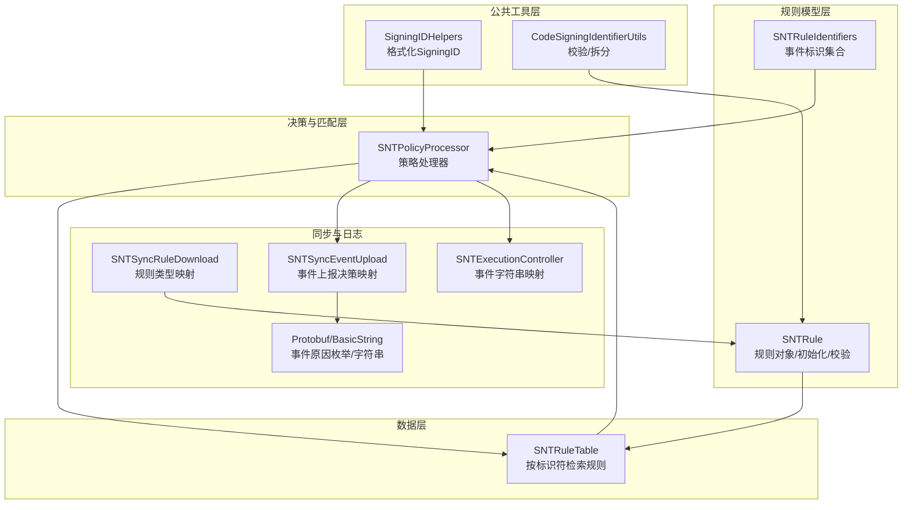
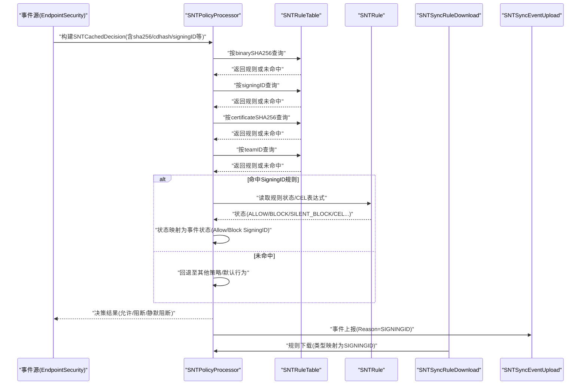
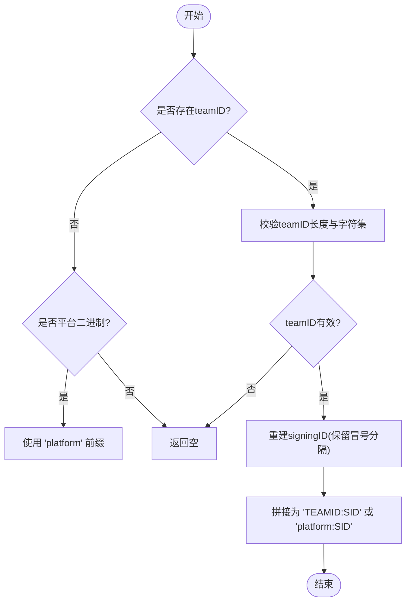
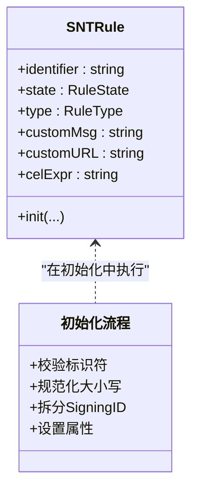
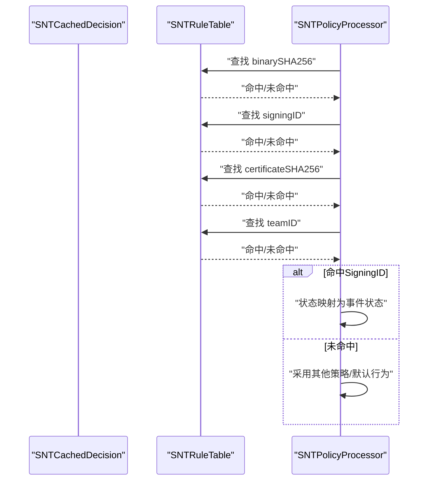
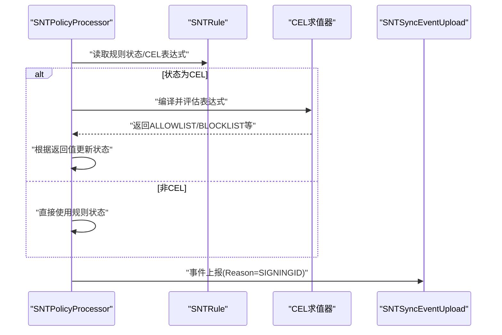
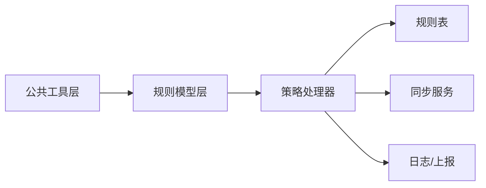

# SigningID规则

<cite>
**本文引用的文件**
- [SigningIDHelpers.h](file://Source/common/SigningIDHelpers.h)
- [SigningIDHelpers.mm](file://Source/common/SigningIDHelpers.mm)
- [CodeSigningIdentifierUtils.h](file://Source/common/CodeSigningIdentifierUtils.h)
- [CodeSigningIdentifierUtils.mm](file://Source/common/CodeSigningIdentifierUtils.mm)
- [SNTRule.h](file://Source/common/SNTRule.h)
- [SNTRule.mm](file://Source/common/SNTRule.mm)
- [SNTRuleIdentifiers.h](file://Source/common/SNTRuleIdentifiers.h)
- [SNTRuleTable.mm](file://Source/santad/DataLayer/SNTRuleTable.mm)
- [SNTPolicyProcessor.h](file://Source/santad/SNTPolicyProcessor.h)
- [SNTPolicyProcessor.mm](file://Source/santad/SNTPolicyProcessor.mm)
- [SNTPolicyProcessorTest.mm](file://Source/santad/SNTPolicyProcessorTest.mm)
- [SNTRuleTest.mm](file://Source/common/SNTRuleTest.mm)
- [SNTSyncRuleDownload.mm](file://Source/santasyncservice/SNTSyncRuleDownload.mm)
- [SNTSyncEventUpload.mm](file://Source/santasyncservice/SNTSyncEventUpload.mm)
- [SNTExecutionController.mm](file://Source/santad/SNTExecutionController.mm)
- [Protobuf.mm](file://Source/santad/Logs/EndpointSecurity/Serializers/Protobuf.mm)
- [BasicStringTest.mm](file://Source/santad/Logs/EndpointSecurity/Serializers/BasicStringTest.mm)
- [ProtobufTest.mm](file://Source/santad/Logs/EndpointSecurity/Serializers/ProtobufTest.mm)
</cite>

## 目录
1. [引言](#引言)
2. [项目结构](#项目结构)
3. [核心组件](#核心组件)
4. [架构总览](#架构总览)
5. [详细组件分析](#详细组件分析)
6. [依赖关系分析](#依赖关系分析)
7. [性能考量](#性能考量)
8. [故障排查指南](#故障排查指南)
9. [结论](#结论)
10. [附录：配置示例与最佳实践](#附录配置示例与最佳实践)

## 引言
本文件面向Santa的SigningID规则系统，系统性阐述签名标识符（SigningID）规则的设计原理、实现细节与高级应用。相比传统的TeamID规则，SigningID规则以“团队ID+签名标识”的复合形式提供更细粒度的控制能力，可针对特定开发者或应用进行精确授权或阻断，并支持平台二进制（platform TeamID）场景。本文将从数据模型、匹配机制、优先级与组合策略、性能优化到企业级部署实践进行全面说明。

## 项目结构
围绕SigningID规则的关键代码分布在以下模块：
- 公共工具层：负责SigningID格式化、校验与拆分
- 规则模型层：定义规则类型、状态、序列化与初始化
- 决策与匹配层：策略处理器根据规则表与事件上下文生成决策
- 数据层：规则表按多种标识符键值检索规则
- 同步与日志：规则下载映射、事件上报与序列化

图表来源
- [SigningIDHelpers.mm](file://Source/common/SigningIDHelpers.mm#L1-L35)
- [CodeSigningIdentifierUtils.mm](file://Source/common/CodeSigningIdentifierUtils.mm#L1-L63)
- [SNTRule.mm](file://Source/common/SNTRule.mm#L96-L147)
- [SNTRuleIdentifiers.h](file://Source/common/SNTRuleIdentifiers.h#L39-L61)
- [SNTPolicyProcessor.mm](file://Source/santad/SNTPolicyProcessor.mm#L183-L200)
- [SNTRuleTable.mm](file://Source/santad/DataLayer/SNTRuleTable.mm#L451-L470)
- [SNTSyncRuleDownload.mm](file://Source/santasyncservice/SNTSyncRuleDownload.mm#L322-L347)
- [SNTSyncEventUpload.mm](file://Source/santasyncservice/SNTSyncEventUpload.mm#L198-L228)
- [SNTExecutionController.mm](file://Source/santad/SNTExecutionController.mm#L128-L150)
- [Protobuf.mm](file://Source/santad/Logs/EndpointSecurity/Serializers/Protobuf.mm#L322-L363)
- [BasicStringTest.mm](file://Source/santad/Logs/EndpointSecurity/Serializers/BasicStringTest.mm#L1427-L1478)

章节来源
- [SigningIDHelpers.h](file://Source/common/SigningIDHelpers.h#L1-L33)
- [SigningIDHelpers.mm](file://Source/common/SigningIDHelpers.mm#L1-L35)
- [CodeSigningIdentifierUtils.h](file://Source/common/CodeSigningIdentifierUtils.h#L1-L44)
- [CodeSigningIdentifierUtils.mm](file://Source/common/CodeSigningIdentifierUtils.mm#L1-L63)
- [SNTRule.h](file://Source/common/SNTRule.h#L1-L129)
- [SNTRule.mm](file://Source/common/SNTRule.mm#L96-L147)
- [SNTRuleIdentifiers.h](file://Source/common/SNTRuleIdentifiers.h#L39-L61)
- [SNTPolicyProcessor.h](file://Source/santad/SNTPolicyProcessor.h#L1-L77)
- [SNTPolicyProcessor.mm](file://Source/santad/SNTPolicyProcessor.mm#L183-L200)
- [SNTRuleTable.mm](file://Source/santad/DataLayer/SNTRuleTable.mm#L451-L470)
- [SNTSyncRuleDownload.mm](file://Source/santasyncservice/SNTSyncRuleDownload.mm#L322-L347)
- [SNTSyncEventUpload.mm](file://Source/santasyncservice/SNTSyncEventUpload.mm#L198-L228)
- [SNTExecutionController.mm](file://Source/santad/SNTExecutionController.mm#L128-L150)
- [Protobuf.mm](file://Source/santad/Logs/EndpointSecurity/Serializers/Protobuf.mm#L322-L363)
- [BasicStringTest.mm](file://Source/santad/Logs/EndpointSecurity/Serializers/BasicStringTest.mm#L1427-L1478)

## 核心组件
- 签名ID格式化与校验
  - 格式化：将MOLCodesignChecker中的teamID与signingID规范化为“teamID:signingID”，平台二进制使用“platform”作为teamID前缀。
  - 校验：验证TeamID长度与字符集；支持“platform:SID”与“TID:SID”两种模式；允许SID中包含多个冒号分隔段。
- 规则对象与初始化
  - 支持规则类型：Binary、Certificate、TeamID、SigningID、CDHash。
  - 对于SigningID规则，解析并规范化“teamID:signingID”格式，强制非platform的teamID大写，platform保持大小写不变。
- 规则表与匹配
  - 按binarySHA256 → signingID → certificateSHA256 → teamID顺序命中静态规则。
- 策略处理器
  - 将规则类型与规则状态映射为事件状态（如AllowSigningID、BlockSigningID），支持CEL表达式动态决策。
- 同步与日志
  - 规则下载时将服务端类型映射为本地规则类型；事件上报时将事件状态映射为上报reason与模式。

章节来源
- [SigningIDHelpers.mm](file://Source/common/SigningIDHelpers.mm#L1-L35)
- [CodeSigningIdentifierUtils.mm](file://Source/common/CodeSigningIdentifierUtils.mm#L25-L63)
- [SNTRule.mm](file://Source/common/SNTRule.mm#L96-L147)
- [SNTRuleTable.mm](file://Source/santad/DataLayer/SNTRuleTable.mm#L451-L470)
- [SNTPolicyProcessor.mm](file://Source/santad/SNTPolicyProcessor.mm#L183-L200)
- [SNTSyncRuleDownload.mm](file://Source/santasyncservice/SNTSyncRuleDownload.mm#L322-L347)
- [SNTSyncEventUpload.mm](file://Source/santasyncservice/SNTSyncEventUpload.mm#L198-L228)

## 架构总览
下图展示从事件产生到决策输出的整体流程，重点标注SigningID规则参与的路径与关键组件交互。

图表来源
- [SNTPolicyProcessor.mm](file://Source/santad/SNTPolicyProcessor.mm#L183-L200)
- [SNTRuleTable.mm](file://Source/santad/DataLayer/SNTRuleTable.mm#L451-L470)
- [SNTSyncRuleDownload.mm](file://Source/santasyncservice/SNTSyncRuleDownload.mm#L322-L347)
- [SNTSyncEventUpload.mm](file://Source/santasyncservice/SNTSyncEventUpload.mm#L198-L228)

## 详细组件分析

### 组件A：SigningID格式化与校验
- 格式化逻辑
  - 若无teamID且为平台二进制，则使用“platform:signingID”。
  - 若存在teamID，则拼接为“TEAMID:signingID”，其中TEAMID统一大写（platform除外）。
- 校验与拆分
  - TeamID必须为10位字母数字；“platform:SID”为合法前缀。
  - SID可包含多个冒号分隔段，但必须保证至少包含一个非空段。
  - 提供Split函数将“teamID:signingID”拆分为两部分。

图表来源
- [SigningIDHelpers.mm](file://Source/common/SigningIDHelpers.mm#L1-L35)
- [CodeSigningIdentifierUtils.mm](file://Source/common/CodeSigningIdentifierUtils.mm#L25-L63)

章节来源
- [SigningIDHelpers.h](file://Source/common/SigningIDHelpers.h#L1-L33)
- [SigningIDHelpers.mm](file://Source/common/SigningIDHelpers.mm#L1-L35)
- [CodeSigningIdentifierUtils.h](file://Source/common/CodeSigningIdentifierUtils.h#L1-L44)
- [CodeSigningIdentifierUtils.mm](file://Source/common/CodeSigningIdentifierUtils.mm#L25-L63)

### 组件B：规则对象与初始化（含SigningID）
- 规则类型与标识符规范化
  - Binary/Certificate/CDHash：标识符长度与字符集校验，并统一转为小写十六进制。
  - TeamID：长度固定为10，字符集仅字母数字，统一大写。
  - SigningID：要求“teamID:signingID”格式；teamID为“platform”时大小写不变，否则强制大写；signingID可包含多个冒号分隔段。
- 错误处理
  - 当标识符无效或缺少必要字段时，返回错误并拒绝规则创建。

图表来源
- [SNTRule.h](file://Source/common/SNTRule.h#L1-L129)
- [SNTRule.mm](file://Source/common/SNTRule.mm#L96-L147)

章节来源
- [SNTRule.h](file://Source/common/SNTRule.h#L1-L129)
- [SNTRule.mm](file://Source/common/SNTRule.mm#L96-L147)
- [SNTRuleTest.mm](file://Source/common/SNTRuleTest.mm#L100-L142)
- [SNTRuleTest.mm](file://Source/common/SNTRuleTest.mm#L144-L220)

### 组件C：规则表与匹配（SigningID优先级）
- 匹配顺序
  - 静态规则命中优先级：binarySHA256 → signingID → certificateSHA256 → teamID。
  - 一旦命中SigningID规则，即按该规则状态与策略决定最终事件状态。
- 策略映射
  - 规则类型×状态 → 事件状态：例如SigningID+Allow→AllowSigningID，SigningID+Block/SilentBlock→BlockSigningID。

图表来源
- [SNTRuleTable.mm](file://Source/santad/DataLayer/SNTRuleTable.mm#L451-L470)
- [SNTPolicyProcessor.mm](file://Source/santad/SNTPolicyProcessor.mm#L183-L200)

章节来源
- [SNTRuleTable.mm](file://Source/santad/DataLayer/SNTRuleTable.mm#L451-L470)
- [SNTPolicyProcessor.mm](file://Source/santad/SNTPolicyProcessor.mm#L183-L200)

### 组件D：策略处理器与CEL集成
- 决策流程
  - 依据规则类型与状态映射事件状态；若规则为CEL类型，则通过CEL求值决定最终状态。
  - 支持CEL v1/v2，失败时可根据配置选择“闭合”策略（阻断）。
- 事件状态与上报
  - 事件状态与上报reason一一对应，SigningID相关事件映射为“SIGNINGID”。

图表来源
- [SNTPolicyProcessor.mm](file://Source/santad/SNTPolicyProcessor.mm#L105-L181)
- [SNTSyncEventUpload.mm](file://Source/santasyncservice/SNTSyncEventUpload.mm#L198-L228)
- [Protobuf.mm](file://Source/santad/Logs/EndpointSecurity/Serializers/Protobuf.mm#L322-L363)
- [BasicStringTest.mm](file://Source/santad/Logs/EndpointSecurity/Serializers/BasicStringTest.mm#L1427-L1478)
- [ProtobufTest.mm](file://Source/santad/Logs/EndpointSecurity/Serializers/ProtobufTest.mm#L539-L592)

章节来源
- [SNTPolicyProcessor.h](file://Source/santad/SNTPolicyProcessor.h#L1-L77)
- [SNTPolicyProcessor.mm](file://Source/santad/SNTPolicyProcessor.mm#L105-L181)
- [SNTSyncEventUpload.mm](file://Source/santasyncservice/SNTSyncEventUpload.mm#L198-L228)
- [Protobuf.mm](file://Source/santad/Logs/EndpointSecurity/Serializers/Protobuf.mm#L322-L363)
- [BasicStringTest.mm](file://Source/santad/Logs/EndpointSecurity/Serializers/BasicStringTest.mm#L1427-L1478)
- [ProtobufTest.mm](file://Source/santad/Logs/EndpointSecurity/Serializers/ProtobufTest.mm#L539-L592)

### 组件E：规则下载与事件上报映射
- 规则下载
  - 服务端规则类型映射为本地规则类型（含SIGNINGID）。
- 事件上报
  - 事件状态映射为上报reason（Allow/Block SigningID）与模式（Monitor/Lockdown/Standalone）。

章节来源
- [SNTSyncRuleDownload.mm](file://Source/santasyncservice/SNTSyncRuleDownload.mm#L322-L347)
- [SNTSyncEventUpload.mm](file://Source/santasyncservice/SNTSyncEventUpload.mm#L198-L228)
- [SNTExecutionController.mm](file://Source/santad/SNTExecutionController.mm#L128-L150)

## 依赖关系分析
- 组件耦合
  - 策略处理器依赖规则表进行规则检索；依赖公共工具进行SigningID格式化与校验。
  - 规则对象对不同规则类型的标识符进行统一规范化，降低上层调用复杂度。
- 外部接口
  - 与同步服务对接，确保规则类型与事件上报reason一致。
- 可能的循环依赖
  - 当前模块间为单向依赖（策略处理器→规则表→规则对象），未见循环依赖迹象。

图表来源
- [SigningIDHelpers.mm](file://Source/common/SigningIDHelpers.mm#L1-L35)
- [CodeSigningIdentifierUtils.mm](file://Source/common/CodeSigningIdentifierUtils.mm#L25-L63)
- [SNTRule.mm](file://Source/common/SNTRule.mm#L96-L147)
- [SNTPolicyProcessor.mm](file://Source/santad/SNTPolicyProcessor.mm#L183-L200)
- [SNTRuleTable.mm](file://Source/santad/DataLayer/SNTRuleTable.mm#L451-L470)
- [SNTSyncRuleDownload.mm](file://Source/santasyncservice/SNTSyncRuleDownload.mm#L322-L347)
- [SNTSyncEventUpload.mm](file://Source/santasyncservice/SNTSyncEventUpload.mm#L198-L228)

章节来源
- [SigningIDHelpers.mm](file://Source/common/SigningIDHelpers.mm#L1-L35)
- [CodeSigningIdentifierUtils.mm](file://Source/common/CodeSigningIdentifierUtils.mm#L25-L63)
- [SNTRule.mm](file://Source/common/SNTRule.mm#L96-L147)
- [SNTPolicyProcessor.mm](file://Source/santad/SNTPolicyProcessor.mm#L183-L200)
- [SNTRuleTable.mm](file://Source/santad/DataLayer/SNTRuleTable.mm#L451-L470)
- [SNTSyncRuleDownload.mm](file://Source/santasyncservice/SNTSyncRuleDownload.mm#L322-L347)
- [SNTSyncEventUpload.mm](file://Source/santasyncservice/SNTSyncEventUpload.mm#L198-L228)

## 性能考量
- 规则检索顺序
  - 采用binarySHA256 → signingID → certificateSHA256 → teamID的顺序，有助于快速命中常见规则，减少全表扫描。
- 规则标识符规范化
  - 对TeamID统一大写、SID允许冒号分隔，避免重复匹配与大小写差异导致的额外开销。
- CEL求值
  - 在CEL失败时可配置“闭合”策略，避免反复尝试；同时CEL结果可缓存（由CEL求值器控制）。
- 日志与上报
  - 事件状态与reason映射清晰，便于审计与统计，避免冗余序列化。

[本节为通用性能建议，不直接分析具体文件，故无章节来源]

## 故障排查指南
- 规则创建失败
  - 现象：创建规则返回nil并携带错误。
  - 排查：检查identifier格式（SigningID需“teamID:signingID”；TeamID需10位字母数字；CDHash需正确长度与十六进制）。
- 匹配不到SigningID规则
  - 现象：事件未按预期走SigningID路径。
  - 排查：确认事件中的signingID是否与规则一致（大小写、冒号分隔段）；检查规则表是否已加载。
- 事件上报reason异常
  - 现象：上报reason显示为UNKNOWN。
  - 排查：确认事件状态映射是否覆盖SigningID分支；核对日志序列化模块映射。

章节来源
- [SNTRule.mm](file://Source/common/SNTRule.mm#L96-L147)
- [SNTRuleTest.mm](file://Source/common/SNTRuleTest.mm#L144-L220)
- [Protobuf.mm](file://Source/santad/Logs/EndpointSecurity/Serializers/Protobuf.mm#L322-L363)
- [BasicStringTest.mm](file://Source/santad/Logs/EndpointSecurity/Serializers/BasicStringTest.mm#L1427-L1478)
- [ProtobufTest.mm](file://Source/santad/Logs/EndpointSecurity/Serializers/ProtobufTest.mm#L539-L592)

## 结论
SigningID规则通过“teamID:signingID”的复合标识，显著提升了控制粒度与灵活性，尤其适用于个人开发者ID与平台二进制场景。其匹配遵循明确的优先级顺序，结合CEL表达式可实现动态与静态规则的协同。在企业环境中，建议结合团队ID与SigningID的组合策略，配合严格的规则同步与审计上报，实现安全与可用性的平衡。

[本节为总结性内容，不直接分析具体文件，故无章节来源]

## 附录：配置示例与最佳实践

### 基于个人开发者ID的精确控制
- 使用“TEAMID:BundleID”或“TEAMID:子域路径”等SigningID规则，针对特定应用或开发者的签名标识进行白名单/黑名单管理。
- 对平台二进制使用“platform:SigningID”规则，避免误伤系统组件。

章节来源
- [SNTRuleTest.mm](file://Source/common/SNTRuleTest.mm#L144-L220)
- [CodeSigningIdentifierUtils.mm](file://Source/common/CodeSigningIdentifierUtils.mm#L25-L63)

### 多维度组合规则
- 组合策略：先按binarySHA256进行快速阻断，再按signingID细化，最后按teamID兜底。
- 与TeamID规则对比
  - TeamID规则适合组织级批量管控，但缺乏对具体应用签名的精细区分。
  - SigningID规则更适合个人开发者ID、特定应用签名或平台二进制的精准控制，提升策略颗粒度与可维护性。

章节来源
- [SNTRuleTable.mm](file://Source/santad/DataLayer/SNTRuleTable.mm#L451-L470)
- [SNTPolicyProcessorTest.mm](file://Source/santad/SNTPolicyProcessorTest.mm#L245-L316)
- [SNTPolicyProcessorTest.mm](file://Source/santad/SNTPolicyProcessorTest.mm#L391-L422)

### 企业级部署最佳实践
- 规则同步
  - 使用同步服务将远端规则类型映射为本地类型（含SIGNINGID），确保一致性。
- 审计与上报
  - 事件上报reason包含SIGNINGID，便于审计追踪；结合日志序列化模块进行结构化输出。
- 动态策略
  - 利用CEL表达式实现条件授权与动态决策，同时设置“闭合”策略保障安全基线。

章节来源
- [SNTSyncRuleDownload.mm](file://Source/santasyncservice/SNTSyncRuleDownload.mm#L322-L347)
- [SNTSyncEventUpload.mm](file://Source/santasyncservice/SNTSyncEventUpload.mm#L198-L228)
- [Protobuf.mm](file://Source/santad/Logs/EndpointSecurity/Serializers/Protobuf.mm#L322-L363)
- [SNTPolicyProcessor.mm](file://Source/santad/SNTPolicyProcessor.mm#L105-L181)