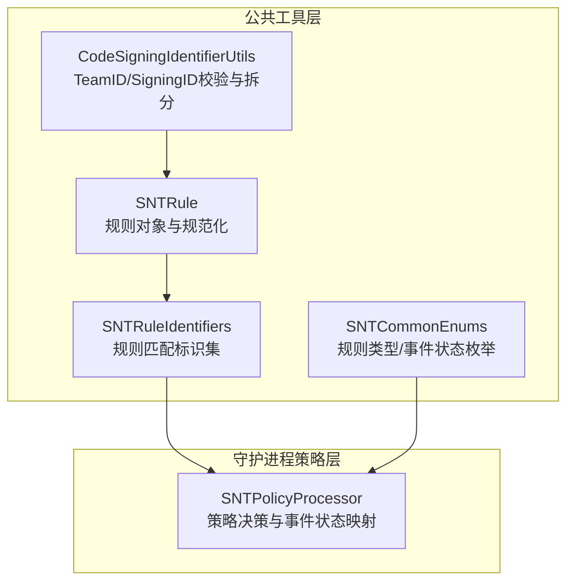
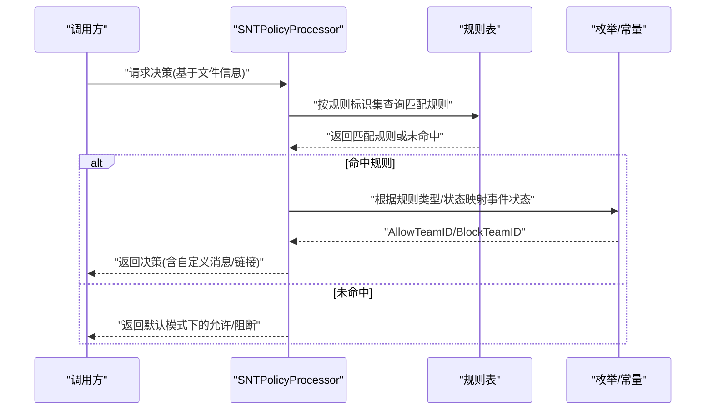
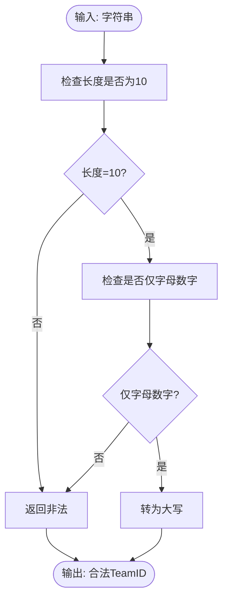
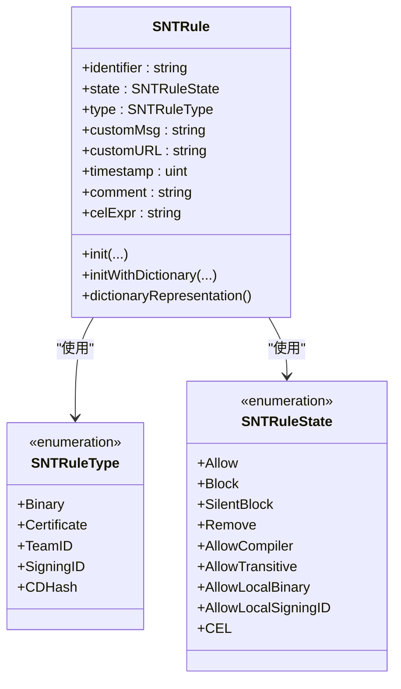
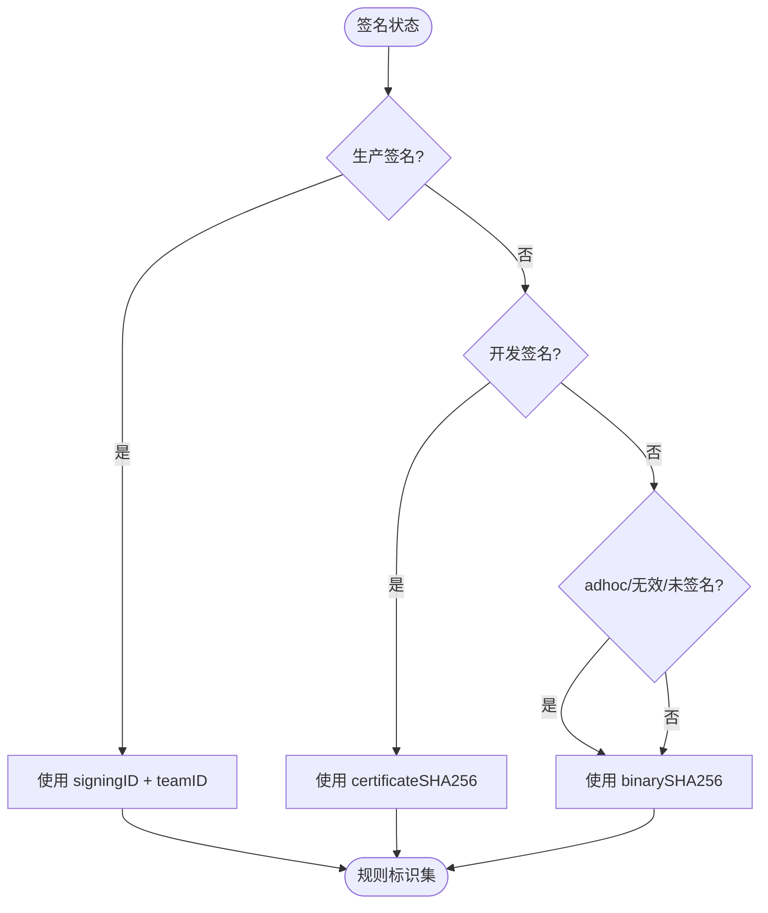
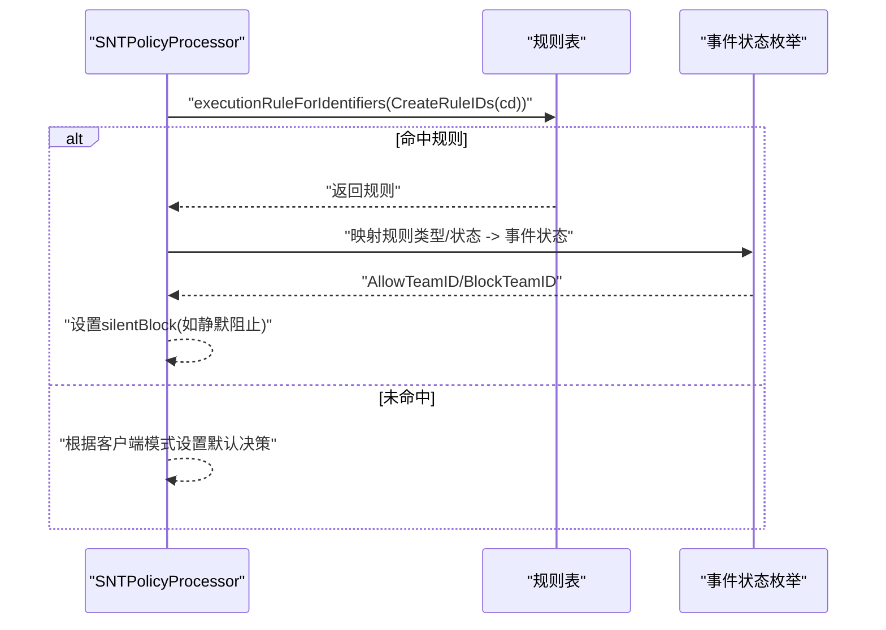
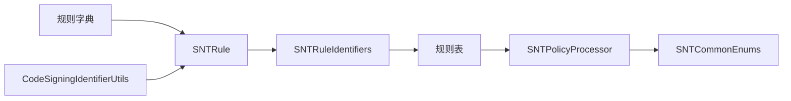

# TeamID规则

<cite>
**本文引用的文件**
- [Source/common/CodeSigningIdentifierUtils.h](file://Source/common/CodeSigningIdentifierUtils.h)
- [Source/common/CodeSigningIdentifierUtils.mm](file://Source/common/CodeSigningIdentifierUtils.mm)
- [Source/common/SNTRule.h](file://Source/common/SNTRule.h)
- [Source/common/SNTRule.mm](file://Source/common/SNTRule.mm)
- [Source/common/SNTRuleIdentifiers.h](file://Source/common/SNTRuleIdentifiers.h)
- [Source/common/SNTRuleIdentifiers.mm](file://Source/common/SNTRuleIdentifiers.mm)
- [Source/common/SNTCommonEnums.h](file://Source/common/SNTCommonEnums.h)
- [Source/santad/SNTPolicyProcessor.h](file://Source/santad/SNTPolicyProcessor.h)
- [Source/santad/SNTPolicyProcessor.mm](file://Source/santad/SNTPolicyProcessor.mm)
- [Source/santad/SNTPolicyProcessorTest.mm](file://Source/santad/SNTPolicyProcessorTest.mm)
- [Source/common/SNTConfigurator.h](file://Source/common/SNTConfigurator.h)
- [Source/common/SNTSyncConstants.h](file://Source/common/SNTSyncConstants.h)
- [Source/santad/testdata/binaryrules/banned_teamid.c](file://Source/santad/testdata/binaryrules/banned_teamid.c)
</cite>

## 目录
1. [简介](#简介)
2. [项目结构](#项目结构)
3. [核心组件](#核心组件)
4. [架构总览](#架构总览)
5. [组件详解](#组件详解)
6. [依赖关系分析](#依赖关系分析)
7. [性能考量](#性能考量)
8. [故障排查指南](#故障排查指南)
9. [结论](#结论)
10. [附录](#附录)

## 简介
本文件面向Santa的TeamID规则系统，系统性阐述TeamID（团队标识符）规则的工作机制、获取与验证流程、匹配算法以及在企业环境中的典型应用场景。内容覆盖从规则定义、解析与规范化、到策略决策与事件状态映射的完整链路，并提供配置示例、最佳实践、性能优化建议与常见问题排查方法。

## 项目结构
围绕TeamID规则的关键代码分布在公共工具层与守护进程策略层：
- 公共工具层：负责TeamID格式校验、签名ID拆分、规则类型与事件状态枚举等。
- 守护进程策略层：负责根据规则表与执行上下文生成决策，将TeamID规则映射为具体事件状态。

**图表来源**
- [Source/common/CodeSigningIdentifierUtils.h](file://Source/common/CodeSigningIdentifierUtils.h#L1-L44)
- [Source/common/CodeSigningIdentifierUtils.mm](file://Source/common/CodeSigningIdentifierUtils.mm#L1-L63)
- [Source/common/SNTRule.h](file://Source/common/SNTRule.h#L1-L129)
- [Source/common/SNTRule.mm](file://Source/common/SNTRule.mm#L1-L200)
- [Source/common/SNTRuleIdentifiers.h](file://Source/common/SNTRuleIdentifiers.h#L1-L62)
- [Source/common/SNTRuleIdentifiers.mm](file://Source/common/SNTRuleIdentifiers.mm#L1-L117)
- [Source/common/SNTCommonEnums.h](file://Source/common/SNTCommonEnums.h#L60-L125)
- [Source/santad/SNTPolicyProcessor.h](file://Source/santad/SNTPolicyProcessor.h#L1-L77)
- [Source/santad/SNTPolicyProcessor.mm](file://Source/santad/SNTPolicyProcessor.mm#L1-L200)

**章节来源**
- [Source/common/CodeSigningIdentifierUtils.h](file://Source/common/CodeSigningIdentifierUtils.h#L1-L44)
- [Source/common/CodeSigningIdentifierUtils.mm](file://Source/common/CodeSigningIdentifierUtils.mm#L1-L63)
- [Source/common/SNTRule.h](file://Source/common/SNTRule.h#L1-L129)
- [Source/common/SNTRule.mm](file://Source/common/SNTRule.mm#L1-L200)
- [Source/common/SNTRuleIdentifiers.h](file://Source/common/SNTRuleIdentifiers.h#L1-L62)
- [Source/common/SNTRuleIdentifiers.mm](file://Source/common/SNTRuleIdentifiers.mm#L1-L117)
- [Source/common/SNTCommonEnums.h](file://Source/common/SNTCommonEnums.h#L60-L125)
- [Source/santad/SNTPolicyProcessor.h](file://Source/santad/SNTPolicyProcessor.h#L1-L77)
- [Source/santad/SNTPolicyProcessor.mm](file://Source/santad/SNTPolicyProcessor.mm#L1-L200)

## 核心组件
- TeamID格式与签名ID辅助工具
  - TeamID长度固定为10个字符，仅允许字母数字，强制大写；支持“platform”前缀或“TeamID:SigningID”格式。
- 规则对象与规范化
  - 支持TEAMID类型的规则，对identifier进行长度与字符集校验，并统一大小写；同时兼容其他规则类型。
- 规则匹配标识集
  - 将cdhash、二进制sha256、signingID、证书sha256、teamID组合为规则匹配集，并按签名状态降级选择更宽松的标识集合。
- 策略处理器与事件状态映射
  - 将规则类型与状态映射为事件状态（允许/阻止），并处理静默阻止、编译器规则等特殊情况。
- 枚举与常量
  - 定义SNTRuleTypeTeamID、SNTEventStateAllowTeamID、SNTEventStateBlockTeamID等关键枚举值。

**章节来源**
- [Source/common/CodeSigningIdentifierUtils.h](file://Source/common/CodeSigningIdentifierUtils.h#L1-L44)
- [Source/common/CodeSigningIdentifierUtils.mm](file://Source/common/CodeSigningIdentifierUtils.mm#L1-L63)
- [Source/common/SNTRule.mm](file://Source/common/SNTRule.mm#L60-L160)
- [Source/common/SNTRuleIdentifiers.mm](file://Source/common/SNTRuleIdentifiers.mm#L40-L80)
- [Source/common/SNTCommonEnums.h](file://Source/common/SNTCommonEnums.h#L60-L125)
- [Source/santad/SNTPolicyProcessor.mm](file://Source/santad/SNTPolicyProcessor.mm#L180-L210)

## 架构总览
下图展示从规则加载到策略决策的整体流程，重点标注TeamID规则的匹配与事件状态转换。

**图表来源**
- [Source/santad/SNTPolicyProcessor.h](file://Source/santad/SNTPolicyProcessor.h#L40-L77)
- [Source/santad/SNTPolicyProcessor.mm](file://Source/santad/SNTPolicyProcessor.mm#L305-L400)
- [Source/common/SNTCommonEnums.h](file://Source/common/SNTCommonEnums.h#L90-L125)

## 组件详解

### TeamID格式与签名ID辅助工具
- TeamID校验
  - 长度必须为10；字符集仅限字母数字；强制大写。
- 签名ID校验与拆分
  - 支持“platform:SigningID”或“TeamID:SigningID”格式；当为“platform”时，TeamID固定为“platform”，其余部分为SigningID。
- 用途
  - 为TeamID规则的identifier规范化与合法性校验提供基础能力。

**图表来源**
- [Source/common/CodeSigningIdentifierUtils.mm](file://Source/common/CodeSigningIdentifierUtils.mm#L20-L31)

**章节来源**
- [Source/common/CodeSigningIdentifierUtils.h](file://Source/common/CodeSigningIdentifierUtils.h#L1-L44)
- [Source/common/CodeSigningIdentifierUtils.mm](file://Source/common/CodeSigningIdentifierUtils.mm#L20-L63)

### 规则对象与TeamID规则规范化
- 规则初始化与字典解析
  - 支持通过字典初始化规则，自动规范化键名大小写与策略字符串大小写；识别规则类型TEAMID。
- TeamID规则规范化
  - 对identifier进行长度与字符集校验；强制大写；若非法则返回错误。
- 其他规则类型对比
  - Binary/Certificate/SigningID/CDHash等类型有各自的长度与字符集要求，确保唯一性与一致性。

**图表来源**
- [Source/common/SNTRule.h](file://Source/common/SNTRule.h#L1-L129)
- [Source/common/SNTRule.mm](file://Source/common/SNTRule.mm#L60-L160)
- [Source/common/SNTCommonEnums.h](file://Source/common/SNTCommonEnums.h#L60-L82)

**章节来源**
- [Source/common/SNTRule.h](file://Source/common/SNTRule.h#L1-L129)
- [Source/common/SNTRule.mm](file://Source/common/SNTRule.mm#L60-L160)
- [Source/common/SNTCommonEnums.h](file://Source/common/SNTCommonEnums.h#L60-L82)

### 规则匹配标识集与TeamID参与匹配
- 规则标识集
  - 包含cdhash、二进制sha256、signingID、证书sha256、teamID五类标识；用于规则表查询。
- 签名状态降级策略
  - 按签名状态从最严格到最宽松依次选择标识：生产签名优先匹配signingID与teamID；开发签名可降级至证书sha256；adhoc/无效/未签名仅使用二进制sha256。
- TeamID参与匹配
  - 当存在teamID且符合格式时，作为规则匹配的一部分参与查询。

**图表来源**
- [Source/common/SNTRuleIdentifiers.mm](file://Source/common/SNTRuleIdentifiers.mm#L40-L80)

**章节来源**
- [Source/common/SNTRuleIdentifiers.h](file://Source/common/SNTRuleIdentifiers.h#L1-L62)
- [Source/common/SNTRuleIdentifiers.mm](file://Source/common/SNTRuleIdentifiers.mm#L40-L80)

### 策略处理器与TeamID决策映射
- 决策入口
  - 接收文件信息与配置状态，构建SNTCachedDecision，填充签名信息（teamID、signingID等）。
- 规则匹配与事件状态映射
  - 若命中规则，按规则类型与状态映射为事件状态：ALLOWLIST对应SNTEventStateAllowTeamID，BLOCKLIST/SILENT_BLOCKLIST对应SNTEventStateBlockTeamID；静默阻止设置silentBlock标志。
- 默认模式行为
  - Monitor模式：允许未知；Standalone/Lockdown模式：阻断未知。

**图表来源**
- [Source/santad/SNTPolicyProcessor.h](file://Source/santad/SNTPolicyProcessor.h#L40-L77)
- [Source/santad/SNTPolicyProcessor.mm](file://Source/santad/SNTPolicyProcessor.mm#L180-L210)
- [Source/common/SNTCommonEnums.h](file://Source/common/SNTCommonEnums.h#L90-L125)

**章节来源**
- [Source/santad/SNTPolicyProcessor.h](file://Source/santad/SNTPolicyProcessor.h#L40-L77)
- [Source/santad/SNTPolicyProcessor.mm](file://Source/santad/SNTPolicyProcessor.mm#L180-L210)
- [Source/common/SNTCommonEnums.h](file://Source/common/SNTCommonEnums.h#L90-L125)

### 测试与验证
- TeamID规则匹配测试
  - BLOCKLIST/SILENT_BLOCKLIST/ALLOWLIST三种策略均能正确匹配TEAMID规则，并映射到相应事件状态。
- 边界条件测试
  - 非法TeamID（长度不为10、包含非字母数字字符）会被拒绝。

**章节来源**
- [Source/santad/SNTPolicyProcessorTest.mm](file://Source/santad/SNTPolicyProcessorTest.mm#L391-L462)
- [Source/common/SNTRuleTest.mm](file://Source/common/SNTRuleTest.mm#L100-L142)

## 依赖关系分析
- 组件耦合
  - SNTPolicyProcessor依赖规则表与枚举；规则对象独立于策略层，便于复用。
  - CodeSigningIdentifierUtils为TeamID/SigningID提供通用校验，被规则与策略层间接使用。
- 关键依赖链
  - 规则字典 -> SNTRule规范化 -> SNTRuleIdentifiers标识集 -> 规则表查询 -> SNTPolicyProcessor决策 -> 事件状态映射。

**图表来源**
- [Source/common/SNTRule.mm](file://Source/common/SNTRule.mm#L254-L365)
- [Source/common/SNTRuleIdentifiers.mm](file://Source/common/SNTRuleIdentifiers.mm#L40-L80)
- [Source/santad/SNTPolicyProcessor.mm](file://Source/santad/SNTPolicyProcessor.mm#L360-L400)
- [Source/common/SNTCommonEnums.h](file://Source/common/SNTCommonEnums.h#L60-L125)
- [Source/common/CodeSigningIdentifierUtils.mm](file://Source/common/CodeSigningIdentifierUtils.mm#L20-L63)

**章节来源**
- [Source/common/SNTRule.mm](file://Source/common/SNTRule.mm#L254-L365)
- [Source/common/SNTRuleIdentifiers.mm](file://Source/common/SNTRuleIdentifiers.mm#L40-L80)
- [Source/santad/SNTPolicyProcessor.mm](file://Source/santad/SNTPolicyProcessor.mm#L360-L400)
- [Source/common/SNTCommonEnums.h](file://Source/common/SNTCommonEnums.h#L60-L125)
- [Source/common/CodeSigningIdentifierUtils.mm](file://Source/common/CodeSigningIdentifierUtils.mm#L20-L63)

## 性能考量
- 规则匹配降级策略
  - 在较低签名状态下减少匹配字段数量，降低规则表查询开销。
- 缓存与传输
  - 事件状态与规则元数据可用于日志与同步；可通过配置项控制日志格式与上传策略。
- 计算复杂度
  - TeamID规则本身为常量时间匹配；整体性能主要受规则表查询与签名信息解析影响。

[本节为通用性能讨论，不直接分析具体文件]

## 故障排查指南
- TeamID非法
  - 现象：规则创建失败或被拒绝。
  - 排查：确认identifier长度为10且仅包含字母数字，必要时强制大写。
- 策略未生效
  - 现象：执行仍被阻断或允许。
  - 排查：确认规则类型为TEAMID，策略为ALLOWLIST/BLOCKLIST/SILENT_BLOCKLIST之一；检查客户端模式（Monitor/Stand-Alone/Lockdown）。
- 签名信息缺失
  - 现象：未检测到teamID/signingID。
  - 排查：确认二进制已签名；若签名无效或未签名，系统可能忽略相关标识，导致TeamID规则不参与匹配。

**章节来源**
- [Source/common/SNTRule.mm](file://Source/common/SNTRule.mm#L60-L160)
- [Source/common/SNTRuleIdentifiers.mm](file://Source/common/SNTRuleIdentifiers.mm#L40-L80)
- [Source/santad/SNTPolicyProcessor.mm](file://Source/santad/SNTPolicyProcessor.mm#L305-L400)

## 结论
TeamID规则通过严格的格式校验与规范化的规则对象，结合策略处理器的事件状态映射，为企业提供了以团队维度进行应用授权与阻断的高效手段。配合签名状态降级策略与客户端模式，可在不同安全级别下平衡合规与可用性。

[本节为总结性内容，不直接分析具体文件]

## 附录

### TeamID规则应用场景
- 允许特定开发团队的应用
  - 通过ALLOWLIST策略为指定TeamID放行。
- 阻止不受信任团队的软件
  - 通过BLOCKLIST或SILENT_BLOCKLIST策略阻止指定TeamID。
- 与SigningID/证书规则协同
  - 在生产签名场景下，优先使用signingID与teamID组合提升精确度。

[本节为概念性说明，不直接分析具体文件]

### 配置示例与最佳实践
- 规则示例
  - 类型：TEAMID；identifier：10位字母数字；策略：ALLOWLIST/BLOCKLIST/SILENT_BLOCKLIST。
- 最佳实践
  - 使用大写TeamID；避免过宽的通配策略；结合客户端模式与日志策略进行审计与回溯。
- 企业部署建议
  - 在Lockdown模式下集中管理TeamID规则；利用静默阻止减少用户干扰；定期清理过期规则。

[本节为通用指导，不直接分析具体文件]

### 相关常量与枚举
- 规则类型与事件状态
  - SNTRuleTypeTeamID、SNTEventStateAllowTeamID、SNTEventStateBlockTeamID等。

**章节来源**
- [Source/common/SNTCommonEnums.h](file://Source/common/SNTCommonEnums.h#L60-L125)