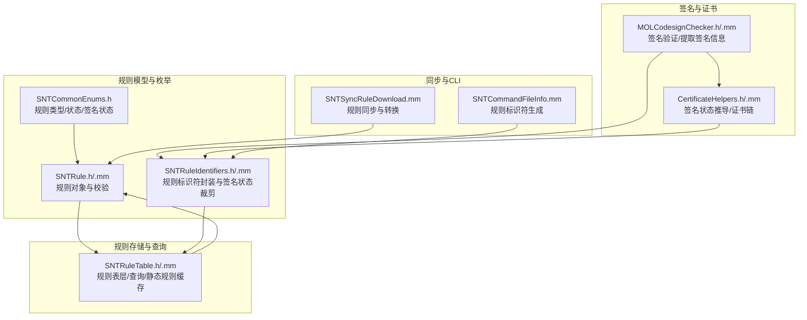
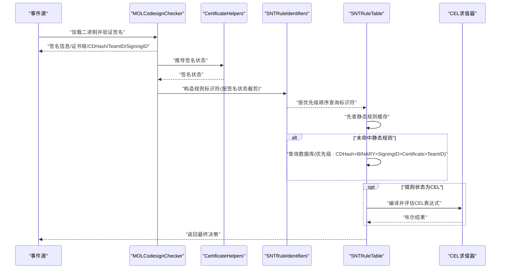
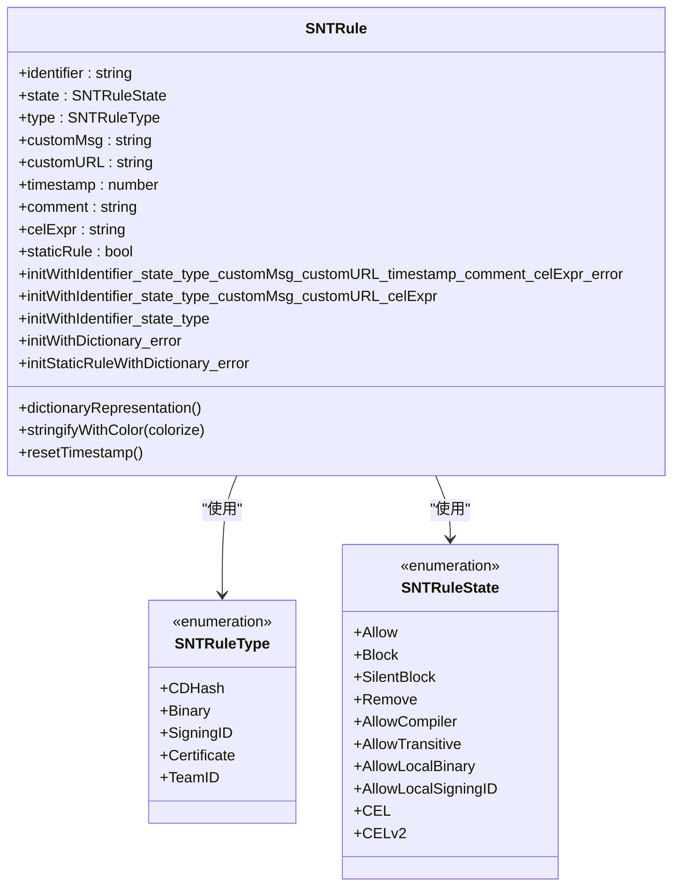
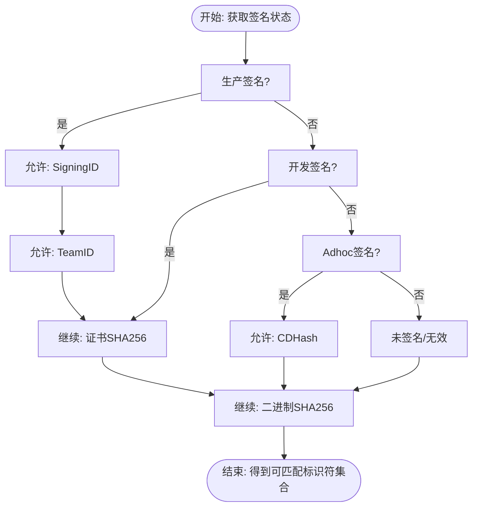
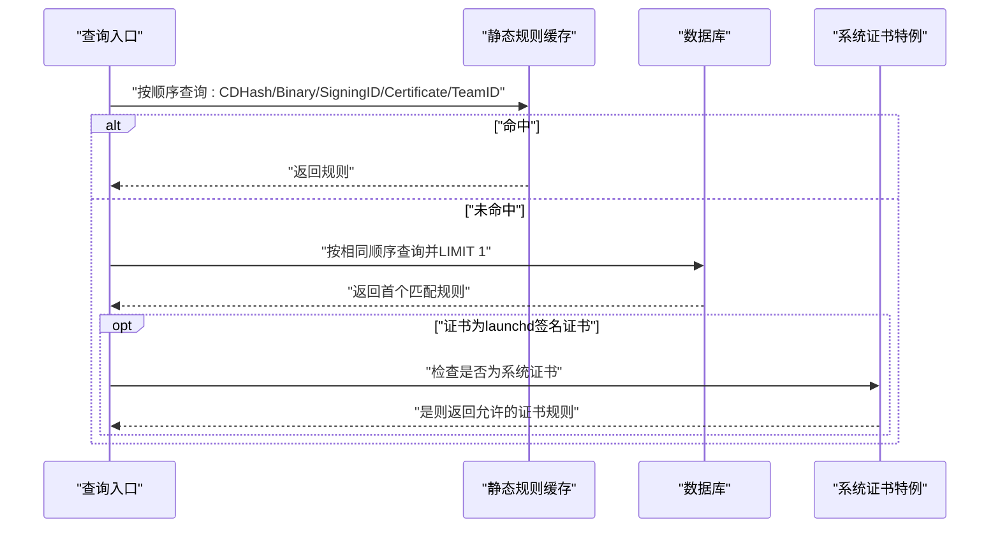
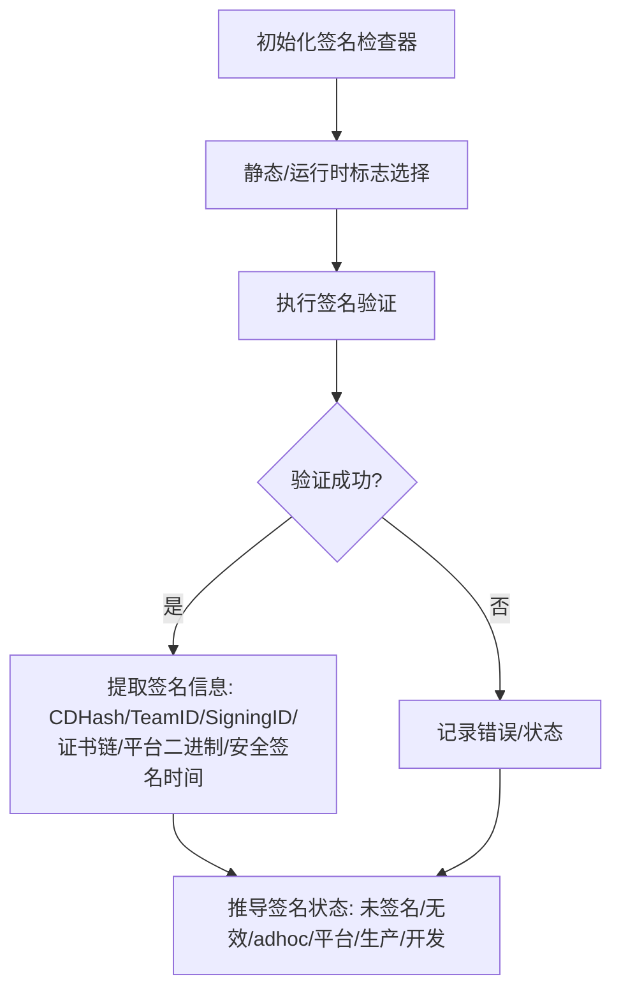
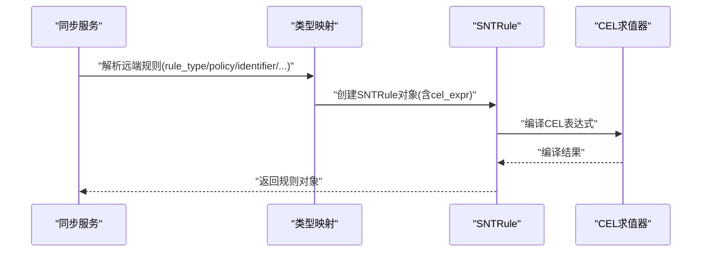
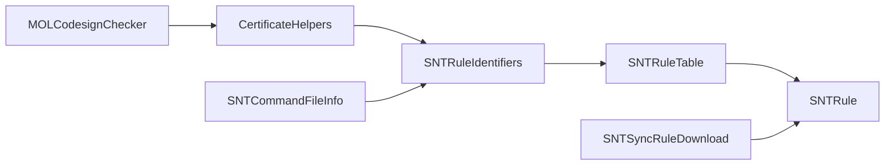

# 基于代码签名的规则系统

<cite>
**本文引用的文件**
- [Source/common/SNTRule.h](file://Source/common/SNTRule.h)
- [Source/common/SNTRule.mm](file://Source/common/SNTRule.mm)
- [Source/common/SNTRuleIdentifiers.h](file://Source/common/SNTRuleIdentifiers.h)
- [Source/common/SNTRuleIdentifiers.mm](file://Source/common/SNTRuleIdentifiers.mm)
- [Source/common/SNTCommonEnums.h](file://Source/common/SNTCommonEnums.h)
- [Source/santad/DataLayer/SNTRuleTable.h](file://Source/santad/DataLayer/SNTRuleTable.h)
- [Source/santad/DataLayer/SNTRuleTable.mm](file://Source/santad/DataLayer/SNTRuleTable.mm)
- [Source/common/MOLCodesignChecker.h](file://Source/common/MOLCodesignChecker.h)
- [Source/common/MOLCodesignChecker.mm](file://Source/common/MOLCodesignChecker.mm)
- [Source/common/CertificateHelpers.h](file://Source/common/CertificateHelpers.h)
- [Source/common/CertificateHelpers.mm](file://Source/common/CertificateHelpers.mm)
- [Source/santasyncservice/SNTSyncRuleDownload.mm](file://Source/santasyncservice/SNTSyncRuleDownload.mm)
- [Source/santactl/Commands/SNTCommandFileInfo.mm](file://Source/santactl/Commands/SNTCommandFileInfo.mm)
- [Source/santad/SNTPolicyProcessorTest.mm](file://Source/santad/SNTPolicyProcessorTest.mm)
- [Source/santad/DataLayer/SNTRuleTableTest.mm](file://Source/santad/DataLayer/SNTRuleTableTest.mm)
- [santasyncservice/testdata/sync_ruledownload_with_cel_1.json](file://Source/santasyncservice/testdata/sync_ruledownload_with_cel_1.json)
</cite>

## 目录
1. [引言](#引言)
2. [项目结构](#项目结构)
3. [核心组件](#核心组件)
4. [架构总览](#架构总览)
5. [详细组件分析](#详细组件分析)
6. [依赖关系分析](#依赖关系分析)
7. [性能考量](#性能考量)
8. [故障排查指南](#故障排查指南)
9. [结论](#结论)
10. [附录：规则类型与配置示例](#附录规则类型与配置示例)

## 引言
本技术文档围绕 Santa 的“基于代码签名的规则系统”展开，系统通过四种规则类型（CDHash、证书、TeamID、SigningID）结合签名状态与优先级策略，实现对可执行文件的授权决策。文档将深入解析：
- 四种规则类型的实现原理与应用场景
- 规则匹配算法与优先级排序机制（最具体规则优先）
- 代码签名验证流程、证书链检查与信任锚点校验
- 规则调试技巧、性能优化建议与常见问题解决

## 项目结构
Santa 的规则系统主要分布在以下模块：
- 规则模型与枚举：定义规则类型、状态、签名状态等核心枚举与规则对象
- 规则标识符：将签名信息映射为规则匹配所需的标识集合，并按签名状态进行裁剪
- 规则表层：负责规则的持久化、查询、静态规则缓存与哈希计算
- 代码签名检查器：从二进制中提取签名信息（CDHash、证书链、TeamID、SigningID 等）
- 证书辅助工具：根据证书链与签名标志推导签名状态
- 同步与导出：从远端同步规则并转换为本地规则对象
- CLI 工具：用于展示文件信息与生成规则标识符

图表来源
- [Source/common/SNTCommonEnums.h](file://Source/common/SNTCommonEnums.h#L50-L120)
- [Source/common/SNTRule.h](file://Source/common/SNTRule.h#L1-L129)
- [Source/common/SNTRule.mm](file://Source/common/SNTRule.mm#L40-L175)
- [Source/common/SNTRuleIdentifiers.h](file://Source/common/SNTRuleIdentifiers.h#L1-L62)
- [Source/common/SNTRuleIdentifiers.mm](file://Source/common/SNTRuleIdentifiers.mm#L34-L80)
- [Source/santad/DataLayer/SNTRuleTable.h](file://Source/santad/DataLayer/SNTRuleTable.h#L1-L172)
- [Source/santad/DataLayer/SNTRuleTable.mm](file://Source/santad/DataLayer/SNTRuleTable.mm#L438-L516)
- [Source/common/MOLCodesignChecker.h](file://Source/common/MOLCodesignChecker.h#L1-L210)
- [Source/common/MOLCodesignChecker.mm](file://Source/common/MOLCodesignChecker.mm#L53-L132)
- [Source/common/CertificateHelpers.h](file://Source/common/CertificateHelpers.h#L1-L68)
- [Source/common/CertificateHelpers.mm](file://Source/common/CertificateHelpers.mm#L88-L104)
- [Source/santasyncservice/SNTSyncRuleDownload.mm](file://Source/santasyncservice/SNTSyncRuleDownload.mm#L322-L347)
- [Source/santactl/Commands/SNTCommandFileInfo.mm](file://Source/santactl/Commands/SNTCommandFileInfo.mm#L397-L411)

章节来源
- [Source/common/SNTCommonEnums.h](file://Source/common/SNTCommonEnums.h#L50-L120)
- [Source/common/SNTRule.h](file://Source/common/SNTRule.h#L1-L129)
- [Source/common/SNTRule.mm](file://Source/common/SNTRule.mm#L40-L175)
- [Source/common/SNTRuleIdentifiers.h](file://Source/common/SNTRuleIdentifiers.h#L1-L62)
- [Source/common/SNTRuleIdentifiers.mm](file://Source/common/SNTRuleIdentifiers.mm#L34-L80)
- [Source/santad/DataLayer/SNTRuleTable.h](file://Source/santad/DataLayer/SNTRuleTable.h#L1-L172)
- [Source/santad/DataLayer/SNTRuleTable.mm](file://Source/santad/DataLayer/SNTRuleTable.mm#L438-L516)
- [Source/common/MOLCodesignChecker.h](file://Source/common/MOLCodesignChecker.h#L1-L210)
- [Source/common/MOLCodesignChecker.mm](file://Source/common/MOLCodesignChecker.mm#L53-L132)
- [Source/common/CertificateHelpers.h](file://Source/common/CertificateHelpers.h#L1-L68)
- [Source/common/CertificateHelpers.mm](file://Source/common/CertificateHelpers.mm#L88-L104)
- [Source/santasyncservice/SNTSyncRuleDownload.mm](file://Source/santasyncservice/SNTSyncRuleDownload.mm#L322-L347)
- [Source/santactl/Commands/SNTCommandFileInfo.mm](file://Source/santactl/Commands/SNTCommandFileInfo.mm#L397-L411)

## 核心组件
- 规则类型与状态
  - 规则类型顺序体现优先级：CDHash > Binary > SigningID > Certificate > TeamID
  - 规则状态涵盖允许、阻断、静默阻断、移除、编译器白名单、瞬态允许、本地二进制/SigningID 白名单、CEL 表达式等
- 规则标识符
  - 将签名信息打包为结构体或对象，支持按签名状态裁剪，确保匹配时遵循“最宽松到最严格”的顺序
- 规则表层
  - 提供静态规则缓存、数据库查询、CEL 表达式编译、规则哈希计算与清理策略
- 代码签名检查器
  - 提取 CDHash、证书链、TeamID、SigningID、平台二进制标记、安全签名时间等关键信息
- 证书辅助工具
  - 基于签名标志与证书 OID 推导签名状态（未签名、无效、adhoc、开发、生产）

章节来源
- [Source/common/SNTCommonEnums.h](file://Source/common/SNTCommonEnums.h#L50-L120)
- [Source/common/SNTRuleIdentifiers.mm](file://Source/common/SNTRuleIdentifiers.mm#L34-L80)
- [Source/santad/DataLayer/SNTRuleTable.mm](file://Source/santad/DataLayer/SNTRuleTable.mm#L438-L516)
- [Source/common/MOLCodesignChecker.h](file://Source/common/MOLCodesignChecker.h#L70-L120)
- [Source/common/CertificateHelpers.mm](file://Source/common/CertificateHelpers.mm#L88-L104)

## 架构总览
下图展示了从二进制到最终决策的关键路径：签名提取 → 标识符生成 → 静态规则命中 → 数据库规则查询 → 可选 CEL 表达式评估 → 决策返回。

图表来源
- [Source/common/MOLCodesignChecker.mm](file://Source/common/MOLCodesignChecker.mm#L53-L132)
- [Source/common/CertificateHelpers.mm](file://Source/common/CertificateHelpers.mm#L88-L104)
- [Source/common/SNTRuleIdentifiers.mm](file://Source/common/SNTRuleIdentifiers.mm#L34-L80)
- [Source/santad/DataLayer/SNTRuleTable.mm](file://Source/santad/DataLayer/SNTRuleTable.mm#L438-L516)
- [Source/common/SNTRule.mm](file://Source/common/SNTRule.mm#L576-L617)

## 详细组件分析

### 组件A：规则对象与规则类型
- 规则对象负责：
  - 标识符格式校验（二进制/证书为十六进制小写；TeamID 为长度与字符集约束；SigningID 为 TeamID:SigningID 组合）
  - 策略字符串归一化（大小写处理）
  - 字典初始化与序列化
  - CEL 表达式合法性校验（当状态为 CEL）
- 规则类型与优先级：
  - 类型枚举顺序即优先级顺序：CDHash > Binary > SigningID > Certificate > TeamID
  - 该顺序在数据库查询与静态规则缓存命中中保持一致

图表来源
- [Source/common/SNTRule.h](file://Source/common/SNTRule.h#L1-L129)
- [Source/common/SNTRule.mm](file://Source/common/SNTRule.mm#L40-L175)
- [Source/common/SNTCommonEnums.h](file://Source/common/SNTCommonEnums.h#L50-L120)

章节来源
- [Source/common/SNTRule.h](file://Source/common/SNTRule.h#L1-L129)
- [Source/common/SNTRule.mm](file://Source/common/SNTRule.mm#L40-L175)
- [Source/common/SNTCommonEnums.h](file://Source/common/SNTCommonEnums.h#L50-L120)

### 组件B：规则标识符与签名状态裁剪
- 规则标识符结构体包含五类标识：CDHash、二进制SHA256、SigningID、证书SHA256、TeamID
- 按签名状态裁剪：
  - 生产签名：允许使用 SigningID 与 TeamID
  - 开发签名：允许使用证书SHA256，但不使用 TeamID/SigningID（避免误放行）
  - Adhoc 签名：允许使用 CDHash
  - 未签名/无效：仅允许使用二进制SHA256
- 该裁剪保证了“最宽松到最严格”的匹配顺序，避免跨状态误匹配

图表来源
- [Source/common/SNTRuleIdentifiers.mm](file://Source/common/SNTRuleIdentifiers.mm#L34-L80)

章节来源
- [Source/common/SNTRuleIdentifiers.h](file://Source/common/SNTRuleIdentifiers.h#L1-L62)
- [Source/common/SNTRuleIdentifiers.mm](file://Source/common/SNTRuleIdentifiers.mm#L34-L80)

### 组件C：规则查询与优先级排序
- 查询顺序（最具体优先）：
  1) 静态规则缓存命中（CDHash → Binary → SigningID → Certificate → TeamID）
  2) 数据库查询（同顺序），LIMIT 1 保证首个匹配即返回
- 特殊处理：
  - 若未匹配且证书为系统“Software Signing”证书，则直接允许（用于关键系统二进制）
- 该设计确保高命中率与低延迟

图表来源
- [Source/santad/DataLayer/SNTRuleTable.mm](file://Source/santad/DataLayer/SNTRuleTable.mm#L438-L516)

章节来源
- [Source/santad/DataLayer/SNTRuleTable.h](file://Source/santad/DataLayer/SNTRuleTable.h#L83-L90)
- [Source/santad/DataLayer/SNTRuleTable.mm](file://Source/santad/DataLayer/SNTRuleTable.mm#L438-L516)

### 组件D：代码签名验证与证书链检查
- 验证标志与性能权衡：
  - 静态验证关闭资源校验、启用嵌套代码校验与全架构检查，并禁止网络访问，显著提升性能
- 关键签名信息提取：
  - CDHash、TeamID、SigningID、平台二进制标记、安全签名时间、证书链
- 证书链与信任锚点：
  - 通过证书链数组与证书 OID 判断是否为生产签名证书
  - 签名状态推导：未签名、无效、adhoc、平台/生产、开发

图表来源
- [Source/common/MOLCodesignChecker.mm](file://Source/common/MOLCodesignChecker.mm#L53-L132)
- [Source/common/MOLCodesignChecker.h](file://Source/common/MOLCodesignChecker.h#L70-L120)
- [Source/common/CertificateHelpers.mm](file://Source/common/CertificateHelpers.mm#L88-L104)

章节来源
- [Source/common/MOLCodesignChecker.mm](file://Source/common/MOLCodesignChecker.mm#L53-L132)
- [Source/common/MOLCodesignChecker.h](file://Source/common/MOLCodesignChecker.h#L70-L120)
- [Source/common/CertificateHelpers.mm](file://Source/common/CertificateHelpers.mm#L88-L104)

### 组件E：CEL 表达式规则与同步
- 规则同步：
  - 将远端规则转换为本地 SNTRule 对象，自动映射 rule_type → SNTRuleType，支持 custom_msg/custom_url/cel_expr
- CEL 编译与评估：
  - 当规则状态为 CEL/CELv2 时，尝试编译表达式；失败则记录错误
  - 在规则表层与静态规则更新时均进行编译校验

图表来源
- [Source/santasyncservice/SNTSyncRuleDownload.mm](file://Source/santasyncservice/SNTSyncRuleDownload.mm#L322-L347)
- [Source/common/SNTRule.mm](file://Source/common/SNTRule.mm#L576-L617)

章节来源
- [Source/santasyncservice/SNTSyncRuleDownload.mm](file://Source/santasyncservice/SNTSyncRuleDownload.mm#L322-L347)
- [Source/common/SNTRule.mm](file://Source/common/SNTRule.mm#L576-L617)
- [santasyncservice/testdata/sync_ruledownload_with_cel_1.json](file://Source/santasyncservice/testdata/sync_ruledownload_with_cel_1.json#L1-L16)

### 组件F：CLI 与规则标识符生成
- CLI 展示文件信息时，会根据签名状态生成规则标识符集合，并在开发签名场景下提供“若为生产签名”的替代匹配路径，便于调试与规则制定

章节来源
- [Source/santactl/Commands/SNTCommandFileInfo.mm](file://Source/santactl/Commands/SNTCommandFileInfo.mm#L397-L411)

## 依赖关系分析
- 组件耦合与内聚
  - 规则对象与枚举高度内聚，规则表层依赖其进行持久化与查询
  - 规则标识符与签名状态紧密耦合，确保匹配顺序正确
  - 代码签名检查器与证书辅助工具解耦，前者专注提取，后者专注状态推导
- 外部依赖
  - 安全框架（签名验证、证书 OID 查询）
  - 数据库（FMDB）与哈希（xxHash）用于规则存储与一致性校验
- 潜在循环依赖
  - 无直接循环；查询路径清晰：签名 → 标识符 → 规则表层 → 决策

图表来源
- [Source/common/MOLCodesignChecker.h](file://Source/common/MOLCodesignChecker.h#L1-L210)
- [Source/common/CertificateHelpers.h](file://Source/common/CertificateHelpers.h#L1-L68)
- [Source/common/SNTRuleIdentifiers.h](file://Source/common/SNTRuleIdentifiers.h#L1-L62)
- [Source/santad/DataLayer/SNTRuleTable.h](file://Source/santad/DataLayer/SNTRuleTable.h#L1-L172)
- [Source/common/SNTRule.h](file://Source/common/SNTRule.h#L1-L129)
- [Source/santasyncservice/SNTSyncRuleDownload.mm](file://Source/santasyncservice/SNTSyncRuleDownload.mm#L322-L347)
- [Source/santactl/Commands/SNTCommandFileInfo.mm](file://Source/santactl/Commands/SNTCommandFileInfo.mm#L397-L411)

章节来源
- [Source/common/MOLCodesignChecker.h](file://Source/common/MOLCodesignChecker.h#L1-L210)
- [Source/common/CertificateHelpers.h](file://Source/common/CertificateHelpers.h#L1-L68)
- [Source/common/SNTRuleIdentifiers.h](file://Source/common/SNTRuleIdentifiers.h#L1-L62)
- [Source/santad/DataLayer/SNTRuleTable.h](file://Source/santad/DataLayer/SNTRuleTable.h#L1-L172)
- [Source/common/SNTRule.h](file://Source/common/SNTRule.h#L1-L129)
- [Source/santasyncservice/SNTSyncRuleDownload.mm](file://Source/santasyncservice/SNTSyncRuleDownload.mm#L322-L347)
- [Source/santactl/Commands/SNTCommandFileInfo.mm](file://Source/santactl/Commands/SNTCommandFileInfo.mm#L397-L411)

## 性能考量
- 验证标志优化
  - 静态验证禁用资源校验、启用嵌套代码校验与全架构检查，并禁止网络访问，显著降低验证耗时
- 查询路径优化
  - 静态规则缓存命中优先
  - 数据库查询采用一次性多条件查询并 LIMIT 1，避免多余扫描
- CEL 表达式
  - 仅在规则状态为 CEL/CELv2 时编译，失败即短路并记录错误，避免热路径开销
- 哈希与清理
  - 执行规则哈希计算用于一致性校验；清理策略支持移除过期瞬态规则，减少数据库膨胀

章节来源
- [Source/common/MOLCodesignChecker.mm](file://Source/common/MOLCodesignChecker.mm#L53-L132)
- [Source/santad/DataLayer/SNTRuleTable.mm](file://Source/santad/DataLayer/SNTRuleTable.mm#L438-L516)
- [Source/common/SNTRule.mm](file://Source/common/SNTRule.mm#L576-L617)

## 故障排查指南
- 规则无效或缺失
  - 检查规则字典键名大小写与规范化逻辑；确认 rule_type/policy/identifier 是否存在且符合格式要求
  - 参考规则初始化与字典解析逻辑
- CEL 表达式错误
  - 当规则状态为 CEL/CELv2 时，若表达式编译失败，需修正表达式语法或上下文字段
  - 可参考同步与规则表层的编译与错误记录
- 匹配不到预期规则
  - 确认签名状态与标识符裁剪是否导致 TeamID/SigningID 被忽略（开发签名场景）
  - 使用 CLI 生成规则标识符，核对各标识是否与规则匹配
- 证书链与信任锚点
  - 若签名状态为无效或未签名，检查二进制签名有效性与证书链完整性
  - 确保系统信任锚点可用，避免网络访问受限导致的验证异常

章节来源
- [Source/common/SNTRule.mm](file://Source/common/SNTRule.mm#L237-L365)
- [Source/santasyncservice/SNTSyncRuleDownload.mm](file://Source/santasyncservice/SNTSyncRuleDownload.mm#L322-L347)
- [Source/santad/DataLayer/SNTRuleTable.mm](file://Source/santad/DataLayer/SNTRuleTable.mm#L562-L617)
- [Source/santactl/Commands/SNTCommandFileInfo.mm](file://Source/santactl/Commands/SNTCommandFileInfo.mm#L397-L411)
- [Source/common/CertificateHelpers.mm](file://Source/common/CertificateHelpers.mm#L88-L104)

## 结论
Santa 的基于代码签名的规则系统以“最具体规则优先”为核心设计，结合签名状态裁剪与严格的标识符格式校验，实现了高效、可扩展且可审计的授权决策。通过静态规则缓存、数据库查询优化与 CEL 表达式支持，系统在保证安全性的同时兼顾性能与灵活性。

## 附录：规则类型与配置示例
- CDHash 规则
  - 适用场景：针对特定签名指纹的精确控制，适合阻止特定版本或特定构建
  - 示例要点：identifier 为 CDHash（十六进制小写），rule_type 为 C DHASH
- 证书规则
  - 适用场景：基于签发证书的白名单/黑名单，常用于关键系统二进制放行
  - 示例要点：identifier 为证书 SHA256（十六进制小写），rule_type 为 CERTIFICATE
- TeamID 规则
  - 适用场景：对组织或团队发布的应用进行整体管控
  - 示例要点：identifier 为 TeamID（长度与字符集约束，大写），rule_type 为 TEAMID
- SigningID 规则
  - 适用场景：对特定开发者或产品线进行细粒度控制
  - 示例要点：identifier 为 TeamID:SigningID 组合，rule_type 为 SIGNINGID
- 允许特定发布者全部软件
  - 使用 TeamID 或 SigningID 规则，设置 policy 为 ALLOWLIST
- 阻止特定版本的应用程序
  - 使用 CDHash 或 Binary 规则，设置 policy 为 BLOCKLIST 或 SILENTBLOCKLIST
- 使用 CEL 表达式
  - 设置 policy 为 CEL/CELv2，并提供合法的 CEL 表达式，如基于签名时间等条件

章节来源
- [Source/common/SNTRule.mm](file://Source/common/SNTRule.mm#L40-L175)
- [Source/santasyncservice/SNTSyncRuleDownload.mm](file://Source/santasyncservice/SNTSyncRuleDownload.mm#L322-L347)
- [santasyncservice/testdata/sync_ruledownload_with_cel_1.json](file://Source/santasyncservice/testdata/sync_ruledownload_with_cel_1.json#L1-L16)