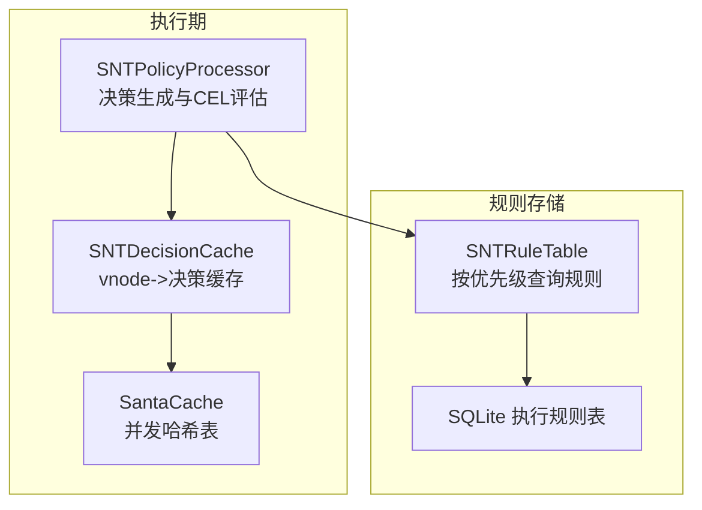
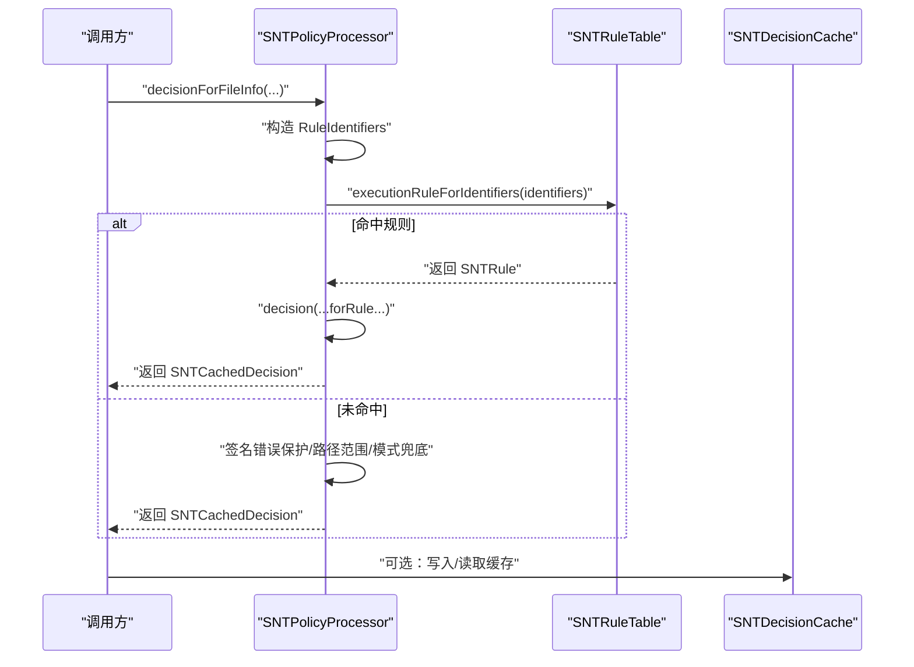
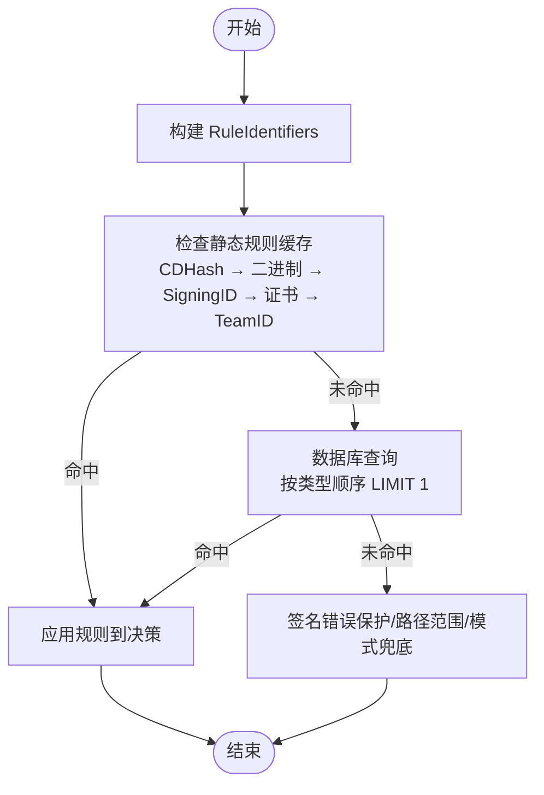
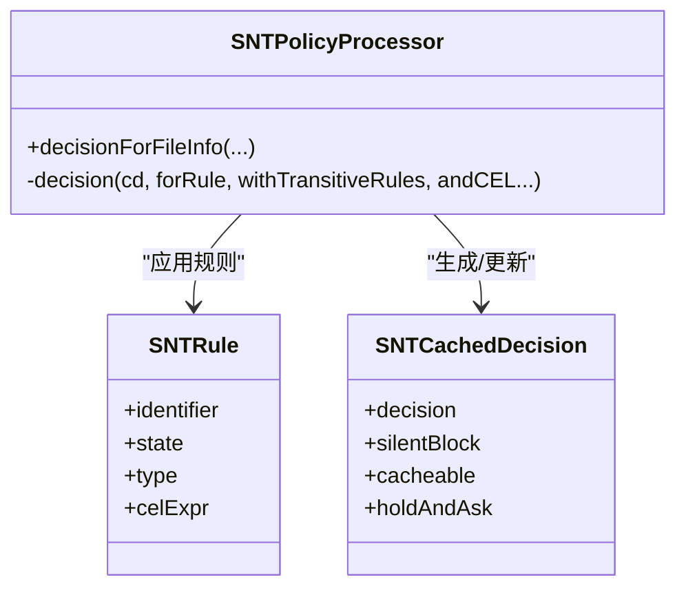
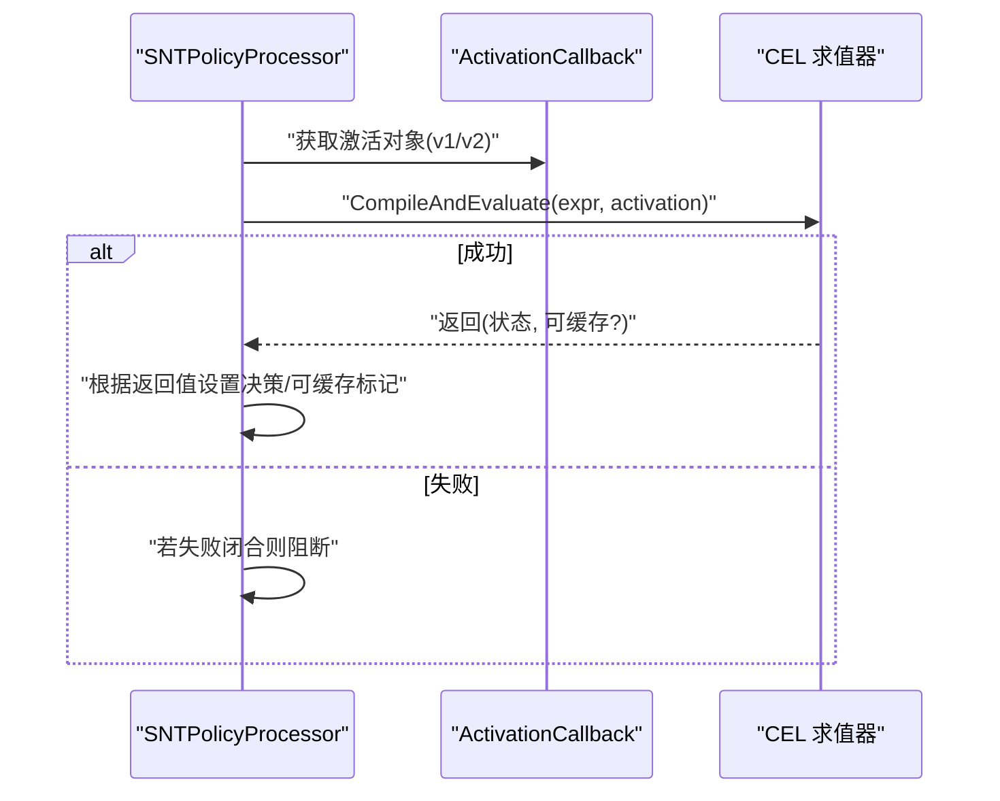
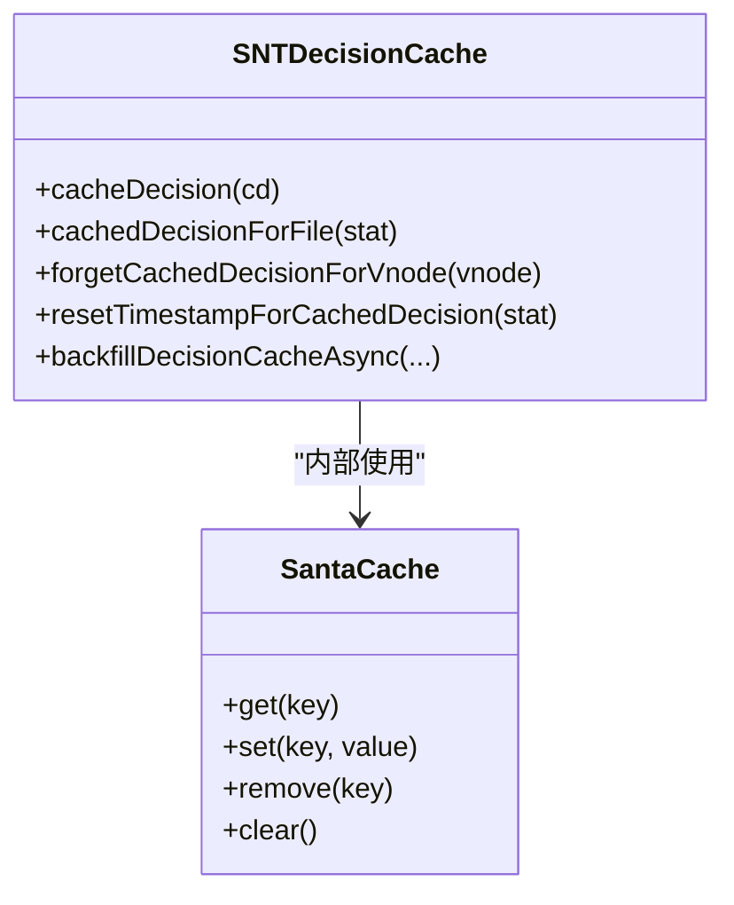
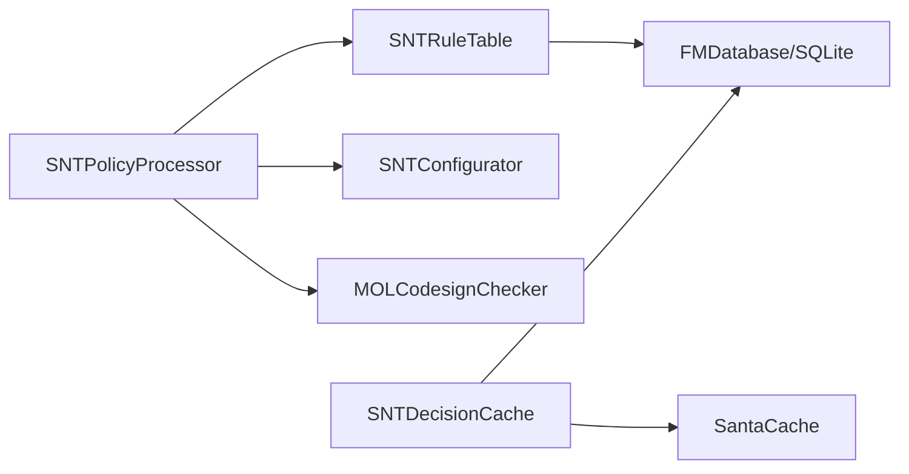

# 规则匹配算法

<cite>
**本文引用的文件**
- [SNTPolicyProcessor.h](file://Source/santad/SNTPolicyProcessor.h)
- [SNTPolicyProcessor.mm](file://Source/santad/SNTPolicyProcessor.mm)
- [SNTRuleTable.mm](file://Source/santad/DataLayer/SNTRuleTable.mm)
- [SNTDecisionCache.h](file://Source/santad/SNTDecisionCache.h)
- [SNTDecisionCache.mm](file://Source/santad/SNTDecisionCache.mm)
- [SantaCache.h](file://Source/common/SantaCache.h)
- [SNTCachedDecision.h](file://Source/common/SNTCachedDecision.h)
- [SNTCommonEnums.h](file://Source/common/SNTCommonEnums.h)
- [SNTRuleIdentifiers.h](file://Source/common/SNTRuleIdentifiers.h)
- [SNTCommandRule.mm](file://Source/santactl/Commands/SNTCommandRule.mm)
- [SNTRule.mm](file://Source/common/SNTRule.mm)
- [SNTRuleTableTest.mm](file://Source/santad/DataLayer/SNTRuleTableTest.mm)
- [SNTPolicyProcessorTest.mm](file://Source/santad/SNTPolicyProcessorTest.mm)
</cite>

## 目录
1. [简介](#简介)
2. [项目结构](#项目结构)
3. [核心组件](#核心组件)
4. [架构总览](#架构总览)
5. [详细组件分析](#详细组件分析)
6. [依赖关系分析](#依赖关系分析)
7. [性能考量](#性能考量)
8. [故障排除指南](#故障排除指南)
9. [结论](#结论)
10. [附录](#附录)

## 简介
本技术文档聚焦 Santa 的“规则匹配算法”，系统阐述多规则类型（CDHash、证书、TeamID、SigningID、二进制 SHA-256）在执行决策中的匹配顺序与优先级机制，解释“最具体规则优先”的实现逻辑与算法流程，并覆盖规则缓存、性能优化与内存管理策略。同时提供调试方法、性能监控与故障排除指南，并讨论该算法的可扩展性与未来演进方向。

## 项目结构
围绕规则匹配的关键代码主要分布在以下模块：
- 决策与匹配核心：SNTPolicyProcessor（决策生成与CEL规则评估）
- 规则查询层：SNTRuleTable（按优先级顺序查询规则）
- 执行期缓存：SNTDecisionCache（基于 vnode 的决策缓存）
- 缓存底层数据结构：SantaCache（高性能并发哈希表）
- 决策载体：SNTCachedDecision（承载一次执行决策及其上下文）
- 枚举与标识：SNTCommonEnums、SNTRuleIdentifiers（规则类型、事件状态、匹配标识）

图表来源
- [SNTPolicyProcessor.mm](file://Source/santad/SNTPolicyProcessor.mm#L305-L473)
- [SNTDecisionCache.mm](file://Source/santad/SNTDecisionCache.mm#L73-L112)
- [SantaCache.h](file://Source/common/SantaCache.h#L48-L110)
- [SNTRuleTable.mm](file://Source/santad/DataLayer/SNTRuleTable.mm#L438-L516)

章节来源
- [SNTPolicyProcessor.h](file://Source/santad/SNTPolicyProcessor.h#L40-L77)
- [SNTRuleTable.mm](file://Source/santad/DataLayer/SNTRuleTable.mm#L438-L516)
- [SNTDecisionCache.h](file://Source/santad/SNTDecisionCache.h#L23-L35)
- [SantaCache.h](file://Source/common/SantaCache.h#L48-L110)

## 核心组件
- 规则类型与优先级
  - 规则类型枚举定义了从最具体到较具体的顺序：CDHash > 二进制 SHA-256 > SigningID > 证书 SHA-256 > TeamID。该顺序直接影响数据库查询与静态规则匹配的优先级。
- 匹配标识体
  - RuleIdentifiers 结构体与 SNTRuleIdentifiers 类用于统一传递一组规则标识，便于一次性查询与匹配。
- 决策生成器
  - SNTPolicyProcessor 负责根据文件信息、签名状态、配置模式生成 SNTCachedDecision；若命中规则则应用规则状态到决策中；支持 CEL v1/v2 表达式动态评估。
- 规则查询器
  - SNTRuleTable 提供 executionRuleForIdentifiers 接口，先查静态规则缓存，再查数据库，严格遵循“最具体优先”的顺序。
- 执行期缓存
  - SNTDecisionCache 基于 vnode 的并发缓存，使用 SantaCache 实现高性能读写；支持回填与时间戳重置策略。

章节来源
- [SNTCommonEnums.h](file://Source/common/SNTCommonEnums.h#L50-L66)
- [SNTRuleIdentifiers.h](file://Source/common/SNTRuleIdentifiers.h#L31-L61)
- [SNTPolicyProcessor.mm](file://Source/santad/SNTPolicyProcessor.mm#L305-L473)
- [SNTRuleTable.mm](file://Source/santad/DataLayer/SNTRuleTable.mm#L438-L516)
- [SNTDecisionCache.mm](file://Source/santad/SNTDecisionCache.mm#L73-L112)
- [SantaCache.h](file://Source/common/SantaCache.h#L48-L110)

## 架构总览
规则匹配的整体流程如下：
- 输入：SNTFileInfo 或进程目标信息（含签名标志、CDHash、SigningID、TeamID 等）
- 步骤：
  1) 生成 RuleIdentifiers（含签名状态影响的可选字段）
  2) 查询规则：先查静态规则缓存，再查数据库（严格按优先级顺序）
  3) 若命中规则：应用规则状态到 SNTCachedDecision；若为 CEL 则进行表达式求值
  4) 若未命中：检查签名错误保护、路径范围控制、客户端模式等兜底策略
  5) 将决策写入或复用执行期缓存，返回最终决策

图表来源
- [SNTPolicyProcessor.mm](file://Source/santad/SNTPolicyProcessor.mm#L305-L473)
- [SNTRuleTable.mm](file://Source/santad/DataLayer/SNTRuleTable.mm#L438-L516)
- [SNTDecisionCache.mm](file://Source/santad/SNTDecisionCache.mm#L73-L112)

## 详细组件分析

### 组件A：规则优先级与匹配顺序
- 数据库查询顺序
  - 查询语句以固定顺序列出五种规则类型，且通过 LIMIT 1 保证“最先命中的即优先生效”。注释明确指出“最具体优先”的预期顺序：CDHash > 二进制 SHA-256 > SigningID > 证书 SHA-256 > TeamID。
- 静态规则匹配
  - 在数据库查询前，先按相同顺序检查静态规则缓存，确保静态规则与数据库行为一致。
- 测试验证
  - 单元测试验证了当同时存在多种候选标识时，优先选择 CDHash 规则，体现了“最具体优先”。

图表来源
- [SNTRuleTable.mm](file://Source/santad/DataLayer/SNTRuleTable.mm#L438-L516)
- [SNTRuleTableTest.mm](file://Source/santad/DataLayer/SNTRuleTableTest.mm#L491-L508)

章节来源
- [SNTRuleTable.mm](file://Source/santad/DataLayer/SNTRuleTable.mm#L438-L516)
- [SNTRuleTableTest.mm](file://Source/santad/DataLayer/SNTRuleTableTest.mm#L491-L508)

### 组件B：最具体规则优先的实现逻辑
- 规则类型优先级
  - 枚举定义了 SNTRuleType 的数值顺序，确保排序与优先级一致。
- 决策映射
  - decision(...) 方法内部维护一个规则类型与状态到事件状态的映射表，直接将规则结果映射为具体的事件状态（如允许/阻止/静默阻止/编译器允许等）。
- 特殊分支处理
  - 对于“编译器规则”和“瞬态允许规则”，会根据配置决定是否将其视为有效匹配；否则回退为未命中规则。

图表来源
- [SNTPolicyProcessor.mm](file://Source/santad/SNTPolicyProcessor.mm#L105-L258)
- [SNTCommonEnums.h](file://Source/common/SNTCommonEnums.h#L50-L66)

章节来源
- [SNTPolicyProcessor.mm](file://Source/santad/SNTPolicyProcessor.mm#L105-L258)
- [SNTCommonEnums.h](file://Source/common/SNTCommonEnums.h#L50-L66)

### 组件C：CEL 规则评估与失败闭合
- 支持 v1 与 v2 两种 CEL 表达式版本，分别由对应的求值器编译并评估。
- 当 CEL 表达式评估失败且配置为“失败闭合”时，决策被强制阻断；否则根据表达式返回值映射到允许/阻止/编译器允许/静默阻止等状态。
- 返回值可指示决策是否可缓存，从而避免不必要的缓存写入。

图表来源
- [SNTPolicyProcessor.mm](file://Source/santad/SNTPolicyProcessor.mm#L115-L181)

章节来源
- [SNTPolicyProcessor.mm](file://Source/santad/SNTPolicyProcessor.mm#L115-L181)

### 组件D：规则缓存机制与性能优化
- 执行期缓存
  - SNTDecisionCache 使用 SantaCache<SantaVnode, SNTCachedDecision*> 实现并发缓存，键为 vnode，值为决策对象；支持 get/set/remove/foreach 等操作。
  - 缓存容量达到上限时自动清空，避免内存膨胀。
- 时间戳重置
  - 对于通过瞬态允许规则放行的执行，定期（每小时）更新对应规则的时间戳，避免频繁写库。
- 回填策略
  - 后台队列异步扫描运行中的进程，填充部分已知信息但不参与真实决策的伪决策，减少首次匹配延迟。

图表来源
- [SNTDecisionCache.h](file://Source/santad/SNTDecisionCache.h#L23-L35)
- [SNTDecisionCache.mm](file://Source/santad/SNTDecisionCache.mm#L73-L112)
- [SantaCache.h](file://Source/common/SantaCache.h#L48-L110)

章节来源
- [SNTDecisionCache.mm](file://Source/santad/SNTDecisionCache.mm#L73-L112)
- [SantaCache.h](file://Source/common/SantaCache.h#L48-L110)

### 组件E：内存管理与并发安全
- 并发模型
  - 每个桶独立加锁，降低锁竞争；clear 时采用专用 clear_bucket_ 防止并发清理冲突。
- 容量与扩容
  - 初始化时根据最大容量与每桶目标条数计算桶数量，保证负载均衡；超过上限自动清空，确保内存可控。
- 字段生命周期
  - 决策对象持有签名链、团队 ID、SigningID、CDHash 等信息，生命周期受缓存与对象所有权管理。

章节来源
- [SantaCache.h](file://Source/common/SantaCache.h#L48-L110)
- [SantaCache.h](file://Source/common/SantaCache.h#L320-L416)
- [SNTCachedDecision.h](file://Source/common/SNTCachedDecision.h#L23-L61)

### 组件F：命令行与规则类型输入
- 命令行工具支持通过参数指定规则类型（证书、TeamID、SigningID、CDHash、二进制 SHA-256），并在添加/删除规则时打印对应类型与标识。

章节来源
- [SNTCommandRule.mm](file://Source/santactl/Commands/SNTCommandRule.mm#L179-L207)
- [SNTCommandRule.mm](file://Source/santactl/Commands/SNTCommandRule.mm#L427-L446)

## 依赖关系分析
- SNTPolicyProcessor 依赖 SNTRuleTable 进行规则查询，依赖 SNTConfigurator 获取配置（如是否启用瞬态规则、失败闭合等），依赖 MOLCodesignChecker 提取签名信息。
- SNTRuleTable 依赖 SQLite 存储与 FMDB 访问，内部维护静态规则缓存与关键系统二进制白名单。
- SNTDecisionCache 依赖 SantaCache 实现高性能并发缓存，并通过数据库控制器更新瞬态规则时间戳。

图表来源
- [SNTPolicyProcessor.mm](file://Source/santad/SNTPolicyProcessor.mm#L305-L473)
- [SNTRuleTable.mm](file://Source/santad/DataLayer/SNTRuleTable.mm#L562-L600)
- [SNTDecisionCache.mm](file://Source/santad/SNTDecisionCache.mm#L73-L112)

章节来源
- [SNTPolicyProcessor.mm](file://Source/santad/SNTPolicyProcessor.mm#L305-L473)
- [SNTRuleTable.mm](file://Source/santad/DataLayer/SNTRuleTable.mm#L562-L600)
- [SNTDecisionCache.mm](file://Source/santad/SNTDecisionCache.mm#L73-L112)

## 性能考量
- 查询顺序与索引利用
  - 数据库查询按类型顺序组合，配合 LIMIT 1，避免全表扫描；注释说明无需额外 ORDER BY，因为 SQLite 的执行顺序可满足“最具体优先”。
- 静态规则缓存
  - 先查静态规则缓存，显著减少数据库访问次数，尤其在大量规则场景下收益明显。
- 并发缓存
  - SantaCache 采用分桶锁与容量上限策略，避免热点导致的锁争用与内存膨胀。
- 时间戳更新节流
  - 对瞬态允许规则的时间戳更新进行每小时节流，降低数据库写入频率。
- 回填策略
  - 异步回填运行中进程的伪决策，减少实时匹配压力。

章节来源
- [SNTRuleTable.mm](file://Source/santad/DataLayer/SNTRuleTable.mm#L472-L516)
- [SNTDecisionCache.mm](file://Source/santad/SNTDecisionCache.mm#L93-L112)
- [SantaCache.h](file://Source/common/SantaCache.h#L48-L110)

## 故障排除指南
- 规则未生效
  - 检查规则类型与标识是否正确（命令行工具可辅助确认类型与标识）。
  - 确认规则优先级：CDHash > 二进制 SHA-256 > SigningID > 证书 SHA-256 > TeamID，若更具体的规则存在，更宽泛规则不会生效。
- CEL 规则失败
  - 若配置为失败闭合，CEL 失败将导致阻断；否则根据表达式返回值决定允许/阻止等。
- 缓存命中异常
  - 使用 SNTDecisionCache 的回填功能观察是否存在伪决策；检查缓存容量与清理策略。
- 规则变更后缓存刷新
  - 新增/删除规则可能触发缓存刷新策略（例如批量新增阻断规则时会触发刷新），关注日志与指标变化。

章节来源
- [SNTCommandRule.mm](file://Source/santactl/Commands/SNTCommandRule.mm#L179-L207)
- [SNTRuleTable.mm](file://Source/santad/DataLayer/SNTRuleTable.mm#L756-L788)
- [SNTPolicyProcessorTest.mm](file://Source/santad/SNTPolicyProcessorTest.mm#L100-L169)

## 结论
Santa 的规则匹配算法以“最具体规则优先”为核心设计，通过严格的规则类型顺序与静态规则缓存，结合高效的并发缓存与数据库查询，实现了高吞吐、低延迟的执行决策能力。CEL 规则提供了强大的动态扩展能力，同时保留失败闭合的安全策略。整体架构清晰、性能优化到位，具备良好的可维护性与扩展性。

## 附录

### A. 规则类型与事件状态映射
- 映射关系由决策函数内部的查找表维护，确保规则类型与状态能准确转换为事件状态（允许/阻止/静默阻止/编译器允许等）。

章节来源
- [SNTPolicyProcessor.mm](file://Source/santad/SNTPolicyProcessor.mm#L183-L207)

### B. 规则持久化与校验
- 规则字典解析支持规范化大小写与多种字段校验；命令行工具支持按类型添加/删除规则并输出提示。

章节来源
- [SNTRule.mm](file://Source/common/SNTRule.mm#L311-L349)
- [SNTCommandRule.mm](file://Source/santactl/Commands/SNTCommandRule.mm#L427-L446)