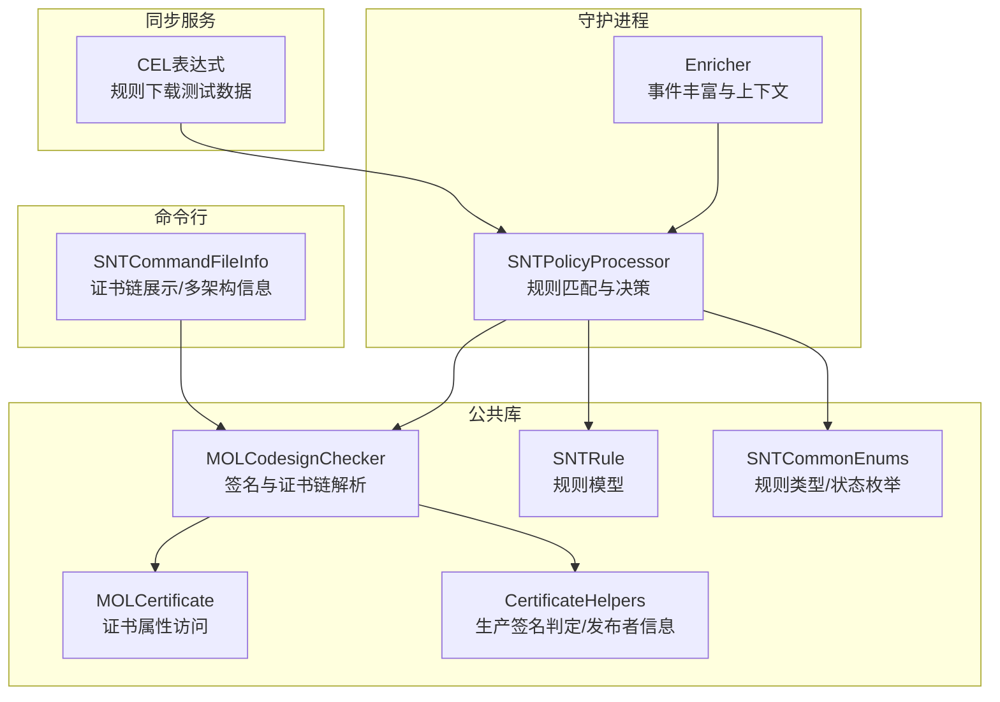
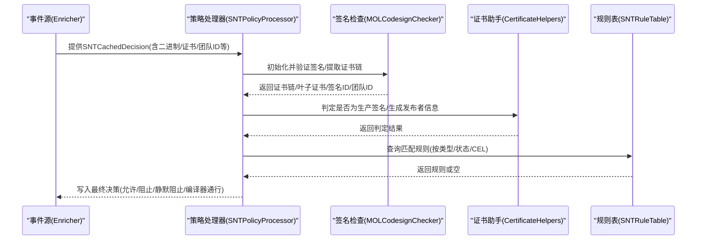
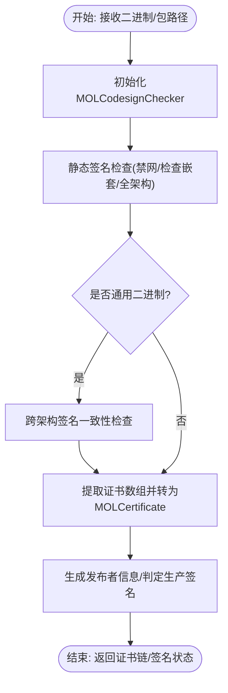
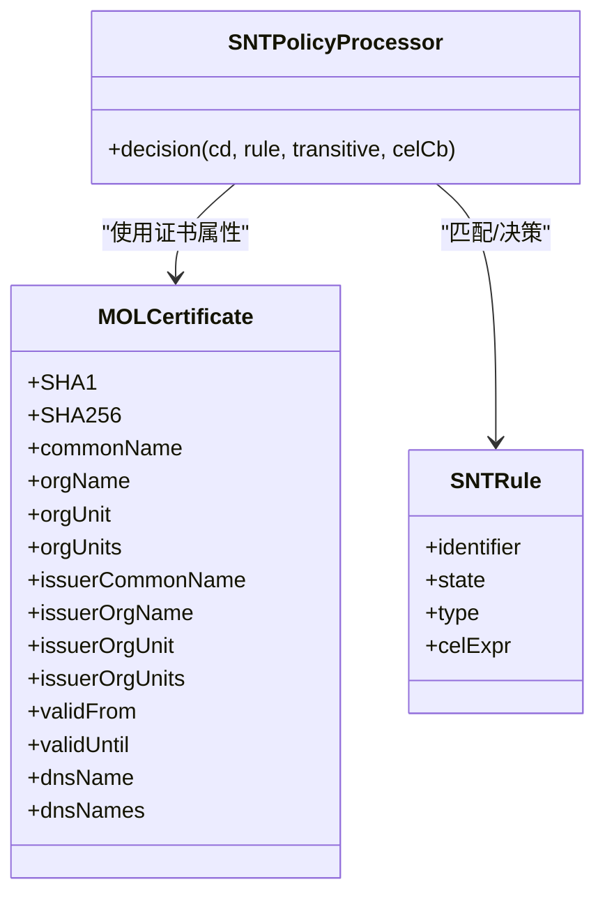
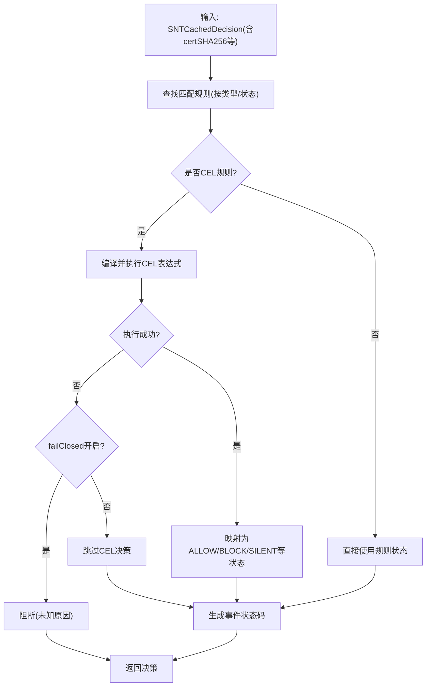
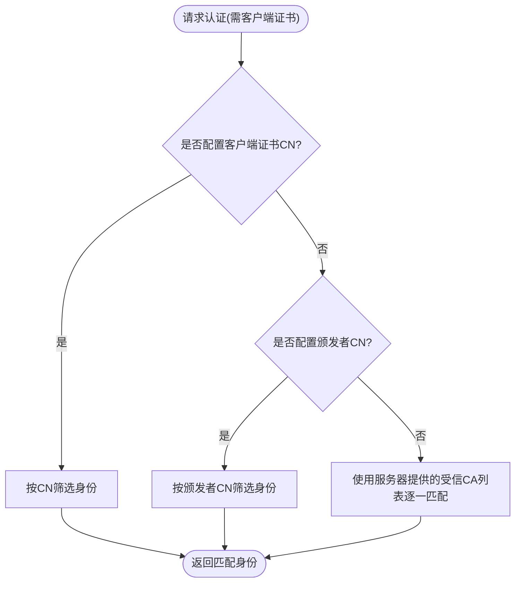
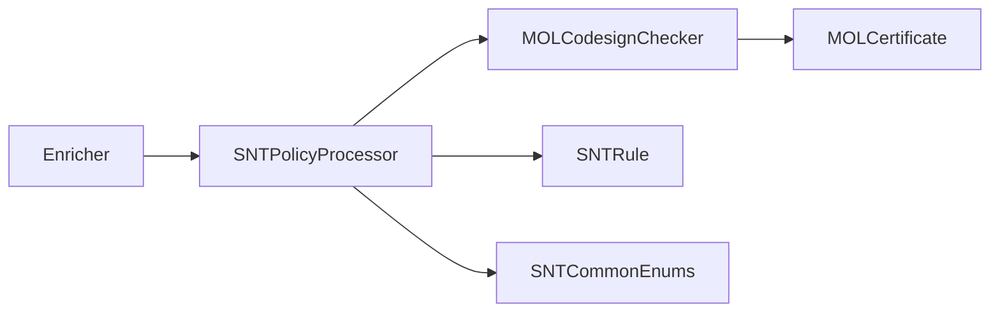

# 证书规则

<cite>
**本文引用的文件**
- [MOLCertificate.h](file://Source/common/MOLCertificate.h)
- [MOLCodesignChecker.h](file://Source/common/MOLCodesignChecker.h)
- [MOLCodesignChecker.mm](file://Source/common/MOLCodesignChecker.mm)
- [CertificateHelpers.h](file://Source/common/CertificateHelpers.h)
- [CertificateHelpers.mm](file://Source/common/CertificateHelpers.mm)
- [SNTRule.h](file://Source/common/SNTRule.h)
- [SNTCommonEnums.h](file://Source/common/SNTCommonEnums.h)
- [SNTPolicyProcessor.mm](file://Source/santad/SNTPolicyProcessor.mm)
- [SantadTest.mm](file://Source/santad/SantadTest.mm)
- [SNTPolicyProcessorTest.mm](file://Source/santad/SNTPolicyProcessorTest.mm)
- [SNTCommandFileInfo.mm](file://Source/santactl/Commands/SNTCommandFileInfo.mm)
- [Enricher.mm](file://Source/santad/EventProviders/EndpointSecurity/Enricher.mm)
- [Pinning.mm](file://Source/common/Pinning.mm)
- [MOLAuthenticatingURLSession.mm](file://Source/common/MOLAuthenticatingURLSession.mm)
- [sync_ruledownload_with_cel_1.json](file://Source/santasyncservice/testdata/sync_ruledownload_with_cel_1.json)
</cite>

## 目录
1. [简介](#简介)
2. [项目结构](#项目结构)
3. [核心组件](#核心组件)
4. [架构总览](#架构总览)
5. [组件详解](#组件详解)
6. [依赖关系分析](#依赖关系分析)
7. [性能考量](#性能考量)
8. [故障排除指南](#故障排除指南)
9. [结论](#结论)
10. [附录：配置示例与最佳实践](#附录配置示例与最佳实践)

## 简介
本文件面向Santa的证书规则系统，围绕“基于代码签名证书”的规则实现进行系统化技术说明。重点涵盖以下方面：
- 证书链验证流程与信任锚点检查
- 证书属性匹配机制（发布者名称、组织单位、颁发者信息等）
- 规则类型与决策流程（允许/阻止/静默阻止/CEL表达式）
- 性能优化策略（离线校验、缓存、标志位裁剪）
- 错误处理与故障排除建议

## 项目结构
Santa在多个模块中协同完成证书规则相关的功能：
- 公共库层：证书封装与签名检查、规则模型与通用枚举
- 守护进程层：策略处理器、事件丰富器、决策缓存
- 命令行工具层：信息查询与调试输出
- 同步服务层：规则下载与CEL表达式支持

**图表来源**
- [MOLCodesignChecker.h](file://Source/common/MOLCodesignChecker.h#L1-L210)
- [MOLCertificate.h](file://Source/common/MOLCertificate.h#L1-L138)
- [CertificateHelpers.h](file://Source/common/CertificateHelpers.h#L1-L68)
- [SNTRule.h](file://Source/common/SNTRule.h#L1-L129)
- [SNTCommonEnums.h](file://Source/common/SNTCommonEnums.h#L50-L120)
- [SNTPolicyProcessor.mm](file://Source/santad/SNTPolicyProcessor.mm#L1-L200)
- [Enricher.mm](file://Source/santad/EventProviders/EndpointSecurity/Enricher.mm#L1-L200)
- [SNTCommandFileInfo.mm](file://Source/santactl/Commands/SNTCommandFileInfo.mm#L459-L497)
- [sync_ruledownload_with_cel_1.json](file://Source/santasyncservice/testdata/sync_ruledownload_with_cel_1.json#L1-L16)

**章节来源**
- [MOLCodesignChecker.h](file://Source/common/MOLCodesignChecker.h#L1-L210)
- [MOLCertificate.h](file://Source/common/MOLCertificate.h#L1-L138)
- [SNTRule.h](file://Source/common/SNTRule.h#L1-L129)
- [SNTCommonEnums.h](file://Source/common/SNTCommonEnums.h#L50-L120)
- [SNTPolicyProcessor.mm](file://Source/santad/SNTPolicyProcessor.mm#L1-L200)
- [Enricher.mm](file://Source/santad/EventProviders/EndpointSecurity/Enricher.mm#L1-L200)
- [SNTCommandFileInfo.mm](file://Source/santactl/Commands/SNTCommandFileInfo.mm#L459-L497)
- [sync_ruledownload_with_cel_1.json](file://Source/santasyncservice/testdata/sync_ruledownload_with_cel_1.json#L1-L16)

## 核心组件
- 证书封装与属性访问
  - MOLCertificate提供对证书常见字段（CN/O/Organization/OU/颁发者信息/有效期/DNS SAN等）的只读访问，并支持从DER/PEM初始化及证书数组转换。
- 签名与证书链解析
  - MOLCodesignChecker负责对二进制进行签名验证，提取证书链、叶子证书、团队ID、签名ID、签名时间等；内部使用安全框架标志位以避免网络访问，确保性能稳定。
- 证书辅助工具
  - CertificateHelpers提供生产签名判定、发布者字符串生成、证书链提取等能力。
- 规则模型与枚举
  - SNTRule定义规则标识符、类型（二进制/证书/团队ID/签名ID等）、状态（允许/阻止/静默阻止/CEL等），并支持字典初始化与序列化。
  - SNTCommonEnums定义规则类型与状态的整型值，用于数据库存储与比较优先级。
- 策略处理器
  - SNTPolicyProcessor根据规则类型与状态，结合CEL表达式（可选）进行决策，生成事件状态码（如允许/阻止证书相关事件）。

**章节来源**
- [MOLCertificate.h](file://Source/common/MOLCertificate.h#L1-L138)
- [MOLCodesignChecker.h](file://Source/common/MOLCodesignChecker.h#L1-L210)
- [CertificateHelpers.h](file://Source/common/CertificateHelpers.h#L1-L68)
- [SNTRule.h](file://Source/common/SNTRule.h#L1-L129)
- [SNTCommonEnums.h](file://Source/common/SNTCommonEnums.h#L50-L120)
- [SNTPolicyProcessor.mm](file://Source/santad/SNTPolicyProcessor.mm#L183-L206)

## 架构总览
下图展示了从事件产生到规则决策的关键路径，以及证书链在其中的角色。

**图表来源**
- [Enricher.mm](file://Source/santad/EventProviders/EndpointSecurity/Enricher.mm#L1-L200)
- [SNTPolicyProcessor.mm](file://Source/santad/SNTPolicyProcessor.mm#L105-L182)
- [MOLCodesignChecker.mm](file://Source/common/MOLCodesignChecker.mm#L38-L120)
- [CertificateHelpers.mm](file://Source/common/CertificateHelpers.mm#L82-L103)

**章节来源**
- [Enricher.mm](file://Source/santad/EventProviders/EndpointSecurity/Enricher.mm#L1-L200)
- [SNTPolicyProcessor.mm](file://Source/santad/SNTPolicyProcessor.mm#L105-L182)
- [MOLCodesignChecker.mm](file://Source/common/MOLCodesignChecker.mm#L38-L120)
- [CertificateHelpers.mm](file://Source/common/CertificateHelpers.mm#L82-L103)

## 组件详解

### 证书链与签名验证
- 验证流程
  - 使用安全框架静态代码检查接口，结合裁剪后的标志位（禁止网络访问、检查嵌套代码、检查所有架构），在不触发在线吊销检查的前提下完成签名一致性与资源校验。
  - 对于通用二进制，会跨架构比对签名一致性，若不一致则直接判定无效。
- 证书链提取
  - 通过签名信息提取证书数组，转换为MOLCertificate对象数组，便于后续属性匹配与显示。
- 发布者信息与生产签名
  - 依据证书属性生成用户友好的发布者字符串；通过OID判断是否为生产签名，辅助区分开发/生产签名的应用。

**图表来源**
- [MOLCodesignChecker.mm](file://Source/common/MOLCodesignChecker.mm#L38-L120)
- [CertificateHelpers.mm](file://Source/common/CertificateHelpers.mm#L82-L103)

**章节来源**
- [MOLCodesignChecker.mm](file://Source/common/MOLCodesignChecker.mm#L38-L120)
- [CertificateHelpers.mm](file://Source/common/CertificateHelpers.mm#L82-L103)

### 证书属性与匹配机制
- 可用属性
  - 证书属性包括：通用名、国家、组织、组织单位（单个与全部）、颁发者信息（CN/国家/组织/组织单位）、有效期、DNS SAN等。
  - 证书链可通过MOLCertificate数组访问，支持遍历与逐项匹配。
- 匹配策略
  - 在策略处理器中，针对证书规则（CERTIFICATE）以证书SHA-256作为匹配键；同时可结合CEL表达式对目标对象进行动态评估。
  - 对于发布者名称匹配、组织单位匹配等场景，可在CEL表达式中引用证书链属性进行条件判断。

**图表来源**
- [MOLCertificate.h](file://Source/common/MOLCertificate.h#L70-L137)
- [SNTRule.h](file://Source/common/SNTRule.h#L20-L129)
- [SNTPolicyProcessor.mm](file://Source/santad/SNTPolicyProcessor.mm#L105-L182)

**章节来源**
- [MOLCertificate.h](file://Source/common/MOLCertificate.h#L70-L137)
- [SNTRule.h](file://Source/common/SNTRule.h#L20-L129)
- [SNTPolicyProcessor.mm](file://Source/santad/SNTPolicyProcessor.mm#L105-L182)

### 规则类型与决策流程
- 规则类型
  - 支持二进制、证书、团队ID、签名ID等多种类型；CERTIFICATE类型以证书SHA-256作为匹配键。
- 决策状态
  - 允许、阻止、静默阻止、移除、编译器通行、CEL表达式等；CEL规则支持v1/v2两种版本。
- 流程要点
  - 策略处理器根据规则类型与状态生成对应的事件状态码；当启用CEL时，先编译并执行表达式，再映射为具体状态；失败时可根据配置决定是否阻断。
  - 单元测试覆盖了CERTIFICATE类型的允许/阻止/静默阻止规则命中场景。

**图表来源**
- [SNTCommonEnums.h](file://Source/common/SNTCommonEnums.h#L50-L120)
- [SNTPolicyProcessor.mm](file://Source/santad/SNTPolicyProcessor.mm#L105-L182)
- [SNTPolicyProcessorTest.mm](file://Source/santad/SNTPolicyProcessorTest.mm#L318-L389)

**章节来源**
- [SNTCommonEnums.h](file://Source/common/SNTCommonEnums.h#L50-L120)
- [SNTPolicyProcessor.mm](file://Source/santad/SNTPolicyProcessor.mm#L105-L182)
- [SNTPolicyProcessorTest.mm](file://Source/santad/SNTPolicyProcessorTest.mm#L318-L389)

### 信任锚点与客户端证书选择
- 信任锚点
  - 项目内置常用根证书（如Amazon Root CA、Google Trust Services Root R1/R3/R4等），用于离线信任锚点校验与证书链验证。
- 客户端证书选择
  - 在需要客户端证书的场景下，系统会根据配置的CN或颁发者信息，从可用证书集合中筛选匹配的身份；若未指定，则使用服务器提供的受信CA列表进行匹配。

**图表来源**
- [Pinning.mm](file://Source/common/Pinning.mm#L126-L223)
- [MOLAuthenticatingURLSession.mm](file://Source/common/MOLAuthenticatingURLSession.mm#L236-L283)

**章节来源**
- [Pinning.mm](file://Source/common/Pinning.mm#L126-L223)
- [MOLAuthenticatingURLSession.mm](file://Source/common/MOLAuthenticatingURLSession.mm#L236-L283)

### 实际配置与使用示例
- 证书链查看与多架构信息
  - 通过命令行工具可输出证书链、SHA-256、组织/组织单位、有效期等信息，便于排查与审计。
- 规则下载与CEL表达式
  - 规则下载支持CEL表达式，可在表达式中引用目标对象属性（如签名时间）进行动态决策；测试数据展示了CEL规则的语法与错误处理行为。

**章节来源**
- [SNTCommandFileInfo.mm](file://Source/santactl/Commands/SNTCommandFileInfo.mm#L459-L497)
- [sync_ruledownload_with_cel_1.json](file://Source/santasyncservice/testdata/sync_ruledownload_with_cel_1.json#L1-L16)

## 依赖关系分析
- 组件耦合
  - 策略处理器依赖规则模型、签名检查器、证书助手与配置器；签名检查器依赖安全框架与证书封装；证书封装依赖底层SecCertificateRef。
- 关键依赖链
  - Enricher -> SNTPolicyProcessor -> MOLCodesignChecker -> MOLCertificate
  - SNTPolicyProcessor -> SNTRule/SNTCommonEnums -> 规则表/CEL求值器

**图表来源**
- [Enricher.mm](file://Source/santad/EventProviders/EndpointSecurity/Enricher.mm#L1-L200)
- [SNTPolicyProcessor.mm](file://Source/santad/SNTPolicyProcessor.mm#L1-L200)
- [MOLCodesignChecker.h](file://Source/common/MOLCodesignChecker.h#L1-L210)
- [MOLCertificate.h](file://Source/common/MOLCertificate.h#L1-L138)
- [SNTRule.h](file://Source/common/SNTRule.h#L1-L129)
- [SNTCommonEnums.h](file://Source/common/SNTCommonEnums.h#L50-L120)

**章节来源**
- [Enricher.mm](file://Source/santad/EventProviders/EndpointSecurity/Enricher.mm#L1-L200)
- [SNTPolicyProcessor.mm](file://Source/santad/SNTPolicyProcessor.mm#L1-L200)
- [MOLCodesignChecker.h](file://Source/common/MOLCodesignChecker.h#L1-L210)
- [MOLCertificate.h](file://Source/common/MOLCertificate.h#L1-L138)
- [SNTRule.h](file://Source/common/SNTRule.h#L1-L129)
- [SNTCommonEnums.h](file://Source/common/SNTCommonEnums.h#L50-L120)

## 性能考量
- 禁止网络访问
  - 静态签名检查使用禁网标志，避免在线吊销检查带来的延迟与不确定性。
- 裁剪检查范围
  - 默认禁用资源校验，仅保留必要检查项，显著降低耗时。
- 多架构一致性检查
  - 对通用二进制进行全架构一致性校验，确保跨架构签名一致后再缓存签名信息，避免错误缓存导致的重复开销。
- 缓存与复用
  - 证书链与签名信息在处理器中被缓存，减少重复解析成本；事件丰富器在处理过程中也采用缓存策略以降低内存占用与峰值压力。

**章节来源**
- [MOLCodesignChecker.mm](file://Source/common/MOLCodesignChecker.mm#L38-L120)

## 故障排除指南
- 证书链为空或签名无效
  - 检查二进制是否已正确签名；确认签名标志与错误码，区分“未签名”“签名无效”“开发签名/生产签名”等状态。
- 证书规则未生效
  - 确认规则类型为CERTIFICATE且identifier为证书SHA-256；检查规则状态（ALLOW/BLOCK/SILENT）与是否启用CEL；验证CEL表达式语法与failClosed配置。
- 生产签名判定异常
  - 检查证书是否包含生产OID；确认发布者信息生成逻辑与显示是否符合预期。
- 客户端证书选择失败
  - 若配置了CN或颁发者CN，请确认其与实际证书一致；否则检查服务器提供的受信CA列表是否包含对应颁发者。

**章节来源**
- [CertificateHelpers.mm](file://Source/common/CertificateHelpers.mm#L82-L103)
- [SNTPolicyProcessor.mm](file://Source/santad/SNTPolicyProcessor.mm#L105-L182)
- [MOLAuthenticatingURLSession.mm](file://Source/common/MOLAuthenticatingURLSession.mm#L236-L283)

## 结论
Santa的证书规则系统通过“签名验证+证书属性匹配+规则决策”的组合，实现了对代码签名证书的细粒度控制。其设计强调离线验证、性能优先与可扩展的CEL表达式，既满足企业合规需求，又兼顾大规模部署的稳定性与可观测性。

## 附录：配置示例与最佳实践
- 允许特定组织的软件
  - 通过CERTIFICATE规则，以证书SHA-256作为identifier，设置为ALLOW；或在CEL规则中引用证书属性（如组织/组织单位）进行动态允许。
- 阻止特定证书颁发机构的软件
  - 在CEL规则中引用证书颁发者信息（如issuerCommonName/issuerOrgName），对来自特定CA的签名应用BLOCK或SILENT_BLOCK。
- 团队ID与签名时间策略
  - 使用TEAMID规则与CEL表达式限制签名时间；结合failClosed确保表达式执行失败时的安全边界。
- 调试与审计
  - 使用命令行工具输出证书链与属性，核对规则匹配情况；在测试环境中验证CEL表达式的正确性与边界条件。

**章节来源**
- [SNTPolicyProcessorTest.mm](file://Source/santad/SNTPolicyProcessorTest.mm#L318-L389)
- [SantadTest.mm](file://Source/santad/SantadTest.mm#L298-L341)
- [sync_ruledownload_with_cel_1.json](file://Source/santasyncservice/testdata/sync_ruledownload_with_cel_1.json#L1-L16)
- [SNTCommandFileInfo.mm](file://Source/santactl/Commands/SNTCommandFileInfo.mm#L459-L497)