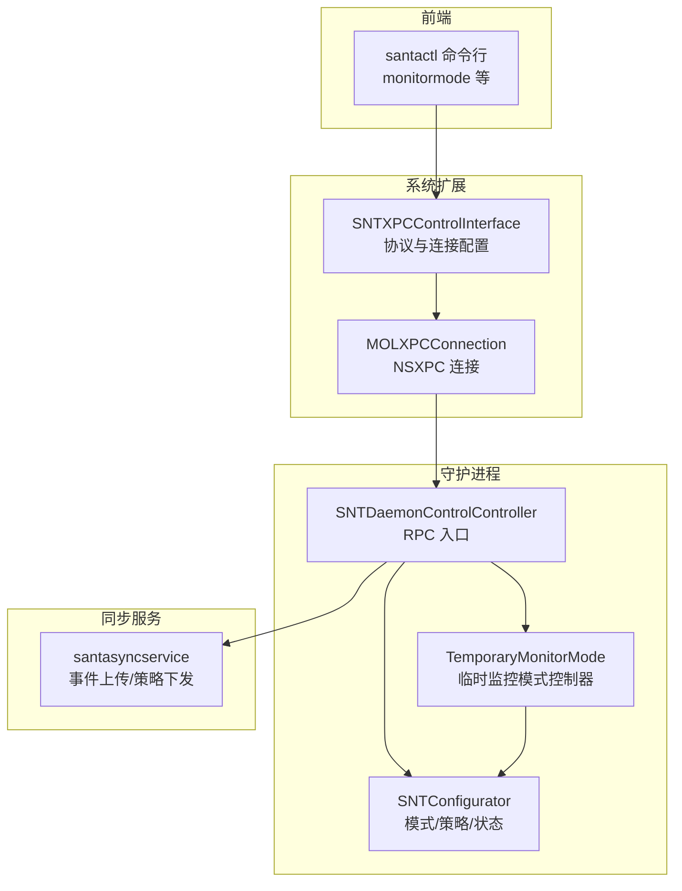
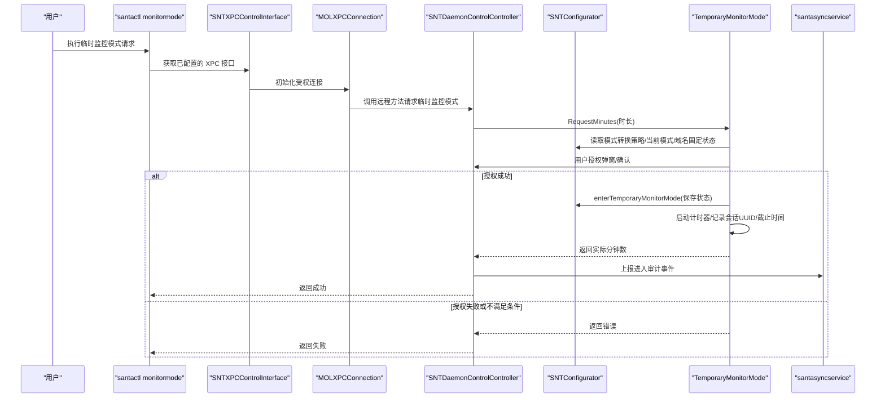
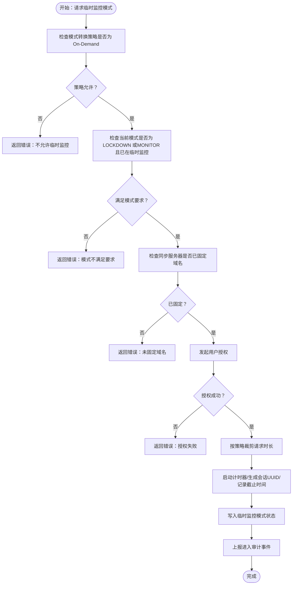
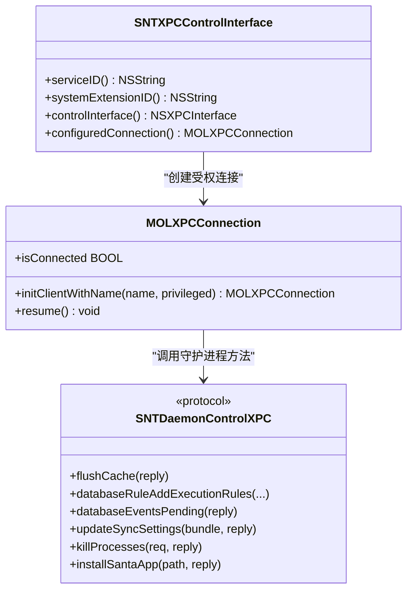
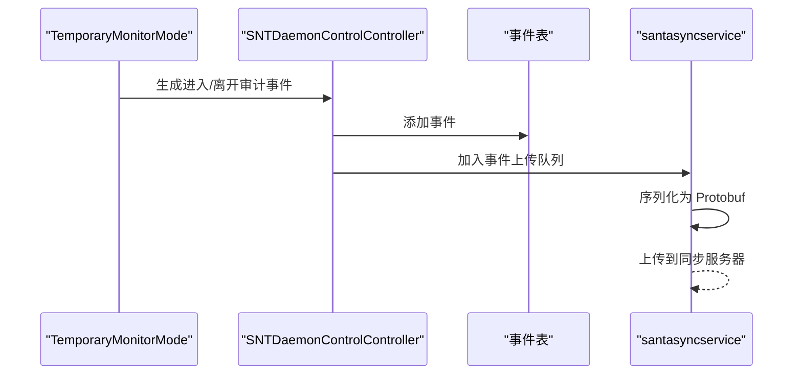
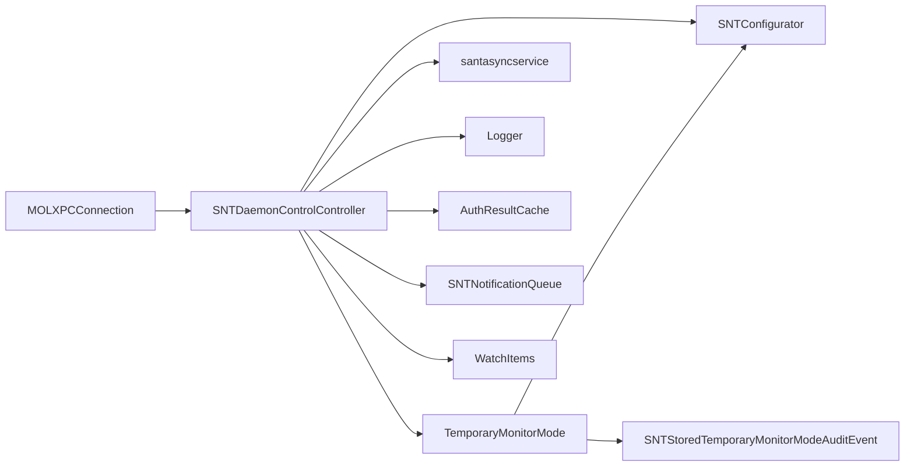

# 多模式运行机制

<cite>
**本文引用的文件**
- [Source/common/SNTCommonEnums.h](file://Source/common/SNTCommonEnums.h)
- [Source/common/SNTConfigurator.h](file://Source/common/SNTConfigurator.h)
- [Source/common/SNTModeTransition.h](file://Source/common/SNTModeTransition.h)
- [Source/common/SNTModeTransition.mm](file://Source/common/SNTModeTransition.mm)
- [Source/common/SNTXPCControlInterface.h](file://Source/common/SNTXPCControlInterface.h)
- [Source/common/SNTXPCControlInterface.mm](file://Source/common/SNTXPCControlInterface.mm)
- [Source/common/MOLXPCConnection.h](file://Source/common/MOLXPCConnection.h)
- [Source/common/MOLXPCConnection.mm](file://Source/common/MOLXPCConnection.mm)
- [Source/common/SNTStoredTemporaryMonitorModeAuditEvent.h](file://Source/common/SNTStoredTemporaryMonitorModeAuditEvent.h)
- [Source/common/SNTStoredTemporaryMonitorModeAuditEvent.mm](file://Source/common/SNTStoredTemporaryMonitorModeAuditEvent.mm)
- [Source/santactl/Commands/SNTCommandMonitorMode.mm](file://Source/santactl/Commands/SNTCommandMonitorMode.mm)
- [Source/santactl/main.mm](file://Source/santactl/main.mm)
- [Source/santad/SNTDaemonControlController.h](file://Source/santad/SNTDaemonControlController.h)
- [Source/santad/SNTDaemonControlController.mm](file://Source/santad/SNTDaemonControlController.mm)
- [Source/santad/TemporaryMonitorMode.h](file://Source/santad/TemporaryMonitorMode.h)
- [Source/santad/TemporaryMonitorMode.mm](file://Source/santad/TemporaryMonitorMode.mm)
- [Source/santasyncservice/SNTSyncEventUpload.mm](file://Source/santasyncservice/SNTSyncEventUpload.mm)
- [docs/src/lib/santaconfig.ts](file://docs/src/lib/santaconfig.ts)
</cite>

## 目录
1. [引言](#引言)
2. [项目结构](#项目结构)
3. [核心组件](#核心组件)
4. [架构总览](#架构总览)
5. [详细组件分析](#详细组件分析)
6. [依赖关系分析](#依赖关系分析)
7. [性能考量](#性能考量)
8. [故障排除指南](#故障排除指南)
9. [结论](#结论)
10. [附录：配置与使用示例](#附录配置与使用示例)

## 引言
本文件系统性阐述 Santa 的多模式运行机制，重点覆盖以下方面：
- 监控模式（MONITOR）与锁定模式（LOCKDOWN）的工作原理与适用场景
- 临时监控模式（On-Demand Temporary Monitor Mode）的设计、触发条件、持续时间管理与自动续期
- 模式切换的 XPC 接口设计、权限与安全控制
- 通过命令行工具切换模式的操作方法与配置文件中的默认模式设置
- 最佳实践、性能影响与常见问题排查

## 项目结构
Santa 的多模式运行机制由三部分协同实现：
- 前端命令行工具（santactl）负责用户交互与调用
- 守护进程（santad）负责模式状态管理、策略执行与持久化
- 同步服务（santasyncservice）负责与远端同步服务器通信，并上报审计事件

图表来源
- [Source/santactl/Commands/SNTCommandMonitorMode.mm](file://Source/santactl/Commands/SNTCommandMonitorMode.mm#L1-L157)
- [Source/santad/SNTDaemonControlController.mm](file://Source/santad/SNTDaemonControlController.mm#L90-L103)
- [Source/common/SNTXPCControlInterface.mm](file://Source/common/SNTXPCControlInterface.mm#L82-L96)
- [Source/common/MOLXPCConnection.mm](file://Source/common/MOLXPCConnection.mm#L84-L119)
- [Source/santasyncservice/SNTSyncEventUpload.mm](file://Source/santasyncservice/SNTSyncEventUpload.mm#L391-L443)

章节来源
- [Source/santactl/Commands/SNTCommandMonitorMode.mm](file://Source/santactl/Commands/SNTCommandMonitorMode.mm#L1-L157)
- [Source/santad/SNTDaemonControlController.mm](file://Source/santad/SNTDaemonControlController.mm#L90-L103)
- [Source/common/SNTXPCControlInterface.mm](file://Source/common/SNTXPCControlInterface.mm#L82-L96)
- [Source/common/MOLXPCConnection.mm](file://Source/common/MOLXPCConnection.mm#L84-L119)

## 核心组件
- 客户端模式枚举与通知文案
  - 客户端模式包括 MONITOR、LOCKDOWN、STANDALONE；用于决定授权策略与用户提示文案
  - 参考路径：[SNTClientMode 枚举](file://Source/common/SNTCommonEnums.h#L84-L89)，[模式通知文案属性](file://Source/common/SNTConfigurator.h#L512-L528)

- 配置器（SNTConfigurator）
  - 提供当前模式、是否处于临时监控模式、临时监控模式状态持久化等能力
  - 支持进入/离开临时监控模式的状态写入与读取
  - 参考路径：[clientMode 属性](file://Source/common/SNTConfigurator.h#L33-L41)，[临时监控模式相关属性与方法](file://Source/common/SNTConfigurator.h#L656-L685)

- 临时监控模式控制器（TemporaryMonitorMode）
  - 负责请求时长校验、用户授权、计时器启动/停止、到期处理、撤销与重启逻辑
  - 维护会话 UUID、截止时间、剩余秒数等
  - 参考路径：[类声明与方法](file://Source/santad/TemporaryMonitorMode.h#L35-L117)，[实现细节](file://Source/santad/TemporaryMonitorMode.mm#L157-L312)

- 模式转换策略（SNTModeTransition）
  - 描述允许的临时监控模式最大时长、默认时长与请求时长裁剪逻辑
  - 参考路径：[头文件定义](file://Source/common/SNTModeTransition.h#L17-L47)，[实现与裁剪逻辑](file://Source/common/SNTModeTransition.mm#L39-L90)

- XPC 控制接口（SNTXPCControlInterface / MOLXPCConnection）
  - 提供守护进程的 Mach 服务名、协议接口配置与受权连接初始化
  - 参考路径：[接口与连接配置](file://Source/common/SNTXPCControlInterface.mm#L28-L96)，[连接初始化](file://Source/common/MOLXPCConnection.mm#L84-L119)

- 临时监控模式审计事件（SNTStoredTemporaryMonitorModeAuditEvent）
  - 记录进入/离开事件的会话 ID、原因与进入时长等
  - 参考路径：[事件类型与基类](file://Source/common/SNTStoredTemporaryMonitorModeAuditEvent.h#L38-L91)，[进入事件构造](file://Source/common/SNTStoredTemporaryMonitorModeAuditEvent.mm#L27-L38)

章节来源
- [Source/common/SNTCommonEnums.h](file://Source/common/SNTCommonEnums.h#L84-L89)
- [Source/common/SNTConfigurator.h](file://Source/common/SNTConfigurator.h#L512-L528)
- [Source/common/SNTConfigurator.h](file://Source/common/SNTConfigurator.h#L656-L685)
- [Source/santad/TemporaryMonitorMode.h](file://Source/santad/TemporaryMonitorMode.h#L35-L117)
- [Source/santad/TemporaryMonitorMode.mm](file://Source/santad/TemporaryMonitorMode.mm#L157-L312)
- [Source/common/SNTModeTransition.h](file://Source/common/SNTModeTransition.h#L17-L47)
- [Source/common/SNTModeTransition.mm](file://Source/common/SNTModeTransition.mm#L39-L90)
- [Source/common/SNTXPCControlInterface.mm](file://Source/common/SNTXPCControlInterface.mm#L28-L96)
- [Source/common/MOLXPCConnection.mm](file://Source/common/MOLXPCConnection.mm#L84-L119)
- [Source/common/SNTStoredTemporaryMonitorModeAuditEvent.h](file://Source/common/SNTStoredTemporaryMonitorModeAuditEvent.h#L38-L91)
- [Source/common/SNTStoredTemporaryMonitorModeAuditEvent.mm](file://Source/common/SNTStoredTemporaryMonitorModeAuditEvent.mm#L27-L38)

## 架构总览
下图展示了从命令行到守护进程再到同步服务的完整调用链与数据流。

图表来源
- [Source/santactl/Commands/SNTCommandMonitorMode.mm](file://Source/santactl/Commands/SNTCommandMonitorMode.mm#L116-L152)
- [Source/common/SNTXPCControlInterface.mm](file://Source/common/SNTXPCControlInterface.mm#L82-L96)
- [Source/common/MOLXPCConnection.mm](file://Source/common/MOLXPCConnection.mm#L84-L119)
- [Source/santad/SNTDaemonControlController.mm](file://Source/santad/SNTDaemonControlController.mm#L90-L103)
- [Source/santad/TemporaryMonitorMode.mm](file://Source/santad/TemporaryMonitorMode.mm#L157-L207)
- [Source/santasyncservice/SNTSyncEventUpload.mm](file://Source/santasyncservice/SNTSyncEventUpload.mm#L391-L443)

## 详细组件分析

### 监控模式（MONITOR）与锁定模式（LOCKDOWN）
- 工作原理
  - MONITOR：以“观察为主”的模式，通常用于收集规则与行为数据，阻断较少
  - LOCKDOWN：严格模式，对未知二进制与违规签名进行阻断，适合生产环境
- 切换场景
  - 正常切换：通过同步服务下发策略或本地命令行操作
  - 临时切换：在 LOCKDOWN 模式下，按策略允许的范围进行临时监控
- 通知文案
  - 配置器提供模式切换时的用户提示文案键位，便于统一展示
  - 参考路径：[模式通知文案属性](file://Source/common/SNTConfigurator.h#L512-L528)

章节来源
- [Source/common/SNTCommonEnums.h](file://Source/common/SNTCommonEnums.h#L84-L89)
- [Source/common/SNTConfigurator.h](file://Source/common/SNTConfigurator.h#L512-L528)

### 临时监控模式（On-Demand Temporary Monitor Mode）
- 触发条件
  - 必须存在“按需”模式转换策略（SNTModeTransitionTypeOnDemand）
  - 当前客户端模式必须为 LOCKDOWN 或（MONITOR 且已在临时监控中）
  - 同步服务器地址必须启用域名固定（Pinning），以确保安全性
  - 需要用户授权（弹窗/确认）
- 请求流程
  - 解析请求时长，按策略裁剪至允许范围
  - 启动计时器，生成会话 UUID，记录截止时间
  - 写入临时监控模式状态，持久化到配置器
  - 上报进入审计事件（包含会话 ID、时长、原因）
- 持续时间管理
  - 通过 Mach 时间计算剩余秒数
  - 到期后自动结束，清空会话 UUID，并上报离开审计事件
- 取消与撤销
  - 主动取消：立即结束并上报“取消”原因
  - 撤销：当策略被撤销或服务器变更时，立即终止并上报相应原因
- 自动续期
  - 若已有活动会话，可刷新时长；内部逻辑区分首次进入与刷新进入

图表来源
- [Source/santad/TemporaryMonitorMode.mm](file://Source/santad/TemporaryMonitorMode.mm#L157-L207)
- [Source/common/SNTModeTransition.mm](file://Source/common/SNTModeTransition.mm#L39-L90)
- [Source/common/SNTStoredTemporaryMonitorModeAuditEvent.mm](file://Source/common/SNTStoredTemporaryMonitorModeAuditEvent.mm#L27-L38)

章节来源
- [Source/santad/TemporaryMonitorMode.h](file://Source/santad/TemporaryMonitorMode.h#L35-L117)
- [Source/santad/TemporaryMonitorMode.mm](file://Source/santad/TemporaryMonitorMode.mm#L157-L312)
- [Source/common/SNTModeTransition.h](file://Source/common/SNTModeTransition.h#L17-L47)
- [Source/common/SNTModeTransition.mm](file://Source/common/SNTModeTransition.mm#L39-L90)
- [Source/common/SNTStoredTemporaryMonitorModeAuditEvent.h](file://Source/common/SNTStoredTemporaryMonitorModeAuditEvent.h#L38-L91)
- [Source/common/SNTStoredTemporaryMonitorModeAuditEvent.mm](file://Source/common/SNTStoredTemporaryMonitorModeAuditEvent.mm#L27-L38)

### XPC 接口设计、权限与安全
- 服务标识与连接
  - 通过 SNTXPCControlInterface 获取 Mach 服务名与系统扩展 ID
  - 使用 MOLXPCConnection 初始化受权连接（NSXPCConnectionPrivileged），确保调用方具备必要权限
- 协议与参数
  - SNTDaemonControlXPC 定义了守护进程暴露的 RPC 方法集合（如缓存清理、数据库操作、安装应用等）
  - 对自定义对象参数进行接口注册，确保序列化/反序列化正确
- 安全考虑
  - 仅在满足策略与模式条件下才允许进入临时监控模式
  - 同步服务器必须启用域名固定，防止中间人攻击
  - 用户授权作为额外安全层，避免静默切换

图表来源
- [Source/common/SNTXPCControlInterface.h](file://Source/common/SNTXPCControlInterface.h#L23-L78)
- [Source/common/SNTXPCControlInterface.mm](file://Source/common/SNTXPCControlInterface.mm#L28-L96)
- [Source/common/MOLXPCConnection.h](file://Source/common/MOLXPCConnection.h#L149-L163)
- [Source/common/MOLXPCConnection.mm](file://Source/common/MOLXPCConnection.mm#L84-L119)

章节来源
- [Source/common/SNTXPCControlInterface.h](file://Source/common/SNTXPCControlInterface.h#L23-L78)
- [Source/common/SNTXPCControlInterface.mm](file://Source/common/SNTXPCControlInterface.mm#L28-L96)
- [Source/common/MOLXPCConnection.h](file://Source/common/MOLXPCConnection.h#L149-L163)
- [Source/common/MOLXPCConnection.mm](file://Source/common/MOLXPCConnection.mm#L84-L119)

### 模式切换与审计事件上报
- 进入/离开事件
  - 进入事件包含会话 UUID、持续秒数与进入原因（首次进入/刷新进入/重启恢复）
  - 离开事件包含会话 UUID 与离开原因（到期/取消/撤销/服务器变更/重启）
- 上报流程
  - 守护进程在状态变更时生成审计事件并写入数据库，随后加入同步队列等待上传
  - 同步服务将事件序列化为 Protobuf 并上传

图表来源
- [Source/santad/SNTDaemonControlController.mm](file://Source/santad/SNTDaemonControlController.mm#L90-L103)
- [Source/common/SNTStoredTemporaryMonitorModeAuditEvent.h](file://Source/common/SNTStoredTemporaryMonitorModeAuditEvent.h#L38-L91)
- [Source/santasyncservice/SNTSyncEventUpload.mm](file://Source/santasyncservice/SNTSyncEventUpload.mm#L391-L443)

章节来源
- [Source/santad/SNTDaemonControlController.mm](file://Source/santad/SNTDaemonControlController.mm#L90-L103)
- [Source/common/SNTStoredTemporaryMonitorModeAuditEvent.h](file://Source/common/SNTStoredTemporaryMonitorModeAuditEvent.h#L38-L91)
- [Source/santasyncservice/SNTSyncEventUpload.mm](file://Source/santasyncservice/SNTSyncEventUpload.mm#L391-L443)

## 依赖关系分析
- 组件耦合
  - SNTDaemonControlController 依赖 SNTConfigurator、SNTNotificationQueue、SNTSyncdQueue、Logger、AuthResultCache、WatchItems
  - TemporaryMonitorMode 依赖 SNTConfigurator、SNTNotificationQueue、SNTStoredTemporaryMonitorModeAuditEvent
- 外部依赖
  - NSXPC（MOLXPCConnection）用于跨进程通信
  - 同步服务（santasyncservice）负责事件上传与策略同步

图表来源
- [Source/santad/SNTDaemonControlController.mm](file://Source/santad/SNTDaemonControlController.mm#L72-L103)
- [Source/santad/TemporaryMonitorMode.mm](file://Source/santad/TemporaryMonitorMode.mm#L30-L51)
- [Source/common/MOLXPCConnection.mm](file://Source/common/MOLXPCConnection.mm#L84-L119)

章节来源
- [Source/santad/SNTDaemonControlController.mm](file://Source/santad/SNTDaemonControlController.mm#L72-L103)
- [Source/santad/TemporaryMonitorMode.mm](file://Source/santad/TemporaryMonitorMode.mm#L30-L51)
- [Source/common/MOLXPCConnection.mm](file://Source/common/MOLXPCConnection.mm#L84-L119)

## 性能考量
- 临时监控模式的引入不会显著增加实时授权路径的复杂度，主要影响点在于：
  - 计时器与锁的开销：TemporaryMonitorMode 使用轻量级互斥锁与 Mach 时间计算，开销可控
  - 事件持久化与同步：进入/离开事件写入数据库并排队上传，建议在批量上传与速率限制上合理配置
  - 用户授权弹窗：可能带来短暂的 UI 响应延迟，但属于交互层面

[本节为通用性能讨论，无需引用具体文件]

## 故障排除指南
- 常见错误与定位
  - “不被允许的临时监控模式”：检查同步服务器是否下发了 On-Demand 类型的模式转换策略
    - 参考路径：[策略类型判断](file://Source/santad/TemporaryMonitorMode.mm#L157-L164)
  - “模式不满足要求”：当前模式必须为 LOCKDOWN 或（MONITOR 且已在临时监控）
    - 参考路径：[模式检查](file://Source/santad/TemporaryMonitorMode.mm#L166-L173)
  - “未固定域名”：同步服务器地址未启用域名固定
    - 参考路径：[域名固定检查](file://Source/santad/TemporaryMonitorMode.mm#L175-L180)
  - “用户授权失败”：用户拒绝授权或交互异常
    - 参考路径：[授权回调](file://Source/santad/TemporaryMonitorMode.mm#L182-L190)
- 诊断步骤
  - 使用命令行查看当前模式与日志类型
    - 参考路径：[状态命令输出](file://Source/santactl/Commands/SNTCommandStatus.mm#L373-L396)
  - 查看临时监控模式剩余时间与状态
    - 参考路径：[剩余秒数查询](file://Source/santad/TemporaryMonitorMode.mm#L209-L225)
  - 检查同步服务器配置与事件上传情况
    - 参考路径：[事件上传映射](file://Source/santasyncservice/SNTSyncEventUpload.mm#L391-L443)

章节来源
- [Source/santad/TemporaryMonitorMode.mm](file://Source/santad/TemporaryMonitorMode.mm#L157-L207)
- [Source/santasyncservice/SNTSyncEventUpload.mm](file://Source/santasyncservice/SNTSyncEventUpload.mm#L391-L443)

## 结论
Santa 的多模式运行机制通过策略驱动与严格的权限控制，实现了从 MONITOR 到 LOCKDOWN 的灵活切换，并以“按需临时监控模式”为运维与合规场景提供了可控的窗口期。其 XPC 接口与审计事件体系保证了操作的可追溯性与安全性。遵循本文最佳实践与排障建议，可在保障安全的前提下最大化系统可用性。

[本节为总结性内容，无需引用具体文件]

## 附录：配置与使用示例

### 通过命令行切换模式
- 临时监控模式
  - 基本用法：santactl monitormode [--duration {分钟}|{时间间隔字符串}] [--cancel]
  - 示例：请求 30 分钟临时监控；请求 2 小时；取消当前会话
  - 参考路径：[命令帮助与解析](file://Source/santactl/Commands/SNTCommandMonitorMode.mm#L42-L68)，[执行入口](file://Source/santactl/Commands/SNTCommandMonitorMode.mm#L116-L152)

章节来源
- [Source/santactl/Commands/SNTCommandMonitorMode.mm](file://Source/santactl/Commands/SNTCommandMonitorMode.mm#L42-L68)
- [Source/santactl/Commands/SNTCommandMonitorMode.mm](file://Source/santactl/Commands/SNTCommandMonitorMode.mm#L116-L152)

### 在配置文件中设置默认模式
- 模式通知文案（用于用户提示）
  - ModeNotificationMonitor、ModeNotificationLockdown、ModeNotificationStandalone
  - 参考路径：[配置项定义](file://docs/src/lib/santaconfig.ts#L214-L223)

章节来源
- [docs/src/lib/santaconfig.ts](file://docs/src/lib/santaconfig.ts#L214-L223)