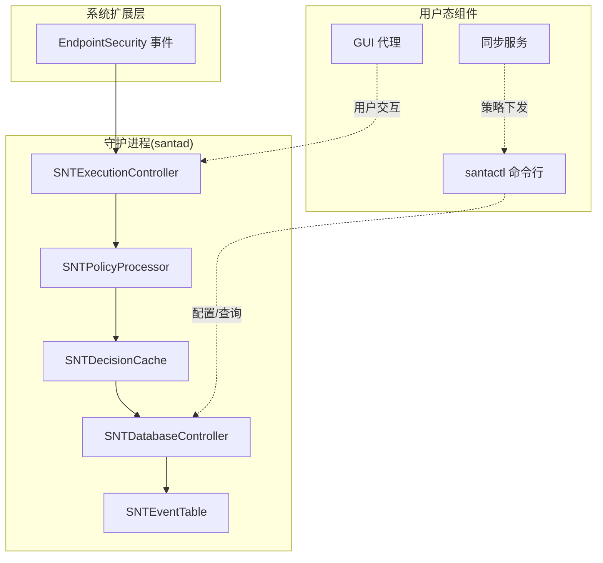
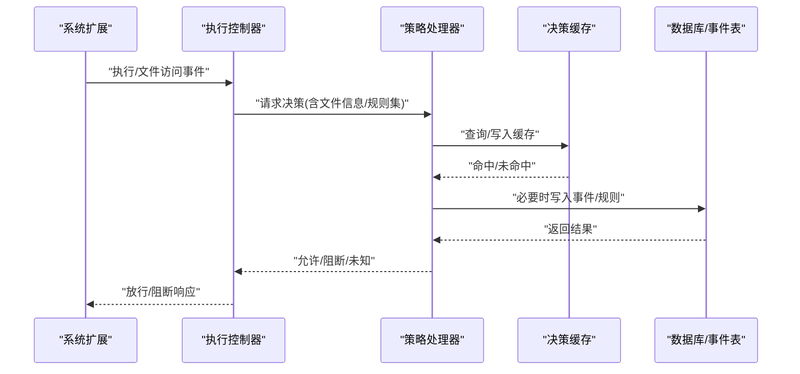
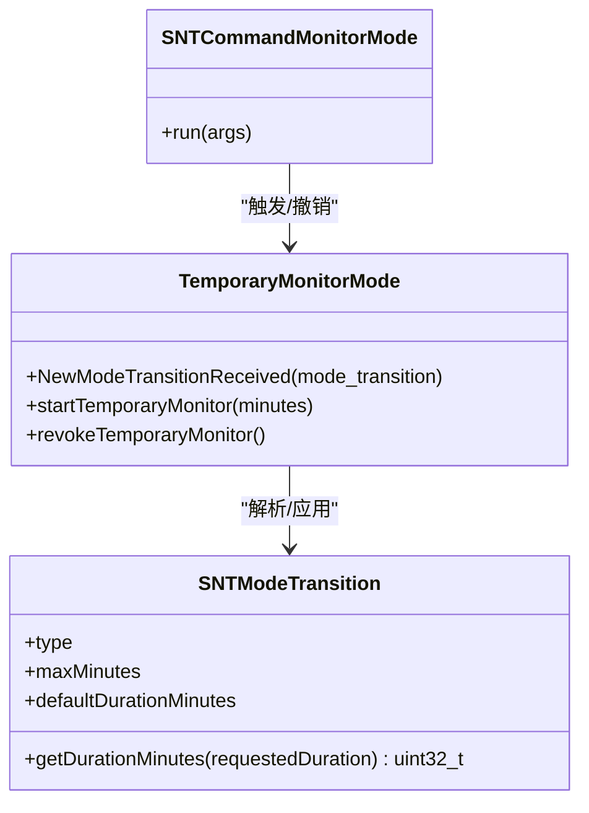
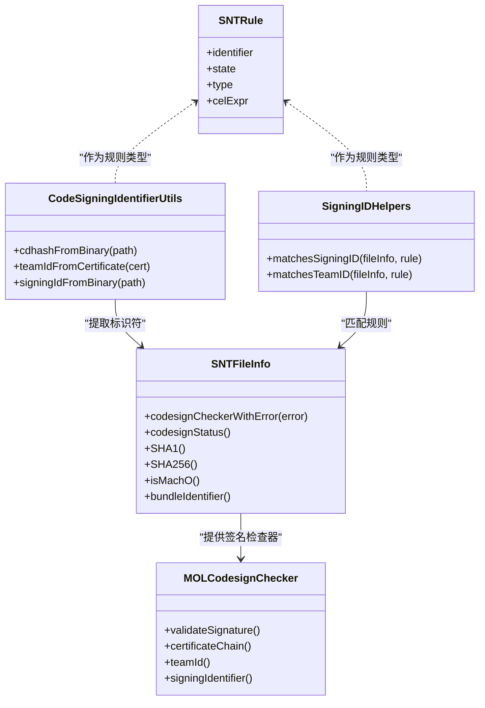
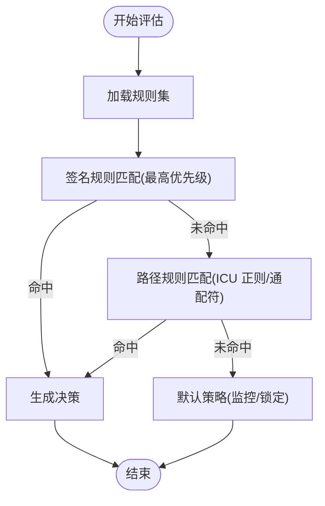
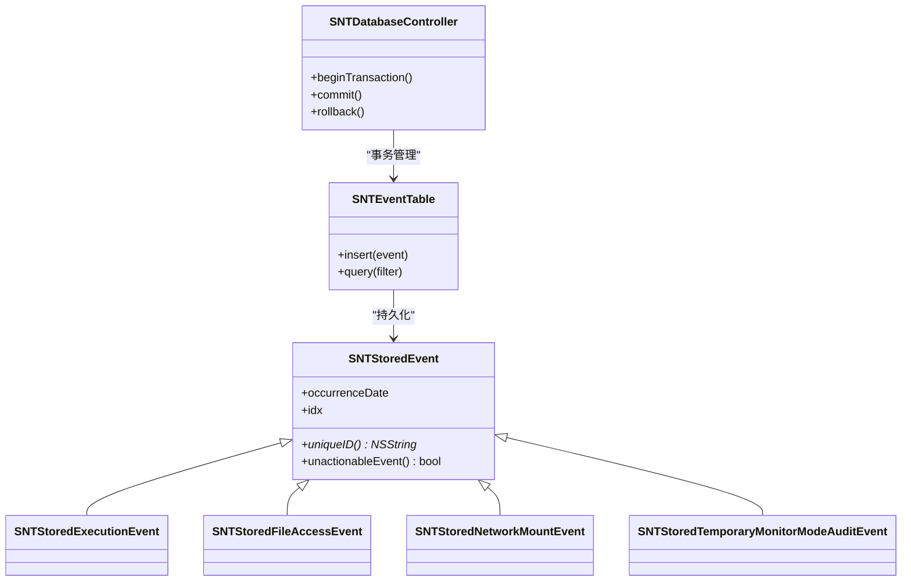
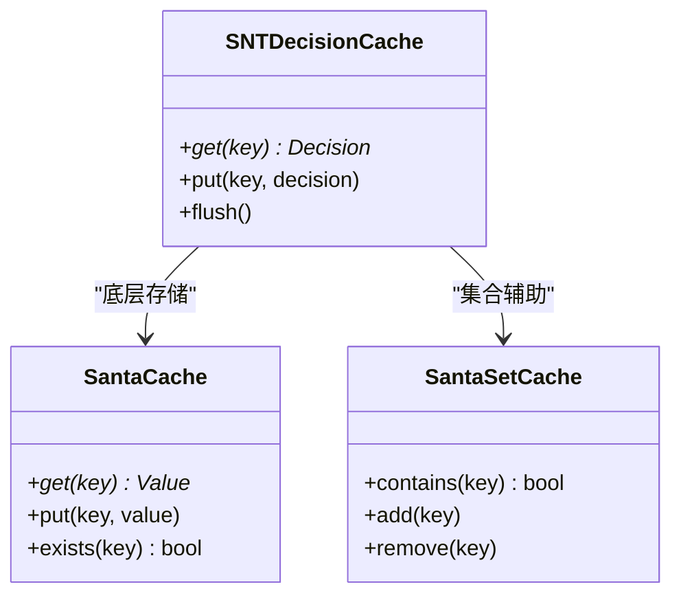
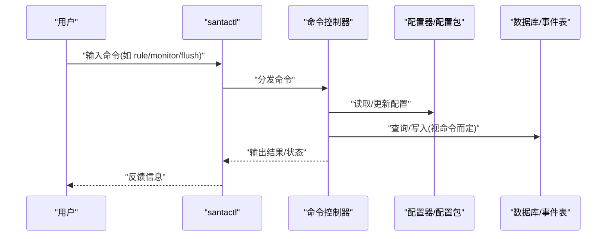
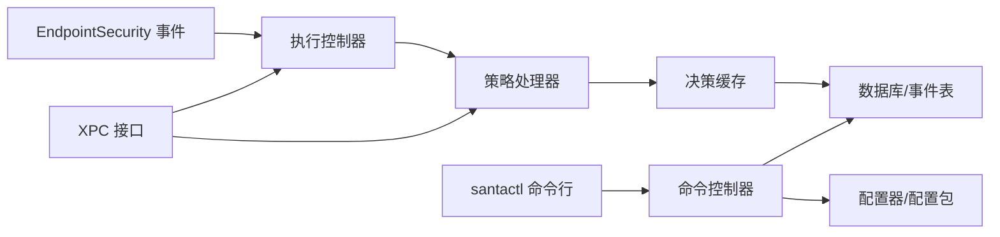

# 核心特性介绍

<cite>
**本文引用的文件**
- [README.md](file://README.md)
- [SNTModeTransition.h](file://Source/common/SNTModeTransition.h)
- [SNTRule.h](file://Source/common/SNTRule.h)
- [SNTFileInfo.h](file://Source/common/SNTFileInfo.h)
- [SNTStoredEvent.h](file://Source/common/SNTStoredEvent.h)
- [SNTDecisionCache.h](file://Source/santad/SNTDecisionCache.h)
- [SNTDecisionCache.mm](file://Source/santad/SNTDecisionCache.mm)
- [SNTDecisionCacheTest.mm](file://Source/common/SantaCacheTest.mm)
- [SantaCache.h](file://Source/common/SantaCache.h)
- [SantaCacheTest.mm](file://Source/common/SantaCacheTest.mm)
- [SantaSetCache.h](file://Source/common/SantaSetCache.h)
- [SantaSetCacheTest.mm](file://Source/common/SantaSetCacheTest.mm)
- [SNTDatabaseController.h](file://Source/santad/SNTDatabaseController.h)
- [SNTDatabaseController.mm](file://Source/santad/SNTDatabaseController.mm)
- [SNTEventTable.h](file://Source/santad/DataLayer/SNTEventTable.h)
- [SNTEventTable.mm](file://Source/santad/DataLayer/SNTEventTable.mm)
- [SNTEventTableTest.mm](file://Source/santad/DataLayer/SNTEventTableTest.mm)
- [SNTStoredExecutionEvent.h](file://Source/common/SNTStoredExecutionEvent.h)
- [SNTStoredExecutionEvent.mm](file://Source/common/SNTStoredExecutionEvent.mm)
- [SNTStoredFileAccessEvent.h](file://Source/common/SNTStoredFileAccessEvent.h)
- [SNTStoredFileAccessEvent.mm](file://Source/common/SNTStoredFileAccessEvent.mm)
- [SNTStoredNetworkMountEvent.h](file://Source/common/SNTStoredNetworkMountEvent.h)
- [SNTStoredNetworkMountEvent.mm](file://Source/common/SNTStoredNetworkMountEvent.mm)
- [SNTStoredTemporaryMonitorModeAuditEvent.h](file://Source/common/SNTStoredTemporaryMonitorModeAuditEvent.h)
- [SNTStoredTemporaryMonitorModeAuditEvent.mm](file://Source/common/SNTStoredTemporaryMonitorModeAuditEvent.mm)
- [SNTExecutionController.h](file://Source/santad/SNTExecutionController.h)
- [SNTExecutionController.mm](file://Source/santad/SNTExecutionController.mm)
- [SNTExecutionControllerTest.mm](file://Source/santad/SNTExecutionControllerTest.mm)
- [SNTPolicyProcessor.h](file://Source/santad/SNTPolicyProcessor.h)
- [SNTPolicyProcessor.mm](file://Source/santad/SNTPolicyProcessor.mm)
- [SNTPolicyProcessorTest.mm](file://Source/santad/SNTPolicyProcessorTest.mm)
- [SNTDecisionCache.h](file://Source/santad/SNTDecisionCache.h)
- [SNTDecisionCache.mm](file://Source/santad/SNTDecisionCache.mm)
- [SNTDecisionCacheTest.mm](file://Source/santad/SNTDecisionCacheTest.mm)
- [SNTDatabaseController.h](file://Source/santad/SNTDatabaseController.h)
- [SNTDatabaseController.mm](file://Source/santad/SNTDatabaseController.mm)
- [SNTEventTable.h](file://Source/santad/DataLayer/SNTEventTable.h)
- [SNTEventTable.mm](file://Source/santad/DataLayer/SNTEventTable.mm)
- [SNTEventTableTest.mm](file://Source/santad/DataLayer/SNTEventTableTest.mm)
- [SNTStoredExecutionEvent.h](file://Source/common/SNTStoredExecutionEvent.h)
- [SNTStoredExecutionEvent.mm](file://Source/common/SNTStoredExecutionEvent.mm)
- [SNTStoredFileAccessEvent.h](file://Source/common/SNTStoredFileAccessEvent.h)
- [SNTStoredFileAccessEvent.mm](file://Source/common/SNTStoredFileAccessEvent.mm)
- [SNTStoredNetworkMountEvent.h](file://Source/common/SNTStoredNetworkMountEvent.h)
- [SNTStoredNetworkMountEvent.mm](file://Source/common/SNTStoredNetworkMountEvent.mm)
- [SNTStoredTemporaryMonitorModeAuditEvent.h](file://Source/common/SNTStoredTemporaryMonitorModeAuditEvent.h)
- [SNTStoredTemporaryMonitorModeAuditEvent.mm](file://Source/common/SNTStoredTemporaryMonitorModeAuditEvent.mm)
- [SNTFileInfo.h](file://Source/common/SNTFileInfo.h)
- [SNTFileInfo.mm](file://Source/common/SNTFileInfo.mm)
- [SNTFileInfoTest.mm](file://Source/common/SNTFileInfoTest.mm)
- [MOLCodesignChecker.h](file://Source/common/MOLCodesignChecker.h)
- [MOLCodesignChecker.mm](file://Source/common/MOLCodesignChecker.mm)
- [MOLCodesignCheckerTest.mm](file://Source/common/MOLCodesignCheckerTest.mm)
- [CodeSigningIdentifierUtils.h](file://Source/common/CodeSigningIdentifierUtils.h)
- [CodeSigningIdentifierUtils.mm](file://Source/common/CodeSigningIdentifierUtils.mm)
- [CodeSigningIdentifierUtilsTest.mm](file://Source/common/CodeSigningIdentifierUtilsTest.mm)
- [SigningIDHelpers.h](file://Source/common/SigningIDHelpers.h)
- [SigningIDHelpers.mm](file://Source/common/SigningIDHelpers.mm)
- [SigningIDHelpersTest.mm](file://Source/common/SigningIDHelpersTest.mm)
- [Glob.h](file://Source/common/Glob.h)
- [Glob.mm](file://Source/common/Glob.mm)
- [GlobTest.mm](file://Source/common/GlobTest.mm)
- [SNTCommandRule.mm](file://Source/santactl/Commands/SNTCommandRule.mm)
- [SNTCommandFlushCache.mm](file://Source/santactl/Commands/SNTCommandFlushCache.mm)
- [SNTCommandCheckCache.mm](file://Source/santactl/Commands/SNTCommandCheckCache.mm)
- [SNTCommandMonitorMode.mm](file://Source/santactl/Commands/SNTCommandMonitorMode.mm)
- [SNTCommandStatus.mm](file://Source/santactl/Commands/SNTCommandStatus.mm)
- [SNTCommandTelemetry.mm](file://Source/santactl/Commands/SNTCommandTelemetry.mm)
- [SNTCommandPrintLog.mm](file://Source/santactl/Commands/SNTCommandPrintLog.mm)
- [SNTCommandBundleInfo.mm](file://Source/santactl/Commands/SNTCommandBundleInfo.mm)
- [SNTCommandFileInfo.mm](file://Source/santactl/Commands/SNTCommandFileInfo.mm)
- [SNTCommandMetrics.mm](file://Source/santactl/Commands/SNTCommandMetrics.mm)
- [SNTCommandDoctor.mm](file://Source/santactl/Commands/SNTCommandDoctor.mm)
- [SNTCommandSync.mm](file://Source/santactl/Commands/SNTCommandSync.mm)
- [SNTCommandVersion.mm](file://Source/santactl/Commands/SNTCommandVersion.mm)
- [SNTCommandCommand.mm](file://Source/santactl/Commands/SNTCommandCommand.mm)
- [SNTCommandController.h](file://Source/santactl/SNTCommandController.h)
- [SNTCommandController.mm](file://Source/santactl/SNTCommandController.mm)
- [SNTCommandControllerTest.mm](file://Source/santactl/SNTCommandControllerTest.mm)
- [SNTDaemonControlController.h](file://Source/santad/SNTDaemonControlController.h)
- [SNTDaemonControlController.mm](file://Source/santad/SNTDaemonControlController.mm)
- [SNTDaemonControlControllerTest.mm](file://Source/santad/SNTDaemonControlControllerTest.mm)
- [SNTXPCControlInterface.h](file://Source/common/SNTXPCControlInterface.h)
- [SNTXPCControlInterface.mm](file://Source/common/SNTXPCControlInterface.mm)
- [SNTXPCUnprivilegedControlInterface.h](file://Source/common/SNTXPCUnprivilegedControlInterface.h)
- [SNTXPCUnprivilegedControlInterface.mm](file://Source/common/SNTXPCUnprivilegedControlInterface.mm)
- [SNTXPCNotifierInterface.h](file://Source/common/SNTXPCNotifierInterface.h)
- [SNTXPCNotifierInterface.mm](file://Source/common/SNTXPCNotifierInterface.mm)
- [SNTXPCSyncServiceInterface.h](file://Source/common/SNTXPCSyncServiceInterface.h)
- [SNTXPCSyncServiceInterface.mm](file://Source/common/SNTXPCSyncServiceInterface.mm)
- [SNTXPCMetricServiceInterface.h](file://Source/common/SNTXPCMetricServiceInterface.h)
- [SNTXPCMetricServiceInterface.mm](file://Source/common/SNTXPCMetricServiceInterface.mm)
- [SNTXPCBundleServiceInterface.h](file://Source/common/SNTXPCBundleServiceInterface.h)
- [SNTXPCBundleServiceInterface.mm](file://Source/common/SNTXPCBundleServiceInterface.mm)
- [SNTXPCMetricServiceInterface.h](file://Source/common/SNTXPCMetricServiceInterface.h)
- [SNTXPCMetricServiceInterface.mm](file://Source/common/SNTXPCMetricServiceInterface.mm)
- [SNTXPCSyncServiceInterface.h](file://Source/common/SNTXPCSyncServiceInterface.h)
- [SNTXPCSyncServiceInterface.mm](file://Source/common/SNTXPCSyncServiceInterface.mm)
- [SNTXPCNotifierInterface.h](file://Source/common/SNTXPCNotifierInterface.h)
- [SNTXPCNotifierInterface.mm](file://Source/common/SNTXPCNotifierInterface.mm)
- [SNTXPCUnprivilegedControlInterface.h](file://Source/common/SNTXPCUnprivilegedControlInterface.h)
- [SNTXPCUnprivilegedControlInterface.mm](file://Source/common/SNTXPCUnprivilegedControlInterface.mm)
- [SNTXPCControlInterface.h](file://Source/common/SNTXPCControlInterface.h)
- [SNTXPCControlInterface.mm](file://Source/common/SNTXPCControlInterface.mm)
- [SNTConfigurator.h](file://Source/common/SNTConfigurator.h)
- [SNTConfigurator.mm](file://Source/common/SNTConfigurator.mm)
- [SNTConfiguratorTest.mm](file://Source/common/SNTConfiguratorTest.mm)
- [SNTConfigBundle.h](file://Source/common/SNTConfigBundle.h)
- [SNTConfigBundle.mm](file://Source/common/SNTConfigBundle.mm)
- [SNTConfigBundleTest.mm](file://Source/common/SNTConfigBundleTest.mm)
- [TemporaryMonitorMode.h](file://Source/santad/TemporaryMonitorMode.h)
- [TemporaryMonitorMode.mm](file://Source/santad/TemporaryMonitorMode.mm)
- [TemporaryMonitorModeTest.mm](file://Source/santad/TemporaryMonitorModeTest.mm)
- [SNTCommandMonitorMode.mm](file://Source/santactl/Commands/SNTCommandMonitorMode.mm)
- [SNTCommandStatus.mm](file://Source/santactl/Commands/SNTCommandStatus.mm)
- [SNTCommandFlushCache.mm](file://Source/santactl/Commands/SNTCommandFlushCache.mm)
- [SNTCommandCheckCache.mm](file://Source/santactl/Commands/SNTCommandCheckCache.mm)
- [SNTCommandRule.mm](file://Source/santactl/Commands/SNTCommandRule.mm)
- [SNTCommandTelemetry.mm](file://Source/santactl/Commands/SNTCommandTelemetry.mm)
- [SNTCommandPrintLog.mm](file://Source/santactl/Commands/SNTCommandPrintLog.mm)
- [SNTCommandBundleInfo.mm](file://Source/santactl/Commands/SNTCommandBundleInfo.mm)
- [SNTCommandFileInfo.mm](file://Source/santactl/Commands/SNTCommandFileInfo.mm)
- [SNTCommandMetrics.mm](file://Source/santactl/Commands/SNTCommandMetrics.mm)
- [SNTCommandDoctor.mm](file://Source/santactl/Commands/SNTCommandDoctor.mm)
- [SNTCommandSync.mm](file://Source/santactl/Commands/SNTCommandSync.mm)
- [SNTCommandVersion.mm](file://Source/santactl/Commands/SNTCommandVersion.mm)
- [SNTCommandCommand.mm](file://Source/santactl/Commands/SNTCommandCommand.mm)
- [SNTCommandController.h](file://Source/santactl/SNTCommandController.h)
- [SNTCommandController.mm](file://Source/santactl/SNTCommandController.mm)
- [SNTCommandControllerTest.mm](file://Source/santactl/SNTCommandControllerTest.mm)
- [SNTDaemonControlController.h](file://Source/santad/SNTDaemonControlController.h)
- [SNTDaemonControlController.mm](file://Source/santad/SNTDaemonControlController.mm)
- [SNTDaemonControlControllerTest.mm](file://Source/santad/SNTDaemonControlControllerTest.mm)
- [SNTXPCControlInterface.h](file://Source/common/SNTXPCControlInterface.h)
- [SNTXPCControlInterface.mm](file://Source/common/SNTXPCControlInterface.mm)
- [SNTXPCUnprivilegedControlInterface.h](file://Source/common/SNTXPCUnprivilegedControlInterface.h)
- [SNTXPCUnprivilegedControlInterface.mm](file://Source/common/SNTXPCUnprivilegedControlInterface.mm)
- [SNTXPCNotifierInterface.h](file://Source/common/SNTXPCNotifierInterface.h)
- [SNTXPCNotifierInterface.mm](file://Source/common/SNTXPCNotifierInterface.mm)
- [SNTXPCSyncServiceInterface.h](file://Source/common/SNTXPCSyncServiceInterface.h)
- [SNTXPCSyncServiceInterface.mm](file://Source/common/SNTXPCSyncServiceInterface.mm)
- [SNTXPCMetricServiceInterface.h](file://Source/common/SNTXPCMetricServiceInterface.h)
- [SNTXPCMetricServiceInterface.mm](file://Source/common/SNTXPCMetricServiceInterface.mm)
- [SNTXPCBundleServiceInterface.h](file://Source/common/SNTXPCBundleServiceInterface.h)
- [SNTXPCBundleServiceInterface.mm](file://Source/common/SNTXPCBundleServiceInterface.mm)
- [SNTXPCMetricServiceInterface.h](file://Source/common/SNTXPCMetricServiceInterface.h)
- [SNTXPCMetricServiceInterface.mm](file://Source/common/SNTXPCMetricServiceInterface.mm)
- [SNTXPCSyncServiceInterface.h](file://Source/common/SNTXPCSyncServiceInterface.h)
- [SNTXPCSyncServiceInterface.mm](file://Source/common/SNTXPCSyncServiceInterface.mm)
- [SNTXPCNotifierInterface.h](file://Source/common/SNTXPCNotifierInterface.h)
- [SNTXPCNotifierInterface.mm](file://Source/common/SNTXPCNotifierInterface.mm)
- [SNTXPCUnprivilegedControlInterface.h](file://Source/common/SNTXPCUnprivilegedControlInterface.h)
- [SNTXPCUnprivilegedControlInterface.mm](file://Source/common/SNTXPCUnprivilegedControlInterface.mm)
- [SNTXPCControlInterface.h](file://Source/common/SNTXPCControlInterface.h)
- [SNTXPCControlInterface.mm](file://Source/common/SNTXPCControlInterface.mm)
- [SNTConfigurator.h](file://Source/common/SNTConfigurator.h)
- [SNTConfigurator.mm](file://Source/common/SNTConfigurator.mm)
- [SNTConfiguratorTest.mm](file://Source/common/SNTConfiguratorTest.mm)
- [SNTConfigBundle.h](file://Source/common/SNTConfigBundle.h)
- [SNTConfigBundle.mm](file://Source/common/SNTConfigBundle.mm)
- [SNTConfigBundleTest.mm](file://Source/common/SNTConfigBundleTest.mm)
- [TemporaryMonitorMode.h](file://Source/santad/TemporaryMonitorMode.h)
- [TemporaryMonitorMode.mm](file://Source/santad/TemporaryMonitorMode.mm)
- [TemporaryMonitorModeTest.mm](file://Source/santad/TemporaryMonitorModeTest.mm)
</cite>

## 目录
1. 引言
2. 项目结构
3. 核心组件
4. 架构总览
5. 详细组件分析
6. 依赖关系分析
7. 性能考量
8. 故障排查指南
9. 结论
10. 附录

## 引言
本篇“核心特性介绍”围绕 Santa 的关键能力展开：多模式运行机制（监控模式与锁定模式）、基于代码签名的规则系统（CDHash、证书、TeamID、SigningID）、路径规则（正则表达式支持）、事件日志记录、缓存机制等。文档旨在帮助不同技术背景的用户理解 Santa 的工作原理、配置方式与最佳实践，并提供可操作的使用指导。

## 项目结构
Santa 由多个子系统组成：内核扩展侧的系统扩展（负责拦截执行与文件访问事件）、守护进程（决策、数据库、日志、同步）、命令行工具（管理与诊断）、GUI 代理（阻断提示与交互）以及同步服务（策略下发）。核心特性主要分布在以下模块：
- 运行模式与临时监控：SNTModeTransition、TemporaryMonitorMode、SNTCommandMonitorMode
- 规则系统：SNTRule、SNTConfigurator、SNTConfigBundle、SNTCommandRule
- 代码签名与标识：SNTFileInfo、MOLCodesignChecker、CodeSigningIdentifierUtils、SigningIDHelpers
- 路径规则：Glob（正则/通配符）
- 事件日志：SNTStoredEvent 及其子类、SNTEventTable、SNTDatabaseController
- 缓存：SNTDecisionCache、SantaCache、SantaSetCache
- 命令行工具：SNTCommandController 及各命令实现

图示来源
- [SNTExecutionController.h](file://Source/santad/SNTExecutionController.h)
- [SNTPolicyProcessor.h](file://Source/santad/SNTPolicyProcessor.h)
- [SNTDatabaseController.h](file://Source/santad/SNTDatabaseController.h)
- [SNTEventTable.h](file://Source/santad/DataLayer/SNTEventTable.h)
- [SNTDecisionCache.h](file://Source/santad/SNTDecisionCache.h)
- [SNTCommandController.h](file://Source/santactl/SNTCommandController.h)

章节来源
- [README.md](file://README.md#L44-L85)

## 核心组件
- 多模式运行机制：通过模式转换对象控制从锁定到监控或临时监控的切换；支持撤销与按需时长的临时监控。
- 规则系统：以 SNTRule 为核心，支持状态（允许/拒绝/条件表达式）、类型（二进制/证书/TeamID/SigningID/路径等）、自定义消息与链接、静态规则与动态规则。
- 代码签名规则：基于 SNTFileInfo 与 MOLCodesignChecker 提取签名信息，结合 CodeSigningIdentifierUtils 与 SigningIDHelpers 实现 CDHash、证书链、TeamID、SigningID 的匹配。
- 路径规则：Glob 支持 ICU 正则与通配符，用于匹配路径，优先级低于签名规则。
- 事件日志：SNTStoredEvent 家族记录执行、文件访问、网络挂载、临时监控审计等事件，持久化至数据库。
- 缓存机制：SNTDecisionCache、SantaCache、SantaSetCache 将已判定结果缓存，减少重复计算与数据库压力。

章节来源
- [README.md](file://README.md#L44-L85)
- [SNTRule.h](file://Source/common/SNTRule.h#L1-L129)
- [SNTModeTransition.h](file://Source/common/SNTModeTransition.h#L1-L47)
- [SNTFileInfo.h](file://Source/common/SNTFileInfo.h#L1-L248)
- [SNTStoredEvent.h](file://Source/common/SNTStoredEvent.h#L1-L36)
- [SNTDecisionCache.h](file://Source/santad/SNTDecisionCache.h)
- [SantaCache.h](file://Source/common/SantaCache.h)
- [SantaSetCache.h](file://Source/common/SantaSetCache.h)

## 架构总览
下图展示 Santa 决策与数据流的关键节点：系统扩展捕获事件 → 执行控制器 → 策略处理器 → 决策缓存 → 数据库与事件表 → 日志与告警。

图示来源
- [SNTExecutionController.mm](file://Source/santad/SNTExecutionController.mm)
- [SNTPolicyProcessor.mm](file://Source/santad/SNTPolicyProcessor.mm)
- [SNTDecisionCache.mm](file://Source/santad/SNTDecisionCache.mm)
- [SNTEventTable.mm](file://Source/santad/DataLayer/SNTEventTable.mm)
- [SNTDatabaseController.mm](file://Source/santad/SNTDatabaseController.mm)

## 详细组件分析

### 多模式运行机制（监控模式与锁定模式）
- 模式类型与转换
  - 类型包括撤销与按需时长两种；按需时长支持最小/最大分钟数限制与默认时长。
  - 支持从配置中接收模式转换请求，并进行时长裁剪与校验。
- 临时监控模式
  - 在临时监控模式下，系统会记录所有未知或被拒绝的二进制，便于后续审计与聚合。
  - 临时监控的触发与撤销通过命令行工具与配置器协同完成。
- 使用场景
  - 锁定模式：严格白名单策略，仅允许已知受信二进制。
  - 监控模式：默认放行但记录，适合部署初期收集基线。
  - 临时监控：紧急情况下快速进入高可视性模式，限定时间窗口。

图示来源
- [SNTModeTransition.h](file://Source/common/SNTModeTransition.h#L1-L47)
- [TemporaryMonitorMode.h](file://Source/santad/TemporaryMonitorMode.h)
- [TemporaryMonitorMode.mm](file://Source/santad/TemporaryMonitorMode.mm)
- [SNTCommandMonitorMode.mm](file://Source/santactl/Commands/SNTCommandMonitorMode.mm)

章节来源
- [README.md](file://README.md#L44-L50)
- [SNTModeTransition.h](file://Source/common/SNTModeTransition.h#L1-L47)
- [TemporaryMonitorMode.mm](file://Source/santad/TemporaryMonitorMode.mm)
- [SNTCommandMonitorMode.mm](file://Source/santactl/Commands/SNTCommandMonitorMode.mm)

### 基于代码签名的规则系统（CDHash、证书、TeamID、SigningID）
- 文件信息与签名检查
  - SNTFileInfo 提供文件元数据、哈希、Mach-O 类型、Info.plist、以及通过 MOLCodesignChecker 获取的签名状态与检查器。
  - MOLCodesignChecker 负责与系统签名框架交互，提取签名链与属性。
- 标识符工具
  - CodeSigningIdentifierUtils 与 SigningIDHelpers 提供对 CDHash、TeamID、SigningID 的解析与匹配逻辑。
- 规则类型与优先级
  - SNTRule 支持多种类型（二进制、证书、TeamID、SigningID、路径等），并以“最具体者优先”的顺序应用。
  - 优势：可按发布者整体放行/阻断，同时针对特定 SigningID 或二进制做例外。
- 安全保障
  - failsafe 证书规则：禁止阻断用于签名 launchd（pid 1）的证书，确保系统核心组件可用；同时禁止阻断 Santa 自身。

图示来源
- [SNTFileInfo.h](file://Source/common/SNTFileInfo.h#L1-L248)
- [SNTFileInfo.mm](file://Source/common/SNTFileInfo.mm)
- [MOLCodesignChecker.h](file://Source/common/MOLCodesignChecker.h)
- [MOLCodesignChecker.mm](file://Source/common/MOLCodesignChecker.mm)
- [CodeSigningIdentifierUtils.h](file://Source/common/CodeSigningIdentifierUtils.h)
- [CodeSigningIdentifierUtils.mm](file://Source/common/CodeSigningIdentifierUtils.mm)
- [SigningIDHelpers.h](file://Source/common/SigningIDHelpers.h)
- [SigningIDHelpers.mm](file://Source/common/SigningIDHelpers.mm)
- [SNTRule.h](file://Source/common/SNTRule.h#L1-L129)

章节来源
- [README.md](file://README.md#L55-L62)
- [SNTFileInfo.h](file://Source/common/SNTFileInfo.h#L1-L248)
- [MOLCodesignChecker.mm](file://Source/common/MOLCodesignChecker.mm)
- [CodeSigningIdentifierUtils.mm](file://Source/common/CodeSigningIdentifierUtils.mm)
- [SigningIDHelpers.mm](file://Source/common/SigningIDHelpers.mm)
- [SNTRule.h](file://Source/common/SNTRule.h#L1-L129)

### 路径规则（正则表达式支持）
- Glob 与 ICU 正则
  - Glob 提供路径匹配能力，支持 ICU 正则与通配符，便于灵活地对路径进行规则匹配。
- 优先级与应用
  - 路径规则在规则评估中具有较低优先级，通常在签名规则之后生效，避免覆盖更严格的签名策略。
- 使用场景
  - 对特定目录或路径模式进行放行/阻断，例如阻止来自临时目录的二进制执行。

图示来源
- [Glob.h](file://Source/common/Glob.h)
- [Glob.mm](file://Source/common/Glob.mm)
- [SNTRule.h](file://Source/common/SNTRule.h#L1-L129)

章节来源
- [README.md](file://README.md#L63-L70)
- [Glob.mm](file://Source/common/Glob.mm)

### 事件日志记录
- 事件模型
  - SNTStoredEvent 为事件基类，派生出执行事件、文件访问事件、网络挂载事件、临时监控审计事件等。
  - 事件包含发生时间、索引、唯一标识与可否处置等字段。
- 存储与查询
  - SNTEventTable 负责事件表的数据层操作；SNTDatabaseController 统一管理数据库事务与写入。
- 使用场景
  - 审计与取证：记录所有未知或被阻断的二进制；支持事件上传与聚合分析。

图示来源
- [SNTStoredEvent.h](file://Source/common/SNTStoredEvent.h#L1-L36)
- [SNTStoredExecutionEvent.h](file://Source/common/SNTStoredExecutionEvent.h)
- [SNTStoredExecutionEvent.mm](file://Source/common/SNTStoredExecutionEvent.mm)
- [SNTStoredFileAccessEvent.h](file://Source/common/SNTStoredFileAccessEvent.h)
- [SNTStoredFileAccessEvent.mm](file://Source/common/SNTStoredFileAccessEvent.mm)
- [SNTStoredNetworkMountEvent.h](file://Source/common/SNTStoredNetworkMountEvent.h)
- [SNTStoredNetworkMountEvent.mm](file://Source/common/SNTStoredNetworkMountEvent.mm)
- [SNTStoredTemporaryMonitorModeAuditEvent.h](file://Source/common/SNTStoredTemporaryMonitorModeAuditEvent.h)
- [SNTStoredTemporaryMonitorModeAuditEvent.mm](file://Source/common/SNTStoredTemporaryMonitorModeAuditEvent.mm)
- [SNTEventTable.h](file://Source/santad/DataLayer/SNTEventTable.h)
- [SNTEventTable.mm](file://Source/santad/DataLayer/SNTEventTable.mm)
- [SNTDatabaseController.h](file://Source/santad/SNTDatabaseController.h)
- [SNTDatabaseController.mm](file://Source/santad/SNTDatabaseController.mm)

章节来源
- [README.md](file://README.md#L51-L54)
- [SNTStoredEvent.h](file://Source/common/SNTStoredEvent.h#L1-L36)
- [SNTEventTable.mm](file://Source/santad/DataLayer/SNTEventTable.mm)
- [SNTDatabaseController.mm](file://Source/santad/SNTDatabaseController.mm)

### 缓存机制
- 决策缓存
  - SNTDecisionCache 将已判定的决策缓存起来，避免重复计算与数据库压力。
- 通用缓存容器
  - SantaCache 与 SantaSetCache 提供通用的键值与集合缓存能力，支持测试与验证。
- 性能与一致性
  - 缓存命中率直接影响系统延迟；缓存失效与刷新策略需与规则更新、事件清理协同。

图示来源
- [SNTDecisionCache.h](file://Source/santad/SNTDecisionCache.h)
- [SNTDecisionCache.mm](file://Source/santad/SNTDecisionCache.mm)
- [SantaCache.h](file://Source/common/SantaCache.h)
- [SantaSetCache.h](file://Source/common/SantaSetCache.h)
- [SantaCacheTest.mm](file://Source/common/SantaCacheTest.mm)
- [SantaSetCacheTest.mm](file://Source/common/SantaSetCacheTest.mm)
- [SNTDecisionCacheTest.mm](file://Source/santad/SNTDecisionCacheTest.mm)

章节来源
- [README.md](file://README.md#L83-L85)
- [SNTDecisionCache.mm](file://Source/santad/SNTDecisionCache.mm)
- [SantaCache.h](file://Source/common/SantaCache.h)
- [SantaSetCache.h](file://Source/common/SantaSetCache.h)

### 配置与命令行工具
- 配置器与配置包
  - SNTConfigurator 与 SNTConfigBundle 负责加载与应用配置，包括模式转换、规则集、CEL 表达式等。
- 命令行接口
  - SNTCommandController 统一调度各命令，如规则管理、监控模式切换、缓存检查/清空、状态查询、日志打印、度量导出等。
- 最佳实践
  - 使用静态规则与动态同步相结合；在锁定模式下谨慎添加规则；定期清理事件与缓存；启用临时监控进行应急审计。

图示来源
- [SNTCommandController.h](file://Source/santactl/SNTCommandController.h)
- [SNTCommandController.mm](file://Source/santactl/SNTCommandController.mm)
- [SNTConfigurator.h](file://Source/common/SNTConfigurator.h)
- [SNTConfigurator.mm](file://Source/common/SNTConfigurator.mm)
- [SNTConfigBundle.h](file://Source/common/SNTConfigBundle.h)
- [SNTConfigBundle.mm](file://Source/common/SNTConfigBundle.mm)

章节来源
- [SNTCommandController.mm](file://Source/santactl/SNTCommandController.mm)
- [SNTCommandRule.mm](file://Source/santactl/Commands/SNTCommandRule.mm)
- [SNTCommandMonitorMode.mm](file://Source/santactl/Commands/SNTCommandMonitorMode.mm)
- [SNTCommandFlushCache.mm](file://Source/santactl/Commands/SNTCommandFlushCache.mm)
- [SNTCommandCheckCache.mm](file://Source/santactl/Commands/SNTCommandCheckCache.mm)
- [SNTCommandStatus.mm](file://Source/santactl/Commands/SNTCommandStatus.mm)
- [SNTCommandPrintLog.mm](file://Source/santactl/Commands/SNTCommandPrintLog.mm)
- [SNTCommandTelemetry.mm](file://Source/santactl/Commands/SNTCommandTelemetry.mm)
- [SNTCommandMetrics.mm](file://Source/santactl/Commands/SNTCommandMetrics.mm)
- [SNTCommandDoctor.mm](file://Source/santactl/Commands/SNTCommandDoctor.mm)
- [SNTCommandSync.mm](file://Source/santactl/Commands/SNTCommandSync.mm)
- [SNTCommandVersion.mm](file://Source/santactl/Commands/SNTCommandVersion.mm)
- [SNTCommandCommand.mm](file://Source/santactl/Commands/SNTCommandCommand.mm)

## 依赖关系分析
- 组件耦合
  - 执行控制器与策略处理器紧密耦合，共同决定决策；决策缓存作为中间层降低耦合度。
  - 事件表与数据库控制器形成稳定的持久化依赖。
  - 命令行工具通过 XPC 接口与守护进程通信，确保签名一致与安全调用。
- 外部依赖
  - EndpointSecurity 框架提供事件源；系统签名框架提供签名验证；SQLite/FMDB 用于事件与规则存储。

图示来源
- [SNTExecutionController.h](file://Source/santad/SNTExecutionController.h)
- [SNTPolicyProcessor.h](file://Source/santad/SNTPolicyProcessor.h)
- [SNTDecisionCache.h](file://Source/santad/SNTDecisionCache.h)
- [SNTEventTable.h](file://Source/santad/DataLayer/SNTEventTable.h)
- [SNTCommandController.h](file://Source/santactl/SNTCommandController.h)
- [SNTConfigurator.h](file://Source/common/SNTConfigurator.h)
- [SNTConfigBundle.h](file://Source/common/SNTConfigBundle.h)
- [SNTXPCControlInterface.h](file://Source/common/SNTXPCControlInterface.h)

章节来源
- [SNTExecutionController.mm](file://Source/santad/SNTExecutionController.mm)
- [SNTPolicyProcessor.mm](file://Source/santad/SNTPolicyProcessor.mm)
- [SNTDecisionCache.mm](file://Source/santad/SNTDecisionCache.mm)
- [SNTEventTable.mm](file://Source/santad/DataLayer/SNTEventTable.mm)
- [SNTCommandController.mm](file://Source/santactl/SNTCommandController.mm)
- [SNTConfigurator.mm](file://Source/common/SNTConfigurator.mm)
- [SNTConfigBundle.mm](file://Source/common/SNTConfigBundle.mm)
- [SNTXPCControlInterface.mm](file://Source/common/SNTXPCControlInterface.mm)

## 性能考量
- 缓存命中优化：优先利用 SNTDecisionCache 与 SantaCache，减少磁盘与签名检查开销。
- 规则评估顺序：签名规则优先，路径规则次之，尽量缩小待评估规则集规模。
- 事件批量写入：事件表采用批量插入与压缩序列化，降低 I/O 压力。
- 数据库事务：合理使用事务边界，避免频繁提交导致的性能抖动。
- 监控模式下的日志：在大规模部署中，建议适度调整日志级别与轮转策略，平衡可观测性与性能。

## 故障排查指南
- 常见问题定位
  - 无法执行：检查是否处于锁定模式且缺少相应规则；查看事件表中对应条目与原因。
  - 规则不生效：确认规则类型与优先级；检查 CEL 表达式语法与上下文变量。
  - 缓存异常：使用 flush/cache 命令清理缓存后重试；观察缓存命中率变化。
  - 日志缺失：确认日志写入器与轮转配置；检查权限与磁盘空间。
- 工具与接口
  - 使用 status/printlog/telemetry/metrics 等命令快速诊断；doctor 命令进行健康检查。
  - 通过 XPC 接口与守护进程通信，确保签名一致后再发起请求。

章节来源
- [SNTCommandStatus.mm](file://Source/santactl/Commands/SNTCommandStatus.mm)
- [SNTCommandPrintLog.mm](file://Source/santactl/Commands/SNTCommandPrintLog.mm)
- [SNTCommandTelemetry.mm](file://Source/santactl/Commands/SNTCommandTelemetry.mm)
- [SNTCommandMetrics.mm](file://Source/santactl/Commands/SNTCommandMetrics.mm)
- [SNTCommandDoctor.mm](file://Source/santactl/Commands/SNTCommandDoctor.mm)
- [SNTCommandFlushCache.mm](file://Source/santactl/Commands/SNTCommandFlushCache.mm)
- [SNTCommandCheckCache.mm](file://Source/santactl/Commands/SNTCommandCheckCache.mm)
- [SNTXPCControlInterface.mm](file://Source/common/SNTXPCControlInterface.mm)
- [SNTXPCUnprivilegedControlInterface.mm](file://Source/common/SNTXPCUnprivilegedControlInterface.mm)

## 结论
Santa 的核心特性围绕“可审计、可控制、可扩展”的目标设计：多模式运行提供灵活的策略切换；基于代码签名的规则体系兼顾粒度与安全性；路径规则增强灵活性；完善的事件日志与缓存机制提升可观测性与性能。通过合理的配置与最佳实践，Santa 能够在企业环境中实现高效、稳定、安全的二进制授权与审计。

## 附录
- 配置要点速查
  - 模式：锁定/监控/临时监控；设置最小/最大时长与默认时长。
  - 规则：优先使用签名规则（CDHash/证书/TeamID/SigningID）；路径规则作为补充。
  - 缓存：定期清理与检查；关注命中率与内存占用。
  - 日志：选择合适的序列化与写入器；配置轮转与保留策略。
- 最佳实践
  - 先监控后锁定；逐步收紧规则；利用临时监控进行应急审计。
  - 使用静态规则与动态同步结合；CEL 表达式仅在必要时启用。
  - 关注 failsafe 证书规则，避免误伤系统核心组件与自身。