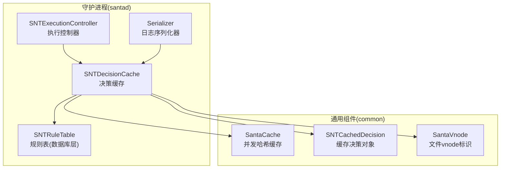
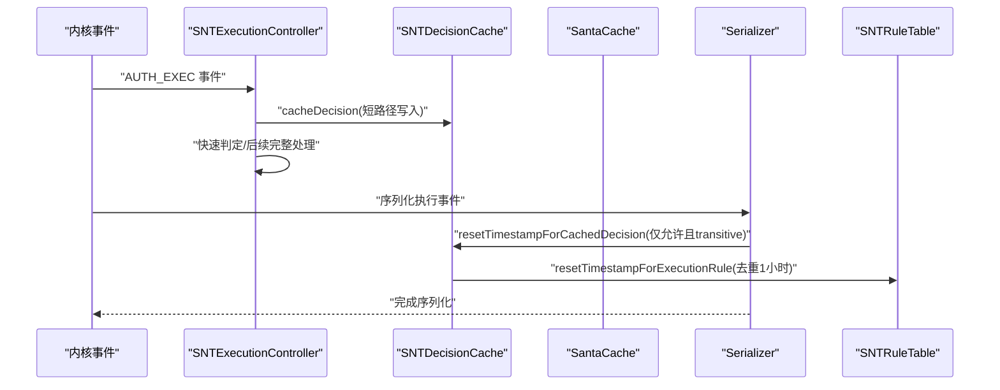
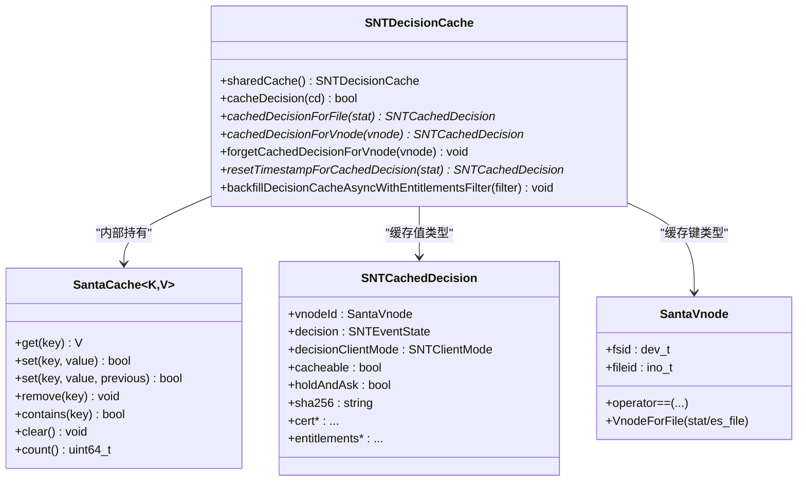
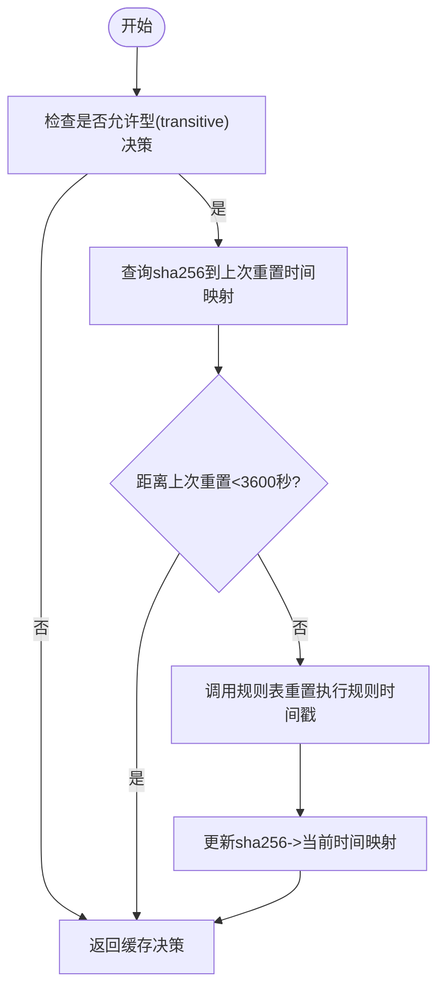
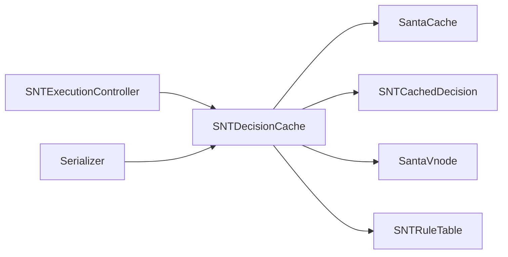

# 决策缓存

<cite>
**本文引用的文件**
- [SNTDecisionCache.h](file://Source/santad/SNTDecisionCache.h)
- [SNTDecisionCache.mm](file://Source/santad/SNTDecisionCache.mm)
- [SNTDecisionCacheTest.mm](file://Source/santad/SNTDecisionCacheTest.mm)
- [SNTExecutionController.h](file://Source/santad/SNTExecutionController.h)
- [SNTExecutionController.mm](file://Source/santad/SNTExecutionController.mm)
- [Serializer.mm](file://Source/santad/Logs/EndpointSecurity/Serializers/Serializer.mm)
- [SantaCache.h](file://Source/common/SantaCache.h)
- [SNTCachedDecision.h](file://Source/common/SNTCachedDecision.h)
- [SNTCachedDecision.mm](file://Source/common/SNTCachedDecision.mm)
- [SantaVnode.h](file://Source/common/SantaVnode.h)
- [SNTCommonEnums.h](file://Source/common/SNTCommonEnums.h)
- [main.cpp](file://Fuzzing/santacache/src/main.cpp)
</cite>

## 目录
1. [引言](#引言)
2. [项目结构](#项目结构)
3. [核心组件](#核心组件)
4. [架构总览](#架构总览)
5. [详细组件分析](#详细组件分析)
6. [依赖关系分析](#依赖关系分析)
7. [性能考量](#性能考量)
8. [故障排查指南](#故障排查指南)
9. [结论](#结论)
10. [附录](#附录)

## 引言
本文件针对 Santa 的“决策缓存”子系统进行深入技术文档化，重点围绕 SNTDecisionCache 类的设计架构、缓存策略与决策存储机制展开。文档将详细解释：
- 允许决策的缓存实现与缓存键生成算法（基于文件 vnode 标识）
- 缓存条目的生命周期管理（写入、查询、失效与回填）
- 决策缓存的存储格式与内存优化策略
- 并发访问控制与队列调度
- 关键 API：cacheDecision、cachedDecisionForFile、forgetCachedDecisionForVnode 等
- 缓存大小限制、内存使用监控与回填机制
- 不同执行模式下的行为差异与性能优化建议

## 项目结构
决策缓存位于守护进程侧（santad），通过统一的单例对外提供服务，并与执行控制器、序列化器、规则表等模块协作。

图示来源
- [SNTDecisionCache.mm](file://Source/santad/SNTDecisionCache.mm#L39-L83)
- [SNTExecutionController.mm](file://Source/santad/SNTExecutionController.mm#L157-L204)
- [Serializer.mm](file://Source/santad/Logs/EndpointSecurity/Serializers/Serializer.mm#L65-L80)
- [SantaCache.h](file://Source/common/SantaCache.h#L48-L110)
- [SNTCachedDecision.h](file://Source/common/SNTCachedDecision.h#L23-L61)
- [SantaVnode.h](file://Source/common/SantaVnode.h#L25-L54)

章节来源
- [SNTDecisionCache.h](file://Source/santad/SNTDecisionCache.h#L23-L34)
- [SNTDecisionCache.mm](file://Source/santad/SNTDecisionCache.mm#L39-L83)
- [SNTExecutionController.h](file://Source/santad/SNTExecutionController.h#L56-L107)
- [SNTExecutionController.mm](file://Source/santad/SNTExecutionController.mm#L157-L204)
- [Serializer.mm](file://Source/santad/Logs/EndpointSecurity/Serializers/Serializer.mm#L65-L80)
- [SantaCache.h](file://Source/common/SantaCache.h#L48-L110)
- [SNTCachedDecision.h](file://Source/common/SNTCachedDecision.h#L23-L61)
- [SantaVnode.h](file://Source/common/SantaVnode.h#L25-L54)

## 核心组件
- SNTDecisionCache：守护进程侧的决策缓存单例，负责缓存决策对象、回填运行中进程信息、重置允许型规则的时间戳等。
- SantaCache<K,V>：通用并发哈希缓存模板，提供按桶加锁、容量上限、清空策略等能力。
- SNTCachedDecision：封装一次执行事件的决策信息，作为缓存值。
- SantaVnode：文件 vnode 标识，作为缓存键。
- SNTExecutionController：在执行路径上对事件进行快速预处理并写入缓存，或决定是否进入完整处理流程。
- Serializer：在序列化执行事件时根据结果更新允许型决策的时间戳。

章节来源
- [SNTDecisionCache.h](file://Source/santad/SNTDecisionCache.h#L23-L34)
- [SNTDecisionCache.mm](file://Source/santad/SNTDecisionCache.mm#L39-L83)
- [SantaCache.h](file://Source/common/SantaCache.h#L48-L110)
- [SNTCachedDecision.h](file://Source/common/SNTCachedDecision.h#L23-L61)
- [SantaVnode.h](file://Source/common/SantaVnode.h#L25-L54)
- [SNTExecutionController.mm](file://Source/santad/SNTExecutionController.mm#L157-L204)
- [Serializer.mm](file://Source/santad/Logs/EndpointSecurity/Serializers/Serializer.mm#L65-L80)

## 架构总览
SNTDecisionCache 以单例形式提供全局缓存，内部使用 SantaCache<SantaVnode, SNTCachedDecision*> 实现高性能并发缓存。执行控制器在同步阶段快速写入缓存，序列化器在允许事件发生时触发时间戳回写，规则表负责持久化时间戳更新。

图示来源
- [SNTExecutionController.mm](file://Source/santad/SNTExecutionController.mm#L157-L204)
- [SNTDecisionCache.mm](file://Source/santad/SNTDecisionCache.mm#L73-L112)
- [Serializer.mm](file://Source/santad/Logs/EndpointSecurity/Serializers/Serializer.mm#L65-L80)

## 详细组件分析

### SNTDecisionCache 类设计与接口
- 单例初始化与属性
  - 使用 dispatch_once 初始化单例。
  - 维护一个 NSCache 用于记录 sha256 到上次重置时间戳的映射，限制数量为 100，避免无限增长。
  - 回填队列 backfillQ 使用串行队列，目标队列设置为 UTILITY QoS，平衡完成时间和 CPU 占用。
- 核心接口
  - cacheDecision：将 SNTCachedDecision 写入缓存（键为 vnode）。
  - cachedDecisionForFile：根据 stat 结构生成 vnode 键并查询缓存。
  - cachedDecisionForVnode：直接以 vnode 查询缓存。
  - forgetCachedDecisionForVnode：移除指定 vnode 的缓存项。
  - resetTimestampForCachedDecision：当命中允许型（transitive）决策时，每 3600 秒对规则表执行一次时间戳重置，并更新本地映射。
  - backfillDecisionCacheAsyncWithEntitlementsFilter：异步扫描当前运行进程，构造伪缓存条目（未知状态、不可缓存）并回填至缓存，避免真实评估开销。

图示来源
- [SNTDecisionCache.h](file://Source/santad/SNTDecisionCache.h#L23-L34)
- [SNTDecisionCache.mm](file://Source/santad/SNTDecisionCache.mm#L39-L83)
- [SantaCache.h](file://Source/common/SantaCache.h#L48-L110)
- [SNTCachedDecision.h](file://Source/common/SNTCachedDecision.h#L23-L61)
- [SantaVnode.h](file://Source/common/SantaVnode.h#L25-L54)

章节来源
- [SNTDecisionCache.h](file://Source/santad/SNTDecisionCache.h#L23-L34)
- [SNTDecisionCache.mm](file://Source/santad/SNTDecisionCache.mm#L39-L83)
- [SNTDecisionCacheTest.mm](file://Source/santad/SNTDecisionCacheTest.mm#L55-L101)

### 缓存键生成与存储格式
- 缓存键：使用 SantaVnode，由设备号 fsid 与 inode 号 fileid 组成，确保唯一性；同时提供从 stat 或 es_file 构造 vnode 的静态方法。
- 存储值：SNTCachedDecision 对象，包含决策状态、客户端模式、签名链、团队 ID、签名 ID、cdhash、权限过滤结果、标志位、时间戳等字段。
- 决策状态枚举：SNTEventState 覆盖“允许/拒绝”及多种细分类型，便于序列化与规则匹配。

章节来源
- [SantaVnode.h](file://Source/common/SantaVnode.h#L25-L54)
- [SNTCachedDecision.h](file://Source/common/SNTCachedDecision.h#L23-L61)
- [SNTCommonEnums.h](file://Source/common/SNTCommonEnums.h#L91-L125)

### 缓存策略与生命周期
- 写入策略
  - cacheDecision：直接写入 vnode->决策对象。
  - cacheDecisionIfNotSet：条件写入（CAS），避免覆盖已有值，用于回填场景。
- 查询策略
  - cachedDecisionForFile/cachedDecisionForVnode：按键获取，O(1) 桶内遍历查找。
- 失效策略
  - forgetCachedDecisionForVnode：删除对应键。
- 回填策略
  - backfillDecisionCacheAsyncWithEntitlementsFilter：扫描当前运行进程，构造未知状态的伪决策对象，填充签名链、团队 ID、签名 ID、cdhash、权限过滤结果等，仅在未被其他路径抢先写入时才加入缓存。
- 时间戳重置策略
  - resetTimestampForCachedDecision：仅对允许型（transitive）决策生效，使用 NSCache 记录最近重置时间，超过 3600 秒才再次写入数据库，降低规则表写放大。

图示来源
- [SNTDecisionCache.mm](file://Source/santad/SNTDecisionCache.mm#L93-L112)

章节来源
- [SNTDecisionCache.mm](file://Source/santad/SNTDecisionCache.mm#L73-L112)
- [SNTDecisionCache.mm](file://Source/santad/SNTDecisionCache.mm#L114-L205)

### 并发访问控制与内存优化
- 并发模型
  - SantaCache 使用“按桶加锁”，每个桶独立锁，减少热点冲突；插入/删除时若超出容量则整体清空，保证平均复杂度与内存占用可控。
  - SNTDecisionCache 的回填队列为串行队列，目标队列设为 UTILITY QoS，兼顾吞吐与系统响应。
- 内存优化
  - NSCache 的 countLimit 限制为 100，避免时间戳重置映射无限增长。
  - 回填时构造的伪决策对象 cacheable=false，避免污染主缓存。
  - 条件写入 cacheDecisionIfNotSet，避免重复写入与竞争。

章节来源
- [SantaCache.h](file://Source/common/SantaCache.h#L314-L416)
- [SNTDecisionCache.mm](file://Source/santad/SNTDecisionCache.mm#L39-L83)
- [SNTDecisionCache.mm](file://Source/santad/SNTDecisionCache.mm#L114-L205)

### 关键 API 详解
- cacheDecision
  - 功能：将 SNTCachedDecision 写入缓存，键为 vnode。
  - 返回：布尔值表示是否成功写入。
  - 适用：完整处理后写入缓存，或在同步阶段快速写入。
- cachedDecisionForFile / cachedDecisionForVnode
  - 功能：按文件或 vnode 查询缓存决策。
  - 返回：决策对象指针，不存在则为空。
- forgetCachedDecisionForVnode
  - 功能：移除指定 vnode 的缓存项。
  - 适用：需要强制失效或清理过期数据。
- resetTimestampForCachedDecision
  - 功能：对允许型（transitive）决策，按 3600 秒节流重置规则表时间戳，并更新本地映射。
  - 适用：序列化器在允许事件发生时调用，确保规则活跃度统计准确。
- backfillDecisionCacheAsyncWithEntitlementsFilter
  - 功能：异步扫描运行中进程，构造伪决策对象并回填缓存。
  - 适用：启动或后台维护阶段提升命中率，减少实时计算。

章节来源
- [SNTDecisionCache.h](file://Source/santad/SNTDecisionCache.h#L23-L34)
- [SNTDecisionCache.mm](file://Source/santad/SNTDecisionCache.mm#L73-L112)
- [SNTDecisionCache.mm](file://Source/santad/SNTDecisionCache.mm#L114-L205)

### 执行路径中的使用
- 同步快速路径
  - 在 synchronousShouldProcessExecEvent 中，对超长路径等边界情况快速构造 SNTCachedDecision 并写入缓存，避免进入完整处理流程。
- 完整处理路径
  - 在 validateExecEvent 中，经策略处理器生成最终决策后写入缓存，供后续序列化与日志使用。

章节来源
- [SNTExecutionController.mm](file://Source/santad/SNTExecutionController.mm#L157-L204)

### 序列化与时间戳更新
- Serializer 在允许事件发生时调用 resetTimestampForCachedDecision，确保允许型规则的活跃度得到持久化更新，且按 3600 秒节流，避免频繁写库。

章节来源
- [Serializer.mm](file://Source/santad/Logs/EndpointSecurity/Serializers/Serializer.mm#L65-L80)

## 依赖关系分析
- SNTDecisionCache 依赖
  - SantaCache：提供并发、容量控制与清空策略。
  - SNTCachedDecision：缓存值类型。
  - SantaVnode：缓存键类型。
  - SNTRuleTable：持久化时间戳重置。
  - EntitlementsFilter：回填时对权限进行过滤。
- 调用链
  - 执行控制器 -> 决策缓存 -> 圣诞缓存 -> 规则表
  - 序列化器 -> 决策缓存 -> 规则表

图示来源
- [SNTExecutionController.mm](file://Source/santad/SNTExecutionController.mm#L157-L204)
- [SNTDecisionCache.mm](file://Source/santad/SNTDecisionCache.mm#L39-L83)
- [Serializer.mm](file://Source/santad/Logs/EndpointSecurity/Serializers/Serializer.mm#L65-L80)

章节来源
- [SNTDecisionCache.mm](file://Source/santad/SNTDecisionCache.mm#L39-L83)
- [SNTExecutionController.mm](file://Source/santad/SNTExecutionController.mm#L157-L204)
- [Serializer.mm](file://Source/santad/Logs/EndpointSecurity/Serializers/Serializer.mm#L65-L80)

## 性能考量
- 哈希缓存复杂度
  - get/set/contains：平均 O(1)，最坏 O(n/bucket)，n 为元素数，bucket 为桶数。
  - 清空策略：当新增导致容量超限，会整体清空所有桶，避免持续扩容带来的碎片化与锁争用。
- 并发与锁
  - 按桶加锁，减少热点冲突；串行回填队列避免回填过程中的竞争。
- 时间戳重置节流
  - 3600 秒最小间隔，显著降低规则表写操作频率。
- 回填策略
  - 仅在未命中时写入伪决策对象，避免污染真实缓存；构造成本低，覆盖签名链、团队 ID、签名 ID、cdhash、权限过滤结果等关键信息，提升后续命中率。

章节来源
- [SantaCache.h](file://Source/common/SantaCache.h#L314-L416)
- [SNTDecisionCache.mm](file://Source/santad/SNTDecisionCache.mm#L93-L112)
- [SNTDecisionCache.mm](file://Source/santad/SNTDecisionCache.mm#L114-L205)

## 故障排查指南
- 缓存未命中
  - 检查 cachedDecisionForFile/cachedDecisionForVnode 是否传入了正确的 stat 或 vnode。
  - 确认 cacheDecision 是否已正确写入，或是否被 forgetCachedDecisionForVnode 删除。
- 允许型规则时间戳未更新
  - 确认决策状态为允许型（transitive），且 resetTimestampForCachedDecision 是否被调用。
  - 检查 NSCache 映射是否因 countLimit 导致过期项被回收。
- 回填未生效
  - 确认 backfillDecisionCacheAsyncWithEntitlementsFilter 已被调用且队列正常工作。
  - 检查 cacheDecisionIfNotSet 是否被其他路径抢先写入导致回填失败计数增加。
- 单元测试参考
  - 测试基本操作与时间戳重置节流逻辑，可作为回归验证的依据。

章节来源
- [SNTDecisionCacheTest.mm](file://Source/santad/SNTDecisionCacheTest.mm#L55-L101)
- [SNTDecisionCache.mm](file://Source/santad/SNTDecisionCache.mm#L93-L112)
- [SNTDecisionCache.mm](file://Source/santad/SNTDecisionCache.mm#L114-L205)

## 结论
SNTDecisionCache 通过轻量、高并发的 SantaCache 实现，结合 vnode 键与 SNTCachedDecision 值，提供了高效的执行决策缓存能力。配合回填、时间戳重置节流与串行回填队列，系统在保证准确性的同时，显著降低了规则表写放大与实时计算开销。接口设计简洁清晰，易于集成到执行控制器与序列化器中，满足生产环境的稳定性与性能要求。

## 附录
- 缓存大小限制
  - SantaCache 的容量上限由构造参数决定，默认最大容量与每桶条目数可调；当新增导致超限时，会整体清空缓存，确保一致性与性能。
- 内存使用监控
  - 可通过 SantaCache 的 count() 获取当前条目数；bucket_counts() 可分桶统计各桶条目数，辅助定位热点与容量瓶颈。
- 回填机制实现要点
  - 仅在未命中时写入伪决策对象，避免污染真实缓存；签名链、团队 ID、签名 ID、cdhash、权限过滤结果等关键信息在回填时尽可能填充，提升后续命中率。

章节来源
- [SantaCache.h](file://Source/common/SantaCache.h#L254-L304)
- [SNTDecisionCache.mm](file://Source/santad/SNTDecisionCache.mm#L114-L205)
- [main.cpp](file://Fuzzing/santacache/src/main.cpp#L1-L43)