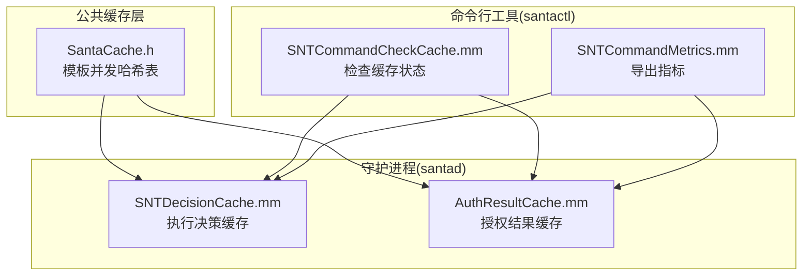
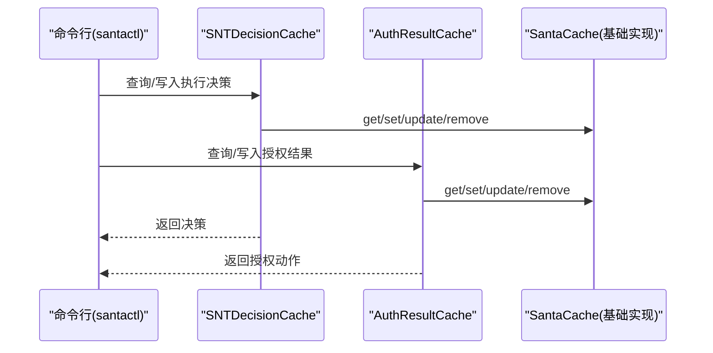
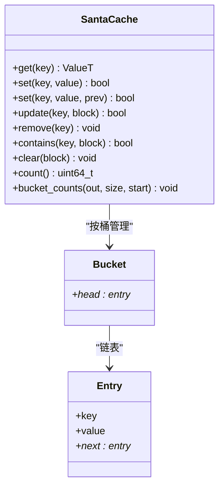
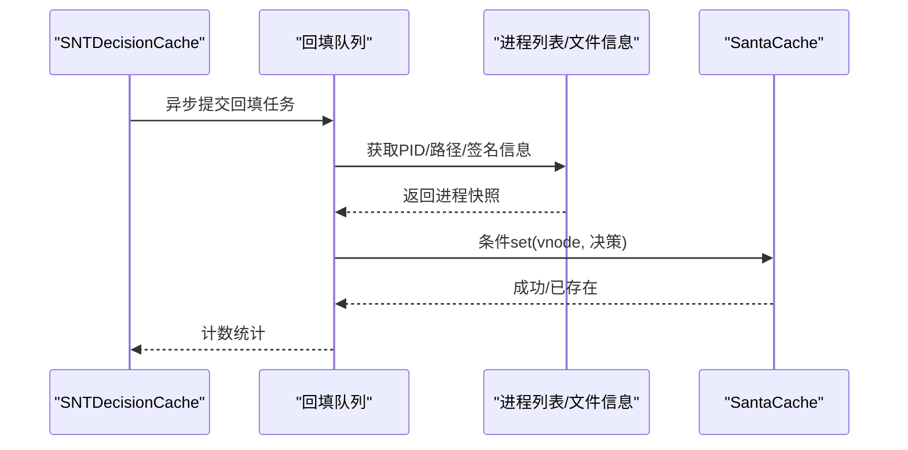
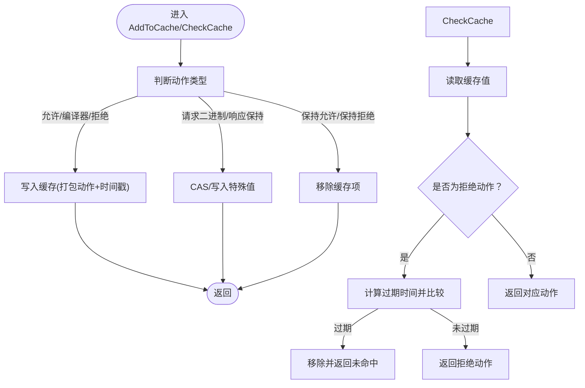
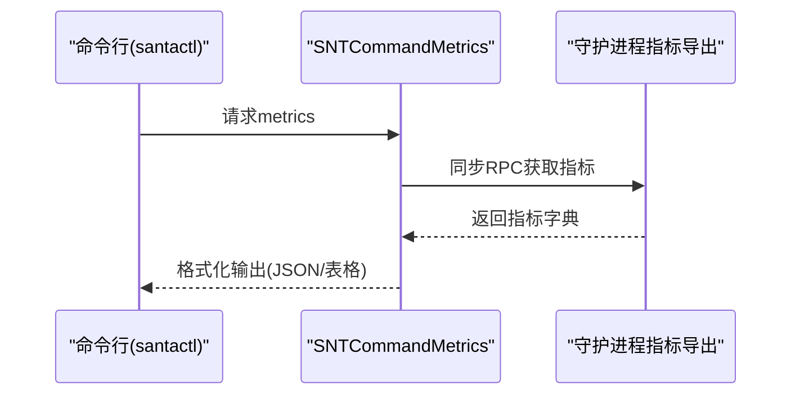
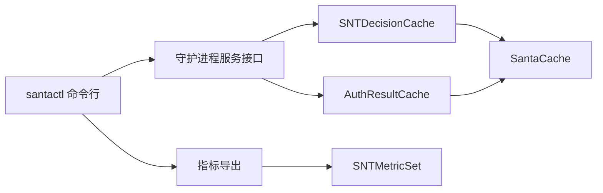

# 缓存性能优化

<cite>
**本文引用的文件**
- [Source/common/SantaCache.h](file://Source/common/SantaCache.h)
- [Source/common/SantaCacheTest.mm](file://Source/common/SantaCacheTest.mm)
- [Fuzzing/santacache/src/main.cpp](file://Fuzzing/santacache/src/main.cpp)
- [Source/santad/SNTDecisionCache.mm](file://Source/santad/SNTDecisionCache.mm)
- [Source/santad/EventProviders/AuthResultCache.mm](file://Source/santad/EventProviders/AuthResultCache.mm)
- [Source/santad/EventProviders/AuthResultCache.h](file://Source/santad/EventProviders/AuthResultCache.h)
- [Source/santactl/Commands/SNTCommandCheckCache.mm](file://Source/santactl/Commands/SNTCommandCheckCache.mm)
- [Source/santactl/Commands/SNTCommandMetrics.mm](file://Source/santactl/Commands/SNTCommandMetrics.mm)
- [Source/common/SNTMetricSet.mm](file://Source/common/SNTMetricSet.mm)
- [Source/santad/MetricsTest.mm](file://Source/santad/MetricsTest.mm)
</cite>

## 目录
1. [引言](#引言)
2. [项目结构](#项目结构)
3. [核心组件](#核心组件)
4. [架构总览](#架构总览)
5. [详细组件分析](#详细组件分析)
6. [依赖关系分析](#依赖关系分析)
7. [性能考量](#性能考量)
8. [故障排除指南](#故障排除指南)
9. [结论](#结论)
10. [附录](#附录)

## 引言
本技术文档聚焦于 Santa 的缓存性能优化，围绕以下目标展开：缓存性能监控指标、命中率分析与瓶颈识别；缓存内存使用优化、预热策略与清理机制；并发性能、锁竞争优化与多线程安全；缓存调优建议、基准测试与对比分析；以及在不同硬件环境下的性能表现与优化策略。文档基于仓库中实际实现进行分析，并提供可操作的优化建议与排障指引。

## 项目结构
Santa 在多个模块中使用高性能并发哈希缓存：
- 基础缓存实现位于公共头文件，提供模板化并发哈希表（按桶加锁）。
- 决策缓存用于执行决策结果的短期驻留，加速重复访问。
- 授权结果缓存用于 EndpointSecurity 授权路径上的快速判定与过期控制。
- 工具命令提供运行时检查与指标导出能力，便于性能观测与验证。

图表来源
- [Source/common/SantaCache.h](file://Source/common/SantaCache.h#L48-L125)
- [Source/santad/SNTDecisionCache.mm](file://Source/santad/SNTDecisionCache.mm#L45-L90)
- [Source/santad/EventProviders/AuthResultCache.mm](file://Source/santad/EventProviders/AuthResultCache.mm#L111-L171)
- [Source/santactl/Commands/SNTCommandCheckCache.mm](file://Source/santactl/Commands/SNTCommandCheckCache.mm#L57-L76)
- [Source/santactl/Commands/SNTCommandMetrics.mm](file://Source/santactl/Commands/SNTCommandMetrics.mm#L168-L181)

章节来源
- [Source/common/SantaCache.h](file://Source/common/SantaCache.h#L48-L125)
- [Source/santad/SNTDecisionCache.mm](file://Source/santad/SNTDecisionCache.mm#L45-L90)
- [Source/santad/EventProviders/AuthResultCache.mm](file://Source/santad/EventProviders/AuthResultCache.mm#L111-L171)
- [Source/santactl/Commands/SNTCommandCheckCache.mm](file://Source/santactl/Commands/SNTCommandCheckCache.mm#L57-L76)
- [Source/santactl/Commands/SNTCommandMetrics.mm](file://Source/santactl/Commands/SNTCommandMetrics.mm#L168-L181)

## 核心组件
- 并发哈希缓存 SantaCache
  - 按桶加锁，桶数量由最大容量与“每桶目标条目数”共同决定，提升并发度同时控制内存占用。
  - 提供 get/set/update/remove/foreach/clear/count/bucket_counts 等接口，支持 CAS 场景与批量遍历。
  - 当新增元素导致超限，会自动清空全表以维持上限，避免无限增长。
- 执行决策缓存 SNTDecisionCache
  - 使用 SantaCache 存储 vnode 到决策对象的映射，支持回填（backfill）以预热常用进程信息。
  - 提供异步回填队列，平衡 CPU 占用与完成时间。
- 授权结果缓存 AuthResultCache
  - 针对根文件系统与非根文件系统分别维护两份缓存，按设备号区分。
  - 将动作与时间戳打包存储，支持拒绝缓存的过期剔除。
  - 提供按原因的缓存清空计数指标，便于定位失效场景。

章节来源
- [Source/common/SantaCache.h](file://Source/common/SantaCache.h#L60-L125)
- [Source/common/SantaCache.h](file://Source/common/SantaCache.h#L127-L342)
- [Source/common/SantaCache.h](file://Source/common/SantaCache.h#L305-L463)
- [Source/santad/SNTDecisionCache.mm](file://Source/santad/SNTDecisionCache.mm#L45-L90)
- [Source/santad/SNTDecisionCache.mm](file://Source/santad/SNTDecisionCache.mm#L114-L205)
- [Source/santad/EventProviders/AuthResultCache.mm](file://Source/santad/EventProviders/AuthResultCache.mm#L111-L171)
- [Source/santad/EventProviders/AuthResultCache.mm](file://Source/santad/EventProviders/AuthResultCache.mm#L177-L197)

## 架构总览
下图展示缓存在系统中的交互关系：上层通过命令行或服务接口触发缓存查询/写入，底层由 SantaCache 提供并发安全的哈希表实现，守护进程内的缓存组件负责业务语义与生命周期管理。

图表来源
- [Source/santactl/Commands/SNTCommandCheckCache.mm](file://Source/santactl/Commands/SNTCommandCheckCache.mm#L57-L76)
- [Source/santad/SNTDecisionCache.mm](file://Source/santad/SNTDecisionCache.mm#L73-L91)
- [Source/santad/EventProviders/AuthResultCache.mm](file://Source/santad/EventProviders/AuthResultCache.mm#L148-L171)
- [Source/common/SantaCache.h](file://Source/common/SantaCache.h#L84-L125)

## 详细组件分析

### 组件A：SantaCache 并发哈希缓存
- 设计要点
  - 桶数量计算为“上限/每桶目标”的向上 2 次幂，兼顾负载均衡与内存占用。
  - 每桶独立锁位，减少全局锁争用；通过指针最低位作为自旋锁标志，避免额外内存开销。
  - 超限时自动清空全表，确保最大容量约束。
- 关键流程
  - get：定位桶、加锁、链表遍历查找、返回值或零值。
  - set：若命中则更新；未命中且超限则加“清空专用锁”后清空，再插入新项。
  - update：先创建或获取现有值，在持有锁期间回调更新。
  - foreach/clear：逐桶加锁，遍历或释放链表节点，最后清零桶元数据。
  - bucket_counts：分段统计各桶条目数，支持高起始位置与大数组尺寸的安全边界处理。
- 并发与线程安全
  - 每桶自旋锁，避免跨桶全局锁；清空过程使用专用桶锁防止竞态。
  - 对异常解锁进行日志与中止保护，避免不一致状态。

图表来源
- [Source/common/SantaCache.h](file://Source/common/SantaCache.h#L84-L125)
- [Source/common/SantaCache.h](file://Source/common/SantaCache.h#L127-L342)
- [Source/common/SantaCache.h](file://Source/common/SantaCache.h#L305-L463)

章节来源
- [Source/common/SantaCache.h](file://Source/common/SantaCache.h#L60-L125)
- [Source/common/SantaCache.h](file://Source/common/SantaCache.h#L127-L342)
- [Source/common/SantaCache.h](file://Source/common/SantaCache.h#L305-L463)
- [Source/common/SantaCacheTest.mm](file://Source/common/SantaCacheTest.mm#L105-L150)
- [Fuzzing/santacache/src/main.cpp](file://Fuzzing/santacache/src/main.cpp#L20-L43)

### 组件B：SNTDecisionCache 执行决策缓存
- 作用
  - 以 vnode 为键缓存执行决策，避免重复规则评估。
  - 支持回填（backfill），从运行进程快照填充缓存，降低冷启动延迟。
- 关键流程
  - 回填队列使用 QoS 适配，平衡 CPU 占用与完成时间。
  - 通过条件 set 避免覆盖已有决策，保证一致性。
- 性能影响
  - 合理设置最大容量与每桶目标，可提升命中率与并发吞吐。
  - 回填批量化减少数据库访问次数，但需注意队列优先级与资源消耗。

图表来源
- [Source/santad/SNTDecisionCache.mm](file://Source/santad/SNTDecisionCache.mm#L114-L205)
- [Source/santad/SNTDecisionCache.mm](file://Source/santad/SNTDecisionCache.mm#L73-L91)

章节来源
- [Source/santad/SNTDecisionCache.mm](file://Source/santad/SNTDecisionCache.mm#L45-L90)
- [Source/santad/SNTDecisionCache.mm](file://Source/santad/SNTDecisionCache.mm#L114-L205)

### 组件C：AuthResultCache 授权结果缓存
- 作用
  - 依据文件系统设备号选择根/非根缓存，隔离不同挂载点的缓存行为。
  - 将动作与时间戳打包存储，支持拒绝缓存的过期剔除。
- 关键流程
  - 添加到缓存：根据动作类型决定是否写入、CAS 更新或移除。
  - 检查缓存：命中则返回动作；拒绝缓存若过期则移除并返回未命中。
  - 清理缓存：按模式清空根/非根缓存，并异步通知 ES 客户端同步清理。
- 指标与可观测性
  - 通过指标集记录不同原因的清空次数，辅助定位失效场景。

图表来源
- [Source/santad/EventProviders/AuthResultCache.mm](file://Source/santad/EventProviders/AuthResultCache.mm#L111-L171)
- [Source/santad/EventProviders/AuthResultCache.mm](file://Source/santad/EventProviders/AuthResultCache.mm#L177-L197)
- [Source/santad/EventProviders/AuthResultCache.h](file://Source/santad/EventProviders/AuthResultCache.h#L34-L37)

章节来源
- [Source/santad/EventProviders/AuthResultCache.mm](file://Source/santad/EventProviders/AuthResultCache.mm#L111-L171)
- [Source/santad/EventProviders/AuthResultCache.mm](file://Source/santad/EventProviders/AuthResultCache.mm#L177-L197)
- [Source/santad/EventProviders/AuthResultCache.h](file://Source/santad/EventProviders/AuthResultCache.h#L34-L37)

### 组件D：指标与诊断工具
- 指标导出
  - 通过命令行导出指标，支持过滤前缀与 JSON 输出，便于集成监控系统。
  - 指标集支持计数器/整型量表等类型，提供常量指标注册能力。
- 缓存清空计数
  - 授权结果缓存按原因记录清空次数，便于定位配置变更、规则更新等导致的缓存失效。
- 运行时检查
  - 提供检查指定文件在缓存中的状态的能力，辅助开发与调试。

图表来源
- [Source/santactl/Commands/SNTCommandMetrics.mm](file://Source/santactl/Commands/SNTCommandMetrics.mm#L168-L181)
- [Source/common/SNTMetricSet.mm](file://Source/common/SNTMetricSet.mm#L294-L327)
- [Source/common/SNTMetricSet.mm](file://Source/common/SNTMetricSet.mm#L579-L604)

章节来源
- [Source/santactl/Commands/SNTCommandMetrics.mm](file://Source/santactl/Commands/SNTCommandMetrics.mm#L168-L181)
- [Source/common/SNTMetricSet.mm](file://Source/common/SNTMetricSet.mm#L294-L327)
- [Source/common/SNTMetricSet.mm](file://Source/common/SNTMetricSet.mm#L579-L604)
- [Source/santactl/Commands/SNTCommandCheckCache.mm](file://Source/santactl/Commands/SNTCommandCheckCache.mm#L57-L76)
- [Source/santad/MetricsTest.mm](file://Source/santad/MetricsTest.mm#L320-L350)
- [Source/santad/MetricsTest.mm](file://Source/santad/MetricsTest.mm#L335-L504)

## 依赖关系分析
- 组件耦合
  - SNTDecisionCache 与 AuthResultCache 均依赖 SantaCache，形成“业务语义层”与“并发哈希表实现层”的清晰分离。
  - 命令行工具仅通过 XPC 接口与守护进程交互，不直接依赖具体缓存实现细节。
- 外部依赖
  - SantaCache 使用系统原子操作与日志设施，保证在内核扩展/守护进程环境中稳定运行。
  - 指标系统提供统一的指标注册与导出接口，便于观测与告警。

图表来源
- [Source/santactl/Commands/SNTCommandCheckCache.mm](file://Source/santactl/Commands/SNTCommandCheckCache.mm#L57-L76)
- [Source/santactl/Commands/SNTCommandMetrics.mm](file://Source/santactl/Commands/SNTCommandMetrics.mm#L168-L181)
- [Source/santad/SNTDecisionCache.mm](file://Source/santad/SNTDecisionCache.mm#L45-L90)
- [Source/santad/EventProviders/AuthResultCache.mm](file://Source/santad/EventProviders/AuthResultCache.mm#L111-L171)
- [Source/common/SantaCache.h](file://Source/common/SantaCache.h#L48-L125)
- [Source/common/SNTMetricSet.mm](file://Source/common/SNTMetricSet.mm#L294-L327)

章节来源
- [Source/santactl/Commands/SNTCommandCheckCache.mm](file://Source/santactl/Commands/SNTCommandCheckCache.mm#L57-L76)
- [Source/santactl/Commands/SNTCommandMetrics.mm](file://Source/santactl/Commands/SNTCommandMetrics.mm#L168-L181)
- [Source/santad/SNTDecisionCache.mm](file://Source/santad/SNTDecisionCache.mm#L45-L90)
- [Source/santad/EventProviders/AuthResultCache.mm](file://Source/santad/EventProviders/AuthResultCache.mm#L111-L171)
- [Source/common/SantaCache.h](file://Source/common/SantaCache.h#L48-L125)
- [Source/common/SNTMetricSet.mm](file://Source/common/SNTMetricSet.mm#L294-L327)

## 性能考量
- 缓存命中率与分布
  - 测试覆盖了随机键与单调键的分布稳定性，标准差应低于“每桶目标”的一半，确保均匀分布。
  - 建议在高并发场景下适当提高“每桶目标”，以降低单桶冲突概率。
- 并发与锁竞争
  - 每桶自旋锁显著降低全局锁争用；清空过程使用专用桶锁避免竞态。
  - 对于热点键，建议结合业务侧的键空间特征调整桶数量与容量，减少链表长度。
- 内存使用优化
  - 通过合理设置最大容量与每桶目标，可在命中率与内存占用之间取得平衡。
  - 对于大对象（如决策对象），可考虑外部存储或共享池，仅缓存轻量索引。
- 预热策略
  - 执行决策缓存支持回填，建议在系统活跃时段或启动后异步执行，避免阻塞关键路径。
  - 预热时可优先填充高频进程与热点二进制，缩短首次决策延迟。
- 清理机制
  - 授权结果缓存支持按原因的清空计数指标，便于定位规则变更、客户端模式切换等导致的缓存失效。
  - 拒绝缓存具备过期剔除逻辑，避免长期缓存过期决策。
- 基准测试与对比
  - 可使用仓库中的模糊测试入口对 SantaCache 进行压力测试，观察不同键分布与并发度下的性能表现。
  - 建议对比不同“每桶目标”与容量组合下的命中率、尾延迟与内存占用，选择最优参数。

章节来源
- [Source/common/SantaCacheTest.mm](file://Source/common/SantaCacheTest.mm#L105-L150)
- [Fuzzing/santacache/src/main.cpp](file://Fuzzing/santacache/src/main.cpp#L20-L43)
- [Source/santad/SNTDecisionCache.mm](file://Source/santad/SNTDecisionCache.mm#L114-L205)
- [Source/santad/EventProviders/AuthResultCache.mm](file://Source/santad/EventProviders/AuthResultCache.mm#L177-L197)
- [Source/santad/MetricsTest.mm](file://Source/santad/MetricsTest.mm#L320-L350)

## 故障排除指南
- 命中率低
  - 检查键分布是否过于集中，必要时增加“每桶目标”或调整最大容量。
  - 观察 bucket_counts 分布，确认是否存在极端倾斜。
- 并发退化
  - 确认是否存在热点键导致单桶争用；可考虑键空间扰动或拆分缓存。
  - 检查是否存在频繁清空导致的抖动，评估容量阈值与清空策略。
- 指标异常
  - 授权结果缓存清空计数异常升高时，核查配置变更、规则更新或客户端模式切换事件。
  - 使用指标导出命令查看当前指标状态，定位异常字段与时间窗口。
- 运行时检查
  - 使用检查缓存命令对特定文件进行状态查询，确认其是否命中或被剔除。

章节来源
- [Source/common/SantaCache.h](file://Source/common/SantaCache.h#L264-L303)
- [Source/santactl/Commands/SNTCommandCheckCache.mm](file://Source/santactl/Commands/SNTCommandCheckCache.mm#L57-L76)
- [Source/santactl/Commands/SNTCommandMetrics.mm](file://Source/santactl/Commands/SNTCommandMetrics.mm#L168-L181)
- [Source/santad/EventProviders/AuthResultCache.mm](file://Source/santad/EventProviders/AuthResultCache.mm#L177-L197)
- [Source/santad/MetricsTest.mm](file://Source/santad/MetricsTest.mm#L320-L350)

## 结论
Santa 的缓存体系通过模板化并发哈希表与业务语义缓存的分层设计，在保证线程安全的同时提供了良好的性能与可观测性。通过对命中率、分布、并发与内存的综合优化，并结合预热与清理策略，可在不同硬件环境下获得稳定的低延迟与高吞吐表现。建议持续利用指标与诊断工具进行回归验证，并在生产环境中以渐进方式调整参数，确保稳定性与性能的平衡。

## 附录
- 参数建议
  - 最大容量：根据峰值并发与内存预算设定，避免频繁清空。
  - 每桶目标：建议在 4–16 之间进行 A/B 测试，兼顾命中率与锁粒度。
  - 回填队列：使用 UTILITY QoS 平衡完成时间与 CPU 占用。
- 硬件环境差异
  - 服务器/桌面：更高的并发与更大的容量可提升整体吞吐。
  - 笔记本/移动设备：更注重内存占用与能耗，建议较小容量与较低每桶目标。
- 基准测试方法
  - 使用模糊测试入口模拟真实工作负载，记录命中率、尾延迟与内存占用。
  - 对比不同参数组合，绘制性能曲线，选择性价比最优方案。