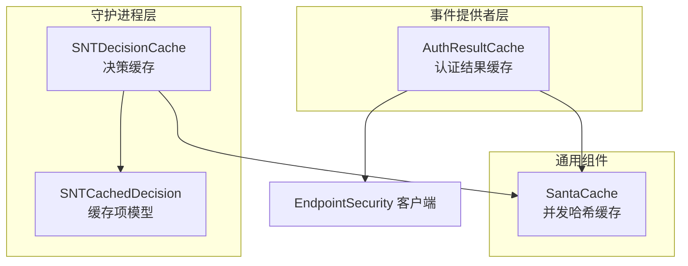
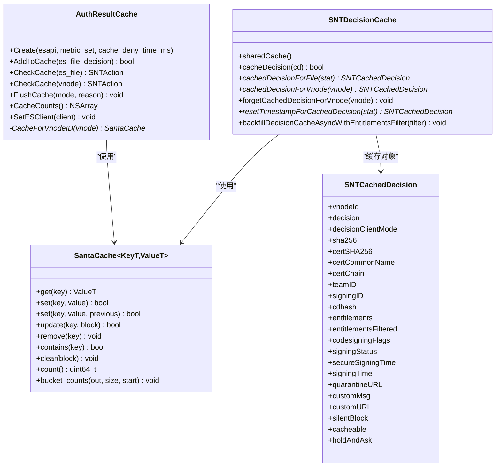
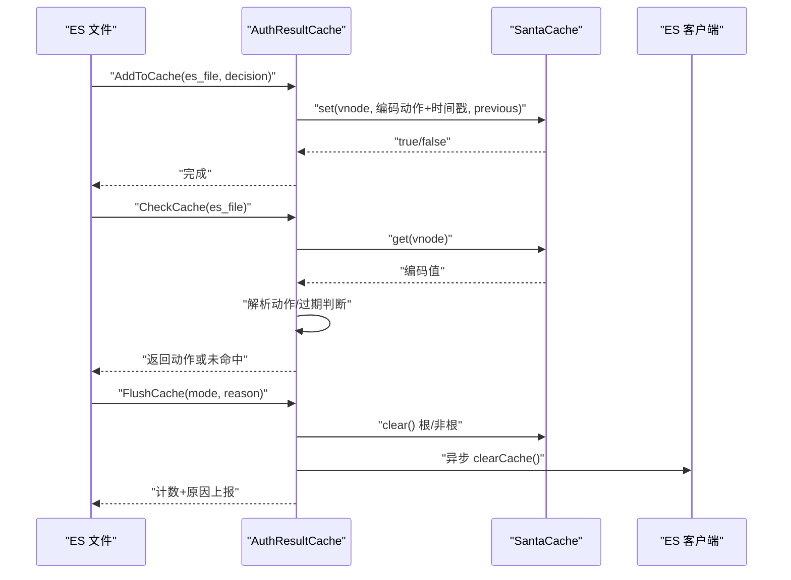
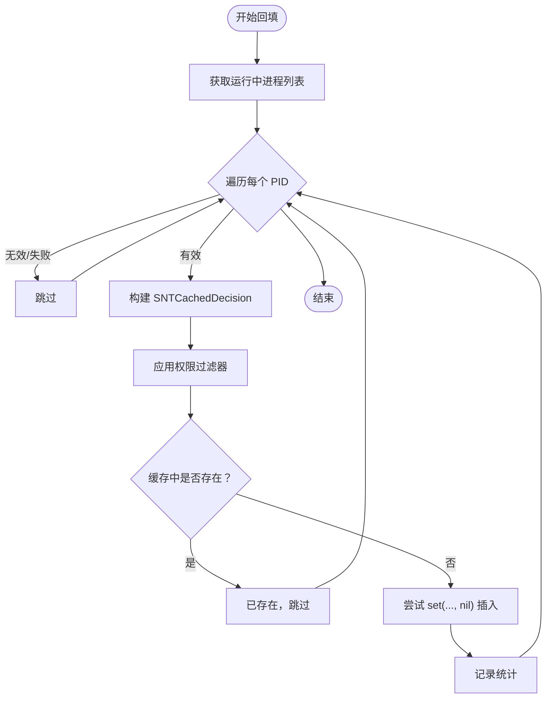
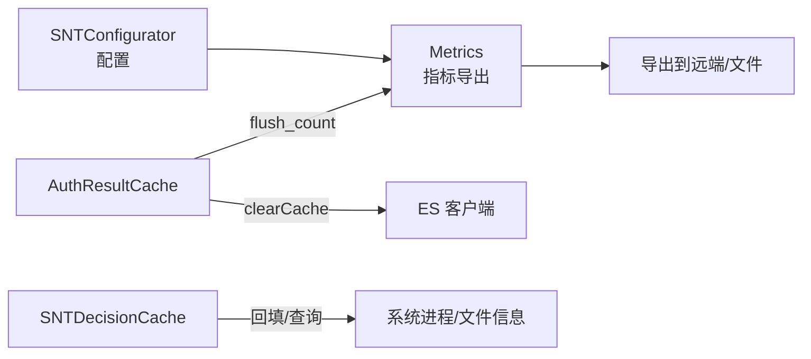

# 缓存机制

<cite>
**本文引用的文件**
- [Source/common/SantaCache.h](file://Source/common/SantaCache.h)
- [Source/common/SantaCacheTest.mm](file://Source/common/SantaCacheTest.mm)
- [Fuzzing/santacache/src/main.cpp](file://Fuzzing/santacache/src/main.cpp)
- [Source/santad/EventProviders/AuthResultCache.h](file://Source/santad/EventProviders/AuthResultCache.h)
- [Source/santad/EventProviders/AuthResultCache.mm](file://Source/santad/EventProviders/AuthResultCache.mm)
- [Source/santad/EventProviders/AuthResultCacheTest.mm](file://Source/santad/EventProviders/AuthResultCacheTest.mm)
- [Source/santad/SNTDecisionCache.h](file://Source/santad/SNTDecisionCache.h)
- [Source/santad/SNTDecisionCache.mm](file://Source/santad/SNTDecisionCache.mm)
- [Source/common/SNTCachedDecision.h](file://Source/common/SNTCachedDecision.h)
- [Source/common/SNTConfigurator.h](file://Source/common/SNTConfigurator.h)
- [Source/common/SNTConfigurator.mm](file://Source/common/SNTConfigurator.mm)
- [Source/common/SNTMetricSet.mm](file://Source/common/SNTMetricSet.mm)
- [Source/santad/Metrics.mm](file://Source/santad/Metrics.mm)
- [Source/santad/MetricsTest.mm](file://Source/santad/MetricsTest.mm)
</cite>

## 目录
1. [引言](#引言)
2. [项目结构](#项目结构)
3. [核心组件](#核心组件)
4. [架构总览](#架构总览)
5. [详细组件分析](#详细组件分析)
6. [依赖关系分析](#依赖关系分析)
7. [性能考量](#性能考量)
8. [故障排除指南](#故障排除指南)
9. [结论](#结论)
10. [附录](#附录)

## 引言
本文件系统性梳理 Santa 的两类关键缓存：认证结果缓存（AuthResultCache）与决策缓存（SNTDecisionCache）。围绕设计原理、缓存策略、失效机制、并发控制、内存管理、配置参数、性能调优与监控指标进行深入解析，并给出在不同运行模式下的行为差异与最佳实践建议。

## 项目结构
- 认证结果缓存位于事件提供者层，负责对 EndpointSecurity 文件授权事件的结果进行短期缓存，支持按根分区与非根分区两套独立缓存，具备基于时间的 Deny 失效与显式清空能力。
- 决策缓存位于守护进程层，用于缓存执行决策元数据，支撑回填与规则命中后的快速判定，同时提供对“瞬态允许规则”的时间戳重置节流。

图表来源
- [Source/santad/EventProviders/AuthResultCache.h](file://Source/santad/EventProviders/AuthResultCache.h#L1-L98)
- [Source/santad/EventProviders/AuthResultCache.mm](file://Source/santad/EventProviders/AuthResultCache.mm#L1-L200)
- [Source/santad/SNTDecisionCache.h](file://Source/santad/SNTDecisionCache.h#L1-L35)
- [Source/santad/SNTDecisionCache.mm](file://Source/santad/SNTDecisionCache.mm#L1-L208)
- [Source/common/SantaCache.h](file://Source/common/SantaCache.h#L1-L468)
- [Source/common/SNTCachedDecision.h](file://Source/common/SNTCachedDecision.h#L1-L61)

章节来源
- [Source/santad/EventProviders/AuthResultCache.h](file://Source/santad/EventProviders/AuthResultCache.h#L1-L98)
- [Source/santad/SNTDecisionCache.h](file://Source/santad/SNTDecisionCache.h#L1-L35)
- [Source/common/SantaCache.h](file://Source/common/SantaCache.h#L1-L120)

## 核心组件
- 并发哈希缓存 SantaCache<K,V>
  - 基于桶数组与链表的哈希表，按桶加锁；容量超限自动清空；提供 get/set/update/remove/clear/count/bucket_counts 等接口。
  - 支持最大容量与每桶目标条目数（per_bucket），通过桶数量近似为 2 的幂来平衡性能与内存占用。
- 认证结果缓存 AuthResultCache
  - 针对 ES 文件授权事件，缓存授权动作（允许/拒绝/保持等），区分根分区与非根分区两套缓存。
  - 拒绝结果带时间戳，支持按配置的 Deny 缓存时长过期；支持显式清空并可异步通知 ES 清理其本地缓存。
- 决策缓存 SNTDecisionCache
  - 缓存执行决策元数据（含签名、证书、权限等），支持回填现有进程信息以提升启动阶段的可观测性。
  - 对瞬态允许规则的时间戳重置进行节流（默认 3600 秒），避免频繁写库。

章节来源
- [Source/common/SantaCache.h](file://Source/common/SantaCache.h#L48-L120)
- [Source/santad/EventProviders/AuthResultCache.mm](file://Source/santad/EventProviders/AuthResultCache.mm#L111-L171)
- [Source/santad/SNTDecisionCache.mm](file://Source/santad/SNTDecisionCache.mm#L73-L112)

## 架构总览
认证结果缓存与决策缓存共享底层并发哈希缓存 SantaCache，前者面向 ES 授权路径的短期加速，后者面向执行决策的元数据复用与回填。

图表来源
- [Source/common/SantaCache.h](file://Source/common/SantaCache.h#L48-L468)
- [Source/santad/EventProviders/AuthResultCache.h](file://Source/santad/EventProviders/AuthResultCache.h#L50-L98)
- [Source/santad/SNTDecisionCache.h](file://Source/santad/SNTDecisionCache.h#L23-L35)
- [Source/common/SNTCachedDecision.h](file://Source/common/SNTCachedDecision.h#L23-L61)

## 详细组件分析

### 认证结果缓存（AuthResultCache）
- 设计要点
  - 双缓存：按设备号区分根分区与非根分区，分别维护独立的 SantaCache 实例，降低跨卷影响。
  - 动作编码：将动作与时间戳打包存储，高 8 位放动作，低 56 位放纳秒级时间戳，便于快速解析与过期判断。
  - 状态机约束：仅终端动作（允许/拒绝/保持）进入缓存；中间态不缓存或需移除，确保状态转换正确。
  - 过期策略：拒绝动作带过期时间，超过阈值自动清理；检查时若已过期则返回未命中。
  - 清空策略：支持仅清非根缓存或全量清空；全量清空时异步通知 ES 客户端同步清理其本地缓存。
- 并发与一致性
  - 底层 SantaCache 按桶加锁，读写均在对应桶上串行化，避免竞争。
  - 使用队列隔离 ES 清理调用，避免潜在死锁。
- 关键流程（添加/查询/清空）

图表来源
- [Source/santad/EventProviders/AuthResultCache.mm](file://Source/santad/EventProviders/AuthResultCache.mm#L111-L197)
- [Source/common/SantaCache.h](file://Source/common/SantaCache.h#L84-L120)
- [Source/common/SantaCache.h](file://Source/common/SantaCache.h#L337-L416)

章节来源
- [Source/santad/EventProviders/AuthResultCache.h](file://Source/santad/EventProviders/AuthResultCache.h#L50-L98)
- [Source/santad/EventProviders/AuthResultCache.mm](file://Source/santad/EventProviders/AuthResultCache.mm#L40-L171)
- [Source/santad/EventProviders/AuthResultCacheTest.mm](file://Source/santad/EventProviders/AuthResultCacheTest.mm#L42-L187)

### 决策缓存（SNTDecisionCache）
- 设计要点
  - 缓存对象：SNTCachedDecision 聚合签名、证书、权限、时间戳等执行相关信息，便于后续审计与展示。
  - 回填策略：启动时扫描运行中进程，批量填充缓存，标记不可缓存与是否需要“保持并询问”。
  - 时间戳节流：对瞬态允许规则的数据库时间戳重置进行节流（默认 3600 秒），减少写放大。
- 并发与一致性
  - 通过底层 SantaCache 的桶锁保障并发安全。
  - 回填过程在专用队列中串行执行，避免与正常写入冲突。
- 关键流程（回填/查询/重置）

图表来源
- [Source/santad/SNTDecisionCache.mm](file://Source/santad/SNTDecisionCache.mm#L114-L206)
- [Source/common/SNTCachedDecision.h](file://Source/common/SNTCachedDecision.h#L23-L61)

章节来源
- [Source/santad/SNTDecisionCache.h](file://Source/santad/SNTDecisionCache.h#L23-L35)
- [Source/santad/SNTDecisionCache.mm](file://Source/santad/SNTDecisionCache.mm#L73-L112)
- [Source/common/SNTCachedDecision.h](file://Source/common/SNTCachedDecision.h#L23-L61)

### 并发与内存优化
- 并发控制
  - SantaCache 采用 per-bucket 锁，减少全局锁争用；set 操作在必要时触发全量清空，但通过 clear_bucket_ 防止重复清空。
  - AuthResultCache 使用串行队列隔离 ES 清理调用，避免与主逻辑互锁。
- 内存优化
  - 通过 per_bucket 参数控制桶内平均条目数，平衡吞吐与内存占用。
  - 自动清空策略在接近上限时触发，避免无限增长导致 OOM。
  - 决策缓存对时间戳重置进行节流，降低数据库写压力。

章节来源
- [Source/common/SantaCache.h](file://Source/common/SantaCache.h#L60-L120)
- [Source/common/SantaCache.h](file://Source/common/SantaCache.h#L337-L438)
- [Source/santad/EventProviders/AuthResultCache.mm](file://Source/santad/EventProviders/AuthResultCache.mm#L177-L197)
- [Source/santad/SNTDecisionCache.mm](file://Source/santad/SNTDecisionCache.mm#L93-L112)

## 依赖关系分析
- 组件耦合
  - AuthResultCache 与 SNTDecisionCache 均依赖 SantaCache，形成“策略层（缓存策略）—基础设施（并发哈希）”的清晰分层。
  - AuthResultCache 依赖 ES 客户端接口以同步清理其本地缓存，避免脏数据。
- 外部依赖
  - 计数指标：AuthResultCache 通过 SNTMetricSet 上报 flush_count，结合 Metrics 导出模块进行周期性导出。
  - 配置：SNTConfigurator 提供配置项，如启用统计导出、指标导出间隔等，间接影响缓存可观测性与运维体验。

图表来源
- [Source/common/SNTConfigurator.h](file://Source/common/SNTConfigurator.h#L1-L200)
- [Source/common/SNTConfigurator.mm](file://Source/common/SNTConfigurator.mm#L1-L200)
- [Source/santad/Metrics.mm](file://Source/santad/Metrics.mm#L301-L408)
- [Source/common/SNTMetricSet.mm](file://Source/common/SNTMetricSet.mm#L294-L337)
- [Source/santad/EventProviders/AuthResultCache.mm](file://Source/santad/EventProviders/AuthResultCache.mm#L177-L197)

章节来源
- [Source/common/SNTConfigurator.h](file://Source/common/SNTConfigurator.h#L1-L200)
- [Source/common/SNTConfigurator.mm](file://Source/common/SNTConfigurator.mm#L1-L200)
- [Source/santad/Metrics.mm](file://Source/santad/Metrics.mm#L301-L408)
- [Source/common/SNTMetricSet.mm](file://Source/common/SNTMetricSet.mm#L294-L337)

## 性能考量
- 命中率分析
  - 认证结果缓存命中率取决于执行模式与规则变化频率。Deny 结果带过期时间，短时高频执行可显著提升命中率；规则变更或模式切换会触发清空，命中率短期下降。
  - 决策缓存命中率受进程生命周期与回填完整性影响。启动阶段回填越完整，后续命中率越高。
- 内存使用
  - SantaCache 的内存占用与最大容量、每桶条目数、桶数量直接相关。合理设置 per_bucket 可在高并发下降低锁争用，但会增加内存占用。
  - 自动清空策略在接近上限时触发，避免长期膨胀。
- 性能调优建议
  - 认证结果缓存
    - Deny 缓存时长：根据规则更新频率与用户等待容忍度调整，默认值已考虑“及时生效 + 高效命中”的平衡。
    - 分区缓存：根/非根分区分离可减少跨卷干扰，建议保留该策略。
  - 决策缓存
    - 回填队列：使用 UTILITY QoS 平衡完成时间与 CPU 占用，可根据系统负载微调。
    - 时间戳节流：默认 3600 秒，避免频繁写库；如规则极不稳定可适当缩短。
  - 通用
    - per_bucket：在高并发场景适度提高以降低锁粒度，但注意内存开销。
    - 桶数量：由最大容量与 per_bucket 计算得到，尽量选择 2 的幂以获得良好分布。

章节来源
- [Source/santad/EventProviders/AuthResultCache.mm](file://Source/santad/EventProviders/AuthResultCache.mm#L57-L74)
- [Source/santad/SNTDecisionCache.mm](file://Source/santad/SNTDecisionCache.mm#L60-L71)
- [Source/common/SantaCache.h](file://Source/common/SantaCache.h#L60-L71)

## 故障排除指南
- 常见问题与定位
  - 命中率骤降：检查是否发生规则变更、模式切换或文件系统卸载等触发了缓存清空。
  - 拒绝结果未过期：确认 Deny 缓存时长配置与系统单调时钟是否正常。
  - ES 同步清理失败：确认 AuthResultCache 是否在串行队列中异步调用 clearCache。
  - 决策缓存写放大：检查瞬态允许规则时间戳重置频率，必要时调整节流窗口。
- 指标与日志
  - flush_count：按原因统计缓存清空次数，辅助定位触发点。
  - 指标导出：通过 Metrics 模块周期性导出，结合 SNTConfigurator 中的导出配置进行验证。
- 单元测试参考
  - SantaCache：覆盖 set/get/remove、桶分布、线程安全等。
  - AuthResultCache：覆盖状态机、过期、清空原因映射等。
  - 决策缓存：覆盖回填流程、时间戳节流等。

章节来源
- [Source/santad/EventProviders/AuthResultCacheTest.mm](file://Source/santad/EventProviders/AuthResultCacheTest.mm#L253-L299)
- [Source/common/SantaCacheTest.mm](file://Source/common/SantaCacheTest.mm#L1-L54)
- [Source/santad/MetricsTest.mm](file://Source/santad/MetricsTest.mm#L82-L122)
- [Source/common/SNTMetricSet.mm](file://Source/common/SNTMetricSet.mm#L294-L337)

## 结论
Santa 的缓存体系以并发安全为核心，通过双缓存与时间戳编码实现高效的认证结果缓存，并以回填与节流策略提升决策缓存的可用性与稳定性。合理的配置与监控能够显著提升命中率与系统整体性能，同时在规则变更与模式切换时保证一致性与可恢复性。

## 附录

### 缓存配置参数说明
- 认证结果缓存（AuthResultCache）
  - Deny 缓存时长（毫秒）：控制拒绝结果的过期时间，默认值已内置，适用于大多数场景。
  - 清空模式与原因：支持仅清非根缓存或全量清空；全量清空前会异步通知 ES 清理其本地缓存。
- 决策缓存（SNTDecisionCache）
  - 回填队列：串行队列，使用 UTILITY QoS，兼顾完成时间与 CPU 占用。
  - 时间戳重置节流：对瞬态允许规则的时间戳重置进行节流，默认 3600 秒。
- 通用缓存（SantaCache）
  - 最大容量：达到上限后自动清空，确保不会无限增长。
  - 每桶目标条目数（per_bucket）：影响桶数量与锁粒度，建议在高并发场景适度提高。
- 指标与导出
  - flush_count：按原因统计缓存清空次数。
  - 指标导出：通过 Metrics 模块周期性导出，受 SNTConfigurator 中导出间隔与超时等配置影响。

章节来源
- [Source/santad/EventProviders/AuthResultCache.mm](file://Source/santad/EventProviders/AuthResultCache.mm#L76-L90)
- [Source/santad/SNTDecisionCache.mm](file://Source/santad/SNTDecisionCache.mm#L60-L71)
- [Source/common/SantaCache.h](file://Source/common/SantaCache.h#L60-L71)
- [Source/common/SNTConfigurator.h](file://Source/common/SNTConfigurator.h#L180-L200)
- [Source/common/SNTConfigurator.mm](file://Source/common/SNTConfigurator.mm#L180-L200)
- [Source/common/SNTMetricSet.mm](file://Source/common/SNTMetricSet.mm#L294-L337)
- [Source/santad/Metrics.mm](file://Source/santad/Metrics.mm#L301-L408)

### 缓存命中率与内存使用分析
- 命中率
  - 认证结果缓存：短时高频执行场景下命中率较高；Deny 过期与规则变更会短暂下降。
  - 决策缓存：启动阶段回填越完整，命中率越高；瞬态规则时间戳重置节流有助于稳定命中率。
- 内存使用
  - SantaCache：受最大容量与 per_bucket 影响；接近上限时自动清空，避免 OOM。
  - 决策缓存：回填过程使用 NSCache 存储时间戳重置映射，限制数量以控制内存。

章节来源
- [Source/common/SantaCacheTest.mm](file://Source/common/SantaCacheTest.mm#L105-L150)
- [Source/santad/SNTDecisionCache.mm](file://Source/santad/SNTDecisionCache.mm#L60-L71)

### 不同模式下的行为差异与最佳实践
- 模式切换
  - 规则变更或模式切换会触发缓存清空，确保新策略生效；建议在批量规则下发后观察命中率恢复曲线。
- 并发访问
  - 使用底层桶锁与串行队列隔离，避免死锁；在高并发场景适当提高 per_bucket 以降低锁争用。
- 最佳实践
  - 保持 Deny 缓存时长适中，兼顾响应速度与策略更新时效。
  - 启用指标导出并定期审查 flush_count，定位异常清空原因。
  - 对瞬态规则时间戳重置进行节流，避免写放大。

章节来源
- [Source/santad/EventProviders/AuthResultCache.mm](file://Source/santad/EventProviders/AuthResultCache.mm#L177-L197)
- [Source/santad/SNTDecisionCache.mm](file://Source/santad/SNTDecisionCache.mm#L93-L112)
- [Source/common/SantaCache.h](file://Source/common/SantaCache.h#L337-L438)