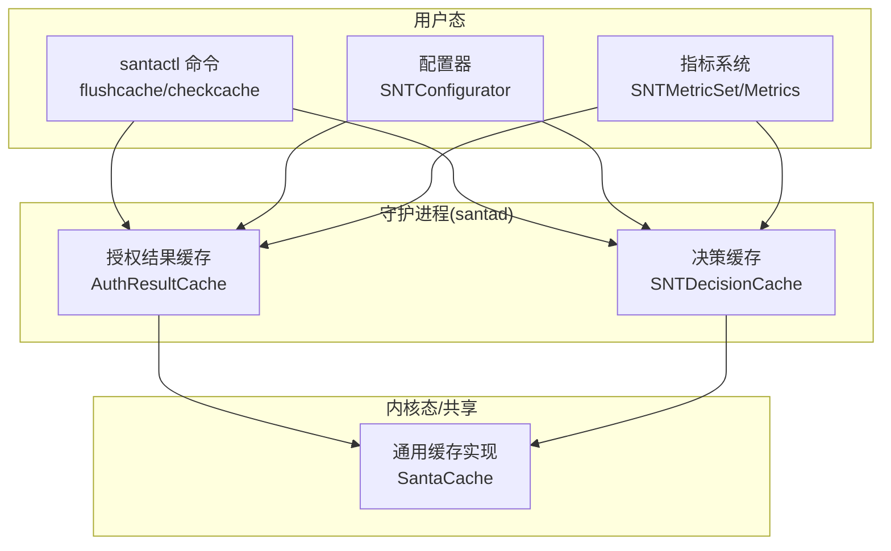
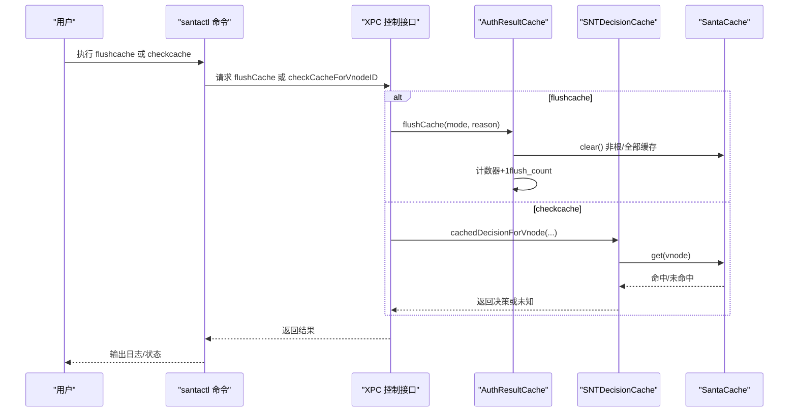
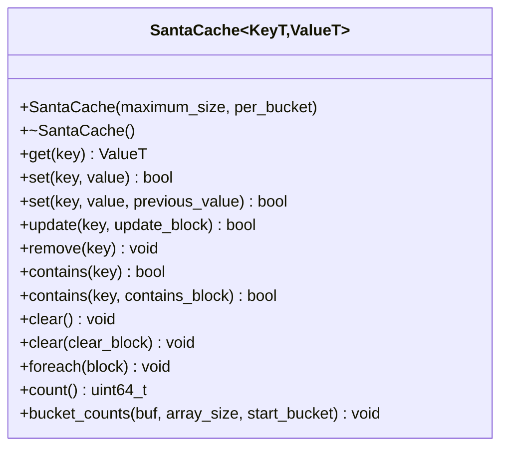
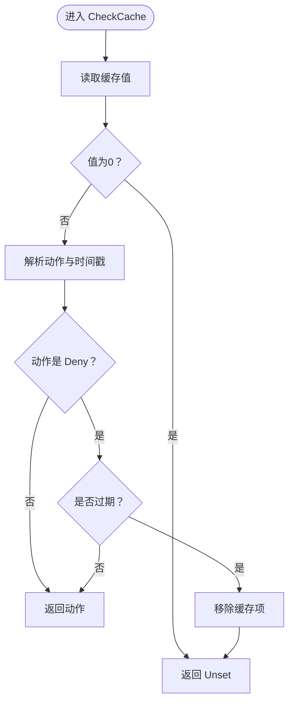
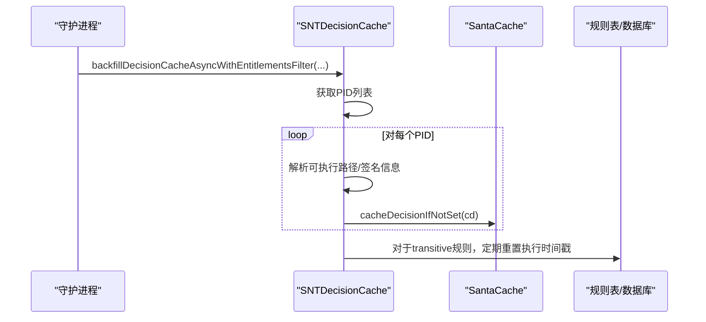
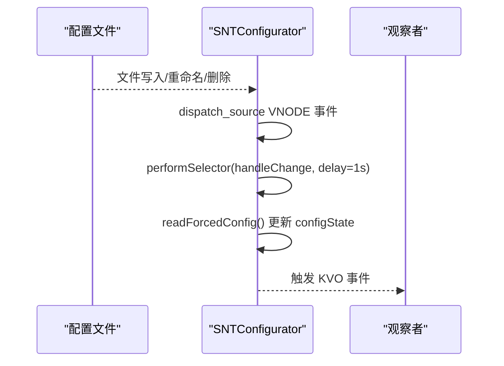
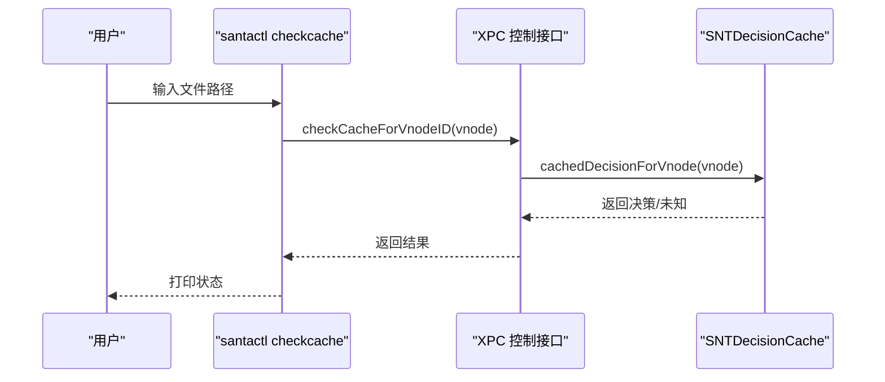
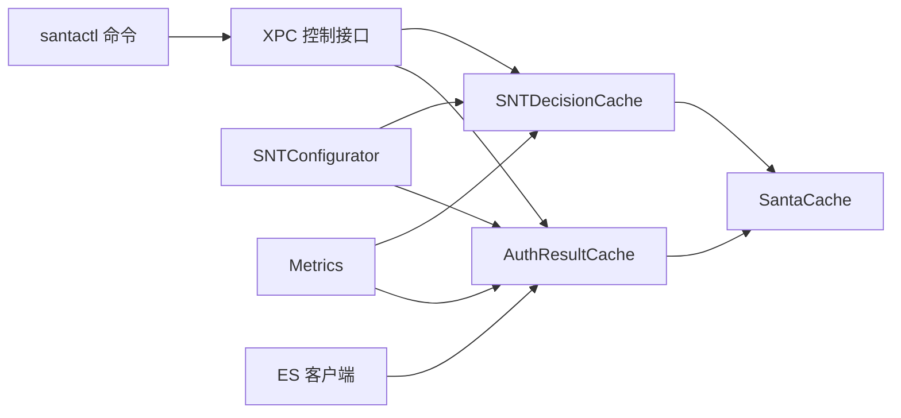

# 缓存配置与管理

<cite>
**本文引用的文件**
- [Source/common/SantaCache.h](file://Source/common/SantaCache.h)
- [Source/santad/SNTDecisionCache.h](file://Source/santad/SNTDecisionCache.h)
- [Source/santad/SNTDecisionCache.mm](file://Source/santad/SNTDecisionCache.mm)
- [Source/santad/EventProviders/AuthResultCache.h](file://Source/santad/EventProviders/AuthResultCache.h)
- [Source/santad/EventProviders/AuthResultCache.mm](file://Source/santad/EventProviders/AuthResultCache.mm)
- [Source/santactl/Commands/SNTCommandFlushCache.mm](file://Source/santactl/Commands/SNTCommandFlushCache.mm)
- [Source/santactl/Commands/SNTCommandCheckCache.mm](file://Source/santactl/Commands/SNTCommandCheckCache.mm)
- [Source/common/SNTConfigurator.mm](file://Source/common/SNTConfigurator.mm)
- [docs/src/components/ConfigGenerator/plist.ts](file://docs/src/components/ConfigGenerator/plist.ts)
- [Dynamic_DataSecurity_System_Design.md](file://Dynamic_DataSecurity_System_Design.md)
- [Source/common/SNTMetricSet.mm](file://Source/common/SNTMetricSet.mm)
- [Source/santad/Metrics.mm](file://Source/santad/Metrics.mm)
</cite>

## 目录
1. [简介](#简介)
2. [项目结构](#项目结构)
3. [核心组件](#核心组件)
4. [架构总览](#架构总览)
5. [详细组件分析](#详细组件分析)
6. [依赖关系分析](#依赖关系分析)
7. [性能考虑](#性能考虑)
8. [故障排除指南](#故障排除指南)
9. [结论](#结论)
10. [附录](#附录)

## 简介
本技术文档聚焦 Santa 的缓存配置与管理系统，系统性阐述以下主题：
- 缓存配置参数、缓存大小限制与缓存策略设置
- 缓存配置文件格式、运行时配置修改与配置验证机制
- 缓存管理接口、缓存状态监控与缓存统计信息收集
- 最佳实践、性能调优建议与容量规划指南
- 故障排除方法、常见问题解决方案与监控告警设置
- 不同部署场景下的缓存配置策略与企业级缓存管理方案

## 项目结构
Santa 在内核态/用户态组件中广泛使用高性能并发哈希缓存（SantaCache），并围绕该缓存构建了两类关键缓存：
- 授权结果缓存（AuthResultCache）：用于 EndpointSecurity 授权事件的快速判定与过期控制
- 决策缓存（SNTDecisionCache）：用于执行决策的快速回填与规则命中优化

同时，命令行工具提供缓存刷新与检查能力；配置器支持配置热更新与校验；指标系统提供缓存相关统计与导出。

图表来源
- [Source/santactl/Commands/SNTCommandFlushCache.mm](file://Source/santactl/Commands/SNTCommandFlushCache.mm#L1-L66)
- [Source/santactl/Commands/SNTCommandCheckCache.mm](file://Source/santactl/Commands/SNTCommandCheckCache.mm#L1-L86)
- [Source/common/SNTConfigurator.mm](file://Source/common/SNTConfigurator.mm#L1886-L1928)
- [Source/common/SNTMetricSet.mm](file://Source/common/SNTMetricSet.mm#L294-L337)
- [Source/santad/Metrics.mm](file://Source/santad/Metrics.mm#L367-L408)
- [Source/santad/EventProviders/AuthResultCache.mm](file://Source/santad/EventProviders/AuthResultCache.mm#L1-L208)
- [Source/santad/SNTDecisionCache.mm](file://Source/santad/SNTDecisionCache.mm#L1-L208)
- [Source/common/SantaCache.h](file://Source/common/SantaCache.h#L42-L110)

章节来源
- [Source/common/SantaCache.h](file://Source/common/SantaCache.h#L42-L110)
- [Source/santad/EventProviders/AuthResultCache.h](file://Source/santad/EventProviders/AuthResultCache.h#L50-L98)
- [Source/santad/EventProviders/AuthResultCache.mm](file://Source/santad/EventProviders/AuthResultCache.mm#L76-L104)
- [Source/santad/SNTDecisionCache.h](file://Source/santad/SNTDecisionCache.h#L1-L35)
- [Source/santad/SNTDecisionCache.mm](file://Source/santad/SNTDecisionCache.mm#L45-L91)
- [Source/santactl/Commands/SNTCommandFlushCache.mm](file://Source/santactl/Commands/SNTCommandFlushCache.mm#L49-L66)
- [Source/santactl/Commands/SNTCommandCheckCache.mm](file://Source/santactl/Commands/SNTCommandCheckCache.mm#L53-L76)
- [Source/common/SNTConfigurator.mm](file://Source/common/SNTConfigurator.mm#L1886-L1928)
- [docs/src/components/ConfigGenerator/plist.ts](file://docs/src/components/ConfigGenerator/plist.ts#L1-L33)

## 核心组件
- 通用缓存实现（SantaCache）
  - 支持最大条目数限制与自动清空策略
  - 按桶锁并发模型，桶数量基于“最大容量/每桶目标数”计算并向上取整到 2 的幂
  - 提供 get/set/update/remove/foreach/clear/count/bucket_counts 等接口
- 授权结果缓存（AuthResultCache）
  - 针对 ES 授权事件的快速判定，区分根分区与非根分区缓存
  - 使用位域存储动作与时间戳，并内置拒绝动作的过期窗口
  - 提供按原因的缓存清空（flush）与计数查询
- 决策缓存（SNTDecisionCache）
  - 以 vnode 为键缓存执行决策，支持异步回填与规则命中优化
  - 提供缓存命中、重置时间戳、清理等能力
- 配置与运行时变更
  - 配置器支持监听配置文件变更并触发 KVO 通知
  - 配置生成器可输出系统配置描述文件（plist）
- 命令行管理
  - flushcache：请求守护进程清空授权缓存
  - checkcache：查询指定文件在缓存中的状态
- 指标与监控
  - 指标集合提供计数器/计量器等类型，支持周期性导出
  - Metrics 定时器负责统计周期与导出调度

章节来源
- [Source/common/SantaCache.h](file://Source/common/SantaCache.h#L42-L110)
- [Source/common/SantaCache.h](file://Source/common/SantaCache.h#L149-L218)
- [Source/common/SantaCache.h](file://Source/common/SantaCache.h#L219-L304)
- [Source/santad/EventProviders/AuthResultCache.h](file://Source/santad/EventProviders/AuthResultCache.h#L50-L98)
- [Source/santad/EventProviders/AuthResultCache.mm](file://Source/santad/EventProviders/AuthResultCache.mm#L111-L171)
- [Source/santad/EventProviders/AuthResultCache.mm](file://Source/santad/EventProviders/AuthResultCache.mm#L177-L201)
- [Source/santad/SNTDecisionCache.h](file://Source/santad/SNTDecisionCache.h#L1-L35)
- [Source/santad/SNTDecisionCache.mm](file://Source/santad/SNTDecisionCache.mm#L73-L91)
- [Source/santactl/Commands/SNTCommandFlushCache.mm](file://Source/santactl/Commands/SNTCommandFlushCache.mm#L53-L63)
- [Source/santactl/Commands/SNTCommandCheckCache.mm](file://Source/santactl/Commands/SNTCommandCheckCache.mm#L57-L76)
- [Source/common/SNTMetricSet.mm](file://Source/common/SNTMetricSet.mm#L294-L337)
- [Source/santad/Metrics.mm](file://Source/santad/Metrics.mm#L384-L408)

## 架构总览
下图展示缓存子系统的整体交互：命令行工具通过 XPC 调用守护进程接口，守护进程内部使用 SantaCache 实现授权与决策缓存；配置器负责配置热更新；指标系统周期性收集并导出统计数据。

图表来源
- [Source/santactl/Commands/SNTCommandFlushCache.mm](file://Source/santactl/Commands/SNTCommandFlushCache.mm#L53-L63)
- [Source/santactl/Commands/SNTCommandCheckCache.mm](file://Source/santactl/Commands/SNTCommandCheckCache.mm#L57-L76)
- [Source/santad/EventProviders/AuthResultCache.mm](file://Source/santad/EventProviders/AuthResultCache.mm#L177-L197)
- [Source/santad/SNTDecisionCache.mm](file://Source/santad/SNTDecisionCache.mm#L81-L87)
- [Source/common/SantaCache.h](file://Source/common/SantaCache.h#L81-L110)

## 详细组件分析

### 通用缓存实现（SantaCache）
- 初始化参数
  - maximum_size：最大条目数，达到上限时会清空所有条目
  - per_bucket：每桶目标条目数，决定桶数量（向上取整到 2 的幂），范围受约束以避免溢出
- 并发与一致性
  - 每桶独立加锁，减少全局锁竞争
  - set 操作在插入前检查是否超限，必要时自动清空
  - 提供 CAS 语义（带 previous_value 的 set）
- 关键接口
  - get/set/update/remove/contains/clear/foreach/count/bucket_counts
- 复杂度
  - 平均 O(1)，最坏 O(n)（退化为单链表）

图表来源
- [Source/common/SantaCache.h](file://Source/common/SantaCache.h#L42-L110)
- [Source/common/SantaCache.h](file://Source/common/SantaCache.h#L149-L218)
- [Source/common/SantaCache.h](file://Source/common/SantaCache.h#L219-L304)

章节来源
- [Source/common/SantaCache.h](file://Source/common/SantaCache.h#L42-L110)
- [Source/common/SantaCache.h](file://Source/common/SantaCache.h#L305-L468)

### 授权结果缓存（AuthResultCache）
- 设计要点
  - 两套缓存：root_cache_（根分区）与 nonroot_cache_（非根分区）
  - 动作与时间戳打包存储，拒绝动作带过期窗口（cache_deny_time_ns_）
  - 支持按原因清空缓存（flush），并记录 flush_count 指标
  - 提供 CacheCounts 查询两缓存当前条目数
- 状态机与过期逻辑
  - 拒绝动作命中后，若超过过期时间则自动移除
  - 允许/编译器放行/持有等状态的处理遵循特定规则

图表来源
- [Source/santad/EventProviders/AuthResultCache.mm](file://Source/santad/EventProviders/AuthResultCache.mm#L148-L171)

章节来源
- [Source/santad/EventProviders/AuthResultCache.h](file://Source/santad/EventProviders/AuthResultCache.h#L50-L98)
- [Source/santad/EventProviders/AuthResultCache.mm](file://Source/santad/EventProviders/AuthResultCache.mm#L111-L171)
- [Source/santad/EventProviders/AuthResultCache.mm](file://Source/santad/EventProviders/AuthResultCache.mm#L177-L201)

### 决策缓存（SNTDecisionCache）
- 作用
  - 以 vnode 为键缓存执行决策，加速已知二进制的决策流程
  - 支持异步回填（backfill）：扫描运行中的进程，批量填充伪决策条目
- 关键接口
  - cacheDecision/cacheDecisionIfNotSet/cachedDecisionForVnode/forgetCachedDecisionForVnode/resetTimestampForCachedDecision/backfillDecisionCacheAsyncWithEntitlementsFilter

图表来源
- [Source/santad/SNTDecisionCache.mm](file://Source/santad/SNTDecisionCache.mm#L114-L205)

章节来源
- [Source/santad/SNTDecisionCache.h](file://Source/santad/SNTDecisionCache.h#L1-L35)
- [Source/santad/SNTDecisionCache.mm](file://Source/santad/SNTDecisionCache.mm#L73-L91)
- [Source/santad/SNTDecisionCache.mm](file://Source/santad/SNTDecisionCache.mm#L114-L205)

### 配置与运行时变更
- 配置文件格式
  - 使用系统配置描述文件（plist）进行分发与安装
  - 配置生成器根据输入数据动态生成 plist
- 运行时配置修改
  - 配置器监听配置文件变更，延迟触发 KVO 事件以合并抖动
  - defaultsChanged 后重新读取强制配置并更新 configState

图表来源
- [Source/common/SNTConfigurator.mm](file://Source/common/SNTConfigurator.mm#L1886-L1928)

章节来源
- [docs/src/components/ConfigGenerator/plist.ts](file://docs/src/components/ConfigGenerator/plist.ts#L1-L33)
- [Source/common/SNTConfigurator.mm](file://Source/common/SNTConfigurator.mm#L1886-L1928)

### 缓存管理接口与命令行工具
- flushcache
  - 通过 XPC 请求守护进程清空授权缓存（非根/全部）
  - 成功/失败分别输出日志并退出相应码
- checkcache
  - 将文件路径转换为 vnode，查询授权缓存状态并输出对应信息

图表来源
- [Source/santactl/Commands/SNTCommandCheckCache.mm](file://Source/santactl/Commands/SNTCommandCheckCache.mm#L57-L76)

章节来源
- [Source/santactl/Commands/SNTCommandFlushCache.mm](file://Source/santactl/Commands/SNTCommandFlushCache.mm#L53-L63)
- [Source/santactl/Commands/SNTCommandCheckCache.mm](file://Source/santactl/Commands/SNTCommandCheckCache.mm#L53-L76)

### 指标与监控
- 指标类型
  - 计数器（counter）：累计事件次数
  - 整型计量器（gaugeInt64）：记录瞬时数值
- Metrics 定时器
  - 可设置导出周期，启动/停止定时器
  - 周期结束时重置中间缓存并导出

章节来源
- [Source/common/SNTMetricSet.mm](file://Source/common/SNTMetricSet.mm#L294-L337)
- [Source/santad/Metrics.mm](file://Source/santad/Metrics.mm#L384-L408)

## 依赖关系分析
- 组件耦合
  - AuthResultCache/SNTDecisionCache 均依赖 SantaCache 实现并发缓存
  - 命令行工具通过 XPC 与守护进程交互，降低耦合
  - 配置器与指标系统相对独立，通过事件/定时器驱动
- 外部依赖
  - EndpointSecurity 客户端接口用于 ES 缓存清空
  - XPC 连接用于命令行与守护进程通信

图表来源
- [Source/santad/EventProviders/AuthResultCache.mm](file://Source/santad/EventProviders/AuthResultCache.mm#L177-L197)
- [Source/santad/SNTDecisionCache.mm](file://Source/santad/SNTDecisionCache.mm#L114-L205)
- [Source/common/SantaCache.h](file://Source/common/SantaCache.h#L42-L110)
- [Source/common/SNTConfigurator.mm](file://Source/common/SNTConfigurator.mm#L1886-L1928)
- [Source/common/SNTMetricSet.mm](file://Source/common/SNTMetricSet.mm#L294-L337)
- [Source/santad/Metrics.mm](file://Source/santad/Metrics.mm#L384-L408)

章节来源
- [Source/santad/EventProviders/AuthResultCache.h](file://Source/santad/EventProviders/AuthResultCache.h#L50-L98)
- [Source/santad/SNTDecisionCache.h](file://Source/santad/SNTDecisionCache.h#L1-L35)
- [Source/common/SantaCache.h](file://Source/common/SantaCache.h#L42-L110)

## 性能考虑
- 桶数量与每桶条目数
  - per_bucket 增大可提升命中率但增加内存占用；需结合系统负载与内存预算权衡
  - 桶数按“最大容量/每桶目标数”的结果向上取整到 2 的幂，确保哈希分布均匀
- 并发与锁粒度
  - 每桶独立加锁，减少热点冲突；在高并发场景下建议合理设置 maximum_size 与 per_bucket
- 自动清空策略
  - 达到上限自动清空，避免无限增长；在高频写入场景下应评估清空频率对命中率的影响
- 拒绝动作过期
  - cache_deny_time_ns_ 控制拒绝缓存的过期时间，兼顾策略变更响应速度与缓存效率
- 指标导出周期
  - 合理设置 Metrics 导出周期，避免频繁 I/O；在高吞吐场景下可适当延长周期

[本节为通用性能讨论，不直接分析具体文件]

## 故障排除指南
- 缓存未命中或策略被绕过
  - 现象：新增监控/规则后仍出现旧缓存导致的放行
  - 处理：调用 flushCache 清空授权缓存；必要时触发 ES 缓存清空
  - 参考：[Dynamic_DataSecurity_System_Design.md](file://Dynamic_DataSecurity_System_Design.md#L918-L955)
- 拒绝缓存过期后行为异常
  - 现象：拒绝缓存过期后未正确移除或再次命中
  - 处理：确认 cache_deny_time_ns_ 设置合理；检查 CheckCache 流程
  - 参考：[AuthResultCache.CheckCache](file://Source/santad/EventProviders/AuthResultCache.mm#L148-L171)
- 命令行工具权限不足
  - 现象：flushcache/checkcache 返回失败
  - 处理：以 root 权限执行命令；确认 XPC 连接正常
  - 参考：[SNTCommandFlushCache](file://Source/santactl/Commands/SNTCommandFlushCache.mm#L31-L37)、[SNTCommandCheckCache](file://Source/santactl/Commands/SNTCommandCheckCache.mm#L33-L41)
- 配置未生效
  - 现象：修改配置文件后策略未更新
  - 处理：等待 defaultsChanged 延迟触发；检查 VNODE 监听是否取消
  - 参考：[SNTConfigurator.defaultsChanged](file://Source/common/SNTConfigurator.mm#L1912-L1923)、[SNTConfigurator.watchOverridesFile](file://Source/common/SNTConfigurator.mm#L1886-L1910)

章节来源
- [Dynamic_DataSecurity_System_Design.md](file://Dynamic_DataSecurity_System_Design.md#L918-L955)
- [Source/santad/EventProviders/AuthResultCache.mm](file://Source/santad/EventProviders/AuthResultCache.mm#L148-L171)
- [Source/santactl/Commands/SNTCommandFlushCache.mm](file://Source/santactl/Commands/SNTCommandFlushCache.mm#L31-L37)
- [Source/santactl/Commands/SNTCommandCheckCache.mm](file://Source/santactl/Commands/SNTCommandCheckCache.mm#L33-L41)
- [Source/common/SNTConfigurator.mm](file://Source/common/SNTConfigurator.mm#L1912-L1923)
- [Source/common/SNTConfigurator.mm](file://Source/common/SNTConfigurator.mm#L1886-L1910)

## 结论
Santa 的缓存体系以 SantaCache 为核心，结合授权结果缓存与决策缓存，在保证高并发性能的同时提供了灵活的策略控制与可观测性。通过合理的配置参数、运行时变更与监控指标，可在不同部署场景下实现稳定高效的缓存管理。

[本节为总结性内容，不直接分析具体文件]

## 附录

### 缓存配置参数与策略设置
- SantaCache 初始化参数
  - maximum_size：最大条目数
  - per_bucket：每桶目标条目数（范围约束）
- 授权结果缓存策略
  - cache_deny_time_ms：拒绝动作的缓存过期时间（毫秒）
  - 分区缓存：根分区与非根分区分别维护缓存
- 决策缓存策略
  - 异步回填：基于运行中进程快照批量填充
  - 规则命中优化：对 transitive 规则执行时间戳重置

章节来源
- [Source/common/SantaCache.h](file://Source/common/SantaCache.h#L42-L71)
- [Source/santad/EventProviders/AuthResultCache.mm](file://Source/santad/EventProviders/AuthResultCache.mm#L87-L104)
- [Source/santad/SNTDecisionCache.mm](file://Source/santad/SNTDecisionCache.mm#L114-L205)

### 缓存配置文件格式与生成
- 配置文件格式：系统配置描述文件（plist）
- 生成方式：配置生成器根据输入数据动态生成 plist
- 分发与安装：通过系统配置机制进行安装

章节来源
- [docs/src/components/ConfigGenerator/plist.ts](file://docs/src/components/ConfigGenerator/plist.ts#L1-L33)

### 运行时配置修改与验证
- 修改机制：VNODE 监听配置文件变化，延迟触发 defaultsChanged
- 验证：配置器提供 validateConfiguration 用于错误收集与报告

章节来源
- [Source/common/SNTConfigurator.mm](file://Source/common/SNTConfigurator.mm#L1886-L1928)
- [Source/common/SNTConfigurator.mm](file://Source/common/SNTConfigurator.mm#L1925-L1928)

### 缓存状态监控与统计
- 指标类型：计数器/计量器
- 导出周期：Metrics 定时器可设置与启动
- 缓存计数：AuthResultCache 提供 CacheCounts 查询两缓存条目数

章节来源
- [Source/common/SNTMetricSet.mm](file://Source/common/SNTMetricSet.mm#L294-L337)
- [Source/santad/Metrics.mm](file://Source/santad/Metrics.mm#L384-L408)
- [Source/santad/EventProviders/AuthResultCache.mm](file://Source/santad/EventProviders/AuthResultCache.mm#L199-L201)

### 最佳实践与容量规划
- per_bucket 选择：在内存预算与命中率之间平衡；建议从较小值起步，逐步增大
- maximum_size：结合峰值并发与业务量估算；避免频繁自动清空
- cache_deny_time_ms：根据策略变更频率与用户体验需求设定
- 指标导出：根据监控需求设置合理周期，避免过度 I/O
- 配置热更新：利用 VNODE 监听与 KVO 机制，确保变更及时生效

[本节为通用最佳实践，不直接分析具体文件]