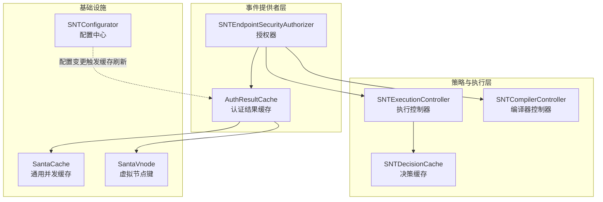
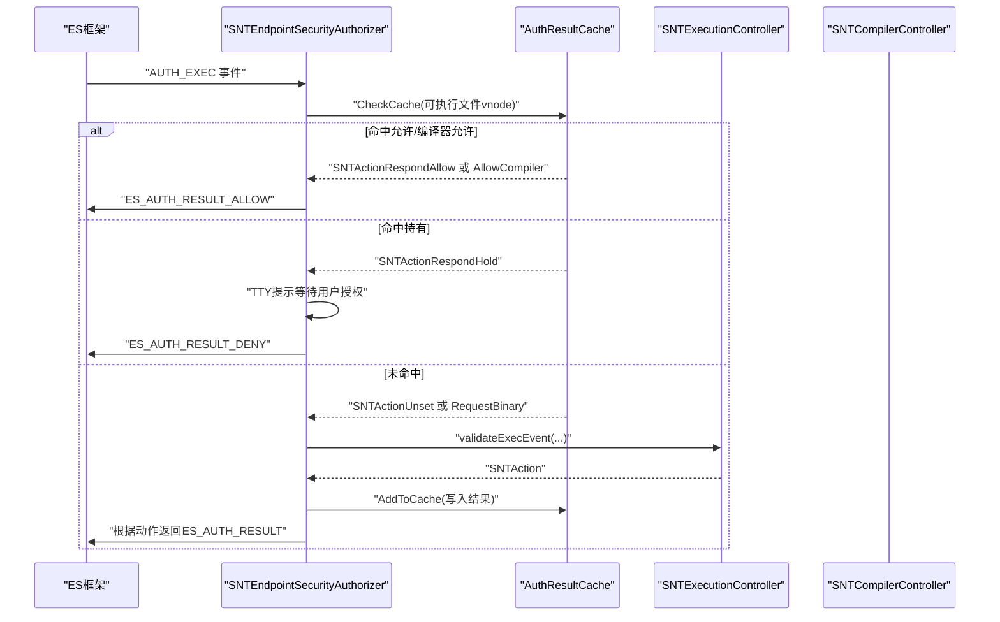
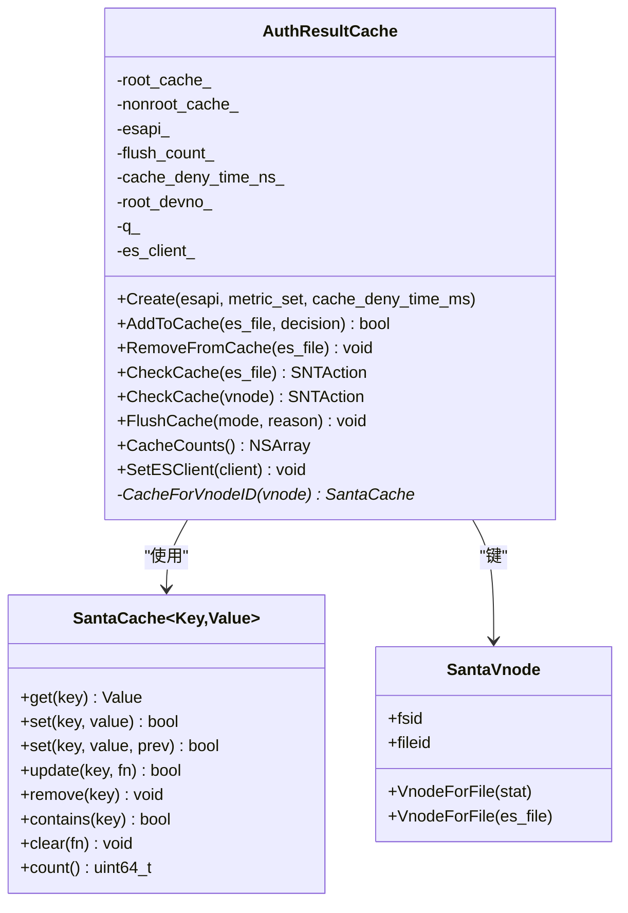
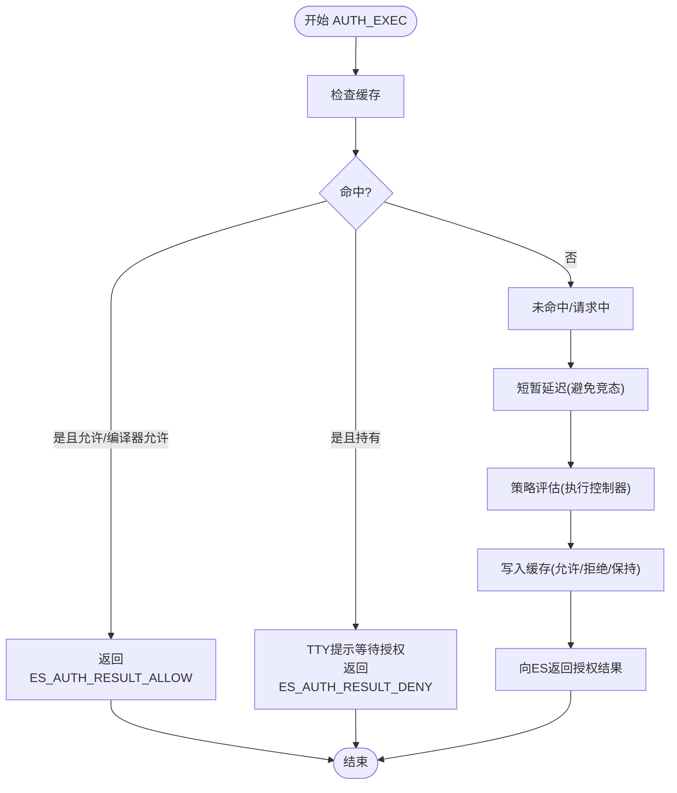
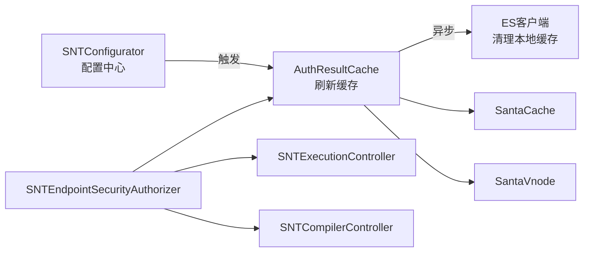

# 认证结果缓存

<cite>
**本文引用的文件**
- [AuthResultCache.h](file://Source/santad/EventProviders/AuthResultCache.h)
- [AuthResultCache.mm](file://Source/santad/EventProviders/AuthResultCache.mm)
- [AuthResultCacheTest.mm](file://Source/santad/EventProviders/AuthResultCacheTest.mm)
- [SantaCache.h](file://Source/common/SantaCache.h)
- [SantaVnode.h](file://Source/common/SantaVnode.h)
- [SNTDecisionCache.h](file://Source/santad/SNTDecisionCache.h)
- [SNTDecisionCache.mm](file://Source/santad/SNTDecisionCache.mm)
- [SNTEndpointSecurityAuthorizer.h](file://Source/santad/EventProviders/SNTEndpointSecurityAuthorizer.h)
- [SNTEndpointSecurityAuthorizer.mm](file://Source/santad/EventProviders/SNTEndpointSecurityAuthorizer.mm)
- [SNTConfigurator.h](file://Source/common/SNTConfigurator.h)
- [SNTConfigurator.mm](file://Source/common/SNTConfigurator.mm)
</cite>

## 目录
1. [引言](#引言)
2. [项目结构](#项目结构)
3. [核心组件](#核心组件)
4. [架构总览](#架构总览)
5. [详细组件分析](#详细组件分析)
6. [依赖关系分析](#依赖关系分析)
7. [性能考量](#性能考量)
8. [故障排除指南](#故障排除指南)
9. [结论](#结论)
10. [附录](#附录)

## 引言
本技术文档聚焦 Santa 的“认证结果缓存”（AuthResultCache）系统，系统性阐述其设计原理、缓存策略、认证决策存储机制与并发控制方式。文档将对比认证结果缓存与“决策缓存”（SNTDecisionCache）的差异，解释缓存键设计、条目生命周期与失效策略，并给出配置参数说明、监控指标与性能调优建议，以及在不同安全模式下的行为差异与最佳实践。

## 项目结构
认证结果缓存位于 santad 的事件提供者层，围绕 EndpointSecurity 授权事件进行工作；同时与执行控制器、编译器控制器、TTY 写入器等协作完成授权与响应。决策缓存则位于上层策略与数据库交互层，用于持久化与回填规则决策信息。

图表来源
- [AuthResultCache.h](file://Source/santad/EventProviders/AuthResultCache.h#L50-L93)
- [SNTEndpointSecurityAuthorizer.mm](file://Source/santad/EventProviders/SNTEndpointSecurityAuthorizer.mm#L91-L158)
- [SNTDecisionCache.h](file://Source/santad/SNTDecisionCache.h#L23-L34)
- [SantaCache.h](file://Source/common/SantaCache.h#L48-L98)
- [SantaVnode.h](file://Source/common/SantaVnode.h#L25-L51)
- [SNTConfigurator.h](file://Source/common/SNTConfigurator.h#L190-L210)

章节来源
- [AuthResultCache.h](file://Source/santad/EventProviders/AuthResultCache.h#L50-L93)
- [SNTEndpointSecurityAuthorizer.mm](file://Source/santad/EventProviders/SNTEndpointSecurityAuthorizer.mm#L91-L158)
- [SNTDecisionCache.h](file://Source/santad/SNTDecisionCache.h#L23-L34)
- [SantaCache.h](file://Source/common/SantaCache.h#L48-L98)
- [SantaVnode.h](file://Source/common/SantaVnode.h#L25-L51)
- [SNTConfigurator.h](file://Source/common/SNTConfigurator.h#L190-L210)

## 核心组件
- AuthResultCache：按文件 vnode 维度缓存认证结果，支持根分区与非根分区双缓存、基于时间的 DENY 失效、异步清理 ES 本地缓存、按原因计数的刷新统计。
- SantaCache：通用并发哈希表，按桶锁实现线程安全，满载时自动清空，支持 get/set/update/foreach/remove/clear/count 等操作。
- SantaVnode：文件系统 vnode 键，由设备号与 inode 组成，作为缓存键。
- SNTEndpointSecurityAuthorizer：订阅 AUTH_EXEC 等授权事件，先查缓存再决策，必要时调用执行控制器进行策略评估。
- SNTDecisionCache：面向规则决策的缓存，支持回填、重置时间戳、与数据库交互。
- SNTConfigurator：集中式配置源，暴露客户端模式、路径正则、静态规则、权限过滤器等影响缓存一致性的关键配置项。

章节来源
- [AuthResultCache.h](file://Source/santad/EventProviders/AuthResultCache.h#L50-L93)
- [AuthResultCache.mm](file://Source/santad/EventProviders/AuthResultCache.mm#L76-L104)
- [SantaCache.h](file://Source/common/SantaCache.h#L48-L98)
- [SantaVnode.h](file://Source/common/SantaVnode.h#L25-L51)
- [SNTEndpointSecurityAuthorizer.mm](file://Source/santad/EventProviders/SNTEndpointSecurityAuthorizer.mm#L91-L158)
- [SNTDecisionCache.mm](file://Source/santad/SNTDecisionCache.mm#L73-L112)
- [SNTConfigurator.h](file://Source/common/SNTConfigurator.h#L190-L210)

## 架构总览
认证流程概览：授权器订阅 ES 授权事件，优先查询 AuthResultCache；若命中允许或持有状态，则直接响应；否则触发策略评估并将结果写入缓存，随后向 ES 返回最终授权结果。当配置变更导致缓存不一致时，AuthResultCache 可选择仅清理非根缓存或全量清理并异步通知 ES 清理本地缓存。

图表来源
- [SNTEndpointSecurityAuthorizer.mm](file://Source/santad/EventProviders/SNTEndpointSecurityAuthorizer.mm#L91-L158)
- [AuthResultCache.mm](file://Source/santad/EventProviders/AuthResultCache.mm#L111-L171)

章节来源
- [SNTEndpointSecurityAuthorizer.mm](file://Source/santad/EventProviders/SNTEndpointSecurityAuthorizer.mm#L91-L158)
- [AuthResultCache.mm](file://Source/santad/EventProviders/AuthResultCache.mm#L111-L171)

## 详细组件分析

### AuthResultCache 类设计与实现
- 缓存键设计：使用 SantaVnode（设备号+inode）作为键，区分根分区与非根分区缓存，分别维护 root_cache_ 与 nonroot_cache_。
- 存储值设计：将 SNTAction 与时间戳打包到 uint64_t 中，高 8 位存放动作类型，低 56 位存放时间戳，便于快速判断与过期。
- 查询逻辑：若命中 DENY，检查是否超时，超时则移除并返回未命中；其他动作直接返回。
- 写入与更新：支持 RequestBinary、RespondAllow/AllowCompiler/Deny、HoldAllowed/HoldDenied、RespondHold、RespondAllowNoCache 等状态转换；对 Hold 状态写入后立即移除，避免重复缓存。
- 刷新策略：支持仅非根缓存或全量缓存刷新；全量刷新时异步调用 ES 客户端清理本地缓存，防止死锁。
- 并发与队列：内部使用串行 GCD 队列，确保缓存操作与 ES 清理的顺序性与安全性。
- 指标统计：按刷新原因记录计数器，便于观测缓存一致性问题与配置变更频率。

图表来源
- [AuthResultCache.h](file://Source/santad/EventProviders/AuthResultCache.h#L50-L93)
- [AuthResultCache.mm](file://Source/santad/EventProviders/AuthResultCache.mm#L76-L104)
- [SantaCache.h](file://Source/common/SantaCache.h#L48-L98)
- [SantaVnode.h](file://Source/common/SantaVnode.h#L25-L51)

章节来源
- [AuthResultCache.h](file://Source/santad/EventProviders/AuthResultCache.h#L50-L93)
- [AuthResultCache.mm](file://Source/santad/EventProviders/AuthResultCache.mm#L111-L171)
- [AuthResultCache.mm](file://Source/santad/EventProviders/AuthResultCache.mm#L177-L197)
- [SantaCache.h](file://Source/common/SantaCache.h#L100-L178)
- [SantaVnode.h](file://Source/common/SantaVnode.h#L25-L51)

### 认证结果缓存与决策缓存的区别
- 缓存目标不同
  - 认证结果缓存（AuthResultCache）：缓存针对单个可执行文件的“授权结果”，用于加速后续相同文件的 AUTH_EXEC 授权路径。
  - 决策缓存（SNTDecisionCache）：缓存规则决策上下文（如签名信息、证书链、团队 ID、是否允许转接等），用于策略评估与回填。
- 生命周期与失效
  - 认证结果缓存：按文件 vnode 缓存，DENY 结果带有时效窗口；配置变更或文件卸载等触发刷新。
  - 决策缓存：按 vnode 缓存对象，支持回填与时间戳重置，定期更新数据库中的规则时间戳。
- 写入策略
  - 认证结果缓存：允许编译器进程不缓存，Hold 状态不缓存，CEL 评估的“不允许缓存”也不缓存。
  - 决策缓存：支持条件写入（若不存在才写入），并维护时间戳映射以降低数据库写放大。

章节来源
- [AuthResultCache.mm](file://Source/santad/EventProviders/AuthResultCache.mm#L111-L171)
- [SNTEndpointSecurityAuthorizer.mm](file://Source/santad/EventProviders/SNTEndpointSecurityAuthorizer.mm#L191-L239)
- [SNTDecisionCache.mm](file://Source/santad/SNTDecisionCache.mm#L73-L112)

### 缓存键设计与条目管理
- 键：SantaVnode（fsid + fileid），区分根分区与非根分区，分别放入对应缓存实例。
- 条目：将动作与时间戳打包存储，便于快速判定与过期回收。
- 过期策略：DENY 动作携带时间戳，超过 cache_deny_time_ns_ 后视为过期并移除。
- 移除策略：HoldAllowed/HoldDenied 状态写入后立即移除；显式 RemoveFromCache；FlushCache 清空。

章节来源
- [AuthResultCache.mm](file://Source/santad/EventProviders/AuthResultCache.mm#L111-L171)
- [AuthResultCache.mm](file://Source/santad/EventProviders/AuthResultCache.mm#L173-L175)

### 并发访问控制与一致性保证
- 并发模型：SantaCache 使用“每桶锁”实现细粒度并发控制；AuthResultCache 在串行队列中执行 FlushCache 与 ES 清理，避免与 ES 交互造成死锁。
- 一致性：当配置变更（如客户端模式、路径正则、规则、权限过滤器）发生时，通过 FlushCache 清理缓存并异步通知 ES 清理本地缓存，确保后续授权不再使用过期结果。
- 事件处理：授权器在收到 AUTH_EXEC 事件时，先查缓存，命中即快速响应；未命中则评估策略并写入缓存，再向 ES 返回最终结果。

章节来源
- [SantaCache.h](file://Source/common/SantaCache.h#L418-L463)
- [AuthResultCache.mm](file://Source/santad/EventProviders/AuthResultCache.mm#L177-L197)
- [SNTEndpointSecurityAuthorizer.mm](file://Source/santad/EventProviders/SNTEndpointSecurityAuthorizer.mm#L91-L158)

### 认证流程与状态机
认证流程的关键步骤包括：检查缓存、必要时延迟等待、写入 RequestBinary、策略评估、写入结果、向 ES 返回授权结果。状态机约束了合法的状态转换，例如必须先处于 RequestBinary 才能进入 RespondAllow/AllowCompiler/Deny/RespondHold，Hold 状态写入后需移除。

图表来源
- [SNTEndpointSecurityAuthorizer.mm](file://Source/santad/EventProviders/SNTEndpointSecurityAuthorizer.mm#L91-L158)
- [AuthResultCacheTest.mm](file://Source/santad/EventProviders/AuthResultCacheTest.mm#L169-L251)

章节来源
- [SNTEndpointSecurityAuthorizer.mm](file://Source/santad/EventProviders/SNTEndpointSecurityAuthorizer.mm#L91-L158)
- [AuthResultCacheTest.mm](file://Source/santad/EventProviders/AuthResultCacheTest.mm#L169-L251)

## 依赖关系分析
- 与执行控制器与编译器控制器的协作：授权器在命中允许或编译器允许时，会设置进程属性并可能阻止缓存，确保编译器场景正确标记。
- 与 ES 客户端的集成：刷新全量缓存时，通过串行队列异步调用 ES 客户端清理本地缓存，避免阻塞事件处理。
- 与配置中心的耦合：配置变更（客户端模式、路径正则、静态规则、权限过滤器）会触发 FlushCache，从而保证缓存一致性。

图表来源
- [SNTConfigurator.h](file://Source/common/SNTConfigurator.h#L190-L210)
- [AuthResultCache.mm](file://Source/santad/EventProviders/AuthResultCache.mm#L177-L197)
- [SNTEndpointSecurityAuthorizer.mm](file://Source/santad/EventProviders/SNTEndpointSecurityAuthorizer.mm#L91-L158)

章节来源
- [SNTConfigurator.h](file://Source/common/SNTConfigurator.h#L190-L210)
- [AuthResultCache.mm](file://Source/santad/EventProviders/AuthResultCache.mm#L177-L197)
- [SNTEndpointSecurityAuthorizer.mm](file://Source/santad/EventProviders/SNTEndpointSecurityAuthorizer.mm#L91-L158)

## 性能考量
- 缓存命中率优化
  - 将频繁执行的同一文件的授权结果缓存，减少策略评估与数据库访问次数。
  - 对编译器进程不缓存，避免后续实例被错误标记为编译器。
- 过期与内存占用
  - DENY 结果带有时效窗口，避免长期缓存导致规则更新不生效；到期自动移除，控制内存占用。
  - SantaCache 在满载时自动清空，避免无限增长。
- 并发与队列
  - 使用串行队列处理缓存刷新与 ES 清理，避免锁竞争与死锁风险。
- I/O 与数据库
  - 决策缓存支持回填与时间戳重置，降低数据库写放大；认证结果缓存不涉及数据库，主要受内存与 CPU 哈希性能影响。

章节来源
- [AuthResultCache.mm](file://Source/santad/EventProviders/AuthResultCache.mm#L111-L171)
- [SantaCache.h](file://Source/common/SantaCache.h#L320-L416)
- [SNTDecisionCache.mm](file://Source/santad/SNTDecisionCache.mm#L114-L205)

## 故障排除指南
- 缓存未命中或误命中
  - 检查是否处于 Hold 状态或 DENY 已过期；确认 cache_deny_time_ms 设置是否过短或过长。
  - 使用 CacheCounts() 观察根/非根缓存大小，定位异常增长或清空。
- 配置变更后仍使用旧结果
  - 确认 FlushCache 是否被调用及原因；检查配置中心的变更监听是否生效。
- ES 本地缓存不一致
  - 全量刷新时应异步清理 ES 本地缓存；若未清理，可能导致 ES 框架继续返回旧 DENY 结果。
- 并发与死锁
  - 避免在 ES 回调中同步调用需要串行队列的操作；认证结果缓存已通过串行队列处理刷新与 ES 清理。

章节来源
- [AuthResultCache.mm](file://Source/santad/EventProviders/AuthResultCache.mm#L177-L197)
- [AuthResultCacheTest.mm](file://Source/santad/EventProviders/AuthResultCacheTest.mm#L122-L167)
- [SNTConfigurator.mm](file://Source/common/SNTConfigurator.mm#L454-L507)

## 结论
认证结果缓存通过精细的键设计与时效控制，在保障安全的前提下显著提升了授权效率。其与 ES 框架、执行控制器、编译器控制器以及配置中心的协同，确保了在规则变更与运行时动态场景下的缓存一致性与稳定性。通过合理的配置与监控，可在不同安全模式下取得最佳性能与可靠性平衡。

## 附录

### 缓存配置参数说明
- cache_deny_time_ms：DENY 结果的缓存时效（毫秒）。建议结合规则更新频率与用户体验权衡设置。
- FlushCacheMode：刷新模式，支持仅非根缓存或全量缓存；全量刷新会异步清理 ES 本地缓存。
- FlushCacheReason：刷新原因枚举，用于指标统计与问题定位。

章节来源
- [AuthResultCache.h](file://Source/santad/EventProviders/AuthResultCache.h#L34-L48)
- [AuthResultCache.mm](file://Source/santad/EventProviders/AuthResultCache.mm#L76-L104)
- [AuthResultCache.mm](file://Source/santad/EventProviders/AuthResultCache.mm#L177-L197)

### 监控指标与内存使用
- /santa/flush_count：按原因统计的缓存刷新次数，用于观察配置变更频率与一致性问题。
- CacheCounts()：返回根/非根缓存条目数量，辅助评估内存占用与命中效果。
- SantaCache 的 count() 与 bucket_counts()：可用于更细粒度的桶分布与容量评估。

章节来源
- [AuthResultCache.mm](file://Source/santad/EventProviders/AuthResultCache.mm#L76-L104)
- [AuthResultCache.mm](file://Source/santad/EventProviders/AuthResultCache.mm#L199-L201)
- [SantaCache.h](file://Source/common/SantaCache.h#L259-L303)

### 不同安全模式下的行为差异与最佳实践
- 监控模式（MONITOR）
  - 缓存命中率较高但不会阻断执行；适合观察与收集数据。
- 锁定模式（LOCKDOWN）
  - 更严格地应用 DENY 结果与过期策略；建议适当缩短 cache_deny_time_ms 以更快响应规则变化。
- 临时监控模式（TEMPORARY MONITOR）
  - 配置中心会将其视为监控模式；注意退出后需刷新缓存以避免旧结果。
- 最佳实践
  - 静态规则、路径正则、权限过滤器等配置变更后及时刷新缓存。
  - 对编译器场景禁用缓存，确保后续实例正确识别。
  - 在高并发场景下，避免在 ES 回调中执行耗时操作，保持串行队列处理。

章节来源
- [SNTConfigurator.h](file://Source/common/SNTConfigurator.h#L33-L60)
- [SNTConfigurator.h](file://Source/common/SNTConfigurator.h#L780-L800)
- [SNTEndpointSecurityAuthorizer.mm](file://Source/santad/EventProviders/SNTEndpointSecurityAuthorizer.mm#L191-L239)