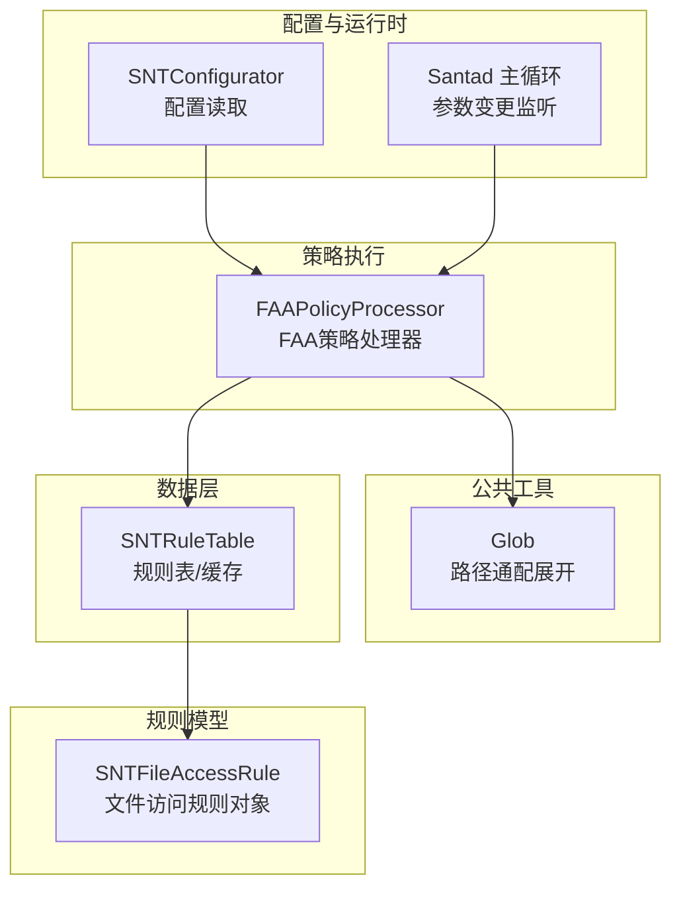
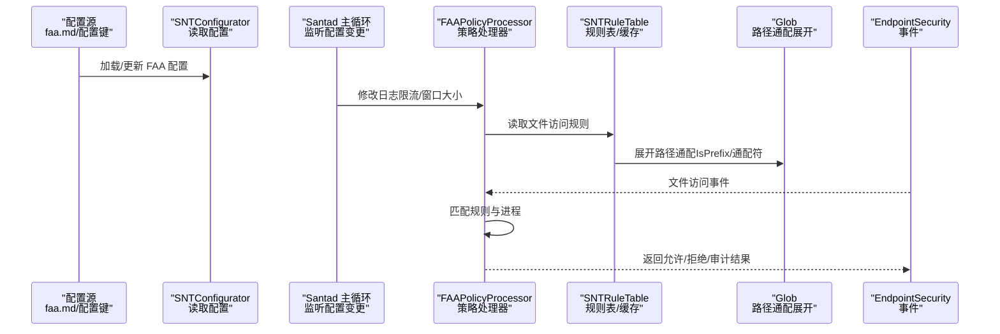
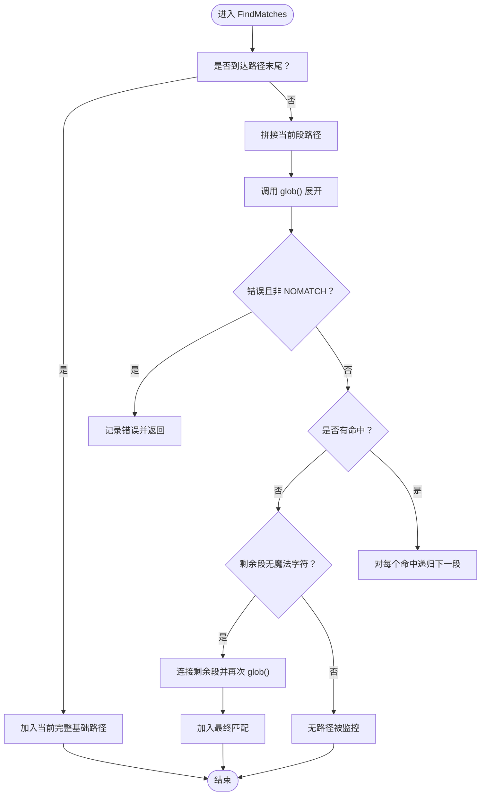
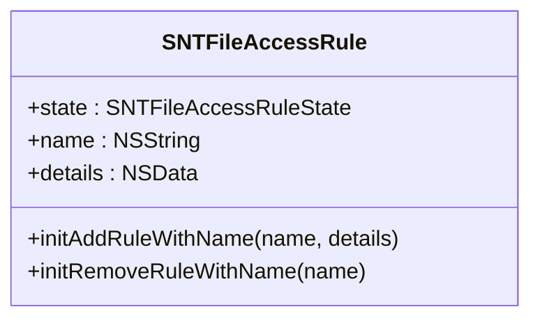
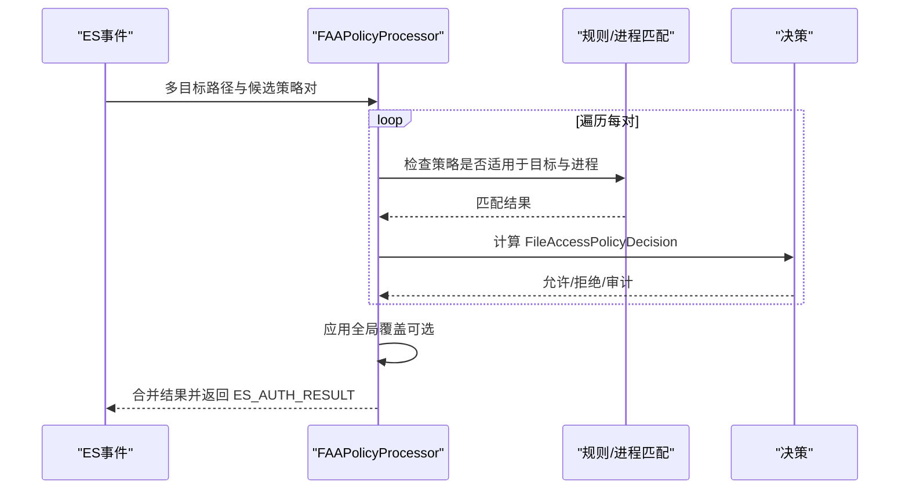
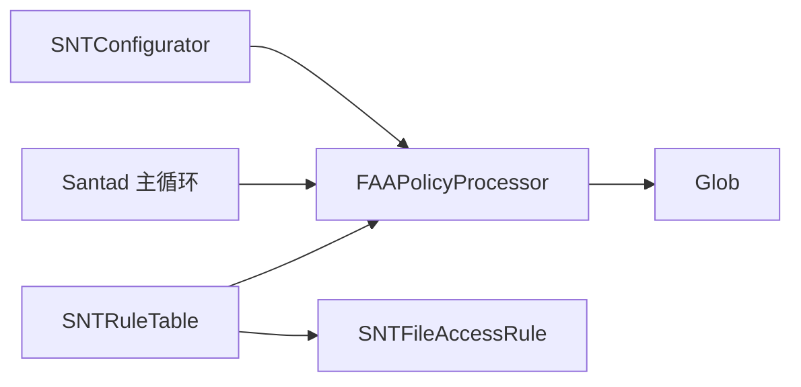

# 路径规则系统

<cite>
**本文引用的文件**
- [Glob.h](file://Source/common/Glob.h)
- [Glob.mm](file://Source/common/Glob.mm)
- [SNTFileAccessRule.h](file://Source/common/SNTFileAccessRule.h)
- [SNTFileAccessRule.mm](file://Source/common/SNTFileAccessRule.mm)
- [FAAPolicyProcessor.h](file://Source/santad/EventProviders/FAAPolicyProcessor.h)
- [FAAPolicyProcessor.mm](file://Source/santad/EventProviders/FAAPolicyProcessor.mm)
- [SNTRuleTable.h](file://Source/santad/DataLayer/SNTRuleTable.h)
- [SNTRuleTable.mm](file://Source/santad/DataLayer/SNTRuleTable.mm)
- [faa.md（配置）](file://docs/docs/configuration/faa.md)
- [faa.md（特性）](file://docs/docs/features/faa.md)
- [santaconfig.ts](file://docs/src/lib/santaconfig.ts)
- [Santad.mm](file://Source/santad/Santad.mm)
- [SNTConfigurator.mm](file://Source/common/SNTConfigurator.mm)
- [WatchItemsTest.mm](file://Source/common/faa/WatchItemsTest.mm)
</cite>

## 目录
1. [引言](#引言)
2. [项目结构](#项目结构)
3. [核心组件](#核心组件)
4. [架构总览](#架构总览)
5. [详细组件分析](#详细组件分析)
6. [依赖关系分析](#依赖关系分析)
7. [性能考量](#性能考量)
8. [故障排查指南](#故障排查指南)
9. [结论](#结论)
10. [附录：规则语法与示例](#附录规则语法与示例)

## 引言
本文件面向Santa的“文件访问授权（FAA）”路径规则系统，系统性阐述其基于libc glob的路径匹配机制、规则优先级与冲突处理、语法规范与通配符支持、性能优化策略，并提供可操作的配置示例与测试调试方法。FAA通过策略化的路径与进程组合，对文件读写访问进行监控或阻断，适用于目录级访问控制、特定文件类型限制等场景。

## 项目结构
围绕路径规则系统的关键代码分布在以下模块：
- 公共工具层：路径通配展开（Glob）
- 规则模型层：文件访问规则对象（SNTFileAccessRule）
- 策略执行层：FAA策略处理器（FAAPolicyProcessor）
- 数据层：规则持久化与缓存（SNTRuleTable）
- 配置与文档：FAA配置键、更新周期、行为选项（faa.md、santaconfig.ts、SNTConfigurator）

图表来源
- [Glob.mm](file://Source/common/Glob.mm#L78-L135)
- [SNTFileAccessRule.mm](file://Source/common/SNTFileAccessRule.mm#L1-L82)
- [FAAPolicyProcessor.h](file://Source/santad/EventProviders/FAAPolicyProcessor.h#L86-L121)
- [SNTRuleTable.mm](file://Source/santad/DataLayer/SNTRuleTable.mm#L821-L936)
- [Santad.mm](file://Source/santad/Santad.mm#L722-L745)
- [SNTConfigurator.mm](file://Source/common/SNTConfigurator.mm#L1296-L1316)

章节来源
- [Glob.h](file://Source/common/Glob.h#L1-L30)
- [Glob.mm](file://Source/common/Glob.mm#L1-L138)
- [SNTFileAccessRule.h](file://Source/common/SNTFileAccessRule.h#L1-L33)
- [SNTFileAccessRule.mm](file://Source/common/SNTFileAccessRule.mm#L1-L82)
- [FAAPolicyProcessor.h](file://Source/santad/EventProviders/FAAPolicyProcessor.h#L1-L242)
- [FAAPolicyProcessor.mm](file://Source/santad/EventProviders/FAAPolicyProcessor.mm#L1-L200)
- [SNTRuleTable.h](file://Source/santad/DataLayer/SNTRuleTable.h#L1-L46)
- [SNTRuleTable.mm](file://Source/santad/DataLayer/SNTRuleTable.mm#L821-L936)
- [faa.md（配置）](file://docs/docs/configuration/faa.md#L1-L226)
- [faa.md（特性）](file://docs/docs/features/faa.md#L1-L413)
- [santaconfig.ts](file://docs/src/lib/santaconfig.ts#L592-L635)
- [Santad.mm](file://Source/santad/Santad.mm#L722-L745)
- [SNTConfigurator.mm](file://Source/common/SNTConfigurator.mm#L1296-L1316)

## 核心组件
- 路径通配展开器（Glob）
  - 基于libc glob函数，将路径模式分解为多段并递归展开，支持“仅同层匹配”和“前缀递归匹配”，并对无魔法字符路径直接加入监控集合。
  - 对路径分段追加斜杠以确保只返回目录匹配，避免误匹配文件；限制最大路径段数防止过度递归。
- 文件访问规则对象（SNTFileAccessRule）
  - 表示一条“添加/移除”文件访问规则，携带规则名称与序列化详情（含Paths、Processes、Options等），用于后续策略匹配与决策。
- 策略处理器（FAAPolicyProcessor）
  - 接收EndpointSecurity事件，结合规则与进程信息计算决策（允许/拒绝/审计），支持全局覆盖（全部审计/禁用）、日志限流、TTY通知去重等。
- 规则表与缓存（SNTRuleTable）
  - 提供文件访问规则的数据库读取、静态规则缓存与哈希管理，支撑策略加载与变更检测。
- 配置与运行时（SNTConfigurator、Santad）
  - 提供策略更新周期、全局日志速率窗口等配置项；主循环监听配置变化并动态调整策略处理器的限流设置。

章节来源
- [Glob.mm](file://Source/common/Glob.mm#L78-L135)
- [SNTFileAccessRule.mm](file://Source/common/SNTFileAccessRule.mm#L1-L82)
- [FAAPolicyProcessor.h](file://Source/santad/EventProviders/FAAPolicyProcessor.h#L86-L121)
- [SNTRuleTable.mm](file://Source/santad/DataLayer/SNTRuleTable.mm#L821-L936)
- [SNTConfigurator.mm](file://Source/common/SNTConfigurator.mm#L1296-L1316)
- [Santad.mm](file://Source/santad/Santad.mm#L722-L745)

## 架构总览
FAA路径规则从配置到执行的端到端流程如下：

图表来源
- [faa.md（配置）](file://docs/docs/configuration/faa.md#L1-L226)
- [faa.md（特性）](file://docs/docs/features/faa.md#L1-L413)
- [SNTConfigurator.mm](file://Source/common/SNTConfigurator.mm#L1296-L1316)
- [Santad.mm](file://Source/santad/Santad.mm#L722-L745)
- [FAAPolicyProcessor.h](file://Source/santad/EventProviders/FAAPolicyProcessor.h#L86-L121)
- [SNTRuleTable.mm](file://Source/santad/DataLayer/SNTRuleTable.mm#L821-L936)
- [Glob.mm](file://Source/common/Glob.mm#L78-L135)

## 详细组件分析

### 组件A：路径通配展开器（Glob）
- 设计要点
  - 将路径按组件拆分，逐段glob展开；若某段无匹配且剩余段不含魔法字符，则尝试将剩余段整体作为目标加入监控集合。
  - 对每个中间段追加尾随斜杠，确保只匹配目录，避免将文件误判为目录目标。
  - 限制最大路径段数，防止过深路径导致递归膨胀。
- 复杂度与性能
  - 展开复杂度受通配符数量与匹配结果规模影响；IsPrefix=true时会递归遍历子目录，需谨慎使用。
  - 通过路径段上限与早停逻辑降低极端情况下的开销。
- 错误处理
  - glob错误时记录日志并跳过该路径；无匹配但非GLOB_NOMATCH时同样记录错误。

图表来源
- [Glob.mm](file://Source/common/Glob.mm#L24-L77)
- [Glob.mm](file://Source/common/Glob.mm#L78-L135)

章节来源
- [Glob.h](file://Source/common/Glob.h#L1-L30)
- [Glob.mm](file://Source/common/Glob.mm#L1-L138)
- [WatchItemsTest.mm](file://Source/common/faa/WatchItemsTest.mm#L1387-L1415)

### 组件B：文件访问规则对象（SNTFileAccessRule）
- 结构与职责
  - 表示一条“添加/移除”文件访问规则，包含状态、名称与序列化详情（包含Paths、Processes、Options等字段）。
  - 支持安全编码/解码，便于跨进程/持久化传递。
- 使用场景
  - 作为策略加载后的规则载体，供FAA策略处理器在事件到来时进行匹配与决策。

图表来源
- [SNTFileAccessRule.h](file://Source/common/SNTFileAccessRule.h#L1-L33)
- [SNTFileAccessRule.mm](file://Source/common/SNTFileAccessRule.mm#L1-L82)

章节来源
- [SNTFileAccessRule.h](file://Source/common/SNTFileAccessRule.h#L1-L33)
- [SNTFileAccessRule.mm](file://Source/common/SNTFileAccessRule.mm#L1-L82)

### 组件C：FAA策略处理器（FAAPolicyProcessor）
- 关键能力
  - 进程匹配：校验平台二进制、TeamID、SigningID、CDHash、证书哈希等。
  - 决策计算：根据规则类型（数据/进程中心）、读写权限控制、审计模式、全局覆盖策略等综合得出最终决策。
  - 日志与通知：支持审计日志限流、TTY消息去重、事件存储回调。
- 冲突与优先级
  - 文档明确指出：当同一路径被多个规则命中时，应用“最长匹配”（最具体）的规则；同时警告不要定义重复路径规则，否则行为未定义。
- 全局覆盖
  - 支持“全部审计/禁用”覆盖，对已决定阻断的操作转为审计，或完全忽略策略。

图表来源
- [FAAPolicyProcessor.h](file://Source/santad/EventProviders/FAAPolicyProcessor.h#L123-L175)
- [FAAPolicyProcessor.mm](file://Source/santad/EventProviders/FAAPolicyProcessor.mm#L1-L120)
- [faa.md（特性）](file://docs/docs/features/faa.md#L135-L168)

章节来源
- [FAAPolicyProcessor.h](file://Source/santad/EventProviders/FAAPolicyProcessor.h#L1-L242)
- [FAAPolicyProcessor.mm](file://Source/santad/EventProviders/FAAPolicyProcessor.mm#L1-L200)
- [faa.md（配置）](file://docs/docs/configuration/faa.md#L107-L134)
- [faa.md（特性）](file://docs/docs/features/faa.md#L135-L168)

### 组件D：规则表与缓存（SNTRuleTable）
- 职责
  - 从数据库读取文件访问规则，构建静态规则缓存，维护规则哈希以便快速检测变更。
- 与路径规则的关系
  - 通过解析规则中的Paths与Options，配合Glob展开生成监控集；随后由FAA策略处理器在事件到来时进行匹配。

章节来源
- [SNTRuleTable.h](file://Source/santad/DataLayer/SNTRuleTable.h#L1-L46)
- [SNTRuleTable.mm](file://Source/santad/DataLayer/SNTRuleTable.mm#L821-L936)

## 依赖关系分析
- 组件耦合
  - FAAPolicyProcessor依赖SNTConfigurator获取配置、依赖SNTRuleTable读取规则、依赖Glob进行路径展开。
  - SNTFileAccessRule作为规则详情载体，被SNTRuleTable加载后交由策略处理器使用。
- 外部依赖
  - libc glob用于路径通配展开。
  - EndpointSecurity事件接口用于接收文件访问事件。

图表来源
- [SNTConfigurator.mm](file://Source/common/SNTConfigurator.mm#L1296-L1316)
- [Santad.mm](file://Source/santad/Santad.mm#L722-L745)
- [FAAPolicyProcessor.h](file://Source/santad/EventProviders/FAAPolicyProcessor.h#L86-L121)
- [SNTRuleTable.mm](file://Source/santad/DataLayer/SNTRuleTable.mm#L821-L936)
- [Glob.mm](file://Source/common/Glob.mm#L78-L135)
- [SNTFileAccessRule.mm](file://Source/common/SNTFileAccessRule.mm#L1-L82)

## 性能考量
- 路径通配展开
  - 使用IsPrefix=true时会递归扫描子目录，建议尽量缩小通配范围，避免深层目录与大量通配符。
  - 限制路径段数与命中集规模，减少glob调用次数与内存占用。
- 规则匹配
  - “最长匹配优先”原则避免重复规则带来的歧义，但应避免在同一层级定义重复路径，以免产生未定义行为。
- 全局覆盖与日志限流
  - 在高并发场景下启用“全部审计/禁用”覆盖可降低阻断带来的抖动；合理设置 FileAccessGlobalLogsPerSec 与窗口大小，平衡可观测性与系统负载。
- 缓存与哈希
  - SNTRuleTable维护规则哈希与静态规则缓存，有助于快速检测变更与减少重复解析。

章节来源
- [faa.md（特性）](file://docs/docs/features/faa.md#L387-L413)
- [faa.md（配置）](file://docs/docs/configuration/faa.md#L107-L134)
- [Santad.mm](file://Source/santad/Santad.mm#L722-L745)
- [santaconfig.ts](file://docs/src/lib/santaconfig.ts#L592-L635)
- [SNTRuleTable.mm](file://Source/santad/DataLayer/SNTRuleTable.mm#L821-L936)

## 故障排查指南
- 规则未生效
  - 检查路径是否为“已解析路径”，不支持符号链接；确认IsPrefix与通配符组合是否符合预期。
  - 确认策略更新周期（FileAccessPolicyUpdateIntervalSec）已生效，且配置键值合法。
- 冲突与不确定行为
  - 避免在同一层级定义重复路径规则；如必须存在重叠，请确保通过更具体的路径消除歧义。
- 审计与阻断混淆
  - 若启用“全部审计”覆盖，阻断会被降级为审计；可通过关闭覆盖或调整配置验证原始决策。
- 日志与限流
  - 若日志过多导致性能问题，适当降低 FileAccessGlobalLogsPerSec 或增大窗口大小；必要时启用“禁用”覆盖临时观察。

章节来源
- [faa.md（配置）](file://docs/docs/configuration/faa.md#L107-L134)
- [faa.md（特性）](file://docs/docs/features/faa.md#L135-L168)
- [Santad.mm](file://Source/santad/Santad.mm#L722-L745)
- [santaconfig.ts](file://docs/src/lib/santaconfig.ts#L592-L635)

## 结论
Santa的路径规则系统以libc glob为基础，结合FAA策略处理器与规则缓存，实现了灵活而可控的文件访问授权能力。通过“最长匹配优先”的规则选择与严格的路径解析约束，系统在保证安全性的同时兼顾了可运维性与性能。建议在生产环境中先以审计模式验证策略，再逐步收紧至阻断模式，并持续优化通配范围与规则粒度。

## 附录：规则语法与示例
- 语法规范
  - 路径支持精确匹配与通配符；通配符仅在指定层级匹配，不递归进入子目录；IsPrefix=true时可递归匹配子目录。
  - 不支持扩展通配（如**）；BinaryPath不支持通配。
  - 路径区分大小写，且必须为已解析路径，不支持符号链接监控。
- 通配符与前缀
  - 通配符仅在当前层级匹配；IsPrefix=true时，规则作用于该路径及其所有子路径。
- 规则优先级
  - 当同一事件匹配多个规则时，采用“最长匹配优先”；请避免在同一层级出现重复路径规则。
- 配置键与行为
  - FileAccessPolicyUpdateIntervalSec：策略与监控集的重新评估周期（最小15秒）。
  - OverrideFileAccessAction：全局覆盖（none/audit_only/disable）。
  - FileAccessGlobalLogsPerSec/Window：全局日志速率与窗口大小。
- 示例主题
  - 目录级访问控制：限制特定用户目录下敏感文件夹的读取，仅允许指定进程访问。
  - 特定文件类型限制：仅允许浏览器进程读取Cookies文件，其他进程一律阻断。
  - 进程中心策略：禁止AirDrop相关进程访问包含机密数据的目录。

章节来源
- [faa.md（配置）](file://docs/docs/configuration/faa.md#L87-L134)
- [faa.md（特性）](file://docs/docs/features/faa.md#L121-L185)
- [santaconfig.ts](file://docs/src/lib/santaconfig.ts#L592-L635)