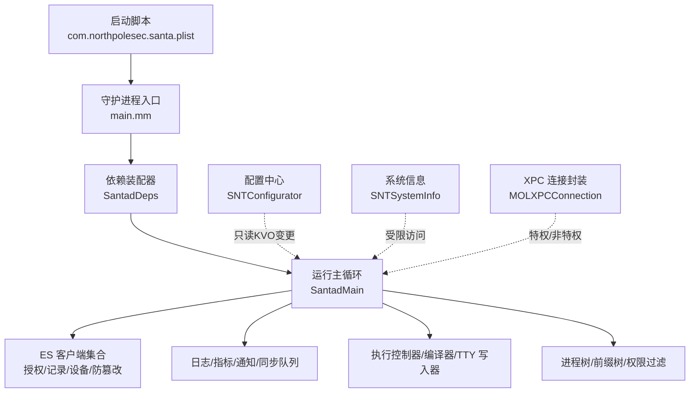
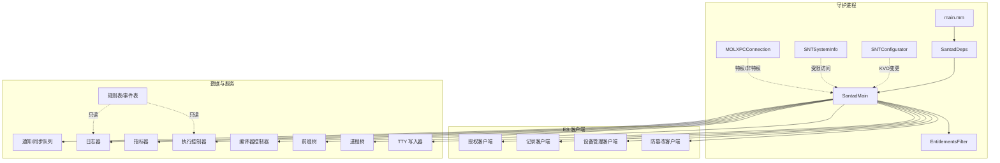
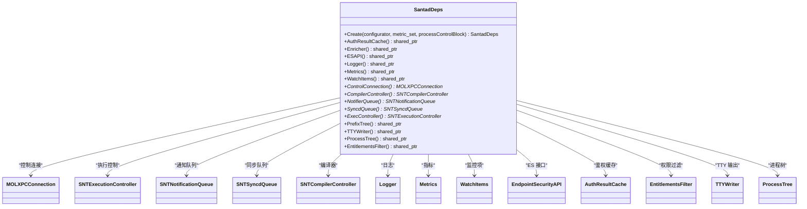
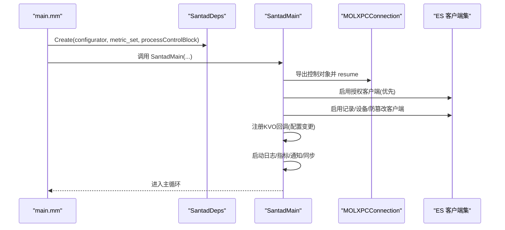
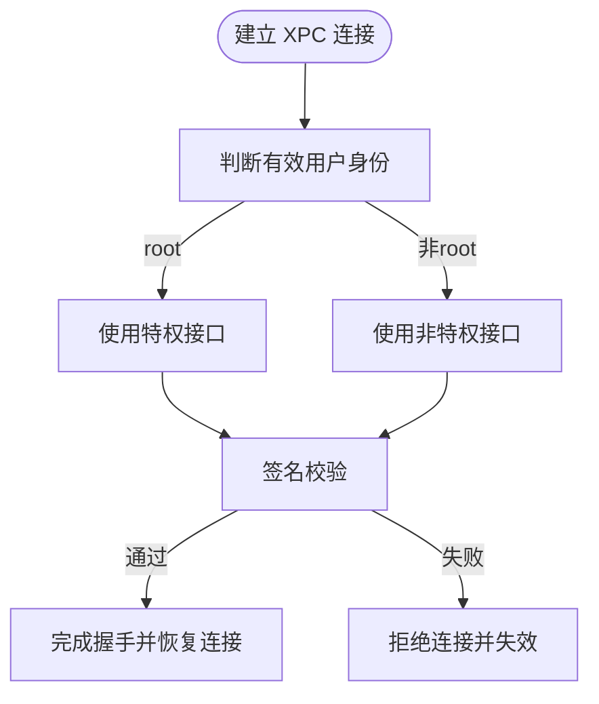
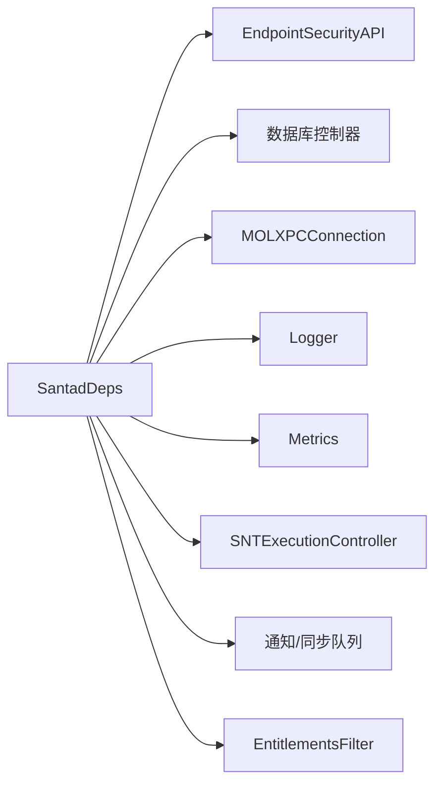

# 信任边界与隔离

<cite>
**本文引用的文件**
- [SantadDeps.h](file://Source/santad/SantadDeps.h)
- [SantadDeps.mm](file://Source/santad/SantadDeps.mm)
- [Santad.h](file://Source/santad/Santad.h)
- [Santad.mm](file://Source/santad/Santad.mm)
- [main.mm](file://Source/santad/main.mm)
- [SNTSystemInfo.h](file://Source/common/SNTSystemInfo.h)
- [SNTSystemInfo.mm](file://Source/common/SNTSystemInfo.mm)
- [SNTConfigurator.h](file://Source/common/SNTConfigurator.h)
- [SNTConfigurator.mm](file://Source/common/SNTConfigurator.mm)
- [EntitlementsFilter.h](file://Source/santad/EntitlementsFilter.h)
- [MOLXPCConnection.h](file://Source/common/MOLXPCConnection.h)
- [MOLXPCConnection.mm](file://Source/common/MOLXPCConnection.mm)
- [ProcessControl.h](file://Source/santad/ProcessControl.h)
- [com.northpolesec.santa.plist](file://Conf/com.northpolesec.santa.plist)
</cite>

## 目录
1. [引言](#引言)
2. [项目结构](#项目结构)
3. [核心组件](#核心组件)
4. [架构总览](#架构总览)
5. [详细组件分析](#详细组件分析)
6. [依赖分析](#依赖分析)
7. [性能考虑](#性能考虑)
8. [故障排查指南](#故障排查指南)
9. [结论](#结论)

## 引言
本文件围绕 Santa 系统的“信任边界与隔离机制”展开，聚焦以下目标：
- 明确内核态与用户态的信任分离：通过 Endpoint Security（ES）事件流与用户态执行授权流程，建立清晰的边界。
- 描述系统扩展与守护进程的信任关系：守护进程由 launchd 启动，通过 XPC 对外提供受控接口；特权与非特权接口分离。
- 深入解析 SantadDeps 依赖管理器的隔离策略：组件初始化顺序、依赖关系验证与隔离边界维护。
- 阐述系统信息获取的安全限制、敏感数据访问控制与隐私保护机制。
- 提供信任模型设计、边界攻击防护与隔离失效检测与修复方法。

## 项目结构
Santa 的守护进程位于 Source/santad，核心入口在 main.mm，初始化与装配逻辑集中在 SantadDeps，运行时主循环在 SantadMain。配置与系统信息分别由 SNTConfigurator 与 SNTSystemInfo 提供。XPC 通信封装由 MOLXPCConnection 实现，用于区分特权与非特权客户端。

图表来源
- [com.northpolesec.santa.plist](file://Conf/com.northpolesec.santa.plist#L1-L22)
- [main.mm](file://Source/santad/main.mm#L104-L151)
- [SantadDeps.h](file://Source/santad/SantadDeps.h#L45-L101)
- [SantadDeps.mm](file://Source/santad/SantadDeps.mm#L50-L228)
- [Santad.h](file://Source/santad/Santad.h#L35-L51)
- [Santad.mm](file://Source/santad/Santad.mm#L73-L120)
- [SNTConfigurator.h](file://Source/common/SNTConfigurator.h#L31-L120)
- [SNTSystemInfo.h](file://Source/common/SNTSystemInfo.h#L21-L82)
- [MOLXPCConnection.h](file://Source/common/MOLXPCConnection.h#L54-L155)

章节来源
- [com.northpolesec.santa.plist](file://Conf/com.northpolesec.santa.plist#L1-L22)
- [main.mm](file://Source/santad/main.mm#L104-L151)
- [SantadDeps.h](file://Source/santad/SantadDeps.h#L45-L101)
- [SantadDeps.mm](file://Source/santad/SantadDeps.mm#L50-L228)
- [Santad.h](file://Source/santad/Santad.h#L35-L51)
- [Santad.mm](file://Source/santad/Santad.mm#L73-L120)
- [SNTConfigurator.h](file://Source/common/SNTConfigurator.h#L31-L120)
- [SNTSystemInfo.h](file://Source/common/SNTSystemInfo.h#L21-L82)
- [MOLXPCConnection.h](file://Source/common/MOLXPCConnection.h#L54-L155)

## 核心组件
- 依赖装配器（SantadDeps）
  - 负责按序创建并注入：XPC 控制连接、规则表/事件表、编译器控制器、通知队列、同步队列、TTY 写入器、权限过滤器、执行控制器、前缀树、进程树、日志器、指标器、鉴权结果缓存等。
  - 通过工厂方法集中初始化，确保组件生命周期与依赖关系可控。
- 运行主循环（SantadMain）
  - 注册控制接口到 XPC，启用 ES 客户端（授权、记录、设备、防篡改），启动策略处理与观察者回调，维持主循环。
- 配置中心（SNTConfigurator）
  - 单例提供 KVO 可变配置，覆盖来自同步服务器与本地强制配置，支持运行时变更触发缓存刷新与服务重启。
- 系统信息（SNTSystemInfo）
  - 仅暴露有限系统标识（序列号、硬件 UUID、引导会话 UUID、主机名、OS 版本、型号等），采用一次性初始化与 sysctl 访问，避免频繁开销。
- XPC 连接（MOLXPCConnection）
  - 区分特权/非特权接口，基于签名校验与监听器代理实现连接建立与失效处理。
- 权限过滤（EntitlementsFilter）
  - 基于 TeamID 与前缀的并发安全过滤器，支持运行时更新，保障敏感权限信息不泄露。
- 进程控制（ProcessControl）
  - 以回调块形式提供受控的挂起/恢复/终止能力，避免直接进程操作越权。

章节来源
- [SantadDeps.h](file://Source/santad/SantadDeps.h#L45-L101)
- [SantadDeps.mm](file://Source/santad/SantadDeps.mm#L50-L228)
- [Santad.h](file://Source/santad/Santad.h#L35-L51)
- [Santad.mm](file://Source/santad/Santad.mm#L73-L120)
- [SNTConfigurator.h](file://Source/common/SNTConfigurator.h#L31-L120)
- [SNTConfigurator.mm](file://Source/common/SNTConfigurator.mm#L219-L231)
- [SNTSystemInfo.h](file://Source/common/SNTSystemInfo.h#L21-L82)
- [SNTSystemInfo.mm](file://Source/common/SNTSystemInfo.mm#L15-L121)
- [MOLXPCConnection.h](file://Source/common/MOLXPCConnection.h#L54-L155)
- [MOLXPCConnection.mm](file://Source/common/MOLXPCConnection.mm#L159-L203)
- [EntitlementsFilter.h](file://Source/santad/EntitlementsFilter.h#L30-L64)
- [ProcessControl.h](file://Source/santad/ProcessControl.h#L20-L31)

## 架构总览
下图展示 Santa 守护进程的模块化架构与信任边界：

图表来源
- [main.mm](file://Source/santad/main.mm#L104-L151)
- [SantadDeps.mm](file://Source/santad/SantadDeps.mm#L50-L228)
- [Santad.mm](file://Source/santad/Santad.mm#L73-L120)
- [SNTConfigurator.h](file://Source/common/SNTConfigurator.h#L31-L120)
- [SNTSystemInfo.h](file://Source/common/SNTSystemInfo.h#L21-L82)
- [MOLXPCConnection.h](file://Source/common/MOLXPCConnection.h#L54-L155)
- [EntitlementsFilter.h](file://Source/santad/EntitlementsFilter.h#L30-L64)

## 详细组件分析

### 组件 A：SantadDeps 依赖管理器
- 初始化顺序与职责
  - XPC 控制连接：区分特权/非特权接口，失败即退出，保证最小可用性。
  - 数据层：规则表/事件表从数据库控制器获取，失败即退出。
  - 执行链路：编译器控制器、通知队列、同步队列、TTY 写入器、权限过滤器、执行控制器、前缀树、进程树、日志器、指标器、鉴权结果缓存。
  - WatchItems：优先级降序从规则库、嵌入配置、plist 文件构建，并注册回调以响应规则变化。
  - ES 子系统：ESAPI、鉴权/记录/设备/防篡改客户端按需启用。
- 依赖关系验证
  - 所有关键组件创建后立即进行空值检查，失败则记录错误并终止，避免悬挂状态。
  - 使用智能指针与共享指针管理生命周期，减少资源泄漏风险。
- 隔离边界维护
  - 将特权接口与非特权接口分离，XPC 层面进行签名校验与连接建立，防止越权调用。
  - 日志/指标/通知/同步等服务与执行决策解耦，降低单点故障影响范围。

图表来源
- [SantadDeps.h](file://Source/santad/SantadDeps.h#L45-L101)
- [SantadDeps.mm](file://Source/santad/SantadDeps.mm#L50-L228)

章节来源
- [SantadDeps.h](file://Source/santad/SantadDeps.h#L45-L101)
- [SantadDeps.mm](file://Source/santad/SantadDeps.mm#L50-L228)

### 组件 B：SantadMain 运行主循环
- 控制接口导出与监听：将控制对象导出到 XPC，启用监听，确保外部控制通道可用。
- ES 客户端启用顺序与职责
  - 授权客户端：订阅 AUTH EXEC 事件，应用执行策略，设置 ES 客户端作为鉴权缓存来源。
  - 记录客户端：订阅并记录事件，配合编译器与前缀树优化路径。
  - 设备管理客户端：处理 USB/网络挂载事件，触发通知与同步。
  - 防篡改客户端：在非调试构建中启用，增强抗篡改能力。
- 观察者回调（KVO）
  - 监听配置变更（模式、同步地址、统计开关、导出间隔、路径正则、静态规则、事件日志类型、权限过滤、遥测参数、TTY 静默、机器 ID 装饰等），在必要时刷新缓存或重启服务。
- 启动流程要点
  - 先启用授权客户端，确保 ES 缓存订阅顺序正确，避免策略空窗期。
  - 在授权客户端启用后再预填充决策缓存，减少启动阶段的策略延迟。

图表来源
- [main.mm](file://Source/santad/main.mm#L104-L151)
- [SantadDeps.mm](file://Source/santad/SantadDeps.mm#L137-L147)
- [Santad.mm](file://Source/santad/Santad.mm#L73-L120)
- [MOLXPCConnection.h](file://Source/common/MOLXPCConnection.h#L124-L155)

章节来源
- [Santad.mm](file://Source/santad/Santad.mm#L73-L120)
- [Santad.mm](file://Source/santad/Santad.mm#L224-L289)
- [Santad.mm](file://Source/santad/Santad.mm#L758-L794)
- [main.mm](file://Source/santad/main.mm#L104-L151)

### 组件 C：系统信息与敏感数据访问控制
- 系统信息获取
  - 仅暴露有限标识（序列号、硬件 UUID、引导会话 UUID、主机名、OS 版本、型号、Santa 版本），通过一次性初始化与 sysctl 访问，避免重复开销。
- 敏感数据访问控制
  - 通过 SNTSystemInfo 的受控接口与最小暴露原则，避免在运行时频繁查询昂贵资源。
  - 配合日志装饰开关与机器 ID 配置，可选择性地在日志中附加机器标识，满足合规要求。

章节来源
- [SNTSystemInfo.h](file://Source/common/SNTSystemInfo.h#L21-L82)
- [SNTSystemInfo.mm](file://Source/common/SNTSystemInfo.mm#L15-L121)
- [Santad.mm](file://Source/santad/Santad.mm#L552-L566)

### 组件 D：XPC 与特权/非特权信任分离
- 接口分离
  - 服务器端同时暴露特权与非特权接口，依据连接的有效用户身份动态选择接口。
- 签名校验
  - 通过签名检查确保连接方与自身签名一致，拒绝不可信客户端。
- 连接建立与失效处理
  - 客户端侧在 resume 后等待握手完成，超时则主动失效；监听器侧在接受新连接时进行签名校验与接口重置。

图表来源
- [MOLXPCConnection.mm](file://Source/common/MOLXPCConnection.mm#L159-L203)
- [MOLXPCConnection.h](file://Source/common/MOLXPCConnection.h#L124-L155)

章节来源
- [MOLXPCConnection.h](file://Source/common/MOLXPCConnection.h#L54-L155)
- [MOLXPCConnection.mm](file://Source/common/MOLXPCConnection.mm#L159-L203)

### 组件 E：权限过滤与隐私保护
- 过滤策略
  - 基于 TeamID 列表与前缀树的并发安全过滤器，支持运行时更新，确保敏感权限信息不泄露。
- 更新机制
  - 通过配置变更回调触发过滤器更新，并联动清理鉴权缓存与 ES 缓存，确保后续执行决策符合新策略。

章节来源
- [EntitlementsFilter.h](file://Source/santad/EntitlementsFilter.h#L30-L64)
- [Santad.mm](file://Source/santad/Santad.mm#L462-L496)

## 依赖分析
- 组件耦合与内聚
  - SantadDeps 高内聚地负责装配与注入，降低上层对底层细节的耦合。
  - ES 客户端与日志/指标/通知/同步等服务通过接口解耦，便于独立演进。
- 外部依赖与集成点
  - 依赖 Endpoint Security API 获取系统事件，依赖数据库控制器提供规则/事件表，依赖 XPC 提供受控 IPC。
- 潜在环形依赖
  - 未发现直接环形依赖；鉴权缓存通过回调设置 ES 客户端，属于单向依赖。

图表来源
- [SantadDeps.mm](file://Source/santad/SantadDeps.mm#L50-L228)
- [Santad.mm](file://Source/santad/Santad.mm#L122-L148)

章节来源
- [SantadDeps.mm](file://Source/santad/SantadDeps.mm#L50-L228)
- [Santad.mm](file://Source/santad/Santad.mm#L122-L148)

## 性能考虑
- 启动阶段
  - 严格失败即退出策略，避免无效状态导致的额外开销。
  - 启动后先启用授权客户端，再预填充决策缓存，减少策略空窗期与首次决策延迟。
- 运行时
  - KVO 回调仅在必要时刷新缓存或重启服务，避免频繁重启带来的抖动。
  - 日志/指标导出采用定时器与阈值控制，结合批量阈值与最大文件数限制，平衡实时性与磁盘压力。
- 资源管理
  - 使用智能指针管理生命周期，减少内存泄漏风险；RingBuffer 与前缀树等数据结构在高并发场景下具备良好扩展性。

## 故障排查指南
- 启动失败
  - XPC 控制连接或规则/事件表初始化失败：检查服务是否以 root 权限运行、launchd 配置是否正确、数据库是否可用。
- 执行策略异常
  - 鉴权缓存与 ES 缓存不一致：通过配置变更回调触发缓存刷新，必要时手动清理缓存并重启相关客户端。
- 日志/指标异常
  - 事件日志类型切换：在切换时会触发安全重启，确认切换后守护进程已正常重启。
  - 遥测导出：检查导出开关、间隔、超时与批次阈值配置，确保网络与存储条件满足。
- USB/网络挂载阻断
  - 确认配置项与回调是否正确生效，关注设备管理客户端的 block/ remount 行为。

章节来源
- [SantadDeps.mm](file://Source/santad/SantadDeps.mm#L50-L120)
- [Santad.mm](file://Source/santad/Santad.mm#L435-L452)
- [Santad.mm](file://Source/santad/Santad.mm#L462-L496)

## 结论
Santa 的信任边界与隔离机制通过以下方式实现：
- 内核态与用户态分离：以 ES 事件为边界，用户态仅在授权客户端启用后才开始应用策略，避免策略空窗。
- 守护进程与系统扩展的信任关系：launchd 启动守护进程，XPC 提供特权/非特权接口，签名校验确保连接可信。
- 依赖管理器的隔离策略：严格的初始化顺序、失败即退出、组件注入与生命周期管理，确保系统稳定。
- 配置驱动的运行时调整：KVO 回调在必要时刷新缓存或重启服务，保障策略一致性。
- 敏感数据与隐私保护：最小化系统信息暴露，支持日志装饰与机器 ID 配置，满足合规需求。