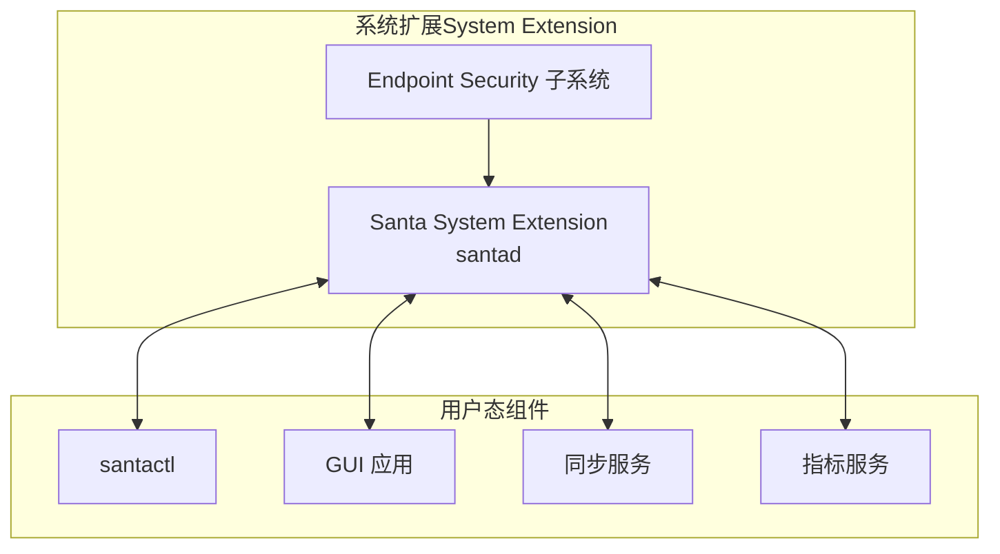
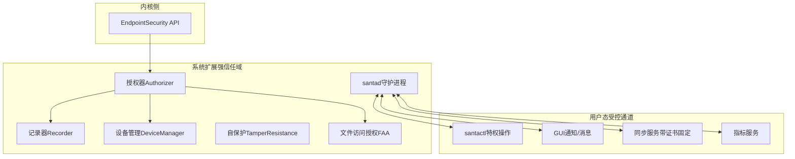
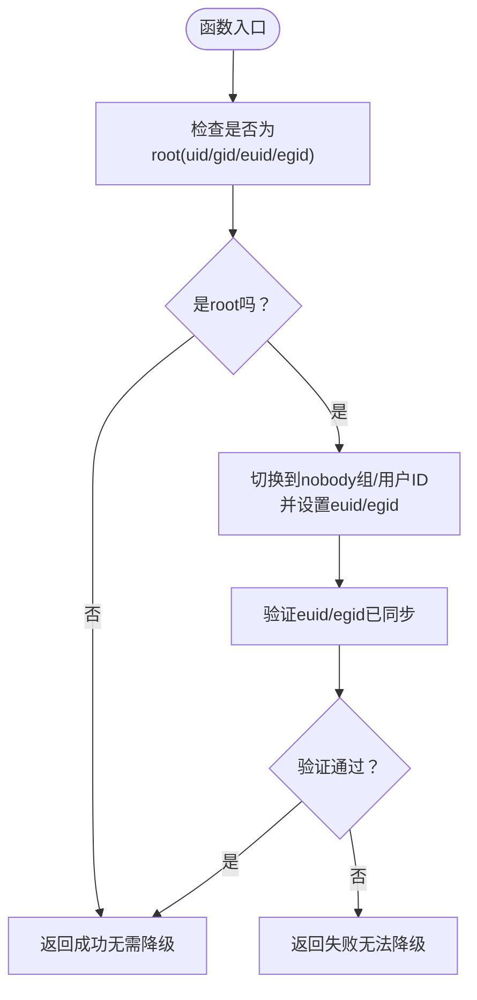
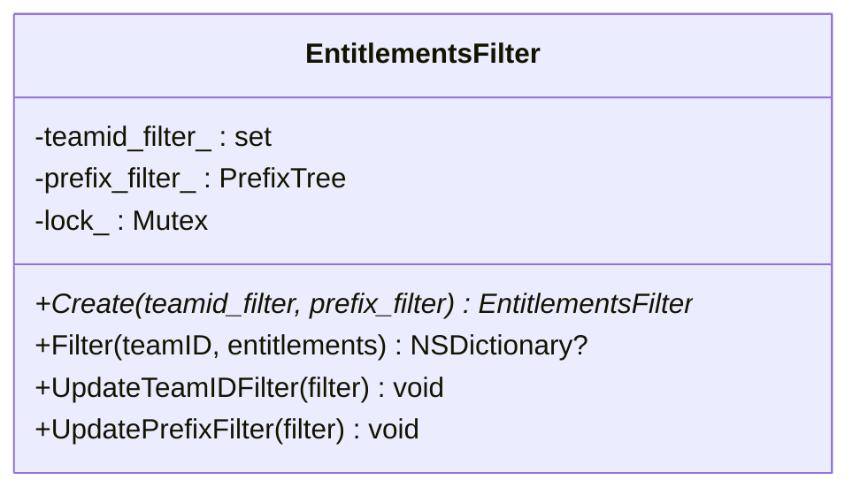
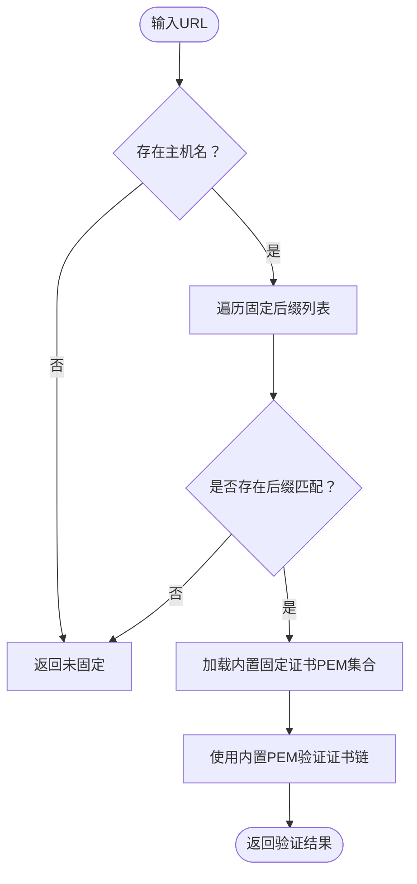
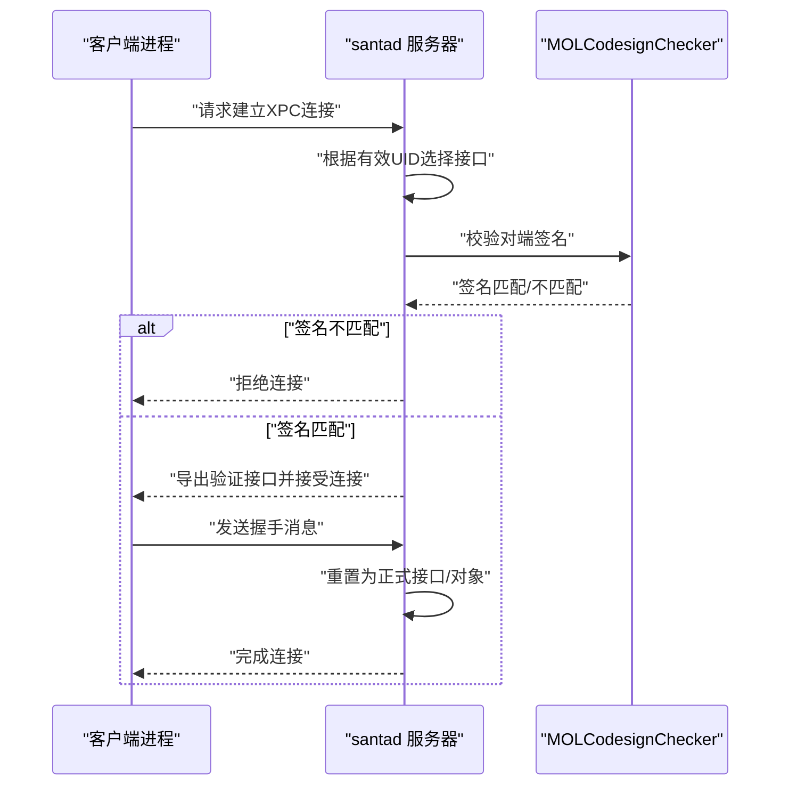
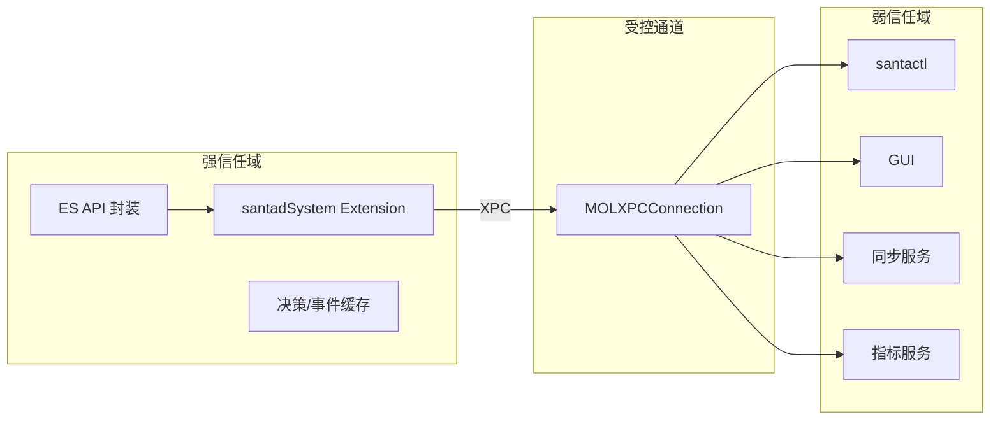
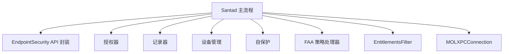

# 安全边界设计

<cite>
**本文引用的文件**
- [Santad.mm](file://Source/santad/Santad.mm)
- [SNTDropRootPrivs.h](file://Source/common/SNTDropRootPrivs.h)
- [SNTDropRootPrivs.mm](file://Source/common/SNTDropRootPrivs.mm)
- [EntitlementsFilter.h](file://Source/santad/EntitlementsFilter.h)
- [EntitlementsFilter.mm](file://Source/santad/EntitlementsFilter.mm)
- [Pinning.h](file://Source/common/Pinning.h)
- [Pinning.mm](file://Source/common/Pinning.mm)
- [MOLXPCConnection.h](file://Source/common/MOLXPCConnection.h)
- [MOLXPCConnection.mm](file://Source/common/MOLXPCConnection.mm)
- [SNTXPCControlInterface.h](file://Source/common/SNTXPCControlInterface.h)
- [Info.plist（santad）](file://Source/santad/Info.plist)
- [com.northpolesec.santa.plist](file://Conf/com.northpolesec.santa.plist)
- [EndpointSecurity_Research_Report.md](file://docs/EndpointSecurity_Research_Report.md)
- [Dynamic_DataSecurity_System_Design.md](file://Dynamic_DataSecurity_System_Design.md)
- [SNTEndpointSecurityTamperResistanceTest.mm](file://Source/santad/EventProviders/SNTEndpointSecurityTamperResistanceTest.mm)
- [santa.proto](file://Source/common/santa.proto)
</cite>

## 目录
1. [引言](#引言)
2. [项目结构](#项目结构)
3. [核心组件](#核心组件)
4. [架构总览](#架构总览)
5. [详细组件分析](#详细组件分析)
6. [依赖关系分析](#依赖关系分析)
7. [性能考量](#性能考量)
8. [故障排查指南](#故障排查指南)
9. [结论](#结论)
10. [附录](#附录)

## 引言
本文件面向Santa系统的安全边界设计，聚焦于通过权限降级、沙箱隔离、证书验证等手段构建可信边界；深入解析SNTDropRootPrivs权限降级机制、EntitlementsFilter权限过滤策略、Pinning证书固定机制的实现原理；阐述系统扩展、守护进程、用户态组件之间的信任边界划分；解释代码签名验证、XPC接口安全、IPC通信安全等关键安全措施，并提供安全架构图、信任模型图、威胁分析图、安全配置指南与漏洞防护建议。

## 项目结构
Santa以System Extension形式运行，核心守护进程为santad，负责与内核Endpoint Security交互、执行策略决策、记录事件与遥测、以及通过XPC与用户态工具交互。安全相关的关键模块包括：
- 权限降级：SNTDropRootPrivs
- 权限过滤：EntitlementsFilter
- 证书固定：Pinning
- XPC连接与签名校验：MOLXPCConnection
- 配置与服务清单：Info.plist、com.northpolesec.santa.plist

图表来源
- [Santad.mm](file://Source/santad/Santad.mm#L73-L120)
- [Info.plist（santad）](file://Source/santad/Info.plist#L1-L30)
- [com.northpolesec.santa.plist](file://Conf/com.northpolesec.santa.plist#L1-L22)

章节来源
- [Santad.mm](file://Source/santad/Santad.mm#L73-L120)
- [Info.plist（santad）](file://Source/santad/Info.plist#L1-L30)
- [com.northpolesec.santa.plist](file://Conf/com.northpolesec.santa.plist#L1-L22)

## 核心组件
- 权限降级（SNTDropRootPrivs）：在启动后主动检查并降级root权限，降低攻击面。
- 权限过滤（EntitlementsFilter）：按TeamID与前缀过滤策略，限制敏感信息泄露。
- 证书固定（Pinning）：对特定域名启用证书固定，结合预置根证书集合抵御中间人攻击。
- XPC接口安全（MOLXPCConnection）：基于代码签名与有效UID判定，拒绝非受信客户端接入。
- 信任边界划分：System Extension内部为强信任域，用户态组件通过受控XPC通道访问受限能力。

章节来源
- [SNTDropRootPrivs.h](file://Source/common/SNTDropRootPrivs.h#L1-L28)
- [SNTDropRootPrivs.mm](file://Source/common/SNTDropRootPrivs.mm#L1-L37)
- [EntitlementsFilter.h](file://Source/santad/EntitlementsFilter.h#L1-L63)
- [EntitlementsFilter.mm](file://Source/santad/EntitlementsFilter.mm#L1-L94)
- [Pinning.h](file://Source/common/Pinning.h#L1-L30)
- [Pinning.mm](file://Source/common/Pinning.mm#L1-L242)
- [MOLXPCConnection.h](file://Source/common/MOLXPCConnection.h#L1-L164)
- [MOLXPCConnection.mm](file://Source/common/MOLXPCConnection.mm#L1-L200)

## 架构总览
下图展示Santa系统在macOS上的安全架构：System Extension作为内核侧与用户态之间的唯一可信边界，santad在其中承担策略决策、事件记录与防护职责；用户态组件通过受控XPC通道与其交互，且所有外部通信均采用证书固定与签名校验。

图表来源
- [Santad.mm](file://Source/santad/Santad.mm#L120-L200)
- [EndpointSecurity_Research_Report.md](file://docs/EndpointSecurity_Research_Report.md#L12-L43)
- [Dynamic_DataSecurity_System_Design.md](file://Dynamic_DataSecurity_System_Design.md#L1-L35)

章节来源
- [Santad.mm](file://Source/santad/Santad.mm#L120-L200)
- [EndpointSecurity_Research_Report.md](file://docs/EndpointSecurity_Research_Report.md#L12-L43)
- [Dynamic_DataSecurity_System_Design.md](file://Dynamic_DataSecurity_System_Design.md#L1-L35)

## 详细组件分析

### 权限降级机制（SNTDropRootPrivs）
- 设计目标：在启动阶段检测并降级root权限，避免长期持有最高权限。
- 实现要点：
  - 检查当前UID/GID是否为root，若是则切换到nobody组与用户ID，并确保euid/egid也同步变更。
  - 成功后返回true，失败则返回false，便于上层进行安全策略或退出。
- 安全收益：显著降低提权攻击与横向移动的风险。

图表来源
- [SNTDropRootPrivs.mm](file://Source/common/SNTDropRootPrivs.mm#L1-L37)

章节来源
- [SNTDropRootPrivs.h](file://Source/common/SNTDropRootPrivs.h#L1-L28)
- [SNTDropRootPrivs.mm](file://Source/common/SNTDropRootPrivs.mm#L1-L37)

### 权限过滤策略（EntitlementsFilter）
- 设计目标：在事件上报与日志中过滤敏感权限信息，降低信息泄露风险。
- 实现要点：
  - 支持按TeamID白名单直接丢弃该应用的entitlements。
  - 支持按前缀过滤，仅保留匹配的entitlement键，其余拷贝值（深拷贝容器类型）。
  - 使用并发安全的读写锁，支持运行时更新过滤规则。
- 安全收益：在不影响策略判断的前提下，最小化敏感元数据暴露。

图表来源
- [EntitlementsFilter.h](file://Source/santad/EntitlementsFilter.h#L1-L63)
- [EntitlementsFilter.mm](file://Source/santad/EntitlementsFilter.mm#L1-L94)

章节来源
- [EntitlementsFilter.h](file://Source/santad/EntitlementsFilter.h#L1-L63)
- [EntitlementsFilter.mm](file://Source/santad/EntitlementsFilter.mm#L1-L94)
- [Santad.mm](file://Source/santad/Santad.mm#L468-L488)

### 证书固定机制（Pinning）
- 设计目标：对特定域名启用证书固定，结合内置根证书集合，抵御中间人攻击与证书链替换。
- 实现要点：
  - 域名匹配：维护可配置的后缀列表，命中即视为“已固定”。
  - 证书集合：内置多棵知名CA根证书PEM，用于验证固定域名的TLS握手。
- 安全收益：即使系统信任存储被篡改，仍能通过固定证书链保证关键通信安全。

图表来源
- [Pinning.mm](file://Source/common/Pinning.mm#L1-L242)
- [Pinning.h](file://Source/common/Pinning.h#L1-L30)

章节来源
- [Pinning.h](file://Source/common/Pinning.h#L1-L30)
- [Pinning.mm](file://Source/common/Pinning.mm#L1-L242)

### XPC接口安全与IPC通信
- 设计目标：确保用户态组件只能通过受控通道与守护进程交互，且连接双方均需满足签名与权限要求。
- 实现要点：
  - 连接建立阶段：服务器端根据连接的有效UID选择使用特权或非特权接口。
  - 签名校验：通过MOLCodesignChecker对比对端签名与本地签名，不匹配则拒绝。
  - 连接确认：采用两阶段握手（验证接口→正式接口），并在超时或异常时主动失效。
  - 接口契约：通过NSXPCInterface声明协议，客户端仅能调用受控方法。
- 安全收益：阻断非受信进程的注入与越权调用，降低攻击面。

图表来源
- [MOLXPCConnection.mm](file://Source/common/MOLXPCConnection.mm#L159-L200)
- [MOLXPCConnection.h](file://Source/common/MOLXPCConnection.h#L1-L164)

章节来源
- [MOLXPCConnection.h](file://Source/common/MOLXPCConnection.h#L1-L164)
- [MOLXPCConnection.mm](file://Source/common/MOLXPCConnection.mm#L1-L200)
- [SNTXPCControlInterface.h](file://Source/common/SNTXPCControlInterface.h#L1-L33)

### 信任边界划分与守护进程职责
- System Extension（santad）：内核侧与用户态之间的唯一可信边界，负责策略决策、事件记录、设备与挂载控制、自保护与FAA策略执行。
- 用户态组件：santactl、GUI、同步与指标服务通过XPC受控通道访问santad提供的能力，且仅能调用声明的协议方法。
- 配置与部署：System Extension清单与launchd作业确保服务以受控方式启动与重启。

图表来源
- [Santad.mm](file://Source/santad/Santad.mm#L73-L120)
- [MOLXPCConnection.mm](file://Source/common/MOLXPCConnection.mm#L114-L175)
- [Info.plist（santad）](file://Source/santad/Info.plist#L1-L30)
- [com.northpolesec.santa.plist](file://Conf/com.northpolesec.santa.plist#L1-L22)

章节来源
- [Santad.mm](file://Source/santad/Santad.mm#L73-L120)
- [MOLXPCConnection.mm](file://Source/common/MOLXPCConnection.mm#L114-L175)
- [Info.plist（santad）](file://Source/santad/Info.plist#L1-L30)
- [com.northpolesec.santa.plist](file://Conf/com.northpolesec.santa.plist#L1-L22)

### 代码签名验证与沙箱隔离
- 代码签名验证：XPC连接建立时，通过MOLCodesignChecker对端签名与本地签名进行比对，确保仅受信二进制可访问特权接口。
- 沙箱隔离：System Extension运行在系统扩展沙箱内，具备有限的权限面；用户态组件通过XPC调用受限能力，避免直接接触内核或系统资源。

章节来源
- [MOLXPCConnection.mm](file://Source/common/MOLXPCConnection.mm#L168-L175)
- [EndpointSecurity_Research_Report.md](file://docs/EndpointSecurity_Research_Report.md#L12-L43)

### IPC通信安全与事件模型
- IPC安全：XPC连接采用强身份验证与两阶段握手，配合接口契约与超时失效机制，确保通信完整性与可用性。
- 事件模型：系统通过Endpoint Security捕获事件，santad将其转化为内部事件模型并持久化或上报，同时支持遥测与告警。

章节来源
- [MOLXPCConnection.mm](file://Source/common/MOLXPCConnection.mm#L114-L175)
- [santa.proto](file://Source/common/santa.proto#L1108-L1151)

## 依赖关系分析
- 组件耦合：
  - santad主流程依赖ES API封装、事件记录器、授权器、设备管理器、自保护与FAA策略处理器。
  - EntitlementsFilter独立于策略执行，仅在需要输出日志/事件时参与过滤。
  - MOLXPCConnection为通用IPC基础设施，贯穿santactl、GUI、同步与指标服务。
- 外部依赖：
  - macOS Endpoint Security API
  - System Extension框架与launchd作业
  - 内置根证书集合（Pinning）

图表来源
- [Santad.mm](file://Source/santad/Santad.mm#L120-L200)
- [EntitlementsFilter.h](file://Source/santad/EntitlementsFilter.h#L1-L63)
- [MOLXPCConnection.h](file://Source/common/MOLXPCConnection.h#L1-L164)

章节来源
- [Santad.mm](file://Source/santad/Santad.mm#L120-L200)
- [EntitlementsFilter.h](file://Source/santad/EntitlementsFilter.h#L1-L63)
- [MOLXPCConnection.h](file://Source/common/MOLXPCConnection.h#L1-L164)

## 性能考量
- ES事件订阅采用“监视列表（watch-list）”模式，通过反向静默（muting inversion）仅接收关注对象的事件，显著降低内核到用户态的数据传输与处理开销。
- 缓存与批处理：决策缓存、事件缓存与速率限制减少重复计算与I/O压力。
- 并发安全：EntitlementsFilter使用读写锁，支持高并发下的安全更新与查询。

章节来源
- [Dynamic_DataSecurity_System_Design.md](file://Dynamic_DataSecurity_System_Design.md#L1-L35)
- [EntitlementsFilter.mm](file://Source/santad/EntitlementsFilter.mm#L1-L94)

## 故障排查指南
- XPC连接失败：
  - 检查对端签名是否与本地一致；若不一致，服务器会拒绝连接。
  - 观察连接建立超时与无效化回调，确认握手阶段是否完成。
- 权限降级失败：
  - 若降级后euid/egid未同步，返回失败；需检查系统权限与账户映射。
- EntitlementsFilter异常：
  - 更新过滤规则时应确保线程安全；并发场景下避免竞态导致的崩溃。
- 自保护与ES事件：
  - 自保护模块在初始化时会清理缓存、反转静默与路径静默，确保策略一致性；如遇异常，检查ES API返回状态与日志。

章节来源
- [MOLXPCConnection.mm](file://Source/common/MOLXPCConnection.mm#L144-L175)
- [SNTDropRootPrivs.mm](file://Source/common/SNTDropRootPrivs.mm#L1-L37)
- [EntitlementsFilter.mm](file://Source/santad/EntitlementsFilter.mm#L1-L94)
- [SNTEndpointSecurityTamperResistanceTest.mm](file://Source/santad/EventProviders/SNTEndpointSecurityTamperResistanceTest.mm#L69-L94)

## 结论
Santa通过System Extension形成强信任边界，结合权限降级、权限过滤、证书固定与严格的XPC签名校验，构建了从内核到用户态的纵深防御体系。ES事件采用监视列表模式，辅以缓存与并发安全机制，兼顾安全性与性能。建议持续强化配置审计、密钥与证书轮换、以及对新威胁的快速响应机制。

## 附录

### 安全配置指南
- 启用System Extension并确保其以受控方式启动与重启。
- 在XPC服务器端明确区分特权与非特权接口，并严格校验对端签名。
- 对关键域名启用证书固定，定期轮换内置根证书集合。
- 启用权限过滤策略，按TeamID与前缀裁剪敏感元数据。
- 保持ES策略与静默规则的最小化与动态更新能力，避免过度监听。

章节来源
- [com.northpolesec.santa.plist](file://Conf/com.northpolesec.santa.plist#L1-L22)
- [Info.plist（santad）](file://Source/santad/Info.plist#L1-L30)
- [MOLXPCConnection.mm](file://Source/common/MOLXPCConnection.mm#L159-L200)
- [Pinning.mm](file://Source/common/Pinning.mm#L1-L242)
- [EntitlementsFilter.mm](file://Source/santad/EntitlementsFilter.mm#L1-L94)

### 漏洞防护建议
- 防止越权调用：仅允许受信签名的进程访问特权XPC接口。
- 防止中间人攻击：对关键域名启用证书固定，校验证书链与指纹。
- 防止信息泄露：对日志与事件中的entitlements进行前缀过滤与TeamID白名单控制。
- 防止持久化与篡改：启用自保护模块，确保策略与缓存的一致性与抗篡改能力。
- 防止滥用权限：在启动后尽快降级root权限，避免长期持有最高权限。

章节来源
- [MOLXPCConnection.mm](file://Source/common/MOLXPCConnection.mm#L159-L200)
- [Pinning.mm](file://Source/common/Pinning.mm#L1-L242)
- [EntitlementsFilter.mm](file://Source/santad/EntitlementsFilter.mm#L1-L94)
- [SNTDropRootPrivs.mm](file://Source/common/SNTDropRootPrivs.mm#L1-L37)
- [SNTEndpointSecurityTamperResistanceTest.mm](file://Source/santad/EventProviders/SNTEndpointSecurityTamperResistanceTest.mm#L69-L94)