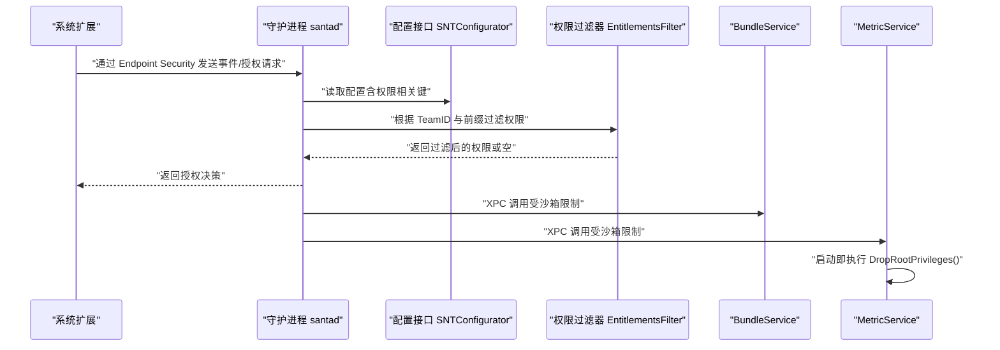
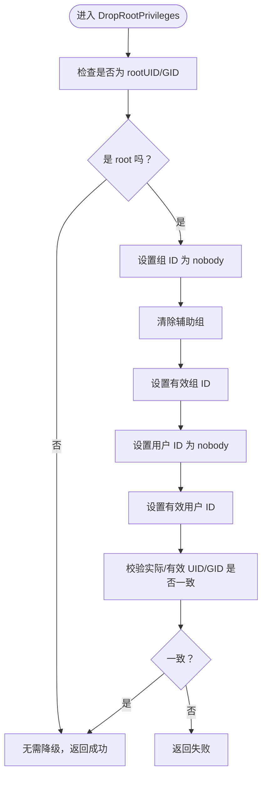
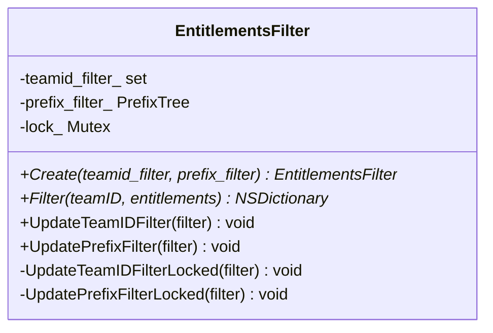
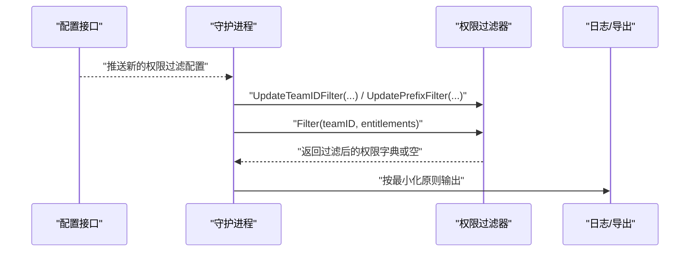
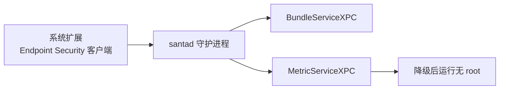
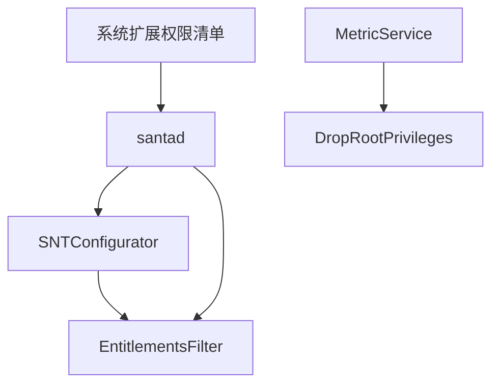

# 权限分离与降级

<cite>
**本文引用的文件**
- [SNTDropRootPrivs.h](file://Source/common/SNTDropRootPrivs.h)
- [SNTDropRootPrivs.mm](file://Source/common/SNTDropRootPrivs.mm)
- [EntitlementsFilter.h](file://Source/santad/EntitlementsFilter.h)
- [EntitlementsFilter.mm](file://Source/santad/EntitlementsFilter.mm)
- [EntitlementsFilterTest.mm](file://Source/santad/EntitlementsFilterTest.mm)
- [Santad.mm](file://Source/santad/Santad.mm)
- [Santad 配置接口头文件](file://Source/common/SNTConfigurator.h)
- [Santad 配置实现](file://Source/common/SNTConfigurator.mm)
- [santad 主入口](file://Source/santad/main.mm)
- [santabundleservice 主入口](file://Source/santabundleservice/main.mm)
- [santametricservice 主入口](file://Source/santametricservice/main.mm)
- [系统扩展权限清单（调试器）](file://Source/santad/com.northpolesec.santa.daemon.systemextension-debugger.entitlements)
- [系统扩展权限清单（普通）](file://Source/santad/com.northpolesec.santa.daemon.systemextension-adhoc.entitlements)
</cite>

## 目录
1. [简介](#简介)
2. [项目结构](#项目结构)
3. [核心组件](#核心组件)
4. [架构总览](#架构总览)
5. [详细组件分析](#详细组件分析)
6. [依赖关系分析](#依赖关系分析)
7. [性能考量](#性能考量)
8. [故障排查指南](#故障排查指南)
9. [结论](#结论)
10. [附录](#附录)

## 简介
本技术文档聚焦 Santa 系统的“权限分离与降级”机制，围绕以下目标展开：
- 深入解析 SNTDropRootPrivs 权限降级函数的实现原理，包括 root 权限检查、降级流程与安全考虑。
- 详解 EntitlementsFilter 权限过滤器的工作机制，涵盖系统扩展权限验证、沙箱策略应用与权限最小化原则。
- 阐述不同组件（系统扩展、守护进程、用户态服务）的权限边界划分与权限传递机制。
- 提供权限降级最佳实践、安全配置示例与常见权限问题排查方法。

## 项目结构
Santa 由多组件构成，涉及内核侧系统扩展、守护进程与用户态服务。权限相关的关键位置如下：
- 守护进程（santad）：负责 Endpoint Security 授权、事件处理与日志导出；通过配置接口动态调整行为。
- 用户态服务：
  - santabundleservice：提供 XPC 接口，用于包信息查询等能力。
  - santametricservice：提供指标采集与导出能力，并在启动时执行 root 权限降级。
- 系统扩展（System Extension）：通过权限清单声明所需的 Endpoint Security 客户端权限与调试能力。

```mermaid
graph TB
subgraph "系统扩展SE"
SE["系统扩展<br/>com.northpolesec.santa.daemon.systemextension"]
end
subgraph "守护进程santad"
SD["Santad 守护进程"]
CFG["配置接口 SNTConfigurator"]
EF["权限过滤器 EntitlementsFilter"]
end
subgraph "用户态服务"
BS["BundleServicesantabundleservice"]
MS["MetricServicesantametricservice"]
end
SE --> SD
SD --> CFG
SD --> EF
SD < --> BS
SD < --> MS
```

图表来源
- [santad 主入口](file://Source/santad/main.mm#L104-L151)
- [santabundleservice 主入口](file://Source/santabundleservice/main.mm#L23-L36)
- [santametricservice 主入口](file://Source/santametricservice/main.mm#L24-L42)
- [系统扩展权限清单（调试器）](file://Source/santad/com.northpolesec.santa.daemon.systemextension-debugger.entitlements#L1-L19)
- [系统扩展权限清单（普通）](file://Source/santad/com.northpolesec.santa.daemon.systemextension-adhoc.entitlements#L1-L9)

章节来源
- [santad 主入口](file://Source/santad/main.mm#L104-L151)
- [santabundleservice 主入口](file://Source/santabundleservice/main.mm#L23-L36)
- [santametricservice 主入口](file://Source/santametricservice/main.mm#L24-L42)

## 核心组件
- SNTDropRootPrivs：提供 root 权限检查与降级能力，确保非必要时不持有 root 权限。
- EntitlementsFilter：基于 TeamID 与前缀列表对应用沙箱权限进行过滤，支持并发更新与深拷贝，遵循最小化原则。
- SNTConfigurator：集中管理配置项，包括与权限相关的键值（如沙箱前缀过滤、TeamID 过滤），并提供访问授权控制。
- 系统扩展权限清单：定义系统扩展所需的 Endpoint Security 客户端权限与调试能力，作为沙箱策略的依据。

章节来源
- [SNTDropRootPrivs.h](file://Source/common/SNTDropRootPrivs.h#L18-L27)
- [SNTDropRootPrivs.mm](file://Source/common/SNTDropRootPrivs.mm#L21-L35)
- [EntitlementsFilter.h](file://Source/santad/EntitlementsFilter.h#L30-L64)
- [EntitlementsFilter.mm](file://Source/santad/EntitlementsFilter.mm#L34-L65)
- [Santad 配置接口头文件](file://Source/common/SNTConfigurator.h#L180-L189)
- [Santad 配置实现](file://Source/common/SNTConfigurator.mm#L220-L231)

## 架构总览
下图展示权限相关组件在系统中的交互关系与职责边界：



图表来源
- [santad 主入口](file://Source/santad/main.mm#L137-L147)
- [Santad 配置实现](file://Source/common/SNTConfigurator.mm#L220-L231)
- [EntitlementsFilter.mm](file://Source/santad/EntitlementsFilter.mm#L34-L65)
- [santabundleservice 主入口](file://Source/santabundleservice/main.mm#L23-L36)
- [santametricservice 主入口](file://Source/santametricservice/main.mm#L24-L42)

## 详细组件分析

### 组件一：SNTDropRootPrivs 权限降级函数
- 设计目标：在进程启动后尽早检测并降级 root 权限，避免长期持有高权限。
- 实现要点：
  - 权限检查：判断实际/有效 UID/GID 是否为 root。
  - 降级步骤：设置组 ID、清除辅助组、设置有效组 ID、设置用户 ID、设置有效用户 ID，最终确认实际与有效 ID 已同步。
  - 错误处理：任一步骤失败或降级后 ID 不一致则返回失败。
- 安全考虑：
  - 仅在必要时保留 root 权限，降低攻击面。
  - 降级后尽量避免再次提权操作。
  - 在用户态服务中优先在启动阶段执行降级。



图表来源
- [SNTDropRootPrivs.mm](file://Source/common/SNTDropRootPrivs.mm#L21-L35)

章节来源
- [SNTDropRootPrivs.h](file://Source/common/SNTDropRootPrivs.h#L18-L27)
- [SNTDropRootPrivs.mm](file://Source/common/SNTDropRootPrivs.mm#L21-L35)
- [santametricservice 主入口](file://Source/santametricservice/main.mm#L24-L31)

### 组件二：EntitlementsFilter 权限过滤器
- 功能概述：根据配置的 TeamID 列表与前缀列表，对应用沙箱权限字典进行过滤，支持并发更新与深拷贝。
- 关键机制：
  - TeamID 过滤：当事件来源的 TeamID 属于过滤列表时，直接返回空，避免记录该来源的权限。
  - 前缀过滤：若存在前缀过滤，则仅保留不匹配任何前缀的键；对数组/字典采用深拷贝，对标量采用浅拷贝。
  - 并发控制：使用读写锁保护内部集合，读路径使用 ReaderMutexLock，写路径使用 MutexLock。
  - 更新策略：支持运行时更新 TeamID 与前缀过滤集，更新时重置内部数据结构。
- 沙箱策略与最小化原则：
  - 仅暴露必要的权限键，避免泄露敏感信息（如 keychain 访问组）。
  - 通过前缀过滤减少日志体量与潜在风险面。
- 配置联动：
  - 配置接口提供 EntitlementsPrefixFilter 与 EntitlementsTeamIDFilter 键，守护进程在配置变更时刷新缓存并更新过滤器。



图表来源
- [EntitlementsFilter.h](file://Source/santad/EntitlementsFilter.h#L30-L64)



图表来源
- [EntitlementsFilter.mm](file://Source/santad/EntitlementsFilter.mm#L34-L65)
- [Santad 配置接口头文件](file://Source/common/SNTConfigurator.h#L180-L189)
- [Santad 配置实现](file://Source/common/SNTConfigurator.mm#L220-L231)
- [Santad.mm](file://Source/santad/Santad.mm#L468-L488)

章节来源
- [EntitlementsFilter.h](file://Source/santad/EntitlementsFilter.h#L30-L64)
- [EntitlementsFilter.mm](file://Source/santad/EntitlementsFilter.mm#L23-L65)
- [EntitlementsFilterTest.mm](file://Source/santad/EntitlementsFilterTest.mm#L31-L103)
- [EntitlementsFilterTest.mm](file://Source/santad/EntitlementsFilterTest.mm#L105-L154)
- [EntitlementsFilterTest.mm](file://Source/santad/EntitlementsFilterTest.mm#L156-L231)
- [EntitlementsFilterTest.mm](file://Source/santad/EntitlementsFilterTest.mm#L233-L276)
- [Santad 配置接口头文件](file://Source/common/SNTConfigurator.h#L180-L189)
- [Santad 配置实现](file://Source/common/SNTConfigurator.mm#L220-L231)
- [Santad.mm](file://Source/santad/Santad.mm#L468-L488)

### 组件三：系统扩展、守护进程与用户态服务的权限边界与传递
- 系统扩展权限：
  - 普通模式：声明 Endpoint Security 客户端权限，允许接收事件与进行授权。
  - 调试模式：额外声明调试相关权限（如获取任务权限），并绑定应用标识与钥匙串访问组。
- 守护进程（santad）：
  - 通过配置接口读取权限相关键，动态启用/禁用过滤策略。
  - 与用户态服务通过 XPC 通信，受限于各自的沙箱策略。
- 用户态服务：
  - BundleService：提供 XPC 接口，受沙箱限制。
  - MetricService：启动即执行 DropRootPrivileges，随后通过 XPC 提供指标服务。



图表来源
- [系统扩展权限清单（调试器）](file://Source/santad/com.northpolesec.santa.daemon.systemextension-debugger.entitlements#L1-L19)
- [系统扩展权限清单（普通）](file://Source/santad/com.northpolesec.santa.daemon.systemextension-adhoc.entitlements#L1-L9)
- [santad 主入口](file://Source/santad/main.mm#L137-L147)
- [santabundleservice 主入口](file://Source/santabundleservice/main.mm#L23-L36)
- [santametricservice 主入口](file://Source/santametricservice/main.mm#L24-L42)

章节来源
- [系统扩展权限清单（调试器）](file://Source/santad/com.northpolesec.santa.daemon.systemextension-debugger.entitlements#L1-L19)
- [系统扩展权限清单（普通）](file://Source/santad/com.northpolesec.santa.daemon.systemextension-adhoc.entitlements#L1-L9)
- [santad 主入口](file://Source/santad/main.mm#L137-L147)
- [santabundleservice 主入口](file://Source/santabundleservice/main.mm#L23-L36)
- [santametricservice 主入口](file://Source/santametricservice/main.mm#L24-L42)

## 依赖关系分析
- 组件耦合：
  - EntitlementsFilter 依赖配置接口提供的过滤键，守护进程在配置变更时刷新缓存并更新过滤器。
  - 用户态服务（MetricService）依赖 DropRootPrivileges 在启动阶段完成降级。
- 外部依赖：
  - 系统扩展权限清单决定沙箱策略范围。
  - 配置接口对状态文件访问施加条件（例如仅在 root 且特定进程名时才允许访问）。



图表来源
- [Santad 配置实现](file://Source/common/SNTConfigurator.mm#L220-L231)
- [EntitlementsFilter.mm](file://Source/santad/EntitlementsFilter.mm#L34-L65)
- [santad 主入口](file://Source/santad/main.mm#L137-L147)
- [santametricservice 主入口](file://Source/santametricservice/main.mm#L24-L31)
- [系统扩展权限清单（普通）](file://Source/santad/com.northpolesec.santa.daemon.systemextension-adhoc.entitlements#L1-L9)

章节来源
- [Santad 配置实现](file://Source/common/SNTConfigurator.mm#L220-L231)
- [EntitlementsFilter.mm](file://Source/santad/EntitlementsFilter.mm#L34-L65)
- [santad 主入口](file://Source/santad/main.mm#L137-L147)
- [santametricservice 主入口](file://Source/santametricservice/main.mm#L24-L31)

## 性能考量
- 过滤器并发：使用读写锁保障读多写少场景下的高吞吐，避免阻塞热路径。
- 深拷贝策略：对数组/字典进行深拷贝，避免共享结构导致的竞态与内存安全问题。
- 前缀树优化：前缀过滤使用前缀树，提升匹配效率。
- 配置更新：在配置变更时刷新缓存，避免旧策略影响后续授权决策。

## 故障排查指南
- 启动后仍持有 root 权限
  - 检查用户态服务是否在启动阶段调用了 DropRootPrivileges。
  - 若降级失败，服务应记录错误并退出，避免继续以 root 运行。
  - 参考路径：[santametricservice 主入口](file://Source/santametricservice/main.mm#L24-L31)
- 权限日志缺失或异常
  - 确认 TeamID 是否被纳入过滤列表。
  - 检查前缀过滤是否过于宽泛，导致权限被全部排除。
  - 使用并发更新测试思路验证过滤器行为。
  - 参考测试用例路径：[EntitlementsFilterTest.mm](file://Source/santad/EntitlementsFilterTest.mm#L156-L231)
- 授权决策异常
  - 检查配置接口的状态文件访问授权条件，确保只有在满足条件时才读取状态。
  - 参考路径：[Santad 配置实现](file://Source/common/SNTConfigurator.mm#L220-L231)
- 系统扩展无法接收事件
  - 核对系统扩展权限清单是否包含 Endpoint Security 客户端权限。
  - 参考路径：[系统扩展权限清单（普通）](file://Source/santad/com.northpolesec.santa.daemon.systemextension-adhoc.entitlements#L1-L9)

章节来源
- [santametricservice 主入口](file://Source/santametricservice/main.mm#L24-L31)
- [EntitlementsFilterTest.mm](file://Source/santad/EntitlementsFilterTest.mm#L156-L231)
- [Santad 配置实现](file://Source/common/SNTConfigurator.mm#L220-L231)
- [系统扩展权限清单（普通）](file://Source/santad/com.northpolesec.santa.daemon.systemextension-adhoc.entitlements#L1-L9)

## 结论
Santa 的权限分离与降级机制通过“最小化权限暴露 + 启动即降级 + 动态过滤 + 沙箱策略约束”的组合，有效降低了系统扩展与守护进程的攻击面，并在用户态服务中进一步强化了安全性。EntitlementsFilter 的并发设计与深拷贝策略保证了在高负载场景下的稳定性与正确性；配置接口对状态文件访问的严格控制，避免了潜在的越权访问风险。

## 附录
- 最佳实践
  - 所有用户态服务在启动阶段必须执行 DropRootPrivileges。
  - 仅在必要时授予系统扩展调试权限，生产环境建议使用普通权限清单。
  - 使用前缀过滤最小化日志中敏感键的数量，定期审查过滤规则。
  - 配置变更后及时刷新缓存，确保授权策略一致性。
- 安全配置示例（参考）
  - 系统扩展权限清单（普通）：包含 Endpoint Security 客户端权限。
  - 系统扩展权限清单（调试器）：包含调试相关权限与应用标识、钥匙串访问组。
  - 配置键：EntitlementsPrefixFilter、EntitlementsTeamIDFilter。
- 相关实现路径
  - [SNTDropRootPrivs.h](file://Source/common/SNTDropRootPrivs.h#L18-L27)
  - [SNTDropRootPrivs.mm](file://Source/common/SNTDropRootPrivs.mm#L21-L35)
  - [EntitlementsFilter.h](file://Source/santad/EntitlementsFilter.h#L30-L64)
  - [EntitlementsFilter.mm](file://Source/santad/EntitlementsFilter.mm#L34-L65)
  - [Santad 配置接口头文件](file://Source/common/SNTConfigurator.h#L180-L189)
  - [Santad 配置实现](file://Source/common/SNTConfigurator.mm#L220-L231)
  - [santad 主入口](file://Source/santad/main.mm#L137-L147)
  - [santabundleservice 主入口](file://Source/santabundleservice/main.mm#L23-L36)
  - [santametricservice 主入口](file://Source/santametricservice/main.mm#L24-L42)
  - [系统扩展权限清单（调试器）](file://Source/santad/com.northpolesec.santa.daemon.systemextension-debugger.entitlements#L1-L19)
  - [系统扩展权限清单（普通）](file://Source/santad/com.northpolesec.santa.daemon.systemextension-adhoc.entitlements#L1-L9)