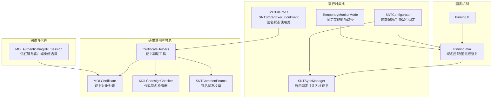
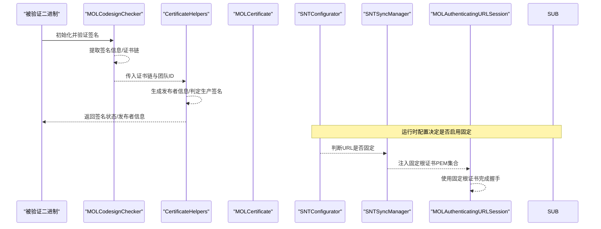
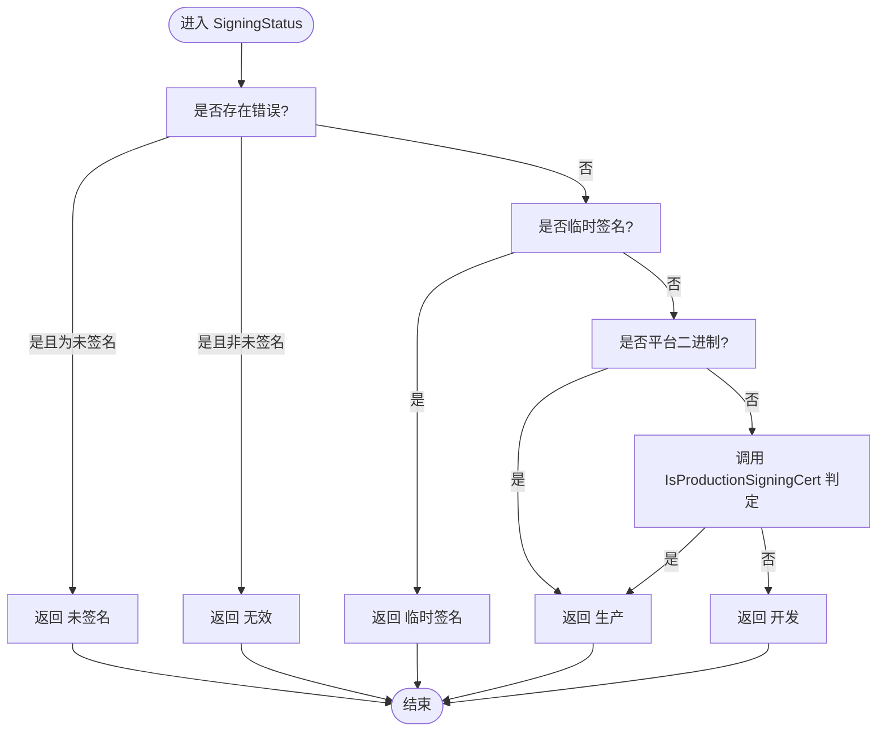
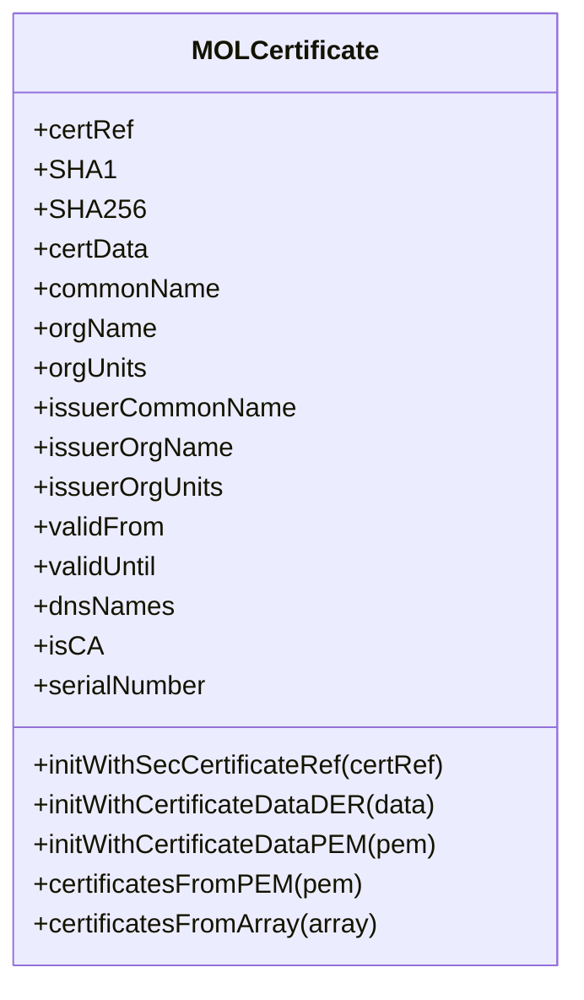
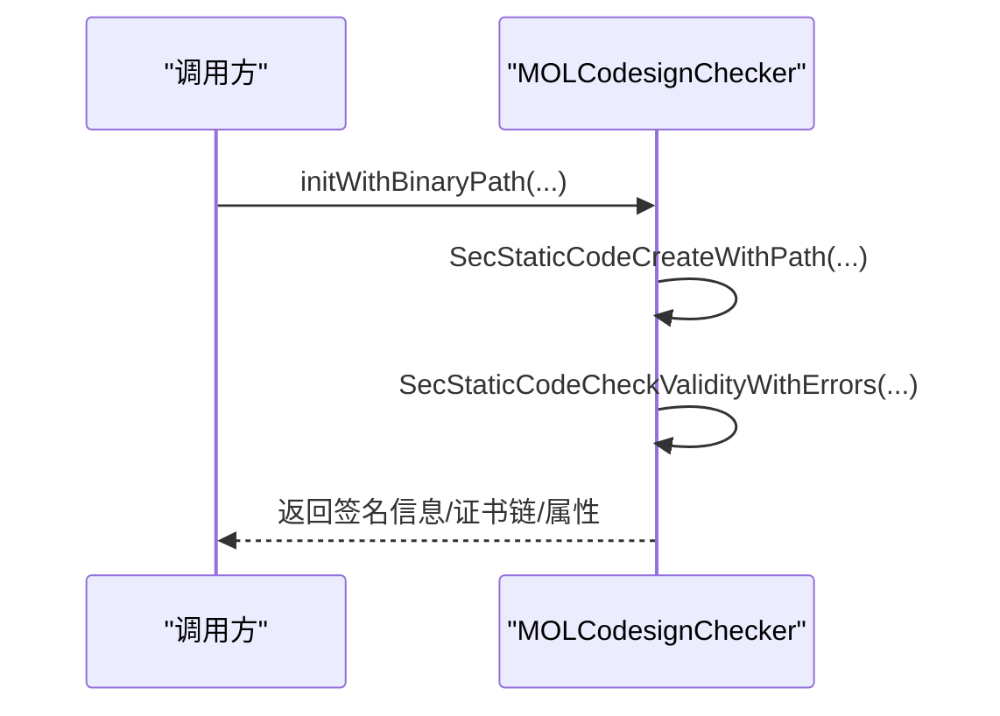
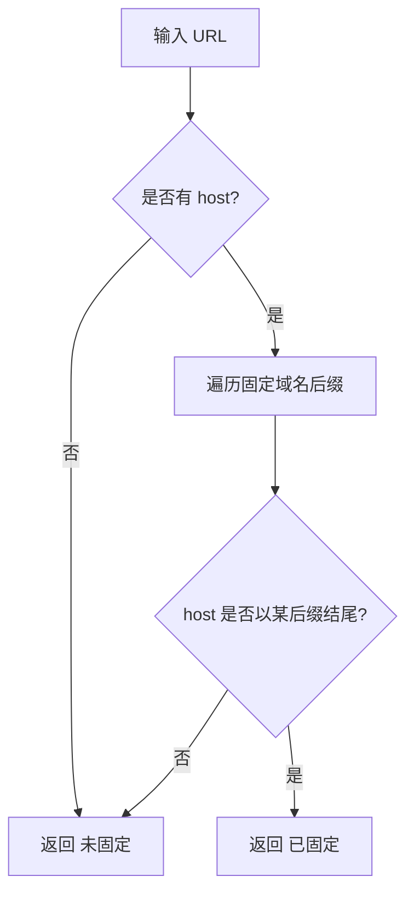
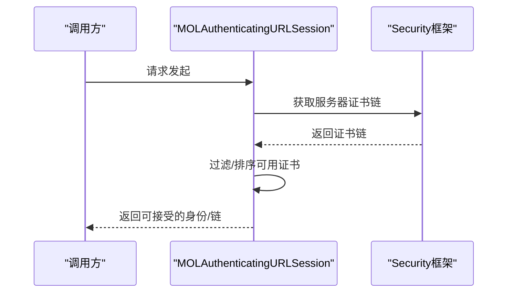
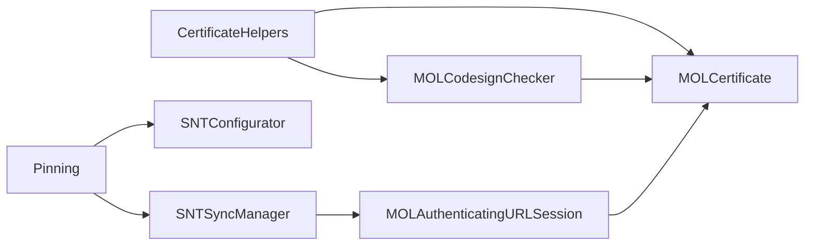

# 证书验证与固定

<cite>
**本文引用的文件**
- [CertificateHelpers.h](file://Source/common/CertificateHelpers.h)
- [CertificateHelpers.mm](file://Source/common/CertificateHelpers.mm)
- [Pinning.h](file://Source/common/Pinning.h)
- [Pinning.mm](file://Source/common/Pinning.mm)
- [MOLCertificate.h](file://Source/common/MOLCertificate.h)
- [MOLCertificate.mm](file://Source/common/MOLCertificate.mm)
- [MOLCodesignChecker.h](file://Source/common/MOLCodesignChecker.h)
- [MOLCodesignChecker.mm](file://Source/common/MOLCodesignChecker.mm)
- [SNTCommonEnums.h](file://Source/common/SNTCommonEnums.h)
- [MOLAuthenticatingURLSession.mm](file://Source/common/MOLAuthenticatingURLSession.mm)
- [SNTFileInfo.mm](file://Source/common/SNTFileInfo.mm)
- [SNTStoredExecutionEvent.mm](file://Source/common/SNTStoredExecutionEvent.mm)
- [SNTConfigurator.mm](file://Source/common/SNTConfigurator.mm)
- [SNTSyncManager.mm](file://Source/santasyncservice/SNTSyncManager.mm)
- [TemporaryMonitorMode.mm](file://Source/santad/TemporaryMonitorMode.mm)
</cite>

## 目录
1. [引言](#引言)
2. [项目结构](#项目结构)
3. [核心组件](#核心组件)
4. [架构总览](#架构总览)
5. [详细组件分析](#详细组件分析)
6. [依赖关系分析](#依赖关系分析)
7. [性能考量](#性能考量)
8. [故障排查指南](#故障排查指南)
9. [结论](#结论)
10. [附录](#附录)

## 引言
本文件面向Santa系统中的证书验证与固定机制，围绕以下目标展开：  
- 证书辅助工具（CertificateHelpers）的实现与使用，包括证书链解析、发布者信息生成、生产签名判定与代码签名状态判定。  
- 证书固定（Pinning）机制的工作原理，包括域名匹配策略、固定根证书集合的提供方式以及在同步服务中的应用。  
- 代码签名验证流程、证书信任链建立与中间证书处理。  
- 证书配置指南、验证失败的诊断方法与安全最佳实践。

## 项目结构
与证书验证与固定直接相关的模块主要集中在Source/common目录下，涉及证书对象封装、代码签名检查器、签名状态枚举、以及TLS客户端会话中对信任链与身份选择的处理。同步服务与守护进程在运行时根据配置决定是否启用证书固定，并在需要时注入固定根证书集合。

图示来源
- [CertificateHelpers.mm](file://Source/common/CertificateHelpers.mm#L22-L104)
- [MOLCertificate.mm](file://Source/common/MOLCertificate.mm#L1-L120)
- [MOLCodesignChecker.mm](file://Source/common/MOLCodesignChecker.mm#L81-L133)
- [Pinning.mm](file://Source/common/Pinning.mm#L29-L120)
- [MOLAuthenticatingURLSession.mm](file://Source/common/MOLAuthenticatingURLSession.mm#L236-L275)
- [SNTConfigurator.mm](file://Source/common/SNTConfigurator.mm#L1433-L1433)
- [SNTSyncManager.mm](file://Source/santasyncservice/SNTSyncManager.mm#L465-L467)
- [TemporaryMonitorMode.mm](file://Source/santad/TemporaryMonitorMode.mm#L123-L123)

章节来源
- [CertificateHelpers.h](file://Source/common/CertificateHelpers.h#L21-L68)
- [CertificateHelpers.mm](file://Source/common/CertificateHelpers.mm#L22-L104)
- [Pinning.h](file://Source/common/Pinning.h#L18-L30)
- [Pinning.mm](file://Source/common/Pinning.mm#L22-L120)
- [MOLCertificate.h](file://Source/common/MOLCertificate.h#L17-L138)
- [MOLCertificate.mm](file://Source/common/MOLCertificate.mm#L1-L120)
- [MOLCodesignChecker.h](file://Source/common/MOLCodesignChecker.h#L19-L110)
- [MOLCodesignChecker.mm](file://Source/common/MOLCodesignChecker.mm#L81-L133)
- [SNTCommonEnums.h](file://Source/common/SNTCommonEnums.h#L204-L210)

## 核心组件
- 证书辅助工具（CertificateHelpers）  
  - 发布者信息生成：根据叶子证书的CN/Organization等字段生成用户可读的发布者字符串。  
  - 证书链转换：将MOLCertificate数组转换为底层SecCertificateRef数组，便于与Security框架交互。  
  - 生产签名判定：通过查询证书扩展值来判断是否为生产签名证书（基于OID）。  
  - 签名状态判定：综合错误码、签名标志位与证书类型，返回签名状态枚举（未签名、无效、临时签名、开发、生产）。

- 证书对象封装（MOLCertificate）  
  - 提供对SecCertificateRef的只读属性访问，包括主题/颁发者信息、有效期、DNS名称、序列号、是否CA等。  
  - 计算证书数据的SHA-1与SHA-256指纹，支持从PEM/DER解析证书，缓存常用属性以提升性能。

- 代码签名检查器（MOLCodesignChecker）  
  - 验证二进制签名，提取签名信息、证书链、团队ID、签名ID、平台二进制标识、安全签名时间等。  
  - 支持对磁盘文件、运行中进程、自身进程进行签名验证；对通用二进制逐架构一致性校验。

- 证书固定（Pinning）  
  - 域名匹配：维护固定域名后缀列表，若请求主机满足后缀匹配则视为“已固定”。  
  - 固定根证书：在已固定域名场景下，向服务器提供一组预置的根证书PEM集合，用于TLS握手的信任锚。

- 运行时集成点  
  - 配置驱动：根据配置判断是否对特定URL启用固定。  
  - 同步服务：当启用固定时，将固定根证书注入到认证会话，强制使用白名单根证书完成TLS握手。  
  - 守护进程模式：在临时监控模式等路径中也受固定策略影响。

章节来源
- [CertificateHelpers.mm](file://Source/common/CertificateHelpers.mm#L22-L104)
- [MOLCertificate.mm](file://Source/common/MOLCertificate.mm#L300-L490)
- [MOLCodesignChecker.mm](file://Source/common/MOLCodesignChecker.mm#L81-L133)
- [Pinning.mm](file://Source/common/Pinning.mm#L22-L120)
- [SNTConfigurator.mm](file://Source/common/SNTConfigurator.mm#L1433-L1433)
- [SNTSyncManager.mm](file://Source/santasyncservice/SNTSyncManager.mm#L465-L467)
- [TemporaryMonitorMode.mm](file://Source/santad/TemporaryMonitorMode.mm#L123-L123)

## 架构总览
下图展示了证书验证与固定的端到端流程：从二进制签名验证、证书链解析，到TLS握手阶段的信任锚替换与固定策略生效。

图示来源
- [MOLCodesignChecker.mm](file://Source/common/MOLCodesignChecker.mm#L81-L133)
- [CertificateHelpers.mm](file://Source/common/CertificateHelpers.mm#L22-L104)
- [MOLCertificate.mm](file://Source/common/MOLCertificate.mm#L1-L120)
- [SNTConfigurator.mm](file://Source/common/SNTConfigurator.mm#L1433-L1433)
- [SNTSyncManager.mm](file://Source/santasyncservice/SNTSyncManager.mm#L465-L467)

## 详细组件分析

### 组件A：证书辅助工具（CertificateHelpers）
- 功能要点
  - 发布者信息生成：优先识别Apple Mac OS Application Signing（App Store）、Developer ID Application等常见场景，避免重复输出组织名与通用名。  
  - 证书链转换：将MOLCertificate数组映射为SecCertificateRef数组，便于后续与Security框架交互或传递给其他组件。  
  - 生产签名判定：通过查询证书扩展键集合（OID），判断是否为生产签名证书（如Mac App Store、Developer ID、iOS App Store、Apple自签等）。  
  - 签名状态判定：依据错误码（如未签名）、签名标志位（临时签名）、平台二进制标识与生产签名判定结果，返回统一的签名状态枚举。

图示来源
- [CertificateHelpers.mm](file://Source/common/CertificateHelpers.mm#L88-L104)
- [SNTCommonEnums.h](file://Source/common/SNTCommonEnums.h#L204-L210)

章节来源
- [CertificateHelpers.h](file://Source/common/CertificateHelpers.h#L21-L68)
- [CertificateHelpers.mm](file://Source/common/CertificateHelpers.mm#L22-L104)
- [SNTCommonEnums.h](file://Source/common/SNTCommonEnums.h#L204-L210)

### 组件B：证书对象封装（MOLCertificate）
- 功能要点
  - 属性访问：提供证书主题/颁发者信息、组织单位、DNS名称、有效期、序列号、是否CA等只读属性，并进行缓存以减少重复查询开销。  
  - 指纹计算：提供SHA-1与SHA-256指纹，便于规则匹配与快速比对。  
  - 解析能力：支持从PEM/DER解析单个或多个证书，内部使用Security框架接口获取底层数据。  
  - 编解码：实现NSSecureCoding协议，可在跨进程边界传输。

图示来源
- [MOLCertificate.h](file://Source/common/MOLCertificate.h#L17-L138)
- [MOLCertificate.mm](file://Source/common/MOLCertificate.mm#L300-L490)

章节来源
- [MOLCertificate.h](file://Source/common/MOLCertificate.h#L17-L138)
- [MOLCertificate.mm](file://Source/common/MOLCertificate.mm#L1-L120)
- [MOLCertificate.mm](file://Source/common/MOLCertificate.mm#L300-L490)

### 组件C：代码签名检查器（MOLCodesignChecker）
- 功能要点
  - 初始化与验证：支持从磁盘路径、进程PID、自身进程等多种来源初始化，执行签名验证并提取签名信息与证书链。  
  - 通用二进制一致性：对多架构通用二进制进行逐架构签名一致性检查，确保各架构签名一致。  
  - 关键属性：签名标志位、cdhash、团队ID、签名ID、平台二进制标识、授权信息、安全签名时间等。  
  - 错误处理：通过Security框架错误码生成NSError，便于上层统一处理。

图示来源
- [MOLCodesignChecker.mm](file://Source/common/MOLCodesignChecker.mm#L141-L173)
- [MOLCodesignChecker.mm](file://Source/common/MOLCodesignChecker.mm#L81-L133)

章节来源
- [MOLCodesignChecker.h](file://Source/common/MOLCodesignChecker.h#L19-L110)
- [MOLCodesignChecker.mm](file://Source/common/MOLCodesignChecker.mm#L81-L133)
- [MOLCodesignChecker.mm](file://Source/common/MOLCodesignChecker.mm#L141-L173)

### 组件D：证书固定（Pinning）
- 功能要点
  - 域名匹配：维护固定域名后缀列表，若请求主机满足后缀匹配则视为“已固定”。  
  - 固定根证书：在已固定域名场景下，向服务器提供一组预置的根证书PEM集合，用于TLS握手的信任锚。  
  - 运行时集成：配置模块在判断URL固定后，由同步管理器将固定根证书注入到认证会话，确保仅接受白名单根证书签发的链。

图示来源
- [Pinning.mm](file://Source/common/Pinning.mm#L22-L45)
- [Pinning.mm](file://Source/common/Pinning.mm#L46-L120)
- [SNTConfigurator.mm](file://Source/common/SNTConfigurator.mm#L1433-L1433)
- [SNTSyncManager.mm](file://Source/santasyncservice/SNTSyncManager.mm#L465-L467)

章节来源
- [Pinning.h](file://Source/common/Pinning.h#L18-L30)
- [Pinning.mm](file://Source/common/Pinning.mm#L22-L120)
- [SNTConfigurator.mm](file://Source/common/SNTConfigurator.mm#L1433-L1433)
- [SNTSyncManager.mm](file://Source/santasyncservice/SNTSyncManager.mm#L465-L467)

### 组件E：TLS信任链与客户端身份选择（MOLAuthenticatingURLSession）
- 功能要点
  - 信任链获取：从ProtectionSpace中提取服务器提供的证书链，转换为MOLCertificate数组以便进一步处理。  
  - 身份筛选：根据客户端证书的通用名、颁发者等属性，从可用证书中筛选出合适的SecIdentity，构建信任链。  
  - 与固定机制协同：当启用固定时，注入固定根证书集合，限制可接受的证书链必须由白名单根签发。

图示来源
- [MOLAuthenticatingURLSession.mm](file://Source/common/MOLAuthenticatingURLSession.mm#L236-L275)
- [MOLAuthenticatingURLSession.mm](file://Source/common/MOLAuthenticatingURLSession.mm#L392-L414)

章节来源
- [MOLAuthenticatingURLSession.mm](file://Source/common/MOLAuthenticatingURLSession.mm#L236-L275)
- [MOLAuthenticatingURLSession.mm](file://Source/common/MOLAuthenticatingURLSession.mm#L392-L414)

### 组件F：签名状态在系统中的使用
- SNTFileInfo与SNTStoredExecutionEvent在记录事件时会调用CertificateHelpers生成发布者信息与证书链，并使用SigningStatus确定签名状态，作为决策与审计依据。

章节来源
- [SNTFileInfo.mm](file://Source/common/SNTFileInfo.mm#L840-L840)
- [SNTStoredExecutionEvent.mm](file://Source/common/SNTStoredExecutionEvent.mm#L34-L44)
- [SNTStoredExecutionEvent.mm](file://Source/common/SNTStoredExecutionEvent.mm#L164-L168)

## 依赖关系分析
- 组件耦合
  - CertificateHelpers依赖MOLCodesignChecker与MOLCertificate，用于生成发布者信息、判定生产签名与签名状态。  
  - MOLCertificate依赖Security框架的证书接口，提供指纹与属性访问。  
  - MOLCodesignChecker依赖Security框架的静态/动态代码验证接口，负责签名验证与证书链提取。  
  - Pinning与运行时配置/同步管理器协作，在固定域名场景下注入固定根证书集合。  
  - MOLAuthenticatingURLSession在TLS握手阶段使用固定根证书集合，确保信任链符合白名单要求。

图示来源
- [CertificateHelpers.mm](file://Source/common/CertificateHelpers.mm#L22-L104)
- [MOLCodesignChecker.mm](file://Source/common/MOLCodesignChecker.mm#L81-L133)
- [MOLCertificate.mm](file://Source/common/MOLCertificate.mm#L1-L120)
- [Pinning.mm](file://Source/common/Pinning.mm#L22-L120)
- [SNTConfigurator.mm](file://Source/common/SNTConfigurator.mm#L1433-L1433)
- [SNTSyncManager.mm](file://Source/santasyncservice/SNTSyncManager.mm#L465-L467)
- [MOLAuthenticatingURLSession.mm](file://Source/common/MOLAuthenticatingURLSession.mm#L236-L275)

章节来源
- [CertificateHelpers.mm](file://Source/common/CertificateHelpers.mm#L22-L104)
- [MOLCodesignChecker.mm](file://Source/common/MOLCodesignChecker.mm#L81-L133)
- [MOLCertificate.mm](file://Source/common/MOLCertificate.mm#L1-L120)
- [Pinning.mm](file://Source/common/Pinning.mm#L22-L120)
- [SNTConfigurator.mm](file://Source/common/SNTConfigurator.mm#L1433-L1433)
- [SNTSyncManager.mm](file://Source/santasyncservice/SNTSyncManager.mm#L465-L467)
- [MOLAuthenticatingURLSession.mm](file://Source/common/MOLAuthenticatingURLSession.mm#L236-L275)

## 性能考量
- 属性缓存：MOLCertificate对常用属性采用memoized缓存，避免重复查询底层证书值，显著降低多次访问的开销。  
- 忽略资源校验：MOLCodesignChecker在静态代码验证时忽略资源校验并开启嵌套代码检查，大幅缩短验证耗时，同时保留网络不访问的约束。  
- 一次性证书链解析：CertificateHelpers在生成发布者信息与证书链转换时，尽量复用已有证书链，减少重复解析。  
- 固定根证书集合：Pinning在固定域名场景下集中提供固定根证书集合，避免每次握手都进行复杂信任链验证。

章节来源
- [MOLCertificate.mm](file://Source/common/MOLCertificate.mm#L172-L206)
- [MOLCodesignChecker.mm](file://Source/common/MOLCodesignChecker.mm#L31-L63)
- [CertificateHelpers.mm](file://Source/common/CertificateHelpers.mm#L22-L39)
- [Pinning.mm](file://Source/common/Pinning.mm#L46-L120)

## 故障排查指南
- 未签名或无效签名
  - 现象：签名状态为“未签名”或“无效”。  
  - 排查：确认二进制是否正确签名、签名标志位是否包含临时签名、是否为平台二进制；检查Security框架返回的错误码与错误描述。  
  - 参考：[MOLCodesignChecker.mm](file://Source/common/MOLCodesignChecker.mm#L81-L133)，[CertificateHelpers.mm](file://Source/common/CertificateHelpers.mm#L88-L104)

- 生产签名判定异常
  - 现象：IsProductionSigningCert返回与预期不符。  
  - 排查：确认证书扩展键集合是否包含目标OID、证书是否有效期内、是否为正确的根签发。  
  - 参考：[CertificateHelpers.mm](file://Source/common/CertificateHelpers.mm#L49-L86)

- 发布者信息显示异常
  - 现象：发布者字符串不符合预期。  
  - 排查：检查叶子证书的commonName与orgName是否为空、是否为App Store或Developer ID场景。  
  - 参考：[CertificateHelpers.mm](file://Source/common/CertificateHelpers.mm#L22-L48)

- TLS握手失败（固定域名）
  - 现象：对固定域名的HTTPS请求失败。  
  - 排查：确认配置已启用固定、固定根证书集合是否正确注入、服务器证书链是否由固定根签发。  
  - 参考：[SNTConfigurator.mm](file://Source/common/SNTConfigurator.mm#L1433-L1433)，[SNTSyncManager.mm](file://Source/santasyncservice/SNTSyncManager.mm#L465-L467)，[MOLAuthenticatingURLSession.mm](file://Source/common/MOLAuthenticatingURLSession.mm#L236-L275)

- 中间证书处理问题
  - 现象：信任链中缺少中间证书导致握手失败。  
  - 排查：确认服务器返回的证书链是否包含完整链，必要时在客户端侧补充中间证书或调整固定根集合。  
  - 参考：[MOLAuthenticatingURLSession.mm](file://Source/common/MOLAuthenticatingURLSession.mm#L236-L275)

章节来源
- [MOLCodesignChecker.mm](file://Source/common/MOLCodesignChecker.mm#L81-L133)
- [CertificateHelpers.mm](file://Source/common/CertificateHelpers.mm#L22-L104)
- [SNTConfigurator.mm](file://Source/common/SNTConfigurator.mm#L1433-L1433)
- [SNTSyncManager.mm](file://Source/santasyncservice/SNTSyncManager.mm#L465-L467)
- [MOLAuthenticatingURLSession.mm](file://Source/common/MOLAuthenticatingURLSession.mm#L236-L275)

## 结论
Santa系统的证书验证与固定机制通过“签名验证 + 证书链解析 + 信任链建立 + 证书固定”的组合，实现了对二进制与网络通信的双重安全保障。CertificateHelpers与MOLCodesignChecker负责签名与证书链的解析与判定，MOLCertificate提供高效的证书属性访问与指纹计算，Pinning在固定域名场景下通过固定根证书集合强化TLS信任链。整体设计兼顾安全性与性能，适合在生产环境中部署与运维。

## 附录

### 证书配置指南
- 启用证书固定  
  - 在配置中指定同步基础URL，若该URL满足固定域名后缀，则自动启用固定策略。  
  - 参考：[SNTConfigurator.mm](file://Source/common/SNTConfigurator.mm#L1433-L1433)，[Pinning.mm](file://Source/common/Pinning.mm#L22-L45)

- 注入固定根证书  
  - 当启用固定时，同步管理器将固定根证书PEM集合注入到认证会话，确保仅接受白名单根签发的链。  
  - 参考：[Pinning.mm](file://Source/common/Pinning.mm#L46-L120)，[SNTSyncManager.mm](file://Source/santasyncservice/SNTSyncManager.mm#L465-L467)

- 证书指纹与规则匹配  
  - 使用MOLCertificate的SHA-256指纹作为规则标识，结合签名状态与发布者信息进行策略匹配。  
  - 参考：[MOLCertificate.mm](file://Source/common/MOLCertificate.mm#L320-L343)，[SNTStoredExecutionEvent.mm](file://Source/common/SNTStoredExecutionEvent.mm#L164-L168)

### 安全最佳实践
- 仅对可信域名启用固定，避免影响正常业务流量。  
- 定期轮换固定根证书集合，确保覆盖新的根证书与到期证书。  
- 对签名状态进行严格区分，避免将“开发/临时签名”误判为“生产签名”。  
- 在日志与审计中记录签名状态与证书指纹，便于追踪与取证。  

[无须章节来源：本节为通用建议]