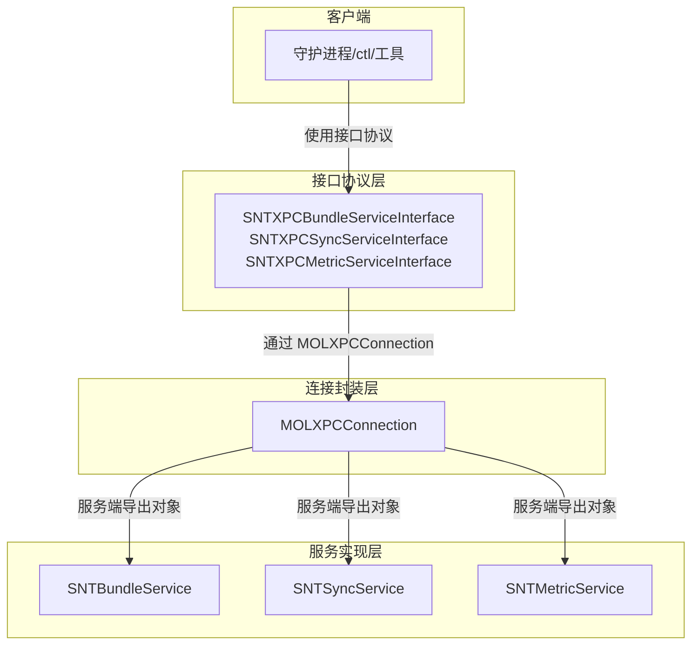
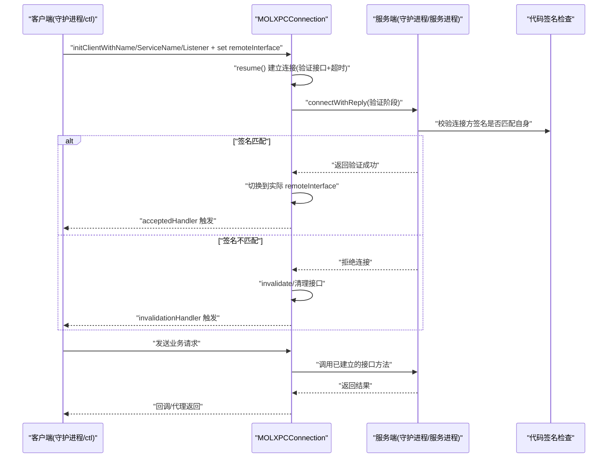
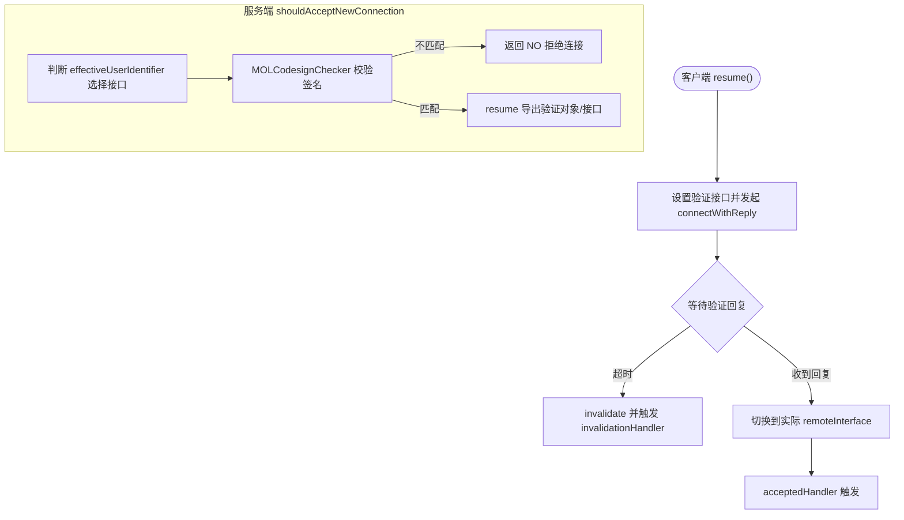
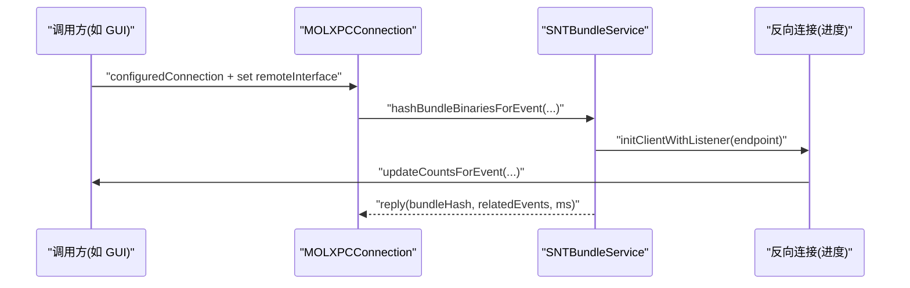
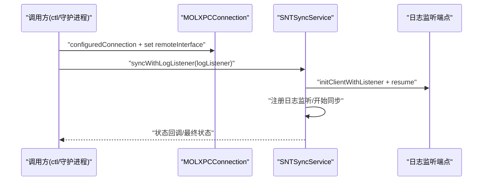
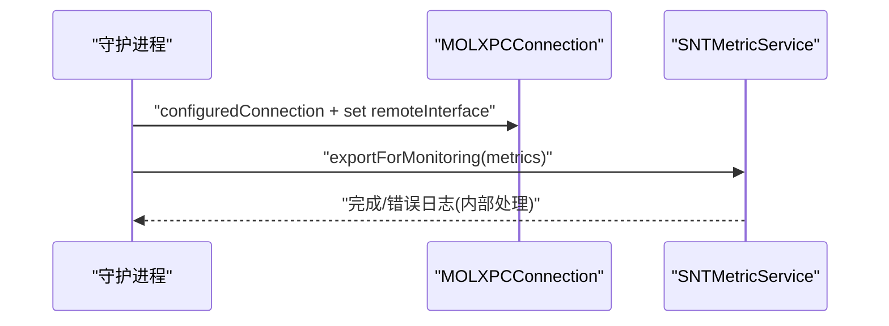
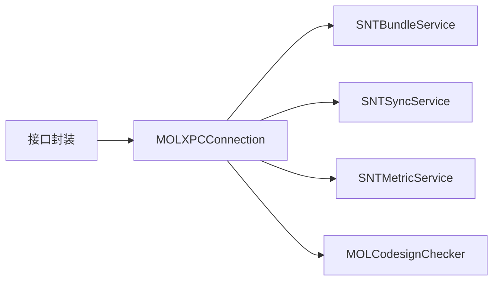

# 通信安全与认证

<cite>
**本文引用的文件**
- [MOLXPCConnection.h](file://Source/common/MOLXPCConnection.h)
- [MOLXPCConnection.mm](file://Source/common/MOLXPCConnection.mm)
- [MOLXPCConnectionTest.mm](file://Source/common/MOLXPCConnectionTest.mm)
- [SNTXPCBundleServiceInterface.h](file://Source/common/SNTXPCBundleServiceInterface.h)
- [SNTXPCBundleServiceInterface.mm](file://Source/common/SNTXPCBundleServiceInterface.mm)
- [SNTBundleService.h](file://Source/santabundleservice/SNTBundleService.h)
- [SNTBundleService.mm](file://Source/santabundleservice/SNTBundleService.mm)
- [SNTXPCSyncServiceInterface.h](file://Source/common/SNTXPCSyncServiceInterface.h)
- [SNTXPCSyncServiceInterface.mm](file://Source/common/SNTXPCSyncServiceInterface.mm)
- [SNTSyncService.h](file://Source/santasyncservice/SNTSyncService.h)
- [SNTSyncService.mm](file://Source/santasyncservice/SNTSyncService.mm)
- [SNTXPCMetricServiceInterface.h](file://Source/common/SNTXPCMetricServiceInterface.h)
- [SNTXPCMetricServiceInterface.mm](file://Source/common/SNTXPCMetricServiceInterface.mm)
- [SNTMetricService.h](file://Source/santametricservice/SNTMetricService.h)
- [SNTMetricService.mm](file://Source/santametricservice/SNTMetricService.mm)
</cite>

## 目录
1. [引言](#引言)
2. [项目结构](#项目结构)
3. [核心组件](#核心组件)
4. [架构总览](#架构总览)
5. [组件详解](#组件详解)
6. [依赖关系分析](#依赖关系分析)
7. [性能考量](#性能考量)
8. [故障排查指南](#故障排查指南)
9. [结论](#结论)

## 引言
本文件聚焦 Santa 系统的通信安全与认证机制，围绕 XPC 进程间通信展开，系统性说明以下方面：
- 进程间通信的认证、授权与加密策略
- MOLXPCConnection 连接管理器的安全特性（连接验证、消息完整性保护、会话管理）
- 不同服务组件（守护进程、同步服务、指标服务）之间的通信安全策略
- XPC 接口的安全配置、通信拦截防护与认证失败处理
- 通信安全的调试方法与常见问题的解决思路

## 项目结构
Santa 的 XPC 通信以“接口协议 + 连接封装 + 服务实现”的分层方式组织：
- 接口协议层：定义跨进程调用的方法签名与参数类型约束
- 连接封装层：MOLXPCConnection 提供统一的连接建立、验证、失效处理与超时控制
- 服务实现层：各服务组件在守护进程中以 exportedObject 暴露接口，客户端通过 configuredConnection 获取已配置的连接

图表来源
- [MOLXPCConnection.h](file://Source/common/MOLXPCConnection.h#L1-L164)
- [MOLXPCConnection.mm](file://Source/common/MOLXPCConnection.mm#L1-L239)
- [SNTXPCBundleServiceInterface.h](file://Source/common/SNTXPCBundleServiceInterface.h#L1-L77)
- [SNTXPCSyncServiceInterface.h](file://Source/common/SNTXPCSyncServiceInterface.h#L1-L100)
- [SNTXPCMetricServiceInterface.h](file://Source/common/SNTXPCMetricServiceInterface.h#L1-L52)
- [SNTBundleService.h](file://Source/santabundleservice/SNTBundleService.h#L1-L21)
- [SNTSyncService.h](file://Source/santasyncservice/SNTSyncService.h#L1-L21)
- [SNTMetricService.h](file://Source/santametricservice/SNTMetricService.h#L1-L21)

章节来源
- [MOLXPCConnection.h](file://Source/common/MOLXPCConnection.h#L1-L164)
- [MOLXPCConnection.mm](file://Source/common/MOLXPCConnection.mm#L1-L239)
- [SNTXPCBundleServiceInterface.h](file://Source/common/SNTXPCBundleServiceInterface.h#L1-L77)
- [SNTXPCSyncServiceInterface.h](file://Source/common/SNTXPCSyncServiceInterface.h#L1-L100)
- [SNTXPCMetricServiceInterface.h](file://Source/common/SNTXPCMetricServiceInterface.h#L1-L52)
- [SNTBundleService.h](file://Source/santabundleservice/SNTBundleService.h#L1-L21)
- [SNTSyncService.h](file://Source/santasyncservice/SNTSyncService.h#L1-L21)
- [SNTMetricService.h](file://Source/santametricservice/SNTMetricService.h#L1-L21)

## 核心组件
- MOLXPCConnection：对 NSXPCListener/NSXPCConnection 的封装，提供强一致的连接建立流程、代码签名验证、权限分离接口、超时与失效处理等安全能力
- 各服务接口封装：SNTXPCBundleServiceInterface、SNTXPCSyncServiceInterface、SNTXPCMetricServiceInterface，负责生成安全的 NSXPCInterface 并提供预配置的 MOLXPCConnection
- 服务实现：SNTBundleService、SNTSyncService、SNTMetricService，分别暴露对应协议方法，执行业务逻辑

章节来源
- [MOLXPCConnection.h](file://Source/common/MOLXPCConnection.h#L1-L164)
- [MOLXPCConnection.mm](file://Source/common/MOLXPCConnection.mm#L1-L239)
- [SNTXPCBundleServiceInterface.mm](file://Source/common/SNTXPCBundleServiceInterface.mm#L1-L46)
- [SNTXPCSyncServiceInterface.mm](file://Source/common/SNTXPCSyncServiceInterface.mm#L1-L49)
- [SNTXPCMetricServiceInterface.mm](file://Source/common/SNTXPCMetricServiceInterface.mm#L1-L43)
- [SNTBundleService.mm](file://Source/santabundleservice/SNTBundleService.mm#L1-L284)
- [SNTSyncService.mm](file://Source/santasyncservice/SNTSyncService.mm#L1-L249)
- [SNTMetricService.mm](file://Source/santametricservice/SNTMetricService.mm#L1-L130)

## 架构总览
下图展示 Santa 各组件通过 XPC 交互的整体流程与安全边界：

图表来源
- [MOLXPCConnection.mm](file://Source/common/MOLXPCConnection.mm#L114-L202)
- [SNTXPCBundleServiceInterface.mm](file://Source/common/SNTXPCBundleServiceInterface.mm#L34-L43)
- [SNTXPCSyncServiceInterface.mm](file://Source/common/SNTXPCSyncServiceInterface.mm#L37-L46)
- [SNTXPCMetricServiceInterface.mm](file://Source/common/SNTXPCMetricServiceInterface.mm#L31-L40)

## 组件详解

### MOLXPCConnection：连接安全与会话管理
- 连接建立流程
  - 客户端在 resume() 中先将 remoteObjectInterface 设为“验证接口”，发送 connectWithReply，收到回复后再切换到实际 remoteInterface，并设置 acceptedHandler
  - 服务端 listener 回调中，先根据 effectiveUserIdentifier 选择特权或非特权接口，再进行代码签名验证，通过后才允许客户端继续
- 认证与授权
  - 代码签名验证：通过 MOLCodesignChecker 对连接进程的签名信息进行匹配校验，仅接受来自同一签名的进程
  - 权限分离：root 用户使用 privilegedInterface，普通用户使用 unprivilegedInterface，避免越权访问
- 加密与完整性
  - XPC 通道本身基于内核安全模型；结合签名验证与接口隔离，确保消息来源可信与目标接口正确
- 会话管理
  - 超时控制：客户端建立连接有固定超时上限，超时则主动 invalidate，避免阻塞
  - 失效处理：interruptionHandler/invalidationHandler 统一清理 remoteObjectInterface，防止误用代理
  - 远程错误处理：remoteObjectProxy/synchronousRemoteObjectProxy 在错误时触发 invalidate，保证状态一致性

图表来源
- [MOLXPCConnection.mm](file://Source/common/MOLXPCConnection.mm#L114-L202)

章节来源
- [MOLXPCConnection.h](file://Source/common/MOLXPCConnection.h#L54-L154)
- [MOLXPCConnection.mm](file://Source/common/MOLXPCConnection.mm#L114-L202)

### Bundle 服务：跨进程二进制哈希与进度回传
- 安全要点
  - 服务端通过 SNTBundleServiceXPC 协议暴露方法，客户端使用 SNTXPCBundleServiceInterface 配置连接
  - 服务端在处理过程中可回传进度至客户端，使用独立的 SNTBundleServiceProgressXPC 接口，确保回调链路受控
- 通信路径
  - 客户端通过 configuredConnection 获取已配置的 MOLXPCConnection，设置 remoteInterface 后 resume
  - 服务端在 exportedObject 上实现协议方法，内部建立反向连接用于进度通知

图表来源
- [SNTXPCBundleServiceInterface.mm](file://Source/common/SNTXPCBundleServiceInterface.mm#L34-L43)
- [SNTBundleService.mm](file://Source/santabundleservice/SNTBundleService.mm#L49-L115)

章节来源
- [SNTXPCBundleServiceInterface.h](file://Source/common/SNTXPCBundleServiceInterface.h#L1-L77)
- [SNTXPCBundleServiceInterface.mm](file://Source/common/SNTXPCBundleServiceInterface.mm#L1-L46)
- [SNTBundleService.mm](file://Source/santabundleservice/SNTBundleService.mm#L1-L284)

### 同步服务：事件上传与日志回传
- 安全要点
  - 使用 SNTXPCSyncServiceInterface 配置连接，服务端实现 SNTSyncServiceXPC 协议
  - 支持用户发起同步时通过 NSXPCListenerEndpoint 将日志回传给调用方，使用 SNTSyncServiceLogReceiverXPC 接口
- 通信路径
  - 客户端发起 syncWithLogListener，服务端建立反向连接并注册到广播器，期间通过回调推送日志
  - 事件上传与遥测导出通过专用方法完成，数据传输由服务端自行处理（例如 HTTP 导出）

图表来源
- [SNTXPCSyncServiceInterface.h](file://Source/common/SNTXPCSyncServiceInterface.h#L1-L100)
- [SNTSyncService.mm](file://Source/santasyncservice/SNTSyncService.mm#L168-L185)

章节来源
- [SNTXPCSyncServiceInterface.h](file://Source/common/SNTXPCSyncServiceInterface.h#L1-L100)
- [SNTXPCSyncServiceInterface.mm](file://Source/common/SNTXPCSyncServiceInterface.mm#L1-L49)
- [SNTSyncService.mm](file://Source/santasyncservice/SNTSyncService.mm#L1-L249)

### 指标服务：监控指标导出
- 安全要点
  - 使用 SNTXPCMetricServiceInterface 配置连接，服务端实现 SNTMetricServiceXPC 协议
  - 服务端根据配置选择输出格式与写入器（文件/HTTP），并在导出前进行格式化与校验
- 通信路径
  - 守护进程侧定时或按需调用指标服务，服务端将格式化后的数据写入目标位置

图表来源
- [SNTXPCMetricServiceInterface.mm](file://Source/common/SNTXPCMetricServiceInterface.mm#L31-L40)
- [SNTMetricService.mm](file://Source/santametricservice/SNTMetricService.mm#L94-L128)

章节来源
- [SNTXPCMetricServiceInterface.h](file://Source/common/SNTXPCMetricServiceInterface.h#L1-L52)
- [SNTXPCMetricServiceInterface.mm](file://Source/common/SNTXPCMetricServiceInterface.mm#L1-L43)
- [SNTMetricService.mm](file://Source/santametricservice/SNTMetricService.mm#L1-L130)

### 认证失败与拦截防护
- 测试覆盖
  - 单元测试验证了“签名不匹配即拒绝连接”“连接建立超时即失效”“连接中断/失效的处理”等关键行为
- 实现要点
  - 服务端在 shouldAcceptNewConnection 中进行签名匹配与接口选择，不满足条件直接拒绝
  - 客户端在 resume() 中设置验证接口并等待验证回复，超时或失败均触发 invalidationHandler，避免悬挂状态

章节来源
- [MOLXPCConnectionTest.mm](file://Source/common/MOLXPCConnectionTest.mm#L83-L145)
- [MOLXPCConnection.mm](file://Source/common/MOLXPCConnection.mm#L159-L202)

## 依赖关系分析
- 组件耦合
  - 接口封装层与连接封装层低耦合：接口仅定义协议与类型，连接封装统一处理安全细节
  - 服务实现层依赖连接封装与接口协议，不直接关心底层 XPC 细节
- 外部依赖
  - 代码签名验证依赖 MOLCodesignChecker
  - 指标服务的 HTTP 导出依赖系统网络栈（此处为服务端行为，不在本文件展开）

图表来源
- [MOLXPCConnection.mm](file://Source/common/MOLXPCConnection.mm#L1-L239)
- [SNTBundleService.mm](file://Source/santabundleservice/SNTBundleService.mm#L1-L284)
- [SNTSyncService.mm](file://Source/santasyncservice/SNTSyncService.mm#L1-L249)
- [SNTMetricService.mm](file://Source/santametricservice/SNTMetricService.mm#L1-L130)

章节来源
- [MOLXPCConnection.mm](file://Source/common/MOLXPCConnection.mm#L1-L239)
- [SNTBundleService.mm](file://Source/santabundleservice/SNTBundleService.mm#L1-L284)
- [SNTSyncService.mm](file://Source/santasyncservice/SNTSyncService.mm#L1-L249)
- [SNTMetricService.mm](file://Source/santametricservice/SNTMetricService.mm#L1-L130)

## 性能考量
- 连接建立超时：客户端在 resume() 中设置固定超时，避免长时间阻塞
- 反向连接与进度回传：服务端在处理耗时任务时通过独立连接回传进度，避免阻塞主业务接口
- 并发与队列：服务端多处使用全局并发队列处理大体量计算（如批量二进制扫描、哈希计算），合理分配 CPU 资源
- 日志与导出：指标服务按配置选择输出方式，避免不必要的 IO 或网络开销

## 故障排查指南
- 连接未建立或频繁失效
  - 检查客户端是否设置了正确的 remoteInterface 与 acceptedHandler/invalidationHandler
  - 关注服务端是否在 shouldAcceptNewConnection 中因签名不匹配而拒绝
  - 观察是否存在超时导致的自动失效
- 认证失败
  - 确认连接进程与本地组件签名一致（MOLCodesignChecker 匹配）
  - 核对 effectiveUserIdentifier 与接口选择是否符合预期（root 使用特权接口）
- 进度回传异常
  - 确认反向连接 endpoint 是否有效，remoteInterface 是否为进度协议
  - 检查 invalidationHandler 是否被触发导致连接提前关闭
- 指标导出失败
  - 查看服务端日志与错误码，确认格式化与写入器配置是否正确
  - 若为 HTTP 导出，检查目标 URL 与网络可达性

章节来源
- [MOLXPCConnection.mm](file://Source/common/MOLXPCConnection.mm#L114-L202)
- [SNTBundleService.mm](file://Source/santabundleservice/SNTBundleService.mm#L49-L115)
- [SNTMetricService.mm](file://Source/santametricservice/SNTMetricService.mm#L94-L128)

## 结论
Santa 的 XPC 通信安全体系以“签名验证 + 权限分离 + 明确的连接生命周期管理”为核心，MOLXPCConnection 在连接建立、超时与失效处理上提供了统一且健壮的安全边界。各服务通过接口封装与预配置连接，既保证了功能解耦，也强化了跨进程通信的可信性与稳定性。建议在部署与集成中：
- 严格保持组件签名一致性
- 明确区分特权与非特权接口
- 正确设置与响应 acceptedHandler/invalidationHandler
- 对耗时操作采用反向连接回传进度，提升可观测性与用户体验