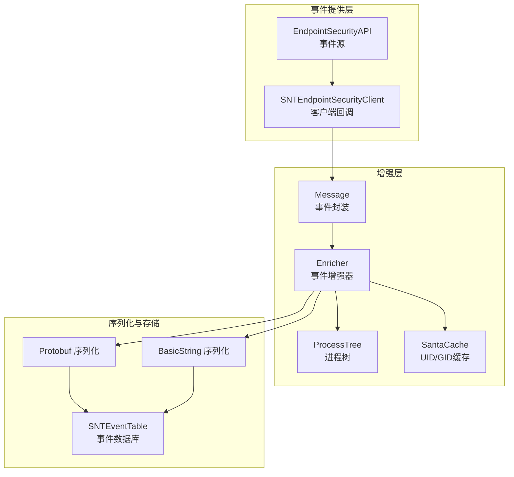
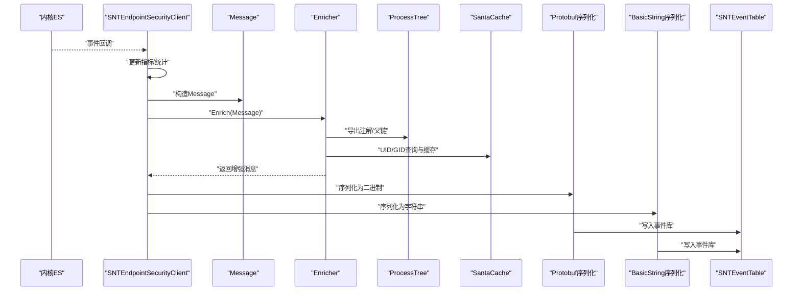
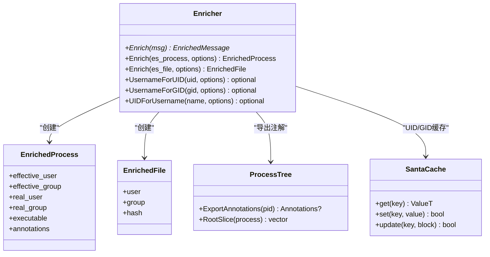
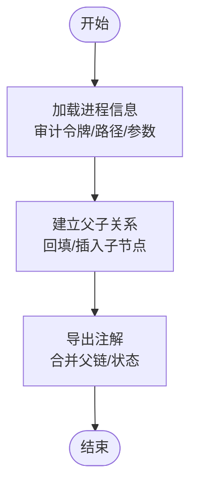
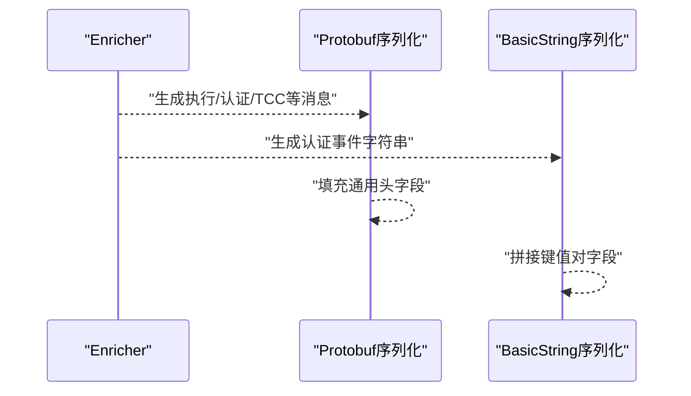
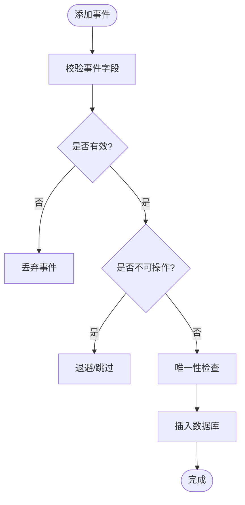
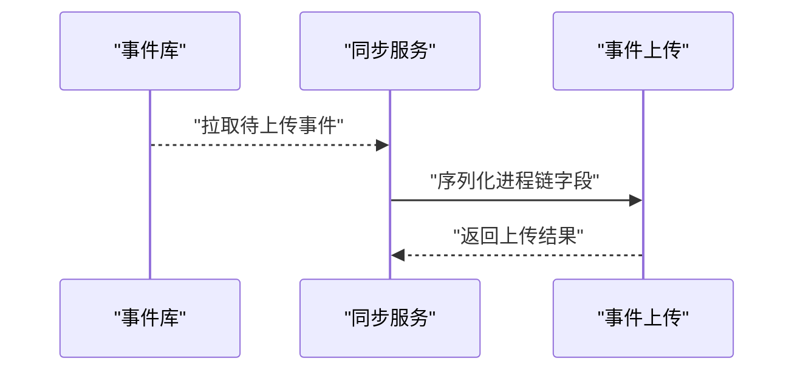
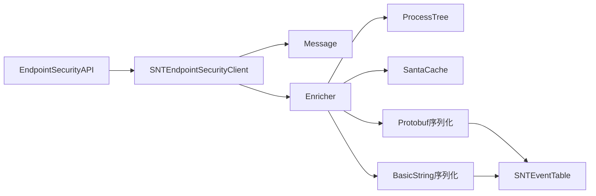

# 事件增强流程

<cite>
**本文引用的文件**
- [Enricher.h](file://Source/santad/EventProviders/EndpointSecurity/Enricher.h)
- [Enricher.mm](file://Source/santad/EventProviders/EndpointSecurity/Enricher.mm)
- [EnrichedTypes.h](file://Source/santad/EventProviders/EndpointSecurity/EnrichedTypes.h)
- [Message.h](file://Source/santad/EventProviders/EndpointSecurity/Message.h)
- [process_tree.h](file://Source/santad/ProcessTree/process_tree.h)
- [process_tree_macos.mm](file://Source/santad/ProcessTree/process_tree_macos.mm)
- [SantaCache.h](file://Source/common/SantaCache.h)
- [SNTStoredExecutionEvent.h](file://Source/common/SNTStoredExecutionEvent.h)
- [SNTStoredFileAccessEvent.h](file://Source/common/SNTStoredFileAccessEvent.h)
- [SNTEventTable.mm](file://Source/santad/DataLayer/SNTEventTable.mm)
- [Protobuf.mm](file://Source/santad/Logs/EndpointSecurity/Serializers/Protobuf.mm)
- [BasicString.mm](file://Source/santad/Logs/EndpointSecurity/Serializers/BasicString.mm)
- [SNTEndpointSecurityClient.mm](file://Source/santad/EventProviders/SNTEndpointSecurityClient.mm)
- [SNTExecutionController.mm](file://Source/santad/SNTExecutionController.mm)
- [SNTSyncEventUpload.mm](file://Source/santasyncservice/SNTSyncEventUpload.mm)
</cite>

## 目录
1. [引言](#引言)
2. [项目结构](#项目结构)
3. [核心组件](#核心组件)
4. [架构总览](#架构总览)
5. [详细组件分析](#详细组件分析)
6. [依赖关系分析](#依赖关系分析)
7. [性能考量](#性能考量)
8. [故障排查指南](#故障排查指南)
9. [结论](#结论)
10. [附录](#附录)

## 引言
本文件面向Santa系统中的“事件增强流程”，系统性说明从原始内核事件到增强后事件的完整数据丰富与上下文补充过程。重点覆盖以下方面：
- 进程链构建：通过进程树导出注解，形成可追溯的进程调用链。
- 文件信息获取：基于文件统计信息与可选哈希，补充文件归属与属性。
- 用户身份识别：通过UID/GID缓存与本地查询，映射用户名与组名。
- 增强算法与数据来源：事件类型分发、增强选项（默认/仅本地）、缓存策略。
- 数据结构变化：原始ES事件到增强消息再到序列化输出的字段扩展。
- 并发处理、错误恢复与调试支持：锁粒度、异常路径、指标与日志。
- 事件增强流程图与数据转换示例。

## 项目结构
事件增强位于santad子系统中，围绕EndpointSecurity事件提供者展开，涉及事件接收、增强、序列化与持久化等模块。

图表来源
- [SNTEndpointSecurityClient.mm](file://Source/santad/EventProviders/SNTEndpointSecurityClient.mm#L129-L152)
- [Message.h](file://Source/santad/EventProviders/EndpointSecurity/Message.h#L30-L94)
- [Enricher.mm](file://Source/santad/EventProviders/EndpointSecurity/Enricher.mm#L40-L195)
- [process_tree.h](file://Source/santad/ProcessTree/process_tree.h#L34-L109)
- [SantaCache.h](file://Source/common/SantaCache.h#L48-L113)
- [Protobuf.mm](file://Source/santad/Logs/EndpointSecurity/Serializers/Protobuf.mm#L410-L548)
- [BasicString.mm](file://Source/santad/Logs/EndpointSecurity/Serializers/BasicString.mm#L702-L744)
- [SNTEventTable.mm](file://Source/santad/DataLayer/SNTEventTable.mm#L107-L173)

章节来源
- [SNTEndpointSecurityClient.mm](file://Source/santad/EventProviders/SNTEndpointSecurityClient.mm#L129-L152)
- [Message.h](file://Source/santad/EventProviders/EndpointSecurity/Message.h#L30-L94)
- [Enricher.h](file://Source/santad/EventProviders/EndpointSecurity/Enricher.h#L26-L73)
- [Enricher.mm](file://Source/santad/EventProviders/EndpointSecurity/Enricher.mm#L40-L195)
- [process_tree.h](file://Source/santad/ProcessTree/process_tree.h#L34-L109)
- [SantaCache.h](file://Source/common/SantaCache.h#L48-L113)
- [Protobuf.mm](file://Source/santad/Logs/EndpointSecurity/Serializers/Protobuf.mm#L410-L548)
- [BasicString.mm](file://Source/santad/Logs/EndpointSecurity/Serializers/BasicString.mm#L702-L744)
- [SNTEventTable.mm](file://Source/santad/DataLayer/SNTEventTable.mm#L107-L173)

## 核心组件
- 事件增强器（Enricher）：根据事件类型分派，对进程、文件、用户等进行增强，并可选择仅使用本地信息避免外部触发。
- 进程树（ProcessTree）：维护系统进程拓扑，导出注解（如父链、标注状态），用于构建进程链。
- 缓存（SantaCache）：对UID/GID到用户名/组名的映射进行缓存，降低查询开销。
- 消息封装（Message）：对底层ES消息进行轻量封装，提供便捷访问与路径目标枚举。
- 序列化（Protobuf/BasicString）：将增强后的事件转为二进制或字符串格式，便于上报与日志记录。
- 存储（SNTEventTable）：事件入库、去重与查询，保障数据完整性与一致性。

章节来源
- [Enricher.h](file://Source/santad/EventProviders/EndpointSecurity/Enricher.h#L26-L73)
- [Enricher.mm](file://Source/santad/EventProviders/EndpointSecurity/Enricher.mm#L197-L281)
- [process_tree.h](file://Source/santad/ProcessTree/process_tree.h#L34-L109)
- [SantaCache.h](file://Source/common/SantaCache.h#L48-L113)
- [Message.h](file://Source/santad/EventProviders/EndpointSecurity/Message.h#L30-L94)
- [Protobuf.mm](file://Source/santad/Logs/EndpointSecurity/Serializers/Protobuf.mm#L410-L548)
- [BasicString.mm](file://Source/santad/Logs/EndpointSecurity/Serializers/BasicString.mm#L702-L744)
- [SNTEventTable.mm](file://Source/santad/DataLayer/SNTEventTable.mm#L107-L173)

## 架构总览
事件从内核EndpointSecurity到达santad后，经由客户端回调进入增强流程，随后序列化并持久化。下图展示端到端的关键交互。

图表来源
- [SNTEndpointSecurityClient.mm](file://Source/santad/EventProviders/SNTEndpointSecurityClient.mm#L129-L152)
- [Message.h](file://Source/santad/EventProviders/EndpointSecurity/Message.h#L30-L94)
- [Enricher.mm](file://Source/santad/EventProviders/EndpointSecurity/Enricher.mm#L40-L195)
- [process_tree.h](file://Source/santad/ProcessTree/process_tree.h#L84-L109)
- [SantaCache.h](file://Source/common/SantaCache.h#L84-L113)
- [Protobuf.mm](file://Source/santad/Logs/EndpointSecurity/Serializers/Protobuf.mm#L410-L548)
- [BasicString.mm](file://Source/santad/Logs/EndpointSecurity/Serializers/BasicString.mm#L702-L744)
- [SNTEventTable.mm](file://Source/santad/DataLayer/SNTEventTable.mm#L107-L173)

## 详细组件分析

### 组件A：事件增强器（Enricher）
- 职责
  - 将原始ES事件按类型分派到对应的增强消息类型。
  - 对进程、文件、用户进行增强，必要时查询系统信息并缓存结果。
  - 可通过“仅本地”选项避免触发外部工作，降低延迟与副作用。
- 关键点
  - 进程增强：提取有效/真实UID/GID，映射用户名/组名；附加可执行文件信息；导出进程树注解（父链等）。
  - 文件增强：基于stat填充属主/属组；可选哈希（当前未启用）。
  - 用户增强：UID/GID到名称的缓存命中优先；未命中则本地查询；支持“仅本地”模式直接返回空值。
  - 事件类型：覆盖exec、fork、exit、rename、link、unlink、clone、copyfile、authentication、login/session、screen sharing、openssh、gatekeeper override、tcc modification等。
- 复杂度与性能
  - 查询UID/GID采用O(1)哈希表缓存；缓存满时整体清空以保证容量上限。
  - 进程树注解导出为协议缓冲注解，避免重复扫描。
- 错误处理
  - 未知事件类型会记录严重日志并终止，防止静默失败。
  - “仅本地”模式下不触发外部查询，返回空可选值。

图表来源
- [Enricher.h](file://Source/santad/EventProviders/EndpointSecurity/Enricher.h#L26-L73)
- [Enricher.mm](file://Source/santad/EventProviders/EndpointSecurity/Enricher.mm#L197-L281)
- [EnrichedTypes.h](file://Source/santad/EventProviders/EndpointSecurity/EnrichedTypes.h#L37-L135)
- [process_tree.h](file://Source/santad/ProcessTree/process_tree.h#L84-L109)
- [SantaCache.h](file://Source/common/SantaCache.h#L84-L113)

章节来源
- [Enricher.h](file://Source/santad/EventProviders/EndpointSecurity/Enricher.h#L26-L73)
- [Enricher.mm](file://Source/santad/EventProviders/EndpointSecurity/Enricher.mm#L40-L195)
- [EnrichedTypes.h](file://Source/santad/EventProviders/EndpointSecurity/EnrichedTypes.h#L37-L135)
- [process_tree.h](file://Source/santad/ProcessTree/process_tree.h#L84-L109)
- [SantaCache.h](file://Source/common/SantaCache.h#L84-L113)

### 组件B：进程树与注解导出
- 职责
  - 维护系统进程树，支持回填、fork/exec/exit事件处理。
  - 提供注解导出接口，将进程链与状态合并为协议缓冲注解。
- 关键点
  - 通过审计令牌获取PID与版本，加载进程路径与参数。
  - 使用时间戳去重与保留机制，确保异步处理场景下的稳定性。
- 性能
  - 基于哈希表与锁分桶，支持高并发读写。
  - 注解导出为一次性合并结果，避免多次扫描。

图表来源
- [process_tree_macos.mm](file://Source/santad/ProcessTree/process_tree_macos.mm#L100-L139)
- [process_tree.h](file://Source/santad/ProcessTree/process_tree.h#L110-L141)

章节来源
- [process_tree_macos.mm](file://Source/santad/ProcessTree/process_tree_macos.mm#L100-L139)
- [process_tree.h](file://Source/santad/ProcessTree/process_tree.h#L110-L141)

### 组件C：序列化与事件数据结构变化
- Protobuf序列化
  - 为每类增强事件生成统一的SantaMessage头（含机器标识、事件时间、处理时间、引导会话UUID）。
  - 执行事件（exec）包含：调用者进程、目标进程、脚本文件、工作目录、命令行参数与环境变量等。
  - 认证事件（OD/ToucID/Token/AutoUnlock）包含：调用者、触发进程/ID、记录类型/名称/节点/数据库路径等。
  - TCC修改事件包含：服务、身份、授权右、原因、责任进程等。
- BasicString序列化
  - 以键值对形式输出认证事件字段，便于文本日志与快速解析。
- 数据结构扩展
  - 原始ES事件字段在增强后被封装为增强消息类型，包含增强时间、调用者、目标对象、可选脚本/工作目录等。
  - 执行事件与文件访问事件分别对应不同的存储模型（SNTStoredExecutionEvent、SNTStoredFileAccessEvent），字段涵盖签名信息、执行用户、决策、进程链等。

图表来源
- [Protobuf.mm](file://Source/santad/Logs/EndpointSecurity/Serializers/Protobuf.mm#L410-L548)
- [Protobuf.mm](file://Source/santad/Logs/EndpointSecurity/Serializers/Protobuf.mm#L940-L969)
- [Protobuf.mm](file://Source/santad/Logs/EndpointSecurity/Serializers/Protobuf.mm#L1328-L1356)
- [BasicString.mm](file://Source/santad/Logs/EndpointSecurity/Serializers/BasicString.mm#L702-L744)

章节来源
- [Protobuf.mm](file://Source/santad/Logs/EndpointSecurity/Serializers/Protobuf.mm#L410-L548)
- [Protobuf.mm](file://Source/santad/Logs/EndpointSecurity/Serializers/Protobuf.mm#L940-L969)
- [Protobuf.mm](file://Source/santad/Logs/EndpointSecurity/Serializers/Protobuf.mm#L1328-L1356)
- [BasicString.mm](file://Source/santad/Logs/EndpointSecurity/Serializers/BasicString.mm#L702-L744)
- [SNTStoredExecutionEvent.h](file://Source/common/SNTStoredExecutionEvent.h#L23-L141)
- [SNTStoredFileAccessEvent.h](file://Source/common/SNTStoredFileAccessEvent.h#L23-L74)

### 组件D：事件存储与完整性保障
- 存储层
  - 事件入库前进行有效性校验（字段完整性、唯一性约束）。
  - 对不可操作事件（如允许二进制）进行退避处理，避免重复入库。
  - 支持唯一索引（随版本演进调整列名与索引策略），减少重复事件上传。
- 查询与清理
  - 提供计数与批量查询接口；对无法反序列化的记录进行清理。
  - 支持按ID删除单条或多条事件。

图表来源
- [SNTEventTable.mm](file://Source/santad/DataLayer/SNTEventTable.mm#L107-L173)
- [SNTEventTable.mm](file://Source/santad/DataLayer/SNTEventTable.mm#L175-L243)

章节来源
- [SNTEventTable.mm](file://Source/santad/DataLayer/SNTEventTable.mm#L79-L103)
- [SNTEventTable.mm](file://Source/santad/DataLayer/SNTEventTable.mm#L107-L173)
- [SNTEventTable.mm](file://Source/santad/DataLayer/SNTEventTable.mm#L175-L243)

### 组件E：同步与事件链构建
- 同步服务
  - 在事件上传时，将进程链序列化为协议缓冲的Process列表，包含文件路径、SHA256、CDHash、SigningID、TeamID、PID等字段。
- 进程链构建
  - 增强器导出进程树注解，结合父进程信息，形成完整的进程链。

图表来源
- [SNTSyncEventUpload.mm](file://Source/santasyncservice/SNTSyncEventUpload.mm#L310-L352)

章节来源
- [SNTSyncEventUpload.mm](file://Source/santasyncservice/SNTSyncEventUpload.mm#L310-L352)

## 依赖关系分析
- 组件耦合
  - Enricher依赖ProcessTree与SantaCache；Message作为事件载体贯穿客户端与增强器。
  - Protobuf/BasicString依赖增强消息类型与编码工具；SNTEventTable依赖存储层抽象。
- 外部依赖
  - EndpointSecurity API、系统进程信息接口（libproc、bsm等）。
- 循环依赖
  - 无明显循环依赖；各模块职责清晰，接口边界明确。

图表来源
- [SNTEndpointSecurityClient.mm](file://Source/santad/EventProviders/SNTEndpointSecurityClient.mm#L129-L152)
- [Message.h](file://Source/santad/EventProviders/EndpointSecurity/Message.h#L30-L94)
- [Enricher.mm](file://Source/santad/EventProviders/EndpointSecurity/Enricher.mm#L40-L195)
- [process_tree.h](file://Source/santad/ProcessTree/process_tree.h#L34-L109)
- [SantaCache.h](file://Source/common/SantaCache.h#L48-L113)
- [Protobuf.mm](file://Source/santad/Logs/EndpointSecurity/Serializers/Protobuf.mm#L410-L548)
- [BasicString.mm](file://Source/santad/Logs/EndpointSecurity/Serializers/BasicString.mm#L702-L744)
- [SNTEventTable.mm](file://Source/santad/DataLayer/SNTEventTable.mm#L107-L173)

章节来源
- [SNTEndpointSecurityClient.mm](file://Source/santad/EventProviders/SNTEndpointSecurityClient.mm#L129-L152)
- [Enricher.mm](file://Source/santad/EventProviders/EndpointSecurity/Enricher.mm#L40-L195)
- [Protobuf.mm](file://Source/santad/Logs/EndpointSecurity/Serializers/Protobuf.mm#L410-L548)
- [SNTEventTable.mm](file://Source/santad/DataLayer/SNTEventTable.mm#L107-L173)

## 性能考量
- 缓存策略
  - UID/GID到用户名/组名的缓存，命中优先，避免频繁系统调用；缓存满时整体清空，平衡内存占用与命中率。
- 锁与并发
  - SantaCache按桶加锁，减少全局竞争；ProcessTree内部互斥保护映射与移除队列。
- I/O与序列化
  - Protobuf序列化支持预分配与批量写入，减少内存拷贝；BasicString序列化适合文本日志场景。
- 事件去重
  - 唯一索引与退避策略降低重复事件入库概率，提升上传效率。

[本节为通用性能讨论，无需列出具体文件来源]

## 故障排查指南
- 日志与指标
  - 客户端在处理事件前后更新指标，便于定位耗时与吞吐瓶颈。
  - 增强器对未知事件类型记录严重日志并退出，有助于快速发现SDK版本不匹配问题。
- 常见问题
  - 用户名/组名为空：确认“仅本地”模式配置；检查系统用户数据库可用性。
  - 进程链缺失：检查ProcessTree初始化与事件回填是否成功；确认事件时间戳去重逻辑。
  - 事件未入库：检查唯一索引与退避策略；查看无效事件过滤逻辑。
- 调试建议
  - 启用更详细的日志级别，观察事件流转与序列化路径。
  - 使用测试样例验证UID/GID映射与序列化输出格式。

章节来源
- [SNTEndpointSecurityClient.mm](file://Source/santad/EventProviders/SNTEndpointSecurityClient.mm#L129-L152)
- [Enricher.mm](file://Source/santad/EventProviders/EndpointSecurity/Enricher.mm#L190-L195)
- [SNTEventTable.mm](file://Source/santad/DataLayer/SNTEventTable.mm#L107-L173)

## 结论
Santa系统的事件增强流程通过“事件封装—进程树注解—用户与文件增强—序列化—存储”的链路，实现了对原始内核事件的高质量数据丰富与上下文补充。其设计强调：
- 明确的职责分离与稳定的接口契约；
- 面向性能的缓存与并发控制；
- 完整的错误处理与可观测性；
- 可扩展的序列化与存储方案。

这些特性共同保障了事件数据的完整性、一致性与可追踪性，为后续策略执行与审计分析提供了坚实基础。

[本节为总结性内容，无需列出具体文件来源]

## 附录
- 数据转换示例（概念性说明）
  - 执行事件：增强后包含调用者进程、目标进程、脚本文件、工作目录、命令行参数、环境变量、签名信息、执行用户、决策等字段。
  - 文件访问事件：增强后包含规则版本/名称、被访问路径、进程信息（路径、SHA256、CDHash、SigningID、TeamID、PID、执行用户、父进程）、决策等字段。
  - 认证事件：增强后包含认证类型、成功标志、触发进程/ID、记录类型/名称/节点/数据库路径、用户名等字段。

[本节为概念性说明，无需列出具体文件来源]