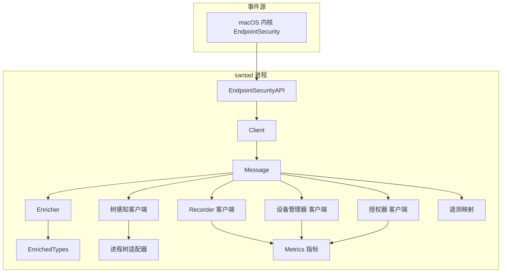
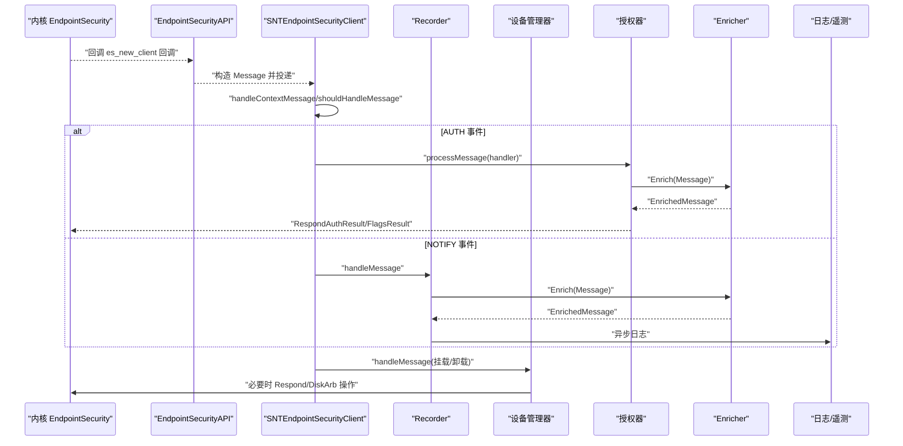
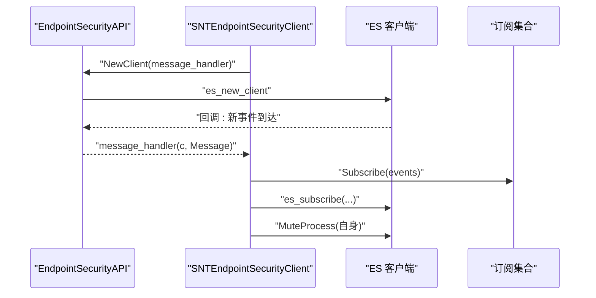
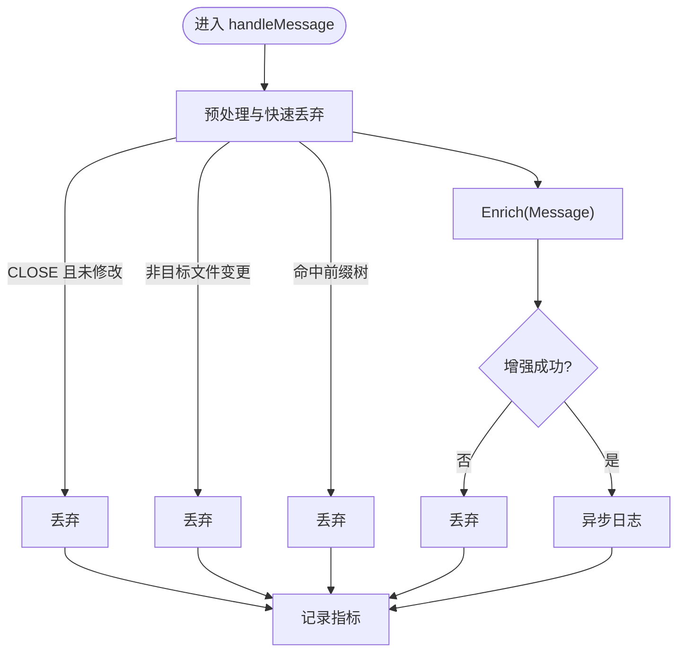
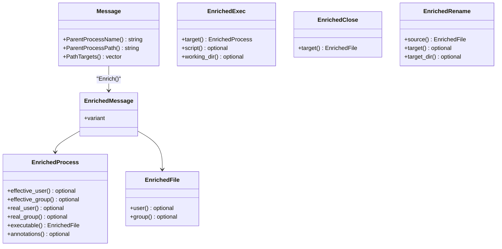
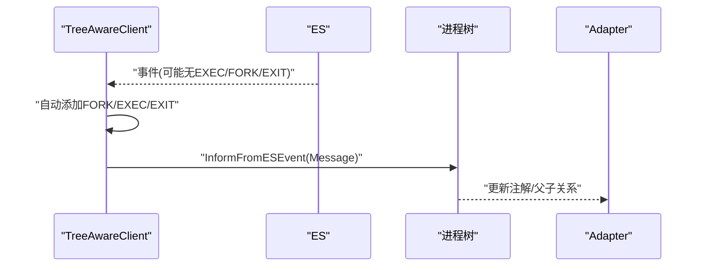
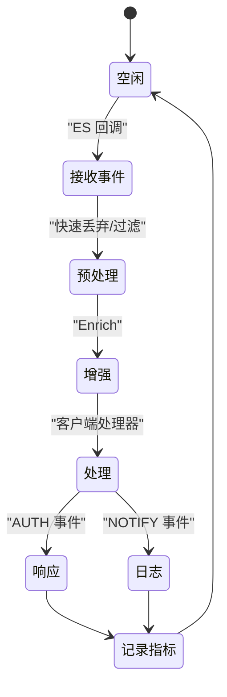
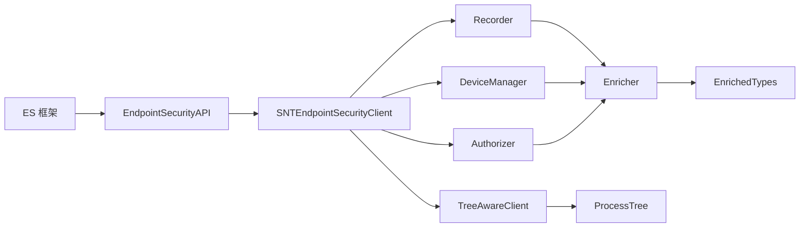

# 事件捕获流程

<cite>
**本文引用的文件**
- [EndpointSecurityAPI.h](file://Source/santad/EventProviders/EndpointSecurity/EndpointSecurityAPI.h)
- [EndpointSecurityAPI.mm](file://Source/santad/EventProviders/EndpointSecurity/EndpointSecurityAPI.mm)
- [Client.h](file://Source/santad/EventProviders/EndpointSecurity/Client.h)
- [Message.h](file://Source/santad/EventProviders/EndpointSecurity/Message.h)
- [Enricher.h](file://Source/santad/EventProviders/EndpointSecurity/Enricher.h)
- [Enricher.mm](file://Source/santad/EventProviders/EndpointSecurity/Enricher.mm)
- [EnrichedTypes.h](file://Source/santad/EventProviders/EndpointSecurity/EnrichedTypes.h)
- [SNTEndpointSecurityClient.mm](file://Source/santad/EventProviders/SNTEndpointSecurityClient.mm)
- [SNTEndpointSecurityDeviceManager.mm](file://Source/santad/EventProviders/SNTEndpointSecurityDeviceManager.mm)
- [SNTEndpointSecurityRecorder.mm](file://Source/santad/EventProviders/SNTEndpointSecurityRecorder.mm)
- [SNTEndpointSecurityAuthorizer.mm](file://Source/santad/EventProviders/SNTEndpointSecurityAuthorizer.mm)
- [SNTEndpointSecurityTreeAwareClient.mm](file://Source/santad/EventProviders/SNTEndpointSecurityTreeAwareClient.mm)
- [SNTEndpointSecurityAdapter.mm](file://Source/santad/ProcessTree/SNTEndpointSecurityAdapter.mm)
- [Metrics.h](file://Source/santad/Metrics.h)
- [TelemetryEventMap.h](file://Source/common/TelemetryEventMap.h)
- [TestUtils.mm](file://Source/common/TestUtils.mm)
- [WWDC2020_EndpointSecurity_Guide.md](file://WWDC2020_EndpointSecurity_Guide.md)
- [EndpointSecurity-Research-Report.md](file://EndpointSecurity-Research-Report.md)
</cite>

## 目录
1. [简介](#简介)
2. [项目结构](#项目结构)
3. [核心组件](#核心组件)
4. [架构总览](#架构总览)
5. [详细组件分析](#详细组件分析)
6. [依赖关系分析](#依赖关系分析)
7. [性能考量](#性能考量)
8. [故障排查指南](#故障排查指南)
9. [结论](#结论)
10. [附录](#附录)

## 简介
本文件面向Santa系统在macOS上的事件捕获流程，系统基于Endpoint Security框架捕获内核事件，覆盖进程执行、文件访问、网络/USB挂载等关键场景。文档重点解释事件订阅、客户端注册、事件过滤与增强、事件数据结构与类型映射、性能优化与内存管理、错误处理与超时机制，并提供事件状态图与生命周期图，帮助开发者与运维人员理解并维护该子系统。

## 项目结构
Santa在santad进程中通过多客户端协同完成事件捕获与处理：
- EndpointSecurityAPI：对底层ES API的封装，负责客户端创建、订阅、消息引用计数、鉴权响应、静默/反向静默等。
- Client：对es_client_t的轻量封装，避免裸指针与循环引用。
- Message：对es_message_t的包装，提供便捷的进程/文件信息提取与路径目标缓存。
- Enricher/EnrichedTypes：对事件进行上下文增强（进程、文件、用户、注解等），并生成统一的富化事件类型。
- 各类客户端：
  - SNTEndpointSecurityClient：通用事件处理基类，负责建立客户端、消息分发、预算计算、超时自动响应、指标记录。
  - SNTEndpointSecurityRecorder：记录器，订阅大量NOTIFY事件，按配置过滤并异步日志。
  - SNTEndpointSecurityDeviceManager：设备管理器，处理挂载/卸载事件，控制USB/网络挂载策略。
  - SNTEndpointSecurityAuthorizer：授权器，处理AUTH_EXEC与进程挂起/恢复事件，驱动决策与响应。
  - SNTEndpointSecurityTreeAwareClient：树感知客户端，确保最小必要事件集合以维持进程树一致性。
- Metrics：事件处理指标采集与导出。
- TelemetryEventMap：ES事件到遥测位掩码的映射。
- Process Tree Adapter：将ES事件注入进程树，维护父子关系与注解。

图表来源
- [EndpointSecurityAPI.mm](file://Source/santad/EventProviders/EndpointSecurity/EndpointSecurityAPI.mm#L25-L54)
- [Client.h](file://Source/santad/EventProviders/EndpointSecurity/Client.h#L24-L65)
- [Message.h](file://Source/santad/EventProviders/EndpointSecurity/Message.h#L30-L94)
- [Enricher.mm](file://Source/santad/EventProviders/EndpointSecurity/Enricher.mm#L40-L195)
- [EnrichedTypes.h](file://Source/santad/EventProviders/EndpointSecurity/EnrichedTypes.h#L137-L210)
- [SNTEndpointSecurityRecorder.mm](file://Source/santad/EventProviders/SNTEndpointSecurityRecorder.mm#L96-L184)
- [SNTEndpointSecurityDeviceManager.mm](file://Source/santad/EventProviders/SNTEndpointSecurityDeviceManager.mm#L410-L472)
- [SNTEndpointSecurityAuthorizer.mm](file://Source/santad/EventProviders/SNTEndpointSecurityAuthorizer.mm#L160-L189)
- [SNTEndpointSecurityTreeAwareClient.mm](file://Source/santad/EventProviders/SNTEndpointSecurityTreeAwareClient.mm#L50-L72)
- [SNTEndpointSecurityAdapter.mm](file://Source/santad/ProcessTree/SNTEndpointSecurityAdapter.mm#L31-L39)
- [Metrics.h](file://Source/santad/Metrics.h#L109-L142)
- [TelemetryEventMap.h](file://Source/common/TelemetryEventMap.h#L26-L53)

章节来源
- [EndpointSecurityAPI.h](file://Source/santad/EventProviders/EndpointSecurity/EndpointSecurityAPI.h#L30-L79)
- [SNTEndpointSecurityClient.mm](file://Source/santad/EventProviders/SNTEndpointSecurityClient.mm#L133-L179)

## 核心组件
- EndpointSecurityAPI：封装ES客户端生命周期、订阅/退订、静默控制、鉴权响应、消息引用计数等；提供执行事件参数提取（参数、环境变量、FD列表）。
- Client：持有es_client_t并负责删除，避免循环引用。
- Message：持有es_message_t并提供进程名/路径、父进程名/路径、路径目标列表等便捷方法，内部缓存路径目标以减少重复解析。
- Enricher/EnrichedTypes：根据事件类型构造统一的富化事件对象（如执行、关闭、重命名、登录会话、认证、XProtect等），并可选地填充用户/组名、进程注解等。
- SNTEndpointSecurityClient：通用事件处理基类，负责建立客户端、消息分发、预算计算、超时自动响应、指标记录、静默自身、订阅/退订、路径静默反转等。
- SNTEndpointSecurityRecorder：订阅大量NOTIFY事件，按配置过滤（如文件变更正则、前缀树），异步日志并记录指标。
- SNTEndpointSecurityDeviceManager：处理挂载/卸载事件，控制USB/网络挂载策略，必要时执行卸载/重挂。
- SNTEndpointSecurityAuthorizer：处理AUTH_EXEC与进程挂起/恢复事件，驱动决策控制器并做出ALLOW/DENY响应。
- SNTEndpointSecurityTreeAwareClient：为进程树一致性添加最小必要事件（FORK/EXEC/EXIT），并在需要时过滤掉仅为树同步目的而订阅的事件。
- Metrics：事件处理耗时、计数、丢弃统计、速率限制统计等。
- TelemetryEventMap：ES事件到遥测位掩码的映射，用于决定是否记录某事件。
- Process Tree Adapter：将ES事件注入进程树，维护父子关系与注解。

章节来源
- [EndpointSecurityAPI.mm](file://Source/santad/EventProviders/EndpointSecurity/EndpointSecurityAPI.mm#L25-L173)
- [Client.h](file://Source/santad/EventProviders/EndpointSecurity/Client.h#L24-L65)
- [Message.h](file://Source/santad/EventProviders/EndpointSecurity/Message.h#L30-L94)
- [Enricher.mm](file://Source/santad/EventProviders/EndpointSecurity/Enricher.mm#L40-L195)
- [EnrichedTypes.h](file://Source/santad/EventProviders/EndpointSecurity/EnrichedTypes.h#L137-L210)
- [SNTEndpointSecurityClient.mm](file://Source/santad/EventProviders/SNTEndpointSecurityClient.mm#L181-L254)
- [SNTEndpointSecurityRecorder.mm](file://Source/santad/EventProviders/SNTEndpointSecurityRecorder.mm#L186-L233)
- [SNTEndpointSecurityDeviceManager.mm](file://Source/santad/EventProviders/SNTEndpointSecurityDeviceManager.mm#L459-L472)
- [SNTEndpointSecurityAuthorizer.mm](file://Source/santad/EventProviders/SNTEndpointSecurityAuthorizer.mm#L241-L247)
- [SNTEndpointSecurityTreeAwareClient.mm](file://Source/santad/EventProviders/SNTEndpointSecurityTreeAwareClient.mm#L50-L72)
- [SNTEndpointSecurityAdapter.mm](file://Source/santad/ProcessTree/SNTEndpointSecurityAdapter.mm#L31-L39)
- [Metrics.h](file://Source/santad/Metrics.h#L109-L142)
- [TelemetryEventMap.h](file://Source/common/TelemetryEventMap.h#L26-L53)

## 架构总览
下图展示从内核到各客户端的事件流与职责分工：

图表来源
- [EndpointSecurityAPI.mm](file://Source/santad/EventProviders/EndpointSecurity/EndpointSecurityAPI.mm#L25-L54)
- [SNTEndpointSecurityClient.mm](file://Source/santad/EventProviders/SNTEndpointSecurityClient.mm#L140-L179)
- [SNTEndpointSecurityAuthorizer.mm](file://Source/santad/EventProviders/SNTEndpointSecurityAuthorizer.mm#L160-L189)
- [SNTEndpointSecurityRecorder.mm](file://Source/santad/EventProviders/SNTEndpointSecurityRecorder.mm#L96-L184)
- [SNTEndpointSecurityDeviceManager.mm](file://Source/santad/EventProviders/SNTEndpointSecurityDeviceManager.mm#L410-L472)
- [Enricher.mm](file://Source/santad/EventProviders/EndpointSecurity/Enricher.mm#L40-L195)

## 详细组件分析

### 组件A：事件订阅与客户端注册
- 客户端创建：通过EndpointSecurityAPI::NewClient注册回调，回调中将es_message_t包装为Message并交由具体客户端处理。
- 订阅策略：不同客户端独立订阅，避免耦合。例如Recorder订阅大量NOTIFY事件，Authorizer仅订阅AUTH_EXEC/PROC_SUSPEND_RESUME，DeviceManager订阅AUTH_MOUNT/REMount与NOTIFY_UNMOUNT。
- 自动静默：客户端启动后会静默自身进程，避免自触发事件风暴。
- 退订与清理：支持UnsubscribeAll、ClearCache、UnmuteAll等清理能力。

图表来源
- [EndpointSecurityAPI.mm](file://Source/santad/EventProviders/EndpointSecurity/EndpointSecurityAPI.mm#L25-L54)
- [SNTEndpointSecurityClient.mm](file://Source/santad/EventProviders/SNTEndpointSecurityClient.mm#L181-L206)
- [SNTEndpointSecurityClient.mm](file://Source/santad/EventProviders/SNTEndpointSecurityClient.mm#L181-L194)

章节来源
- [EndpointSecurityAPI.mm](file://Source/santad/EventProviders/EndpointSecurity/EndpointSecurityAPI.mm#L25-L54)
- [SNTEndpointSecurityClient.mm](file://Source/santad/EventProviders/SNTEndpointSecurityClient.mm#L181-L206)
- [SNTEndpointSecurityClient.mm](file://Source/santad/EventProviders/SNTEndpointSecurityClient.mm#L181-L194)

### 组件B：事件过滤与增强
- 过滤策略：
  - Recorder按配置过滤：未修改文件的CLOSE直接忽略；文件变更需匹配正则；命中前缀树的事件丢弃。
  - DeviceManager按网络/USB策略过滤：允许/拒绝挂载或重挂。
  - Authorizer对非EXEC事件直接丢弃。
- 增强策略：
  - Enricher根据事件类型构造统一的富化事件对象，填充进程/文件/用户/组/注解等信息。
  - 支持本地增强与外部查询两种模式，避免热路径上的外部调用。
- 遥测映射：将ES事件映射为遥测位掩码，决定是否记录。

图表来源
- [SNTEndpointSecurityRecorder.mm](file://Source/santad/EventProviders/SNTEndpointSecurityRecorder.mm#L96-L184)
- [Enricher.mm](file://Source/santad/EventProviders/EndpointSecurity/Enricher.mm#L40-L195)
- [TelemetryEventMap.h](file://Source/common/TelemetryEventMap.h#L26-L53)

章节来源
- [SNTEndpointSecurityRecorder.mm](file://Source/santad/EventProviders/SNTEndpointSecurityRecorder.mm#L96-L184)
- [Enricher.mm](file://Source/santad/EventProviders/EndpointSecurity/Enricher.mm#L40-L195)
- [TelemetryEventMap.h](file://Source/common/TelemetryEventMap.h#L26-L53)

### 组件C：事件数据结构与类型映射
- Message：封装es_message_t，提供进程名/路径、父进程名/路径、路径目标列表等便捷方法。
- EnrichedTypes：定义统一的富化事件类型，如执行、关闭、重命名、链接、交换数据、退出、克隆、复制文件、登录会话、OpenSSH、认证、XProtect、Gatekeeper覆盖、TCC修改等。
- TelemetryEventMap：将ES事件映射为遥测位掩码，便于按配置决定是否记录。

图表来源
- [Message.h](file://Source/santad/EventProviders/EndpointSecurity/Message.h#L30-L94)
- [EnrichedTypes.h](file://Source/santad/EventProviders/EndpointSecurity/EnrichedTypes.h#L137-L210)
- [EnrichedTypes.h](file://Source/santad/EventProviders/EndpointSecurity/EnrichedTypes.h#L213-L241)
- [EnrichedTypes.h](file://Source/santad/EventProviders/EndpointSecurity/EnrichedTypes.h#L319-L336)
- [EnrichedTypes.h](file://Source/santad/EventProviders/EndpointSecurity/EnrichedTypes.h#L773-L793)

章节来源
- [Message.h](file://Source/santad/EventProviders/EndpointSecurity/Message.h#L30-L94)
- [EnrichedTypes.h](file://Source/santad/EventProviders/EndpointSecurity/EnrichedTypes.h#L137-L210)
- [EnrichedTypes.h](file://Source/santad/EventProviders/EndpointSecurity/EnrichedTypes.h#L213-L241)
- [EnrichedTypes.h](file://Source/santad/EventProviders/EndpointSecurity/EnrichedTypes.h#L319-L336)
- [EnrichedTypes.h](file://Source/santad/EventProviders/EndpointSecurity/EnrichedTypes.h#L773-L793)

### 组件D：进程树一致性与上下文
- 树感知客户端：自动补充FORK/EXEC/EXIT等最小必要事件集合，确保进程树一致性；同时过滤掉仅为树同步目的而订阅的事件，避免下游误处理。
- 适配器：将ES事件注入进程树，获取进程令牌并更新注解。

图表来源
- [SNTEndpointSecurityTreeAwareClient.mm](file://Source/santad/EventProviders/SNTEndpointSecurityTreeAwareClient.mm#L50-L72)
- [SNTEndpointSecurityAdapter.mm](file://Source/santad/ProcessTree/SNTEndpointSecurityAdapter.mm#L31-L39)

章节来源
- [SNTEndpointSecurityTreeAwareClient.mm](file://Source/santad/EventProviders/SNTEndpointSecurityTreeAwareClient.mm#L50-L72)
- [SNTEndpointSecurityAdapter.mm](file://Source/santad/ProcessTree/SNTEndpointSecurityAdapter.mm#L31-L39)

### 组件E：事件生命周期与状态流转
- 生命周期阶段：内核产生事件 → ES回调 → Message封装 → Enricher增强 → 客户端处理 → 响应/日志 → 指标记录。
- 状态图（简化）：Idle → 接收事件 → 预处理/过滤 → 增强 → 处理器处理 → 响应/丢弃 → 记录指标 → Idle。

图表来源
- [SNTEndpointSecurityClient.mm](file://Source/santad/EventProviders/SNTEndpointSecurityClient.mm#L140-L179)
- [SNTEndpointSecurityRecorder.mm](file://Source/santad/EventProviders/SNTEndpointSecurityRecorder.mm#L96-L184)
- [SNTEndpointSecurityAuthorizer.mm](file://Source/santad/EventProviders/SNTEndpointSecurityAuthorizer.mm#L160-L189)

章节来源
- [SNTEndpointSecurityClient.mm](file://Source/santad/EventProviders/SNTEndpointSecurityClient.mm#L140-L179)
- [SNTEndpointSecurityRecorder.mm](file://Source/santad/EventProviders/SNTEndpointSecurityRecorder.mm#L96-L184)
- [SNTEndpointSecurityAuthorizer.mm](file://Source/santad/EventProviders/SNTEndpointSecurityAuthorizer.mm#L160-L189)

## 依赖关系分析
- 耦合与内聚：
  - EndpointSecurityAPI对各客户端提供统一接口，降低耦合。
  - Enricher与Message紧密协作，但通过可选的本地增强减少外部依赖。
  - 各客户端各自维护订阅集合，内聚良好。
- 外部依赖：
  - ES框架、DiskArbitration、bsm、dispatch等系统库。
  - 遥测映射与指标系统。
- 版本兼容：
  - 通过平台宏与运行时检查处理新事件类型（如Gatekeeper覆盖、TCC修改）。

图表来源
- [EndpointSecurityAPI.mm](file://Source/santad/EventProviders/EndpointSecurity/EndpointSecurityAPI.mm#L25-L54)
- [SNTEndpointSecurityClient.mm](file://Source/santad/EventProviders/SNTEndpointSecurityClient.mm#L133-L179)
- [SNTEndpointSecurityRecorder.mm](file://Source/santad/EventProviders/SNTEndpointSecurityRecorder.mm#L186-L233)
- [SNTEndpointSecurityDeviceManager.mm](file://Source/santad/EventProviders/SNTEndpointSecurityDeviceManager.mm#L459-L472)
- [SNTEndpointSecurityAuthorizer.mm](file://Source/santad/EventProviders/SNTEndpointSecurityAuthorizer.mm#L241-L247)
- [Enricher.mm](file://Source/santad/EventProviders/EndpointSecurity/Enricher.mm#L40-L195)

章节来源
- [EndpointSecurityAPI.h](file://Source/santad/EventProviders/EndpointSecurity/EndpointSecurityAPI.h#L30-L79)
- [SNTEndpointSecurityClient.mm](file://Source/santad/EventProviders/SNTEndpointSecurityClient.mm#L133-L179)

## 性能考量
- 预过滤与快速丢弃：Recorder在早期丢弃未修改文件的CLOSE、不匹配正则的文件变更、命中前缀树的事件，显著降低后续开销。
- 异步处理：使用并发队列处理鉴权与日志，避免阻塞ES回调线程。
- 预算与超时：基于事件deadline计算处理预算，限定最大头寸，到期自动响应，保证系统在紧急情况下仍可及时响应。
- 缓存与复用：Message缓存路径目标，Enricher缓存用户名/组名，减少重复查询。
- 版本兼容与降级：对新事件类型采用编译期/运行时双重保护，未知类型安全降级。

章节来源
- [SNTEndpointSecurityRecorder.mm](file://Source/santad/EventProviders/SNTEndpointSecurityRecorder.mm#L96-L184)
- [SNTEndpointSecurityClient.mm](file://Source/santad/EventProviders/SNTEndpointSecurityClient.mm#L286-L310)
- [Enricher.mm](file://Source/santad/EventProviders/EndpointSecurity/Enricher.mm#L225-L280)
- [EndpointSecurity-Research-Report.md](file://EndpointSecurity-Research-Report.md#L575-L591)

## 故障排查指南
- 客户端创建失败：
  - 检查权限/全盘访问、沙箱/entitlements、同时客户端数量限制。
  - 错误码映射与日志输出见客户端错误消息映射。
- 事件未到达：
  - 确认订阅集合是否正确；确认是否被静默（自身静默、路径静默反转）。
  - 检查其他ES客户端是否已订阅并影响结果。
- 超时自动响应：
  - 若deadline到达，客户端会自动ALLOW/DENY（受fail-closed配置影响），检查日志定位原因。
- 设备管理异常：
  - 卸载/重挂超时或失败，查看磁盘仲裁回调日志与指标。
- 指标异常：
  - 关注事件处理耗时、丢弃计数、速率限制计数，定位热点事件与过滤策略问题。

章节来源
- [SNTEndpointSecurityClient.mm](file://Source/santad/EventProviders/SNTEndpointSecurityClient.mm#L98-L110)
- [SNTEndpointSecurityClient.mm](file://Source/santad/EventProviders/SNTEndpointSecurityClient.mm#L339-L345)
- [SNTEndpointSecurityDeviceManager.mm](file://Source/santad/EventProviders/SNTEndpointSecurityDeviceManager.mm#L360-L396)
- [Metrics.h](file://Source/santad/Metrics.h#L109-L142)

## 结论
Santa通过模块化的Endpoint Security客户端体系，实现了对进程执行、文件访问、挂载等关键事件的高效捕获与处理。通过预过滤、异步处理、预算与超时控制、增强与遥测映射等机制，在保证安全性的同时兼顾性能与可观测性。版本兼容与错误处理策略确保系统在新平台上稳定演进。

## 附录
- 事件类型与版本兼容参考：
  - 参考测试工具中的最低支持版本判断逻辑，了解各事件在不同macOS版本的支持情况。
  - WWDC指南对NOTIFY事件的异步特性、结果字段等进行了说明，有助于理解事件语义。

章节来源
- [TestUtils.mm](file://Source/common/TestUtils.mm#L150-L185)
- [WWDC2020_EndpointSecurity_Guide.md](file://WWDC2020_EndpointSecurity_Guide.md#L249-L294)