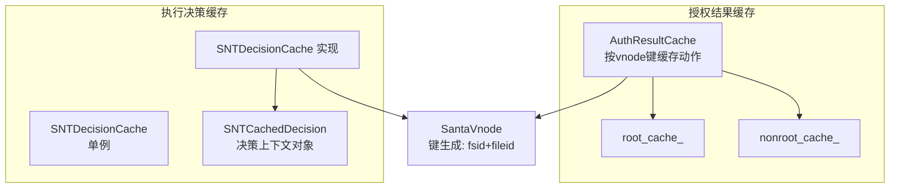
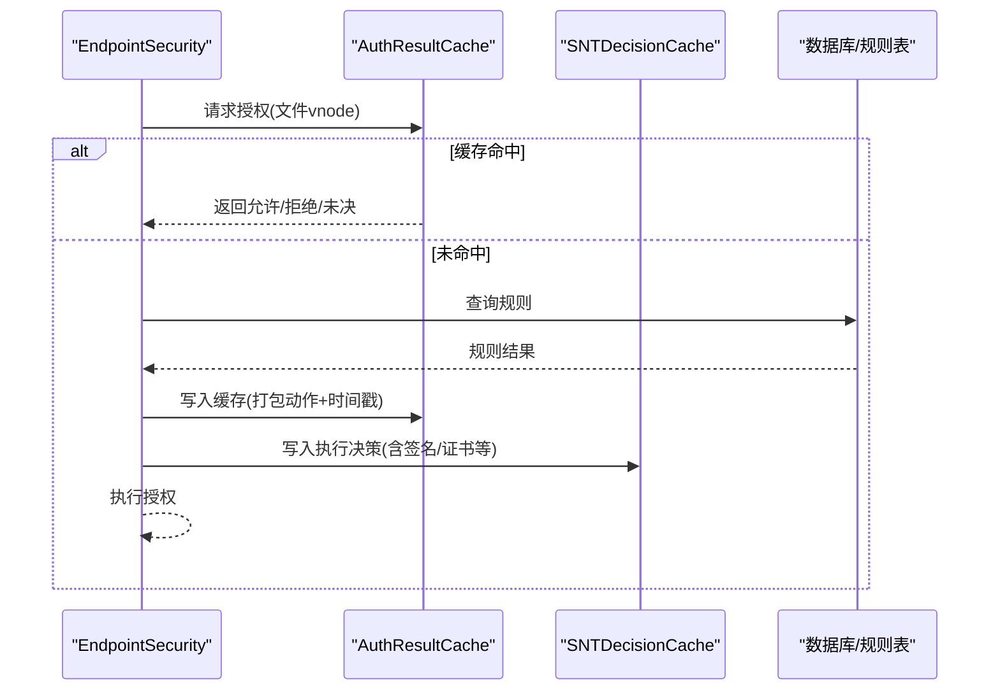
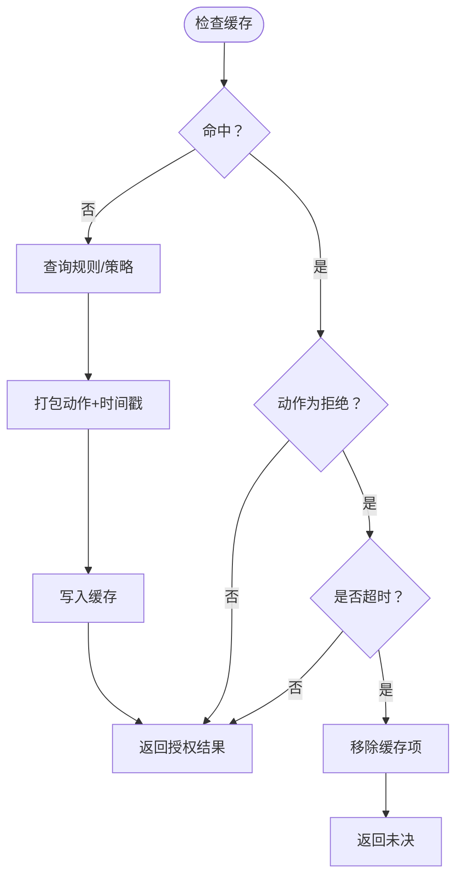
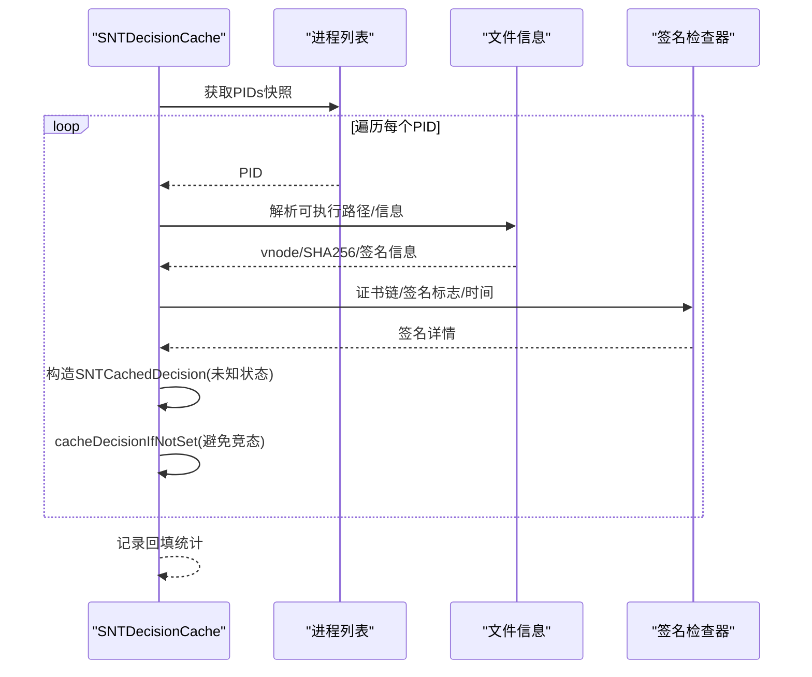
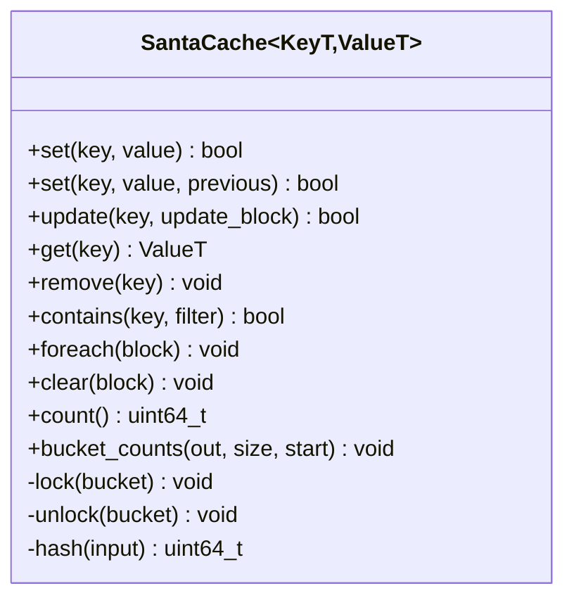
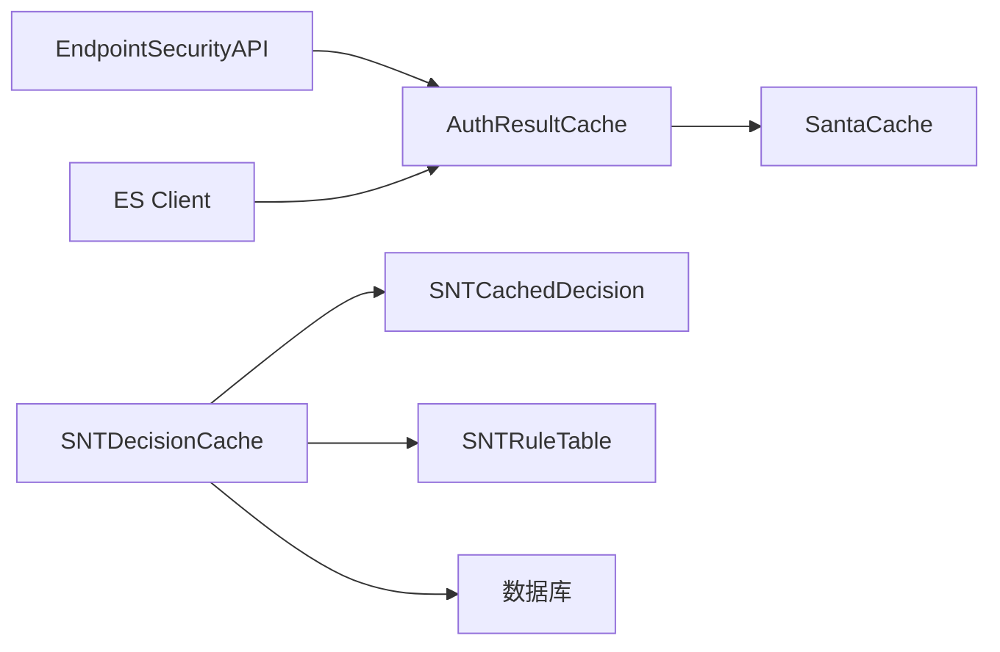

# 决策缓存流程

<cite>
**本文引用的文件**
- [SantaCache.h](file://Source/common/SantaCache.h)
- [SNTDecisionCache.h](file://Source/santad/SNTDecisionCache.h)
- [SNTDecisionCache.mm](file://Source/santad/SNTDecisionCache.mm)
- [SNTCachedDecision.h](file://Source/common/SNTCachedDecision.h)
- [SNTCachedDecision.mm](file://Source/common/SNTCachedDecision.mm)
- [AuthResultCache.h](file://Source/santad/EventProviders/AuthResultCache.h)
- [AuthResultCache.mm](file://Source/santad/EventProviders/AuthResultCache.mm)
- [SantaVnode.h](file://Source/common/SantaVnode.h)
- [SNTCommandFlushCache.mm](file://Source/santactl/Commands/SNTCommandFlushCache.mm)
- [SNTRuleTable.mm](file://Source/santad/DataLayer/SNTRuleTable.mm)
- [SNTEndpointSecurityAuthorizer.mm](file://Source/santad/EventProviders/SNTEndpointSecurityAuthorizer.mm)
- [Metrics.h](file://Source/santad/Metrics.h)
- [SantaCacheTest.mm](file://Source/common/SantaCacheTest.mm)
</cite>

## 目录
1. [引言](#引言)
2. [项目结构](#项目结构)
3. [核心组件](#核心组件)
4. [架构总览](#架构总览)
5. [详细组件分析](#详细组件分析)
6. [依赖关系分析](#依赖关系分析)
7. [性能考量](#性能考量)
8. [故障排查指南](#故障排查指南)
9. [结论](#结论)
10. [附录](#附录)

## 引言
本文件面向Santa系统中的“决策缓存流程”，系统性阐述授权决策结果的缓存策略、过期机制、内存管理与持久化边界、键生成方式、命中率优化、失效处理、与策略评估的交互关系、一致性保障与并发控制、性能监控、容量管理与故障恢复机制，并提供架构图与优化建议。目标是帮助开发者与运维人员在理解代码实现的基础上，安全高效地扩展与维护缓存子系统。

## 项目结构
Santa的缓存体系由两部分组成：
- 授权结果缓存（AuthResultCache）：用于加速授权路径上的决策判定，支持按根文件系统与非根文件系统分仓，带超时淘汰。
- 执行决策缓存（SNTDecisionCache）：用于存储执行事件的决策上下文，便于审计、回填与后续处理。

图表来源
- [AuthResultCache.h](file://Source/santad/EventProviders/AuthResultCache.h#L50-L98)
- [AuthResultCache.mm](file://Source/santad/EventProviders/AuthResultCache.mm#L111-L175)
- [SNTDecisionCache.h](file://Source/santad/SNTDecisionCache.h#L23-L35)
- [SNTDecisionCache.mm](file://Source/santad/SNTDecisionCache.mm#L45-L91)
- [SNTCachedDecision.h](file://Source/common/SNTCachedDecision.h#L23-L61)
- [SantaVnode.h](file://Source/common/SantaVnode.h#L25-L53)

章节来源
- [AuthResultCache.h](file://Source/santad/EventProviders/AuthResultCache.h#L50-L98)
- [SNTDecisionCache.h](file://Source/santad/SNTDecisionCache.h#L23-L35)
- [SantaVnode.h](file://Source/common/SantaVnode.h#L25-L53)

## 核心组件
- 授权结果缓存（AuthResultCache）
  - 键：SantaVnode（fsid+fileid），区分根文件系统与非根文件系统，分别缓存。
  - 值：将动作与时间戳打包为一个整数，高若干位保存动作，低若干位保存时间戳；deny动作带超时窗口。
  - 过期：deny动作在超时后自动移除；显式规则变更或卸载事件触发缓存清空。
- 执行决策缓存（SNTDecisionCache）
  - 键：SantaVnode（fsid+fileid）。
  - 值：SNTCachedDecision（包含决策状态、签名信息、证书链、可缓存标记等）。
  - 功能：缓存决策、按vnode查询、按vnode删除、重置transitive规则时间戳、异步回填运行中进程的伪决策。
- 公共基础（SantaCache）
  - 并发哈希表：按桶锁，支持容量上限、CAS、批量遍历、清空回调等。
- 键生成（SantaVnode）
  - 通过stat信息生成fsid与fileid，作为稳定且唯一的键。

章节来源
- [AuthResultCache.mm](file://Source/santad/EventProviders/AuthResultCache.mm#L111-L175)
- [SNTDecisionCache.mm](file://Source/santad/SNTDecisionCache.mm#L73-L112)
- [SantaCache.h](file://Source/common/SantaCache.h#L48-L110)
- [SantaVnode.h](file://Source/common/SantaVnode.h#L25-L53)

## 架构总览
授权与执行两条缓存路径协同工作：授权路径优先命中，执行路径记录审计与上下文，二者共享键生成与并发模型。

图表来源
- [AuthResultCache.mm](file://Source/santad/EventProviders/AuthResultCache.mm#L148-L171)
- [SNTDecisionCache.mm](file://Source/santad/SNTDecisionCache.mm#L73-L112)
- [SNTRuleTable.mm](file://Source/santad/DataLayer/SNTRuleTable.mm#L710-L740)

## 详细组件分析

### 授权结果缓存（AuthResultCache）
- 键与值
  - 键：SantaVnode（fsid+fileid）。
  - 值：将动作与时间戳打包为uint64，高8位保存动作，低56位保存纳秒级时间戳；deny动作带超时窗口。
- 分仓策略
  - 按设备号区分根文件系统与非根文件系统，分别维护独立缓存，避免跨分区冲突。
- 过期机制
  - deny动作在超时后自动从缓存移除；未超时则直接返回。
- 失效与刷新
  - 显式命令、规则变更、模式切换、过滤器变化、文件系统卸载等触发缓存清空；清空前会统计并记录原因计数。
- 并发与一致性
  - 使用SantaCache的桶锁保证线程安全；CAS写入确保竞争条件下的正确性。
- 性能特性
  - 容量上限触发全清以维持命中率；桶分布测试覆盖随机与单调键场景，保证负载均衡。

图表来源
- [AuthResultCache.mm](file://Source/santad/EventProviders/AuthResultCache.mm#L148-L171)
- [AuthResultCache.mm](file://Source/santad/EventProviders/AuthResultCache.mm#L177-L197)

章节来源
- [AuthResultCache.h](file://Source/santad/EventProviders/AuthResultCache.h#L50-L98)
- [AuthResultCache.mm](file://Source/santad/EventProviders/AuthResultCache.mm#L111-L175)
- [AuthResultCache.mm](file://Source/santad/EventProviders/AuthResultCache.mm#L177-L197)
- [SantaCacheTest.mm](file://Source/common/SantaCacheTest.mm#L115-L137)

### 执行决策缓存（SNTDecisionCache）
- 职责
  - 存储执行事件的决策上下文，支持按vnode查询、删除、重置transitive规则时间戳、异步回填运行中进程的伪决策。
- 键生成
  - 使用SantaVnode（fsid+fileid）作为键，保证跨进程生命周期内的一致性。
- 回填策略
  - 异步扫描当前运行进程，构造伪SNTCachedDecision（未知决策、未知客户端模式、不可缓存），填充签名/证书等静态信息，避免重复计算。
- 时间戳重置
  - 对transitive允许规则，定期重置数据库时间戳，防止频繁写入，采用时间窗去抖。

图表来源
- [SNTDecisionCache.mm](file://Source/santad/SNTDecisionCache.mm#L120-L205)
- [SNTCachedDecision.h](file://Source/common/SNTCachedDecision.h#L23-L61)

章节来源
- [SNTDecisionCache.h](file://Source/santad/SNTDecisionCache.h#L23-L35)
- [SNTDecisionCache.mm](file://Source/santad/SNTDecisionCache.mm#L73-L112)
- [SNTDecisionCache.mm](file://Source/santad/SNTDecisionCache.mm#L120-L205)
- [SNTCachedDecision.mm](file://Source/common/SNTCachedDecision.mm#L18-L38)

### 公共缓存基座（SantaCache）
- 设计要点
  - 模板化键/值类型，支持自定义哈希器；容量达到上限时全清以维持命中率。
  - 桶数按“最大容量/每桶目标数量”向上取整为2的幂，桶锁实现细粒度并发。
  - 支持CAS设置、更新块、遍历、条件存在性检查、清空回调等。
- 并发与内存
  - 每桶自旋锁；删除时原子计数递减；清空时批量释放并bzero重置。
- 测试覆盖
  - 分布均匀性、多线程并发、容量上限、更新/删除/清空等行为验证。

图表来源
- [SantaCache.h](file://Source/common/SantaCache.h#L48-L110)
- [SantaCache.h](file://Source/common/SantaCache.h#L320-L463)
- [SantaCacheTest.mm](file://Source/common/SantaCacheTest.mm#L139-L168)

章节来源
- [SantaCache.h](file://Source/common/SantaCache.h#L48-L110)
- [SantaCache.h](file://Source/common/SantaCache.h#L320-L463)
- [SantaCacheTest.mm](file://Source/common/SantaCacheTest.mm#L115-L137)

### 键生成与缓存一致性
- 键生成
  - 通过stat信息生成SantaVnode（fsid+fileid），保证同一文件在不同时间点的键一致。
- 一致性保障
  - 授权缓存对拒绝动作设置超时，避免旧规则导致的长期误判。
  - 执行缓存对transitive规则的时间戳进行去抖重置，减少数据库写放大。
  - 规则变更、模式切换、卸载等事件触发缓存清空，确保策略生效。

章节来源
- [SantaVnode.h](file://Source/common/SantaVnode.h#L25-L53)
- [AuthResultCache.mm](file://Source/santad/EventProviders/AuthResultCache.mm#L160-L171)
- [SNTDecisionCache.mm](file://Source/santad/SNTDecisionCache.mm#L93-L112)
- [SNTRuleTable.mm](file://Source/santad/DataLayer/SNTRuleTable.mm#L710-L740)

## 依赖关系分析
- 组件耦合
  - AuthResultCache依赖EndpointSecurityAPI与ES客户端，负责与内核框架交互；依赖SantaCache实现并发哈希表。
  - SNTDecisionCache依赖SNTCachedDecision对象与数据库规则表，负责执行事件的上下文缓存与回填。
- 外部依赖
  - EndpointSecurity框架、SQLite/规则表、指标导出服务。
- 循环依赖
  - 未见循环依赖；各模块职责清晰，接口边界明确。

图表来源
- [AuthResultCache.h](file://Source/santad/EventProviders/AuthResultCache.h#L50-L98)
- [AuthResultCache.mm](file://Source/santad/EventProviders/AuthResultCache.mm#L111-L175)
- [SNTDecisionCache.mm](file://Source/santad/SNTDecisionCache.mm#L73-L112)
- [SNTRuleTable.mm](file://Source/santad/DataLayer/SNTRuleTable.mm#L710-L740)

章节来源
- [AuthResultCache.h](file://Source/santad/EventProviders/AuthResultCache.h#L50-L98)
- [SNTDecisionCache.mm](file://Source/santad/SNTDecisionCache.mm#L73-L112)
- [SNTRuleTable.mm](file://Source/santad/DataLayer/SNTRuleTable.mm#L710-L740)

## 性能考量
- 命中率优化
  - 合理设置每桶目标数量与最大容量，使桶内平均条目数稳定，降低热点桶压力。
  - 对deny动作设置适度超时窗口，兼顾快速响应与缓存有效性。
- 内存管理
  - 达到容量上限时全清，避免碎片化与过度扩容；清空前支持回调释放资源。
  - 执行缓存回填采用异步队列，避免阻塞主授权路径。
- 并发控制
  - 桶锁细粒度并发，减少全局锁争用；CAS写入避免ABA问题。
- I/O与持久化
  - 授权缓存不直接持久化，仅在规则变更或显式命令时清空；执行缓存的签名/证书等信息来自静态解析，不频繁写盘。
- 监控与可观测性
  - 统计缓存清空原因计数，辅助定位策略变更与系统事件的影响范围。

章节来源
- [SantaCache.h](file://Source/common/SantaCache.h#L48-L110)
- [AuthResultCache.mm](file://Source/santad/EventProviders/AuthResultCache.mm#L177-L197)
- [SNTDecisionCache.mm](file://Source/santad/SNTDecisionCache.mm#L120-L205)
- [Metrics.h](file://Source/santad/Metrics.h#L70-L141)

## 故障排查指南
- 常见问题
  - 命中率低：检查每桶目标数量与最大容量设置；确认是否存在大量热键集中在少数桶。
  - 拒绝误判：确认deny超时窗口是否过短；查看规则变更历史与缓存清空日志。
  - 回填失败：检查进程列表获取与路径解析错误；关注异步队列优先级与系统负载。
- 排查步骤
  - 使用显式命令清空缓存，观察授权路径行为变化。
  - 关注规则表变更触发的缓存清空事件与原因计数。
  - 结合指标导出，定位事件丢弃与处理耗时异常。
- 相关实现入口
  - 清空缓存命令：显式触发缓存清空。
  - 规则表变更：根据规则类型决定是否清空缓存。
  - ES框架缓存：避免依赖ES框架缓存，由Santa自行管理。

章节来源
- [SNTCommandFlushCache.mm](file://Source/santactl/Commands/SNTCommandFlushCache.mm#L28-L40)
- [SNTRuleTable.mm](file://Source/santad/DataLayer/SNTRuleTable.mm#L710-L740)
- [SNTEndpointSecurityAuthorizer.mm](file://Source/santad/EventProviders/SNTEndpointSecurityAuthorizer.mm#L70-L75)

## 结论
Santa的决策缓存体系通过“授权结果缓存”与“执行决策缓存”的分工协作，在保证策略一致性的同时，显著提升了授权路径的吞吐与稳定性。其基于桶锁的并发哈希表、按vnode的稳定键生成、deny动作的超时淘汰与显式清空机制，共同构成了高效、可控、可观测的缓存闭环。结合回填与指标导出，系统能够在复杂环境中持续优化命中率与响应时间。

## 附录
- 术语
  - vnode：文件系统中的inode标识，由设备号与索引节点号组成。
  - CAS：比较并交换，用于无锁更新。
  - 去抖：在固定时间窗内抑制重复写入。
- 最佳实践
  - 合理设置最大容量与每桶目标数量，平衡命中率与内存占用。
  - 对deny动作设置适中超时窗口，避免过短导致频繁失效、过长导致策略滞后。
  - 在规则变更频繁场景下，优先使用显式命令清空缓存，确保策略即时生效。
  - 异步回填运行中进程的决策，避免阻塞前台授权请求。