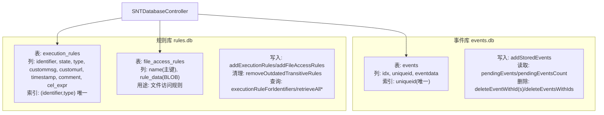
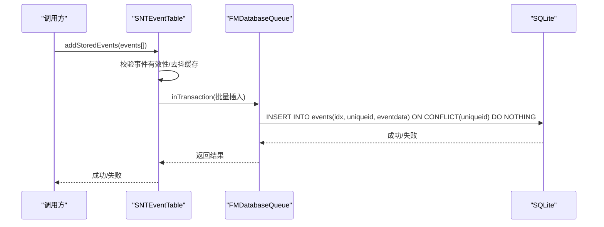
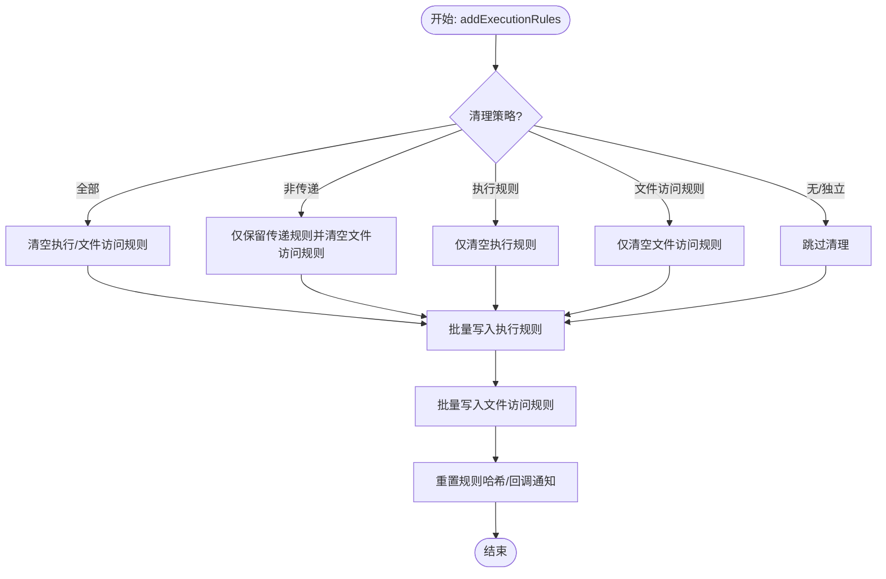
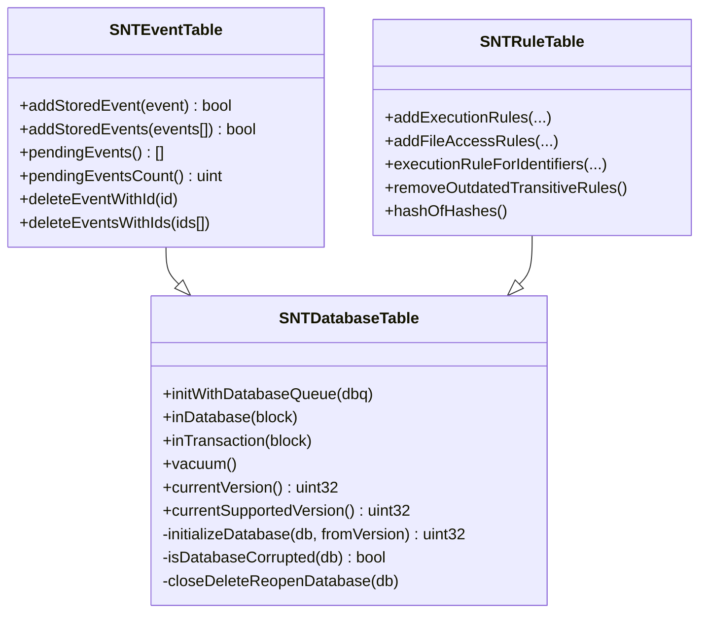
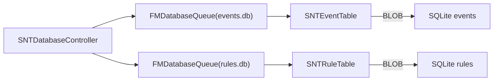

# 数据库存储流程

<cite>
**本文引用的文件**
- [SNTDatabaseController.mm](file://Source/santad/SNTDatabaseController.mm)
- [SNTDatabaseTable.h](file://Source/santad/DataLayer/SNTDatabaseTable.h)
- [SNTDatabaseTable.mm](file://Source/santad/DataLayer/SNTDatabaseTable.mm)
- [SNTEventTable.h](file://Source/santad/DataLayer/SNTEventTable.h)
- [SNTEventTable.mm](file://Source/santad/DataLayer/SNTEventTable.mm)
- [SNTRuleTable.h](file://Source/santad/DataLayer/SNTRuleTable.h)
- [SNTRuleTable.mm](file://Source/santad/DataLayer/SNTRuleTable.mm)
- [SNTStoredEvent.h](file://Source/common/SNTStoredEvent.h)
- [SNTRule.h](file://Source/common/SNTRule.h)
- [migration.sh](file://Conf/Package/migration.sh)
- [com.northpolesec.santa.migration.plist](file://Conf/com.northpolesec.santa.migration.plist)
- [migration.md](file://docs/docs/deployment/migration.md)
</cite>

## 目录
1. [简介](#简介)
2. [项目结构](#项目结构)
3. [核心组件](#核心组件)
4. [架构总览](#架构总览)
5. [详细组件分析](#详细组件分析)
6. [依赖关系分析](#依赖关系分析)
7. [性能考量](#性能考量)
8. [故障排查指南](#故障排查指南)
9. [结论](#结论)
10. [附录](#附录)

## 简介
本文件系统性梳理 Santa 的数据库存储流程，聚焦事件与规则两类数据在 SQLite 中的持久化路径。内容涵盖：
- 表结构设计与版本演进
- 索引优化与去重策略
- 事务处理与并发控制
- 写入流程、批量插入与幂等策略
- 数据压缩与归档策略（基于现有实现）
- 连接池管理、查询优化与性能监控
- 数据迁移、备份恢复与完整性保障
- 数据库架构图与 SQL 优化建议

## 项目结构
Santa 将数据库层抽象为“表控制器”，分别管理事件表与规则表，并通过统一的数据库控制器进行初始化与权限设置。整体采用 FMDB 的数据库队列（FMDatabaseQueue）提供线程安全访问。

```mermaid
graph TB
subgraph "数据库控制器"
DC["SNTDatabaseController<br/>初始化/权限/路径"]
end
subgraph "数据层基类"
DT["SNTDatabaseTable<br/>版本升级/事务封装/VACUUM"]
end
subgraph "事件表"
ET["SNTEventTable<br/>events 表/索引/写入/读取/删除"]
end
subgraph "规则表"
RT["SNTRuleTable<br/>execution_rules / file_access_rules<br/>写入/查询/清理/哈希"]
end
DC --> ET
DC --> RT
DT <|-- ET
DT <|-- RT
```

图表来源
- [SNTDatabaseController.mm](file://Source/santad/SNTDatabaseController.mm#L26-L101)
- [SNTDatabaseTable.h](file://Source/santad/DataLayer/SNTDatabaseTable.h#L22-L59)
- [SNTEventTable.h](file://Source/santad/DataLayer/SNTEventTable.h#L15-L72)
- [SNTRuleTable.h](file://Source/santad/DataLayer/SNTRuleTable.h#L15-L172)

章节来源
- [SNTDatabaseController.mm](file://Source/santad/SNTDatabaseController.mm#L26-L101)
- [SNTDatabaseTable.h](file://Source/santad/DataLayer/SNTDatabaseTable.h#L22-L59)
- [SNTEventTable.h](file://Source/santad/DataLayer/SNTEventTable.h#L15-L72)
- [SNTRuleTable.h](file://Source/santad/DataLayer/SNTRuleTable.h#L15-L172)

## 核心组件
- 数据库控制器：负责创建数据库目录、初始化两个数据库队列（事件库与规则库），并设置文件权限。
- 数据层基类：提供版本检查、损坏修复、事务封装、VACUUM 清理等通用能力。
- 事件表：维护事件表结构、唯一索引、幂等写入、去抖缓存、批量写入与读取。
- 规则表：维护执行规则与文件访问规则两套表，支持多类型规则、清理策略、哈希校验、查询优化与过期规则剔除。

章节来源
- [SNTDatabaseController.mm](file://Source/santad/SNTDatabaseController.mm#L26-L101)
- [SNTDatabaseTable.mm](file://Source/santad/DataLayer/SNTDatabaseTable.mm#L29-L151)
- [SNTEventTable.mm](file://Source/santad/DataLayer/SNTEventTable.mm#L42-L103)
- [SNTRuleTable.mm](file://Source/santad/DataLayer/SNTRuleTable.mm#L212-L334)

## 架构总览
数据库架构围绕“事件库 events.db”和“规则库 rules.db”两条主线展开。事件库用于暂存待上报的事件；规则库用于存放执行决策与文件访问规则。两者均通过 FMDatabaseQueue 提供串行化访问，避免并发冲突。



图表来源
- [SNTEventTable.mm](file://Source/santad/DataLayer/SNTEventTable.mm#L52-L103)
- [SNTRuleTable.mm](file://Source/santad/DataLayer/SNTRuleTable.mm#L218-L307)
- [SNTDatabaseController.mm](file://Source/santad/SNTDatabaseController.mm#L26-L79)

## 详细组件分析

### 事件表（SNTEventTable）
- 表结构与索引
  - events 表包含自增主键 idx、唯一标识 uniqueid、事件二进制数据 eventdata（BLOB）。历史版本曾使用 filesha256 列，后演进为 uniqueid 并建立唯一索引以支持幂等写入。
- 写入流程与幂等
  - 批量写入时对每个事件进行序列化（NSSecureCoding），在事务内按 uniqueid 使用“冲突忽略”的方式插入，避免重复事件入库。
  - 对“不可行动作事件”引入去抖缓存，短时间窗口内的重复事件会被丢弃，降低写放大。
- 读取与清理
  - 支持统计计数与全量拉取；拉取过程中若反序列化失败则删除对应记录，保持表一致性。
  - 提供单条/批量删除接口，便于上报成功后的清理。
- 版本迁移
  - 多次迁移将 AUTOINCREMENT 移除、uniqueid 列名更新、唯一索引重建等，确保 schema 与业务需求匹配。



图表来源
- [SNTEventTable.mm](file://Source/santad/DataLayer/SNTEventTable.mm#L128-L160)
- [SNTEventTable.mm](file://Source/santad/DataLayer/SNTEventTable.mm#L162-L172)

章节来源
- [SNTEventTable.h](file://Source/santad/DataLayer/SNTEventTable.h#L15-L72)
- [SNTEventTable.mm](file://Source/santad/DataLayer/SNTEventTable.mm#L42-L103)
- [SNTEventTable.mm](file://Source/santad/DataLayer/SNTEventTable.mm#L128-L160)
- [SNTEventTable.mm](file://Source/santad/DataLayer/SNTEventTable.mm#L162-L172)
- [SNTStoredEvent.h](file://Source/common/SNTStoredEvent.h#L16-L36)

### 规则表（SNTRuleTable）
- 表结构与拆分
  - execution_rules：存放执行决策规则，含 identifier、state、type、custommsg/customurl、timestamp、comment、cel_expr 等字段；以 (identifier,type) 唯一索引。
  - file_access_rules：存放文件访问规则，name 为主键，rule_data 为序列化后的字节流。
- 写入与清理
  - 支持批量写入执行规则与文件访问规则，均在事务中完成；可选择清理策略（全部、非传递、仅执行规则、仅文件访问规则、无清理）。
  - 对传递型规则提供过期剔除逻辑，定期删除长时间未使用的允许传递规则，降低规则集规模。
- 查询与缓存
  - 按优先级顺序查询匹配规则（cdhash/bin/signingID/cert/teamID），命中即返回；同时维护静态规则缓存与关键系统二进制白名单，加速常见场景。
  - 提供规则哈希计算，用于快速判断规则集是否发生变化。
- 版本迁移
  - 多版本迁移包括列名变更、大小写规范化、新增列、视图清理、表拆分等，确保向后兼容与性能优化。



图表来源
- [SNTRuleTable.mm](file://Source/santad/DataLayer/SNTRuleTable.mm#L631-L705)
- [SNTRuleTable.mm](file://Source/santad/DataLayer/SNTRuleTable.mm#L707-L730)
- [SNTRuleTable.mm](file://Source/santad/DataLayer/SNTRuleTable.mm#L771-L804)

章节来源
- [SNTRuleTable.h](file://Source/santad/DataLayer/SNTRuleTable.h#L15-L172)
- [SNTRuleTable.mm](file://Source/santad/DataLayer/SNTRuleTable.mm#L212-L334)
- [SNTRuleTable.mm](file://Source/santad/DataLayer/SNTRuleTable.mm#L631-L705)
- [SNTRuleTable.mm](file://Source/santad/DataLayer/SNTRuleTable.mm#L771-L804)
- [SNTRule.h](file://Source/common/SNTRule.h#L15-L129)

### 数据层基类（SNTDatabaseTable）
- 职责
  - 初始化数据库连接，检测锁库、损坏并尝试修复（REINDEX; VACUUM），必要时重建数据库。
  - 统一版本升级入口，子类实现 initializeDatabase/fromVersion，完成后设置 userVersion 并执行 VACUUM。
  - 提供 inDatabase/inTransaction 包装，屏蔽底层队列细节。
- 完整性与健壮性
  - 通过 PRAGMA integrity_check 检测损坏；对“新版本数据库”采取保守策略（删除重建）。
  - 在 DEBUG 构建下保留错误日志开关，在发布构建下关闭以减少噪声。



图表来源
- [SNTDatabaseTable.h](file://Source/santad/DataLayer/SNTDatabaseTable.h#L22-L59)
- [SNTDatabaseTable.mm](file://Source/santad/DataLayer/SNTDatabaseTable.mm#L29-L151)
- [SNTEventTable.h](file://Source/santad/DataLayer/SNTEventTable.h#L15-L72)
- [SNTRuleTable.h](file://Source/santad/DataLayer/SNTRuleTable.h#L15-L172)

章节来源
- [SNTDatabaseTable.mm](file://Source/santad/DataLayer/SNTDatabaseTable.mm#L29-L151)

### 数据库控制器（SNTDatabaseController）
- 路径与权限
  - 默认数据库目录位于 /var/db/santa，事件库与规则库分别命名；创建目录并设置属主与权限。
- 连接初始化
  - 为事件库与规则库分别创建 FMDatabaseQueue；在非调试构建下关闭底层错误日志。
- 单例化
  - 事件表与规则表均通过 dispatch_once 初始化，确保全局唯一实例。

章节来源
- [SNTDatabaseController.mm](file://Source/santad/SNTDatabaseController.mm#L26-L101)

## 依赖关系分析
- 组件耦合
  - SNTDatabaseController 作为门面，向上提供事件表与规则表单例；向下依赖 FMDB 队列。
  - SNTDatabaseTable 为所有表控制器提供统一的生命周期与版本管理。
- 外部依赖
  - FMDB（FMDatabaseQueue/FMResultSet）提供线程安全与事务支持。
  - SQLite PRAGMA 与 VACUUM/REINDEX 用于完整性检查与碎片整理。
- 可能的循环依赖
  - 当前结构清晰，未见直接循环；事件/规则对象通过 BLOB 存储，避免跨表强耦合。



图表来源
- [SNTDatabaseController.mm](file://Source/santad/SNTDatabaseController.mm#L26-L79)
- [SNTEventTable.mm](file://Source/santad/DataLayer/SNTEventTable.mm#L128-L160)
- [SNTRuleTable.mm](file://Source/santad/DataLayer/SNTRuleTable.mm#L519-L560)

章节来源
- [SNTDatabaseController.mm](file://Source/santad/SNTDatabaseController.mm#L26-L79)

## 性能考量
- 事务与批处理
  - 事件批量写入与规则批量写入均在事务中执行，显著降低 WAL/FS 开销。
- 幂等与去抖
  - 事件 uniqueid 唯一索引与“冲突忽略”避免重复写入；不可行动作事件的去抖缓存减少无效写入。
- 查询优化
  - 规则查询按优先级顺序构造一次性查询，避免多次索引扫描；在规则数量极大时可考虑复合索引或物化视图（见后续建议）。
- 碎片整理
  - 版本升级后自动执行 VACUUM，有助于维持索引与表页布局健康。
- 连接池
  - FMDatabaseQueue 以串行队列形式提供线程安全访问，避免显式连接池配置；如需更高吞吐可在应用层增加只读副本或分库策略。

章节来源
- [SNTEventTable.mm](file://Source/santad/DataLayer/SNTEventTable.mm#L128-L160)
- [SNTRuleTable.mm](file://Source/santad/DataLayer/SNTRuleTable.mm#L491-L506)
- [SNTDatabaseTable.mm](file://Source/santad/DataLayer/SNTDatabaseTable.mm#L136-L151)

## 故障排查指南
- 数据库被锁或损坏
  - 若检测到 SQLITE_LOCKED 或完整性检查失败，将尝试 REINDEX; VACUUM；仍失败则删除并重建数据库。
- 写入失败
  - 检查事务回调中的返回值与错误信息；确认 uniqueid 是否有效、事件对象是否可安全编码。
- 规则未生效
  - 核对规则类型与优先级顺序；检查是否触发了决策缓存刷新逻辑；确认传递规则是否被过期清理。
- 权限问题
  - 确认数据库文件与目录属主与权限正确；事件库与规则库文件权限应严格限制。

章节来源
- [SNTDatabaseTable.mm](file://Source/santad/DataLayer/SNTDatabaseTable.mm#L29-L89)
- [SNTDatabaseTable.mm](file://Source/santad/DataLayer/SNTDatabaseTable.mm#L91-L100)
- [SNTDatabaseController.mm](file://Source/santad/SNTDatabaseController.mm#L43-L56)
- [SNTDatabaseController.mm](file://Source/santad/SNTDatabaseController.mm#L72-L79)

## 结论
Santa 的数据库层以“事件库 + 规则库”的双库架构为核心，结合 FMDB 的队列与事务能力，实现了高可靠、可演进的持久化方案。事件侧强调幂等与去抖，规则侧强调优先级查询与过期清理。通过版本迁移与完整性检查，系统在部署层面具备良好的韧性与可维护性。

## 附录

### 表结构与索引要点
- 事件表 events
  - 主键 idx（历史 AUTOINCREMENT 已移除）
  - 唯一索引 uniqueid，用于幂等写入
  - eventdata 为事件对象的二进制序列化
- 规则表 execution_rules
  - 唯一索引 (identifier, type)，覆盖多类型规则
  - 关键列：state、type、timestamp、cel_expr 等
- 文件访问规则表 file_access_rules
  - 主键 name
  - rule_data 为序列化字节流

章节来源
- [SNTEventTable.mm](file://Source/santad/DataLayer/SNTEventTable.mm#L52-L103)
- [SNTRuleTable.mm](file://Source/santad/DataLayer/SNTRuleTable.mm#L218-L307)

### 数据压缩与归档策略
- 压缩
  - 事件与文件访问规则均以二进制形式存储；当前未见内置压缩实现。
- 归档
  - 事件侧未见专用归档流程；可通过定期导出与清理策略实现冷热分离（建议：导出后删除已处理事件）。
- 建议
  - 对大体量 rule_data 可评估启用压缩（如 zlib/zstd）并在入库前压缩、出库时解压。
  - 对事件表可引入基于时间的分区或滚动清理策略，保留最近 N 天事件。

章节来源
- [SNTEventTable.mm](file://Source/santad/DataLayer/SNTEventTable.mm#L128-L160)
- [SNTRuleTable.mm](file://Source/santad/DataLayer/SNTRuleTable.mm#L519-L560)

### 数据库连接池管理
- 使用 FMDatabaseQueue 提供串行化访问，避免显式连接池管理。
- 如需提升只读查询吞吐，可在应用层引入多个只读连接队列（注意一致性与并发控制）。

章节来源
- [SNTDatabaseController.mm](file://Source/santad/SNTDatabaseController.mm#L43-L56)
- [SNTDatabaseController.mm](file://Source/santad/SNTDatabaseController.mm#L67-L76)

### 查询优化建议
- 事件表
  - 唯一索引 uniqueid 已满足幂等写入；如需按时间范围检索，可考虑添加复合索引（如 uniqueid+idx）。
- 规则表
  - 查询已按优先级合并为单次查询，避免多次索引扫描；若规则基数很大，可评估为 (identifier, type) 增加覆盖索引。
  - 对频繁的“非传递规则统计”可考虑物化统计表或增量维护。

章节来源
- [SNTEventTable.mm](file://Source/santad/DataLayer/SNTEventTable.mm#L174-L205)
- [SNTRuleTable.mm](file://Source/santad/DataLayer/SNTRuleTable.mm#L491-L506)

### 数据迁移、备份与恢复
- 迁移
  - 通过版本迁移脚本与配置清单执行数据库结构升级；迁移策略包含数据清洗与索引重建。
- 备份
  - 建议在停机或低峰时段对 /var/db/santa 下的 events.db 与 rules.db 进行文件级备份。
- 恢复
  - 使用相同版本或兼容版本的迁移脚本恢复；若数据库损坏，可依据完整性检查与修复流程重建。
- 完整性保障
  - 启动时进行完整性检查与修复；事务内批量写入；VACUUM 清理碎片。

章节来源
- [migration.sh](file://Conf/Package/migration.sh)
- [com.northpolesec.santa.migration.plist](file://Conf/com.northpolesec.santa.migration.plist)
- [migration.md](file://docs/docs/deployment/migration.md)
- [SNTDatabaseTable.mm](file://Source/santad/DataLayer/SNTDatabaseTable.mm#L76-L100)
- [SNTDatabaseTable.mm](file://Source/santad/DataLayer/SNTDatabaseTable.mm#L136-L151)