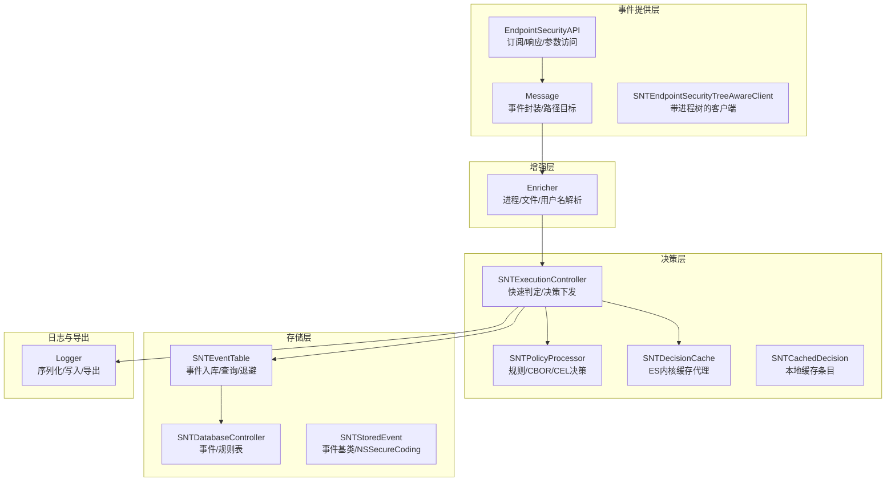
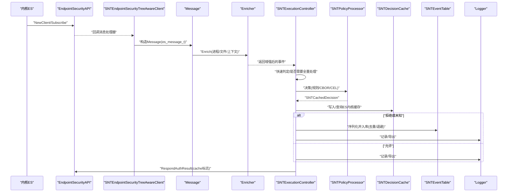
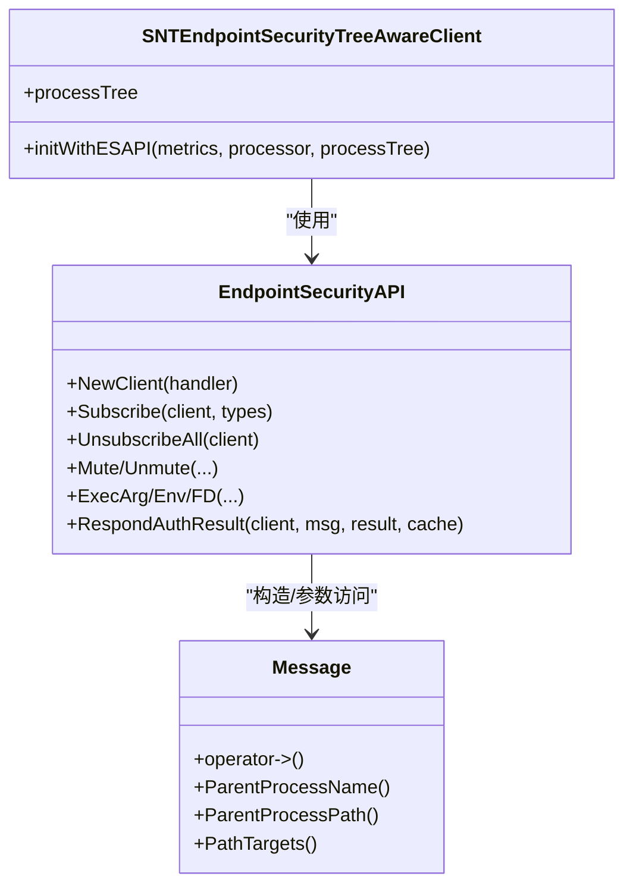
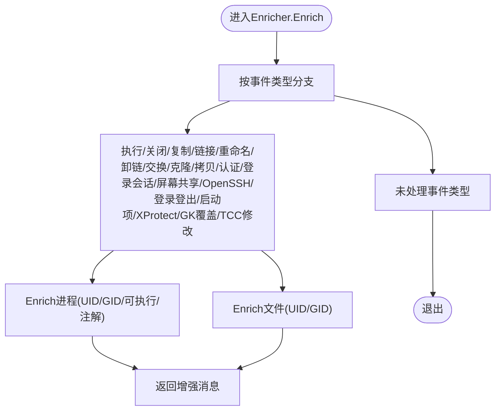
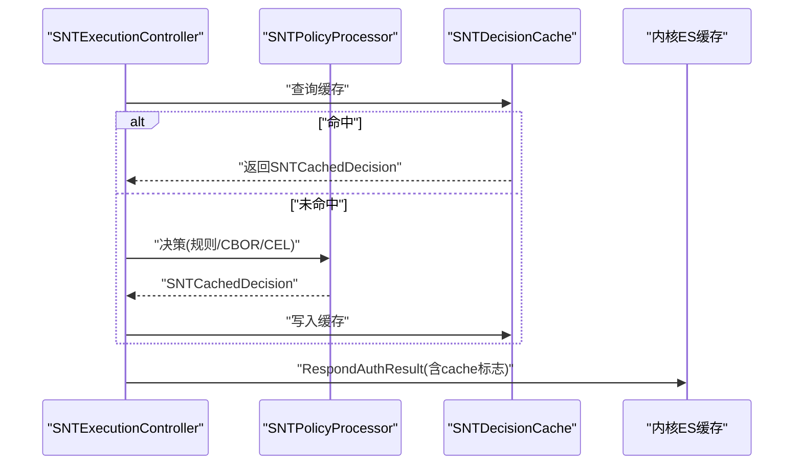
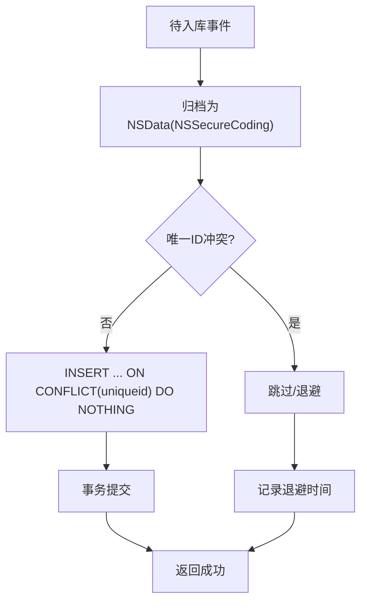
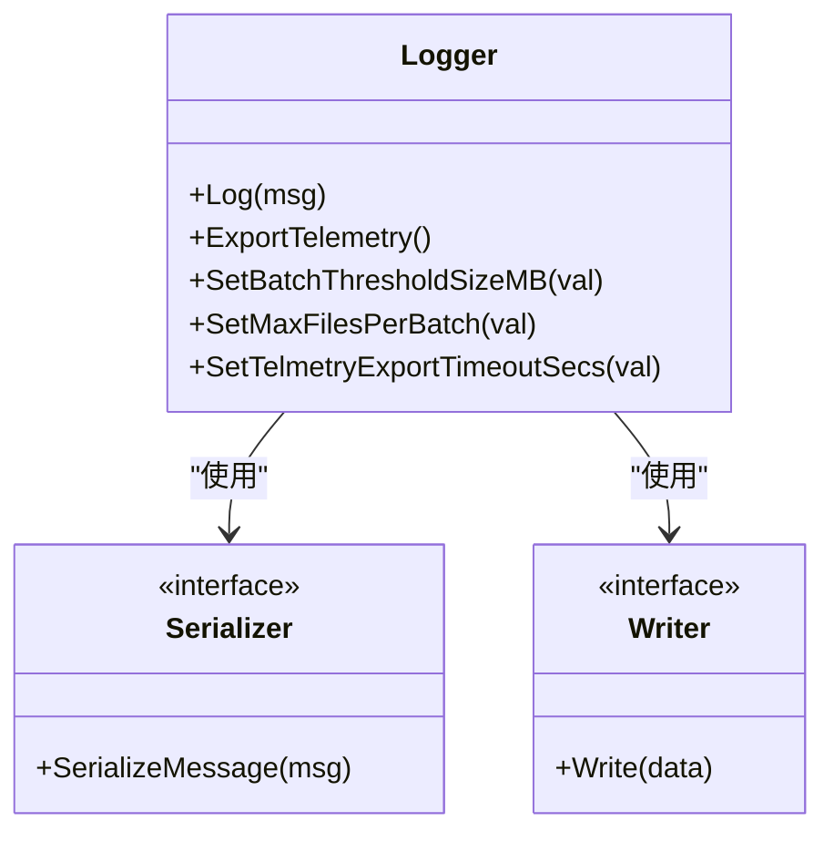
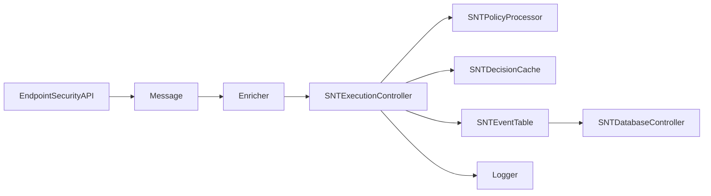

# 数据流设计

<cite>
**本文引用的文件**
- [Source/santad/EventProviders/EndpointSecurity/EndpointSecurityAPI.h](file://Source/santad/EventProviders/EndpointSecurity/EndpointSecurityAPI.h)
- [Source/santad/EventProviders/EndpointSecurity/Message.h](file://Source/santad/EventProviders/EndpointSecurity/Message.h)
- [Source/santad/EventProviders/EndpointSecurity/Enricher.h](file://Source/santad/EventProviders/EndpointSecurity/Enricher.h)
- [Source/santad/EventProviders/EndpointSecurity/Enricher.mm](file://Source/santad/EventProviders/EndpointSecurity/Enricher.mm)
- [Source/santad/EventProviders/SNTEndpointSecurityEventHandler.h](file://Source/santad/EventProviders/SNTEndpointSecurityEventHandler.h)
- [Source/santad/EventProviders/SNTEndpointSecurityTreeAwareClient.h](file://Source/santad/EventProviders/SNTEndpointSecurityTreeAwareClient.h)
- [Source/santad/SNTExecutionController.h](file://Source/santad/SNTExecutionController.h)
- [Source/santad/SNTDecisionCache.h](file://Source/santad/SNTDecisionCache.h)
- [Source/santad/SNTDecisionCache.mm](file://Source/santad/SNTDecisionCache.mm)
- [Source/common/SNTCachedDecision.h](file://Source/common/SNTCachedDecision.h)
- [Source/common/SNTCachedDecision.mm](file://Source/common/SNTCachedDecision.mm)
- [Source/santad/SNTPolicyProcessor.h](file://Source/santad/SNTPolicyProcessor.h)
- [Source/santad/DataLayer/SNTEventTable.h](file://Source/santad/DataLayer/SNTEventTable.h)
- [Source/santad/DataLayer/SNTEventTable.mm](file://Source/santad/DataLayer/SNTEventTable.mm)
- [Source/santad/SNTDatabaseController.h](file://Source/santad/SNTDatabaseController.h)
- [Source/common/SNTStoredEvent.h](file://Source/common/SNTStoredEvent.h)
- [Source/santad/Logs/EndpointSecurity/Logger.h](file://Source/santad/Logs/EndpointSecurity/Logger.h)
- [Source/santad/Logs/EndpointSecurity/Serializers/ProtobufTest.mm](file://Source/santad/Logs/EndpointSecurity/Serializers/ProtobufTest.mm)
- [docs/EndpointSecurity_Research_Report.md](file://docs/EndpointSecurity_Research_Report.md)
</cite>

## 目录
1. [引言](#引言)
2. [项目结构](#项目结构)
3. [核心组件](#核心组件)
4. [架构总览](#架构总览)
5. [详细组件分析](#详细组件分析)
6. [依赖关系分析](#依赖关系分析)
7. [性能考量](#性能考量)
8. [故障排查指南](#故障排查指南)
9. [结论](#结论)
10. [附录](#附录)

## 引言
本文件面向Santa系统的数据流设计，系统以macOS内核EndpointSecurity框架为入口，围绕“事件捕获—事件增强—策略评估—决策缓存—数据库持久化—日志导出/同步”的闭环展开。本文将详细说明各阶段的数据转换、组件间流转路径、数据格式与一致性保障，并给出混合实时/批量处理的设计思路、性能优化建议与监控方法。

## 项目结构
Santa的数据流主要分布在以下模块：
- 事件提供层：EndpointSecurity客户端、消息封装、进程树适配
- 增强层：基于进程树与用户/组信息的上下文增强
- 决策层：执行控制器、策略处理器、内核ES缓存与本地缓存
- 存储层：事件表、数据库控制器、持久化与去重
- 日志与导出：序列化、写入器、批量导出与同步队列

图表来源
- [Source/santad/EventProviders/EndpointSecurity/EndpointSecurityAPI.h](file://Source/santad/EventProviders/EndpointSecurity/EndpointSecurityAPI.h#L30-L78)
- [Source/santad/EventProviders/EndpointSecurity/Message.h](file://Source/santad/EventProviders/EndpointSecurity/Message.h#L30-L94)
- [Source/santad/EventProviders/SNTEndpointSecurityTreeAwareClient.h](file://Source/santad/EventProviders/SNTEndpointSecurityTreeAwareClient.h#L21-L29)
- [Source/santad/EventProviders/EndpointSecurity/Enricher.h](file://Source/santad/EventProviders/EndpointSecurity/Enricher.h#L35-L74)
- [Source/santad/SNTExecutionController.h](file://Source/santad/SNTExecutionController.h#L56-L107)
- [Source/santad/SNTPolicyProcessor.h](file://Source/santad/SNTPolicyProcessor.h#L40-L77)
- [Source/santad/SNTDecisionCache.h](file://Source/santad/SNTDecisionCache.h#L1-L200)
- [Source/common/SNTCachedDecision.h](file://Source/common/SNTCachedDecision.h#L1-L120)
- [Source/santad/SNTDatabaseController.h](file://Source/santad/SNTDatabaseController.h#L25-L41)
- [Source/santad/DataLayer/SNTEventTable.h](file://Source/santad/DataLayer/SNTEventTable.h#L43-L71)
- [Source/common/SNTStoredEvent.h](file://Source/common/SNTStoredEvent.h#L16-L36)
- [Source/santad/Logs/EndpointSecurity/Logger.h](file://Source/santad/Logs/EndpointSecurity/Logger.h#L47-L179)

章节来源
- [Source/santad/EventProviders/EndpointSecurity/EndpointSecurityAPI.h](file://Source/santad/EventProviders/EndpointSecurity/EndpointSecurityAPI.h#L30-L78)
- [Source/santad/EventProviders/EndpointSecurity/Message.h](file://Source/santad/EventProviders/EndpointSecurity/Message.h#L30-L94)
- [Source/santad/EventProviders/EndpointSecurity/Enricher.h](file://Source/santad/EventProviders/EndpointSecurity/Enricher.h#L35-L74)
- [Source/santad/EventProviders/SNTEndpointSecurityEventHandler.h](file://Source/santad/EventProviders/SNTEndpointSecurityEventHandler.h#L26-L38)
- [Source/santad/EventProviders/SNTEndpointSecurityTreeAwareClient.h](file://Source/santad/EventProviders/SNTEndpointSecurityTreeAwareClient.h#L21-L29)
- [Source/santad/SNTExecutionController.h](file://Source/santad/SNTExecutionController.h#L56-L107)
- [Source/santad/SNTPolicyProcessor.h](file://Source/santad/SNTPolicyProcessor.h#L40-L77)
- [Source/santad/SNTDecisionCache.h](file://Source/santad/SNTDecisionCache.h#L1-L200)
- [Source/common/SNTCachedDecision.h](file://Source/common/SNTCachedDecision.h#L1-L120)
- [Source/santad/SNTDatabaseController.h](file://Source/santad/SNTDatabaseController.h#L25-L41)
- [Source/santad/DataLayer/SNTEventTable.h](file://Source/santad/DataLayer/SNTEventTable.h#L43-L71)
- [Source/common/SNTStoredEvent.h](file://Source/common/SNTStoredEvent.h#L16-L36)
- [Source/santad/Logs/EndpointSecurity/Logger.h](file://Source/santad/Logs/EndpointSecurity/Logger.h#L47-L179)

## 核心组件
- EndpointSecurityAPI：封装ES客户端生命周期、订阅/取消订阅、静音控制、参数访问（如exec参数/环境变量/文件描述符）、响应内核授权结果与缓存标志。
- Message：对底层es_message_t的轻量封装，暴露事件类型、进程/文件目标、路径目标集合、父进程名/路径等便捷接口。
- Enricher：根据事件类型将原始ES对象增强为可序列化/可记录的结构，包含进程/文件/用户名/组名解析、进程树注解导出等。
- SNTExecutionController：执行事件的快速判定与决策下发，调用策略处理器生成决策，必要时落库并触发通知/同步。
- SNTPolicyProcessor：结合规则表、配置状态、签名检查器与CEL表达式激活，生成SNTCachedDecision。
- SNTDecisionCache：本地决策缓存，支持回填、时间戳复位映射、并发安全；与ES内核缓存协同。
- SNTEventTable/SNTDatabaseController：事件表负责入库、退避、查询与删除；数据库控制器提供统一表实例。
- SNTStoredEvent：事件基类，定义唯一ID、不可处置标记、安全编码协议。
- Logger：事件序列化、写入与导出，支持多格式（压缩/未压缩/分批），与同步队列协作。

章节来源
- [Source/santad/EventProviders/EndpointSecurity/EndpointSecurityAPI.h](file://Source/santad/EventProviders/EndpointSecurity/EndpointSecurityAPI.h#L30-L78)
- [Source/santad/EventProviders/EndpointSecurity/Message.h](file://Source/santad/EventProviders/EndpointSecurity/Message.h#L30-L94)
- [Source/santad/EventProviders/EndpointSecurity/Enricher.h](file://Source/santad/EventProviders/EndpointSecurity/Enricher.h#L35-L74)
- [Source/santad/SNTExecutionController.h](file://Source/santad/SNTExecutionController.h#L56-L107)
- [Source/santad/SNTPolicyProcessor.h](file://Source/santad/SNTPolicyProcessor.h#L40-L77)
- [Source/santad/SNTDecisionCache.h](file://Source/santad/SNTDecisionCache.h#L1-L200)
- [Source/common/SNTCachedDecision.h](file://Source/common/SNTCachedDecision.h#L1-L120)
- [Source/santad/SNTDatabaseController.h](file://Source/santad/SNTDatabaseController.h#L25-L41)
- [Source/santad/DataLayer/SNTEventTable.h](file://Source/santad/DataLayer/SNTEventTable.h#L43-L71)
- [Source/common/SNTStoredEvent.h](file://Source/common/SNTStoredEvent.h#L16-L36)
- [Source/santad/Logs/EndpointSecurity/Logger.h](file://Source/santad/Logs/EndpointSecurity/Logger.h#L47-L179)

## 架构总览
下图展示从内核事件到最终决策与持久化的端到端数据流：

图表来源
- [Source/santad/EventProviders/EndpointSecurity/EndpointSecurityAPI.h](file://Source/santad/EventProviders/EndpointSecurity/EndpointSecurityAPI.h#L30-L78)
- [Source/santad/EventProviders/SNTEndpointSecurityTreeAwareClient.h](file://Source/santad/EventProviders/SNTEndpointSecurityTreeAwareClient.h#L21-L29)
- [Source/santad/EventProviders/EndpointSecurity/Message.h](file://Source/santad/EventProviders/EndpointSecurity/Message.h#L30-L94)
- [Source/santad/EventProviders/EndpointSecurity/Enricher.h](file://Source/santad/EventProviders/EndpointSecurity/Enricher.h#L35-L74)
- [Source/santad/SNTExecutionController.h](file://Source/santad/SNTExecutionController.h#L56-L107)
- [Source/santad/SNTPolicyProcessor.h](file://Source/santad/SNTPolicyProcessor.h#L40-L77)
- [Source/santad/SNTDecisionCache.h](file://Source/santad/SNTDecisionCache.h#L1-L200)
- [Source/santad/DataLayer/SNTEventTable.h](file://Source/santad/DataLayer/SNTEventTable.h#L43-L71)
- [Source/santad/Logs/EndpointSecurity/Logger.h](file://Source/santad/Logs/EndpointSecurity/Logger.h#L47-L179)

## 详细组件分析

### 事件捕获与消息封装
- EndpointSecurityAPI提供客户端生命周期管理、订阅/取消订阅、静音控制、参数访问（exec arg/env/fd）以及向内核发送授权结果的能力。
- Message对底层es_message_t进行轻量封装，提供事件类型、父进程名/路径、路径目标集合等便捷访问，避免直接操作不安全指针。
- TreeAwareClient持有进程树，便于后续增强与策略评估。

图表来源
- [Source/santad/EventProviders/EndpointSecurity/EndpointSecurityAPI.h](file://Source/santad/EventProviders/EndpointSecurity/EndpointSecurityAPI.h#L30-L78)
- [Source/santad/EventProviders/EndpointSecurity/Message.h](file://Source/santad/EventProviders/EndpointSecurity/Message.h#L30-L94)
- [Source/santad/EventProviders/SNTEndpointSecurityTreeAwareClient.h](file://Source/santad/EventProviders/SNTEndpointSecurityTreeAwareClient.h#L21-L29)

章节来源
- [Source/santad/EventProviders/EndpointSecurity/EndpointSecurityAPI.h](file://Source/santad/EventProviders/EndpointSecurity/EndpointSecurityAPI.h#L30-L78)
- [Source/santad/EventProviders/EndpointSecurity/Message.h](file://Source/santad/EventProviders/EndpointSecurity/Message.h#L30-L94)
- [Source/santad/EventProviders/SNTEndpointSecurityTreeAwareClient.h](file://Source/santad/EventProviders/SNTEndpointSecurityTreeAwareClient.h#L21-L29)

### 事件增强与上下文丰富
- Enricher根据事件类型将原始ES对象增强为可序列化结构，包含进程/文件/用户名/组名解析、进程树注解导出等。
- 支持“仅本地”增强选项，避免触发外部进程工作，降低热路径开销。
- 增强结果用于后续策略评估与日志记录。

图表来源
- [Source/santad/EventProviders/EndpointSecurity/Enricher.mm](file://Source/santad/EventProviders/EndpointSecurity/Enricher.mm#L40-L195)
- [Source/santad/EventProviders/EndpointSecurity/Enricher.h](file://Source/santad/EventProviders/EndpointSecurity/Enricher.h#L35-L74)

章节来源
- [Source/santad/EventProviders/EndpointSecurity/Enricher.mm](file://Source/santad/EventProviders/EndpointSecurity/Enricher.mm#L40-L195)
- [Source/santad/EventProviders/EndpointSecurity/Enricher.h](file://Source/santad/EventProviders/EndpointSecurity/Enricher.h#L35-L74)

### 策略评估与决策缓存
- SNTExecutionController负责快速判定与决策下发，调用SNTPolicyProcessor生成SNTCachedDecision。
- SNTDecisionCache提供本地缓存，支持回填（基于运行中进程快照）与时间戳复位映射，减少重复计算。
- SNTCachedDecision承载决策结果与可缓存性标记，作为ES内核缓存与本地缓存的桥接。

图表来源
- [Source/santad/SNTExecutionController.h](file://Source/santad/SNTExecutionController.h#L56-L107)
- [Source/santad/SNTPolicyProcessor.h](file://Source/santad/SNTPolicyProcessor.h#L40-L77)
- [Source/santad/SNTDecisionCache.mm](file://Source/santad/SNTDecisionCache.mm#L73-L157)
- [Source/common/SNTCachedDecision.h](file://Source/common/SNTCachedDecision.h#L1-L120)

章节来源
- [Source/santad/SNTExecutionController.h](file://Source/santad/SNTExecutionController.h#L56-L107)
- [Source/santad/SNTPolicyProcessor.h](file://Source/santad/SNTPolicyProcessor.h#L40-L77)
- [Source/santad/SNTDecisionCache.mm](file://Source/santad/SNTDecisionCache.mm#L73-L157)
- [Source/common/SNTCachedDecision.h](file://Source/common/SNTCachedDecision.h#L1-L120)

### 数据库存储与一致性
- SNTEventTable负责事件入库（唯一ID去重、冲突忽略）、查询、计数与删除；支持对不可处置事件的退避策略（基于主哈希的时间窗口）。
- SNTStoredEvent定义事件基类与NSSecureCoding协议，确保序列化安全。
- SNTDatabaseController提供事件/规则表的单例访问，统一数据库队列。

图表来源
- [Source/santad/DataLayer/SNTEventTable.mm](file://Source/santad/DataLayer/SNTEventTable.mm#L135-L172)
- [Source/common/SNTStoredEvent.h](file://Source/common/SNTStoredEvent.h#L16-L36)
- [Source/santad/SNTDatabaseController.h](file://Source/santad/SNTDatabaseController.h#L25-L41)

章节来源
- [Source/santad/DataLayer/SNTEventTable.mm](file://Source/santad/DataLayer/SNTEventTable.mm#L135-L172)
- [Source/common/SNTStoredEvent.h](file://Source/common/SNTStoredEvent.h#L16-L36)
- [Source/santad/SNTDatabaseController.h](file://Source/santad/SNTDatabaseController.h#L25-L41)

### 日志导出与数据格式
- Logger负责事件序列化、写入与导出，支持多种日志类型与压缩方式，具备批量阈值、超时与文件数量限制。
- Protobuf测试验证了消息序列化/反序列化的一致性，确保事件时间戳与处理时间正确传递。

图表来源
- [Source/santad/Logs/EndpointSecurity/Logger.h](file://Source/santad/Logs/EndpointSecurity/Logger.h#L47-L179)
- [Source/santad/Logs/EndpointSecurity/Serializers/ProtobufTest.mm](file://Source/santad/Logs/EndpointSecurity/Serializers/ProtobufTest.mm#L296-L352)

章节来源
- [Source/santad/Logs/EndpointSecurity/Logger.h](file://Source/santad/Logs/EndpointSecurity/Logger.h#L47-L179)
- [Source/santad/Logs/EndpointSecurity/Serializers/ProtobufTest.mm](file://Source/santad/Logs/EndpointSecurity/Serializers/ProtobufTest.mm#L296-L352)

## 依赖关系分析
- 低耦合高内聚：事件提供层、增强层、决策层、存储层、日志层职责清晰，通过明确定义的接口交互。
- 关键依赖链：
  - ESAPI → Message → Enricher → ExecutionController
  - ExecutionController → PolicyProcessor → DecisionCache
  - ExecutionController → EventTable → DatabaseController
  - ExecutionController → Logger
- 缓存与一致性：
  - ES内核缓存与本地DecisionCache协同，避免规则变更导致的陈旧决策。
  - 事件入库采用唯一ID去重与退避策略，保证幂等与一致性。

图表来源
- [Source/santad/EventProviders/EndpointSecurity/EndpointSecurityAPI.h](file://Source/santad/EventProviders/EndpointSecurity/EndpointSecurityAPI.h#L30-L78)
- [Source/santad/EventProviders/EndpointSecurity/Message.h](file://Source/santad/EventProviders/EndpointSecurity/Message.h#L30-L94)
- [Source/santad/EventProviders/EndpointSecurity/Enricher.h](file://Source/santad/EventProviders/EndpointSecurity/Enricher.h#L35-L74)
- [Source/santad/SNTExecutionController.h](file://Source/santad/SNTExecutionController.h#L56-L107)
- [Source/santad/SNTPolicyProcessor.h](file://Source/santad/SNTPolicyProcessor.h#L40-L77)
- [Source/santad/SNTDecisionCache.h](file://Source/santad/SNTDecisionCache.h#L1-L200)
- [Source/santad/DataLayer/SNTEventTable.h](file://Source/santad/DataLayer/SNTEventTable.h#L43-L71)
- [Source/santad/SNTDatabaseController.h](file://Source/santad/SNTDatabaseController.h#L25-L41)
- [Source/santad/Logs/EndpointSecurity/Logger.h](file://Source/santad/Logs/EndpointSecurity/Logger.h#L47-L179)

章节来源
- [Source/santad/EventProviders/EndpointSecurity/EndpointSecurityAPI.h](file://Source/santad/EventProviders/EndpointSecurity/EndpointSecurityAPI.h#L30-L78)
- [Source/santad/EventProviders/EndpointSecurity/Message.h](file://Source/santad/EventProviders/EndpointSecurity/Message.h#L30-L94)
- [Source/santad/EventProviders/EndpointSecurity/Enricher.h](file://Source/santad/EventProviders/EndpointSecurity/Enricher.h#L35-L74)
- [Source/santad/SNTExecutionController.h](file://Source/santad/SNTExecutionController.h#L56-L107)
- [Source/santad/SNTPolicyProcessor.h](file://Source/santad/SNTPolicyProcessor.h#L40-L77)
- [Source/santad/SNTDecisionCache.h](file://Source/santad/SNTDecisionCache.h#L1-L200)
- [Source/santad/DataLayer/SNTEventTable.h](file://Source/santad/DataLayer/SNTEventTable.h#L43-L71)
- [Source/santad/SNTDatabaseController.h](file://Source/santad/SNTDatabaseController.h#L25-L41)
- [Source/santad/Logs/EndpointSecurity/Logger.h](file://Source/santad/Logs/EndpointSecurity/Logger.h#L47-L179)

## 性能考量
- 实时优先：快速判定与轻量处理在热路径上完成，避免阻塞线程；仅在必要时进行耗时的规则/CBOR/CEL评估。
- 缓存策略：
  - ES内核缓存：仅对ALLOW结果缓存，避免规则变更导致的陈旧DENY。
  - 本地DecisionCache：回填运行中进程快照，异步队列填充，降低启动期冷启动成本。
- 序列化与I/O：
  - 使用NSSecureCoding与ON CONFLICT去重，减少无效写入。
  - 日志导出支持批量阈值、超时与文件数量限制，避免瞬时高峰。
- 并发与退避：
  - 事件表对不可处置事件采用基于主哈希的时间窗口退避，降低重复处理压力。

章节来源
- [docs/EndpointSecurity_Research_Report.md](file://docs/EndpointSecurity_Research_Report.md#L570-L579)
- [Source/santad/SNTDecisionCache.mm](file://Source/santad/SNTDecisionCache.mm#L114-L157)
- [Source/santad/DataLayer/SNTEventTable.mm](file://Source/santad/DataLayer/SNTEventTable.mm#L135-L172)
- [Source/santad/Logs/EndpointSecurity/Logger.h](file://Source/santad/Logs/EndpointSecurity/Logger.h#L47-L179)

## 故障排查指南
- 决策缓存异常：
  - 检查本地DecisionCache的回填队列与统计指标，确认是否存在大量已缓存/跳过/失败。
  - 验证缓存命中率与未命中路径，定位是否频繁触发规则/CBOR/CEL评估。
- 事件入库问题：
  - 观察唯一ID冲突与退避策略是否生效，确认不可处置事件的处理逻辑。
  - 检查事务提交与错误日志，定位插入失败原因。
- 日志导出异常：
  - 校验序列化/反序列化一致性测试，确保事件时间戳与处理时间正确。
  - 调整批量阈值、超时与文件数量限制，观察导出队列积压情况。

章节来源
- [Source/santad/SNTDecisionCache.mm](file://Source/santad/SNTDecisionCache.mm#L114-L157)
- [Source/santad/DataLayer/SNTEventTable.mm](file://Source/santad/DataLayer/SNTEventTable.mm#L135-L172)
- [Source/santad/Logs/EndpointSecurity/Serializers/ProtobufTest.mm](file://Source/santad/Logs/EndpointSecurity/Serializers/ProtobufTest.mm#L296-L352)

## 结论
Santa的数据流以EndpointSecurity为入口，通过增强与策略评估实现快速决策，结合ES内核缓存与本地缓存提升吞吐，采用唯一ID去重与退避策略保障一致性，并通过日志导出与同步队列完成持久化与上报。该混合实时/批量架构在保证低延迟的同时兼顾了稳定性与可观测性。

## 附录
- 数据格式转换要点：
  - ES事件 → Message → EnrichedMessage → SNTStoredEvent → SQLite/NSSecureCoding
  - 日志导出：序列化为Protobuf/JSON，支持压缩与批量阈值
- 关键配置与监控：
  - 导出批量阈值、超时、最大文件数
  - 事件退避时间窗口
  - 缓存回填队列与命中率统计