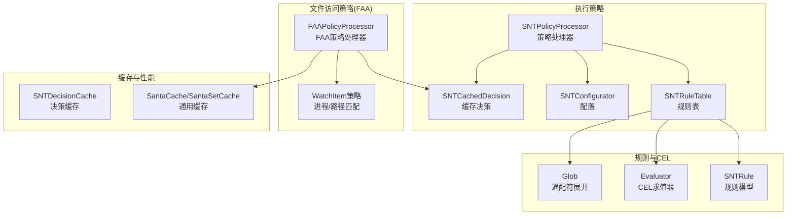
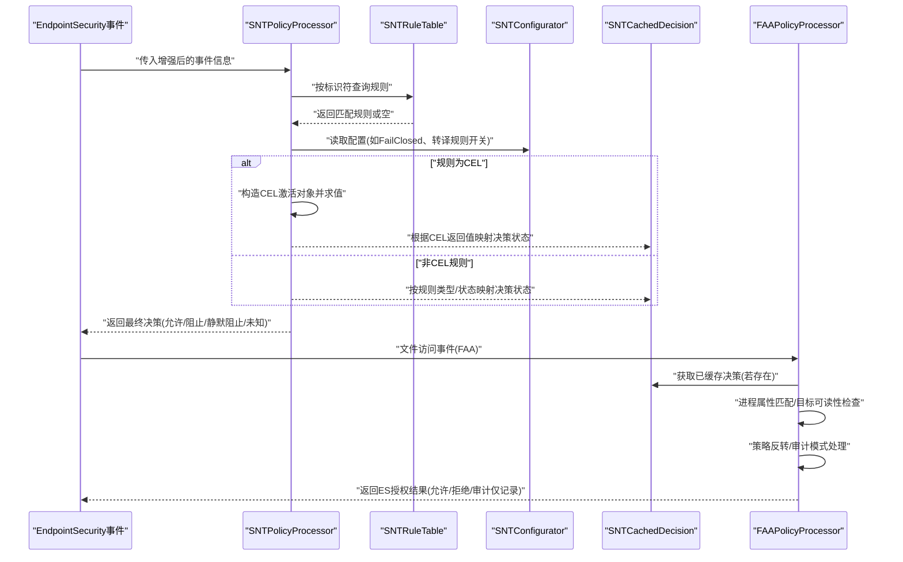
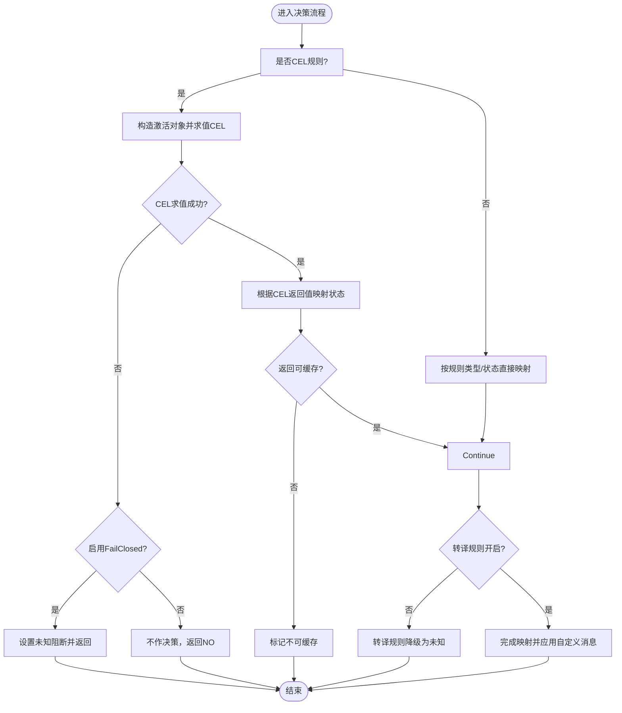
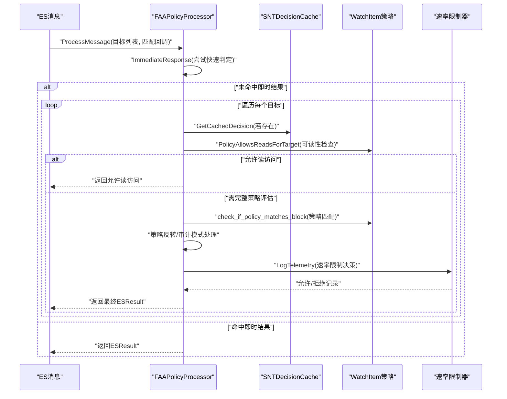
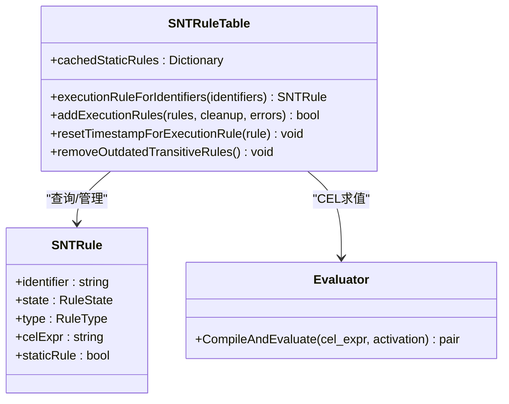
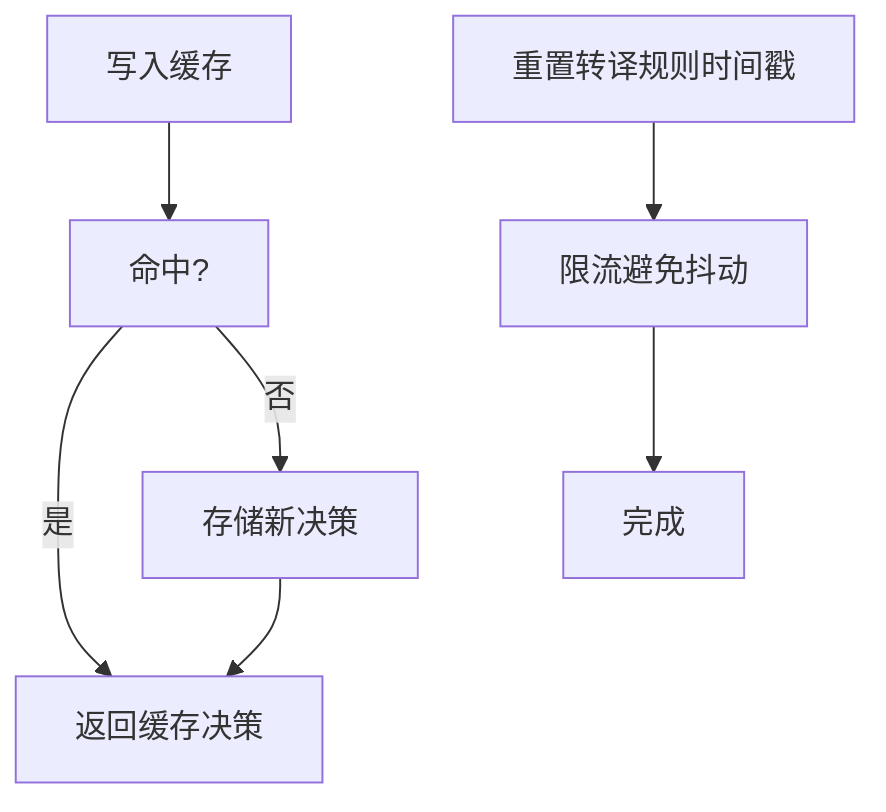
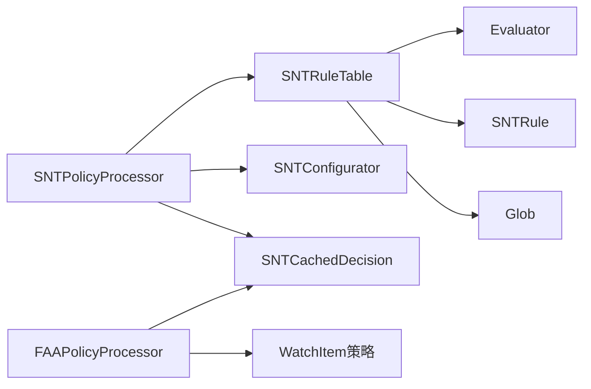

# 策略评估流程

<cite>
**本文引用的文件**
- [SNTPolicyProcessor.h](file://Source/santad/SNTPolicyProcessor.h)
- [SNTPolicyProcessor.mm](file://Source/santad/SNTPolicyProcessor.mm)
- [FAAPolicyProcessor.h](file://Source/santad/EventProviders/FAAPolicyProcessor.h)
- [FAAPolicyProcessor.mm](file://Source/santad/EventProviders/FAAPolicyProcessor.mm)
- [SNTDecisionCache.h](file://Source/santad/SNTDecisionCache.h)
- [SNTDecisionCache.mm](file://Source/santad/SNTDecisionCache.mm)
- [SNTRuleTable.h](file://Source/santad/DataLayer/SNTRuleTable.h)
- [SNTRuleTable.mm](file://Source/santad/DataLayer/SNTRuleTable.mm)
- [SNTConfigurator.h](file://Source/common/SNTConfigurator.h)
- [SNTConfigurator.mm](file://Source/common/SNTConfigurator.mm)
- [SNTCachedDecision.h](file://Source/common/SNTCachedDecision.h)
- [SNTRule.h](file://Source/common/SNTRule.h)
- [Evaluator.mm](file://Source/common/cel/Evaluator.mm)
- [Glob.mm](file://Source/common/Glob.mm)
- [SNTDaemonControlController.mm](file://Source/santad/SNTDaemonControlController.mm)
</cite>

## 目录
1. [引言](#引言)
2. [项目结构](#项目结构)
3. [核心组件](#核心组件)
4. [架构总览](#架构总览)
5. [详细组件分析](#详细组件分析)
6. [依赖关系分析](#依赖关系分析)
7. [性能考量](#性能考量)
8. [故障排查指南](#故障排查指南)
9. [结论](#结论)
10. [附录](#附录)

## 引言
本文件面向Santa系统中的策略评估流程，聚焦于“执行策略评估”与“文件访问策略（FAA）评估”的实现细节。内容涵盖：
- 执行策略：基于规则类型（二进制、证书、CDHash、Signing ID、Team ID）、静态/动态规则、CEL表达式、转译规则（transitive）与优先级处理，以及代码签名验证、路径匹配、决策映射与缓存。
- 文件访问策略（FAA）：基于WatchItem策略的即时判定、进程属性匹配、目标可读性判断、策略反转与审计模式、日志速率限制与传播。
- 决策结果生成、传播与异常处理；策略缓存机制、规则更新与清理；性能优化策略与最佳实践。

## 项目结构
Santa系统中与策略评估直接相关的模块主要分布在以下目录：
- 执行策略评估：SNTPolicyProcessor（策略处理器）、SNTRuleTable（规则表）、SNTConfigurator（配置）、SNTCachedDecision（缓存决策）
- 文件访问策略（FAA）：FAAPolicyProcessor（FAA策略处理器）、WatchItem策略定义与匹配
- 缓存与性能：SNTDecisionCache（决策缓存）、SantaCache/SantaSetCache（通用缓存容器）
- 规则与CEL：SNTRule（规则模型）、Evaluator（CEL求值器）、Glob（通配符路径展开）

图表来源
- [SNTPolicyProcessor.h](file://Source/santad/SNTPolicyProcessor.h#L40-L77)
- [SNTPolicyProcessor.mm](file://Source/santad/SNTPolicyProcessor.mm#L110-L309)
- [FAAPolicyProcessor.h](file://Source/santad/EventProviders/FAAPolicyProcessor.h#L1-L242)
- [FAAPolicyProcessor.mm](file://Source/santad/EventProviders/FAAPolicyProcessor.mm#L140-L400)
- [SNTDecisionCache.mm](file://Source/santad/SNTDecisionCache.mm#L39-L83)
- [SNTRuleTable.h](file://Source/santad/DataLayer/SNTRuleTable.h#L1-L172)
- [SNTRuleTable.mm](file://Source/santad/DataLayer/SNTRuleTable.mm#L1-L200)
- [SNTConfigurator.h](file://Source/common/SNTConfigurator.h#L1-L200)
- [SNTCachedDecision.h](file://Source/common/SNTCachedDecision.h#L1-L61)
- [SNTRule.h](file://Source/common/SNTRule.h#L1-L129)
- [Evaluator.mm](file://Source/common/cel/Evaluator.mm#L138-L189)
- [Glob.mm](file://Source/common/Glob.mm#L1-L137)

章节来源
- [SNTPolicyProcessor.h](file://Source/santad/SNTPolicyProcessor.h#L40-L77)
- [FAAPolicyProcessor.h](file://Source/santad/EventProviders/FAAPolicyProcessor.h#L1-L242)
- [SNTDecisionCache.mm](file://Source/santad/SNTDecisionCache.mm#L39-L83)
- [SNTRuleTable.h](file://Source/santad/DataLayer/SNTRuleTable.h#L1-L172)
- [SNTConfigurator.h](file://Source/common/SNTConfigurator.h#L1-L200)

## 核心组件
- 策略处理器（SNTPolicyProcessor）：负责将规则应用于增强后的事件（SNTCachedDecision），支持静态规则、动态规则、CEL表达式、转译规则（transitive）与优先级处理，并输出最终决策状态。
- 规则表（SNTRuleTable）：提供规则查询、添加、哈希校验、静态规则缓存、转译规则过期清理、内建CEL求值器。
- 配置（SNTConfigurator）：提供Fail Closed、静态规则、路径正则、转译规则开关、FAA日志速率限制等全局策略。
- 决策缓存（SNTDecisionCache）：以vnode为键缓存决策，支持命中、写入、重置时间戳、后台回填队列。
- FAA策略处理器（FAAPolicyProcessor）：针对文件访问事件，按WatchItem策略进行即时判定、进程属性匹配、目标可读性判断、策略反转与审计模式、日志速率限制与传播。
- 规则模型（SNTRule）与CEL求值器（Evaluator）：规则字段、CEL表达式、CEL v1/v2求值与返回值映射。
- 通配符路径（Glob）：用于策略路径的通配符展开与匹配。

章节来源
- [SNTPolicyProcessor.mm](file://Source/santad/SNTPolicyProcessor.mm#L110-L309)
- [SNTRuleTable.h](file://Source/santad/DataLayer/SNTRuleTable.h#L83-L172)
- [SNTConfigurator.h](file://Source/common/SNTConfigurator.h#L53-L120)
- [SNTDecisionCache.mm](file://Source/santad/SNTDecisionCache.mm#L39-L83)
- [FAAPolicyProcessor.mm](file://Source/santad/EventProviders/FAAPolicyProcessor.mm#L140-L400)
- [SNTRule.h](file://Source/common/SNTRule.h#L1-L129)
- [Evaluator.mm](file://Source/common/cel/Evaluator.mm#L138-L189)
- [Glob.mm](file://Source/common/Glob.mm#L1-L137)

## 架构总览
下图展示了从事件到决策的整体流程，包括执行策略与FAA策略两条主线：

图表来源
- [SNTPolicyProcessor.mm](file://Source/santad/SNTPolicyProcessor.mm#L110-L309)
- [FAAPolicyProcessor.mm](file://Source/santad/EventProviders/FAAPolicyProcessor.mm#L140-L400)
- [SNTDecisionCache.mm](file://Source/santad/SNTDecisionCache.mm#L39-L83)
- [SNTConfigurator.h](file://Source/common/SNTConfigurator.h#L53-L120)

## 详细组件分析

### 执行策略处理器（SNTPolicyProcessor）
- 规则匹配与优先级
  - 按规则类型（二进制、证书、CDHash、Signing ID、Team ID）与状态（允许、静默阻止、阻止、编译器/转译）进行决策映射。
  - 对于CEL规则，根据CEL返回值映射为ALLOWLIST/BLOCKLIST/REQUIRE_TOUCHID等，并据此设置决策状态与是否可缓存。
  - 若CEL求值失败且启用Fail Closed，则阻断未知事件。
  - 转译规则（transitive）与编译器规则在配置关闭时降级为未知或忽略。
- 代码签名验证与标识补充
  - 通过MOLCodesignChecker获取证书链、团队ID、Signing ID、CDHash、签名时间等，并进行平台二进制状态校验与过滤。
  - 当缺少团队ID但存在Signing ID时，依据平台二进制状态决定是否保留或清除Signing ID。
- 决策结果与消息
  - 将规则自定义消息与链接写入决策对象，供UI与日志使用。
  - 设置silentBlock标志以控制静默阻止行为。

图表来源
- [SNTPolicyProcessor.mm](file://Source/santad/SNTPolicyProcessor.mm#L110-L309)
- [Evaluator.mm](file://Source/common/cel/Evaluator.mm#L138-L189)
- [SNTConfigurator.h](file://Source/common/SNTConfigurator.h#L765-L771)

章节来源
- [SNTPolicyProcessor.h](file://Source/santad/SNTPolicyProcessor.h#L40-L77)
- [SNTPolicyProcessor.mm](file://Source/santad/SNTPolicyProcessor.mm#L110-L309)
- [SNTConfigurator.h](file://Source/common/SNTConfigurator.h#L765-L771)
- [SNTConfigurator.mm](file://Source/common/SNTConfigurator.mm#L1-L200)
- [SNTCachedDecision.h](file://Source/common/SNTCachedDecision.h#L1-L61)

### 文件访问策略处理器（FAAPolicyProcessor）
- 即时响应与进程匹配
  - 在完整策略评估前尝试快速判定，避免不必要的开销。
  - 进程属性匹配：平台二进制、Team ID、Signing ID（支持前后缀通配）、CDHash、证书哈希、二进制路径等。
- 目标可读性与策略反转
  - 对特定事件类型（如open/clone/copyfile）判断目标是否可读，满足“只读访问”场景。
  - 支持“路径与进程互斥”类策略的反转逻辑。
- 审计模式与日志速率限制
  - 审计仅模式将拒绝转换为允许但记录审计事件。
  - 使用速率限制器控制日志频率，避免噪声。
- 日志与传播
  - 异步写入日志并注入丰富上下文（进程、目标文件、策略版本与名称等）。
  - TTY消息去重缓存，避免重复提示。

图表来源
- [FAAPolicyProcessor.h](file://Source/santad/EventProviders/FAAPolicyProcessor.h#L120-L216)
- [FAAPolicyProcessor.mm](file://Source/santad/EventProviders/FAAPolicyProcessor.mm#L140-L400)
- [SNTDecisionCache.mm](file://Source/santad/SNTDecisionCache.mm#L39-L83)

章节来源
- [FAAPolicyProcessor.h](file://Source/santad/EventProviders/FAAPolicyProcessor.h#L1-L242)
- [FAAPolicyProcessor.mm](file://Source/santad/EventProviders/FAAPolicyProcessor.mm#L140-L400)
- [SNTDecisionCache.mm](file://Source/santad/SNTDecisionCache.mm#L39-L83)

### 规则表与CEL求值
- 规则查询与哈希
  - 提供按标识符（二进制、Signing ID、证书、Team ID）查询执行规则的方法。
  - 维护执行规则与FAA规则哈希，用于增量同步与一致性校验。
- 静态规则缓存
  - 从配置加载静态规则并缓存，作为本地优先规则集。
- CEL求值
  - 内建CEL v1/v2求值器，支持表达式编译与求值，返回ReturnValue枚举与是否可缓存。
  - 返回值映射至策略状态（允许/静默阻止/阻止/编译器等）。

图表来源
- [SNTRuleTable.h](file://Source/santad/DataLayer/SNTRuleTable.h#L83-L172)
- [SNTRuleTable.mm](file://Source/santad/DataLayer/SNTRuleTable.mm#L1-L200)
- [SNTRule.h](file://Source/common/SNTRule.h#L1-L129)
- [Evaluator.mm](file://Source/common/cel/Evaluator.mm#L138-L189)

章节来源
- [SNTRuleTable.h](file://Source/santad/DataLayer/SNTRuleTable.h#L1-L172)
- [SNTRuleTable.mm](file://Source/santad/DataLayer/SNTRuleTable.mm#L1-L200)
- [SNTRule.h](file://Source/common/SNTRule.h#L1-L129)
- [Evaluator.mm](file://Source/common/cel/Evaluator.mm#L138-L189)

### 决策缓存机制
- 结构与生命周期
  - 基于SantaVnode作为键的缓存，支持写入、条件写入（未命中才写）、命中查询。
  - 后台串行队列用于回填，平衡CPU占用与完成时间。
- 时间戳重置
  - 对转译规则的最后使用时间进行重置，避免过于频繁地重置导致抖动。
- 与规则表联动
  - 规则表在批量更新后可触发内核决策缓存刷新策略（由规则类型决定）。

图表来源
- [SNTDecisionCache.mm](file://Source/santad/SNTDecisionCache.mm#L39-L83)
- [SNTRuleTable.mm](file://Source/santad/DataLayer/SNTRuleTable.mm#L1-L200)

章节来源
- [SNTDecisionCache.h](file://Source/santad/SNTDecisionCache.h#L1-L60)
- [SNTDecisionCache.mm](file://Source/santad/SNTDecisionCache.mm#L39-L83)
- [SNTRuleTable.mm](file://Source/santad/DataLayer/SNTRuleTable.mm#L1-L200)

### 规则更新与清理
- 动态规则
  - 通过规则表批量添加执行规则，事务性保证一致性；可选择清理策略（全部/非转译）。
  - 可根据规则类型判断是否需要刷新内核决策缓存。
- 静态规则
  - 从配置加载静态规则数组，逐条校验并缓存，作为本地优先规则集。
- 转译规则清理
  - 当规则数量超过阈值或超出有效期（默认半年）时清理未使用的转译规则。

章节来源
- [SNTRuleTable.h](file://Source/santad/DataLayer/SNTRuleTable.h#L90-L172)
- [SNTRuleTable.mm](file://Source/santad/DataLayer/SNTRuleTable.mm#L1-L200)
- [SNTConfigurator.mm](file://Source/common/SNTConfigurator.mm#L1-L200)
- [SNTDaemonControlController.mm](file://Source/santad/SNTDaemonControlController.mm#L224-L256)

### 路径匹配与通配符
- 通配符展开
  - 对包含通配符的路径进行递归展开，支持多层通配与边界情况处理。
  - 限制最大路径组件数，防止过度递归。
- 策略路径匹配
  - 与WatchItem策略路径集合结合，支持前缀匹配与精确匹配。

章节来源
- [Glob.mm](file://Source/common/Glob.mm#L1-L137)

## 依赖关系分析
- 组件耦合
  - SNTPolicyProcessor依赖SNTRuleTable、SNTConfigurator与SNTCachedDecision；FAAPolicyProcessor依赖SNTDecisionCache与WatchItem策略。
  - 规则表内部持有CEL求值器与静态规则缓存，减少外部依赖。
- 外部集成点
  - EndpointSecurity事件源、内核决策缓存刷新、日志与指标系统。
- 循环依赖
  - 未发现循环依赖迹象；各模块职责清晰，接口单向依赖。

图表来源
- [SNTPolicyProcessor.mm](file://Source/santad/SNTPolicyProcessor.mm#L110-L309)
- [FAAPolicyProcessor.mm](file://Source/santad/EventProviders/FAAPolicyProcessor.mm#L140-L400)
- [SNTRuleTable.mm](file://Source/santad/DataLayer/SNTRuleTable.mm#L1-L200)
- [Evaluator.mm](file://Source/common/cel/Evaluator.mm#L138-L189)
- [Glob.mm](file://Source/common/Glob.mm#L1-L137)

章节来源
- [SNTPolicyProcessor.mm](file://Source/santad/SNTPolicyProcessor.mm#L110-L309)
- [FAAPolicyProcessor.mm](file://Source/santad/EventProviders/FAAPolicyProcessor.mm#L140-L400)
- [SNTRuleTable.mm](file://Source/santad/DataLayer/SNTRuleTable.mm#L1-L200)

## 性能考量
- 缓存优先
  - 优先命中SNTDecisionCache与证书哈希缓存，减少重复计算与系统调用。
- 速率限制
  - FAA日志采用滑动窗口速率限制，避免高频事件导致日志风暴。
- 后台回填
  - 决策缓存回填使用UTILITY队列，平衡吞吐与延迟。
- CEL求值
  - CEL表达式编译一次复用，返回值可缓存标记决定是否写入缓存。
- 转译规则清理
  - 定期清理未使用转译规则，降低数据库与内存压力。

章节来源
- [SNTDecisionCache.mm](file://Source/santad/SNTDecisionCache.mm#L39-L83)
- [FAAPolicyProcessor.mm](file://Source/santad/EventProviders/FAAPolicyProcessor.mm#L140-L400)
- [SNTRuleTable.mm](file://Source/santad/DataLayer/SNTRuleTable.mm#L1-L200)
- [Evaluator.mm](file://Source/common/cel/Evaluator.mm#L138-L189)

## 故障排查指南
- 执行策略CEL失败
  - 现象：CEL求值失败，若启用Fail Closed则阻断未知事件。
  - 排查：检查CEL表达式语法与激活对象字段完整性；确认配置项FailClosed状态。
- 决策未缓存
  - 现象：CEL返回不可缓存标记或规则类型不支持缓存。
  - 排查：确认CEL激活对象是否可缓存；检查规则类型与状态组合。
- 转译规则无效
  - 现象：转译规则被降级为未知或未生效。
  - 排查：确认配置中启用转译规则；检查规则类型是否为编译器规则。
- FAA策略未生效
  - 现象：策略未匹配或被反转。
  - 排查：核对进程属性（Team ID、Signing ID、CDHash、证书哈希、二进制路径）；检查策略反转与审计模式设置。
- 日志过多
  - 现象：日志量激增。
  - 排查：调整FAA日志速率限制参数；检查策略范围是否过大。

章节来源
- [SNTPolicyProcessor.mm](file://Source/santad/SNTPolicyProcessor.mm#L110-L309)
- [SNTConfigurator.h](file://Source/common/SNTConfigurator.h#L53-L120)
- [FAAPolicyProcessor.mm](file://Source/santad/EventProviders/FAAPolicyProcessor.mm#L140-L400)

## 结论
Santa的策略评估体系通过“执行策略处理器 + 规则表 + 配置 + 缓存”的协同，实现了对增强事件的高效授权决策；同时以“FAA策略处理器 + WatchItem策略 + 速率限制 + 缓存”的方式保障文件访问策略的实时性与稳定性。CEL表达式的引入提升了策略的灵活性，而严格的Fail Closed与转译规则清理机制确保了安全与性能的平衡。

## 附录
- 关键流程参考路径
  - 执行策略主流程：[SNTPolicyProcessor.decision:forRule:withTransitiveRules:andCELActivationCallback:](file://Source/santad/SNTPolicyProcessor.mm#L110-L309)
  - FAA策略主流程：[FAAPolicyProcessor.ProcessMessage](file://Source/santad/EventProviders/FAAPolicyProcessor.h#L139-L143)
  - 决策缓存操作：[SNTDecisionCache.cacheDecision/cachedDecisionForFile](file://Source/santad/SNTDecisionCache.mm#L73-L83)
  - 规则查询与CEL求值：[SNTRuleTable.executionRuleForIdentifiers](file://Source/santad/DataLayer/SNTRuleTable.h#L83-L90)、[Evaluator.CompileAndEvaluate](file://Source/common/cel/Evaluator.mm#L175-L189)
  - 静态规则加载：[SNTRuleTable.updateStaticRules](file://Source/santad/DataLayer/SNTRuleTable.h#L144-L147)、[SNTConfigurator.validateStaticRules](file://Source/common/SNTConfigurator.mm#L1978-L1997)
  - 转译规则清理：[SNTRuleTable.removeOutdatedTransitiveRules](file://Source/santad/DataLayer/SNTRuleTable.h#L129-L131)