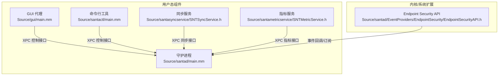
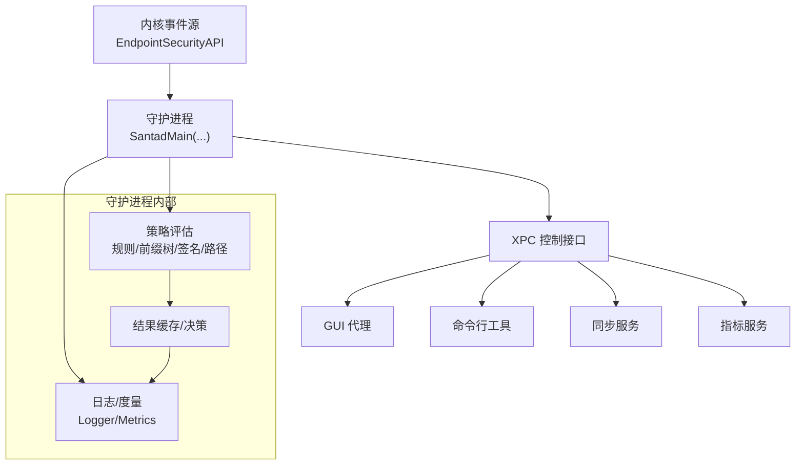
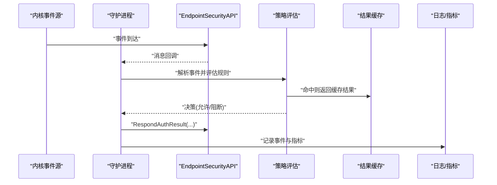
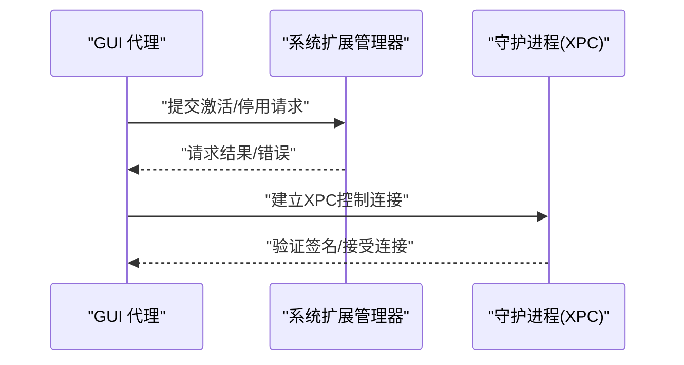
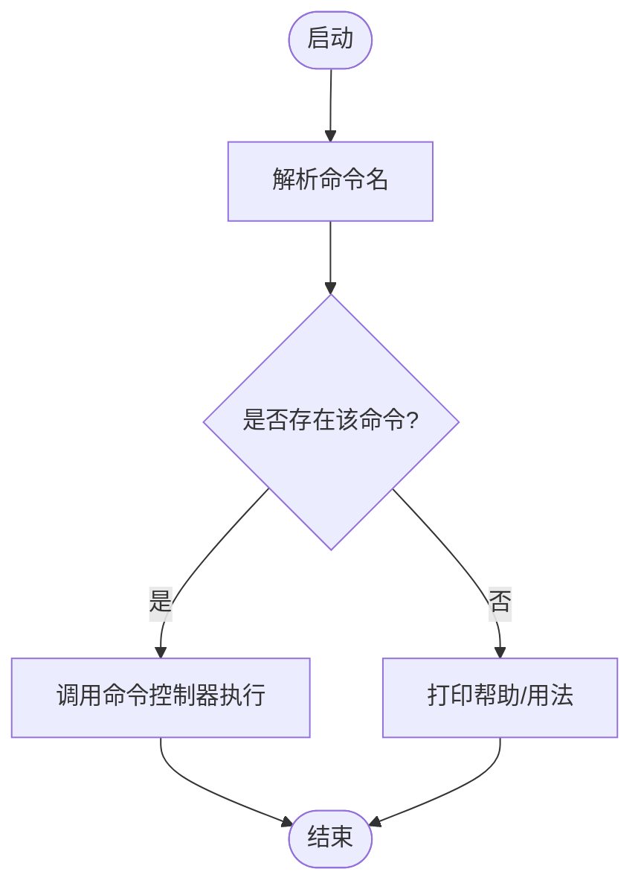
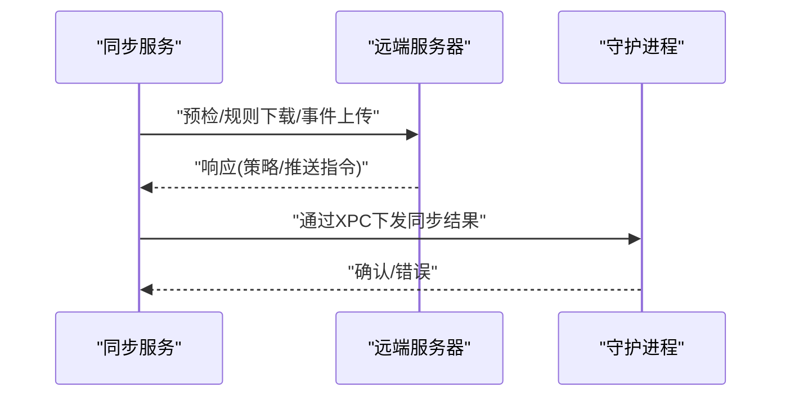
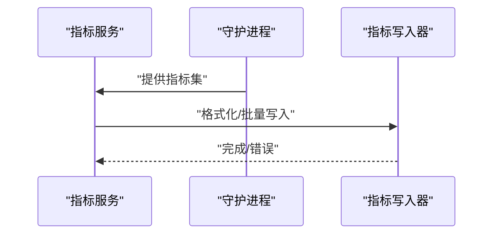
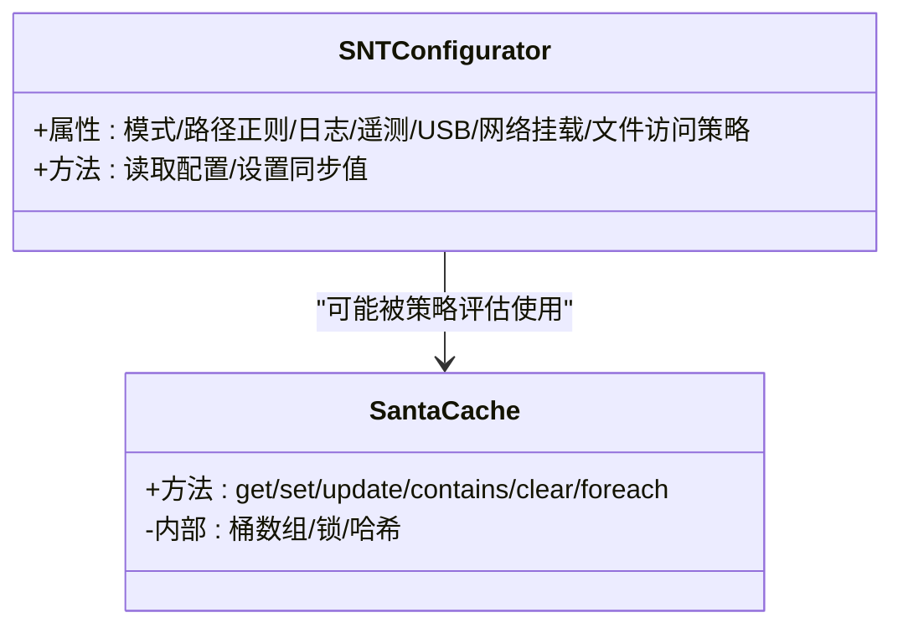
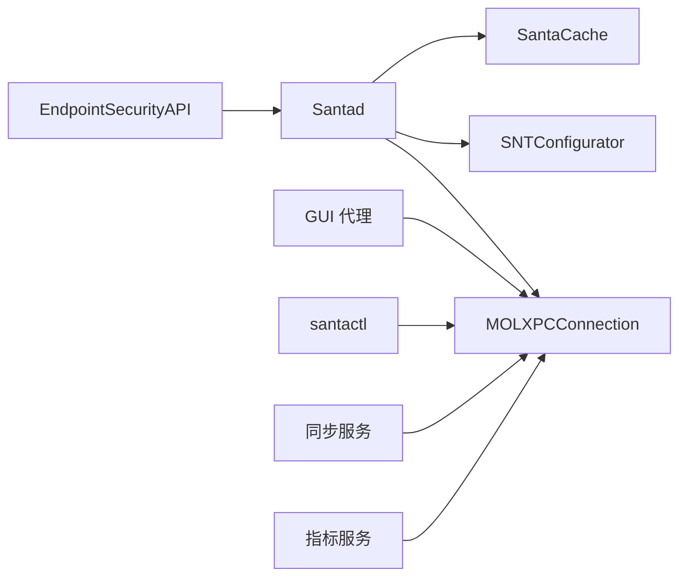
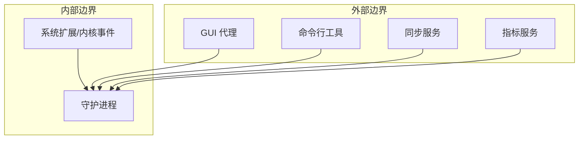

# 系统架构概述

<cite>
**本文引用的文件**
- [README.md](file://README.md)
- [Source/santad/main.mm](file://Source/santad/main.mm)
- [Source/santad/Santad.h](file://Source/santad/Santad.h)
- [Source/santad/SantadDeps.h](file://Source/santad/SantadDeps.h)
- [Source/santad/EventProviders/EndpointSecurity/EndpointSecurityAPI.h](file://Source/santad/EventProviders/EndpointSecurity/EndpointSecurityAPI.h)
- [Source/common/MOLXPCConnection.h](file://Source/common/MOLXPCConnection.h)
- [Source/common/SNTConfigurator.h](file://Source/common/SNTConfigurator.h)
- [Source/gui/main.mm](file://Source/gui/main.mm)
- [Source/santactl/main.mm](file://Source/santactl/main.mm)
- [Source/santametricservice/SNTMetricService.h](file://Source/santametricservice/SNTMetricService.h)
- [Source/santasyncservice/SNTSyncService.h](file://Source/santasyncservice/SNTSyncService.h)
- [Conf/com.northpolesec.santa.plist](file://Conf/com.northpolesec.santa.plist)
- [Source/common/SantaCache.h](file://Source/common/SantaCache.h)
</cite>

## 目录
1. [引言](#引言)
2. [项目结构](#项目结构)
3. [核心组件](#核心组件)
4. [架构总览](#架构总览)
5. [详细组件分析](#详细组件分析)
6. [依赖关系分析](#依赖关系分析)
7. [性能考量](#性能考量)
8. [故障排查指南](#故障排查指南)
9. [结论](#结论)
10. [附录](#附录)

## 引言
本文件面向架构师与高级开发者，系统性阐述 Santa 的整体架构设计与实现要点。Santa 是一个面向 macOS 的二进制与文件访问授权系统，由系统扩展（内核侧）捕获执行与文件访问事件，守护进程（用户态）进行策略评估与决策，GUI 代理负责用户交互，命令行工具提供管理能力，同步服务与指标服务分别承担远程配置同步与遥测上报。系统采用分层架构与微服务风格设计，结合事件驱动与 XPC 接口实现跨进程通信，强调职责分离、可扩展性与可观测性。

## 项目结构
Santa 的代码按功能域组织，核心模块包括：
- 系统扩展与守护进程：位于 Source/santad，负责事件采集、策略评估、日志与度量输出。
- GUI 代理：位于 Source/gui，提供用户交互界面与系统扩展加载/卸载入口。
- 命令行工具：位于 Source/santactl，提供规则管理、状态查询、诊断等功能。
- 同步与指标服务：位于 Source/santasyncservice 与 Source/santametricservice，分别负责策略同步与指标写入。
- 公共库与通用组件：位于 Source/common，包含 XPC 连接封装、缓存、配置、日志、序列化等。

**图表来源**
- [Source/santad/main.mm](file://Source/santad/main.mm#L104-L151)
- [Source/gui/main.mm](file://Source/gui/main.mm#L56-L94)
- [Source/santactl/main.mm](file://Source/santactl/main.mm#L39-L84)
- [Source/santasyncservice/SNTSyncService.h](file://Source/santasyncservice/SNTSyncService.h#L15-L21)
- [Source/santametricservice/SNTMetricService.h](file://Source/santametricservice/SNTMetricService.h#L15-L21)
- [Source/santad/EventProviders/EndpointSecurity/EndpointSecurityAPI.h](file://Source/santad/EventProviders/EndpointSecurity/EndpointSecurityAPI.h#L15-L80)

**章节来源**
- [README.md](file://README.md#L13-L21)
- [Conf/com.northpolesec.santa.plist](file://Conf/com.northpolesec.santa.plist#L1-L22)

## 核心组件
- 系统扩展与守护进程（santad）
  - 负责通过 Endpoint Security API 订阅内核事件，解析并评估策略，决定允许或阻断，并记录事件与度量。
  - 提供 XPC 接口供 GUI、CLI、同步与指标服务进行控制与查询。
- GUI 代理
  - 提供用户交互界面；支持通过系统扩展请求加载/卸载系统扩展；与守护进程通过 XPC 通信。
- 命令行工具（santactl）
  - 将复杂管理任务拆分为多个子命令，统一通过 XPC 与守护进程交互。
- 同步服务（santasyncservice）
  - 从远端服务器拉取策略与配置，推送事件与统计，支持推送通知触发全量同步。
- 指标服务（santametricservice）
  - 将运行时指标以多种格式写入文件或 HTTP，支持聚合与导出。
- 配置与缓存
  - SNTConfigurator 提供集中式配置读取与变更通知；SantaCache 提供高性能并发缓存。

**章节来源**
- [Source/santad/main.mm](file://Source/santad/main.mm#L104-L151)
- [Source/gui/main.mm](file://Source/gui/main.mm#L56-L94)
- [Source/santactl/main.mm](file://Source/santactl/main.mm#L39-L84)
- [Source/santasyncservice/SNTSyncService.h](file://Source/santasyncservice/SNTSyncService.h#L15-L21)
- [Source/santametricservice/SNTMetricService.h](file://Source/santametricservice/SNTMetricService.h#L15-L21)
- [Source/common/SNTConfigurator.h](file://Source/common/SNTConfigurator.h#L1-L120)
- [Source/common/SantaCache.h](file://Source/common/SantaCache.h#L48-L120)

## 架构总览
Santa 采用“内核事件驱动 + 用户态策略引擎”的分层架构：
- 分层架构
  - 内核层：通过 Endpoint Security API 获取执行与文件访问事件。
  - 应用层：santad 聚合事件、评估规则、生成决策、记录日志与指标。
  - 服务层：GUI、CLI、同步与指标服务通过 XPC 与守护进程交互。
- 微服务风格
  - 各服务相对独立，通过 XPC 接口解耦；同步与指标服务可独立部署与扩展。
- 事件驱动
  - 内核事件作为触发点，santad 在内存中快速评估并落盘持久化，异步完成日志与指标输出。

**图表来源**
- [Source/santad/Santad.h](file://Source/santad/Santad.h#L35-L51)
- [Source/santad/EventProviders/EndpointSecurity/EndpointSecurityAPI.h](file://Source/santad/EventProviders/EndpointSecurity/EndpointSecurityAPI.h#L15-L80)
- [Source/common/MOLXPCConnection.h](file://Source/common/MOLXPCConnection.h#L54-L155)

## 详细组件分析

### 守护进程（santad）与系统扩展集成
- 入口与依赖注入
  - main.mm 中创建守护进程依赖集合（SantadDeps），传入 ESAPI、Logger、Metrics、WatchItems、Enricher、AuthResultCache、XPC 控制连接、编译器控制器、通知队列、同步队列、执行控制器、前缀树、TTYWriter、进程树、权限过滤器等。
  - 调用 SantadMain(...) 启动事件循环与策略评估主流程。
- Endpoint Security 集成
  - 通过 EndpointSecurityAPI 订阅事件类型、设置路径/进程静音、响应认证结果、释放消息等。
- 职责分离
  - 事件采集（ESAPI）、策略评估（策略/签名/路径/前缀树）、结果缓存（AuthResultCache）、日志与指标（Logger/Metrics）、通知与同步（NotifierQueue/SyncdQueue）各司其职。

**图表来源**
- [Source/santad/main.mm](file://Source/santad/main.mm#L137-L147)
- [Source/santad/Santad.h](file://Source/santad/Santad.h#L35-L51)
- [Source/santad/EventProviders/EndpointSecurity/EndpointSecurityAPI.h](file://Source/santad/EventProviders/EndpointSecurity/EndpointSecurityAPI.h#L30-L75)

**章节来源**
- [Source/santad/main.mm](file://Source/santad/main.mm#L104-L151)
- [Source/santad/SantadDeps.h](file://Source/santad/SantadDeps.h#L43-L102)
- [Source/santad/Santad.h](file://Source/santad/Santad.h#L35-L51)
- [Source/santad/EventProviders/EndpointSecurity/EndpointSecurityAPI.h](file://Source/santad/EventProviders/EndpointSecurity/EndpointSecurityAPI.h#L15-L80)

### GUI 代理与系统扩展加载
- GUI 代理在启动时根据参数选择加载或卸载系统扩展，使用 OSSystemExtensionRequest 与系统扩展管理器交互，并通过委托监听请求结果。
- GUI 与守护进程通过 XPC 控制接口通信，确保签名一致后才建立连接。

**图表来源**
- [Source/gui/main.mm](file://Source/gui/main.mm#L56-L94)
- [Source/common/MOLXPCConnection.h](file://Source/common/MOLXPCConnection.h#L54-L155)

**章节来源**
- [Source/gui/main.mm](file://Source/gui/main.mm#L56-L94)
- [Source/common/MOLXPCConnection.h](file://Source/common/MOLXPCConnection.h#L54-L155)

### 命令行工具（santactl）与命令分发
- 主程序解析命令名称，将具体操作委派给命令控制器，最终通过 XPC 执行相应管理操作。
- 支持 doctor、metrics、rule、status、sync、telemetry 等命令。

**图表来源**
- [Source/santactl/main.mm](file://Source/santactl/main.mm#L39-L84)

**章节来源**
- [Source/santactl/main.mm](file://Source/santactl/main.mm#L39-L84)

### 同步服务（santasyncservice）
- 提供与远端服务器的策略同步、事件上传、推送通知、预检/后置处理等能力。
- 通过 XPC 接口与守护进程交互，接收策略更新并触发本地数据库与规则表更新。

**图表来源**
- [Source/santasyncservice/SNTSyncService.h](file://Source/santasyncservice/SNTSyncService.h#L15-L21)
- [Source/common/MOLXPCConnection.h](file://Source/common/MOLXPCConnection.h#L54-L155)

**章节来源**
- [Source/santasyncservice/SNTSyncService.h](file://Source/santasyncservice/SNTSyncService.h#L15-L21)

### 指标服务（santametricservice）
- 将运行时指标以多种格式写入文件或 HTTP，支持聚合与导出。
- 通过 XPC 接口与守护进程交互，获取指标集并进行格式化输出。

**图表来源**
- [Source/santametricservice/SNTMetricService.h](file://Source/santametricservice/SNTMetricService.h#L15-L21)
- [Source/common/MOLXPCConnection.h](file://Source/common/MOLXPCConnection.h#L54-L155)

**章节来源**
- [Source/santametricservice/SNTMetricService.h](file://Source/santametricservice/SNTMetricService.h#L15-L21)

### 配置与缓存
- SNTConfigurator 提供集中式配置读取与变更通知，覆盖模式、路径正则、事件日志、遥测导出、USB/网络挂载策略、文件访问策略等。
- SantaCache 提供高性能并发哈希表，支持按桶加锁、容量上限与清空、遍历与条件查询等，用于缓存策略评估结果与元数据。

**图表来源**
- [Source/common/SNTConfigurator.h](file://Source/common/SNTConfigurator.h#L1-L200)
- [Source/common/SantaCache.h](file://Source/common/SantaCache.h#L48-L120)

**章节来源**
- [Source/common/SNTConfigurator.h](file://Source/common/SNTConfigurator.h#L1-L200)
- [Source/common/SantaCache.h](file://Source/common/SantaCache.h#L48-L120)

## 依赖关系分析
- 组件耦合与内聚
  - 守护进程通过 SantadDeps 注入所有依赖，保持高内聚低耦合；各子系统（ES、策略、日志、指标、通知、同步）通过接口隔离。
- 外部依赖与集成点
  - Endpoint Security API 作为内核事件源；XPC 作为跨进程通信协议；LaunchDaemon/launchd 作为服务生命周期管理。
- 可能的循环依赖
  - 通过接口与依赖注入避免直接循环引用；公共库（SNTConfigurator、MOLXPCConnection、SantaCache）被多模块复用。

**图表来源**
- [Source/santad/SantadDeps.h](file://Source/santad/SantadDeps.h#L43-L102)
- [Source/common/MOLXPCConnection.h](file://Source/common/MOLXPCConnection.h#L54-L155)
- [Source/common/SNTConfigurator.h](file://Source/common/SNTConfigurator.h#L1-L120)
- [Source/common/SantaCache.h](file://Source/common/SantaCache.h#L48-L120)

**章节来源**
- [Source/santad/SantadDeps.h](file://Source/santad/SantadDeps.h#L43-L102)
- [Source/common/MOLXPCConnection.h](file://Source/common/MOLXPCConnection.h#L54-L155)

## 性能考量
- 缓存优化
  - 使用按桶加锁的并发哈希表减少锁竞争；命中即返回，降低重复计算成本。
- 日志与事件落盘
  - 采用分片/流式/压缩等多种日志格式，限制单文件大小与总量，避免磁盘压力过大。
- 事件处理
  - 仅对未知或阻断事件进行持久化与告警，允许已知且白名单事件快速放行。
- 资源监控
  - 守护进程内置看门狗线程，周期性检查 CPU/内存占用，超阈报警并记录峰值。

**章节来源**
- [Source/common/SantaCache.h](file://Source/common/SantaCache.h#L48-L120)
- [Source/common/SNTConfigurator.h](file://Source/common/SNTConfigurator.h#L190-L320)
- [Source/santad/main.mm](file://Source/santad/main.mm#L40-L89)

## 故障排查指南
- 看门狗告警
  - 若出现 CPU/内存占用异常峰值，查看看门狗日志与计数器，定位热点路径或内存泄漏。
- XPC 连接问题
  - 确认客户端与守护进程证书一致并通过签名验证；检查 invalidationHandler 回调与连接状态。
- 同步失败
  - 检查同步服务的预检/规则下载/事件上传响应，确认网络代理与证书链配置正确。
- 日志与指标
  - 根据配置的日志类型与导出阈值，确认日志轮转与导出是否正常。

**章节来源**
- [Source/santad/main.mm](file://Source/santad/main.mm#L40-L89)
- [Source/common/MOLXPCConnection.h](file://Source/common/MOLXPCConnection.h#L54-L155)
- [Source/santasyncservice/SNTSyncService.h](file://Source/santasyncservice/SNTSyncService.h#L15-L21)
- [Source/santametricservice/SNTMetricService.h](file://Source/santametricservice/SNTMetricService.h#L15-L21)

## 结论
Santa 通过“内核事件驱动 + 用户态策略引擎”的架构，实现了对 macOS 上二进制与文件访问的细粒度控制。系统采用分层与微服务风格设计，结合 XPC 接口与职责分离，既保证了安全策略的高效执行，也提供了良好的可观测性与可运维性。系统扩展负责事件捕获，守护进程负责策略评估与决策，GUI 与 CLI 提供用户交互与管理，同步与指标服务支撑远程治理与观测闭环。

## 附录
- 系统边界图（概念示意）
  - 内核事件源（系统扩展）与用户态守护进程构成核心边界；GUI、CLI、同步与指标服务位于外部边界，通过 XPC 与守护进程交互。

