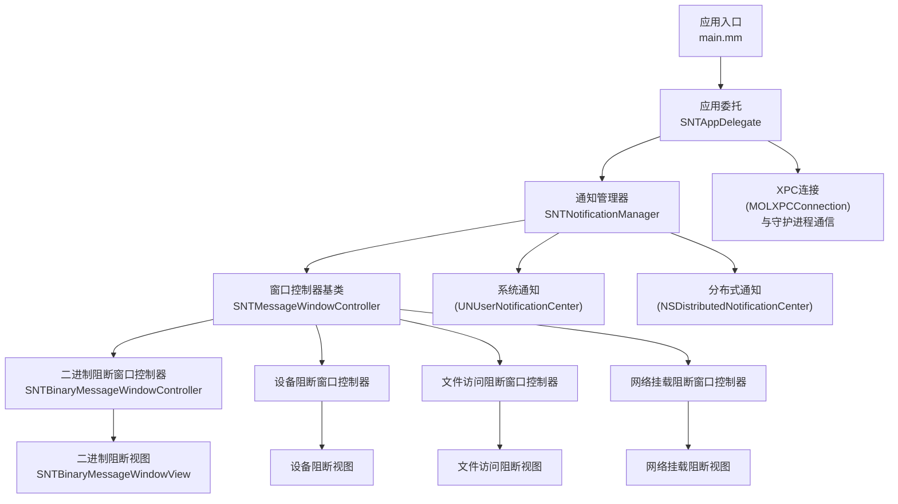
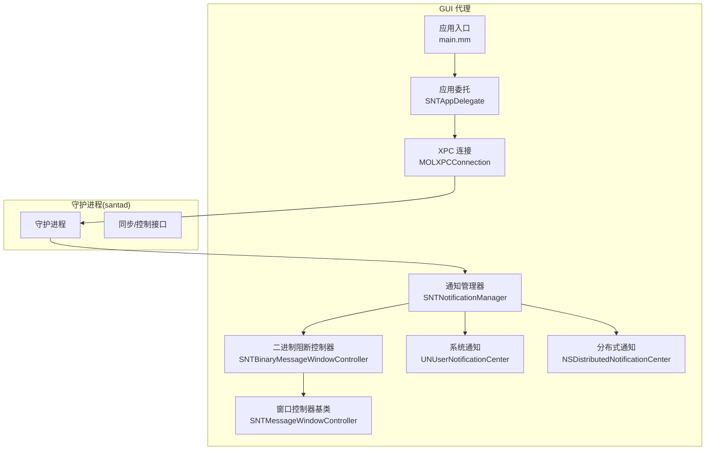
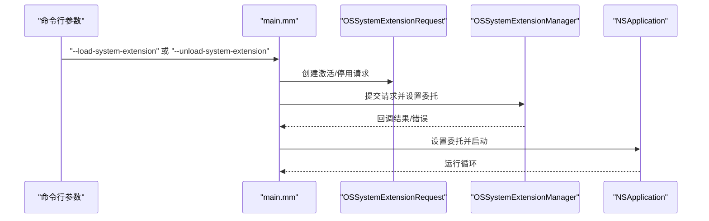
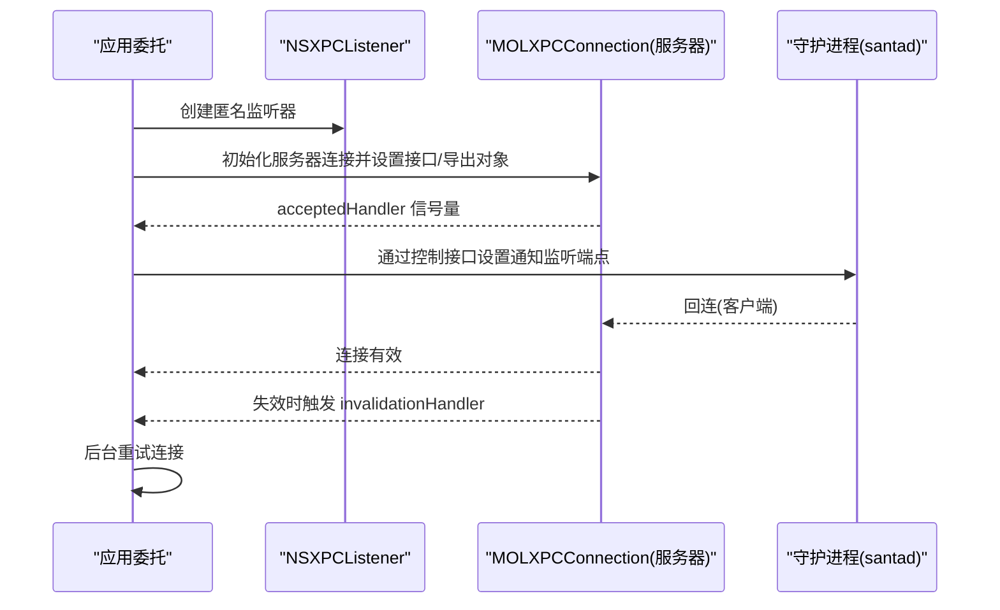
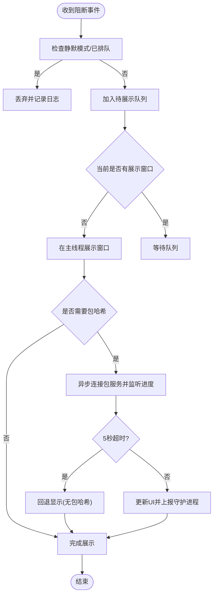
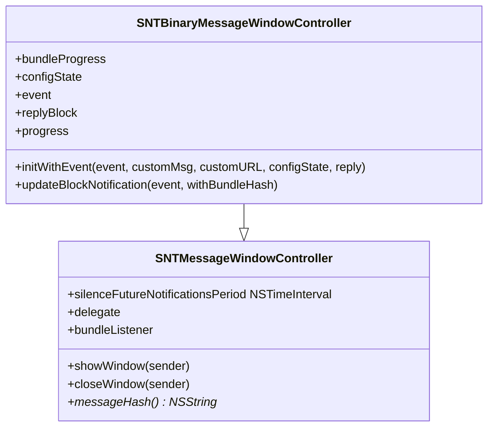
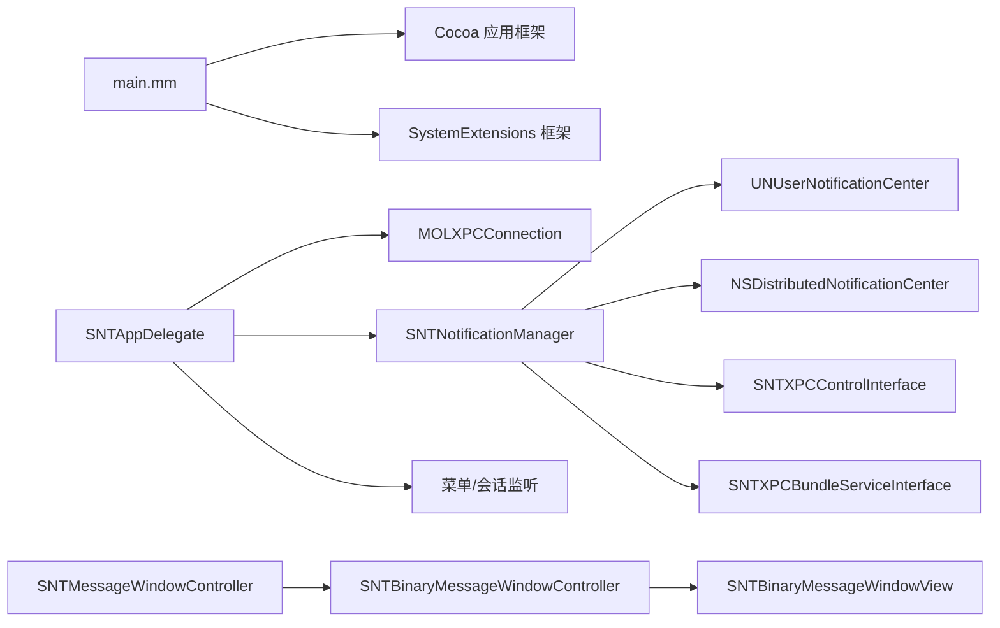

# GUI代理应用

<cite>
**本文引用的文件**
- [main.mm](file://Source/gui/main.mm)
- [SNTAppDelegate.h](file://Source/gui/SNTAppDelegate.h)
- [SNTAppDelegate.mm](file://Source/gui/SNTAppDelegate.mm)
- [SNTNotificationManager.h](file://Source/gui/SNTNotificationManager.h)
- [SNTNotificationManager.mm](file://Source/gui/SNTNotificationManager.mm)
- [SNTMessageWindowController.h](file://Source/gui/SNTMessageWindowController.h)
- [SNTMessageWindowController.mm](file://Source/gui/SNTMessageWindowController.mm)
- [SNTBinaryMessageWindowController.h](file://Source/gui/SNTBinaryMessageWindowController.h)
- [SNTBinaryMessageWindowController.mm](file://Source/gui/SNTBinaryMessageWindowController.mm)
- [SNTAboutWindowController.h](file://Source/gui/SNTAboutWindowController.h)
- [SNTAboutWindowView.swift](file://Source/gui/SNTAboutWindowView.swift)
- [SNTBinaryMessageWindowView.swift](file://Source/gui/SNTBinaryMessageWindowView.swift)
- [SNTDeviceMessageWindowView.swift](file://Source/gui/SNTDeviceMessageWindowView.swift)
- [SNTFileAccessMessageWindowView.swift](file://Source/gui/SNTFileAccessMessageWindowView.swift)
- [SNTFileInfoView.swift](file://Source/gui/SNTFileInfoView.swift)
- [SNTNetworkMountMessageWindowView.swift](file://Source/gui/SNTNetworkMountMessageWindowView.swift)
- [SNTMessageView.swift](file://Source/gui/SNTMessageView.swift)
- [en.lproj/Localizable.strings](file://Source/gui/Resources/en.lproj/Localizable.strings)
- [de.lproj/Localizable.strings](file://Source/gui/Resources/de.lproj/Localizable.strings)
- [ja.lproj/Localizable.strings](file://Source/gui/Resources/ja.lproj/Localizable.strings)
</cite>

## 目录
1. [简介](#简介)
2. [项目结构](#项目结构)
3. [核心组件](#核心组件)
4. [架构总览](#架构总览)
5. [组件详解](#组件详解)
6. [依赖关系分析](#依赖关系分析)
7. [性能考量](#性能考量)
8. [故障排查指南](#故障排查指南)
9. [结论](#结论)
10. [附录](#附录)

## 简介
本文件为 Santa GUI 代理应用的技术文档，聚焦于 GUI 代理的应用程序生命周期管理、窗口控制器架构与用户界面组件设计；详述通知管理系统（系统通知、弹窗消息与用户交互）；阐述 GUI 通过 XPC 接口与守护进程通信的消息传递与事件响应机制；并说明国际化支持、主题切换与用户体验优化策略。文档同时提供架构图、消息流图与用户交互流程，帮助 UI/UX 设计师与前端开发者快速理解并高效实现。

## 项目结构
GUI 代理位于 Source/gui 目录，采用“应用入口 + 应用委托 + 通知管理器 + 窗口控制器 + Swift 视图”的分层组织方式：
- 应用入口：负责系统扩展请求与应用启动主循环
- 应用委托：负责菜单设置、会话激活/非激活监听、与守护进程的 XPC 连接建立与重连
- 通知管理器：统一排队与展示弹窗，发布分布式通知，调用系统通知，处理静音与进度回调
- 窗口控制器：抽象窗口控制器基类与二进制/设备/文件访问/网络挂载等专用控制器
- Swift 视图：各类型消息对应的视图与信息展示视图

图表来源
- [main.mm](file://Source/gui/main.mm#L56-L94)
- [SNTAppDelegate.mm](file://Source/gui/SNTAppDelegate.mm#L40-L181)
- [SNTNotificationManager.mm](file://Source/gui/SNTNotificationManager.mm#L1-L504)
- [SNTMessageWindowController.mm](file://Source/gui/SNTMessageWindowController.mm#L21-L78)
- [SNTBinaryMessageWindowController.mm](file://Source/gui/SNTBinaryMessageWindowController.mm#L80-L126)

章节来源
- [main.mm](file://Source/gui/main.mm#L56-L94)
- [SNTAppDelegate.mm](file://Source/gui/SNTAppDelegate.mm#L40-L181)

## 核心组件
- 应用入口与系统扩展交互：处理 --load-system-extension/--unload-system-extension 参数，调用 OSSystemExtensionRequest 完成系统扩展的激活/停用请求，并在主线程运行应用。
- 应用委托：初始化菜单、监听工作空间会话状态变化以触发 XPC 连接重建；建立匿名监听器并通过 XPC 将端点回传给守护进程，等待守护进程回连；处理应用激活策略与窗口关闭后的策略恢复；处理打开 URL 的拖拽事件。
- 通知管理器：维护当前展示窗口与待展示队列；根据配置与用户静音设置决定是否展示；发布分布式通知；调用系统通知；对二进制阻断事件异步计算包哈希并上报守护进程；处理包服务进度回调。
- 窗口控制器：统一窗口行为（显示/关闭/居中/激活），实现静音期回调；派生控制器承载具体事件数据与 UI 状态回调。
- Swift 视图：按事件类型渲染详情、证书信息、授权按钮、进度条与更多详情对话框。

章节来源
- [SNTAppDelegate.mm](file://Source/gui/SNTAppDelegate.mm#L40-L181)
- [SNTNotificationManager.mm](file://Source/gui/SNTNotificationManager.mm#L60-L504)
- [SNTMessageWindowController.mm](file://Source/gui/SNTMessageWindowController.mm#L21-L78)
- [SNTBinaryMessageWindowController.mm](file://Source/gui/SNTBinaryMessageWindowController.mm#L80-L126)

## 架构总览
下图展示 GUI 代理与守护进程、系统通知与分布式通知之间的交互关系，以及窗口控制器与视图层的职责划分。

图表来源
- [main.mm](file://Source/gui/main.mm#L56-L94)
- [SNTAppDelegate.mm](file://Source/gui/SNTAppDelegate.mm#L121-L181)
- [SNTNotificationManager.mm](file://Source/gui/SNTNotificationManager.mm#L323-L401)
- [SNTBinaryMessageWindowController.mm](file://Source/gui/SNTBinaryMessageWindowController.mm#L80-L126)

## 组件详解

### 应用入口与系统扩展交互
- 处理参数：--load-system-extension 与 --unload-system-extension，构造 OSSystemExtensionRequest 并提交到系统扩展管理器，设置超时退出与委托回调。
- 启动应用：创建 NSApplication 实例，设置 SNTAppDelegate 为委托，完成启动并进入运行循环。

图表来源
- [main.mm](file://Source/gui/main.mm#L56-L94)

章节来源
- [main.mm](file://Source/gui/main.mm#L56-L94)

### 应用委托：生命周期与 XPC 连接
- 菜单设置：创建空菜单以启用编辑快捷键（复制/全选）。
- 会话监听：监听工作空间会话变为活跃/非活跃，分别触发失效处理与重连逻辑。
- 窗口关闭策略：当无可见窗口时，恢复应用为附件模式。
- 打开 URL 拖拽：解析 URL，生成文件信息视图并创建新窗口展示。
- XPC 连接：
  - 建立匿名监听器，创建 MOLXPCConnection 作为服务器端，导出通知管理器对象，设置受信任接口。
  - 将监听端点通过 XPC 回传给守护进程，等待守护进程回连。
  - 使用超时信号量等待回连，超时则尝试重连。
  - 监听连接失效，触发后台重连。

图表来源
- [SNTAppDelegate.mm](file://Source/gui/SNTAppDelegate.mm#L121-L181)

章节来源
- [SNTAppDelegate.h](file://Source/gui/SNTAppDelegate.h#L17-L22)
- [SNTAppDelegate.mm](file://Source/gui/SNTAppDelegate.mm#L40-L181)

### 通知管理器：弹窗队列与系统通知
- 队列与静音：
  - 维护 pendingNotifications 队列；若处于静默模式或已存在相同消息，则跳过展示。
  - 支持用户设置“未来一段时间内对该消息静音”，持久化存储静音截止时间。
- 分布式通知：
  - 对二进制执行与文件访问阻断事件，发布系统级分布式通知，携带签名链、路径、团队 ID、执行用户、时间戳、父子进程等关键信息。
- 系统通知：
  - 客户端模式切换（监控/锁定/独立）与规则同步完成时，使用 UNUserNotificationCenter 发送本地通知。
- 包哈希与进度：
  - 对二进制阻断事件，若需要包哈希，异步连接包服务，建立子监听器用于进度回调；超时则回退显示；成功后更新事件并上报守护进程同步。
- 用户交互：
  - 通过窗口控制器委托回调，处理窗口关闭与静音期设置；对二进制阻断控制器，支持授权回调与 UI 状态回调。

图表来源
- [SNTNotificationManager.mm](file://Source/gui/SNTNotificationManager.mm#L103-L147)
- [SNTNotificationManager.mm](file://Source/gui/SNTNotificationManager.mm#L149-L224)
- [SNTNotificationManager.mm](file://Source/gui/SNTNotificationManager.mm#L226-L321)
- [SNTNotificationManager.mm](file://Source/gui/SNTNotificationManager.mm#L323-L401)

章节来源
- [SNTNotificationManager.h](file://Source/gui/SNTNotificationManager.h#L16-L30)
- [SNTNotificationManager.mm](file://Source/gui/SNTNotificationManager.mm#L60-L504)

### 窗口控制器架构：基类与派生控制器
- 基类 SNTMessageWindowController：
  - 统一默认窗口样式与行为（标题透明、可拖动背景、不可缩放/最小化按钮、关闭时居中等）。
  - 展示/关闭窗口方法；窗口关闭前回调委托，支持静音期设置。
  - 抽象 messageHash 方法，由派生类实现。
- 二进制阻断控制器 SNTBinaryMessageWindowController：
  - 接收事件、自定义消息、URL、配置状态与授权回调。
  - 维护 NSProgress 与子进度对象，观察 fractionCompleted 并同步到 UI。
  - 展示时动态创建对应 Swift 视图工厂，注入事件、自定义内容与回调。
  - 提供更新阻断通知的方法，延迟进度完成以避免闪烁。

图表来源
- [SNTMessageWindowController.h](file://Source/gui/SNTMessageWindowController.h#L15-L43)
- [SNTMessageWindowController.mm](file://Source/gui/SNTMessageWindowController.mm#L21-L78)
- [SNTBinaryMessageWindowController.h](file://Source/gui/SNTBinaryMessageWindowController.h#L16-L72)
- [SNTBinaryMessageWindowController.mm](file://Source/gui/SNTBinaryMessageWindowController.mm#L40-L126)

章节来源
- [SNTMessageWindowController.h](file://Source/gui/SNTMessageWindowController.h#L15-L43)
- [SNTMessageWindowController.mm](file://Source/gui/SNTMessageWindowController.mm#L21-L78)
- [SNTBinaryMessageWindowController.h](file://Source/gui/SNTBinaryMessageWindowController.h#L16-L72)
- [SNTBinaryMessageWindowController.mm](file://Source/gui/SNTBinaryMessageWindowController.mm#L40-L126)

### Swift 视图层：消息与信息展示
- 二进制阻断视图：展示签名链、文件/包信息、授权按钮、更多详情对话框、进度指示与“阻止并静音”选项。
- 设备阻断视图：展示 USB/网络挂载阻断详情与处理建议。
- 文件访问阻断视图：展示访问路径、规则名称/版本、进程信息与处理建议。
- 关于视图：展示产品介绍与版本信息。
- 文件信息视图：展示拖拽应用的元数据与签名信息。

章节来源
- [SNTBinaryMessageWindowView.swift](file://Source/gui/SNTBinaryMessageWindowView.swift)
- [SNTDeviceMessageWindowView.swift](file://Source/gui/SNTDeviceMessageWindowView.swift)
- [SNTFileAccessMessageWindowView.swift](file://Source/gui/SNTFileAccessMessageWindowView.swift)
- [SNTAboutWindowView.swift](file://Source/gui/SNTAboutWindowView.swift)
- [SNTFileInfoView.swift](file://Source/gui/SNTFileInfoView.swift)
- [SNTNetworkMountMessageWindowView.swift](file://Source/gui/SNTNetworkMountMessageWindowView.swift)
- [SNTMessageView.swift](file://Source/gui/SNTMessageView.swift)

### 国际化与本地化
- 多语言资源：en.lproj、de.lproj、ja.lproj 下的 Localizable.strings 提供英文、德文、日文的字符串翻译。
- 使用系统本地化 API：通知正文与 UI 文案通过 NSLocalizedString 获取对应语言文本。
- 建议：新增文案需在所有语言包中补充，保持键一致，避免硬编码字符串。

章节来源
- [en.lproj/Localizable.strings](file://Source/gui/Resources/en.lproj/Localizable.strings#L1-L180)
- [de.lproj/Localizable.strings](file://Source/gui/Resources/de.lproj/Localizable.strings#L1-L180)
- [ja.lproj/Localizable.strings](file://Source/gui/Resources/ja.lproj/Localizable.strings#L1-L180)

### 主题切换与用户体验优化
- 主题：Swift 视图通过系统控件与标准窗口样式呈现，未见显式深浅色主题切换逻辑；建议在 SwiftUI 视图层引入 Appearance 切换并在 Info.plist 中声明支持。
- 体验优化：
  - 弹窗居中与激活：窗口展示时置顶、激活应用，提升可见性。
  - 静音期：支持按消息哈希设置静音截止时间，减少重复打扰。
  - 包哈希延迟完成：对小包扫描增加延迟完成，避免 UI 闪烁。
  - 进度反馈：通过 NSProgress 与子进度对象实时更新 UI。
  - 会话感知：工作空间会话非活跃时断开连接，活跃时自动重连，保证稳定性。

章节来源
- [SNTMessageWindowController.mm](file://Source/gui/SNTMessageWindowController.mm#L41-L69)
- [SNTNotificationManager.mm](file://Source/gui/SNTNotificationManager.mm#L249-L321)
- [SNTAppDelegate.mm](file://Source/gui/SNTAppDelegate.mm#L40-L93)

## 依赖关系分析
- 应用入口依赖系统扩展框架与 Cocoa 应用框架。
- 应用委托依赖 MOLXPCConnection、SNTXPCControlInterface、SNTNotificationManager、SNTAboutWindowController 等。
- 通知管理器依赖系统通知、分布式通知、配置器、事件模型、包服务接口与 XPC 控制接口。
- 窗口控制器依赖 Swift 视图工厂与事件模型。
- 视图层依赖 AppKit 与系统认证框架（如 Touch ID）。

图表来源
- [main.mm](file://Source/gui/main.mm#L56-L94)
- [SNTAppDelegate.mm](file://Source/gui/SNTAppDelegate.mm#L121-L181)
- [SNTNotificationManager.mm](file://Source/gui/SNTNotificationManager.mm#L323-L401)
- [SNTBinaryMessageWindowController.mm](file://Source/gui/SNTBinaryMessageWindowController.mm#L80-L126)

章节来源
- [SNTAppDelegate.mm](file://Source/gui/SNTAppDelegate.mm#L121-L181)
- [SNTNotificationManager.mm](file://Source/gui/SNTNotificationManager.mm#L323-L401)
- [SNTBinaryMessageWindowController.mm](file://Source/gui/SNTBinaryMessageWindowController.mm#L80-L126)

## 性能考量
- UI 更新线程：所有 UI 更新均在主线程执行，避免跨线程访问 UI 导致的崩溃与卡顿。
- 异步任务：包哈希计算与 XPC 连接采用异步与信号量控制，避免阻塞主线程；对短时任务增加延迟完成以改善视觉体验。
- 超时与降级：包服务连接超时回退显示，确保在服务不可用时仍可提供基本交互。
- 连接健壮性：工作空间会话非活跃时主动失效连接，活跃时后台重连，降低长时间占用资源的风险。

## 故障排查指南
- 无法连接守护进程：
  - 检查 XPC 连接是否成功建立与回连；关注 invalidationHandler 是否被触发。
  - 查看超时逻辑与重连调度。
- 弹窗不出现：
  - 检查静默模式与用户静音设置；确认消息哈希是否已存在队列。
  - 确认分布式通知与系统通知开关状态。
- 包哈希计算失败：
  - 查看包服务连接是否超时；确认事件数据完整性；检查 UI 更新回调是否正确。
- 系统通知未送达：
  - 检查 UNUserNotificationCenter 权限与配置项；确认自定义消息为空时的行为。
- 窗口关闭后策略异常：
  - 确认窗口关闭回调是否正确设置静音期；检查应用激活策略恢复逻辑。

章节来源
- [SNTAppDelegate.mm](file://Source/gui/SNTAppDelegate.mm#L121-L181)
- [SNTNotificationManager.mm](file://Source/gui/SNTNotificationManager.mm#L103-L147)
- [SNTNotificationManager.mm](file://Source/gui/SNTNotificationManager.mm#L249-L321)

## 结论
Santa GUI 代理通过清晰的分层架构实现了稳定的通知展示与用户交互：应用入口负责系统扩展与应用生命周期，应用委托负责 XPC 连接与会话感知，通知管理器统一调度弹窗与系统通知，窗口控制器与 Swift 视图提供一致且可扩展的 UI 体验。国际化与静音机制进一步提升了可用性。建议后续在 SwiftUI 视图层引入主题切换与更丰富的交互反馈，持续优化性能与可维护性。

## 附录
- 术语
  - XPC：跨进程通信接口
  - UNUserNotificationCenter：系统本地通知中心
  - NSDistributedNotificationCenter：分布式通知中心
  - NSProgress：进度报告与层级进度树
- 参考文件
  - [SNTAboutWindowController.h](file://Source/gui/SNTAboutWindowController.h#L15-L19)
  - [SNTAboutWindowView.swift](file://Source/gui/SNTAboutWindowView.swift)
  - [SNTFileInfoView.swift](file://Source/gui/SNTFileInfoView.swift)
  - [SNTMessageView.swift](file://Source/gui/SNTMessageView.swift)