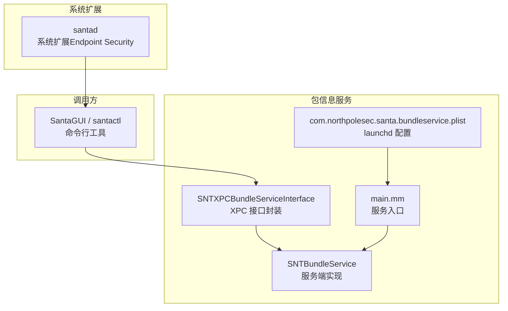
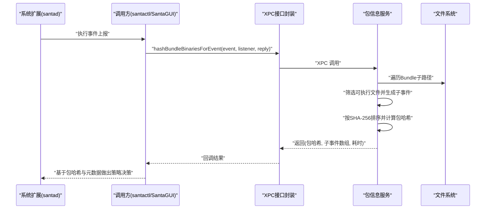
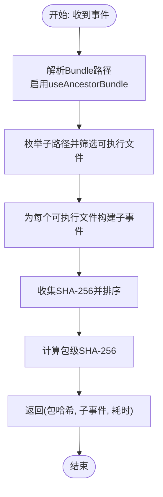
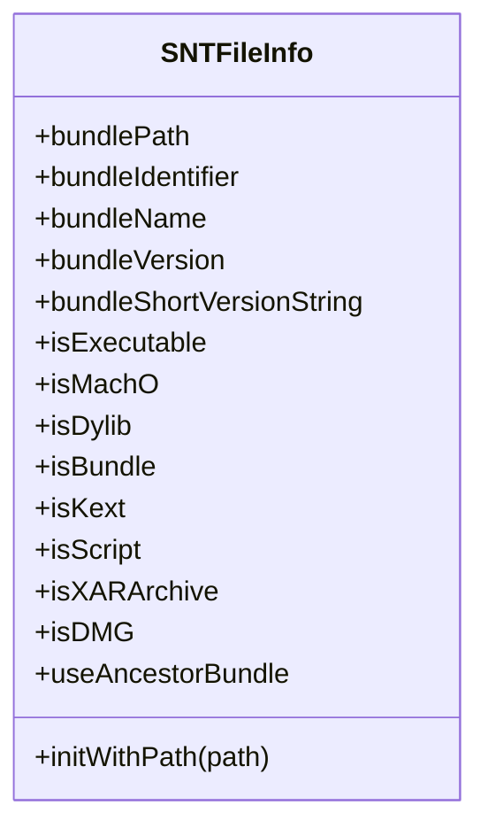
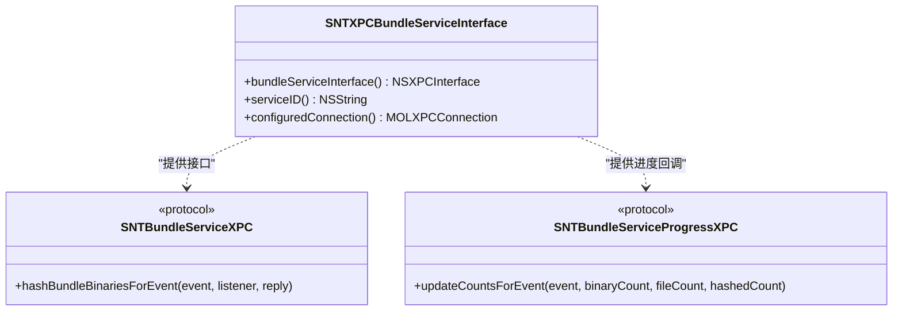
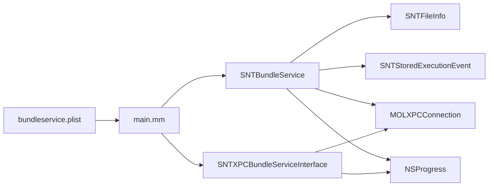
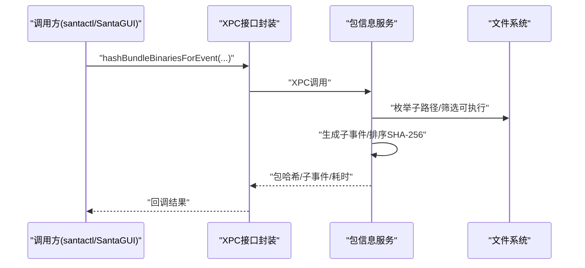

# 包信息服务

<cite>
**本文引用的文件**
- [SNTBundleService.h](file://Source/santabundleservice/SNTBundleService.h)
- [SNTBundleService.mm](file://Source/santabundleservice/SNTBundleService.mm)
- [SNTXPCBundleServiceInterface.h](file://Source/common/SNTXPCBundleServiceInterface.h)
- [SNTXPCBundleServiceInterface.mm](file://Source/common/SNTXPCBundleServiceInterface.mm)
- [SNTStoredExecutionEvent.h](file://Source/common/SNTStoredExecutionEvent.h)
- [SNTStoredExecutionEvent.mm](file://Source/common/SNTStoredExecutionEvent.mm)
- [SNTFileInfo.h](file://Source/common/SNTFileInfo.h)
- [SNTFileInfo.mm](file://Source/common/SNTFileInfo.mm)
- [com.northpolesec.santa.bundleservice.plist](file://Conf/com.northpolesec.santa.bundleservice.plist)
- [main.mm](file://Source/santabundleservice/main.mm)
- [SNTCommandFileInfo.mm](file://Source/santactl/Commands/SNTCommandFileInfo.mm)
- [profile-system-extension.md](file://docs/docs/deployment/profile-system-extension.md)
- [binary-authorization.md](file://docs/docs/features/binary-authorization.md)
</cite>

## 目录
1. [简介](#简介)
2. [项目结构](#项目结构)
3. [核心组件](#核心组件)
4. [架构总览](#架构总览)
5. [详细组件分析](#详细组件分析)
6. [依赖关系分析](#依赖关系分析)
7. [性能考量](#性能考量)
8. [故障排查指南](#故障排查指南)
9. [结论](#结论)
10. [附录](#附录)

## 简介
本文件为 Santa 包信息服务（santabundleservice）的详细技术文档，聚焦于应用包检测机制、Bundle ID 解析与版本管理、与系统扩展的协作、XPC 接口设计与请求处理流程、以及与 MDM 方案和安全平台的集成方式。文档同时提供包检测流程图、API 接口说明与集成示例，帮助系统集成商与安全工程师完成端到端实现。

## 项目结构
包信息服务位于 Source/santabundleservice 目录，核心由服务端实现与 XPC 接口定义组成，并通过 launchd 配置暴露为系统级 Mach 服务。其与上层 GUI/CLI 工具（如 santactl）通过 XPC 调用交互；与系统扩展（santad）通过 Endpoint Security 事件链路协同工作。

图表来源
- [SNTBundleService.mm](file://Source/santabundleservice/SNTBundleService.mm#L47-L115)
- [SNTXPCBundleServiceInterface.h](file://Source/common/SNTXPCBundleServiceInterface.h#L37-L76)
- [SNTXPCBundleServiceInterface.mm](file://Source/common/SNTXPCBundleServiceInterface.mm#L22-L43)
- [main.mm](file://Source/santabundleservice/main.mm#L23-L35)
- [com.northpolesec.santa.bundleservice.plist](file://Conf/com.northpolesec.santa.bundleservice.plist#L1-L33)

章节来源
- [SNTBundleService.mm](file://Source/santabundleservice/SNTBundleService.mm#L47-L115)
- [SNTXPCBundleServiceInterface.h](file://Source/common/SNTXPCBundleServiceInterface.h#L37-L76)
- [SNTXPCBundleServiceInterface.mm](file://Source/common/SNTXPCBundleServiceInterface.mm#L22-L43)
- [main.mm](file://Source/santabundleservice/main.mm#L23-L35)
- [com.northpolesec.santa.bundleservice.plist](file://Conf/com.northpolesec.santa.bundleservice.plist#L1-L33)

## 核心组件
- 包信息服务端（SNTBundleService）
  - 提供 XPC 方法：hashBundleBinariesForEvent(listener:reply:)
  - 负责遍历指定 Bundle 内部可执行文件，生成子事件并计算包级哈希
- XPC 接口封装（SNTXPCBundleServiceInterface）
  - 定义 SNTBundleServiceXPC 协议与进度回调协议
  - 提供预配置的 NSXPCInterface 与连接工厂方法
- 文件信息与包元数据（SNTFileInfo）
  - 解析 Mach-O、Bundle、Info.plist、代码签名与沙箱权限等
  - 支持祖先 Bundle 查找（useAncestorBundle），以适配复杂嵌套结构
- 执行事件模型（SNTStoredExecutionEvent）
  - 记录执行事件、签名链、Bundle 相关字段（ID、名称、版本等）
- 服务入口与配置（main.mm、plist）
  - 以 launchd 注册 Mach 服务名，导出服务对象，常驻运行

章节来源
- [SNTBundleService.h](file://Source/santabundleservice/SNTBundleService.h#L17-L20)
- [SNTBundleService.mm](file://Source/santabundleservice/SNTBundleService.mm#L47-L115)
- [SNTXPCBundleServiceInterface.h](file://Source/common/SNTXPCBundleServiceInterface.h#L22-L76)
- [SNTXPCBundleServiceInterface.mm](file://Source/common/SNTXPCBundleServiceInterface.mm#L22-L43)
- [SNTFileInfo.h](file://Source/common/SNTFileInfo.h#L150-L248)
- [SNTFileInfo.mm](file://Source/common/SNTFileInfo.mm#L335-L461)
- [SNTStoredExecutionEvent.h](file://Source/common/SNTStoredExecutionEvent.h#L23-L80)
- [SNTStoredExecutionEvent.mm](file://Source/common/SNTStoredExecutionEvent.mm#L26-L48)
- [main.mm](file://Source/santabundleservice/main.mm#L23-L35)
- [com.northpolesec.santa.bundleservice.plist](file://Conf/com.northpolesec.santa.bundleservice.plist#L1-L33)

## 架构总览
包信息服务在系统中的角色是“包级元数据与哈希聚合器”。当系统扩展捕获到执行事件后，若命中需要包级决策的场景，会将事件传递给包信息服务进行二次处理：解析 Bundle 元数据、扫描内部可执行文件、生成子事件并计算包级哈希，最终返回给调用方（GUI/CLI）用于展示与决策。

图表来源
- [SNTBundleService.mm](file://Source/santabundleservice/SNTBundleService.mm#L47-L115)
- [SNTXPCBundleServiceInterface.h](file://Source/common/SNTXPCBundleServiceInterface.h#L37-L76)
- [SNTStoredExecutionEvent.h](file://Source/common/SNTStoredExecutionEvent.h#L23-L80)
- [SNTFileInfo.h](file://Source/common/SNTFileInfo.h#L150-L248)

## 详细组件分析

### 组件一：包检测与哈希计算（SNTBundleService）
- 输入：SNTStoredExecutionEvent（包含 fileBundlePath 等）
- 处理流程：
  - 使用 SNTFileInfo 解析 Bundle，启用 useAncestorBundle 以定位最高层级 Bundle
  - 递归枚举 Bundle 内部子路径，筛选 Mach-O 可执行文件
  - 为每个可执行文件创建 SNTStoredExecutionEvent 子事件，继承 Bundle 元数据
  - 对子事件的 SHA-256 值排序拼接后做 SHA-256，得到包级哈希
- 进度与超时：
  - 通过 NSProgress 与客户端监听器回传进度
  - 主线程定时更新 UI 计数，后台并发处理文件
  - 总超时约 10 分钟，避免阻塞调用线程
- 输出：包哈希字符串、子事件数组、耗时毫秒数

图表来源
- [SNTBundleService.mm](file://Source/santabundleservice/SNTBundleService.mm#L47-L115)
- [SNTBundleService.mm](file://Source/santabundleservice/SNTBundleService.mm#L117-L243)
- [SNTBundleService.mm](file://Source/santabundleservice/SNTBundleService.mm#L245-L281)

章节来源
- [SNTBundleService.mm](file://Source/santabundleservice/SNTBundleService.mm#L47-L115)
- [SNTBundleService.mm](file://Source/santabundleservice/SNTBundleService.mm#L117-L243)
- [SNTBundleService.mm](file://Source/santabundleservice/SNTBundleService.mm#L245-L281)

### 组件二：Bundle ID 解析与版本管理（SNTFileInfo）
- Bundle 解析：
  - 支持祖先 Bundle 查找（useAncestorBundle=YES 时向上遍历，限定允许扩展名集合）
  - 优先从 Info.plist 获取 CFBundleIdentifier/CFBundleName/CFBundleVersion/CFBundleShortVersionString
  - 若无嵌入 Info.plist，则回退到 NSBundle 的 Info 字典
- 版本管理：
  - 暴露 bundleVersion 与 bundleShortVersionString，供上层决策与展示
- 文件类型识别：
  - 识别可执行、动态库、Bundle/插件、内核扩展、脚本、XAR、DMG 等

图表来源
- [SNTFileInfo.h](file://Source/common/SNTFileInfo.h#L150-L248)
- [SNTFileInfo.mm](file://Source/common/SNTFileInfo.mm#L335-L461)

章节来源
- [SNTFileInfo.h](file://Source/common/SNTFileInfo.h#L150-L248)
- [SNTFileInfo.mm](file://Source/common/SNTFileInfo.mm#L335-L461)

### 组件三：XPC 接口与调用方集成（SNTXPCBundleServiceInterface）
- 协议定义：
  - SNTBundleServiceXPC：hashBundleBinariesForEvent(event, listener, reply)
  - SNTBundleServiceProgressXPC：updateCountsForEvent(event, binaryCount, fileCount, hashedCount)
- 接口封装：
  - bundleServiceInterface：注册自定义类（如 SNTStoredExecutionEvent）以便跨进程传输
  - serviceID：com.northpolesec.santa.bundleservice
  - configuredConnection：返回已配置的 MOLXPCConnection，直接 resume 使用

图表来源
- [SNTXPCBundleServiceInterface.h](file://Source/common/SNTXPCBundleServiceInterface.h#L22-L76)
- [SNTXPCBundleServiceInterface.mm](file://Source/common/SNTXPCBundleServiceInterface.mm#L22-L43)

章节来源
- [SNTXPCBundleServiceInterface.h](file://Source/common/SNTXPCBundleServiceInterface.h#L22-L76)
- [SNTXPCBundleServiceInterface.mm](file://Source/common/SNTXPCBundleServiceInterface.mm#L22-L43)

### 组件四：调用方示例（santactl）
- 在 fileinfo 命令中，若检测到需要包哈希，会通过 XPC 调用包服务，等待结果并填充输出字典中的包信息字段（包含包哈希、子项列表、耗时等）

章节来源
- [SNTCommandFileInfo.mm](file://Source/santactl/Commands/SNTCommandFileInfo.mm#L763-L806)

## 依赖关系分析
- 服务端实现依赖：
  - SNTFileInfo：用于文件类型判断与 Bundle 元数据解析
  - SNTStoredExecutionEvent：用于承载子事件与签名信息
  - MOLXPCConnection：用于 XPC 通信
  - NSProgress：用于进度上报与取消
- XPC 接口依赖：
  - NSXPCInterface：注册自定义类，确保跨进程序列化
- 启动与配置：
  - launchd plist 指定 Mach 服务名与关联包标识，确保系统正确加载与发现服务

图表来源
- [SNTBundleService.mm](file://Source/santabundleservice/SNTBundleService.mm#L47-L115)
- [SNTXPCBundleServiceInterface.mm](file://Source/common/SNTXPCBundleServiceInterface.mm#L22-L43)
- [main.mm](file://Source/santabundleservice/main.mm#L23-L35)
- [com.northpolesec.santa.bundleservice.plist](file://Conf/com.northpolesec.santa.bundleservice.plist#L1-L33)

章节来源
- [SNTBundleService.mm](file://Source/santabundleservice/SNTBundleService.mm#L47-L115)
- [SNTXPCBundleServiceInterface.mm](file://Source/common/SNTXPCBundleServiceInterface.mm#L22-L43)
- [main.mm](file://Source/santabundleservice/main.mm#L23-L35)
- [com.northpolesec.santa.bundleservice.plist](file://Conf/com.northpolesec.santa.bundleservice.plist#L1-L33)

## 性能考量
- 并发与进度：
  - 使用 dispatch_apply 并发处理每个文件，主线程仅负责 UI 更新与计数上报
  - NSProgress 分阶段分配权重（目录枚举 80%、事件生成 15%、哈希计算 5%），保证进度准确
- I/O 优化：
  - 读取时设置读前瞻与建议读，提升大文件顺序读取性能
  - 仅对 Mach-O 可执行文件进行处理，避免无关文件开销
- 超时与取消：
  - 主线程定时等待信号量，超时后取消进度，避免长时间占用
  - 进度被取消时提前返回，减少无效工作

章节来源
- [SNTBundleService.mm](file://Source/santabundleservice/SNTBundleService.mm#L117-L243)
- [SNTBundleService.mm](file://Source/santabundleservice/SNTBundleService.mm#L245-L281)

## 故障排查指南
- 无法获取包哈希
  - 检查 fileBundlePath 是否有效；若为空则服务会返回空结果
  - 确认 useAncestorBundle 配置是否正确，必要时启用祖先 Bundle 查找
- 进度未更新或卡住
  - 检查 listener 是否正确建立，invalidationHandler 是否触发
  - 观察 NSProgress 是否被取消或超时
- XPC 调用失败
  - 确认服务已通过 launchd 正常启动且 Mach 服务名匹配
  - 使用 configuredConnection 获取连接，确保 remoteInterface 已设置
- 与系统扩展协作异常
  - 确保系统扩展已通过 MDM 或用户授权加载
  - 检查 Endpoint Security 事件订阅与处理链路

章节来源
- [SNTBundleService.mm](file://Source/santabundleservice/SNTBundleService.mm#L47-L115)
- [SNTXPCBundleServiceInterface.mm](file://Source/common/SNTXPCBundleServiceInterface.mm#L22-L43)
- [com.northpolesec.santa.bundleservice.plist](file://Conf/com.northpolesec.santa.bundleservice.plist#L1-L33)
- [profile-system-extension.md](file://docs/docs/deployment/profile-system-extension.md#L1-L48)

## 结论
包信息服务通过 XPC 将系统扩展捕获的执行事件转化为可消费的包级元数据与哈希，为 GUI/CLI 提供决策依据。其设计强调并发处理、进度反馈与超时控制，兼顾性能与用户体验。结合 MDM 与系统扩展，可实现企业级的二进制授权与合规管控。

## 附录

### API 接口说明（XPC）
- 协议：SNTBundleServiceXPC
  - 方法：hashBundleBinariesForEvent(event, listener, reply)
  - 参数：
    - event：SNTStoredExecutionEvent（包含 fileBundlePath 等）
    - listener：NSXPCListenerEndpoint（用于进度回调）
    - reply：SNTBundleHashBlock（返回包哈希、子事件数组、耗时）
  - 返回：nil 表示失败或取消
- 进度回调协议：SNTBundleServiceProgressXPC
  - updateCountsForEvent(event, binaryCount, fileCount, hashedCount)

章节来源
- [SNTXPCBundleServiceInterface.h](file://Source/common/SNTXPCBundleServiceInterface.h#L22-L76)

### 请求处理流程（序列图）

图表来源
- [SNTBundleService.mm](file://Source/santabundleservice/SNTBundleService.mm#L47-L115)
- [SNTXPCBundleServiceInterface.h](file://Source/common/SNTXPCBundleServiceInterface.h#L22-L76)

### 集成示例（MDM 与系统扩展）
- 系统扩展授权
  - 通过 MDM 下发系统扩展配置，允许 Endpoint Security 扩展类型与特定扩展标识
  - 可选禁止移除，增强部署稳定性
- 服务发现与调用
  - 使用 SNTXPCBundleServiceInterface.serviceID 作为 Mach 服务名
  - 通过 SNTXPCBundleServiceInterface.configuredConnection 获取已配置连接并 resume

章节来源
- [profile-system-extension.md](file://docs/docs/deployment/profile-system-extension.md#L1-L48)
- [SNTXPCBundleServiceInterface.mm](file://Source/common/SNTXPCBundleServiceInterface.mm#L22-L43)
- [com.northpolesec.santa.bundleservice.plist](file://Conf/com.northpolesec.santa.bundleservice.plist#L1-L33)

### 与二进制授权的关系
- 包哈希可用于规则匹配（如 SIGNINGID/BINARY/CDHash 等），并与系统扩展的决策流程衔接
- 通过二进制授权文档了解规则优先级与策略选择，有助于在包级决策基础上制定更细粒度的策略

章节来源
- [binary-authorization.md](file://docs/docs/features/binary-authorization.md#L1-L448)