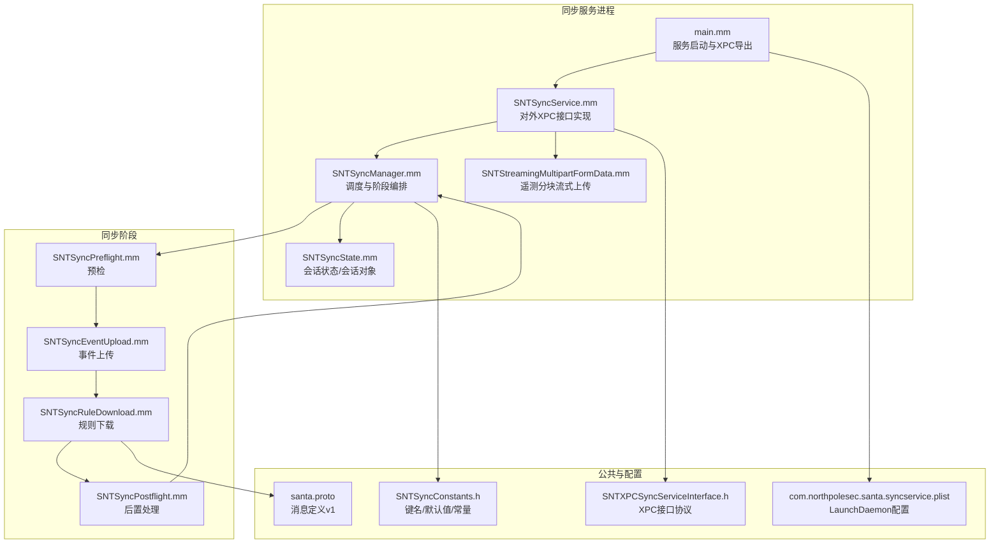
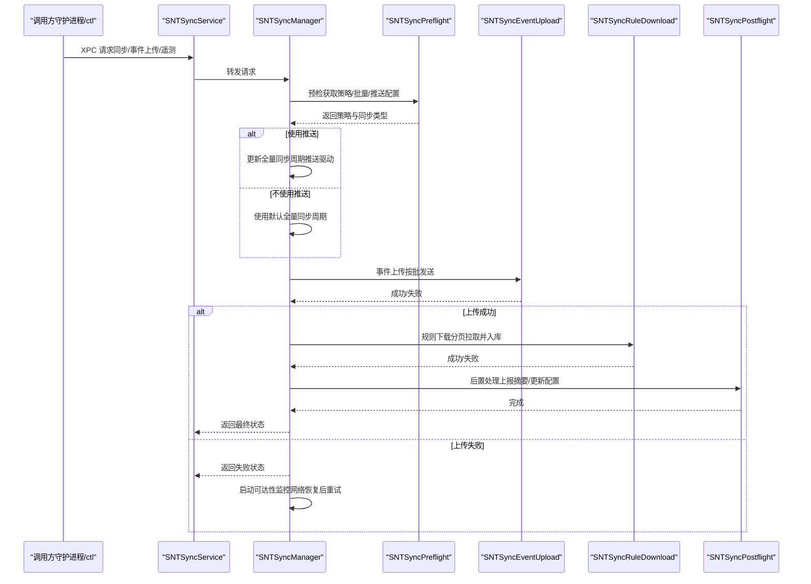
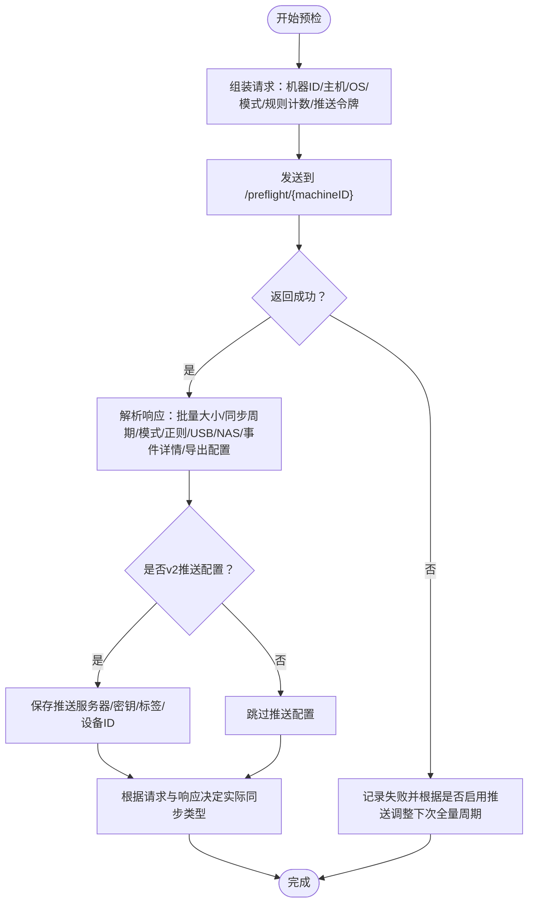
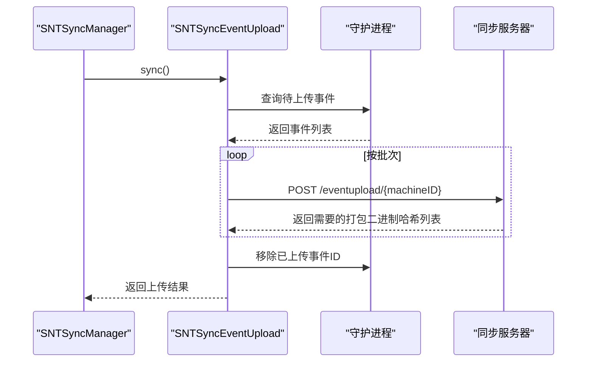
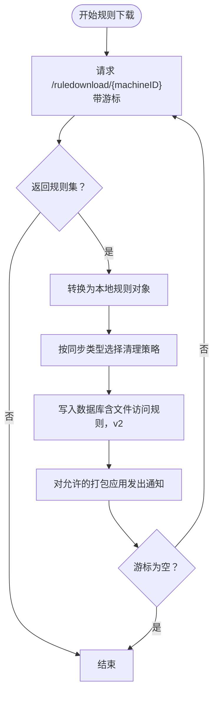
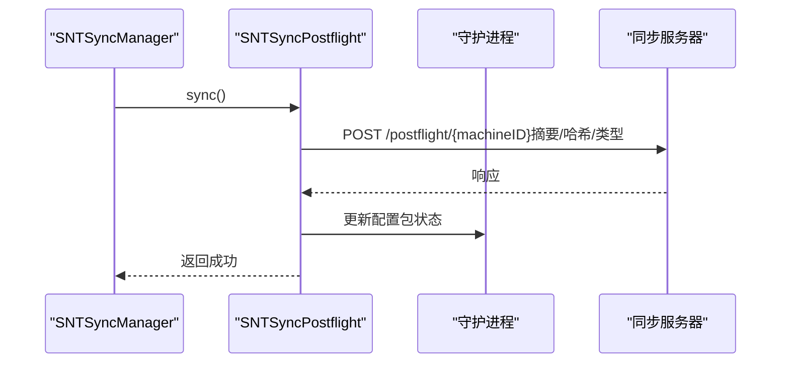
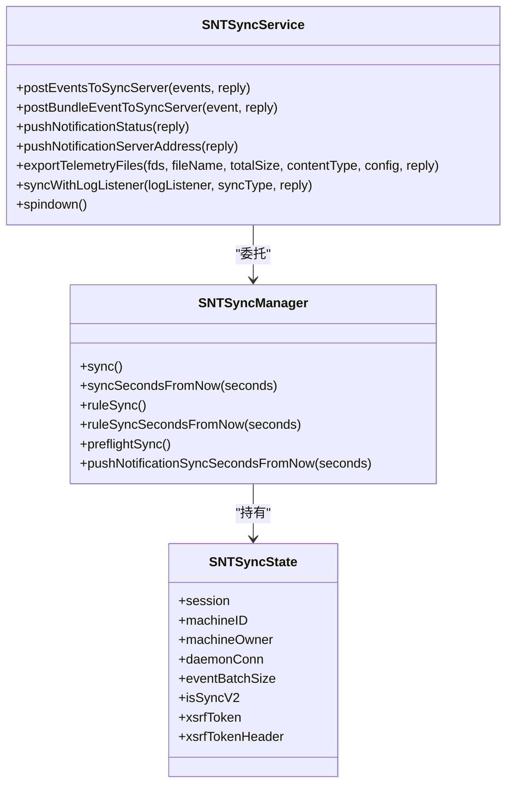
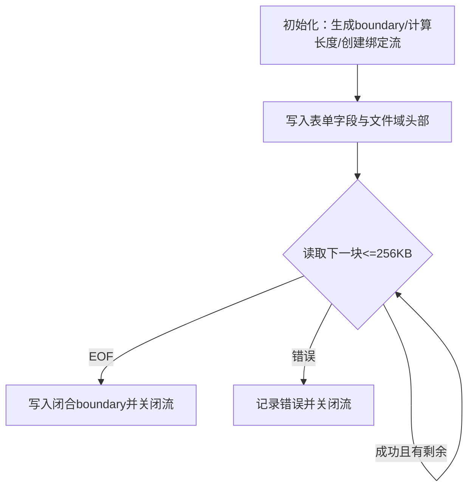
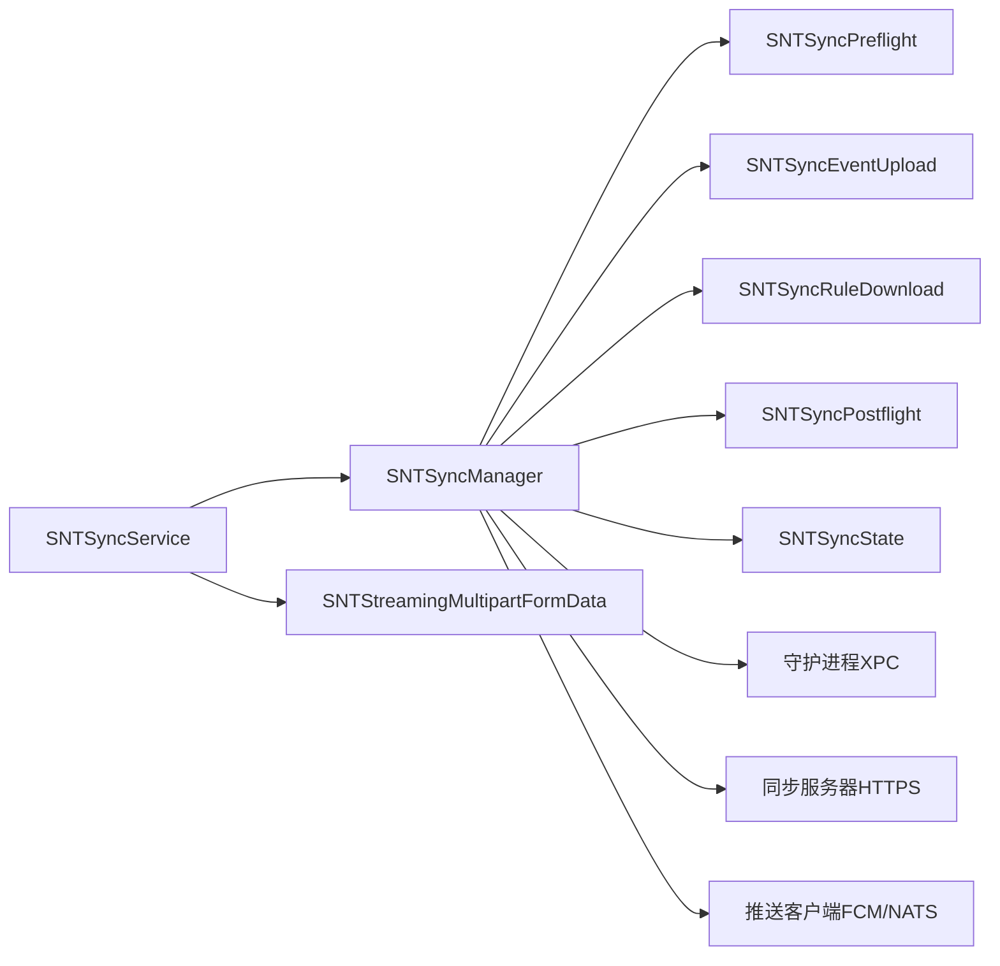

# 同步服务

<cite>
**本文引用的文件**
- [SNTSyncService.mm](file://Source/santasyncservice/SNTSyncService.mm)
- [SNTSyncManager.mm](file://Source/santasyncservice/SNTSyncManager.mm)
- [SNTSyncPreflight.mm](file://Source/santasyncservice/SNTSyncPreflight.mm)
- [SNTSyncEventUpload.mm](file://Source/santasyncservice/SNTSyncEventUpload.mm)
- [SNTSyncRuleDownload.mm](file://Source/santasyncservice/SNTSyncRuleDownload.mm)
- [SNTSyncPostflight.mm](file://Source/santasyncservice/SNTSyncPostflight.mm)
- [SNTSyncState.mm](file://Source/santasyncservice/SNTSyncState.mm)
- [SNTStreamingMultipartFormData.mm](file://Source/santasyncservice/SNTStreamingMultipartFormData.mm)
- [SNTXPCSyncServiceInterface.h](file://Source/common/SNTXPCSyncServiceInterface.h)
- [SNTSyncConstants.h](file://Source/common/SNTSyncConstants.h)
- [main.mm](file://Source/santasyncservice/main.mm)
- [com.northpolesec.santa.syncservice.plist](file://Conf/com.northpolesec.santa.syncservice.plist)
- [santa.proto](file://Source/common/santa.proto)
</cite>

## 目录
1. [简介](#简介)
2. [项目结构](#项目结构)
3. [核心组件](#核心组件)
4. [架构总览](#架构总览)
5. [详细组件分析](#详细组件分析)
6. [依赖关系分析](#依赖关系分析)
7. [性能考量](#性能考量)
8. [故障排查指南](#故障排查指南)
9. [结论](#结论)
10. [附录：API 接口与配置参数](#附录api-接口与配置参数)

## 简介
本文件为 Santa 同步服务（santasyncservice）的完整技术文档，面向系统集成工程师与后端开发者，聚焦以下目标：
- 深入解释同步服务的架构设计与控制流：预检（preflight）、规则下载（ruledownload）、事件上传（eventupload）、后置处理（postflight）。
- 阐述同步协议设计原理、HTTP API 接口规范与数据传输机制（含 v1/v2 协议差异）。
- 解释连接管理、重试策略与错误恢复机制。
- 说明与远程服务器的认证机制、数据加密与完整性校验（如证书固定、TLS 校验、可选 XSRF 头）。
- 提供同步流程图、API 接口清单与配置参数说明。

## 项目结构
同步服务位于 Source/santasyncservice 目录，核心由“服务入口 + 管理器 + 同步阶段实现 + XPC 接口 + 数据传输工具”构成；同时通过公共常量与协议文件定义同步状态、消息字段与接口契约。

图表来源
- [main.mm](file://Source/santasyncservice/main.mm#L1-L38)
- [SNTSyncService.mm](file://Source/santasyncservice/SNTSyncService.mm#L1-L120)
- [SNTSyncManager.mm](file://Source/santasyncservice/SNTSyncManager.mm#L1-L120)
- [SNTSyncPreflight.mm](file://Source/santasyncservice/SNTSyncPreflight.mm#L1-L120)
- [SNTSyncEventUpload.mm](file://Source/santasyncservice/SNTSyncEventUpload.mm#L1-L120)
- [SNTSyncRuleDownload.mm](file://Source/santasyncservice/SNTSyncRuleDownload.mm#L1-L120)
- [SNTSyncPostflight.mm](file://Source/santasyncservice/SNTSyncPostflight.mm#L1-L86)
- [SNTStreamingMultipartFormData.mm](file://Source/santasyncservice/SNTStreamingMultipartFormData.mm#L1-L120)
- [SNTXPCSyncServiceInterface.h](file://Source/common/SNTXPCSyncServiceInterface.h#L1-L100)
- [SNTSyncConstants.h](file://Source/common/SNTSyncConstants.h#L1-L166)
- [com.northpolesec.santa.syncservice.plist](file://Conf/com.northpolesec.santa.syncservice.plist#L1-L27)
- [santa.proto](file://Source/common/santa.proto#L1-L200)

章节来源
- [main.mm](file://Source/santasyncservice/main.mm#L1-L38)
- [SNTSyncService.mm](file://Source/santasyncservice/SNTSyncService.mm#L1-L120)
- [SNTSyncManager.mm](file://Source/santasyncservice/SNTSyncManager.mm#L1-L120)
- [SNTXPCSyncServiceInterface.h](file://Source/common/SNTXPCSyncServiceInterface.h#L1-L100)
- [SNTSyncConstants.h](file://Source/common/SNTSyncConstants.h#L1-L166)
- [com.northpolesec.santa.syncservice.plist](file://Conf/com.northpolesec.santa.syncservice.plist#L1-L27)

## 核心组件
- 服务入口与生命周期
  - 进程通过 main.mm 导出 XPC 服务接口，监听系统负载或外部触发，维持长驻运行。
  - SNTSyncService.mm 负责权限降级、配置初始化、统计上报定时器、日志广播与对外 XPC 方法实现。
- 同步编排器
  - SNTSyncManager.mm 统一调度预检、事件上传、规则下载、后置处理四个阶段，并维护网络可达性监控、推送通知客户端、定时器与并发限制。
- 同步阶段实现
  - 预检：SNTSyncPreflight.mm 从服务器获取策略、模式、批量大小、推送配置等，决定本次同步类型与周期。
  - 事件上传：SNTSyncEventUpload.mm 从数据库拉取待上传事件，按批次打包并发送至 eventupload。
  - 规则下载：SNTSyncRuleDownload.mm 分页拉取规则，转换为本地规则对象，写入数据库并记录成功状态。
  - 后置处理：SNTSyncPostflight.mm 上报本次同步结果与摘要，更新本地配置包。
- 传输与状态
  - SNTStreamingMultipartFormData.mm 实现遥测文件的分块流式上传。
  - SNTSyncState.mm 封装一次同步所需的会话信息与 URLSession 生命周期管理。
- 公共契约与常量
  - SNTXPCSyncServiceInterface.h 定义与守护进程、ctl 的 XPC 接口契约。
  - SNTSyncConstants.h 定义键名、默认值与最小间隔等常量。

章节来源
- [SNTSyncService.mm](file://Source/santasyncservice/SNTSyncService.mm#L1-L120)
- [SNTSyncManager.mm](file://Source/santasyncservice/SNTSyncManager.mm#L1-L120)
- [SNTSyncPreflight.mm](file://Source/santasyncservice/SNTSyncPreflight.mm#L1-L120)
- [SNTSyncEventUpload.mm](file://Source/santasyncservice/SNTSyncEventUpload.mm#L1-L120)
- [SNTSyncRuleDownload.mm](file://Source/santasyncservice/SNTSyncRuleDownload.mm#L1-L120)
- [SNTSyncPostflight.mm](file://Source/santasyncservice/SNTSyncPostflight.mm#L1-L86)
- [SNTStreamingMultipartFormData.mm](file://Source/santasyncservice/SNTStreamingMultipartFormData.mm#L1-L120)
- [SNTSyncState.mm](file://Source/santasyncservice/SNTSyncState.mm#L1-L22)
- [SNTXPCSyncServiceInterface.h](file://Source/common/SNTXPCSyncServiceInterface.h#L1-L100)
- [SNTSyncConstants.h](file://Source/common/SNTSyncConstants.h#L1-L166)

## 架构总览
同步服务采用“阶段化流水线 + 并发限流 + 可达性监控”的架构，确保在弱网、离线或服务器策略变化时具备稳健的恢复能力。

图表来源
- [SNTSyncManager.mm](file://Source/santasyncservice/SNTSyncManager.mm#L196-L400)
- [SNTSyncPreflight.mm](file://Source/santasyncservice/SNTSyncPreflight.mm#L406-L431)
- [SNTSyncEventUpload.mm](file://Source/santasyncservice/SNTSyncEventUpload.mm#L456-L485)
- [SNTSyncRuleDownload.mm](file://Source/santasyncservice/SNTSyncRuleDownload.mm#L395-L504)
- [SNTSyncPostflight.mm](file://Source/santasyncservice/SNTSyncPostflight.mm#L69-L86)

## 详细组件分析

### 预检（Preflight）
- 输入：机器标识、系统信息、当前模式、规则计数、推送令牌等。
- 输出：服务器下发的批量大小、全量同步间隔、是否启用打包/透明规则、允许/禁止路径正则、USB/NAS 挂载策略、事件详情链接/文案、同步类型（Normal/Clean/CleanAll）、推送服务器与凭据（v2）等。
- 关键行为：
  - 根据请求的同步类型与服务器响应综合决定实际执行的同步类型。
  - 在 v2 中解析推送配置、设备 ID、标签、HMAC 密钥等。
  - 更新会话中的批量大小与同步周期，并持久化 XSRF 令牌与头（若存在）。

图表来源
- [SNTSyncPreflight.mm](file://Source/santasyncservice/SNTSyncPreflight.mm#L80-L324)
- [SNTSyncPreflight.mm](file://Source/santasyncservice/SNTSyncPreflight.mm#L325-L404)

章节来源
- [SNTSyncPreflight.mm](file://Source/santasyncservice/SNTSyncPreflight.mm#L1-L431)

### 事件上传（EventUpload）
- 数据来源：从守护进程查询待上传事件集合。
- 打包策略：按会话中批量大小分批，支持执行事件、文件访问事件、临时监控审计事件（v2），以及网络挂载事件（v2）。
- 上传方式：构造请求体并发送至 /eventupload/{machineID}，服务器可能要求相关打包二进制事件列表。
- 成功后：从数据库移除已上传事件 ID；若服务器返回需要后续上传的打包二进制哈希，则缓存于会话中供后续处理。

图表来源
- [SNTSyncEventUpload.mm](file://Source/santasyncservice/SNTSyncEventUpload.mm#L456-L485)
- [SNTSyncEventUpload.mm](file://Source/santasyncservice/SNTSyncEventUpload.mm#L91-L177)

章节来源
- [SNTSyncEventUpload.mm](file://Source/santasyncservice/SNTSyncEventUpload.mm#L1-L485)

### 规则下载（RuleDownload）
- 分页拉取：基于游标循环请求 /ruledownload/{machineID}，直到游标为空。
- 规则转换：将服务器返回的规则映射为本地规则对象（执行规则与文件访问规则，v2 新增）。
- 写库与清理：调用守护进程接口写入数据库，按同步类型选择清理策略（Normal/Clean/CleanAll）。
- 通知：对允许的打包应用进行去重通知，提示用户可运行。

图表来源
- [SNTSyncRuleDownload.mm](file://Source/santasyncservice/SNTSyncRuleDownload.mm#L87-L154)
- [SNTSyncRuleDownload.mm](file://Source/santasyncservice/SNTSyncRuleDownload.mm#L395-L504)

章节来源
- [SNTSyncRuleDownload.mm](file://Source/santasyncservice/SNTSyncRuleDownload.mm#L1-L504)

### 后置处理（Postflight）
- 上报：向 /postflight/{machineID} 发送本次同步的摘要（接收/处理规则数量、同步类型、规则哈希等）。
- 更新：调用守护进程接口更新配置包状态，完成本次同步的收尾。

图表来源
- [SNTSyncPostflight.mm](file://Source/santasyncservice/SNTSyncPostflight.mm#L69-L86)

章节来源
- [SNTSyncPostflight.mm](file://Source/santasyncservice/SNTSyncPostflight.mm#L1-L86)

### 服务与连接管理
- 权限与配置：启动后降级为普通用户，初始化配置器，禁用默认 NSURLCache 以避免沙箱错误。
- XPC 接口：SNTSyncService 实现 SNTSyncServiceXPC 协议，提供事件上传、打包事件处理、推送状态查询、遥测流式上传与强制同步等方法。
- 日志广播：通过 SNTSyncBroadcaster 将日志推送到调用方提供的监听端点。
- 统计上报：按小时尝试收集统计，每日（含最小间隔）上报一次 Polaris。

图表来源
- [SNTSyncService.mm](file://Source/santasyncservice/SNTSyncService.mm#L108-L186)
- [SNTSyncManager.mm](file://Source/santasyncservice/SNTSyncManager.mm#L196-L294)
- [SNTSyncState.mm](file://Source/santasyncservice/SNTSyncState.mm#L15-L22)

章节来源
- [SNTSyncService.mm](file://Source/santasyncservice/SNTSyncService.mm#L1-L249)
- [SNTSyncManager.mm](file://Source/santasyncservice/SNTSyncManager.mm#L1-L200)
- [SNTSyncState.mm](file://Source/santasyncservice/SNTSyncState.mm#L1-L22)

### 遥测流式上传（Multipart）
- 设计：使用 NSStream 创建绑定流，先写表单字段与文件名，再按块读取文件句柄写入输出流，支持部分写回退与偏移修正。
- 适用：exportTelemetryFiles 通过 SNTStreamingMultipartFormData 将多个文件打包为 multipart/form-data 流式上传。

图表来源
- [SNTStreamingMultipartFormData.mm](file://Source/santasyncservice/SNTStreamingMultipartFormData.mm#L1-L120)
- [SNTStreamingMultipartFormData.mm](file://Source/santasyncservice/SNTStreamingMultipartFormData.mm#L204-L291)

章节来源
- [SNTStreamingMultipartFormData.mm](file://Source/santasyncservice/SNTStreamingMultipartFormData.mm#L1-L291)

## 依赖关系分析
- 组件耦合
  - SNTSyncManager 对各阶段组件（Preflight/EventUpload/RuleDownload/Postflight）进行编排，耦合度适中，职责清晰。
  - SNTSyncState 作为共享上下文贯穿整个同步周期，避免重复创建会话与配置。
  - SNTSyncService 仅负责对外接口与日志广播，内部委托给 SNTSyncManager，保持薄服务层。
- 外部依赖
  - 与守护进程通过 XPC 通信，用于数据库操作、规则计数、模式切换等。
  - 与同步服务器通过 HTTPS 通信，支持证书固定与客户端证书双向认证。
  - 与推送系统（FCM/NATS）交互，实现推送驱动的全量同步周期调整。

图表来源
- [SNTSyncManager.mm](file://Source/santasyncservice/SNTSyncManager.mm#L1-L120)
- [SNTSyncService.mm](file://Source/santasyncservice/SNTSyncService.mm#L1-L120)

章节来源
- [SNTSyncManager.mm](file://Source/santasyncservice/SNTSyncManager.mm#L1-L120)
- [SNTSyncService.mm](file://Source/santasyncservice/SNTSyncService.mm#L1-L120)

## 性能考量
- 批量与并发
  - 事件上传按会话中的批量大小分批，减少单次请求体积与服务器压力。
  - 同步队列串行执行，最大并发排队数限制为 2，避免资源争用。
- 网络与可达性
  - 使用 Network.framework 监控路径状态，网络恢复后自动触发同步。
  - 未启用推送时使用默认全量同步周期；启用推送时以推送周期为准动态调整。
- 重试与超时
  - 预检/上传/下载均设置超时，失败时启动可达性监控等待网络恢复。
  - 规则写库与后置处理均设置超时与错误日志，保证可观测性。
- 统计上报
  - 每小时尝试收集统计，每日（含最小间隔）上报一次，避免频繁上报影响性能。

[本节为通用指导，不直接分析具体文件]

## 故障排查指南
- 常见错误与恢复
  - 缺少 SyncBaseURL 或 MachineID：预检阶段直接返回缺失参数状态，需检查配置。
  - 非 HTTPS 地址：记录警告但仍可继续，建议改为 HTTPS。
  - 上传失败：记录错误并启动可达性监控，网络恢复后自动重试。
  - 写库超时：规则写入与后置处理均设置超时，检查守护进程状态与数据库可用性。
- 日志与诊断
  - 使用 syncWithLogListener 获取实时日志，便于定位问题。
  - 统计上报失败不影响主流程，但可通过 Polaris 验证上报链路。
- 配置核对
  - 确认推送开关、推送服务器地址、推送凭据（v2）与证书固定配置正确。
  - 检查代理配置、客户端证书与根证书链配置。

章节来源
- [SNTSyncManager.mm](file://Source/santasyncservice/SNTSyncManager.mm#L402-L540)
- [SNTSyncService.mm](file://Source/santasyncservice/SNTSyncService.mm#L120-L186)

## 结论
Santa 同步服务通过清晰的阶段化设计与稳健的连接/重试/恢复机制，实现了在复杂网络环境下的可靠规则与事件同步。其 v2 协议扩展了推送驱动、文件访问规则与更多安全配置，配合严格的认证与加密策略，满足企业级部署的安全与合规需求。

[本节为总结，不直接分析具体文件]

## 附录：API 接口与配置参数

### 同步协议与 HTTP API
- 预检（Preflight）
  - 路径：/preflight/{machineID}
  - 方法：GET/POST（根据实现）
  - 作用：获取批量大小、全量同步间隔、模式、路径正则、USB/NAS 策略、事件详情、导出配置、推送配置（v2）等。
- 事件上传（EventUpload）
  - 路径：/eventupload/{machineID}
  - 方法：POST
  - 作用：上传执行事件、文件访问事件、临时监控审计事件（v2）与网络挂载事件（v2）。
  - 返回：可能指示需要额外上传的打包二进制哈希列表。
- 规则下载（RuleDownload）
  - 路径：/ruledownload/{machineID}
  - 方法：GET/POST
  - 作用：分页拉取规则，支持执行规则与文件访问规则（v2）。
- 后置处理（Postflight）
  - 路径：/postflight/{machineID}
  - 方法：POST
  - 作用：上报本次同步摘要（接收/处理规则数、同步类型、规则哈希等）。

章节来源
- [SNTSyncPreflight.mm](file://Source/santasyncservice/SNTSyncPreflight.mm#L406-L431)
- [SNTSyncEventUpload.mm](file://Source/santasyncservice/SNTSyncEventUpload.mm#L456-L485)
- [SNTSyncRuleDownload.mm](file://Source/santasyncservice/SNTSyncRuleDownload.mm#L395-L410)
- [SNTSyncPostflight.mm](file://Source/santasyncservice/SNTSyncPostflight.mm#L69-L86)

### XPC 接口（SNTSyncServiceXPC）
- 事件上传
  - postEventsToSyncServer(events, reply)
- 打包事件处理
  - postBundleEventToSyncServer(event, reply)
- 推送状态与地址
  - pushNotificationStatus(reply)
  - pushNotificationServerAddress(reply)
- 遥测流式上传
  - exportTelemetryFiles(fds, fileName, totalSize, contentType, config, reply)
- 强制同步
  - syncWithLogListener(logListener, syncType, reply)
- 服务自旋停
  - spindown()

章节来源
- [SNTXPCSyncServiceInterface.h](file://Source/common/SNTXPCSyncServiceInterface.h#L30-L100)

### 认证与加密
- 服务器证书固定
  - 若域名已固定，使用内置 PEM 证书链；否则可配置根证书文件/数据。
- 客户端证书认证
  - 支持基于证书文件/密码、Common Name 或 Issuer CN 的客户端证书认证。
- HTTPS 与重定向
  - 强制 HTTPS；拒绝重定向，确保请求路径稳定。
- 可选 XSRF
  - 会话中可携带 XSRF 令牌与头，用于增强 CSRF 防护。

章节来源
- [SNTSyncManager.mm](file://Source/santasyncservice/SNTSyncManager.mm#L418-L500)

### 配置参数与键名
- 基础
  - syncBaseURL：同步服务器基础 URL（必须为 HTTPS）
  - machineID：设备唯一标识（必填）
  - machineOwner/machineOwnerGroups：所有者与组
- 协议版本
  - force v2：可通过编译宏强制使用 v2
- 认证
  - syncServerAuthRootsFile/Data：服务器根证书文件/数据
  - syncClientAuthCertificateFile/Password：客户端证书与密码
  - syncClientAuthCertificateCn/Issuer：客户端证书 CN 或 Issuer
- 推送
  - enablePushNotifications/fcmEnabled：推送开关
  - pushServer/pushJWT/pushNKey/pushHMACKey/pushTags/pushDeviceID：推送配置（v2）
- 行为
  - enableCleanSyncEventUpload：允许在 Clean/CleanAll 时上传事件
  - enableAllEventUpload/disableUnknownEventUpload：事件上传策略
  - allowlistRegex/blocklistRegex：路径白名单/黑名单正则
  - blockUSBMount/remountUSBMode：USB 挂载策略
  - blockNetworkMount/allowedNetworkMountHosts/bannedNetworkMountBlockMessage：NAS 挂载策略
  - exportConfiguration：事件详情链接/文案
- 常量
  - 默认批量大小、最小全量同步间隔、推送全量同步间隔、全局规则同步截止时间等。

章节来源
- [SNTSyncConstants.h](file://Source/common/SNTSyncConstants.h#L1-L166)

### 运行与集成要点
- 进程注册
  - 通过 LaunchDaemon 配置 com.northpolesec.santa.syncservice.plist，按需随系统加载。
- 服务生命周期
  - 通过 XPC 接口与守护进程/ctl 交互；权限降级后初始化配置器。
- 日志与监控
  - 使用日志监听端点接收实时日志；统计上报 Polaris；遥测文件通过流式上传。

章节来源
- [com.northpolesec.santa.syncservice.plist](file://Conf/com.northpolesec.santa.syncservice.plist#L1-L27)
- [main.mm](file://Source/santasyncservice/main.mm#L1-L38)
- [SNTSyncService.mm](file://Source/santasyncservice/SNTSyncService.mm#L1-L120)