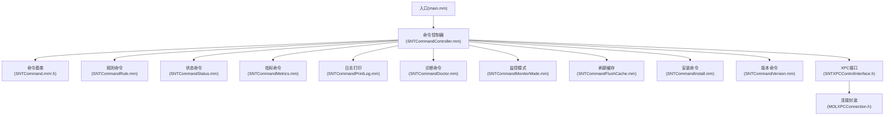
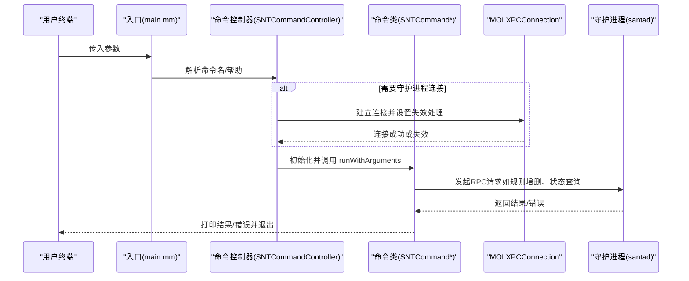
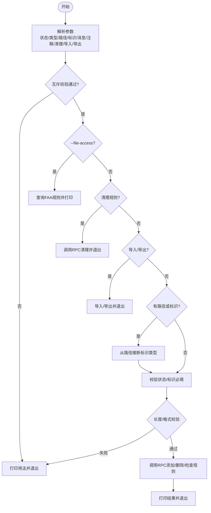
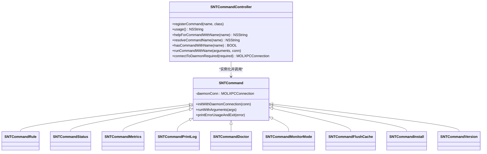

# 命令行工具(santactl)

<cite>
**本文引用的文件**
- [main.mm](file://Source/santactl/main.mm)
- [SNTCommandController.mm](file://Source/santactl/SNTCommandController.mm)
- [SNTCommand.mm](file://Source/santactl/SNTCommand.mm)
- [SNTCommand.h](file://Source/santactl/SNTCommand.h)
- [SNTCommandRule.mm](file://Source/santactl/Commands/SNTCommandRule.mm)
- [SNTCommandStatus.mm](file://Source/santactl/Commands/SNTCommandStatus.mm)
- [SNTCommandMetrics.mm](file://Source/santactl/Commands/SNTCommandMetrics.mm)
- [SNTCommandPrintLog.mm](file://Source/santactl/Commands/SNTCommandPrintLog.mm)
- [SNTCommandDoctor.mm](file://Source/santactl/Commands/SNTCommandDoctor.mm)
- [SNTCommandMonitorMode.mm](file://Source/santactl/Commands/SNTCommandMonitorMode.mm)
- [SNTCommandFlushCache.mm](file://Source/santactl/Commands/SNTCommandFlushCache.mm)
- [SNTCommandInstall.mm](file://Source/santactl/Commands/SNTCommandInstall.mm)
- [SNTCommandVersion.mm](file://Source/santactl/Commands/SNTCommandVersion.mm)
- [SNTXPCControlInterface.h](file://Source/common/SNTXPCControlInterface.h)
- [MOLXPCConnection.h](file://Source/common/MOLXPCConnection.h)
</cite>

## 目录
1. [简介](#简介)
2. [项目结构](#项目结构)
3. [核心组件](#核心组件)
4. [架构总览](#架构总览)
5. [详细组件分析](#详细组件分析)
6. [依赖关系分析](#依赖关系分析)
7. [性能考量](#性能考量)
8. [故障排查指南](#故障排查指南)
9. [结论](#结论)
10. [附录：命令参考手册与最佳实践](#附录命令参考手册与最佳实践)

## 简介
本文件为 Santa 命令行工具（santactl）的全面技术文档，覆盖命令解析机制、参数验证与执行流程；深入描述规则管理、状态查询、日志查看、诊断与监控模式切换等命令的实现逻辑；阐述 XPC 通信机制、权限处理与错误处理策略；解释输出格式（文本与 JSON）、JSON 数据结构与批量操作支持；并提供命令参考手册、使用示例与最佳实践，面向系统管理员与自动化工程师。

## 项目结构
santactl 位于 Source/santactl 目录，采用“控制器 + 命令集合”的分层设计：
- 入口程序负责参数解析与帮助信息输出，并将控制权委托给命令控制器。
- 命令控制器维护命令注册表、别名映射、帮助生成与 XPC 连接建立。
- 各命令类实现统一协议，封装自身业务逻辑与输出格式。
- 通用 XPC 接口定义了与守护进程交互的 RPC 方法集。

图表来源
- [main.mm](file://Source/santactl/main.mm#L1-L84)
- [SNTCommandController.mm](file://Source/santactl/SNTCommandController.mm#L1-L159)
- [SNTCommand.mm](file://Source/santactl/SNTCommand.mm#L1-L47)
- [SNTCommand.h](file://Source/santactl/SNTCommand.h#L1-L81)
- [SNTCommandRule.mm](file://Source/santactl/Commands/SNTCommandRule.mm#L1-L597)
- [SNTCommandStatus.mm](file://Source/santactl/Commands/SNTCommandStatus.mm#L1-L472)
- [SNTCommandMetrics.mm](file://Source/santactl/Commands/SNTCommandMetrics.mm#L1-L182)
- [SNTCommandPrintLog.mm](file://Source/santactl/Commands/SNTCommandPrintLog.mm#L1-L410)
- [SNTCommandDoctor.mm](file://Source/santactl/Commands/SNTCommandDoctor.mm#L1-L249)
- [SNTCommandMonitorMode.mm](file://Source/santactl/Commands/SNTCommandMonitorMode.mm#L1-L158)
- [SNTCommandFlushCache.mm](file://Source/santactl/Commands/SNTCommandFlushCache.mm#L1-L66)
- [SNTCommandInstall.mm](file://Source/santactl/Commands/SNTCommandInstall.mm#L1-L81)
- [SNTCommandVersion.mm](file://Source/santactl/Commands/SNTCommandVersion.mm#L1-L99)
- [SNTXPCControlInterface.h](file://Source/common/SNTXPCControlInterface.h#L1-L104)
- [MOLXPCConnection.h](file://Source/common/MOLXPCConnection.h#L1-L164)

章节来源
- [main.mm](file://Source/santactl/main.mm#L1-L84)
- [SNTCommandController.mm](file://Source/santactl/SNTCommandController.mm#L1-L159)

## 核心组件
- 命令解析与路由
  - 入口程序移除可执行名称后，调用控制器解析第一个参数作为命令名；支持 help/-h/--help 查询特定命令帮助。
  - 控制器根据注册表查找命令类，支持别名规范化（去除连字符与下划线）。
- 权限与连接
  - 每个命令声明是否需要 root 与是否需要连接到守护进程。
  - 控制器在必要时建立 XPC 连接，并设置失效回调（守护进程不可达时提示用户检查 Full Disk Access 等）。
- 命令执行
  - 命令基类负责初始化与错误用法输出；各命令实现 runWithArguments 并自行退出进程。
- 输出与格式
  - 多数命令支持 --json 输出，便于自动化集成。
  - 文本输出采用对齐列格式，增强可读性。

章节来源
- [main.mm](file://Source/santactl/main.mm#L27-L84)
- [SNTCommandController.mm](file://Source/santactl/SNTCommandController.mm#L114-L156)
- [SNTCommand.mm](file://Source/santactl/SNTCommand.mm#L21-L47)
- [SNTCommand.h](file://Source/santactl/SNTCommand.h#L20-L81)

## 架构总览
santactl 通过 XPC 与守护进程通信，所有特权操作均在守护进程中执行，santactl 负责参数校验、格式化输出与错误上报。

图表来源
- [main.mm](file://Source/santactl/main.mm#L39-L84)
- [SNTCommandController.mm](file://Source/santactl/SNTCommandController.mm#L114-L156)
- [SNTCommand.mm](file://Source/santactl/SNTCommand.mm#L21-L33)
- [SNTXPCControlInterface.h](file://Source/common/SNTXPCControlInterface.h#L28-L78)
- [MOLXPCConnection.h](file://Source/common/MOLXPCConnection.h#L90-L123)

## 详细组件分析

### 规则管理命令（rule）
- 功能要点
  - 支持添加/移除/检查执行规则（允许、阻止、静默阻止、编译器豁免、CEL 表达式规则）。
  - 支持多种标识类型：二进制 SHA-256、证书 SHA-256、Team ID、Signing ID、CDHash。
  - 支持从路径自动推断标识类型；支持导入/导出 JSON 规则文件；支持清理非传递规则或全部规则。
  - 支持检查文件访问规则关联（FAA）。
- 参数验证与错误处理
  - 对互斥选项进行严格校验（如 --import 与 --export 互斥；--check 与其他动作互斥）。
  - 对 SHA-256/CDHash 的长度与十六进制合法性进行校验。
  - 在中心化配置（同步服务器或静态规则）存在时，默认禁止手动修改规则，除非使用调试标志。
- XPC 与输出
  - 通过数据库 RPC 批量写入规则；支持清理策略；返回错误数组以便区分部分失败场景。
  - 导出规则为 JSON；导入规则时按批处理并回显问题。

图表来源
- [SNTCommandRule.mm](file://Source/santactl/Commands/SNTCommandRule.mm#L125-L447)
- [SNTCommandRule.mm](file://Source/santactl/Commands/SNTCommandRule.mm#L449-L597)

章节来源
- [SNTCommandRule.mm](file://Source/santactl/Commands/SNTCommandRule.mm#L1-L597)

### 状态查询命令（status）
- 功能要点
  - 展示守护进程模式、事件日志类型、USB 阻断与重挂载策略、启动时 USB 选项、静态规则数量。
  - 统计缓存大小、各类规则数量、事件计数、静态规则哈希、全量/规则同步时间、推送通知状态与服务器地址。
  - 支持启用/禁用的文件访问规则（Watch Items）统计与策略版本。
  - 支持指标导出配置（是否启用、服务器、导出间隔）。
- 输出格式
  - 默认文本列格式；--json 输出完整结构化 JSON，便于自动化消费。

章节来源
- [SNTCommandStatus.mm](file://Source/santactl/Commands/SNTCommandStatus.mm#L1-L472)

### 指标命令（metrics）
- 功能要点
  - 获取指标集合，支持前缀过滤；默认以易读格式打印；--json 输出原始指标结构。
  - 内置指标格式化与日期标准化，便于人类阅读与机器解析。
- 性能与可用性
  - 仅查询当前内存中的指标快照，不触发后台导出。

章节来源
- [SNTCommandMetrics.mm](file://Source/santactl/Commands/SNTCommandMetrics.mm#L1-L182)

### 日志查看命令（printlog）
- 功能要点
  - 将压缩或编码的二进制日志文件解码为 JSON 列表，支持多文件输入。
  - 自动识别流式批次、Any 批次、zstd/gzip 等格式；内置完整性校验（如 xxhash）。
  - 输出为外层数组，内层为对应文件的消息列表，便于批量处理。
- 错误处理
  - 对不支持的文件类型、过大文件、解压失败、消息损坏等情况给出明确错误信息。

章节来源
- [SNTCommandPrintLog.mm](file://Source/santactl/Commands/SNTCommandPrintLog.mm#L1-L410)

### 诊断命令（doctor）
- 功能要点
  - 进程健康检查：确认 GUI、守护进程、同步服务是否存在。
  - 配置校验：基于配置器的验证规则输出错误项。
  - 同步连通性测试：向同步服务发起预检请求，检查 HTTPS、重定向、状态码等。
- 退出码
  - 发现问题时以非零退出码提示外部脚本处理。

章节来源
- [SNTCommandDoctor.mm](file://Source/santactl/Commands/SNTCommandDoctor.mm#L1-L249)

### 监控模式命令（monitormode/mm）
- 功能要点
  - 请求临时 Monitor Mode 或取消临时 Monitor Mode 并回到 Lockdown。
  - 支持时长字符串解析（分钟、小时、天），并进行合法性校验。
- 安全与策略
  - 仅在满足策略条件时生效；失败时记录错误并退出。

章节来源
- [SNTCommandMonitorMode.mm](file://Source/santactl/Commands/SNTCommandMonitorMode.mm#L1-L158)

### 隐藏命令
- flushcache
  - 开发用途：请求守护进程刷新授权缓存。
- install
  - 开发用途：指示守护进程安装 Santa.app，并等待结果或超时。

章节来源
- [SNTCommandFlushCache.mm](file://Source/santactl/Commands/SNTCommandFlushCache.mm#L1-L66)
- [SNTCommandInstall.mm](file://Source/santactl/Commands/SNTCommandInstall.mm#L1-L81)

### 版本命令（version）
- 功能要点
  - 输出 santad、santactl、SantaGUI 的版本信息（产品版本、构建号、提交哈希）。
  - --json 输出结构化版本字典，便于自动化采集。

章节来源
- [SNTCommandVersion.mm](file://Source/santactl/Commands/SNTCommandVersion.mm#L1-L99)

## 依赖关系分析
- 命令注册与别名
  - 控制器维护命令类与别名映射，避免重复别名；解析时将连字符/下划线规范化为无分隔符形式。
- 权限与连接
  - 每个命令声明 requiresRoot 与 requiresDaemonConn；控制器据此决定是否建立 XPC 连接及是否需要 root。
  - 连接失效时，控制器打印清晰的错误提示（建议检查守护进程运行状态与 Full Disk Access）。
- XPC 接口
  - SNTXPCControlInterface.h 定义了守护进程暴露的 RPC 方法，涵盖缓存、数据库、配置、同步、控制等能力。
  - MOLXPCConnection 提供连接生命周期管理、代理对象（同步/异步）与失效处理。

图表来源
- [SNTCommandController.mm](file://Source/santactl/SNTCommandController.mm#L29-L156)
- [SNTCommand.mm](file://Source/santactl/SNTCommand.mm#L21-L47)
- [SNTCommand.h](file://Source/santactl/SNTCommand.h#L20-L81)
- [SNTCommandRule.mm](file://Source/santactl/Commands/SNTCommandRule.mm#L1-L124)
- [SNTCommandStatus.mm](file://Source/santactl/Commands/SNTCommandStatus.mm#L61-L84)
- [SNTCommandMetrics.mm](file://Source/santactl/Commands/SNTCommandMetrics.mm#L28-L49)
- [SNTCommandPrintLog.mm](file://Source/santactl/Commands/SNTCommandPrintLog.mm#L313-L344)
- [SNTCommandDoctor.mm](file://Source/santactl/Commands/SNTCommandDoctor.mm#L52-L78)
- [SNTCommandMonitorMode.mm](file://Source/santactl/Commands/SNTCommandMonitorMode.mm#L27-L55)
- [SNTCommandFlushCache.mm](file://Source/santactl/Commands/SNTCommandFlushCache.mm#L27-L51)
- [SNTCommandInstall.mm](file://Source/santactl/Commands/SNTCommandInstall.mm#L23-L49)
- [SNTCommandVersion.mm](file://Source/santactl/Commands/SNTCommandVersion.mm#L28-L48)

章节来源
- [SNTCommandController.mm](file://Source/santactl/SNTCommandController.mm#L114-L156)
- [SNTXPCControlInterface.h](file://Source/common/SNTXPCControlInterface.h#L28-L78)
- [MOLXPCConnection.h](file://Source/common/MOLXPCConnection.h#L90-L123)

## 性能考量
- I/O 与内存
  - printlog 对超大压缩文件设置了上限，避免一次性解压导致内存压力；内部使用临时文件承载解压数据。
- 异步与阻塞
  - 多数 RPC 采用异步回调；少数需要立即返回的场景使用同步代理，注意避免长时间阻塞主线程。
- 批量操作
  - 规则导入/导出采用批量 RPC，减少往返次数；清理规则支持“非传递”或“全部”两种粒度，兼顾安全与效率。

[本节为通用指导，无需列出章节来源]

## 故障排查指南
- 无法连接守护进程
  - 控制器在连接失效时会打印提示，建议检查守护进程是否运行以及 Full Disk Access 权限是否授予。
- 规则修改被拒绝
  - 当配置中启用了同步服务器或静态规则时，默认禁止手动修改；可通过调试标志绕过（开发环境）。
- 日志解析失败
  - 检查文件类型识别（流式/Any/zstd/gzip）、文件大小限制与解压错误；必要时先解压再解析。
- Doctor 发现问题
  - 根据进程缺失、HTTPS 不安全、预检失败等提示逐一修复；确保同步服务可达且证书配置正确。

章节来源
- [SNTCommandController.mm](file://Source/santactl/SNTCommandController.mm#L114-L128)
- [SNTCommandRule.mm](file://Source/santactl/Commands/SNTCommandRule.mm#L125-L137)
- [SNTCommandPrintLog.mm](file://Source/santactl/Commands/SNTCommandPrintLog.mm#L184-L197)
- [SNTCommandDoctor.mm](file://Source/santactl/Commands/SNTCommandDoctor.mm#L145-L246)

## 结论
santactl 通过清晰的命令注册与路由、严格的参数校验与错误处理、完善的 XPC 通信与权限控制，提供了稳定可靠的系统管理能力。其命令体系覆盖规则管理、状态查询、指标导出、日志解析、诊断与模式切换等关键场景，并提供 JSON 输出以适配自动化需求。建议在生产环境中优先使用 --json 输出与幂等操作，配合 doctor 与 status 命令进行日常巡检与排障。

[本节为总结性内容，无需列出章节来源]

## 附录：命令参考手册与最佳实践

### 命令参考手册
- 规则管理（rule）
  - 用途：添加/移除/检查执行规则，支持多种标识类型与导入/导出。
  - 关键参数：--allow/--block/--silent-block/--compiler/--cel/--remove/--check/--certificate/--teamid/--signingid/--cdhash/--file-access/--path/--identifier/--sha256/--message/--comment/--clean/--clean-all/--import/--export/--help。
  - 输出：文本或 JSON；支持批量导入/导出。
  - 最佳实践：在中心化配置开启时避免手动修改；使用 --clean/--clean-all 清理后再导入。
- 状态查询（status）
  - 用途：查看守护进程模式、缓存、规则计数、同步状态、指标导出配置等。
  - 关键参数：--json。
  - 最佳实践：结合 --json 用于仪表盘或告警系统。
- 指标（metrics）
  - 用途：查看运行指标，支持前缀过滤与 JSON 输出。
  - 关键参数：--json；可传入前缀过滤。
  - 最佳实践：定期抓取并持久化，用于趋势分析。
- 日志查看（printlog）
  - 用途：将压缩/编码的日志文件转为 JSON 列表。
  - 关键参数：多个文件路径；自动识别格式。
  - 最佳实践：先解压再解析，避免超大文件直接处理。
- 诊断（doctor）
  - 用途：系统健康检查、配置校验、同步连通性测试。
  - 关键参数：无；发现异常时以非零退出码提示。
  - 最佳实践：在问题复现时运行，收集输出用于支持。
- 监控模式（monitormode/mm）
  - 用途：请求临时 Monitor Mode 或取消。
  - 关键参数：--duration/--cancel。
  - 最佳实践：谨慎使用，遵循组织策略。
- 版本（version）
  - 用途：查看组件版本。
  - 关键参数：--json。
  - 最佳实践：纳入升级检查流程。
- 隐藏命令
  - flushcache：开发用途，刷新缓存。
  - install：开发用途，安装 Santa.app。

章节来源
- [SNTCommandRule.mm](file://Source/santactl/Commands/SNTCommandRule.mm#L50-L123)
- [SNTCommandStatus.mm](file://Source/santactl/Commands/SNTCommandStatus.mm#L76-L84)
- [SNTCommandMetrics.mm](file://Source/santactl/Commands/SNTCommandMetrics.mm#L40-L49)
- [SNTCommandPrintLog.mm](file://Source/santactl/Commands/SNTCommandPrintLog.mm#L328-L344)
- [SNTCommandDoctor.mm](file://Source/santactl/Commands/SNTCommandDoctor.mm#L65-L78)
- [SNTCommandMonitorMode.mm](file://Source/santactl/Commands/SNTCommandMonitorMode.mm#L38-L55)
- [SNTCommandVersion.mm](file://Source/santactl/Commands/SNTCommandVersion.mm#L40-L48)
- [SNTCommandFlushCache.mm](file://Source/santactl/Commands/SNTCommandFlushCache.mm#L29-L51)
- [SNTCommandInstall.mm](file://Source/santactl/Commands/SNTCommandInstall.mm#L28-L49)

### 使用示例与最佳实践
- 规则管理
  - 添加允许规则（基于路径自动推断 SHA-256）：使用 --path 与 --allow，并可选 --comment。
  - 导入规则：先清理旧规则（--clean/--clean-all），再 --import 导入 JSON 文件。
  - 检查规则：--check 与 --identifier/--path 组合，支持 --file-access 查看关联的文件访问规则。
- 状态查询
  - 机器可读：santactl status --json | jq 选择字段。
  - 人类可读：直接运行，关注模式、缓存、规则计数与同步状态。
- 指标导出
  - 定期抓取：santactl metrics --json > metrics_$(date +%s).json。
  - 过滤指标：santactl metrics prefix_a prefix_b。
- 日志查看
  - 单文件：santactl printlog /var/db/santa/log.bin。
  - 多文件：santactl printlog file1.gz file2.zst。
- 诊断
  - 周期性运行 doctor，结合系统日志定位问题。
- 监控模式
  - 临时模式：santactl monitormode --duration 30m；结束后取消 --cancel。
- 版本
  - 升级前后对比：santactl version --json。

[本节为实践指导，无需列出章节来源]