# 守护进程(santad)

<cite>
**本文引用的文件**
- [main.mm](file://Source/santad/main.mm)
- [Santad.mm](file://Source/santad/Santad.mm)
- [Santad.h](file://Source/santad/Santad.h)
- [SantadDeps.mm](file://Source/santad/SantadDeps.mm)
- [SantadDeps.h](file://Source/santad/SantadDeps.h)
- [EndpointSecurityAPI.h](file://Source/santad/EventProviders/EndpointSecurity/EndpointSecurityAPI.h)
- [Client.h](file://Source/santad/EventProviders/EndpointSecurity/Client.h)
- [Message.h](file://Source/santad/EventProviders/EndpointSecurity/Message.h)
- [Enricher.h](file://Source/santad/EventProviders/EndpointSecurity/Enricher.h)
- [AuthResultCache.h](file://Source/santad/EventProviders/AuthResultCache.h)
- [SNTDatabaseController.h](file://Source/santad/SNTDatabaseController.h)
- [SNTNotificationQueue.h](file://Source/santad/SNTNotificationQueue.h)
- [SNTExecutionController.h](file://Source/santad/SNTExecutionController.h)
- [SNTSyncdQueue.h](file://Source/santad/SNTSyncdQueue.h)
- [process_tree.h](file://Source/santad/ProcessTree/process_tree.h)
</cite>

## 目录
1. [引言](#引言)
2. [项目结构](#项目结构)
3. [核心组件](#核心组件)
4. [架构总览](#架构总览)
5. [详细组件分析](#详细组件分析)
6. [依赖分析](#依赖分析)
7. [性能考虑](#性能考虑)
8. [故障排查指南](#故障排查指南)
9. [结论](#结论)
10. [附录](#附录)

## 引言
本文件为 Santa 守护进程（santad）提供全面技术文档，聚焦其作为核心协调器的架构设计与实现细节。文档覆盖组件初始化顺序、依赖注入机制、生命周期管理；阐述守护进程如何协调事件处理器、决策缓存、数据库控制器与通知系统；解释配置监听与动态更新、优雅重启策略；并总结内存管理、资源清理与错误恢复机制。目标读者为系统架构师与高级开发者。

## 项目结构
santad 位于 Source/santad 目录下，采用“按功能域分层”的组织方式：入口与依赖注入在 main 与 SantadDeps 中完成；核心运行时编排在 SantadMain 中；事件提供者（EndpointSecurity）封装在 EventProviders 下；日志、指标、执行控制、通知与同步队列分别由独立模块承担职责；进程树注解与增强逻辑位于 ProcessTree 子目录。

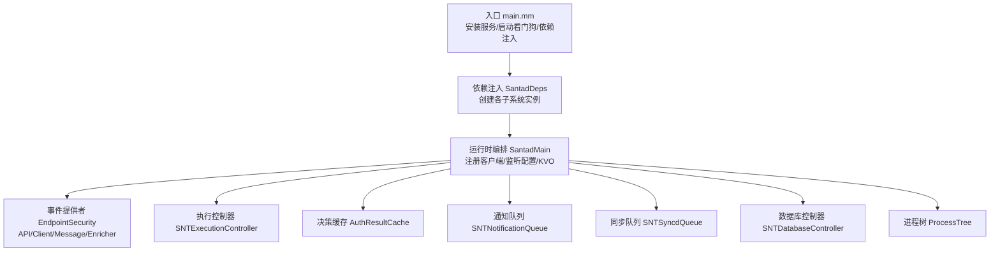

图表来源
- [main.mm](file://Source/santad/main.mm#L104-L151)
- [SantadDeps.mm](file://Source/santad/SantadDeps.mm#L50-L228)
- [Santad.mm](file://Source/santad/Santad.mm#L73-L150)

章节来源
- [main.mm](file://Source/santad/main.mm#L104-L151)
- [SantadDeps.mm](file://Source/santad/SantadDeps.mm#L50-L228)
- [Santad.mm](file://Source/santad/Santad.mm#L73-L150)

## 核心组件
- 入口与看门狗：负责安装系统服务、启动看门狗线程、创建依赖注入容器并调用运行时主函数。
- 依赖注入容器（SantadDeps）：集中创建并装配所有核心子系统，包括 EndpointSecurity API、日志、指标、执行控制器、通知队列、同步队列、决策缓存、进程树、TTY 写入器等，并通过属性访问器暴露给运行时主函数。
- 运行时主函数（SantadMain）：完成 XPC 控制接口导出、设备与监控客户端启用、策略处理器与文件访问授权器配置、KVO 配置监听、预热决策缓存、启动定时器与事件循环。
- 事件提供者：封装 Apple EndpointSecurity API，提供订阅、取消订阅、消息保留释放、认证响应、路径/进程静音等能力。
- 执行控制器：对执行事件进行快速判定、发送内核响应、记录事件、触发通知与上传。
- 决策缓存：基于 vnode 的二级缓存，支持按用户态/根态区分与批量刷新。
- 通知与同步：通知队列承载 GUI 交互，同步队列承载事件与遥测上传。
- 数据库控制器：提供事件表与规则表的单例访问。
- 进程树：维护系统进程树状态，支持注解与跨事件一致性。

章节来源
- [main.mm](file://Source/santad/main.mm#L104-L151)
- [SantadDeps.mm](file://Source/santad/SantadDeps.mm#L50-L228)
- [Santad.mm](file://Source/santad/Santad.mm#L73-L150)
- [EndpointSecurityAPI.h](file://Source/santad/EventProviders/EndpointSecurity/EndpointSecurityAPI.h#L30-L76)
- [Client.h](file://Source/santad/EventProviders/EndpointSecurity/Client.h#L24-L66)
- [Message.h](file://Source/santad/EventProviders/EndpointSecurity/Message.h#L30-L90)
- [Enricher.h](file://Source/santad/EventProviders/EndpointSecurity/Enricher.h#L35-L70)
- [AuthResultCache.h](file://Source/santad/EventProviders/AuthResultCache.h#L50-L98)
- [SNTNotificationQueue.h](file://Source/santad/SNTNotificationQueue.h#L28-L47)
- [SNTSyncdQueue.h](file://Source/santad/SNTSyncdQueue.h#L24-L43)
- [SNTDatabaseController.h](file://Source/santad/SNTDatabaseController.h#L25-L41)
- [process_tree.h](file://Source/santad/ProcessTree/process_tree.h#L34-L110)

## 架构总览
santad 将系统安全策略的决策、执行、记录与上报解耦为多个协作组件。入口负责初始化与看门狗，依赖注入容器负责装配，运行时主函数负责编排与配置监听，事件提供者负责从内核接收事件，执行控制器负责策略判定与内核响应，决策缓存负责热点命中，通知与同步负责用户体验与数据上送，数据库控制器负责持久化，进程树负责上下文增强。

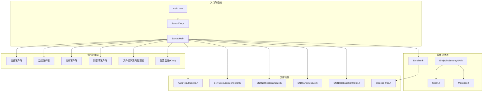

图表来源
- [main.mm](file://Source/santad/main.mm#L104-L151)
- [SantadDeps.mm](file://Source/santad/SantadDeps.mm#L50-L228)
- [Santad.mm](file://Source/santad/Santad.mm#L73-L150)
- [EndpointSecurityAPI.h](file://Source/santad/EventProviders/EndpointSecurity/EndpointSecurityAPI.h#L30-L76)
- [Client.h](file://Source/santad/EventProviders/EndpointSecurity/Client.h#L24-L66)
- [Message.h](file://Source/santad/EventProviders/EndpointSecurity/Message.h#L30-L90)
- [Enricher.h](file://Source/santad/EventProviders/EndpointSecurity/Enricher.h#L35-L70)
- [AuthResultCache.h](file://Source/santad/EventProviders/AuthResultCache.h#L50-L98)
- [SNTExecutionController.h](file://Source/santad/SNTExecutionController.h#L63-L107)
- [SNTNotificationQueue.h](file://Source/santad/SNTNotificationQueue.h#L28-L47)
- [SNTSyncdQueue.h](file://Source/santad/SNTSyncdQueue.h#L24-L43)
- [SNTDatabaseController.h](file://Source/santad/SNTDatabaseController.h#L25-L41)
- [process_tree.h](file://Source/santad/ProcessTree/process_tree.h#L34-L110)

## 详细组件分析

### 组件A：入口与看门狗（main.mm）
- 安装系统服务：通过脚本安装相关服务。
- 看门狗线程：周期性检查 CPU/内存使用，超过阈值发出警告并统计峰值。
- 依赖注入：创建配置器、指标集与挂起/恢复阻断器，构建 SantadDeps。
- 启动运行时主函数：传入 ES API、日志、指标、WatchItems、Enricher、认证结果缓存、控制连接、编译器控制器、通知队列、同步队列、执行控制器、前缀树、TTY 写入器、进程树、权限过滤器。

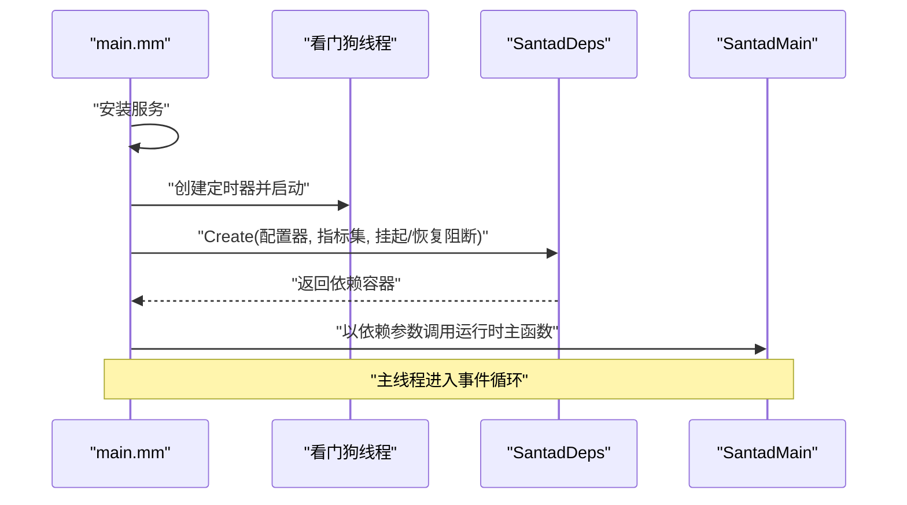

图表来源
- [main.mm](file://Source/santad/main.mm#L90-L151)
- [SantadDeps.mm](file://Source/santad/SantadDeps.mm#L50-L120)
- [Santad.mm](file://Source/santad/Santad.mm#L73-L100)

章节来源
- [main.mm](file://Source/santad/main.mm#L90-L151)

### 组件B：依赖注入容器（SantadDeps）
- 职责：集中创建并装配以下组件：
  - XPC 控制连接（特权/非特权接口）
  - 规则表与事件表（数据库控制器）
  - 编译器控制器
  - 通知队列（环形缓冲）
  - 同步队列（带缓存大小）
  - TTY 写入器
  - 权限过滤器
  - 策略处理器（结合规则表与权限过滤器）
  - 执行控制器（结合规则表、事件表、通知队列、同步队列、TTY 写入器、策略处理器、进程控制阻断器）
  - 前缀树（用于文件变更过滤）
  - EndpointSecurity API 包装
  - 日志器（根据配置决定导出策略、遥测开关、写盘阈值、刷新超时等）
  - WatchItems（优先级：数据库规则 > 内嵌配置 > 配置文件）
  - 指标器
  - 认证结果缓存
  - 进程树（可选注解器：originator）

- 关键点：
  - WatchItems 的数据源优先级与回调联动，确保规则变化时及时更新。
  - TTY 写入器支持静默模式切换。
  - 日志器与遥测导出参数来自配置器。
  - 执行控制器持有策略处理器与规则表，用于快速判定与持久化。

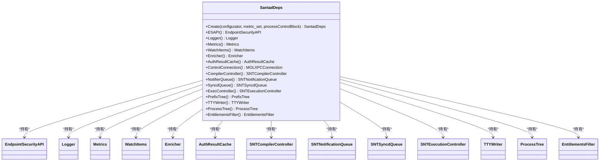

图表来源
- [SantadDeps.h](file://Source/santad/SantadDeps.h#L45-L101)
- [SantadDeps.mm](file://Source/santad/SantadDeps.mm#L50-L228)

章节来源
- [SantadDeps.h](file://Source/santad/SantadDeps.h#L45-L101)
- [SantadDeps.mm](file://Source/santad/SantadDeps.mm#L50-L228)

### 组件C：运行时主函数（SantadMain）
- XPC 控制接口导出与启用。
- 设备客户端：订阅 USB/网络挂载事件，触发通知与同步队列。
- 监控客户端：订阅记录事件，结合编译器控制器、前缀树与进程树。
- 授权客户端：订阅执行事件，结合执行控制器、编译器控制器、认证结果缓存与 TTY 写入器。
- 防篡改客户端：调试构建不启用。
- 文件访问策略处理器（FAA）：速率限制、策略匹配、事件落库与立即上传。
- 数据/进程文件访问授权器：与 WatchItems 协作，触发通知。
- 执行控制器：快速判定、内核响应、事件持久化、通知与上传。
- 预热决策缓存：异步回填，结合权限过滤器。
- 启动 WatchItems 定时器与事件循环。
- 配置监听（KVO）：覆盖客户端模式、同步基地址、统计收集、组织 ID、指标导出、指标间隔、路径正则、USB 阻止、挂载参数、静态规则、事件日志类型、权限 TeamID/PREFIX 过滤、遥测配置、TTY 静默、机器 ID、遥测导出开关/间隔/超时/批次阈值/每批最大文件数、文件访问策略来源与更新间隔等；部分变更触发缓存刷新或优雅退出。

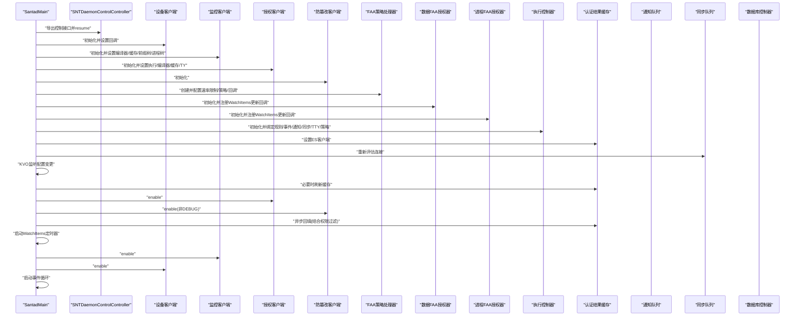

图表来源
- [Santad.mm](file://Source/santad/Santad.mm#L73-L150)
- [Santad.mm](file://Source/santad/Santad.mm#L150-L795)

章节来源
- [Santad.mm](file://Source/santad/Santad.mm#L73-L150)
- [Santad.mm](file://Source/santad/Santad.mm#L150-L795)

### 组件D：事件提供者（EndpointSecurityAPI/Client/Message/Enricher）
- EndpointSecurityAPI：封装 ES 客户端生命周期、订阅/取消、静音/反向静音、消息保留/释放、认证/标志位响应、清空缓存、执行参数/环境变量/文件描述符访问等。
- Client：轻量包装 es_client_t，避免循环引用，提供连接状态判断与所有权转移。
- Message：对 es_message_t 的安全封装，提供进程名/路径、路径目标集合、过程令牌设置等。
- Enricher：基于进程树与缓存的增强器，提供进程/文件/用户名/GID 等信息的本地/远程增强。

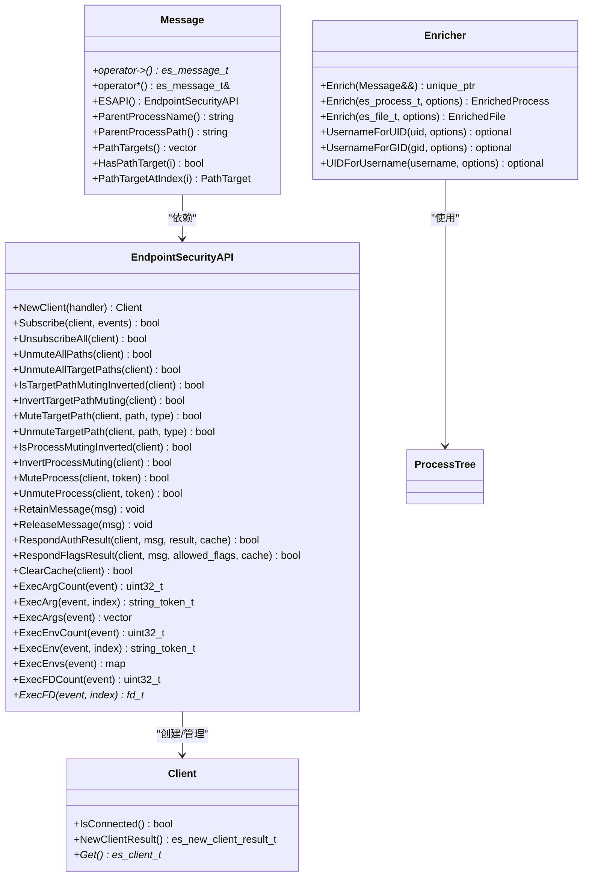

图表来源
- [EndpointSecurityAPI.h](file://Source/santad/EventProviders/EndpointSecurity/EndpointSecurityAPI.h#L30-L76)
- [Client.h](file://Source/santad/EventProviders/EndpointSecurity/Client.h#L24-L66)
- [Message.h](file://Source/santad/EventProviders/EndpointSecurity/Message.h#L30-L90)
- [Enricher.h](file://Source/santad/EventProviders/EndpointSecurity/Enricher.h#L35-L70)
- [process_tree.h](file://Source/santad/ProcessTree/process_tree.h#L34-L110)

章节来源
- [EndpointSecurityAPI.h](file://Source/santad/EventProviders/EndpointSecurity/EndpointSecurityAPI.h#L30-L76)
- [Client.h](file://Source/santad/EventProviders/EndpointSecurity/Client.h#L24-L66)
- [Message.h](file://Source/santad/EventProviders/EndpointSecurity/Message.h#L30-L90)
- [Enricher.h](file://Source/santad/EventProviders/EndpointSecurity/Enricher.h#L35-L70)
- [process_tree.h](file://Source/santad/ProcessTree/process_tree.h#L34-L110)

### 组件E：执行控制器（SNTExecutionController）
- 职责：接收执行事件，委托策略处理器判定，快速同步判定后向内核发送响应，必要时持久化事件、触发通知与上传。
- 快速路径：synchronousShouldProcessExecEvent 保证不阻塞线程。
- 关键接口：validateExecEvent/postAction、validateSuspendResumeEvent/postAction、synchronousShouldProcessExecEvent。

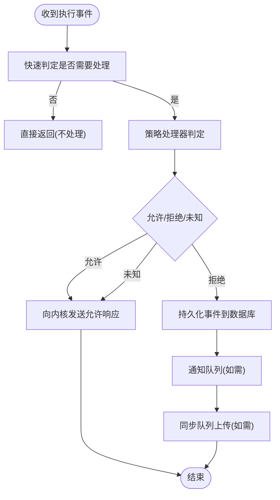

图表来源
- [SNTExecutionController.h](file://Source/santad/SNTExecutionController.h#L63-L107)
- [Santad.mm](file://Source/santad/Santad.mm#L150-L220)

章节来源
- [SNTExecutionController.h](file://Source/santad/SNTExecutionController.h#L63-L107)
- [Santad.mm](file://Source/santad/Santad.mm#L150-L220)

### 组件F：决策缓存（AuthResultCache）
- 结构：按 vnode 分为 root/non-root 两级缓存，支持添加、移除、查询、批量刷新。
- 刷新策略：根据变更原因（客户端模式、路径正则、规则、静态规则、显式命令、文件系统卸载、权限过滤变更）选择刷新范围。
- 与 ES 客户端关联：通过 SetESClient 关联，便于在必要时清空 ES 缓存。

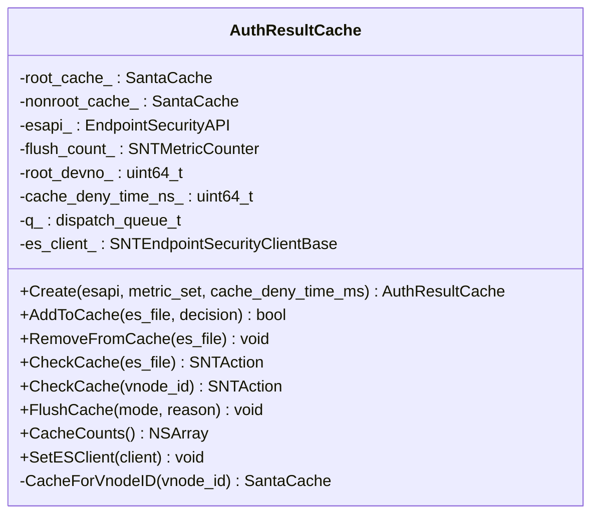

图表来源
- [AuthResultCache.h](file://Source/santad/EventProviders/AuthResultCache.h#L50-L98)

章节来源
- [AuthResultCache.h](file://Source/santad/EventProviders/AuthResultCache.h#L50-L98)

### 组件G：通知与同步（SNTNotificationQueue/SNTSyncdQueue）
- 通知队列：承载待处理通知的环形缓冲，提供添加事件、临时监控模式授权等接口。
- 同步队列：承载事件与遥测文件上传，支持重新评估连接、批量事件/包事件入队、遥测文件导出等。

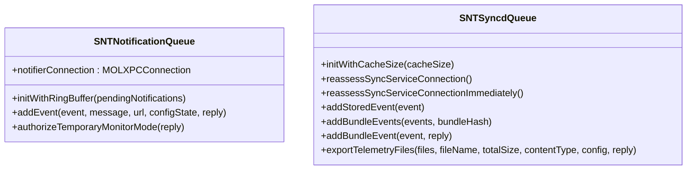

图表来源
- [SNTNotificationQueue.h](file://Source/santad/SNTNotificationQueue.h#L28-L47)
- [SNTSyncdQueue.h](file://Source/santad/SNTSyncdQueue.h#L24-L43)

章节来源
- [SNTNotificationQueue.h](file://Source/santad/SNTNotificationQueue.h#L28-L47)
- [SNTSyncdQueue.h](file://Source/santad/SNTSyncdQueue.h#L24-L43)

### 组件H：数据库控制器（SNTDatabaseController）
- 提供事件表与规则表的单例访问，确保多处使用共享同一数据库队列。

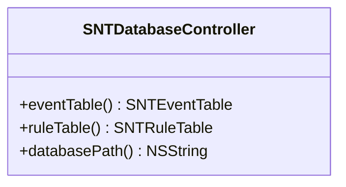

图表来源
- [SNTDatabaseController.h](file://Source/santad/SNTDatabaseController.h#L25-L41)

章节来源
- [SNTDatabaseController.h](file://Source/santad/SNTDatabaseController.h#L25-L41)

## 依赖分析
- 组件耦合与内聚：
  - SantadDeps 高内聚地封装了所有子系统的创建与装配，降低外部耦合。
  - SantadMain 通过依赖注入获得各组件，保持运行时编排与具体实现分离。
  - 事件提供者与执行控制器之间通过消息与策略处理器解耦。
- 外部依赖：
  - EndpointSecurity API 为底层事件源。
  - XPC 用于控制接口与通知转发。
  - FMDB 用于数据库访问。
- 循环依赖规避：
  - Client 对 ES 客户端的销毁避免在 API 中直接持有，防止循环引用。

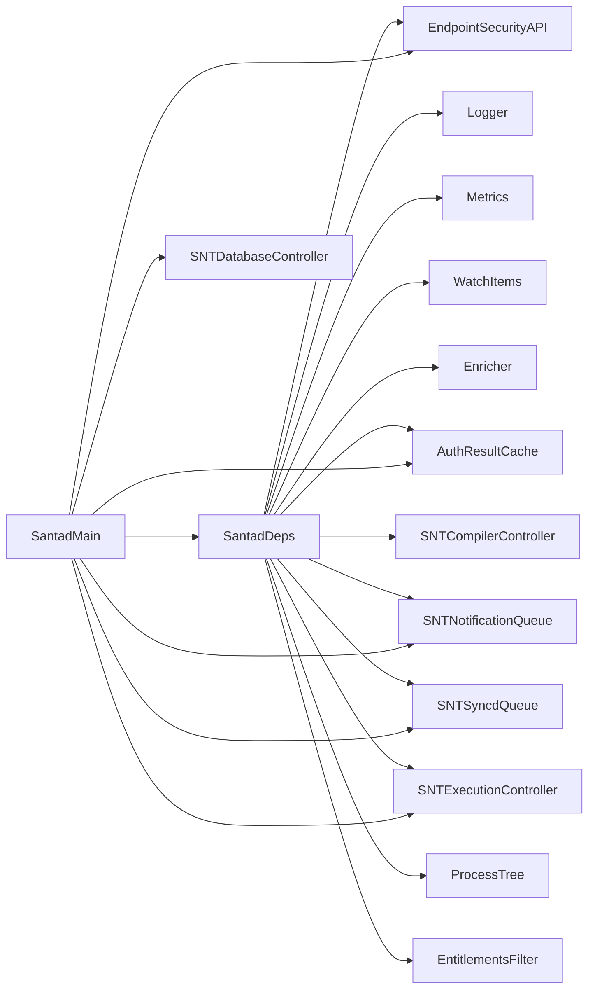

图表来源
- [SantadDeps.mm](file://Source/santad/SantadDeps.mm#L50-L228)
- [Santad.mm](file://Source/santad/Santad.mm#L73-L150)

章节来源
- [SantadDeps.mm](file://Source/santad/SantadDeps.mm#L50-L228)
- [Santad.mm](file://Source/santad/Santad.mm#L73-L150)

## 性能考虑
- 快速判定：执行控制器的同步快速路径避免阻塞事件线程，减少内核等待。
- 缓存策略：认证结果缓存按用户态/根态分离，deny 缓存时间折中以兼顾响应速度与规则变更生效。
- 前缀树与静音：通过前缀树与路径/进程静音减少无关事件处理。
- 日志与遥测：阈值与超时参数可调，避免写盘压力过大；遥测导出按批次与阈值控制。
- 进程树注解：仅在需要时进行远程增强，本地增强为主，降低开销。

## 故障排查指南
- 看门狗告警：CPU/内存使用异常升高时会记录警告并统计峰值，建议检查事件处理负载与日志写入频率。
- 配置变更导致的优雅退出：当事件日志类型变更时，守护进程会刷新日志与指标并退出，由系统立即重启，确保新配置生效。
- 缓存刷新：当客户端模式、路径正则、静态规则或权限过滤器发生变化时，会触发缓存刷新，必要时清空 ES 缓存以保证策略一致性。
- 同步连接重评估：当同步基地址、统计收集、组织 ID 或遥测导出开关变化时，会重新评估同步服务连接。
- 执行失败定位：检查执行控制器的判定链路、策略处理器规则、数据库事件表状态与同步队列上传情况。

章节来源
- [main.mm](file://Source/santad/main.mm#L45-L88)
- [Santad.mm](file://Source/santad/Santad.mm#L430-L452)
- [Santad.mm](file://Source/santad/Santad.mm#L240-L263)
- [Santad.mm](file://Source/santad/Santad.mm#L340-L363)
- [Santad.mm](file://Source/santad/Santad.mm#L416-L422)
- [Santad.mm](file://Source/santad/Santad.mm#L462-L474)

## 结论
santad 通过清晰的依赖注入与运行时编排，将复杂的系统安全策略决策与执行流程解耦为多个高内聚组件。其配置监听与动态更新机制确保策略可演进，优雅重启策略保障配置变更的原子生效。配合缓存、日志、通知与同步等子系统，santad 在保证安全性的同时兼顾性能与可观测性。

## 附录
- 启动流程图（映射实际代码）
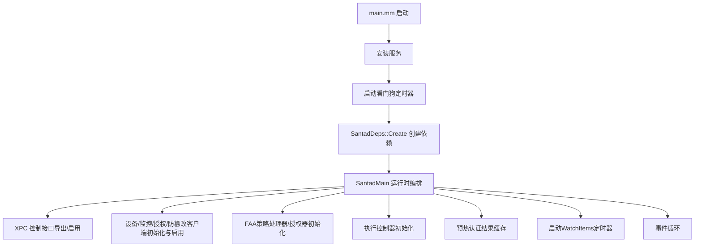

图表来源
- [main.mm](file://Source/santad/main.mm#L104-L151)
- [SantadDeps.mm](file://Source/santad/SantadDeps.mm#L50-L228)
- [Santad.mm](file://Source/santad/Santad.mm#L73-L150)
- [Santad.mm](file://Source/santad/Santad.mm#L750-L795)