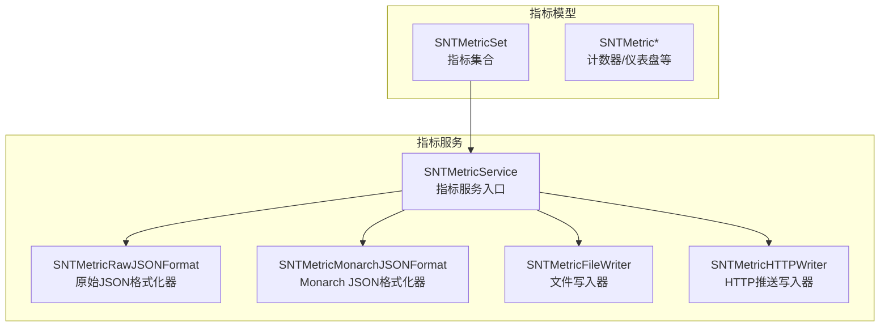
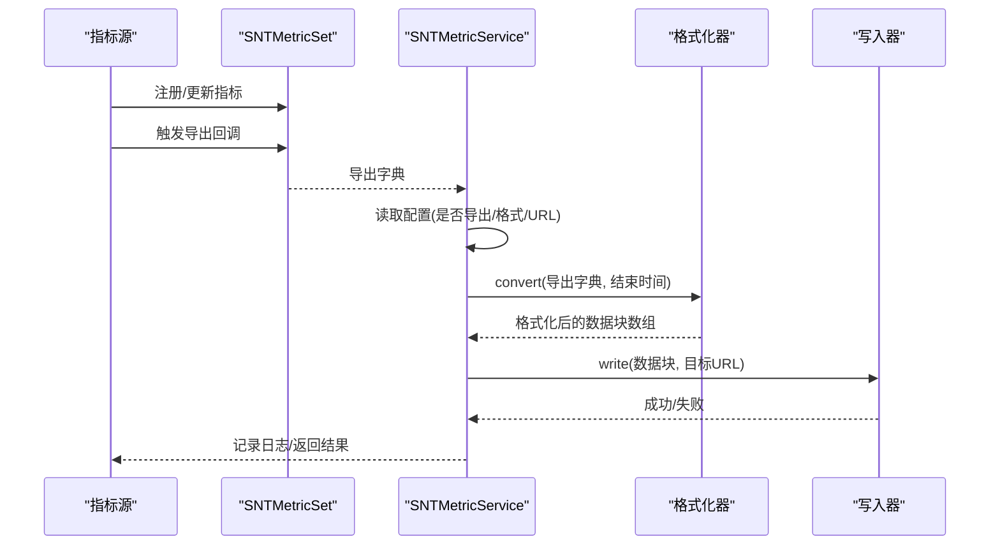
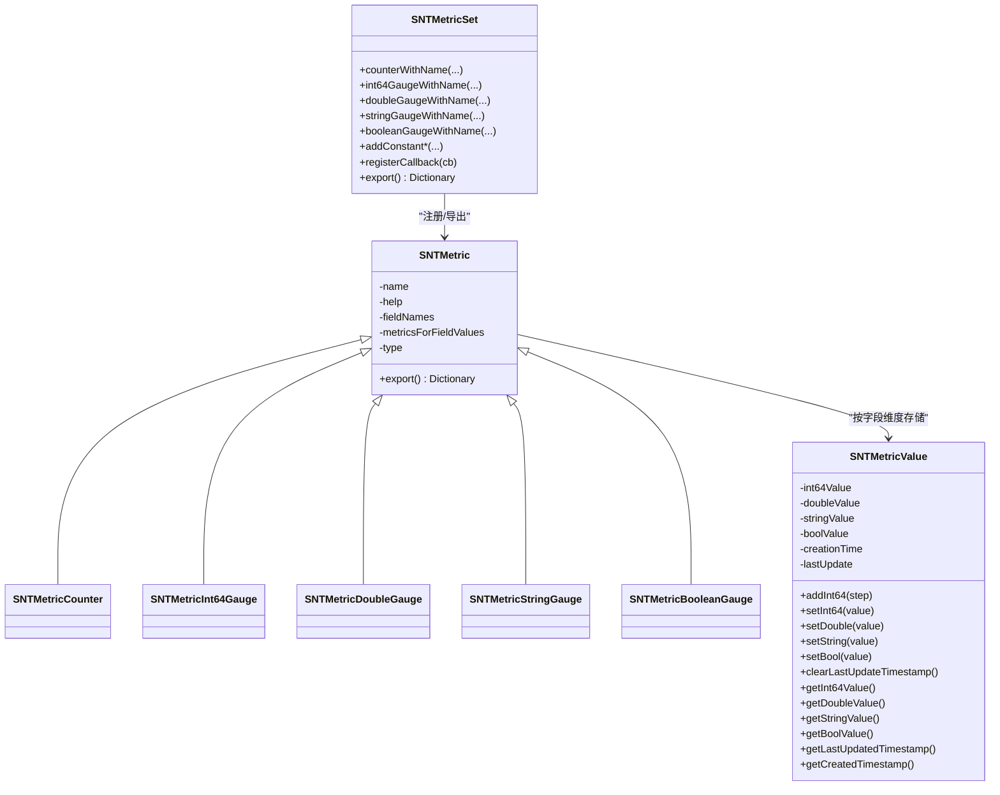
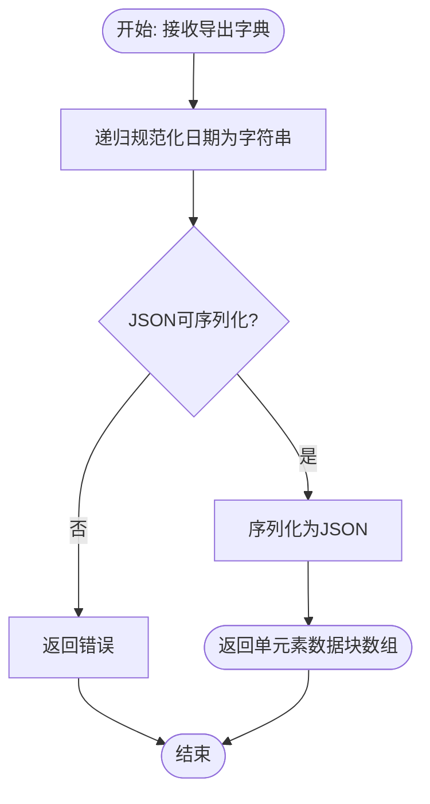
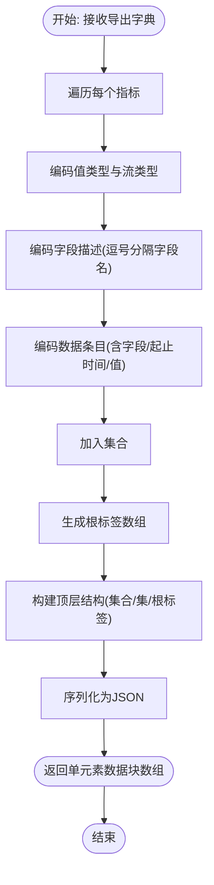
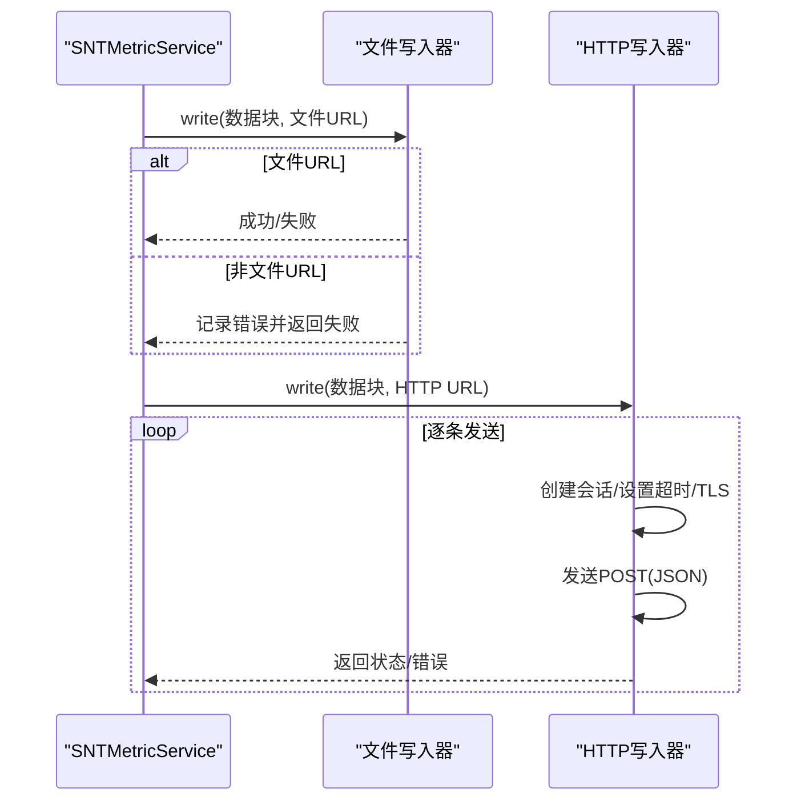
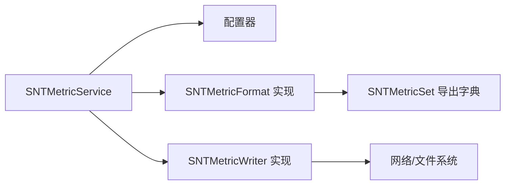

# 指标服务

<cite>
**本文引用的文件**
- [Source/santametricservice/SNTMetricService.h](file://Source/santametricservice/SNTMetricService.h)
- [Source/santametricservice/SNTMetricService.mm](file://Source/santametricservice/SNTMetricService.mm)
- [Source/common/SNTMetricSet.h](file://Source/common/SNTMetricSet.h)
- [Source/common/SNTMetricSet.mm](file://Source/common/SNTMetricSet.mm)
- [Source/santametricservice/Formats/SNTMetricFormat.h](file://Source/santametricservice/Formats/SNTMetricFormat.h)
- [Source/santametricservice/Formats/SNTMetricRawJSONFormat.h](file://Source/santametricservice/Formats/SNTMetricRawJSONFormat.h)
- [Source/santametricservice/Formats/SNTMetricRawJSONFormat.mm](file://Source/santametricservice/Formats/SNTMetricRawJSONFormat.mm)
- [Source/santametricservice/Formats/SNTMetricMonarchJSONFormat.h](file://Source/santametricservice/Formats/SNTMetricMonarchJSONFormat.h)
- [Source/santametricservice/Formats/SNTMetricMonarchJSONFormat.mm](file://Source/santametricservice/Formats/SNTMetricMonarchJSONFormat.mm)
- [Source/santametricservice/Writers/SNTMetricWriter.h](file://Source/santametricservice/Writers/SNTMetricWriter.h)
- [Source/santametricservice/Writers/SNTMetricFileWriter.h](file://Source/santametricservice/Writers/SNTMetricFileWriter.h)
- [Source/santametricservice/Writers/SNTMetricFileWriter.mm](file://Source/santametricservice/Writers/SNTMetricFileWriter.mm)
- [Source/santametricservice/Writers/SNTMetricHTTPWriter.h](file://Source/santametricservice/Writers/SNTMetricHTTPWriter.h)
- [Source/santametricservice/Writers/SNTMetricHTTPWriter.mm](file://Source/santametricservice/Writers/SNTMetricHTTPWriter.mm)
</cite>

## 目录
1. [简介](#简介)
2. [项目结构](#项目结构)
3. [核心组件](#核心组件)
4. [架构总览](#架构总览)
5. [详细组件分析](#详细组件分析)
6. [依赖关系分析](#依赖关系分析)
7. [性能考虑](#性能考虑)
8. [故障排查指南](#故障排查指南)
9. [结论](#结论)
10. [附录：导出配置说明](#附录导出配置说明)

## 简介
本技术文档围绕 Santa 指标服务展开，系统性阐述指标采集机制、数据聚合与统计计算逻辑、格式化器设计（原始 JSON 与 Monarch JSON 的差异）、指标写入器的多种输出方式（文件写入、HTTP 推送），以及定时调度、批处理与性能优化策略。文档同时给出指标数据模型、格式转换流程与导出配置说明，帮助运维工程师与数据分析师完成监控系统的集成与维护。

## 项目结构
指标服务位于独立模块中，采用“格式化器 + 写入器”的可插拔架构，配合通用指标集合模型进行采集、聚合与导出。

图示来源
- [Source/santametricservice/SNTMetricService.mm](file://Source/santametricservice/SNTMetricService.mm#L33-L128)
- [Source/common/SNTMetricSet.h](file://Source/common/SNTMetricSet.h#L84-L192)
- [Source/santametricservice/Formats/SNTMetricRawJSONFormat.mm](file://Source/santametricservice/Formats/SNTMetricRawJSONFormat.mm#L80-L106)
- [Source/santametricservice/Formats/SNTMetricMonarchJSONFormat.mm](file://Source/santametricservice/Formats/SNTMetricMonarchJSONFormat.mm#L202-L248)
- [Source/santametricservice/Writers/SNTMetricFileWriter.mm](file://Source/santametricservice/Writers/SNTMetricFileWriter.mm#L36-L71)
- [Source/santametricservice/Writers/SNTMetricHTTPWriter.mm](file://Source/santametricservice/Writers/SNTMetricHTTPWriter.mm#L51-L118)

章节来源
- [Source/santametricservice/SNTMetricService.h](file://Source/santametricservice/SNTMetricService.h#L15-L21)
- [Source/santametricservice/SNTMetricService.mm](file://Source/santametricservice/SNTMetricService.mm#L33-L128)
- [Source/common/SNTMetricSet.h](file://Source/common/SNTMetricSet.h#L36-L192)

## 核心组件
- 指标集合 SNTMetricSet：提供指标注册、回调注入、导出能力；支持计数器、整型/双精度/布尔/字符串仪表盘、常量指标等类型。
- 指标格式化器协议 SNTMetricFormat：定义统一的 convert 接口，支持将导出字典转换为指定格式的数据块数组。
- 原始 JSON 格式化器 SNTMetricRawJSONFormat：对导出字典进行日期标准化与 JSON 序列化。
- Monarch JSON 格式化器 SNTMetricMonarchJSONFormat：将指标映射为 Monarch 所需的字段描述、流类型、值类型与时间戳结构，并序列化为 JSON。
- 指标写入器接口 SNTMetricWriter：统一的写入协议，当前实现包括文件写入器与 HTTP 写入器。
- 文件写入器 SNTMetricFileWriter：按行输出 JSON 对象到文件。
- HTTP 写入器 SNTMetricHTTPWriter：逐条 POST JSON 到目标 URL，支持超时与 TLS 配置。

章节来源
- [Source/common/SNTMetricSet.h](file://Source/common/SNTMetricSet.h#L36-L192)
- [Source/common/SNTMetricSet.mm](file://Source/common/SNTMetricSet.mm#L434-L668)
- [Source/santametricservice/Formats/SNTMetricFormat.h](file://Source/santametricservice/Formats/SNTMetricFormat.h#L15-L22)
- [Source/santametricservice/Formats/SNTMetricRawJSONFormat.mm](file://Source/santametricservice/Formats/SNTMetricRawJSONFormat.mm#L33-L106)
- [Source/santametricservice/Formats/SNTMetricMonarchJSONFormat.mm](file://Source/santametricservice/Formats/SNTMetricMonarchJSONFormat.mm#L55-L248)
- [Source/santametricservice/Writers/SNTMetricWriter.h](file://Source/santametricservice/Writers/SNTMetricWriter.h#L15-L24)
- [Source/santametricservice/Writers/SNTMetricFileWriter.mm](file://Source/santametricservice/Writers/SNTMetricFileWriter.mm#L36-L71)
- [Source/santametricservice/Writers/SNTMetricHTTPWriter.mm](file://Source/santametricservice/Writers/SNTMetricHTTPWriter.mm#L51-L118)

## 架构总览
指标服务在收到导出请求后，根据配置选择格式化器与写入器，将指标集合导出并写入目标系统。整体流程如下：

图示来源
- [Source/santametricservice/SNTMetricService.mm](file://Source/santametricservice/SNTMetricService.mm#L94-L128)
- [Source/common/SNTMetricSet.mm](file://Source/common/SNTMetricSet.mm#L606-L633)
- [Source/santametricservice/Formats/SNTMetricRawJSONFormat.mm](file://Source/santametricservice/Formats/SNTMetricRawJSONFormat.mm#L80-L106)
- [Source/santametricservice/Formats/SNTMetricMonarchJSONFormat.mm](file://Source/santametricservice/Formats/SNTMetricMonarchJSONFormat.mm#L223-L248)
- [Source/santametricservice/Writers/SNTMetricFileWriter.mm](file://Source/santametricservice/Writers/SNTMetricFileWriter.mm#L36-L71)
- [Source/santametricservice/Writers/SNTMetricHTTPWriter.mm](file://Source/santametricservice/Writers/SNTMetricHTTPWriter.mm#L51-L118)

## 详细组件分析

### 指标数据模型与聚合逻辑
- 指标类型覆盖：常量布尔/字符串/整型/双精度、仪表盘（布尔/字符串/整型/双精度）与计数器。
- 字段维度：指标可带字段名列表，值以字段值元组索引，内部使用线程安全容器存储每个字段组合的值与时间戳。
- 聚合与导出：导出时将每个指标编码为包含类型、字段描述、字段值列表与数据项（含创建/更新时间戳与实际数值）的结构；Monarch 格式化器会进一步映射为流类型与值类型。

图示来源
- [Source/common/SNTMetricSet.h](file://Source/common/SNTMetricSet.h#L36-L192)
- [Source/common/SNTMetricSet.mm](file://Source/common/SNTMetricSet.mm#L434-L668)

章节来源
- [Source/common/SNTMetricSet.h](file://Source/common/SNTMetricSet.h#L36-L192)
- [Source/common/SNTMetricSet.mm](file://Source/common/SNTMetricSet.mm#L434-L668)

### 原始 JSON 格式化器（Raw JSON）
- 作用：将导出字典中的日期对象标准化为 ISO8601 字符串，再进行 JSON 序列化，输出单个 JSON 数据块。
- 关键点：递归规范化字典与数组中的日期对象；校验 JSON 可序列化性；使用美化打印便于阅读。

图示来源
- [Source/santametricservice/Formats/SNTMetricRawJSONFormat.mm](file://Source/santametricservice/Formats/SNTMetricRawJSONFormat.mm#L33-L106)

章节来源
- [Source/santametricservice/Formats/SNTMetricRawJSONFormat.h](file://Source/santametricservice/Formats/SNTMetricRawJSONFormat.h#L15-L21)
- [Source/santametricservice/Formats/SNTMetricRawJSONFormat.mm](file://Source/santametricservice/Formats/SNTMetricRawJSONFormat.mm#L33-L106)

### Monarch JSON 格式化器（Monarch JSON）
- 作用：将指标集合转换为 Monarch 工具链可消费的结构，包含度量集合、度量集、字段描述、根标签、数据条目等。
- 关键点：
  - 将指标类型映射为值类型与流类型（GAUGE/CUMULATIVE）。
  - 将字段名与字段值拆分为结构化字段数组。
  - 使用 ISO8601 时间戳，且每次导出均更新结束时间。
  - 输出单个 JSON 数据块。

图示来源
- [Source/santametricservice/Formats/SNTMetricMonarchJSONFormat.mm](file://Source/santametricservice/Formats/SNTMetricMonarchJSONFormat.mm#L55-L248)

章节来源
- [Source/santametricservice/Formats/SNTMetricMonarchJSONFormat.h](file://Source/santametricservice/Formats/SNTMetricMonarchJSONFormat.h#L15-L21)
- [Source/santametricservice/Formats/SNTMetricMonarchJSONFormat.mm](file://Source/santametricservice/Formats/SNTMetricMonarchJSONFormat.mm#L55-L248)

### 指标写入器：文件写入与 HTTP 推送
- 文件写入器：
  - 仅当 URL 为文件 URL 时生效；以追加模式打开文件，逐条写入 JSON 并换行。
  - 权限控制：默认以受限权限创建/打开文件。
- HTTP 写入器：
  - 使用认证会话，启用 TLS 最低版本与管线化；逐条 POST JSON 至目标 URL。
  - 同步等待每条任务完成，记录最后一次错误；状态码非 200 时视为失败。

图示来源
- [Source/santametricservice/Writers/SNTMetricFileWriter.mm](file://Source/santametricservice/Writers/SNTMetricFileWriter.mm#L36-L71)
- [Source/santametricservice/Writers/SNTMetricHTTPWriter.mm](file://Source/santametricservice/Writers/SNTMetricHTTPWriter.mm#L51-L118)

章节来源
- [Source/santametricservice/Writers/SNTMetricFileWriter.h](file://Source/santametricservice/Writers/SNTMetricFileWriter.h#L14-L18)
- [Source/santametricservice/Writers/SNTMetricFileWriter.mm](file://Source/santametricservice/Writers/SNTMetricFileWriter.mm#L36-L71)
- [Source/santametricservice/Writers/SNTMetricHTTPWriter.h](file://Source/santametricservice/Writers/SNTMetricHTTPWriter.h#L15-L21)
- [Source/santametricservice/Writers/SNTMetricHTTPWriter.mm](file://Source/santametricservice/Writers/SNTMetricHTTPWriter.mm#L51-L118)

### 定时调度、批处理与性能优化
- 定时调度：指标服务通过外部触发导出（例如周期性任务或事件驱动）。导出前会执行已注册的回调，确保指标最新。
- 批处理：格式化器输出为“单个 JSON 数据块数组”，写入器逐条处理；HTTP 写入器采用同步等待，保证顺序与一致性。
- 性能优化：
  - 导出路径使用后台队列处理，避免阻塞主线程。
  - 写入器在文件写入时使用受限权限创建文件，减少不必要的权限变更。
  - HTTP 写入器启用 TLS 与管线化，提升传输效率。

章节来源
- [Source/santametricservice/SNTMetricService.mm](file://Source/santametricservice/SNTMetricService.mm#L51-L55)
- [Source/common/SNTMetricSet.mm](file://Source/common/SNTMetricSet.mm#L606-L633)
- [Source/santametricservice/Writers/SNTMetricHTTPWriter.mm](file://Source/santametricservice/Writers/SNTMetricHTTPWriter.mm#L37-L49)

## 依赖关系分析
- SNTMetricService 依赖配置器读取导出开关、格式类型与目标 URL；根据 scheme 选择写入器。
- 格式化器依赖指标集合导出字典；Monarch 格式化器额外依赖指标类型枚举与日期格式化器。
- 写入器依赖配置器获取超时等参数；HTTP 写入器依赖认证会话与 TLS 设置。

图示来源
- [Source/santametricservice/SNTMetricService.mm](file://Source/santametricservice/SNTMetricService.mm#L94-L128)
- [Source/common/SNTMetricSet.mm](file://Source/common/SNTMetricSet.mm#L606-L633)
- [Source/santametricservice/Writers/SNTMetricHTTPWriter.mm](file://Source/santametricservice/Writers/SNTMetricHTTPWriter.mm#L37-L49)

章节来源
- [Source/santametricservice/SNTMetricService.mm](file://Source/santametricservice/SNTMetricService.mm#L94-L128)
- [Source/common/SNTMetricSet.mm](file://Source/common/SNTMetricSet.mm#L606-L633)

## 性能考虑
- 导出回调在导出前执行，确保指标最新，避免重复计算。
- 后台队列处理导出与写入，降低对前台任务的影响。
- HTTP 写入器启用 TLS 与管线化，减少握手开销；逐条等待有助于错误定位与重试策略实施。
- 文件写入器以追加模式写入，减少随机写带来的性能损耗。

## 故障排查指南
- 导出未发生：
  - 检查配置器是否开启指标导出。
  - 确认传入的导出字典非空。
- 格式化失败：
  - 原始 JSON：检查导出字典中是否存在不可序列化的对象。
  - Monarch JSON：检查指标类型与字段结构是否符合预期。
- 写入失败：
  - 文件写入：确认 URL 为文件 URL，检查权限与磁盘空间。
  - HTTP 写入：查看返回状态码与错误信息，核对目标主机、TLS 配置与超时设置。

章节来源
- [Source/santametricservice/SNTMetricService.mm](file://Source/santametricservice/SNTMetricService.mm#L94-L128)
- [Source/santametricservice/Formats/SNTMetricRawJSONFormat.mm](file://Source/santametricservice/Formats/SNTMetricRawJSONFormat.mm#L80-L106)
- [Source/santametricservice/Formats/SNTMetricMonarchJSONFormat.mm](file://Source/santametricservice/Formats/SNTMetricMonarchJSONFormat.mm#L223-L248)
- [Source/santametricservice/Writers/SNTMetricFileWriter.mm](file://Source/santametricservice/Writers/SNTMetricFileWriter.mm#L36-L71)
- [Source/santametricservice/Writers/SNTMetricHTTPWriter.mm](file://Source/santametricservice/Writers/SNTMetricHTTPWriter.mm#L91-L118)

## 结论
Santa 指标服务通过统一的指标集合模型与可插拔的格式化器/写入器架构，实现了灵活的指标采集、聚合与导出能力。原始 JSON 适合人类可读与快速验证，Monarch JSON 则满足企业级监控工具链的结构化需求。结合后台队列与 TLS/管线化优化，可在保证正确性的同时兼顾性能与可靠性。

## 附录：导出配置说明
- 导出开关：由配置器决定是否导出指标。
- 格式类型：支持原始 JSON 与 Monarch JSON。
- 目标 URL：根据 scheme 选择写入器（如 file/http）。
- 超时设置：HTTP 写入器使用配置器提供的导出超时参数。

章节来源
- [Source/santametricservice/SNTMetricService.mm](file://Source/santametricservice/SNTMetricService.mm#L94-L128)
- [Source/santametricservice/Writers/SNTMetricHTTPWriter.mm](file://Source/santametricservice/Writers/SNTMetricHTTPWriter.mm#L37-L49)