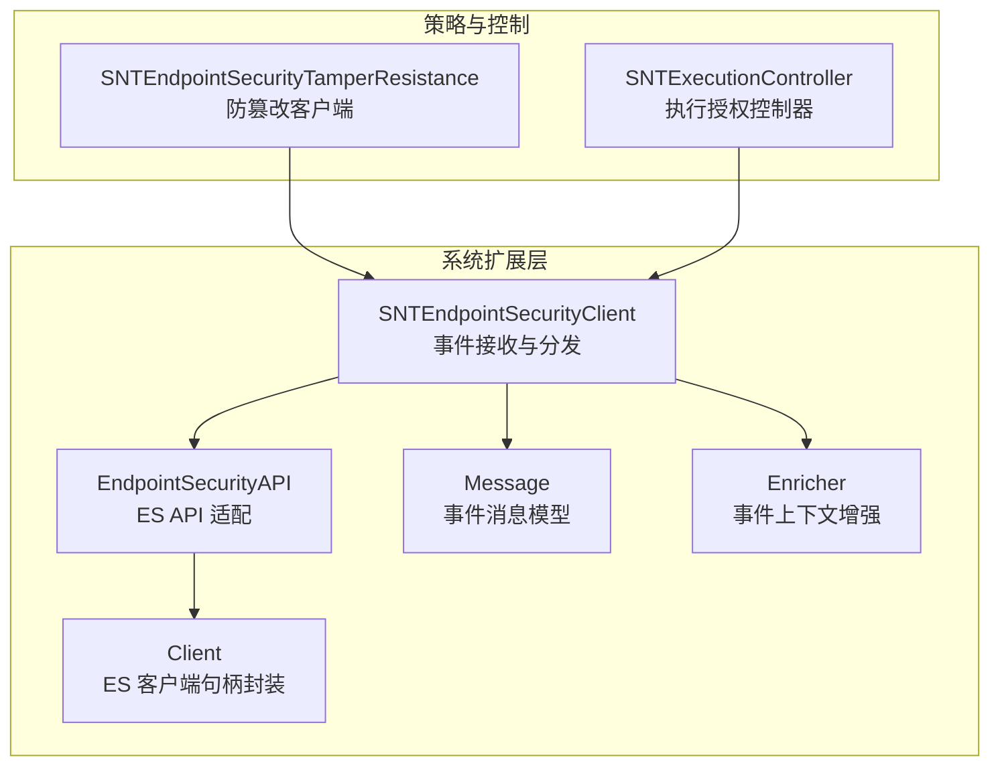
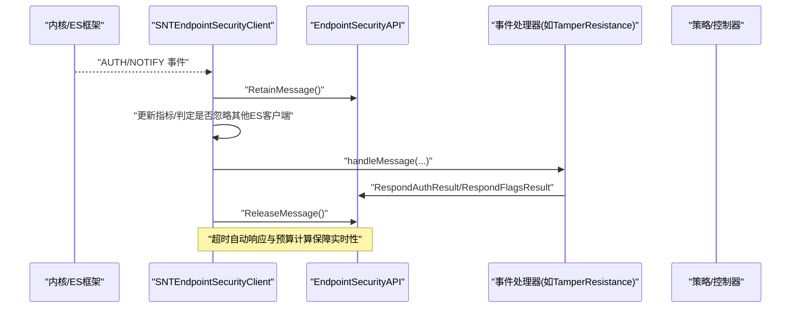
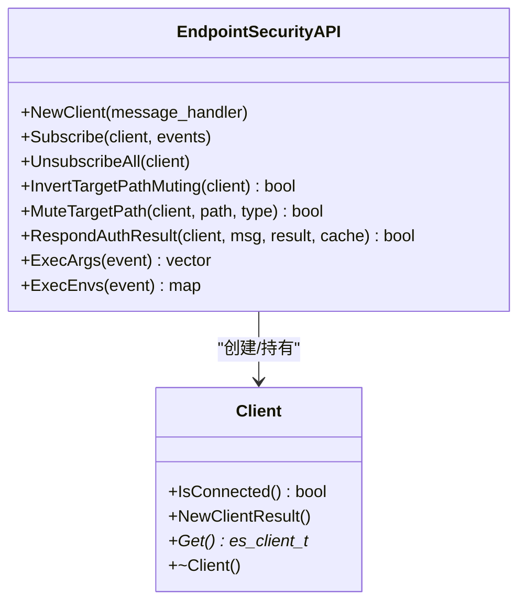
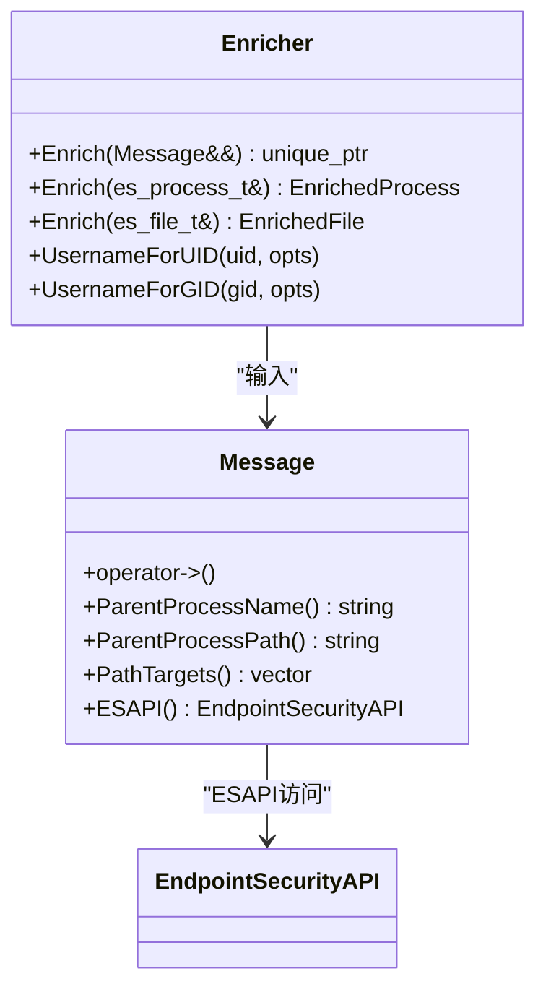
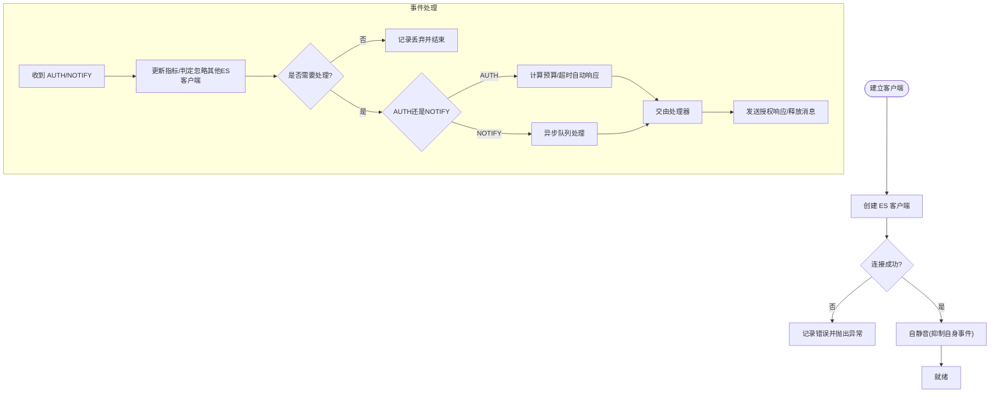
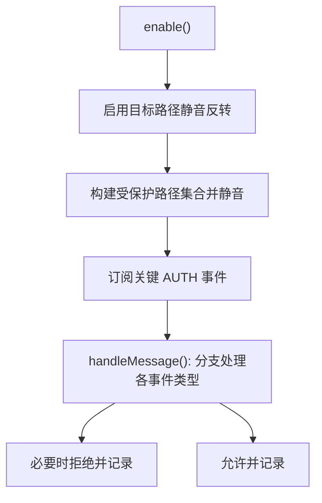
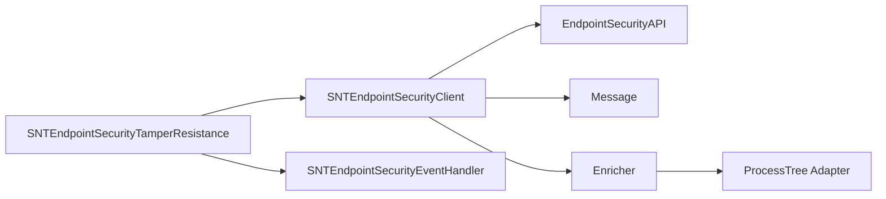

# 系统扩展组件

<cite>
**本文引用的文件**
- [EndpointSecurityAPI.h](file://Source/santad/EventProviders/EndpointSecurity/EndpointSecurityAPI.h)
- [EndpointSecurityAPI.mm](file://Source/santad/EventProviders/EndpointSecurity/EndpointSecurityAPI.mm)
- [Client.h](file://Source/santad/EventProviders/EndpointSecurity/Client.h)
- [Message.h](file://Source/santad/EventProviders/EndpointSecurity/Message.h)
- [Enricher.h](file://Source/santad/EventProviders/EndpointSecurity/Enricher.h)
- [Enricher.mm](file://Source/santad/EventProviders/EndpointSecurity/Enricher.mm)
- [SNTEndpointSecurityClient.h](file://Source/santad/EventProviders/SNTEndpointSecurityClient.h)
- [SNTEndpointSecurityClient.mm](file://Source/santad/EventProviders/SNTEndpointSecurityClient.mm)
- [SNTEndpointSecurityEventHandler.h](file://Source/santad/EventProviders/SNTEndpointSecurityEventHandler.h)
- [SNTEndpointSecurityTamperResistance.h](file://Source/santad/EventProviders/SNTEndpointSecurityTamperResistance.h)
- [SNTEndpointSecurityTamperResistance.mm](file://Source/santad/EventProviders/SNTEndpointSecurityTamperResistance.mm)
- [SNTExecutionController.h](file://Source/santad/SNTExecutionController.h)
- [SNTExecutionController.mm](file://Source/santad/SNTExecutionController.mm)
- [TestUtils.mm](file://Source/common/TestUtils.mm)
- [WWDC2020_EndpointSecurity_Guide.md](file://WWDC2020_EndpointSecurity_Guide.md)
- [EndpointSecurity_Research_Report.md](file://docs/EndpointSecurity_Research_Report.md)
- [ES_Mute_Flowcharts.md](file://ES_Mute_Flowcharts.md)
</cite>

## 目录
1. [引言](#引言)
2. [项目结构](#项目结构)
3. [核心组件](#核心组件)
4. [架构总览](#架构总览)
5. [组件详细分析](#组件详细分析)
6. [依赖关系分析](#依赖关系分析)
7. [性能考量](#性能考量)
8. [故障排查指南](#故障排查指南)
9. [结论](#结论)
10. [附录](#附录)

## 引言
本文件面向系统安全工程师与内核开发人员，系统性阐述 Santa 在 macOS 上通过系统扩展（System Extension）接入 Endpoint Security（ES）框架的实现细节。重点覆盖以下方面：
- 如何通过 ES API 捕获内核事件（执行、文件访问、设备与挂载、认证与登录会话、信号、进程挂起/恢复等）
- 初始化流程、事件订阅机制、权限与安全边界
- 与内核的交互方式、事件过滤与预处理逻辑
- 防篡改机制、调试模式与性能优化策略
- 提供架构图、事件流图与安全边界说明

## 项目结构
Santa 的系统扩展相关代码主要位于 Source/santad/EventProviders 下，围绕 ES API 封装、消息模型、事件处理器与增强器展开，并在上层控制器中完成授权与策略决策。

**图表来源**
- [SNTEndpointSecurityClient.mm](file://Source/santad/EventProviders/SNTEndpointSecurityClient.mm#L1-L120)
- [EndpointSecurityAPI.h](file://Source/santad/EventProviders/EndpointSecurity/EndpointSecurityAPI.h#L28-L78)
- [Client.h](file://Source/santad/EventProviders/EndpointSecurity/Client.h#L24-L65)
- [Message.h](file://Source/santad/EventProviders/EndpointSecurity/Message.h#L30-L90)
- [Enricher.h](file://Source/santad/EventProviders/EndpointSecurity/Enricher.h#L24-L70)
- [SNTEndpointSecurityTamperResistance.h](file://Source/santad/EventProviders/SNTEndpointSecurityTamperResistance.h#L19-L33)
- [SNTExecutionController.h](file://Source/santad/SNTExecutionController.h#L73-L106)

**章节来源**
- [SNTEndpointSecurityClient.mm](file://Source/santad/EventProviders/SNTEndpointSecurityClient.mm#L1-L120)
- [EndpointSecurityAPI.h](file://Source/santad/EventProviders/EndpointSecurity/EndpointSecurityAPI.h#L28-L78)

## 核心组件
- EndpointSecurityAPI：对 ES 原生 API 的薄封装，提供客户端创建、订阅/退订、静音/反向静音、响应授权结果、清理缓存、参数/环境变量/FD 访问等能力。
- Client：对 es_client_t 的 RAII 封装，负责生命周期管理与连接状态判断。
- Message：对 es_message_t 的轻量包装，提供父进程名/路径、路径目标枚举、与 ESAPI 的关联方法。
- Enricher：对事件进行上下文增强（进程、文件、用户信息），并可选择仅本地查询避免触发外部进程工作。
- SNTEndpointSecurityClient：系统扩展客户端基类，负责建立 ES 客户端、自静音、订阅/退订、事件队列与预算计算、超时自动响应、以及与处理器的对接。
- SNTEndpointSecurityTamperResistance：基于基类的防篡改实现，启用目标路径静音反转，对受保护路径的删除、重命名、打开写入、信号、执行（launchctl）等进行严格拦截。
- SNTExecutionController：执行事件授权控制器，负责同步快速判定与异步完整决策流程。

**章节来源**
- [EndpointSecurityAPI.h](file://Source/santad/EventProviders/EndpointSecurity/EndpointSecurityAPI.h#L28-L78)
- [EndpointSecurityAPI.mm](file://Source/santad/EventProviders/EndpointSecurity/EndpointSecurityAPI.mm#L25-L172)
- [Client.h](file://Source/santad/EventProviders/EndpointSecurity/Client.h#L24-L65)
- [Message.h](file://Source/santad/EventProviders/EndpointSecurity/Message.h#L30-L90)
- [Enricher.h](file://Source/santad/EventProviders/EndpointSecurity/Enricher.h#L24-L70)
- [Enricher.mm](file://Source/santad/EventProviders/EndpointSecurity/Enricher.mm#L40-L195)
- [SNTEndpointSecurityClient.h](file://Source/santad/EventProviders/SNTEndpointSecurityClient.h#L15-L20)
- [SNTEndpointSecurityClient.mm](file://Source/santad/EventProviders/SNTEndpointSecurityClient.mm#L50-L120)
- [SNTEndpointSecurityTamperResistance.h](file://Source/santad/EventProviders/SNTEndpointSecurityTamperResistance.h#L19-L33)
- [SNTEndpointSecurityTamperResistance.mm](file://Source/santad/EventProviders/SNTEndpointSecurityTamperResistance.mm#L127-L286)
- [SNTExecutionController.h](file://Source/santad/SNTExecutionController.h#L73-L106)

## 架构总览
系统扩展通过 ES API 接收内核事件，经由 Message/Enricher 进行轻量化预处理，再交由具体事件处理器（如 TamperResistance）进行策略判定，最终通过 ES API 发送授权响应。基类 SNTEndpointSecurityClient 负责统一的生命周期、队列与超时处理。

**图表来源**
- [SNTEndpointSecurityClient.mm](file://Source/santad/EventProviders/SNTEndpointSecurityClient.mm#L133-L179)
- [SNTEndpointSecurityClient.mm](file://Source/santad/EventProviders/SNTEndpointSecurityClient.mm#L304-L357)
- [EndpointSecurityAPI.mm](file://Source/santad/EventProviders/EndpointSecurity/EndpointSecurityAPI.mm#L38-L44)
- [EndpointSecurityAPI.mm](file://Source/santad/EventProviders/EndpointSecurity/EndpointSecurityAPI.mm#L112-L121)
- [SNTEndpointSecurityTamperResistance.mm](file://Source/santad/EventProviders/SNTEndpointSecurityTamperResistance.mm#L149-L265)

## 组件详细分析

### EndpointSecurityAPI 与 Client
- EndpointSecurityAPI 对 ES 的 NewClient、Subscribe/Unsubscribe、静音/反向静音、响应授权结果、清理缓存、以及 EXEC 参数/环境变量/FD 访问等进行统一封装，便于上层无感知地使用。
- Client 封装 es_client_t，提供连接状态判断与析构时的安全释放，避免循环引用。

**图表来源**
- [EndpointSecurityAPI.h](file://Source/santad/EventProviders/EndpointSecurity/EndpointSecurityAPI.h#L28-L78)
- [EndpointSecurityAPI.mm](file://Source/santad/EventProviders/EndpointSecurity/EndpointSecurityAPI.mm#L25-L124)
- [Client.h](file://Source/santad/EventProviders/EndpointSecurity/Client.h#L24-L65)

**章节来源**
- [EndpointSecurityAPI.h](file://Source/santad/EventProviders/EndpointSecurity/EndpointSecurityAPI.h#L28-L78)
- [EndpointSecurityAPI.mm](file://Source/santad/EventProviders/EndpointSecurity/EndpointSecurityAPI.mm#L25-L172)
- [Client.h](file://Source/santad/EventProviders/EndpointSecurity/Client.h#L24-L65)

### Message 与 Enricher
- Message 提供对 es_message_t 的安全访问与常用派生信息（父进程名/路径、路径目标列表），并持有 ESAPI 引用以便访问 EXEC 参数/环境变量等。
- Enricher 将原始 ES 事件转换为富上下文对象（进程、文件、用户、会话等），并支持“仅本地”增强以减少对外部进程的触发。

**图表来源**
- [Message.h](file://Source/santad/EventProviders/EndpointSecurity/Message.h#L30-L90)
- [Enricher.h](file://Source/santad/EventProviders/EndpointSecurity/Enricher.h#L24-L70)
- [Enricher.mm](file://Source/santad/EventProviders/EndpointSecurity/Enricher.mm#L40-L195)

**章节来源**
- [Message.h](file://Source/santad/EventProviders/EndpointSecurity/Message.h#L30-L90)
- [Enricher.h](file://Source/santad/EventProviders/EndpointSecurity/Enricher.h#L24-L70)
- [Enricher.mm](file://Source/santad/EventProviders/EndpointSecurity/Enricher.mm#L40-L195)

### SNTEndpointSecurityClient（初始化与事件处理）
- 初始化：建立 ES 客户端、记录事件指标、自静音自身进程、错误码映射与异常抛出。
- 事件处理：区分 AUTH/NOTIFY；对来自其他 ES 客户端的 AUTH 可按配置放行；异步队列处理 NOTIFY；AUTH 事件在预算内处理，超时自动 DENY 或 ALLOW（受 fail-closed 配置影响）。
- 队列与预算：为 AUTH/NOTIFY 分设并发队列，基于事件 deadline 计算处理预算并钳制最小/最大剩余头寸，确保紧急响应时间。

**图表来源**
- [SNTEndpointSecurityClient.mm](file://Source/santad/EventProviders/SNTEndpointSecurityClient.mm#L133-L179)
- [SNTEndpointSecurityClient.mm](file://Source/santad/EventProviders/SNTEndpointSecurityClient.mm#L181-L194)
- [SNTEndpointSecurityClient.mm](file://Source/santad/EventProviders/SNTEndpointSecurityClient.mm#L304-L357)

**章节来源**
- [SNTEndpointSecurityClient.mm](file://Source/santad/EventProviders/SNTEndpointSecurityClient.mm#L50-L120)
- [SNTEndpointSecurityClient.mm](file://Source/santad/EventProviders/SNTEndpointSecurityClient.mm#L133-L179)
- [SNTEndpointSecurityClient.mm](file://Source/santad/EventProviders/SNTEndpointSecurityClient.mm#L181-L194)
- [SNTEndpointSecurityClient.mm](file://Source/santad/EventProviders/SNTEndpointSecurityClient.mm#L271-L284)
- [SNTEndpointSecurityClient.mm](file://Source/santad/EventProviders/SNTEndpointSecurityClient.mm#L286-L302)
- [SNTEndpointSecurityClient.mm](file://Source/santad/EventProviders/SNTEndpointSecurityClient.mm#L304-L357)

### SNTEndpointSecurityTamperResistance（防篡改）
- 启动流程：启用目标路径静音反转，静音受保护路径集合（数据库、应用目录、launchd/launchctl 等），订阅 AUTH_SIGNAL、AUTH_EXEC、AUTH_UNLINK、AUTH_RENAME、AUTH_OPEN、AUTH_PROC_SUSPEND_RESUME。
- 关键拦截点：
  - 删除/重命名受保护路径：拒绝
  - 写打开受保护文件：拒绝
  - 读打开敏感文件：拒绝
  - 针对自身进程的非 launchd 来源信号：拒绝
  - 针对自身进程的挂起/恢复：可选开启拦截
  - /bin/launchctl 执行：校验参数，阻止卸载旧版组件或终止守护进程的行为

**图表来源**
- [SNTEndpointSecurityTamperResistance.mm](file://Source/santad/EventProviders/SNTEndpointSecurityTamperResistance.mm#L267-L286)
- [SNTEndpointSecurityTamperResistance.mm](file://Source/santad/EventProviders/SNTEndpointSecurityTamperResistance.mm#L149-L265)
- [ES_Mute_Flowcharts.md](file://ES_Mute_Flowcharts.md#L290-L353)

**章节来源**
- [SNTEndpointSecurityTamperResistance.h](file://Source/santad/EventProviders/SNTEndpointSecurityTamperResistance.h#L19-L33)
- [SNTEndpointSecurityTamperResistance.mm](file://Source/santad/EventProviders/SNTEndpointSecurityTamperResistance.mm#L127-L286)
- [EndpointSecurity_Research_Report.md](file://docs/EndpointSecurity_Research_Report.md#L890-L1014)

### 事件类型与版本兼容
- ES 事件类型覆盖执行、文件操作、进程/线程、挂载/卸载、认证与登录会话、屏幕共享、XProtect 等，部分事件在特定 macOS 版本才可用。
- 最低支持版本可通过工具函数判定，确保在不同系统版本上的兼容性。

**章节来源**
- [TestUtils.mm](file://Source/common/TestUtils.mm#L150-L185)
- [WWDC2020_EndpointSecurity_Guide.md](file://WWDC2020_EndpointSecurity_Guide.md#L1-L52)

### 与内核的交互方式与安全边界
- 交互方式：系统扩展作为 ES 客户端运行在用户态，通过 ES API 订阅事件、设置静音规则、响应授权结果，不直接进入内核路径。
- 安全边界：
  - 自静音：避免自身事件干扰
  - 其他 ES 客户端处理：可按配置放行来自其他 ES 客户端的 AUTH 事件
  - 防篡改：对受保护路径与自身进程的关键信号/执行进行拦截
  - 静音反转：仅监控受保护路径，其余路径静音，降低系统开销与误报

**章节来源**
- [SNTEndpointSecurityClient.mm](file://Source/santad/EventProviders/SNTEndpointSecurityClient.mm#L181-L194)
- [SNTEndpointSecurityClient.mm](file://Source/santad/EventProviders/SNTEndpointSecurityClient.mm#L223-L232)
- [SNTEndpointSecurityTamperResistance.mm](file://Source/santad/EventProviders/SNTEndpointSecurityTamperResistance.mm#L267-L286)

### 事件过滤与预处理逻辑
- 过滤：通过静音/反向静音聚焦关键路径；可忽略其他 ES 客户端事件。
- 预处理：Enricher 增强进程/文件/用户信息，Message 提供派生字段，均在不阻塞线程的前提下完成。

**章节来源**
- [SNTEndpointSecurityClient.mm](file://Source/santad/EventProviders/SNTEndpointSecurityClient.mm#L118-L127)
- [Enricher.mm](file://Source/santad/EventProviders/EndpointSecurity/Enricher.mm#L40-L195)
- [Message.h](file://Source/santad/EventProviders/EndpointSecurity/Message.h#L66-L89)

### 执行授权与策略决策
- SNTExecutionController 负责执行事件的授权决策，提供同步快速判定与异步完整处理的分离，避免阻塞事件通道。

**章节来源**
- [SNTExecutionController.h](file://Source/santad/SNTExecutionController.h#L73-L106)
- [SNTExecutionController.mm](file://Source/santad/SNTExecutionController.mm#L183-L204)

## 依赖关系分析
- SNTEndpointSecurityClient 依赖 EndpointSecurityAPI、Message、Enricher、Metrics、配置器等。
- SNTEndpointSecurityTamperResistance 继承自 SNTEndpointSecurityClient 并实现 SNTEndpointSecurityEventHandler 协议。
- Enricher 依赖进程树适配器与缓存，减少外部查询带来的抖动。

**图表来源**
- [SNTEndpointSecurityClient.h](file://Source/santad/EventProviders/SNTEndpointSecurityClient.h#L15-L20)
- [SNTEndpointSecurityClient.mm](file://Source/santad/EventProviders/SNTEndpointSecurityClient.mm#L50-L120)
- [SNTEndpointSecurityTamperResistance.h](file://Source/santad/EventProviders/SNTEndpointSecurityTamperResistance.h#L19-L33)
- [SNTEndpointSecurityEventHandler.h](file://Source/santad/EventProviders/SNTEndpointSecurityEventHandler.h#L26-L38)
- [Enricher.h](file://Source/santad/EventProviders/EndpointSecurity/Enricher.h#L24-L70)

**章节来源**
- [SNTEndpointSecurityClient.h](file://Source/santad/EventProviders/SNTEndpointSecurityClient.h#L15-L20)
- [SNTEndpointSecurityClient.mm](file://Source/santad/EventProviders/SNTEndpointSecurityClient.mm#L50-L120)
- [SNTEndpointSecurityTamperResistance.h](file://Source/santad/EventProviders/SNTEndpointSecurityTamperResistance.h#L19-L33)
- [SNTEndpointSecurityEventHandler.h](file://Source/santad/EventProviders/SNTEndpointSecurityEventHandler.h#L26-L38)
- [Enricher.h](file://Source/santad/EventProviders/EndpointSecurity/Enricher.h#L24-L70)

## 性能考量
- 队列与并发：AUTH 使用高优先级并发队列，NOTIFY 使用低优先级并发队列，避免抢占。
- 预算与超时：基于事件 deadline 动态计算处理预算，钳制最小/最大剩余头寸，确保在紧急情况下仍能及时响应。
- 缓存与静音：清理缓存与静音反转聚焦关键路径，显著降低系统开销。
- 仅本地增强：Enricher 支持仅本地查询，避免触发外部进程工作。

**章节来源**
- [SNTEndpointSecurityClient.mm](file://Source/santad/EventProviders/SNTEndpointSecurityClient.mm#L57-L94)
- [SNTEndpointSecurityClient.mm](file://Source/santad/EventProviders/SNTEndpointSecurityClient.mm#L286-L302)
- [SNTEndpointSecurityClient.mm](file://Source/santad/EventProviders/SNTEndpointSecurityClient.mm#L196-L206)
- [SNTEndpointSecurityClient.mm](file://Source/santad/EventProviders/SNTEndpointSecurityClient.mm#L223-L232)
- [Enricher.mm](file://Source/santad/EventProviders/EndpointSecurity/Enricher.mm#L225-L269)

## 故障排查指南
- 客户端建立失败：检查 Full-disk 访问授权、权限、额度限制等，错误码映射有助于定位原因。
- 事件未到达：确认订阅事件集合、静音/反向静音状态、是否被忽略其他 ES 客户端事件。
- 超时自动响应：若 fail-closed 为真则超时 DENY，否则 ALLOW；可根据业务需求调整配置。
- 防篡改误判：检查受保护路径集合与事件类型订阅是否覆盖目标场景。

**章节来源**
- [SNTEndpointSecurityClient.mm](file://Source/santad/EventProviders/SNTEndpointSecurityClient.mm#L98-L109)
- [SNTEndpointSecurityClient.mm](file://Source/santad/EventProviders/SNTEndpointSecurityClient.mm#L168-L174)
- [SNTEndpointSecurityClient.mm](file://Source/santad/EventProviders/SNTEndpointSecurityClient.mm#L333-L345)
- [SNTEndpointSecurityTamperResistance.mm](file://Source/santad/EventProviders/SNTEndpointSecurityTamperResistance.mm#L267-L286)

## 结论
Santa 的系统扩展通过 ES API 实现了对 macOS 内核事件的高效捕获与处理，结合自静音、静音反转与严格的防篡改策略，在保证系统安全的同时兼顾性能与可维护性。其模块化设计（API 适配、消息模型、增强器、事件处理器）使得扩展新的事件类型与策略变得清晰可控。

## 附录
- 事件类型与最低支持版本参考：见“事件类型与版本兼容”章节
- 防篡改流程图：见“ES_Mute_Flowcharts.md”