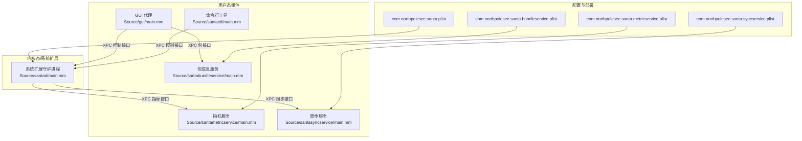
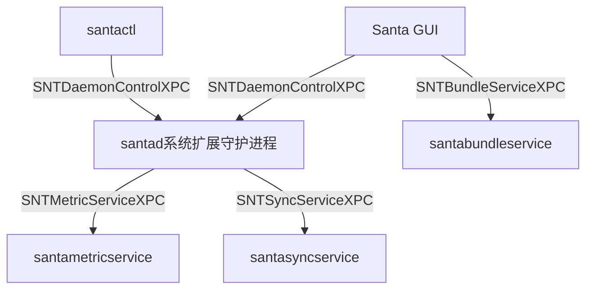
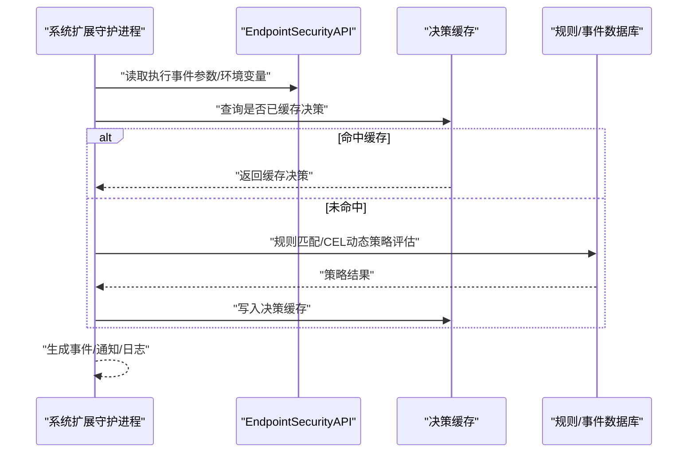
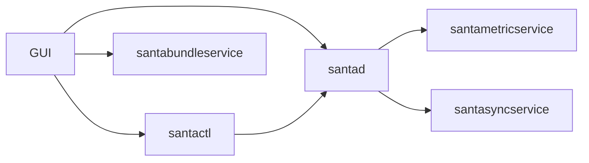

# 组件架构设计

<cite>
**本文引用的文件**
- [README.md](file://README.md)
- [santad 主程序入口](file://Source/santad/main.mm)
- [santad Info.plist](file://Source/santad/Info.plist)
- [GUI 主程序入口](file://Source/gui/main.mm)
- [santactl 主程序入口](file://Source/santactl/main.mm)
- [指标服务主程序入口](file://Source/santametricservice/main.mm)
- [同步服务主程序入口](file://Source/santasyncservice/main.mm)
- [包信息服务主程序入口](file://Source/santabundleservice/main.mm)
- [守护进程控制接口定义](file://Source/common/SNTXPCControlInterface.h)
- [指标服务XPC接口定义](file://Source/common/SNTXPCMetricServiceInterface.h)
- [同步服务XPC接口定义](file://Source/common/SNTXPCSyncServiceInterface.h)
- [包信息服务XPC接口定义](file://Source/common/SNTXPCBundleServiceInterface.h)
- [com.northpolesec.santa.plist](file://Conf/com.northpolesec.santa.plist)
- [com.northpolesec.santa.metricservice.plist](file://Conf/com.northpolesec.santa.metricservice.plist)
- [com.northpolesec.santa.syncservice.plist](file://Conf/com.northpolesec.santa.syncservice.plist)
- [com.northpolesec.santa.bundleservice.plist](file://Conf/com.northpolesec.santa.bundleservice.plist)
- [EndpointSecurity 研究报告（节选）](file://EndpointSecurity-Research-Report.md)
</cite>

## 目录
1. [引言](#引言)
2. [项目结构](#项目结构)
3. [核心组件](#核心组件)
4. [架构总览](#架构总览)
5. [组件详细分析](#组件详细分析)
6. [依赖关系分析](#依赖关系分析)
7. [性能考量](#性能考量)
8. [故障排查指南](#故障排查指南)
9. [结论](#结论)
10. [附录](#附录)

## 引言
本文件面向系统架构师与高级开发者，系统性阐述 Santa 在 macOS 上的组件架构设计与运行机制。Santa 由系统扩展（守护进程）、GUI 代理、命令行工具、指标服务、同步服务、包信息服务等组成，通过 XPC 接口进行安全、可控的跨进程通信。本文将深入解释各组件的职责边界、生命周期管理、资源分配策略、启动顺序与优雅关闭机制，并给出组件间交互的架构图、职责矩阵与依赖关系图。

## 项目结构
Santa 采用按功能域分层的组织方式：
- Source/santad：系统扩展守护进程，负责 EndpointSecurity 事件采集、策略决策、数据库与缓存、通知队列、同步队列、TTY 写入、进程树与授权结果缓存等。
- Source/gui：GUI 代理，负责用户交互、系统扩展加载/卸载请求、应用内通知展示。
- Source/santactl：命令行工具，提供规则管理、状态查询、诊断、同步触发等能力。
- Source/santametricservice：指标服务，负责将指标导出至监控系统。
- Source/santasyncservice：同步服务，负责与远端服务器的配置/事件同步、推送通知、遥测上传等。
- Source/santabundleservice：包信息服务，负责对应用包进行二进制哈希计算与进度回调。
- Source/common：公共库，包含 XPC 接口协议、日志、证书、缓存、序列化、系统信息、定时器、度量集等通用能力。
- Conf：LaunchAgent/LaunchDaemon 配置，定义各组件的 Mach 服务名、启动参数、关联包标识等。

图表来源
- [santad 主程序入口](file://Source/santad/main.mm#L104-L151)
- [GUI 主程序入口](file://Source/gui/main.mm#L56-L94)
- [santactl 主程序入口](file://Source/santactl/main.mm#L39-L84)
- [指标服务主程序入口](file://Source/santametricservice/main.mm#L24-L42)
- [同步服务主程序入口](file://Source/santasyncservice/main.mm#L22-L38)
- [包信息服务主程序入口](file://Source/santabundleservice/main.mm#L23-L36)
- [com.northpolesec.santa.plist](file://Conf/com.northpolesec.santa.plist#L1-L22)
- [com.northpolesec.santa.metricservice.plist](file://Conf/com.northpolesec.santa.metricservice.plist#L1-L27)
- [com.northpolesec.santa.syncservice.plist](file://Conf/com.northpolesec.santa.syncservice.plist#L1-L27)
- [com.northpolesec.santa.bundleservice.plist](file://Conf/com.northpolesec.santa.bundleservice.plist#L1-L33)

章节来源
- [README.md](file://README.md#L13-L21)
- [santad 主程序入口](file://Source/santad/main.mm#L104-L151)
- [GUI 主程序入口](file://Source/gui/main.mm#L56-L94)
- [santactl 主程序入口](file://Source/santactl/main.mm#L39-L84)
- [指标服务主程序入口](file://Source/santametricservice/main.mm#L24-L42)
- [同步服务主程序入口](file://Source/santasyncservice/main.mm#L22-L38)
- [包信息服务主程序入口](file://Source/santabundleservice/main.mm#L23-L36)
- [com.northpolesec.santa.plist](file://Conf/com.northpolesec.santa.plist#L1-L22)
- [com.northpolesec.santa.metricservice.plist](file://Conf/com.northpolesec.santa.metricservice.plist#L1-L27)
- [com.northpolesec.santa.syncservice.plist](file://Conf/com.northpolesec.santa.syncservice.plist#L1-L27)
- [com.northpolesec.santa.bundleservice.plist](file://Conf/com.northpolesec.santa.bundleservice.plist#L1-L33)

## 核心组件
- 系统扩展守护进程（santad）
  - 职责：作为 EndpointSecurity 系统扩展，接收执行与文件访问事件，基于本地数据库与动态策略进行授权决策；维护决策缓存、事件数据库、通知队列、同步队列、TTY 写入、进程树与授权结果缓存；通过 XPC 对外暴露受控管理接口。
  - 生命周期：随系统启动加载，常驻后台；具备看门狗线程监控自身 CPU/RAM 峰值；支持优雅关闭。
  - 资源分配：优先级队列、异步 I/O、缓存命中优化、批处理写入（事件/规则）。
- GUI 代理（Santa.app）
  - 职责：用户交互界面、系统扩展激活/停用请求、应用内消息展示；与守护进程通过 XPC 控制接口通信。
  - 生命周期：随用户登录启动；可响应系统扩展授权流程。
- 命令行工具（santactl）
  - 职责：提供规则增删改查、状态查询、诊断、缓存清理、同步触发、版本信息等管理能力；通过 XPC 控制接口与守护进程交互。
  - 生命周期：一次性进程，按需调用。
- 指标服务（santametricservice）
  - 职责：接收来自守护进程的指标数据，按格式化策略导出至监控系统（文件/HTTP）。
  - 生命周期：常驻后台，Mach 服务注册；支持压力退出策略。
- 同步服务（santasyncservice）
  - 职责：与远端服务器进行配置/规则/事件/遥测的同步；支持推送通知、离线/在线同步、串行化队列与背压控制。
  - 生命周期：按需启动，支持自旋停止；与守护进程通过 XPC 通信。
- 包信息服务（santabundleservice）
  - 职责：对应用包内的二进制进行哈希计算，向 GUI 提供进度与结果回调。
  - 生命周期：按需启动，自适应进程类型，支持压力退出。

章节来源
- [README.md](file://README.md#L13-L21)
- [santad 主程序入口](file://Source/santad/main.mm#L104-L151)
- [GUI 主程序入口](file://Source/gui/main.mm#L56-L94)
- [santactl 主程序入口](file://Source/santactl/main.mm#L39-L84)
- [指标服务主程序入口](file://Source/santametricservice/main.mm#L24-L42)
- [同步服务主程序入口](file://Source/santasyncservice/main.mm#L22-L38)
- [包信息服务主程序入口](file://Source/santabundleservice/main.mm#L23-L36)

## 架构总览
Santa 的整体架构围绕“系统扩展守护进程”为核心，其他用户态组件通过 XPC 与其交互。守护进程与各服务之间通过专用接口协议解耦，确保签名一致性校验与最小权限原则。

图表来源
- [守护进程控制接口定义](file://Source/common/SNTXPCControlInterface.h#L26-L78)
- [指标服务XPC接口定义](file://Source/common/SNTXPCMetricServiceInterface.h#L20-L31)
- [同步服务XPC接口定义](file://Source/common/SNTXPCSyncServiceInterface.h#L27-L47)
- [包信息服务XPC接口定义](file://Source/common/SNTXPCBundleServiceInterface.h#L37-L55)
- [santad 主程序入口](file://Source/santad/main.mm#L137-L147)

## 组件详细分析

### 系统扩展守护进程（santad）
- 功能定位
  - EndpointSecurity 事件采集与决策：执行事件与文件访问事件的快速拒绝、签名与规则匹配、动态策略（CEL）评估、授权结果缓存与日志记录。
  - 数据与缓存：事件表、规则表、决策缓存、TTY 写入、临时监控模式、进程树与授权结果缓存。
  - 通知与同步：通知队列、同步队列、指标上报、系统扩展生命周期管理。
- 生命周期管理
  - 启动：安装 LaunchAgent/LaunchDaemon 服务后随系统启动；初始化配置、日志、指标、WatchItems、富化器、编译控制器、通知队列、同步队列、执行控制器、前缀树、TTY 写入、进程树、权限过滤器。
  - 看门狗：周期性检查 CPU/RAM 占用，超过阈值发出警告并记录峰值。
  - 关闭：优雅退出，释放资源。
- 资源分配策略
  - 事件批处理与异步 I/O，减少锁竞争；缓存命中优先，降低数据库与规则匹配开销；前缀树加速路径规则匹配。
- 关键流程（执行决策）

图表来源
- [EndpointSecurity 研究报告（节选）](file://EndpointSecurity-Research-Report.md#L336-L363)
- [santad 主程序入口](file://Source/santad/main.mm#L137-L147)

章节来源
- [santad 主程序入口](file://Source/santad/main.mm#L104-L151)
- [santad Info.plist](file://Source/santad/Info.plist#L1-L30)

### GUI 代理（Santa.app）
- 功能定位：用户交互、系统扩展授权与加载/卸载、消息窗口展示。
- 生命周期管理：随用户登录启动；当需要系统扩展授权时，通过 OSSystemExtensionRequest 发起请求并在超时或完成时退出。
- 与守护进程交互：通过 SNTDaemonControlXPC 协议进行受控管理操作（如安装应用、状态查询等）。

章节来源
- [GUI 主程序入口](file://Source/gui/main.mm#L56-L94)
- [守护进程控制接口定义](file://Source/common/SNTXPCControlInterface.h#L26-L78)

### 命令行工具（santactl）
- 功能定位：规则管理、状态查询、诊断、缓存清理、同步触发、版本信息等。
- 生命周期管理：一次性进程，按需调用；解析命令名称并路由到对应命令处理器。
- 与守护进程交互：通过 SNTDaemonControlXPC 协议执行特权操作。

章节来源
- [santactl 主程序入口](file://Source/santactl/main.mm#L39-L84)
- [守护进程控制接口定义](file://Source/common/SNTXPCControlInterface.h#L26-L78)

### 指标服务（santametricservice）
- 功能定位：接收守护进程导出的指标数据，按格式化策略输出到文件或 HTTP。
- 生命周期管理：常驻后台，Mach 服务注册；支持压力退出策略以节省资源。
- 权限要求：启动后降权运行，避免不必要的 root 权限。

章节来源
- [指标服务主程序入口](file://Source/santametricservice/main.mm#L24-L42)
- [指标服务XPC接口定义](file://Source/common/SNTXPCMetricServiceInterface.h#L20-L31)

### 同步服务（santasyncservice）
- 功能定位：与远端服务器进行配置/规则/事件/遥测同步；支持推送通知、离线/在线同步、串行化队列与背压控制。
- 生命周期管理：按需启动，支持自旋停止；与守护进程通过 SNTSyncServiceXPC 协议通信。
- 资源分配：同步任务串行排队，限制最大排队数，避免并发冲突。

章节来源
- [同步服务主程序入口](file://Source/santasyncservice/main.mm#L22-L38)
- [同步服务XPC接口定义](file://Source/common/SNTXPCSyncServiceInterface.h#L27-L47)

### 包信息服务（santabundleservice）
- 功能定位：对应用包内的二进制进行哈希计算，向 GUI 提供进度与结果回调。
- 生命周期管理：按需启动，自适应进程类型，支持压力退出策略。

章节来源
- [包信息服务主程序入口](file://Source/santabundleservice/main.mm#L23-L36)
- [包信息服务XPC接口定义](file://Source/common/SNTXPCBundleServiceInterface.h#L37-L55)

## 依赖关系分析
- 组件间依赖
  - GUI 与 santactl 依赖 SNTDaemonControlXPC 与守护进程交互。
  - 守护进程依赖指标服务（SNTMetricServiceXPC）导出指标。
  - 守护进程依赖同步服务（SNTSyncServiceXPC）进行配置/事件同步。
  - GUI 依赖包信息服务（SNTBundleServiceXPC）进行包哈希。
- 启动顺序
  - 系统扩展守护进程随系统启动加载（Info.plist 中声明早于启动）。
  - 用户态组件通过 LaunchAgent/LaunchDaemon 配置启动，按需连接守护进程。
- 优雅关闭
  - 各服务均通过 NSRunLoop 主循环维持，结合 XPC 连接生命周期进行优雅退出。

图表来源
- [santad Info.plist](file://Source/santad/Info.plist#L24-L26)
- [com.northpolesec.santa.plist](file://Conf/com.northpolesec.santa.plist#L1-L22)
- [com.northpolesec.santa.metricservice.plist](file://Conf/com.northpolesec.santa.metricservice.plist#L1-L27)
- [com.northpolesec.santa.syncservice.plist](file://Conf/com.northpolesec.santa.syncservice.plist#L1-L27)
- [com.northpolesec.santa.bundleservice.plist](file://Conf/com.northpolesec.santa.bundleservice.plist#L1-L33)

章节来源
- [santad Info.plist](file://Source/santad/Info.plist#L24-L26)
- [com.northpolesec.santa.plist](file://Conf/com.northpolesec.santa.plist#L1-L22)
- [com.northpolesec.santa.metricservice.plist](file://Conf/com.northpolesec.santa.metricservice.plist#L1-L27)
- [com.northpolesec.santa.syncservice.plist](file://Conf/com.northpolesec.santa.syncservice.plist#L1-L27)
- [com.northpolesec.santa.bundleservice.plist](file://Conf/com.northpolesec.santa.bundleservice.plist#L1-L33)

## 性能考量
- 决策路径优化
  - 长路径快速拒绝，避免进入复杂处理流程。
  - 决策缓存命中优先，减少数据库与规则匹配次数。
  - 前缀树加速路径规则匹配。
- I/O 与批处理
  - 事件/规则批量写入，降低锁竞争与系统调用次数。
  - 日志写入采用缓冲与压缩（如 zstd 输出流）。
- 资源监控
  - 看门狗线程定期检测 CPU/RAM 占用，超过阈值发出警告并记录峰值，便于容量规划与问题定位。
- 并发与背压
  - 同步队列串行化，限制最大排队数，避免拥塞。
  - 包信息服务自适应进程类型与压力退出策略，降低资源占用。

章节来源
- [EndpointSecurity 研究报告（节选）](file://EndpointSecurity-Research-Report.md#L574-L640)
- [santad 主程序入口](file://Source/santad/main.mm#L40-L89)

## 故障排查指南
- 看门狗告警
  - 现象：日志出现 CPU/RAM 使用率过高警告。
  - 处理：检查近期规则变更、事件激增、第三方进程异常；必要时调整规则或隔离高负载场景。
- XPC 通信失败
  - 现象：santactl 或 GUI 无法与守护进程通信。
  - 处理：确认守护进程已启动且签名一致；检查 XPC 连接与接口配置；查看日志错误码。
- 同步服务阻塞
  - 现象：同步队列积压或返回“过多同步进行中”。
  - 处理：等待当前同步完成；检查远端服务器可用性与网络状况；必要时手动触发一次同步。
- 指标导出异常
  - 现象：指标未到达监控系统。
  - 处理：确认指标服务已降权启动；检查导出格式与目标地址；验证网络连通性。

章节来源
- [santad 主程序入口](file://Source/santad/main.mm#L40-L89)
- [同步服务XPC接口定义](file://Source/common/SNTXPCSyncServiceInterface.h#L55-L70)

## 结论
Santa 的组件架构以“系统扩展守护进程”为核心，通过严格的 XPC 接口与最小权限模型实现跨进程安全通信。GUI 与命令行工具承担管理与交互职责，指标、同步与包信息服务分别满足可观测性、集中治理与用户体验需求。整体设计强调可扩展性、可观测性与资源效率，适合在企业环境中大规模部署与运维。

## 附录
- 部署位置与权限要求
  - 系统扩展守护进程：位于系统扩展目录，具备 EndpointSecurity 早期启动能力。
  - 用户态组件：位于 /Applications/Santa.app/Contents/MacOS 下，通过 LaunchAgent/LaunchDaemon 注册为 Mach 服务。
  - 权限：指标服务启动后降权运行；同步与包信息服务按需启动，支持压力退出策略。
- 启动与停止
  - 启动：通过 LaunchAgent/LaunchDaemon 自动启动；守护进程安装服务脚本后注册所需服务。
  - 停止：优雅退出，释放 XPC 连接与资源；同步服务支持自旋停止。

章节来源
- [santad Info.plist](file://Source/santad/Info.plist#L1-L30)
- [com.northpolesec.santa.plist](file://Conf/com.northpolesec.santa.plist#L1-L22)
- [com.northpolesec.santa.metricservice.plist](file://Conf/com.northpolesec.santa.metricservice.plist#L1-L27)
- [com.northpolesec.santa.syncservice.plist](file://Conf/com.northpolesec.santa.syncservice.plist#L1-L27)
- [com.northpolesec.santa.bundleservice.plist](file://Conf/com.northpolesec.santa.bundleservice.plist#L1-L33)