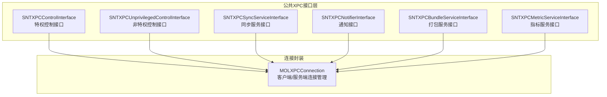
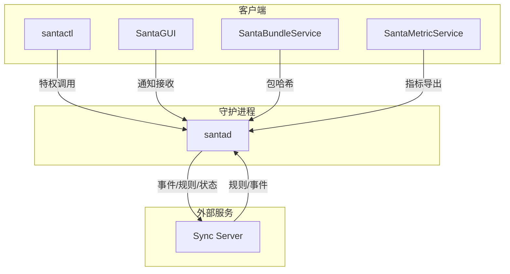
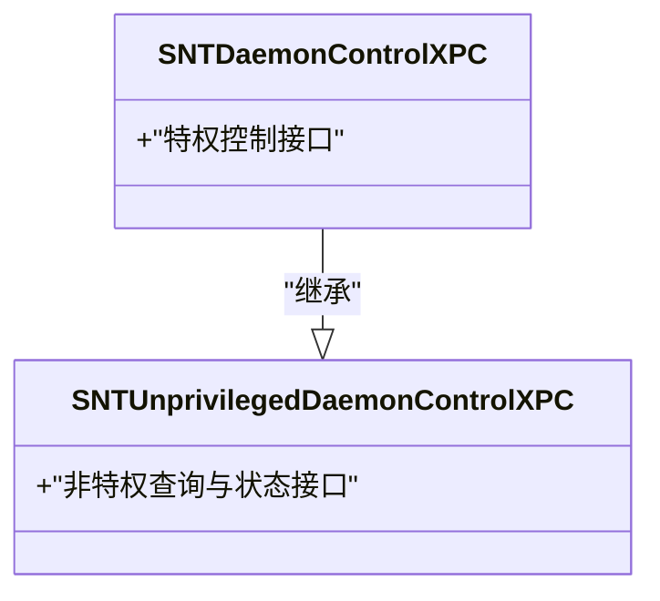
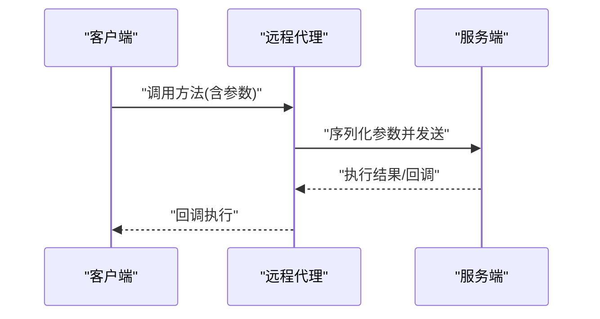
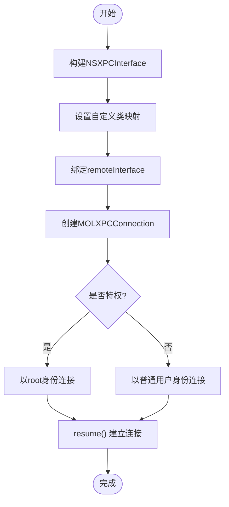
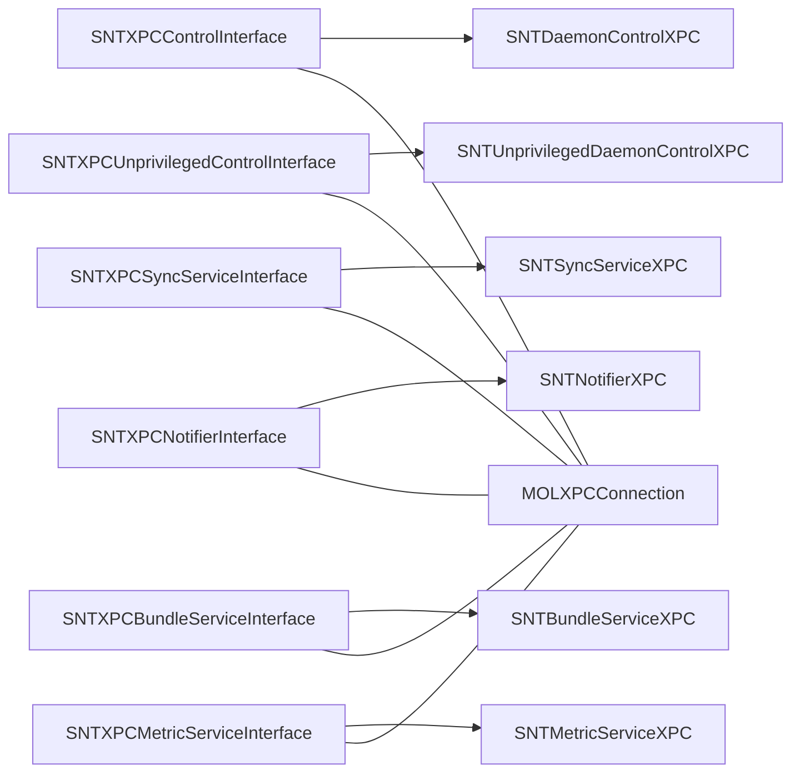

# XPC接口设计

<cite>
**本文引用的文件**
- [SNTXPCControlInterface.h](file://Source/common/SNTXPCControlInterface.h)
- [SNTXPCControlInterface.mm](file://Source/common/SNTXPCControlInterface.mm)
- [SNTXPCUnprivilegedControlInterface.h](file://Source/common/SNTXPCUnprivilegedControlInterface.h)
- [SNTXPCUnprivilegedControlInterface.mm](file://Source/common/SNTXPCUnprivilegedControlInterface.mm)
- [SNTXPCSyncServiceInterface.h](file://Source/common/SNTXPCSyncServiceInterface.h)
- [SNTXPCSyncServiceInterface.mm](file://Source/common/SNTXPCSyncServiceInterface.mm)
- [SNTXPCNotifierInterface.h](file://Source/common/SNTXPCNotifierInterface.h)
- [SNTXPCNotifierInterface.mm](file://Source/common/SNTXPCNotifierInterface.mm)
- [SNTXPCBundleServiceInterface.h](file://Source/common/SNTXPCBundleServiceInterface.h)
- [SNTXPCBundleServiceInterface.mm](file://Source/common/SNTXPCBundleServiceInterface.mm)
- [SNTXPCMetricServiceInterface.h](file://Source/common/SNTXPCMetricServiceInterface.h)
- [SNTXPCMetricServiceInterface.mm](file://Source/common/SNTXPCMetricServiceInterface.mm)
- [MOLXPCConnection.h](file://Source/common/MOLXPCConnection.h)
</cite>

## 目录
1. [引言](#引言)
2. [项目结构](#项目结构)
3. [核心组件](#核心组件)
4. [架构总览](#架构总览)
5. [详细组件分析](#详细组件分析)
6. [依赖分析](#依赖分析)
7. [性能考虑](#性能考虑)
8. [故障排查指南](#故障排查指南)
9. [结论](#结论)
10. [附录](#附录)

## 引言
本文件面向Santa系统中的XPC接口设计，围绕控制、同步、通知、打包、指标等核心接口进行系统化技术说明。重点包括：
- 协议设计原则与接口定义规范
- 参数传递机制与类型约束
- 特权接口与非特权接口的差异
- 接口初始化、配置选项与安全约束
- 接口设计图、协议层次图与参数传递流程图
- 使用示例（以路径引用形式给出）

## 项目结构
Santa的XPC相关接口集中在Source/common目录下，采用“协议头 + 实现类 + 连接封装”的分层组织方式：
- 协议头：定义对外暴露的方法签名与参数类型
- 实现类：负责生成NSXPCInterface、设置自定义类映射、提供预配置连接
- 连接封装：MOLXPCConnection统一管理客户端/服务端生命周期、签名验证与连接建立

图表来源
- [SNTXPCControlInterface.h](file://Source/common/SNTXPCControlInterface.h#L28-L77)
- [SNTXPCControlInterface.mm](file://Source/common/SNTXPCControlInterface.mm#L82-L96)
- [SNTXPCUnprivilegedControlInterface.h](file://Source/common/SNTXPCUnprivilegedControlInterface.h#L42-L117)
- [SNTXPCUnprivilegedControlInterface.mm](file://Source/common/SNTXPCUnprivilegedControlInterface.mm#L25-L41)
- [SNTXPCSyncServiceInterface.h](file://Source/common/SNTXPCSyncServiceInterface.h#L30-L69)
- [SNTXPCSyncServiceInterface.mm](file://Source/common/SNTXPCSyncServiceInterface.mm#L19-L46)
- [SNTXPCNotifierInterface.h](file://Source/common/SNTXPCNotifierInterface.h#L28-L46)
- [SNTXPCNotifierInterface.mm](file://Source/common/SNTXPCNotifierInterface.mm#L19-L22)
- [SNTXPCBundleServiceInterface.h](file://Source/common/SNTXPCBundleServiceInterface.h#L37-L56)
- [SNTXPCBundleServiceInterface.mm](file://Source/common/SNTXPCBundleServiceInterface.mm#L22-L44)
- [SNTXPCMetricServiceInterface.h](file://Source/common/SNTXPCMetricServiceInterface.h#L20-L30)
- [SNTXPCMetricServiceInterface.mm](file://Source/common/SNTXPCMetricServiceInterface.mm#L19-L41)
- [MOLXPCConnection.h](file://Source/common/MOLXPCConnection.h#L54-L154)

章节来源
- [SNTXPCControlInterface.h](file://Source/common/SNTXPCControlInterface.h#L28-L77)
- [SNTXPCControlInterface.mm](file://Source/common/SNTXPCControlInterface.mm#L82-L96)
- [SNTXPCUnprivilegedControlInterface.h](file://Source/common/SNTXPCUnprivilegedControlInterface.h#L42-L117)
- [SNTXPCUnprivilegedControlInterface.mm](file://Source/common/SNTXPCUnprivilegedControlInterface.mm#L25-L41)
- [SNTXPCSyncServiceInterface.h](file://Source/common/SNTXPCSyncServiceInterface.h#L30-L69)
- [SNTXPCSyncServiceInterface.mm](file://Source/common/SNTXPCSyncServiceInterface.mm#L19-L46)
- [SNTXPCNotifierInterface.h](file://Source/common/SNTXPCNotifierInterface.h#L28-L46)
- [SNTXPCNotifierInterface.mm](file://Source/common/SNTXPCNotifierInterface.mm#L19-L22)
- [SNTXPCBundleServiceInterface.h](file://Source/common/SNTXPCBundleServiceInterface.h#L37-L56)
- [SNTXPCBundleServiceInterface.mm](file://Source/common/SNTXPCBundleServiceInterface.mm#L22-L44)
- [SNTXPCMetricServiceInterface.h](file://Source/common/SNTXPCMetricServiceInterface.h#L20-L30)
- [SNTXPCMetricServiceInterface.mm](file://Source/common/SNTXPCMetricServiceInterface.mm#L19-L41)
- [MOLXPCConnection.h](file://Source/common/MOLXPCConnection.h#L54-L154)

## 核心组件
本节对各XPC接口进行要点梳理，明确协议职责、方法签名与参数类型。

- SNTDaemonControlXPC（特权控制接口）
  - 职责：面向santactl的特权操作，如缓存清理、数据库规则增删、事件查询、配置更新、进程终止、应用安装等
  - 关键方法与参数类型（示例）
    - flushCache(reply:)
    - databaseRuleAddExecutionRules(_:fileAccessRules:ruleCleanup:source:reply:)
    - databaseEventsPending(reply:)
    - databaseRemoveEventsWithIDs(_:)
    - retrieveAllExecutionRules(reply:)
    - retrieveAllFileAccessRules(reply:)
    - updateSyncSettings(_:reply:)
    - postRuleSyncNotificationForApplication(_:reply:)
    - retrieveStatsState(reply:)
    - saveStatsSubmissionAttemptTime(_:version:)
    - killProcesses(_:reply:)
    - installSantaApp(_:reply:)
  - 章节来源
    - [SNTXPCControlInterface.h](file://Source/common/SNTXPCControlInterface.h#L28-L77)

- SNTUnprivilegedDaemonControlXPC（非特权控制接口）
  - 职责：面向santactl的非特权查询与状态获取，如缓存统计、规则计数、事件计数、客户端模式、同步状态、USB策略、临时监控模式等
  - 关键方法与参数类型（示例）
    - cacheCounts(reply:)
    - checkCacheForVnodeID(_:withReply:)
    - databaseRuleCounts(reply:)
    - databaseEventCount(reply:)
    - staticRuleCount(reply:)
    - databaseRulesHash(reply:)
    - databaseRuleForIdentifiers(_:reply:)
    - watchdogInfo(reply:)
    - watchItemsState(reply:)
    - clientMode(reply:)
    - fullSyncLastSuccess(reply:)
    - ruleSyncLastSuccess(reply:)
    - syncTypeRequired(reply:)
    - enableBundles(reply:)
    - enableTransitiveRules(reply:)
    - blockUSBMount(reply:)
    - remountUSBMode(reply:)
    - dataFileAccessRuleForTarget(_:reply:)
    - metrics(reply:)
    - setNotificationListener(_:)
    - pushNotificationStatus(reply:)
    - pushNotificationServerAddress(reply:)
    - syncBundleEvent(_:relatedEvents:)
    - exportTelemetryWithReply(reply:)
    - requestTemporaryMonitorModeWithDurationMinutes(_:reply:)
    - cancelTemporaryMonitorMode(reply:)
    - temporaryMonitorModeSecondsRemaining(reply:)
  - 章节来源
    - [SNTXPCUnprivilegedControlInterface.h](file://Source/common/SNTXPCUnprivilegedControlInterface.h#L42-L117)

- SNTSyncServiceXPC（同步服务接口）
  - 职责：与远端同步服务器通信，支持事件上报、包事件上报、推送状态查询、遥测导出、手动触发同步、服务自旋降等
  - 关键方法与参数类型（示例）
    - postEventsToSyncServer(_:reply:)
    - postBundleEventToSyncServer(_:reply:)
    - pushNotificationStatus(reply:)
    - pushNotificationServerAddress(reply:)
    - exportTelemetryFiles(_:fileName:totalSize:contentType:config:reply:)
    - syncWithLogListener(_:syncType:reply:)
    - spindown()
  - 章节来源
    - [SNTXPCSyncServiceInterface.h](file://Source/common/SNTXPCSyncServiceInterface.h#L30-L69)

- SNTNotifierXPC（通知接口）
  - 职责：向GUI发送阻断通知、USB阻断通知、网络挂载阻断通知、文件访问阻断通知、客户端模式变更通知、规则同步通知、临时监控授权请求等
  - 关键方法与参数类型（示例）
    - postBlockNotification(_:withCustomMessage_:customURL_:configState_:andReply:)
    - postUSBBlockNotification(_:)
    - postNetworkMountNotification(_:configBundle_)
    - postFileAccessBlockNotification(_:customMessage_:customURL_:customText_:configState_)
    - postClientModeNotification(_:)
    - postRuleSyncNotificationForApplication(_:)
    - authorizeTemporaryMonitorMode(_:)
  - 章节来源
    - [SNTXPCNotifierInterface.h](file://Source/common/SNTXPCNotifierInterface.h#L28-L46)

- SNTBundleServiceXPC（打包服务接口）
  - 职责：对应用包内二进制进行哈希计算，并通过回调监听进度；支持监听端点回传
  - 关键方法与参数类型（示例）
    - hashBundleBinariesForEvent(_:listener:reply:)
  - 章节来源
    - [SNTXPCBundleServiceInterface.h](file://Source/common/SNTXPCBundleServiceInterface.h#L37-L56)

- SNTMetricServiceXPC（指标服务接口）
  - 职责：将指标数据导出至监控系统
  - 关键方法与参数类型（示例）
    - exportForMonitoring(_:)
  - 章节来源
    - [SNTXPCMetricServiceInterface.h](file://Source/common/SNTXPCMetricServiceInterface.h#L20-L30)

## 架构总览
下图展示了各XPC接口在系统中的角色与交互关系，以及MOLXPCConnection作为统一连接层的作用。

图表来源
- [SNTXPCControlInterface.h](file://Source/common/SNTXPCControlInterface.h#L28-L77)
- [SNTXPCUnprivilegedControlInterface.h](file://Source/common/SNTXPCUnprivilegedControlInterface.h#L42-L117)
- [SNTXPCSyncServiceInterface.h](file://Source/common/SNTXPCSyncServiceInterface.h#L30-L69)
- [SNTXPCNotifierInterface.h](file://Source/common/SNTXPCNotifierInterface.h#L28-L46)
- [SNTXPCBundleServiceInterface.h](file://Source/common/SNTXPCBundleServiceInterface.h#L37-L56)
- [SNTXPCMetricServiceInterface.h](file://Source/common/SNTXPCMetricServiceInterface.h#L20-L30)

## 详细组件分析

### 协议层次与继承关系
- SNTDaemonControlXPC 继承自 SNTUnprivilegedDaemonControlXPC，后者提供非特权能力，前者在此基础上增加特权操作
- 其他接口（同步、通知、打包、指标）彼此独立，不形成直接继承关系，但共享相同的XPC通信范式

图表来源
- [SNTXPCControlInterface.h](file://Source/common/SNTXPCControlInterface.h#L28-L33)
- [SNTXPCUnprivilegedControlInterface.h](file://Source/common/SNTXPCUnprivilegedControlInterface.h#L42-L43)

章节来源
- [SNTXPCControlInterface.h](file://Source/common/SNTXPCControlInterface.h#L28-L33)
- [SNTXPCUnprivilegedControlInterface.h](file://Source/common/SNTXPCUnprivilegedControlInterface.h#L42-L43)

### 参数传递机制与类型约束
- 自定义对象映射：通过NSXPCInterface的setClasses:forSelector:argumentIndex:ofReply:设置，确保数组/字典/自定义对象在跨进程边界正确序列化/反序列化
- 回调与异步：所有方法均以回调块作为reply参数，避免阻塞主线程
- 监听端点：部分接口使用NSXPCListenerEndpoint作为双向通信通道（如打包服务进度监听）

图表来源
- [SNTXPCControlInterface.mm](file://Source/common/SNTXPCControlInterface.mm#L46-L87)
- [SNTXPCSyncServiceInterface.mm](file://Source/common/SNTXPCSyncServiceInterface.mm#L19-L35)
- [SNTXPCBundleServiceInterface.mm](file://Source/common/SNTXPCBundleServiceInterface.mm#L22-L32)

章节来源
- [SNTXPCControlInterface.mm](file://Source/common/SNTXPCControlInterface.mm#L46-L87)
- [SNTXPCSyncServiceInterface.mm](file://Source/common/SNTXPCSyncServiceInterface.mm#L19-L35)
- [SNTXPCBundleServiceInterface.mm](file://Source/common/SNTXPCBundleServiceInterface.mm#L22-L32)

### 初始化与配置选项
- 接口初始化：每个接口类提供+ (NSXPCInterface *)xxxInterface方法，内部通过NSXPCInterface interfaceWithProtocol:创建，并调用initializeXxxInterface:设置自定义类映射
- 预配置连接：提供+ (MOLXPCConnection *)configuredConnection工厂方法，自动完成MachService名称解析、是否特权标志、remoteInterface绑定
- MachService命名规则：
  - 控制接口：基于团队ID或特殊前缀生成
  - 同步/打包/指标服务：固定服务名
- 安全约束：
  - 特权连接需root权限
  - 非特权连接可由普通用户进程发起
  - MOLXPCConnection负责连接建立、失效处理与签名验证

图表来源
- [SNTXPCControlInterface.mm](file://Source/common/SNTXPCControlInterface.mm#L82-L96)
- [SNTXPCSyncServiceInterface.mm](file://Source/common/SNTXPCSyncServiceInterface.mm#L37-L46)
- [SNTXPCBundleServiceInterface.mm](file://Source/common/SNTXPCBundleServiceInterface.mm#L34-L44)
- [SNTXPCMetricServiceInterface.mm](file://Source/common/SNTXPCMetricServiceInterface.mm#L31-L41)
- [MOLXPCConnection.h](file://Source/common/MOLXPCConnection.h#L66-L88)

章节来源
- [SNTXPCControlInterface.mm](file://Source/common/SNTXPCControlInterface.mm#L30-L45)
- [SNTXPCControlInterface.mm](file://Source/common/SNTXPCControlInterface.mm#L82-L96)
- [SNTXPCSyncServiceInterface.mm](file://Source/common/SNTXPCSyncServiceInterface.mm#L37-L46)
- [SNTXPCBundleServiceInterface.mm](file://Source/common/SNTXPCBundleServiceInterface.mm#L34-L44)
- [SNTXPCMetricServiceInterface.mm](file://Source/common/SNTXPCMetricServiceInterface.mm#L31-L41)
- [MOLXPCConnection.h](file://Source/common/MOLXPCConnection.h#L66-L88)

### 具体接口使用示例（路径引用）
以下示例以“代码片段路径”形式给出，便于查阅具体实现细节：

- 获取特权控制接口并发起规则批量添加
  - 接口与方法：[databaseRuleAddExecutionRules:fileAccessRules:ruleCleanup:source:reply:](file://Source/common/SNTXPCControlInterface.h#L42-L47)
  - 接口初始化与连接：[controlInterface](file://Source/common/SNTXPCControlInterface.mm#L82-L87)，[configuredConnection](file://Source/common/SNTXPCControlInterface.mm#L89-L94)
  - 章节来源
    - [SNTXPCControlInterface.h](file://Source/common/SNTXPCControlInterface.h#L42-L47)
    - [SNTXPCControlInterface.mm](file://Source/common/SNTXPCControlInterface.mm#L82-L96)

- 查询非特权状态（如客户端模式）
  - 接口与方法：[clientMode](file://Source/common/SNTXPCUnprivilegedControlInterface.h#L68-L69)
  - 接口初始化：[controlInterface](file://Source/common/SNTXPCUnprivilegedControlInterface.mm#L33-L39)
  - 章节来源
    - [SNTXPCUnprivilegedControlInterface.h](file://Source/common/SNTXPCUnprivilegedControlInterface.h#L68-L69)
    - [SNTXPCUnprivilegedControlInterface.mm](file://Source/common/SNTXPCUnprivilegedControlInterface.mm#L33-L39)

- 触发一次手动同步并接收日志
  - 接口与方法：[syncWithLogListener:syncType:reply:](file://Source/common/SNTXPCSyncServiceInterface.h#L61-L63)
  - 接口初始化与连接：[syncServiceInterface](file://Source/common/SNTXPCSyncServiceInterface.mm#L19-L35)，[configuredConnection](file://Source/common/SNTXPCSyncServiceInterface.mm#L41-L46)
  - 章节来源
    - [SNTXPCSyncServiceInterface.h](file://Source/common/SNTXPCSyncServiceInterface.h#L61-L63)
    - [SNTXPCSyncServiceInterface.mm](file://Source/common/SNTXPCSyncServiceInterface.mm#L19-L46)

- 请求临时监控模式
  - 接口与方法：[requestTemporaryMonitorModeWithDurationMinutes:reply:](file://Source/common/SNTXPCUnprivilegedControlInterface.h#L112-L113)
  - 接口初始化：[controlInterface](file://Source/common/SNTXPCUnprivilegedControlInterface.mm#L33-L39)
  - 章节来源
    - [SNTXPCUnprivilegedControlInterface.h](file://Source/common/SNTXPCUnprivilegedControlInterface.h#L112-L113)
    - [SNTXPCUnprivilegedControlInterface.mm](file://Source/common/SNTXPCUnprivilegedControlInterface.mm#L33-L39)

- 导出指标到监控系统
  - 接口与方法：[exportForMonitoring:](file://Source/common/SNTXPCMetricServiceInterface.h#L27-L27)
  - 接口初始化与连接：[metricServiceInterface](file://Source/common/SNTXPCMetricServiceInterface.mm#L19-L29)，[configuredConnection](file://Source/common/SNTXPCMetricServiceInterface.mm#L35-L41)
  - 章节来源
    - [SNTXPCMetricServiceInterface.h](file://Source/common/SNTXPCMetricServiceInterface.h#L27-L27)
    - [SNTXPCMetricServiceInterface.mm](file://Source/common/SNTXPCMetricServiceInterface.mm#L19-L41)

## 依赖分析
- 组件耦合
  - 各接口类仅依赖于自身协议与少量模型类（事件、规则、配置等），保持高内聚低耦合
  - MOLXPCConnection作为通用连接层，被所有接口类复用
- 外部依赖
  - Foundation框架提供的NSXPCInterface/NSXPCListenerEndpoint等
  - Santa内部模型类（事件、规则、配置、证书等）
- 潜在循环依赖
  - 当前接口未见循环依赖迹象，协议间通过监听端点或回调解耦

图表来源
- [SNTXPCControlInterface.h](file://Source/common/SNTXPCControlInterface.h#L28-L77)
- [SNTXPCUnprivilegedControlInterface.h](file://Source/common/SNTXPCUnprivilegedControlInterface.h#L42-L117)
- [SNTXPCSyncServiceInterface.h](file://Source/common/SNTXPCSyncServiceInterface.h#L30-L69)
- [SNTXPCNotifierInterface.h](file://Source/common/SNTXPCNotifierInterface.h#L28-L46)
- [SNTXPCBundleServiceInterface.h](file://Source/common/SNTXPCBundleServiceInterface.h#L37-L56)
- [SNTXPCMetricServiceInterface.h](file://Source/common/SNTXPCMetricServiceInterface.h#L20-L30)
- [MOLXPCConnection.h](file://Source/common/MOLXPCConnection.h#L54-L154)

章节来源
- [SNTXPCControlInterface.h](file://Source/common/SNTXPCControlInterface.h#L28-L77)
- [SNTXPCUnprivilegedControlInterface.h](file://Source/common/SNTXPCUnprivilegedControlInterface.h#L42-L117)
- [SNTXPCSyncServiceInterface.h](file://Source/common/SNTXPCSyncServiceInterface.h#L30-L69)
- [SNTXPCNotifierInterface.h](file://Source/common/SNTXPCNotifierInterface.h#L28-L46)
- [SNTXPCBundleServiceInterface.h](file://Source/common/SNTXPCBundleServiceInterface.h#L37-L56)
- [SNTXPCMetricServiceInterface.h](file://Source/common/SNTXPCMetricServiceInterface.h#L20-L30)
- [MOLXPCConnection.h](file://Source/common/MOLXPCConnection.h#L54-L154)

## 性能考虑
- 异步回调：所有接口均采用回调异步处理，避免阻塞UI线程与消息循环
- 批量操作：数据库规则批量添加、事件批量上报等，减少往返次数
- 连接复用：MOLXPCConnection在客户端侧复用已建立的连接，降低握手开销
- 监听端点：通过NSXPCListenerEndpoint实现增量进度反馈，避免一次性大对象传输

## 故障排查指南
- 连接失败
  - 检查MachService名称是否正确（特权/非特权服务名不同）
  - 确认是否以正确的权限启动客户端（特权接口需要root）
  - 查看MOLXPCConnection的invalidationHandler回调
- 参数类型错误
  - 确保通过NSXPCInterface设置自定义类映射（数组/字典/自定义对象）
  - 核对参数索引与ofReply标志位
- 同步阻塞
  - 对于可能长时间运行的操作（如手动同步），使用带日志监听的接口以避免UI无响应
- 日志定位
  - 使用同步服务的日志监听接口接收实时日志，辅助问题诊断

章节来源
- [MOLXPCConnection.h](file://Source/common/MOLXPCConnection.h#L140-L153)
- [SNTXPCSyncServiceInterface.h](file://Source/common/SNTXPCSyncServiceInterface.h#L51-L63)
- [SNTXPCSyncServiceInterface.mm](file://Source/common/SNTXPCSyncServiceInterface.mm#L19-L35)

## 结论
Santa的XPC接口体系以清晰的协议分层、严格的参数类型约束与统一的连接封装为基础，既满足了特权控制与非特权查询的差异化需求，又保证了跨进程通信的稳定性与安全性。通过MOLXPCConnection的集中管理与回调驱动的异步模型，系统实现了高效、可维护且易于扩展的IPC架构。

## 附录
- 接口清单与职责概览
  - SNTDaemonControlXPC：特权控制（缓存、数据库、配置、进程、安装）
  - SNTUnprivilegedDaemonControlXPC：非特权查询（缓存、规则、事件、模式、同步状态、临时监控）
  - SNTSyncServiceXPC：与远端同步服务器交互（事件上报、包事件、遥测导出、手动同步、spindown）
  - SNTNotifierXPC：GUI通知（阻断、USB、网络挂载、文件访问、模式变更、规则同步、临时监控授权）
  - SNTBundleServiceXPC：包内二进制哈希与进度监听
  - SNTMetricServiceXPC：指标导出