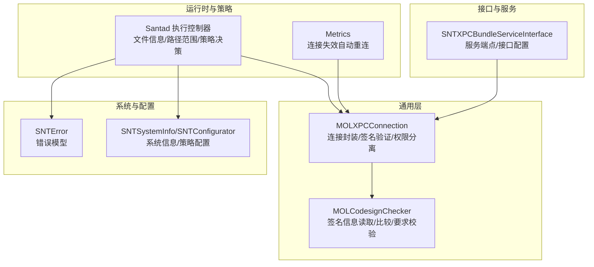
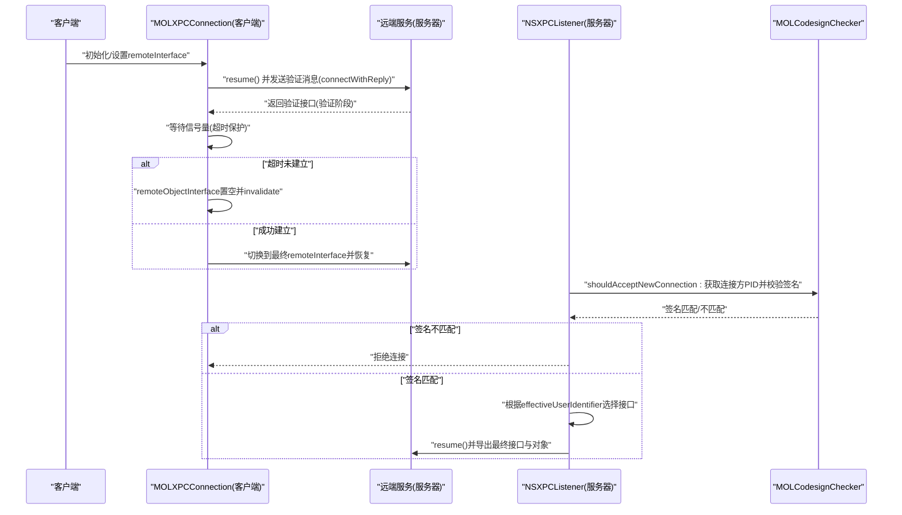
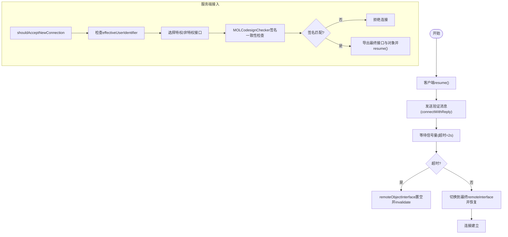
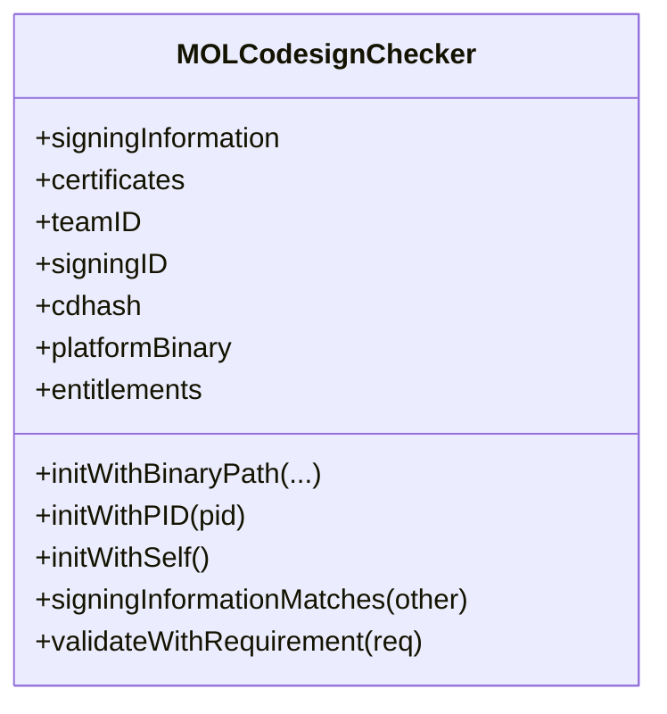
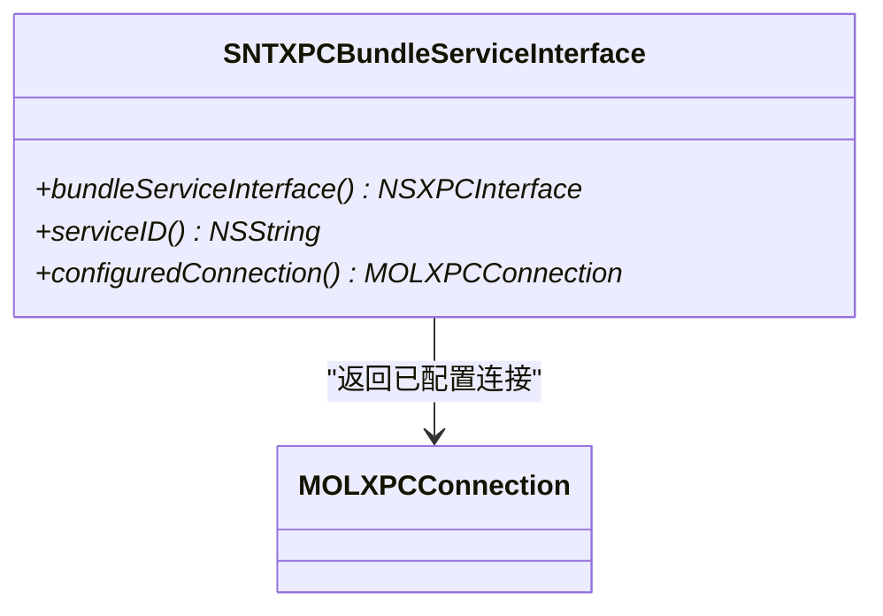
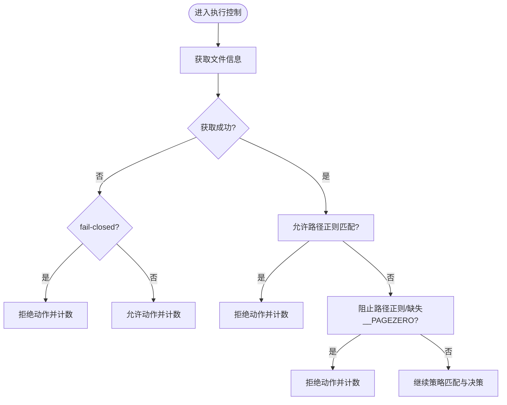
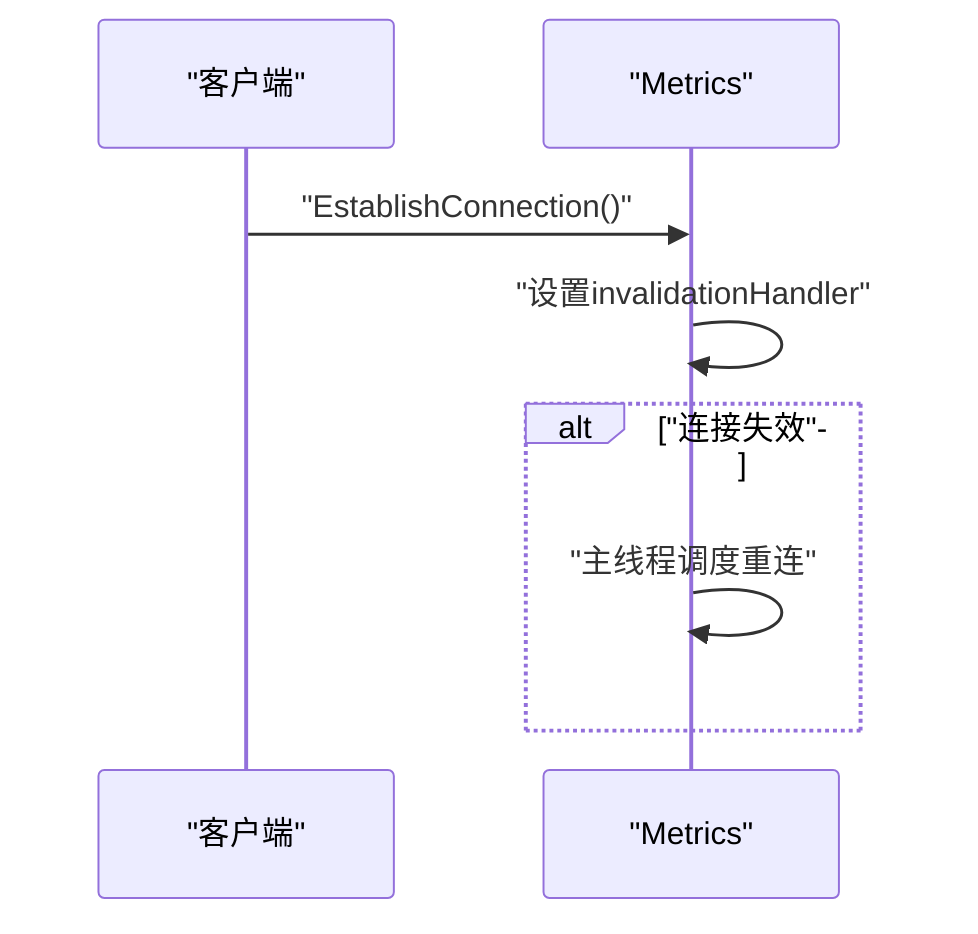
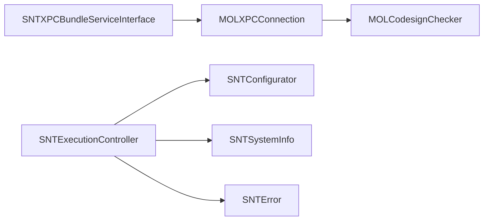
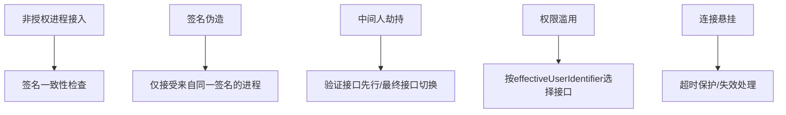

# 安全认证机制

<cite>
**本文引用的文件**
- [MOLXPCConnection.h](file://Source/common/MOLXPCConnection.h)
- [MOLXPCConnection.mm](file://Source/common/MOLXPCConnection.mm)
- [MOLXPCConnectionTest.mm](file://Source/common/MOLXPCConnectionTest.mm)
- [MOLCodesignChecker.h](file://Source/common/MOLCodesignChecker.h)
- [MOLCodesignChecker.mm](file://Source/common/MOLCodesignChecker.mm)
- [SNTXPCBundleServiceInterface.h](file://Source/common/SNTXPCBundleServiceInterface.h)
- [SNTXPCBundleServiceInterface.mm](file://Source/common/SNTXPCBundleServiceInterface.mm)
- [Metrics.mm](file://Source/santad/Metrics.mm)
- [SNTExecutionController.mm](file://Source/santad/SNTExecutionController.mm)
- [SNTEndpointSecurityAuthorizerTest.mm](file://Source/santad/EventProviders/SNTEndpointSecurityAuthorizerTest.mm)
- [SantadDeps.mm](file://Source/santad/SantadDeps.mm)
- [SNTSystemInfo.h](file://Source/common/SNTSystemInfo.h)
- [SNTSystemInfo.mm](file://Source/common/SNTSystemInfo.mm)
- [SNTConfigurator.h](file://Source/common/SNTConfigurator.h)
- [SNTConfigurator.mm](file://Source/common/SNTConfigurator.mm)
- [SNTError.h](file://Source/common/SNTError.h)
- [SNTError.mm](file://Source/common/SNTError.mm)
- [santa.proto](file://Source/common/santa.proto)
</cite>

## 目录
1. [引言](#引言)
2. [项目结构](#项目结构)
3. [核心组件](#核心组件)
4. [架构总览](#架构总览)
5. [详细组件分析](#详细组件分析)
6. [依赖关系分析](#依赖关系分析)
7. [性能考量](#性能考量)
8. [故障排查指南](#故障排查指南)
9. [结论](#结论)
10. [附录](#附录)

## 引言
本文件围绕 Santa 系统的 XPC 通信安全认证机制，系统性梳理其安全模型、身份验证流程、权限检查、服务端点验证、消息完整性与错误处理、安全事件记录与审计等关键要素。文档以代码为依据，结合流程图与时序图，帮助读者快速理解并正确实现安全的 XPC 通信。

## 项目结构
Santa 的 XPC 安全相关能力主要集中在以下模块：
- 通用层：MOLXPCConnection 提供统一的 XPC 连接封装、强一致的连接建立、失效与中断处理、基于签名的服务端点验证与权限分离。
- 代码签名与证书：MOLCodesignChecker 提供对二进制签名信息的读取、比较与要求校验。
- 接口与服务：SNTXPCBundleServiceInterface 定义了服务端点与接口配置，确保跨组件调用的类型安全与参数序列化。
- 运行时与策略：Santad 中的执行控制器与策略处理器在运行期进行文件信息获取、路径范围判断、策略匹配与决策记录；Metrics 提供连接失效后的自动重连保障。
- 系统信息与配置：SNTSystemInfo/SNTConfigurator 提供系统状态与策略配置，SNTError 提供统一错误模型。

**图表来源**
- [MOLXPCConnection.h](file://Source/common/MOLXPCConnection.h#L1-L164)
- [MOLXPCConnection.mm](file://Source/common/MOLXPCConnection.mm#L1-L239)
- [MOLCodesignChecker.h](file://Source/common/MOLCodesignChecker.h#L1-L210)
- [MOLCodesignChecker.mm](file://Source/common/MOLCodesignChecker.mm#L1-L453)
- [SNTXPCBundleServiceInterface.h](file://Source/common/SNTXPCBundleServiceInterface.h#L1-L77)
- [SNTXPCBundleServiceInterface.mm](file://Source/common/SNTXPCBundleServiceInterface.mm#L1-L46)
- [Metrics.mm](file://Source/santad/Metrics.mm#L1-L200)
- [SNTExecutionController.mm](file://Source/santad/SNTExecutionController.mm#L200-L240)
- [SNTSystemInfo.h](file://Source/common/SNTSystemInfo.h#L1-L200)
- [SNTSystemInfo.mm](file://Source/common/SNTSystemInfo.mm#L1-L200)
- [SNTConfigurator.h](file://Source/common/SNTConfigurator.h#L1-L200)
- [SNTConfigurator.mm](file://Source/common/SNTConfigurator.mm#L1-L200)
- [SNTError.h](file://Source/common/SNTError.h#L1-L200)
- [SNTError.mm](file://Source/common/SNTError.mm#L1-L200)

**章节来源**
- [MOLXPCConnection.h](file://Source/common/MOLXPCConnection.h#L1-L164)
- [MOLXPCConnection.mm](file://Source/common/MOLXPCConnection.mm#L1-L239)
- [MOLCodesignChecker.h](file://Source/common/MOLCodesignChecker.h#L1-L210)
- [MOLCodesignChecker.mm](file://Source/common/MOLCodesignChecker.mm#L1-L453)
- [SNTXPCBundleServiceInterface.h](file://Source/common/SNTXPCBundleServiceInterface.h#L1-L77)
- [SNTXPCBundleServiceInterface.mm](file://Source/common/SNTXPCBundleServiceInterface.mm#L1-L46)
- [Metrics.mm](file://Source/santad/Metrics.mm#L1-L200)
- [SNTExecutionController.mm](file://Source/santad/SNTExecutionController.mm#L200-L240)
- [SNTSystemInfo.h](file://Source/common/SNTSystemInfo.h#L1-L200)
- [SNTSystemInfo.mm](file://Source/common/SNTSystemInfo.mm#L1-L200)
- [SNTConfigurator.h](file://Source/common/SNTConfigurator.h#L1-L200)
- [SNTConfigurator.mm](file://Source/common/SNTConfigurator.mm#L1-L200)
- [SNTError.h](file://Source/common/SNTError.h#L1-L200)
- [SNTError.mm](file://Source/common/SNTError.mm#L1-L200)

## 核心组件
- MOLXPCConnection：提供服务器/客户端双端封装，强制连接建立、超时保护、失效与中断处理、基于签名的服务端点验证、按权限选择接口。
- MOLCodesignChecker：提供签名信息读取、证书链解析、签名一致性比较、设计要求校验，用于服务端点验证。
- SNTXPCBundleServiceInterface：定义服务端点与接口，确保跨组件调用的类型安全与参数序列化。
- 运行时策略与执行控制：在运行期进行文件信息获取、路径范围判断、策略匹配与决策记录，并通过 Metrics 实现连接失效后的自动重连。

**章节来源**
- [MOLXPCConnection.h](file://Source/common/MOLXPCConnection.h#L1-L164)
- [MOLXPCConnection.mm](file://Source/common/MOLXPCConnection.mm#L1-L239)
- [MOLCodesignChecker.h](file://Source/common/MOLCodesignChecker.h#L1-L210)
- [MOLCodesignChecker.mm](file://Source/common/MOLCodesignChecker.mm#L1-L453)
- [SNTXPCBundleServiceInterface.h](file://Source/common/SNTXPCBundleServiceInterface.h#L1-L77)
- [SNTXPCBundleServiceInterface.mm](file://Source/common/SNTXPCBundleServiceInterface.mm#L1-L46)
- [Metrics.mm](file://Source/santad/Metrics.mm#L1-L200)
- [SNTExecutionController.mm](file://Source/santad/SNTExecutionController.mm#L200-L240)

## 架构总览
Santa 的 XPC 安全架构以“连接即验证”为核心：客户端在 resume 后必须完成一次握手式连接建立，期间设置验证接口并在超时后主动失效；服务端在 shouldAcceptNewConnection 中进行签名一致性检查与权限接口选择；连接建立后，双方使用最终接口进行消息交互；连接失效或中断时，自动清理远程对象接口并触发回调，必要时由 Metrics 或上层逻辑进行重连。

**图表来源**
- [MOLXPCConnection.mm](file://Source/common/MOLXPCConnection.mm#L114-L202)
- [MOLCodesignChecker.mm](file://Source/common/MOLCodesignChecker.mm#L180-L226)

**章节来源**
- [MOLXPCConnection.mm](file://Source/common/MOLXPCConnection.mm#L114-L202)
- [MOLCodesignChecker.mm](file://Source/common/MOLCodesignChecker.mm#L180-L226)

## 详细组件分析

### MOLXPCConnection：连接建立与安全验证
- 连接建立流程：客户端在 resume 中先设置验证接口并通过验证消息完成握手，随后切换到最终接口并恢复；若超时则主动失效，避免悬挂连接。
- 服务端接入流程：服务端在 shouldAcceptNewConnection 中根据 effectiveUserIdentifier 选择特权或非特权接口，并通过 MOLCodesignChecker 对连接方进行签名一致性检查，仅允许来自同一签名的进程接入。
- 失效与中断处理：客户端与服务端均设置 interruptionHandler/invalidationHandler，在连接失效时清理 remoteObjectInterface，防止误用代理；同时触发回调以便上层处理。
- 连接状态判定：通过比较 remoteObjectInterface 与最终 remoteInterface 判断是否已建立有效连接。

**图表来源**
- [MOLXPCConnection.mm](file://Source/common/MOLXPCConnection.mm#L114-L202)
- [MOLXPCConnectionTest.mm](file://Source/common/MOLXPCConnectionTest.mm#L83-L145)

**章节来源**
- [MOLXPCConnection.h](file://Source/common/MOLXPCConnection.h#L90-L164)
- [MOLXPCConnection.mm](file://Source/common/MOLXPCConnection.mm#L114-L202)
- [MOLXPCConnectionTest.mm](file://Source/common/MOLXPCConnectionTest.mm#L83-L145)

### MOLCodesignChecker：签名信息与一致性校验
- 支持从二进制路径、内存代码、运行中进程等多种来源获取签名信息，提供证书链、团队 ID、签名 ID、CDHash、平台二进制标识、授权信息等属性。
- 提供 signingInformationMatches 比较两个 checker 的签名信息是否一致，用于服务端点验证。
- 在静态与运行态分别采用不同校验标志，兼顾性能与安全性。

**图表来源**
- [MOLCodesignChecker.h](file://Source/common/MOLCodesignChecker.h#L1-L210)
- [MOLCodesignChecker.mm](file://Source/common/MOLCodesignChecker.mm#L1-L453)

**章节来源**
- [MOLCodesignChecker.h](file://Source/common/MOLCodesignChecker.h#L1-L210)
- [MOLCodesignChecker.mm](file://Source/common/MOLCodesignChecker.mm#L1-L453)

### SNTXPCBundleServiceInterface：服务端点与接口配置
- 定义服务端点 ID 与接口，确保方法参数中自定义类被正确注册，避免跨边界序列化失败。
- 提供已配置的 MOLXPCConnection，客户端只需设置回调即可 resume 使用。

**图表来源**
- [SNTXPCBundleServiceInterface.h](file://Source/common/SNTXPCBundleServiceInterface.h#L1-L77)
- [SNTXPCBundleServiceInterface.mm](file://Source/common/SNTXPCBundleServiceInterface.mm#L1-L46)

**章节来源**
- [SNTXPCBundleServiceInterface.h](file://Source/common/SNTXPCBundleServiceInterface.h#L1-L77)
- [SNTXPCBundleServiceInterface.mm](file://Source/common/SNTXPCBundleServiceInterface.mm#L1-L46)

### 运行时策略与执行控制：文件信息、路径范围与决策
- 文件信息获取：在执行事件处理中优先获取文件信息，若失败且配置为 fail-closed，则拒绝动作并计数；否则允许并记录。
- 路径范围判断：根据配置的允许/阻止正则表达式与平台保护策略，决定是否纳入检查范围。
- 决策记录：将允许/拒绝原因写入指标与事件计数，便于审计与告警。

**图表来源**
- [SNTExecutionController.mm](file://Source/santad/SNTExecutionController.mm#L204-L233)
- [SNTEndpointSecurityAuthorizerTest.mm](file://Source/santad/EventProviders/SNTEndpointSecurityAuthorizerTest.mm#L149-L172)

**章节来源**
- [SNTExecutionController.mm](file://Source/santad/SNTExecutionController.mm#L204-L233)
- [SNTEndpointSecurityAuthorizerTest.mm](file://Source/santad/EventProviders/SNTEndpointSecurityAuthorizerTest.mm#L149-L172)

### Metrics：连接失效自动重连
- 在建立连接时设置 invalidationHandler，当连接失效时在主线程调度重新建立连接，提升可用性。

**图表来源**
- [Metrics.mm](file://Source/santad/Metrics.mm#L1-L200)

**章节来源**
- [Metrics.mm](file://Source/santad/Metrics.mm#L1-L200)

### 系统信息与配置：安全策略执行基础
- SNTSystemInfo/SNTConfigurator 提供系统状态与策略配置，作为安全策略执行的基础数据源。
- SNTError 提供统一错误模型，便于在 XPC 通信与策略执行中传递与记录错误。

**章节来源**
- [SNTSystemInfo.h](file://Source/common/SNTSystemInfo.h#L1-L200)
- [SNTSystemInfo.mm](file://Source/common/SNTSystemInfo.mm#L1-L200)
- [SNTConfigurator.h](file://Source/common/SNTConfigurator.h#L1-L200)
- [SNTConfigurator.mm](file://Source/common/SNTConfigurator.mm#L1-L200)
- [SNTError.h](file://Source/common/SNTError.h#L1-L200)
- [SNTError.mm](file://Source/common/SNTError.mm#L1-L200)

## 依赖关系分析
- MOLXPCConnection 依赖 MOLCodesignChecker 进行签名一致性检查。
- SNTXPCBundleServiceInterface 依赖 MOLXPCConnection 生成已配置连接。
- 运行时策略依赖 SNTConfigurator 与 SNTSystemInfo 提供的配置与系统信息。
- 错误处理依赖 SNTError 统一模型。

**图表来源**
- [MOLXPCConnection.mm](file://Source/common/MOLXPCConnection.mm#L1-L239)
- [MOLCodesignChecker.mm](file://Source/common/MOLCodesignChecker.mm#L1-L453)
- [SNTXPCBundleServiceInterface.mm](file://Source/common/SNTXPCBundleServiceInterface.mm#L1-L46)
- [SNTExecutionController.mm](file://Source/santad/SNTExecutionController.mm#L200-L240)
- [SNTConfigurator.mm](file://Source/common/SNTConfigurator.mm#L1-L200)
- [SNTSystemInfo.mm](file://Source/common/SNTSystemInfo.mm#L1-L200)
- [SNTError.mm](file://Source/common/SNTError.mm#L1-L200)

**章节来源**
- [MOLXPCConnection.mm](file://Source/common/MOLXPCConnection.mm#L1-L239)
- [MOLCodesignChecker.mm](file://Source/common/MOLCodesignChecker.mm#L1-L453)
- [SNTXPCBundleServiceInterface.mm](file://Source/common/SNTXPCBundleServiceInterface.mm#L1-L46)
- [SNTExecutionController.mm](file://Source/santad/SNTExecutionController.mm#L200-L240)
- [SNTConfigurator.mm](file://Source/common/SNTConfigurator.mm#L1-L200)
- [SNTSystemInfo.mm](file://Source/common/SNTSystemInfo.mm#L1-L200)
- [SNTError.mm](file://Source/common/SNTError.mm#L1-L200)

## 性能考量
- 连接建立超时保护：客户端在 resume 中等待信号量，超时后主动失效，避免长时间阻塞。
- 签名验证优化：MOLCodesignChecker 在静态校验时忽略资源校验但保留嵌套代码校验与无网络访问，平衡性能与安全性。
- 运行时策略：路径范围判断与正则匹配应尽量简洁，避免过长匹配链导致延迟。

[本节为通用指导，无需列出具体文件来源]

## 故障排查指南
- 连接被拒绝：检查服务端 shouldAcceptNewConnection 是否因签名不匹配或权限接口未配置而拒绝。
- 连接未建立：确认客户端 resume 后是否在超时时间内完成验证消息往返；如超时，查看失效处理逻辑。
- 连接中断/失效：关注 invalidationHandler/interuptionHandler 回调，确保清理 remoteObjectInterface 并进行必要的重连。
- 文件信息获取失败：在 fail-closed 模式下会拒绝动作，需检查文件权限、路径有效性与系统状态。

**章节来源**
- [MOLXPCConnection.mm](file://Source/common/MOLXPCConnection.mm#L114-L202)
- [MOLXPCConnectionTest.mm](file://Source/common/MOLXPCConnectionTest.mm#L83-L145)
- [SNTExecutionController.mm](file://Source/santad/SNTExecutionController.mm#L204-L233)

## 结论
Santa 的 XPC 安全认证机制通过“连接即验证”的设计，结合签名一致性检查、权限接口分离与超时保护，构建了强健的进程间通信安全基线。配合 Metrics 的自动重连、运行时策略的路径范围与决策记录，以及统一的错误模型，整体方案在保证安全的同时兼顾可用性与可观测性。

## 附录
- 威胁模型图：重点威胁包括非授权进程接入、签名伪造、中间人劫持、权限滥用与连接悬挂。安全措施通过签名验证、权限分离与超时保护缓解上述风险。

[本图为概念性威胁模型，无需列出具体文件来源]