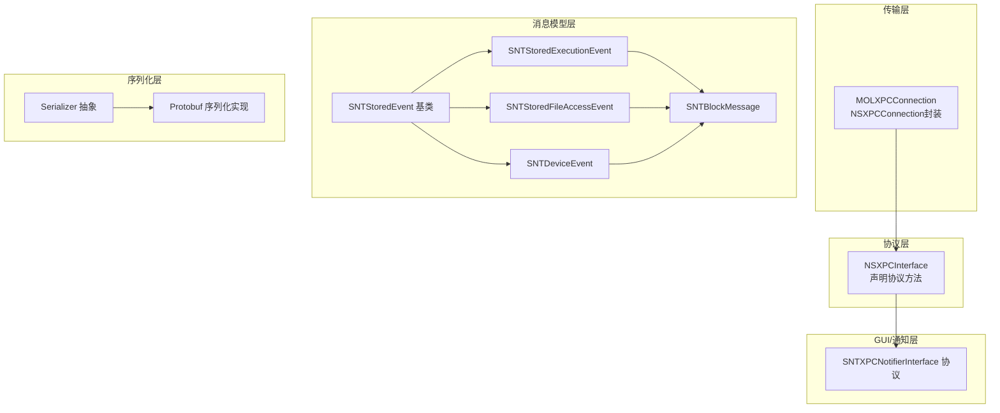
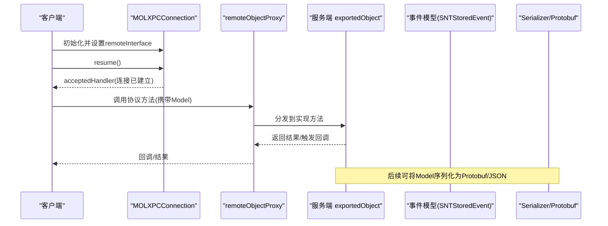
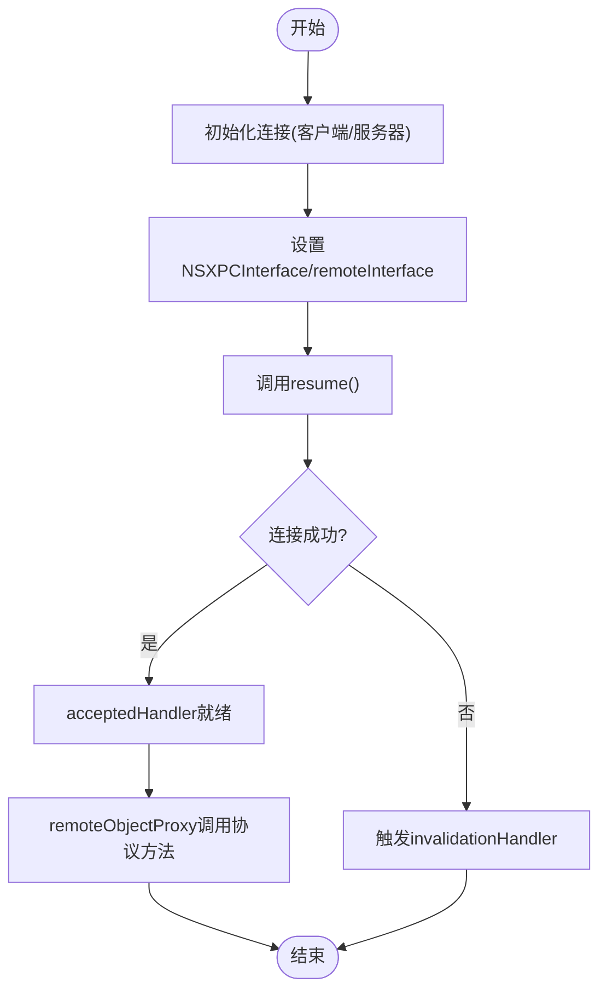
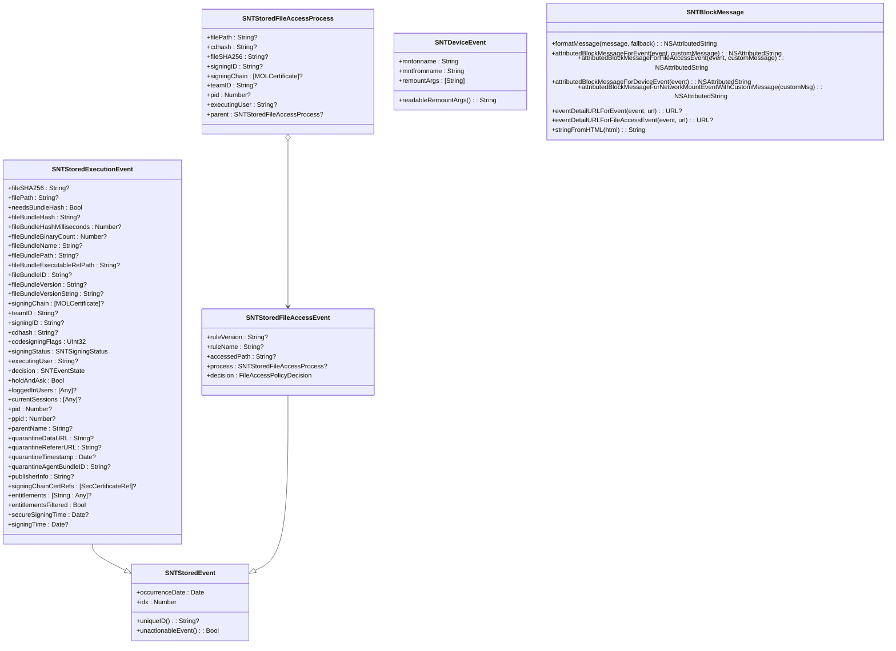
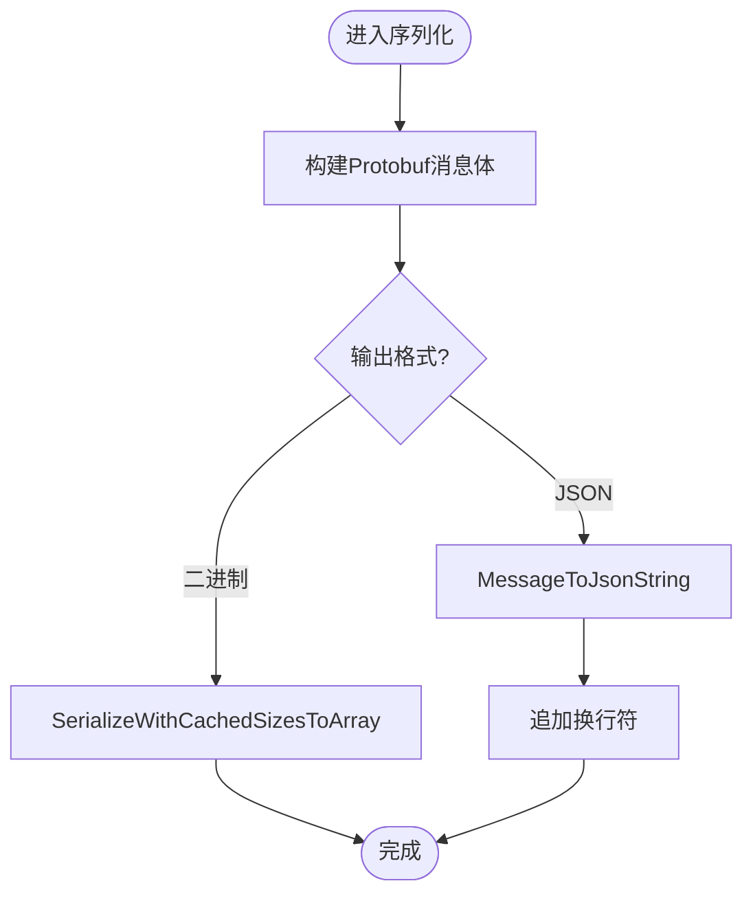
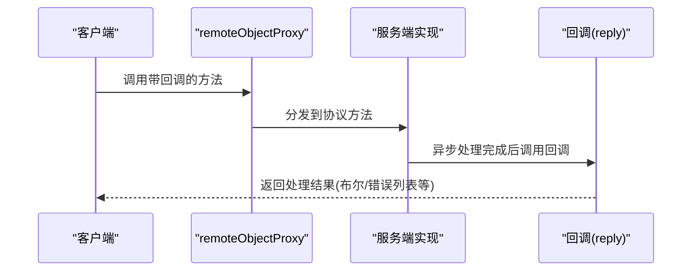
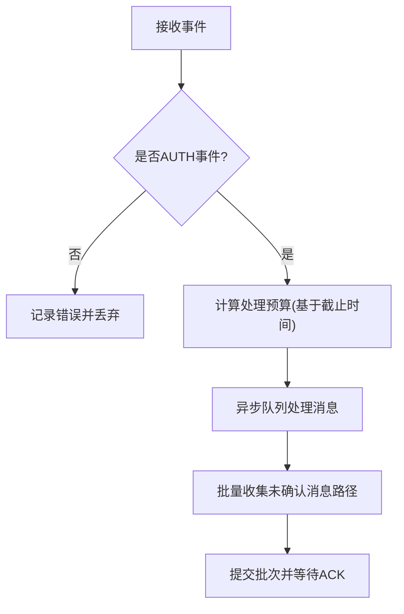
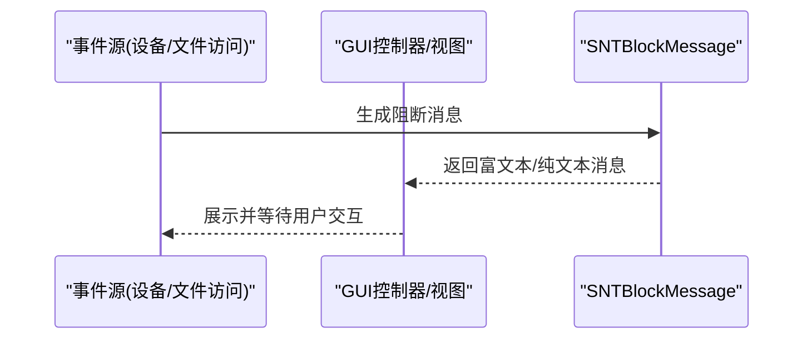
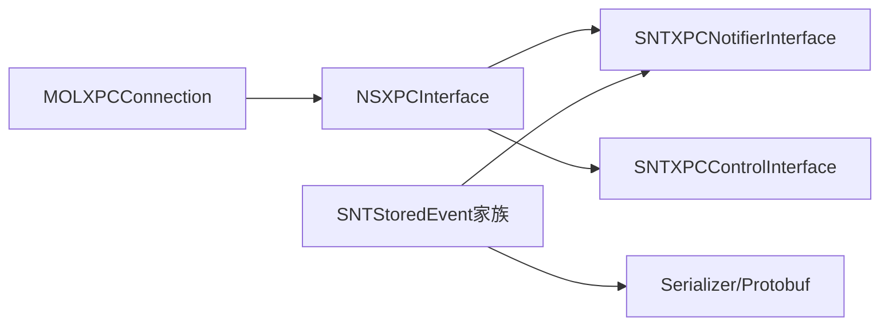

# 消息传递机制

<cite>
**本文引用的文件**
- [MOLXPCConnection.h](file://Source/common/MOLXPCConnection.h)
- [MOLXPCConnection.mm](file://Source/common/MOLXPCConnection.mm)
- [SNTXPCNotifierInterface.h](file://Source/common/SNTXPCNotifierInterface.h)
- [SNTXPCNotifierInterface.mm](file://Source/common/SNTXPCNotifierInterface.mm)
- [SNTXPCControlInterface.h](file://Source/common/SNTXPCControlInterface.h)
- [SNTStoredEvent.h](file://Source/common/SNTStoredEvent.h)
- [SNTStoredExecutionEvent.h](file://Source/common/SNTStoredExecutionEvent.h)
- [SNTStoredFileAccessEvent.h](file://Source/common/SNTStoredFileAccessEvent.h)
- [SNTStoredFileAccessEvent.mm](file://Source/common/SNTStoredFileAccessEvent.mm)
- [SNTStoredFileAccessEventTest.mm](file://Source/common/SNTStoredFileAccessEventTest.mm)
- [SNTDeviceEvent.h](file://Source/common/SNTDeviceEvent.h)
- [SNTBlockMessage.h](file://Source/common/SNTBlockMessage.h)
- [SNTBlockMessage.mm](file://Source/common/SNTBlockMessage.mm)
- [SNTDeviceMessageWindowController.mm](file://Source/gui/SNTDeviceMessageWindowController.mm)
- [SNTDeviceMessageWindowView.swift](file://Source/gui/SNTDeviceMessageWindowView.swift)
- [SNTEndpointSecurityClient.mm](file://Source/santad/EventProviders/SNTEndpointSecurityClient.mm)
- [SNTEndpointSecurityRecorder.mm](file://Source/santad/EventProviders/SNTEndpointSecurityRecorder.mm)
- [Serializer.h](file://Source/santad/Logs/EndpointSecurity/Serializers/Serializer.h)
- [Protobuf.mm](file://Source/santad/Logs/EndpointSecurity/Serializers/Protobuf.mm)
- [fsspool.h](file://Source/santad/Logs/EndpointSecurity/Writers/FSSpool/fsspool.h)
- [SNTNotificationQueueTest.mm](file://Source/santad/SNTNotificationQueueTest.mm)
</cite>

## 目录
1. [引言](#引言)
2. [项目结构](#项目结构)
3. [核心组件](#核心组件)
4. [架构总览](#架构总览)
5. [详细组件分析](#详细组件分析)
6. [依赖分析](#依赖分析)
7. [性能考虑](#性能考虑)
8. [故障排查指南](#故障排查指南)
9. [结论](#结论)
10. [附录](#附录)

## 引言
本文件面向Santa系统中的消息传递机制，聚焦于XPC消息的序列化与反序列化、消息格式设计、数据传输协议，以及核心消息类型（如SNTStoredEvent、SNTBlockMessage、SNTDeviceEvent）的结构定义与传输格式。同时，文档阐述同步调用与异步回调的消息处理机制、回调函数注册与结果返回流程，并解释消息路由策略、优先级与批量处理策略。文末提供消息格式图、传输流程图与处理时序图，并给出可定位到源码路径的示例说明，帮助读者快速理解并正确使用Santa的消息通道。

## 项目结构
Santa的消息传递涉及多个层次：
- 传输层：基于XPC（NSXPCConnection/MOLXPCConnection），负责连接建立、接口声明、代理对象与回调处理。
- 协议层：通过NSXPCInterface声明服务端/客户端双方的协议方法，确保参数类型安全与序列化兼容。
- 消息模型层：以SNTStoredEvent及其子类（执行事件、文件访问事件、设备事件等）为核心载体，承载决策与上下文信息。
- 序列化层：在日志与持久化场景中，将事件消息序列化为二进制或文本格式（Protobuf/JSON/自定义字符串）。
- GUI与通知层：通过SNTXPCNotifierInterface向GUI或通知系统投递阻断提示与用户交互。

图表来源
- [MOLXPCConnection.h](file://Source/common/MOLXPCConnection.h#L1-L164)
- [SNTXPCNotifierInterface.h](file://Source/common/SNTXPCNotifierInterface.h#L1-L57)
- [SNTStoredEvent.h](file://Source/common/SNTStoredEvent.h#L1-L36)
- [SNTStoredExecutionEvent.h](file://Source/common/SNTStoredExecutionEvent.h#L1-L142)
- [SNTStoredFileAccessEvent.h](file://Source/common/SNTStoredFileAccessEvent.h#L1-L74)
- [SNTDeviceEvent.h](file://Source/common/SNTDeviceEvent.h#L1-L28)
- [SNTBlockMessage.h](file://Source/common/SNTBlockMessage.h#L1-L72)
- [Serializer.h](file://Source/santad/Logs/EndpointSecurity/Serializers/Serializer.h#L36-L69)
- [Protobuf.mm](file://Source/santad/Logs/EndpointSecurity/Serializers/Protobuf.mm#L440-L706)

章节来源
- [MOLXPCConnection.h](file://Source/common/MOLXPCConnection.h#L1-L164)
- [SNTXPCNotifierInterface.h](file://Source/common/SNTXPCNotifierInterface.h#L1-L57)
- [SNTStoredEvent.h](file://Source/common/SNTStoredEvent.h#L1-L36)
- [SNTStoredExecutionEvent.h](file://Source/common/SNTStoredExecutionEvent.h#L1-L142)
- [SNTStoredFileAccessEvent.h](file://Source/common/SNTStoredFileAccessEvent.h#L1-L74)
- [SNTDeviceEvent.h](file://Source/common/SNTDeviceEvent.h#L1-L28)
- [SNTBlockMessage.h](file://Source/common/SNTBlockMessage.h#L1-L72)
- [Serializer.h](file://Source/santad/Logs/EndpointSecurity/Serializers/Serializer.h#L36-L69)
- [Protobuf.mm](file://Source/santad/Logs/EndpointSecurity/Serializers/Protobuf.mm#L440-L706)

## 核心组件
- 传输与连接管理
  - MOLXPCConnection：对NSXPCConnection进行封装，提供服务器/客户端初始化、接口声明、连接状态监听、强制连接建立与失效回调等能力。
  - 关键属性与行为：remoteInterface/remoteObjectProxy/synchronousRemoteObjectProxy、acceptedHandler/invalidationHandler、resume/invalidate、isConnected。
- 协议接口
  - SNTXPCNotifierInterface：定义通知协议（阻断通知、USB阻断、网络挂载、文件访问阻断、客户端模式变更、规则同步、临时监控授权等）。
  - SNTXPCControlInterface：定义守护进程控制协议（缓存清理、数据库操作、配置更新、命令下发、安装应用等），并提供预配置连接工具。
- 消息模型
  - SNTStoredEvent：所有存储型事件的基类，包含发生时间、索引等通用元数据。
  - SNTStoredExecutionEvent：执行事件，包含文件哈希、路径、签名链、决策、会话、父进程等丰富信息。
  - SNTStoredFileAccessEvent：文件访问事件，包含被访问路径、进程信息、决策等。
  - SNTDeviceEvent：设备事件，用于USB/设备挂载等场景。
  - SNTBlockMessage：生成面向用户的阻断提示消息与详情链接，支持富文本/纯文本格式转换。
- 序列化与持久化
  - Serializer抽象与Protobuf实现：将事件消息序列化为Protobuf或JSON，便于写入日志或传输。
  - FSSpool批处理：按目录扫描未确认消息，形成批次路径集合，支持批量ACK与去重。

章节来源
- [MOLXPCConnection.h](file://Source/common/MOLXPCConnection.h#L1-L164)
- [MOLXPCConnection.mm](file://Source/common/MOLXPCConnection.mm#L1-L119)
- [SNTXPCNotifierInterface.h](file://Source/common/SNTXPCNotifierInterface.h#L1-L57)
- [SNTXPCControlInterface.h](file://Source/common/SNTXPCControlInterface.h#L1-L104)
- [SNTStoredEvent.h](file://Source/common/SNTStoredEvent.h#L1-L36)
- [SNTStoredExecutionEvent.h](file://Source/common/SNTStoredExecutionEvent.h#L1-L142)
- [SNTStoredFileAccessEvent.h](file://Source/common/SNTStoredFileAccessEvent.h#L1-L74)
- [SNTDeviceEvent.h](file://Source/common/SNTDeviceEvent.h#L1-L28)
- [SNTBlockMessage.h](file://Source/common/SNTBlockMessage.h#L1-L72)
- [Serializer.h](file://Source/santad/Logs/EndpointSecurity/Serializers/Serializer.h#L36-L69)
- [Protobuf.mm](file://Source/santad/Logs/EndpointSecurity/Serializers/Protobuf.mm#L440-L706)
- [fsspool.h](file://Source/santad/Logs/EndpointSecurity/Writers/FSSpool/fsspool.h#L360-L395)

## 架构总览
Santa的消息传递采用“XPC协议 + NSSecureCoding模型 + 日志序列化”的分层架构：
- 客户端通过MOLXPCConnection建立与守护进程的连接，声明remoteInterface后，使用remoteObjectProxy发起RPC调用。
- 服务端通过NSXPCInterface声明协议，exportedObject提供方法实现；客户端收到invalidationHandler回调以感知连接中断。
- 事件对象（SNTStoredEvent家族）作为消息载体，通过NSSecureCoding在进程间传输。
- 日志与持久化阶段使用Serializer/Protobuf将事件转为二进制或文本格式，便于写入文件或网络上报。

图表来源
- [MOLXPCConnection.h](file://Source/common/MOLXPCConnection.h#L1-L164)
- [SNTXPCNotifierInterface.h](file://Source/common/SNTXPCNotifierInterface.h#L1-L57)
- [SNTStoredEvent.h](file://Source/common/SNTStoredEvent.h#L1-L36)
- [Protobuf.mm](file://Source/santad/Logs/EndpointSecurity/Serializers/Protobuf.mm#L440-L706)

## 详细组件分析

### XPC连接与消息路由
- 连接建立
  - 服务器端：initServerWithListener/initServerWithName，设置privilegedInterface/unprivilegedInterface与exportedObject，调用resume后由delegate回调acceptedHandler。
  - 客户端：initClientWithListener/initClientWithName/initClientWithServiceName，设置remoteInterface，调用resume后等待acceptedHandler或在连接失败时触发invalidationHandler。
- 消息路由
  - 通过NSXPCInterface声明的方法签名决定路由目标；remoteObjectProxy提供远程调用入口，synchronousRemoteObjectProxy提供同步调用入口。
  - 连接状态由isConnected反映，失效时invalidationHandler统一处理。
- 失败与重试
  - 连接未建立或中断时，remoteObjectProxy可能为nil，需依赖invalidationHandler进行降级处理。

图表来源
- [MOLXPCConnection.h](file://Source/common/MOLXPCConnection.h#L1-L164)
- [MOLXPCConnection.mm](file://Source/common/MOLXPCConnection.mm#L55-L119)

章节来源
- [MOLXPCConnection.h](file://Source/common/MOLXPCConnection.h#L1-L164)
- [MOLXPCConnection.mm](file://Source/common/MOLXPCConnection.mm#L1-L119)

### 事件模型与消息格式
- SNTStoredEvent（基类）
  - 字段：occurrenceDate、idx；要求子类实现uniqueID与unactionableEvent。
- SNTStoredExecutionEvent（执行事件）
  - 关键字段：fileSHA256、filePath、needsBundleHash、fileBundleHash、bundle元信息、签名链、teamID、signingID、cdhash、codesigningFlags、signingStatus、executingUser、decision、holdAndAsk、loggedInUsers、currentSessions、pid、ppid、parentName、quarantine信息、publisherInfo、signingChainCertRefs、entitlements、entitlementsFiltered、secureSigningTime、signingTime。
- SNTStoredFileAccessEvent（文件访问事件）
  - 关键字段：ruleVersion、ruleName、accessedPath、process（含filePath、cdhash、fileSHA256、signingID、signingChain、teamID、pid、executingUser、parent）、decision。
- SNTDeviceEvent（设备事件）
  - 关键字段：mntonname、mntfromname、remountArgs、readableRemountArgs。
- SNTBlockMessage（阻断消息）
  - 功能：根据事件类型生成用户可读的阻断消息与详情链接；支持富文本与纯文本转换。

图表来源
- [SNTStoredEvent.h](file://Source/common/SNTStoredEvent.h#L1-L36)
- [SNTStoredExecutionEvent.h](file://Source/common/SNTStoredExecutionEvent.h#L1-L142)
- [SNTStoredFileAccessEvent.h](file://Source/common/SNTStoredFileAccessEvent.h#L1-L74)
- [SNTDeviceEvent.h](file://Source/common/SNTDeviceEvent.h#L1-L28)
- [SNTBlockMessage.h](file://Source/common/SNTBlockMessage.h#L1-L72)

章节来源
- [SNTStoredEvent.h](file://Source/common/SNTStoredEvent.h#L1-L36)
- [SNTStoredExecutionEvent.h](file://Source/common/SNTStoredExecutionEvent.h#L1-L142)
- [SNTStoredFileAccessEvent.h](file://Source/common/SNTStoredFileAccessEvent.h#L1-L74)
- [SNTDeviceEvent.h](file://Source/common/SNTDeviceEvent.h#L1-L28)
- [SNTBlockMessage.h](file://Source/common/SNTBlockMessage.h#L1-L72)

### 序列化与反序列化流程
- NSSecureCoding
  - 所有事件模型均遵循NSSecureCoding，确保跨进程安全编码/解码。
- Protobuf序列化
  - Serializer抽象定义了多种事件类型的序列化接口；Protobuf实现将事件转为Protobuf消息，支持输出为JSON或二进制字节流。
  - Protobuf::FinalizeProto负责最终序列化与格式选择（JSON或二进制），并追加换行符（JSON）。
- 文件系统池化（FSSpool）
  - 提供BatchMessagePaths按数量收集未确认消息路径，维护unacked_messages集合，支持批量ACK与计数统计。

图表来源
- [Serializer.h](file://Source/santad/Logs/EndpointSecurity/Serializers/Serializer.h#L36-L69)
- [Protobuf.mm](file://Source/santad/Logs/EndpointSecurity/Serializers/Protobuf.mm#L440-L706)
- [fsspool.h](file://Source/santad/Logs/EndpointSecurity/Writers/FSSpool/fsspool.h#L360-L395)

章节来源
- [Serializer.h](file://Source/santad/Logs/EndpointSecurity/Serializers/Serializer.h#L36-L69)
- [Protobuf.mm](file://Source/santad/Logs/EndpointSecurity/Serializers/Protobuf.mm#L440-L706)
- [fsspool.h](file://Source/santad/Logs/EndpointSecurity/Writers/FSSpool/fsspool.h#L360-L395)

### 同步调用与异步回调机制
- 同步调用
  - 使用synchronousRemoteObjectProxy进行阻塞式调用，适合需要立即返回结果的场景。
- 异步回调
  - 使用remoteObjectProxy发起非阻塞调用，通过协议方法的回调参数（如andReply:）返回结果；测试中可见回调在后台队列异步执行。
- 回调注册与结果返回
  - 在SNTXPCNotifierInterface中，postBlockNotification/postFileAccessBlockNotification等方法带有回调参数，服务端实现可在处理完成后调用该回调返回布尔值。
  - MOLXPCConnection提供invalidationHandler统一处理连接中断。

图表来源
- [MOLXPCConnection.h](file://Source/common/MOLXPCConnection.h#L103-L153)
- [SNTXPCNotifierInterface.h](file://Source/common/SNTXPCNotifierInterface.h#L28-L46)
- [SNTNotificationQueueTest.mm](file://Source/santad/SNTNotificationQueueTest.mm#L209-L240)

章节来源
- [MOLXPCConnection.h](file://Source/common/MOLXPCConnection.h#L103-L153)
- [SNTXPCNotifierInterface.h](file://Source/common/SNTXPCNotifierInterface.h#L28-L46)
- [SNTNotificationQueueTest.mm](file://Source/santad/SNTNotificationQueueTest.mm#L209-L240)

### 消息路由策略、优先级与批量处理
- 路由策略
  - 通过NSXPCInterface声明的方法名与参数类型决定路由目标；客户端使用remoteObjectProxy调用对应协议方法。
- 优先级处理
  - 在事件处理侧，SNTEndpointSecurityClient根据事件类型与截止时间计算处理预算，确保紧急响应留有余量。
- 批量处理
  - FSSpool::BatchMessagePaths按数量收集未确认消息路径，形成批次集合；NumberOfUnackedMessages用于统计未确认数量，便于限流与ACK管理。

图表来源
- [SNTEndpointSecurityClient.mm](file://Source/santad/EventProviders/SNTEndpointSecurityClient.mm#L279-L310)
- [fsspool.h](file://Source/santad/Logs/EndpointSecurity/Writers/FSSpool/fsspool.h#L360-L395)

章节来源
- [SNTEndpointSecurityClient.mm](file://Source/santad/EventProviders/SNTEndpointSecurityClient.mm#L279-L310)
- [fsspool.h](file://Source/santad/Logs/EndpointSecurity/Writers/FSSpool/fsspool.h#L360-L395)

### GUI与通知集成
- 设备阻断消息展示
  - SNTDeviceMessageWindowController与SNTDeviceMessageWindowView通过SNTBlockMessage生成阻断消息，并将事件绑定到视图进行展示。
- 通知协议
  - SNTXPCNotifierInterface定义了阻断通知、USB阻断、网络挂载、文件访问阻断、客户端模式变更、规则同步、临时监控授权等方法，供服务端实现并通过XPC调用。

图表来源
- [SNTDeviceMessageWindowController.mm](file://Source/gui/SNTDeviceMessageWindowController.mm#L1-L52)
- [SNTDeviceMessageWindowView.swift](file://Source/gui/SNTDeviceMessageWindowView.swift#L1-L38)
- [SNTBlockMessage.h](file://Source/common/SNTBlockMessage.h#L1-L72)
- [SNTXPCNotifierInterface.h](file://Source/common/SNTXPCNotifierInterface.h#L28-L46)

章节来源
- [SNTDeviceMessageWindowController.mm](file://Source/gui/SNTDeviceMessageWindowController.mm#L1-L52)
- [SNTDeviceMessageWindowView.swift](file://Source/gui/SNTDeviceMessageWindowView.swift#L1-L38)
- [SNTBlockMessage.h](file://Source/common/SNTBlockMessage.h#L1-L72)
- [SNTXPCNotifierInterface.h](file://Source/common/SNTXPCNotifierInterface.h#L28-L46)

## 依赖分析
- 组件耦合
  - MOLXPCConnection与NSXPCConnection紧密耦合，提供连接生命周期管理与接口声明。
  - SNTXPCNotifierInterface与SNTXPCControlInterface分别面向GUI与CLI/守护进程控制，二者通过XPC接口相互协作。
  - 事件模型（SNTStoredEvent家族）是消息载体，被广泛用于通知、日志与持久化。
  - Serializer/Protobuf实现与事件模型解耦，仅依赖事件的公共字段与枚举类型。
- 外部依赖
  - Foundation/NSXPC相关框架；Protobuf运行时；EndpointSecurity事件源（在santad侧）。

图表来源
- [MOLXPCConnection.h](file://Source/common/MOLXPCConnection.h#L1-L164)
- [SNTXPCNotifierInterface.h](file://Source/common/SNTXPCNotifierInterface.h#L1-L57)
- [SNTXPCControlInterface.h](file://Source/common/SNTXPCControlInterface.h#L1-L104)
- [SNTStoredEvent.h](file://Source/common/SNTStoredEvent.h#L1-L36)
- [Serializer.h](file://Source/santad/Logs/EndpointSecurity/Serializers/Serializer.h#L36-L69)

章节来源
- [MOLXPCConnection.h](file://Source/common/MOLXPCConnection.h#L1-L164)
- [SNTXPCNotifierInterface.h](file://Source/common/SNTXPCNotifierInterface.h#L1-L57)
- [SNTXPCControlInterface.h](file://Source/common/SNTXPCControlInterface.h#L1-L104)
- [SNTStoredEvent.h](file://Source/common/SNTStoredEvent.h#L1-L36)
- [Serializer.h](file://Source/santad/Logs/EndpointSecurity/Serializers/Serializer.h#L36-L69)

## 性能考虑
- 异步处理与预算分配
  - 在事件处理侧，依据截止时间动态计算处理预算，避免长时间阻塞导致的响应延迟。
- 批量与限流
  - 使用FSSpool的批处理接口限制单次处理数量，结合未确认消息计数进行限流与ACK管理。
- 序列化成本
  - Protobuf二进制序列化通常比JSON更高效；在高吞吐场景建议优先使用二进制格式。

章节来源
- [SNTEndpointSecurityClient.mm](file://Source/santad/EventProviders/SNTEndpointSecurityClient.mm#L279-L310)
- [fsspool.h](file://Source/santad/Logs/EndpointSecurity/Writers/FSSpool/fsspool.h#L360-L395)
- [Protobuf.mm](file://Source/santad/Logs/EndpointSecurity/Serializers/Protobuf.mm#L440-L706)

## 故障排查指南
- 连接问题
  - 现象：remoteObjectProxy为nil或频繁触发invalidationHandler。
  - 排查：检查MOLXPCConnection的resume调用时机、remoteInterface/privilegedInterface是否正确设置、launchd服务是否正常启动。
- 回调未触发
  - 现象：调用带回调的方法后无响应。
  - 排查：确认服务端实现确实调用了回调；注意回调必须在后台队列异步执行，避免死锁。
- 事件未落盘或重复
  - 现象：日志缺失或重复。
  - 排查：检查FSSpool的unacked_messages集合与BatchMessagePaths逻辑，确保ACK流程正确。

章节来源
- [MOLXPCConnection.h](file://Source/common/MOLXPCConnection.h#L103-L153)
- [SNTNotificationQueueTest.mm](file://Source/santad/SNTNotificationQueueTest.mm#L209-L240)
- [fsspool.h](file://Source/santad/Logs/EndpointSecurity/Writers/FSSpool/fsspool.h#L360-L395)

## 结论
Santa的消息传递机制以XPC为核心，结合NSSecureCoding事件模型与Protobuf序列化，在保证类型安全与跨进程通信可靠性的前提下，实现了高效的事件采集、处理与持久化。通过清晰的协议接口、异步回调与批处理策略，系统能够在高负载场景下保持稳定与可扩展性。建议在实际部署中关注连接生命周期管理、回调一致性与序列化格式选择，以获得最佳性能与可观测性。

## 附录
- 示例：如何构建、发送与接收消息（路径定位）
  - 构建执行事件并序列化
    - 参考：[SNTStoredExecutionEvent.h](file://Source/common/SNTStoredExecutionEvent.h#L1-L142)
    - 参考：[Protobuf.mm](file://Source/santad/Logs/EndpointSecurity/Serializers/Protobuf.mm#L440-L706)
  - 发送阻断通知（GUI）
    - 参考：[SNTXPCNotifierInterface.h](file://Source/common/SNTXPCNotifierInterface.h#L28-L46)
    - 参考：[SNTDeviceMessageWindowView.swift](file://Source/gui/SNTDeviceMessageWindowView.swift#L1-L38)
  - 异步回调与结果返回
    - 参考：[SNTNotificationQueueTest.mm](file://Source/santad/SNTNotificationQueueTest.mm#L209-L240)
  - 批量消息处理
    - 参考：[fsspool.h](file://Source/santad/Logs/EndpointSecurity/Writers/FSSpool/fsspool.h#L360-L395)
  - 连接建立与失效处理
    - 参考：[MOLXPCConnection.h](file://Source/common/MOLXPCConnection.h#L1-L164)
    - 参考：[MOLXPCConnection.mm](file://Source/common/MOLXPCConnection.mm#L55-L119)