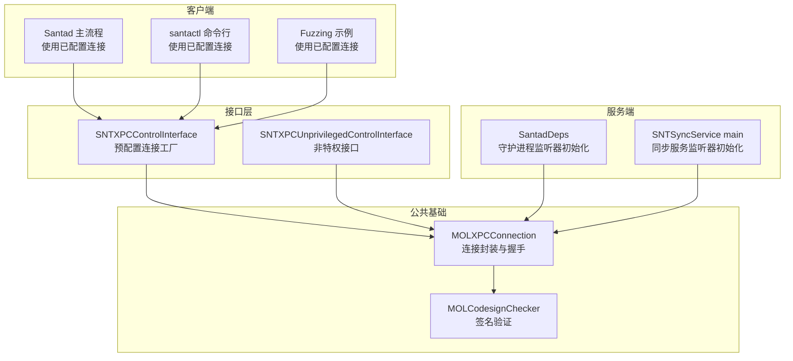
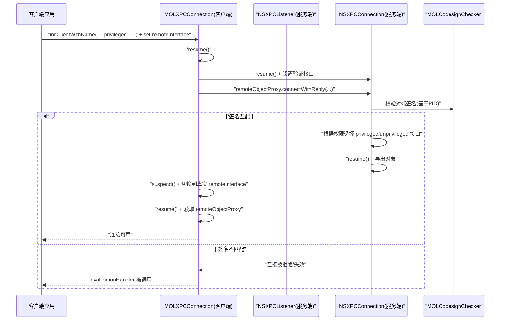
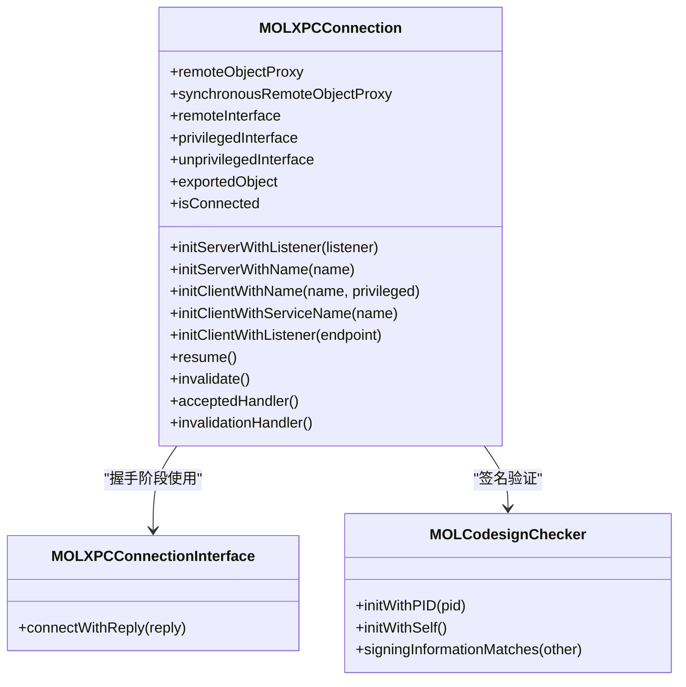
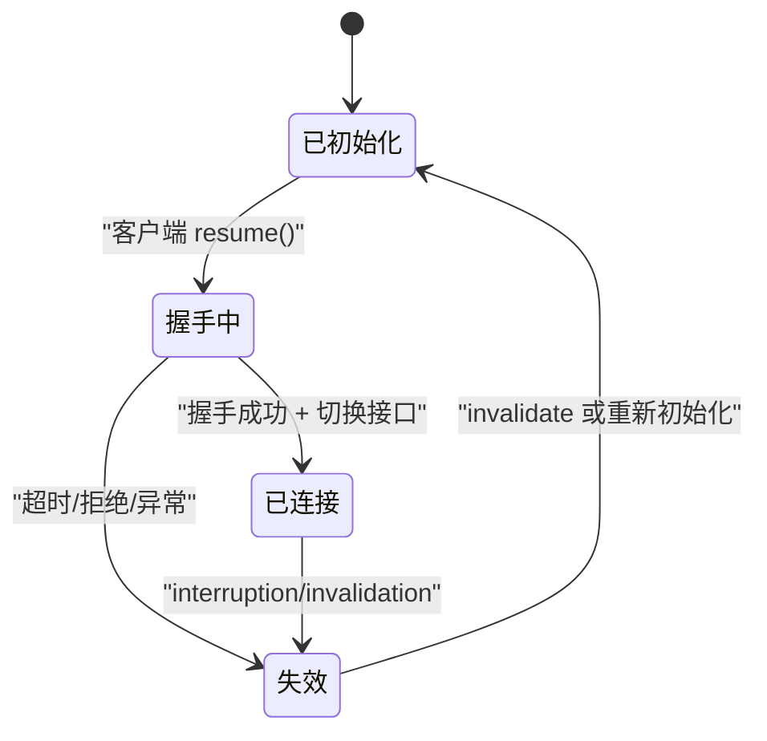
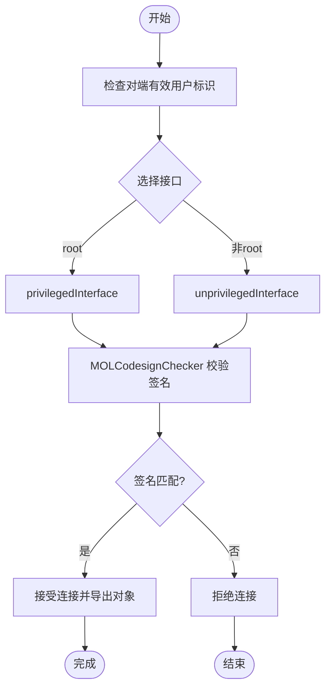
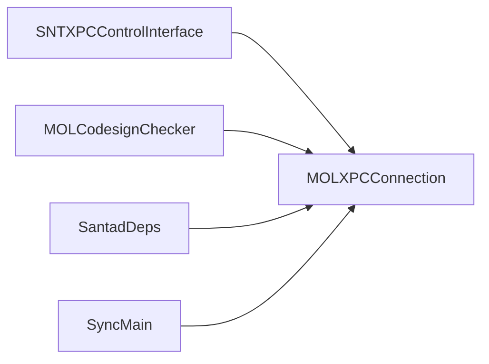

# 连接管理

<cite>
**本文引用的文件**
- [MOLXPCConnection.h](file://Source/common/MOLXPCConnection.h)
- [MOLXPCConnection.mm](file://Source/common/MOLXPCConnection.mm)
- [MOLXPCConnectionTest.mm](file://Source/common/MOLXPCConnectionTest.mm)
- [MOLCodesignChecker.h](file://Source/common/MOLCodesignChecker.h)
- [SNTXPCControlInterface.h](file://Source/common/SNTXPCControlInterface.h)
- [SNTXPCControlInterface.mm](file://Source/common/SNTXPCControlInterface.mm)
- [SNTXPCUnprivilegedControlInterface.h](file://Source/common/SNTXPCUnprivilegedControlInterface.h)
- [SantadDeps.mm](file://Source/santad/SantadDeps.mm)
- [main.mm（同步服务）](file://Source/santasyncservice/main.mm)
- [checkCacheForVnodeID.mm](file://Fuzzing/santad/src/checkCacheForVnodeID.mm)
</cite>

## 目录
1. [简介](#简介)
2. [项目结构](#项目结构)
3. [核心组件](#核心组件)
4. [架构总览](#架构总览)
5. [详细组件分析](#详细组件分析)
6. [依赖关系分析](#依赖关系分析)
7. [性能考虑](#性能考虑)
8. [故障排查指南](#故障排查指南)
9. [结论](#结论)
10. [附录](#附录)

## 简介
本文件围绕 Santa 系统中的 XPC 连接管理进行系统化技术说明，重点聚焦于 MOLXPCConnection 类的设计与实现，涵盖服务器端监听器、客户端连接建立、特权与非特权接口分发、代码签名验证、连接生命周期管理、超时与错误恢复、以及在守护进程与工具进程之间的集成方式。文档同时提供状态图、生命周期流程图与错误处理流程图，并给出可直接定位到源码路径的示例，帮助读者快速正确地创建、配置与管理 XPC 连接。

## 项目结构
与 XPC 连接管理相关的核心文件分布如下：
- MOLXPCConnection：XPC 连接封装与握手协议实现
- MOLCodesignChecker：代码签名检查与匹配
- SNTXPCControlInterface / SNTXPCUnprivilegedControlInterface：控制接口与预配置连接工厂
- 各模块入口与集成点：守护进程、同步服务、命令行工具等

图表来源
- [MOLXPCConnection.mm](file://Source/common/MOLXPCConnection.mm#L1-L119)
- [MOLCodesignChecker.h](file://Source/common/MOLCodesignChecker.h#L1-L210)
- [SNTXPCControlInterface.mm](file://Source/common/SNTXPCControlInterface.mm#L1-L97)
- [SNTXPCUnprivilegedControlInterface.h](file://Source/common/SNTXPCUnprivilegedControlInterface.h#L104-L132)
- [SantadDeps.mm](file://Source/santad/SantadDeps.mm#L48-L81)
- [main.mm（同步服务）](file://Source/santasyncservice/main.mm#L1-L37)
- [checkCacheForVnodeID.mm](file://Fuzzing/santad/src/checkCacheForVnodeID.mm#L1-L41)

章节来源
- [MOLXPCConnection.h](file://Source/common/MOLXPCConnection.h#L1-L164)
- [MOLXPCConnection.mm](file://Source/common/MOLXPCConnection.mm#L1-L239)
- [MOLXPCControlInterface.h](file://Source/common/SNTXPCControlInterface.h#L1-L104)
- [MOLXPCControlInterface.mm](file://Source/common/SNTXPCControlInterface.mm#L1-L97)
- [SNTXPCUnprivilegedControlInterface.h](file://Source/common/SNTXPCUnprivilegedControlInterface.h#L104-L132)
- [SantadDeps.mm](file://Source/santad/SantadDeps.mm#L48-L81)
- [main.mm（同步服务）](file://Source/santasyncservice/main.mm#L1-L37)
- [checkCacheForVnodeID.mm](file://Fuzzing/santad/src/checkCacheForVnodeID.mm#L1-L41)

## 核心组件
- MOLXPCConnection：对 NSXPCListener/NSXPCConnection 的封装，提供统一的连接建立、失效处理、代理获取与状态查询；内置“验证接口”用于握手阶段，确保连接双方来自同一签名链路。
- MOLCodesignChecker：用于校验连接对端二进制签名信息是否与本地一致，作为安全边界的一部分。
- SNTXPCControlInterface：提供服务 ID、接口初始化与预配置的特权客户端连接，供上层工具与守护进程复用。
- SNTXPCUnprivilegedControlInterface：提供非特权接口初始化方法，配合 MOLXPCConnection 的特权/非特权接口分发。

章节来源
- [MOLXPCConnection.h](file://Source/common/MOLXPCConnection.h#L54-L154)
- [MOLXPCConnection.mm](file://Source/common/MOLXPCConnection.mm#L1-L119)
- [MOLCodesignChecker.h](file://Source/common/MOLCodesignChecker.h#L1-L210)
- [SNTXPCControlInterface.h](file://Source/common/SNTXPCControlInterface.h#L1-L104)
- [SNTXPCControlInterface.mm](file://Source/common/SNTXPCControlInterface.mm#L1-L97)
- [SNTXPCUnprivilegedControlInterface.h](file://Source/common/SNTXPCUnprivilegedControlInterface.h#L104-L132)

## 架构总览
下图展示了从客户端到守护进程的典型交互路径，包括握手、接口切换与错误处理：

图表来源
- [MOLXPCConnection.mm](file://Source/common/MOLXPCConnection.mm#L114-L202)
- [MOLCodesignChecker.h](file://Source/common/MOLCodesignChecker.h#L162-L201)
- [SNTXPCControlInterface.mm](file://Source/common/SNTXPCControlInterface.mm#L89-L96)

章节来源
- [MOLXPCConnection.mm](file://Source/common/MOLXPCConnection.mm#L114-L202)
- [SNTXPCControlInterface.mm](file://Source/common/SNTXPCControlInterface.mm#L89-L96)

## 详细组件分析

### MOLXPCConnection 类设计与职责
- 角色与职责
  - 封装 NSXPCListener/NSXPCConnection，提供统一的连接生命周期管理与错误处理。
  - 在客户端侧通过“验证接口”完成握手，随后切换到业务接口，保证连接双方来自同一签名链路。
  - 在服务端侧根据对端有效用户标识（root/普通用户）选择对应的特权或非特权接口导出。
  - 提供 acceptedHandler 与 invalidationHandler 回调，便于上层感知连接状态变化。
- 关键属性
  - remoteInterface：客户端侧业务接口
  - privilegedInterface/unprivilegedInterface：服务端侧导出接口
  - exportedObject：服务端侧导出对象
  - remoteObjectProxy/synchronousRemoteObjectProxy：远程代理（带错误处理器）
  - isConnected：连接状态判断
- 初始化与连接建立
  - 客户端：initClientWithName/initClientWithServiceName/initClientWithListener，支持 privileged 选项
  - 服务端：initServerWithName/initServerWithListener，设置验证接口
  - resume：客户端先以验证接口建立连接，再切换到业务接口；服务端在 delegate 中按权限选择接口并导出对象
- 错误与失效处理
  - 客户端在 interruptionHandler/invalidationHandler 中清理 remoteObjectInterface，避免使用无效代理
  - 服务端在 shouldAcceptNewConnection 中进行签名校验与接口选择，失败则拒绝

图表来源
- [MOLXPCConnection.h](file://Source/common/MOLXPCConnection.h#L54-L154)
- [MOLXPCConnection.mm](file://Source/common/MOLXPCConnection.mm#L1-L119)
- [MOLCodesignChecker.h](file://Source/common/MOLCodesignChecker.h#L162-L201)

章节来源
- [MOLXPCConnection.h](file://Source/common/MOLXPCConnection.h#L54-L154)
- [MOLXPCConnection.mm](file://Source/common/MOLXPCConnection.mm#L55-L239)
- [MOLCodesignChecker.h](file://Source/common/MOLCodesignChecker.h#L162-L201)

### 连接生命周期与状态机
- 客户端生命周期
  - 初始化 -> 设置 remoteInterface -> resume -> 握手（验证接口）-> 切换业务接口 -> 连接可用
  - 若握手超时或对端失效，触发 invalidationHandler
- 服务端生命周期
  - 初始化 -> 设置 privileged/unprivileged 接口 -> resume -> 监听 -> shouldAcceptNewConnection -> 签名校验 -> 导出对象 -> 连接可用
- 状态机

图表来源
- [MOLXPCConnection.mm](file://Source/common/MOLXPCConnection.mm#L114-L202)

章节来源
- [MOLXPCConnection.mm](file://Source/common/MOLXPCConnection.mm#L114-L202)

### 会话建立与维护机制
- 握手协议
  - 客户端以验证接口发起 connectWithReply 请求，服务端在 shouldAcceptNewConnection 中准备导出对象与接口，回复后客户端 suspend 并切换到业务接口，再 resume 完成最终建立。
- 代理获取
  - remoteObjectProxy/synchronousRemoteObjectProxy 均带有错误处理器，一旦发生错误即主动失效当前连接，避免悬挂代理。
- 会话维护
  - 通过 acceptedHandler/invalidationHandler 上报状态变化，便于上层做重连或降级处理。

章节来源
- [MOLXPCConnection.mm](file://Source/common/MOLXPCConnection.mm#L114-L202)
- [MOLXPCConnection.h](file://Source/common/MOLXPCConnection.h#L103-L154)

### 连接配置选项、超时与重连策略
- 配置选项
  - privileged 选项：客户端通过 initClientWithName 的 privileged 参数决定是否以特权身份连接
  - 接口设置：客户端设置 remoteInterface；服务端分别设置 privilegedInterface 与 unprivilegedInterface，并在 shouldAcceptNewConnection 中按权限选择
- 超时设置
  - 客户端在 resume 中使用信号量等待握手完成，超时时间为 2 秒；超时后主动失效连接并清理 remoteObjectInterface
- 重连策略
  - 代码未内置自动重连逻辑；建议上层在 invalidationHandler 中自行实现指数退避重试与连接重建

章节来源
- [MOLXPCConnection.mm](file://Source/common/MOLXPCConnection.mm#L84-L110)
- [MOLXPCConnection.mm](file://Source/common/MOLXPCConnection.mm#L114-L157)
- [MOLXPCConnection.h](file://Source/common/MOLXPCConnection.h#L90-L102)

### 错误恢复与安全边界
- 错误恢复
  - 客户端在 interruptionHandler/invalidationHandler 中清理 remoteObjectInterface，防止继续使用无效代理
  - 服务端在 shouldAcceptNewConnection 中拒绝签名不匹配的连接
- 安全边界
  - 使用 MOLCodesignChecker 对对端进程 PID 进行签名信息匹配，确保仅允许来自 Santa 组件的连接
  - 服务端区分 root 与非 root 权限，分别导出不同接口，限制非特权进程访问敏感操作

图表来源
- [MOLXPCConnection.mm](file://Source/common/MOLXPCConnection.mm#L159-L202)
- [MOLCodesignChecker.h](file://Source/common/MOLCodesignChecker.h#L162-L201)

章节来源
- [MOLXPCConnection.mm](file://Source/common/MOLXPCConnection.mm#L159-L202)
- [MOLCodesignChecker.h](file://Source/common/MOLCodesignChecker.h#L162-L201)

### 连接池管理与并发处理
- 当前实现未提供连接池抽象；每个 MOLXPCConnection 实例对应单一 NSXPCConnection
- 并发模型
  - XPC 默认在后台线程投递消息，避免阻塞主线程
  - 客户端与服务端均通过回调与代理进行异步通信
- 资源清理
  - invalidate 会释放底层连接；remoteObjectInterface 在失效时被清理，防止悬挂代理

章节来源
- [MOLXPCConnection.h](file://Source/common/MOLXPCConnection.h#L103-L154)
- [MOLXPCConnection.mm](file://Source/common/MOLXPCConnection.mm#L204-L239)

### 特权进程与非特权进程差异
- 特权进程（root）
  - 服务端导出 privilegedInterface，允许执行高权限操作
  - 客户端通过 privileged: YES 建立特权连接
- 非特权进程（普通用户）
  - 服务端导出 unprivilegedInterface，限制可执行的操作范围
  - 客户端以普通权限连接，无法访问特权接口

章节来源
- [MOLXPCConnection.mm](file://Source/common/MOLXPCConnection.mm#L159-L202)
- [SNTXPCControlInterface.mm](file://Source/common/SNTXPCControlInterface.mm#L89-L96)

## 依赖关系分析
- MOLXPCConnection 依赖 MOLCodesignChecker 进行签名验证
- SNTXPCControlInterface 提供预配置的特权客户端连接，简化上层使用
- 服务端入口（守护进程与同步服务）通过 MOLXPCConnection 初始化监听器并导出相应接口

图表来源
- [SNTXPCControlInterface.mm](file://Source/common/SNTXPCControlInterface.mm#L89-L96)
- [MOLXPCConnection.mm](file://Source/common/MOLXPCConnection.mm#L1-L119)
- [SantadDeps.mm](file://Source/santad/SantadDeps.mm#L48-L81)
- [main.mm（同步服务）](file://Source/santasyncservice/main.mm#L22-L36)

章节来源
- [SNTXPCControlInterface.mm](file://Source/common/SNTXPCControlInterface.mm#L1-L97)
- [MOLXPCConnection.mm](file://Source/common/MOLXPCConnection.mm#L1-L119)
- [SantadDeps.mm](file://Source/santad/SantadDeps.mm#L48-L81)
- [main.mm（同步服务）](file://Source/santasyncservice/main.mm#L1-L37)

## 性能考虑
- 握手阶段采用验证接口 + 二次切换，避免不必要的业务接口暴露，降低安全风险
- 客户端 resume 时的 2 秒超时可避免长时间挂起，但上层仍需结合业务需求评估是否需要更灵活的超时策略
- 异步消息投递减少线程阻塞，适合高并发场景；但需注意避免过度频繁的请求导致上下文切换开销

## 故障排查指南
- 常见问题与定位
  - 连接未建立：确认客户端已设置 remoteInterface，并在 resume 后检查 invalidationHandler 是否被触发
  - 签名不匹配：检查服务端 shouldAcceptNewConnection 的签名校验逻辑，确保对端与本地签名一致
  - 权限不足：确认服务端是否已设置正确的 privileged/unprivileged 接口，客户端是否以正确 privileged 选项连接
- 单元测试参考
  - 连接接受/中断/拒绝/同步调用等行为均有测试覆盖，可作为集成调试的参考

章节来源
- [MOLXPCConnectionTest.mm](file://Source/common/MOLXPCConnectionTest.mm#L52-L171)
- [MOLXPCConnection.mm](file://Source/common/MOLXPCConnection.mm#L114-L202)

## 结论
MOLXPCConnection 通过“验证接口 + 业务接口”的双阶段握手，结合 MOLCodesignChecker 的签名验证与特权/非特权接口分发，提供了安全、可控且易于使用的 XPC 连接管理能力。其清晰的生命周期与错误处理回调，使得上层可以稳定地构建守护进程与客户端之间的通信通道。对于重连与连接池等高级特性，可在上层基于回调与状态机进行扩展。

## 附录

### 具体使用示例（代码路径）
- 守护进程初始化监听器
  - [SantadDeps 初始化控制连接](file://Source/santad/SantadDeps.mm#L48-L81)
- 同步服务初始化监听器
  - [同步服务主函数](file://Source/santasyncservice/main.mm#L22-L36)
- 客户端使用预配置连接
  - [SNTXPCControlInterface 预配置连接](file://Source/common/SNTXPCControlInterface.mm#L89-L96)
  - [santactl 命令行使用](file://Source/santactl/Commands/SNTCommandStatus.mm#L1-L34)
- Fuzzing 示例
  - [checkCacheForVnodeID 使用已配置连接](file://Fuzzing/santad/src/checkCacheForVnodeID.mm#L1-L41)

### 关键流程图（代码映射）
- 客户端连接建立流程
  - [resume 握手与超时处理](file://Source/common/MOLXPCConnection.mm#L114-L157)
- 服务端接入与签名验证
  - [shouldAcceptNewConnection](file://Source/common/MOLXPCConnection.mm#L159-L202)
- 代理错误处理
  - [remoteObjectProxyWithErrorHandler](file://Source/common/MOLXPCConnection.mm#L204-L220)