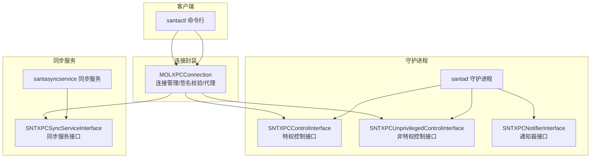
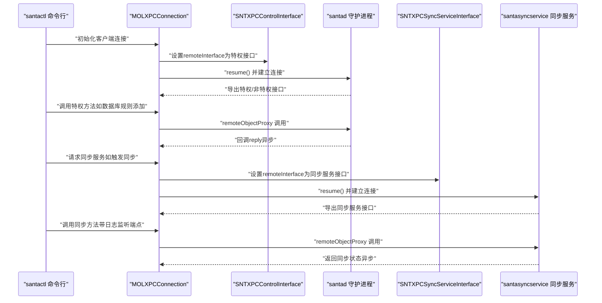
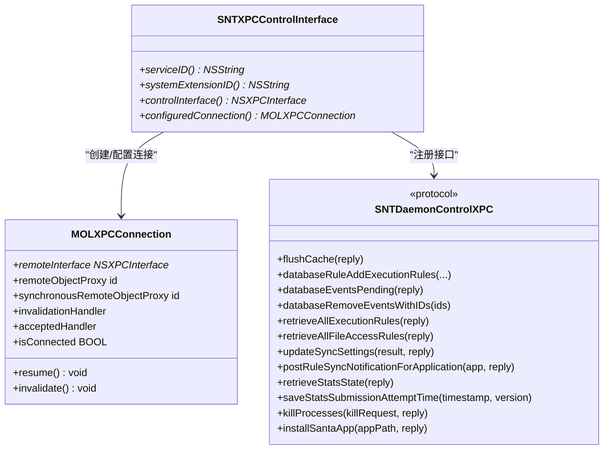
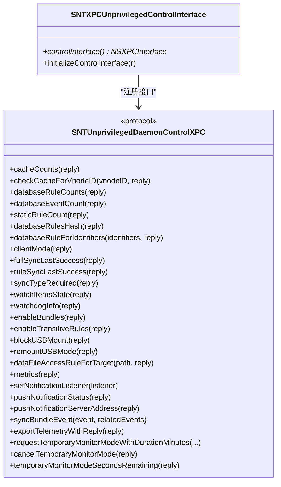
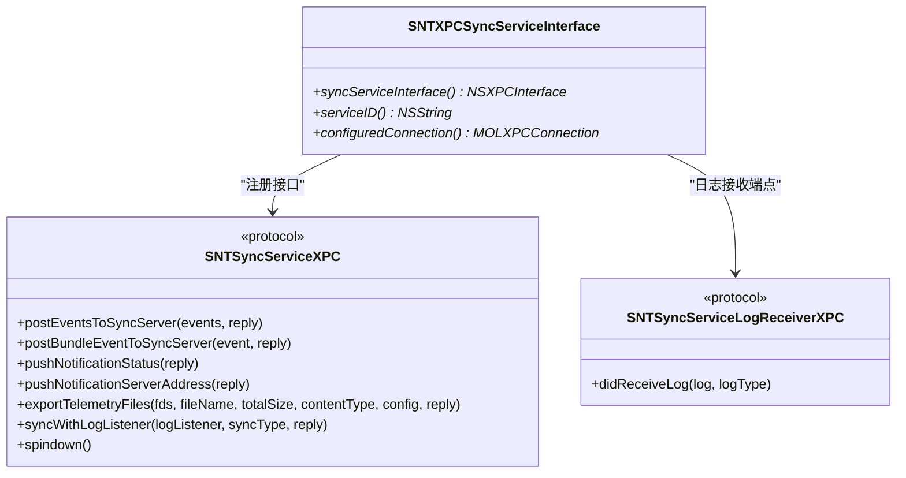
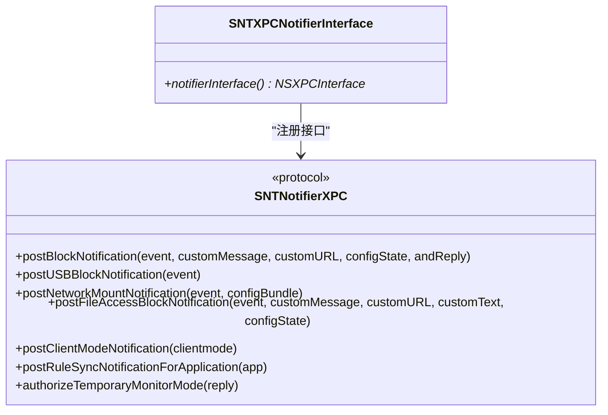
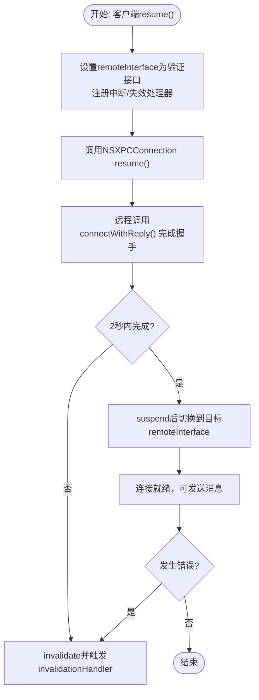
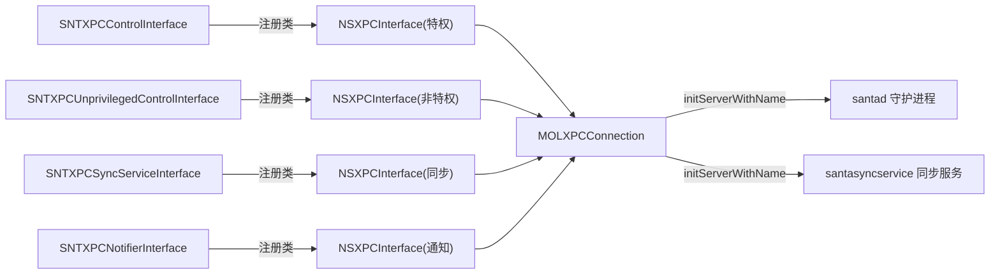

# 通信机制设计

<cite>
**本文引用的文件**
- [SNTXPCControlInterface.h](file://Source/common/SNTXPCControlInterface.h)
- [SNTXPCControlInterface.mm](file://Source/common/SNTXPCControlInterface.mm)
- [SNTXPCSyncServiceInterface.h](file://Source/common/SNTXPCSyncServiceInterface.h)
- [SNTXPCSyncServiceInterface.mm](file://Source/common/SNTXPCSyncServiceInterface.mm)
- [SNTXPCNotifierInterface.h](file://Source/common/SNTXPCNotifierInterface.h)
- [SNTXPCNotifierInterface.mm](file://Source/common/SNTXPCNotifierInterface.mm)
- [SNTXPCUnprivilegedControlInterface.h](file://Source/common/SNTXPCUnprivilegedControlInterface.h)
- [SNTXPCUnprivilegedControlInterface.mm](file://Source/common/SNTXPCUnprivilegedControlInterface.mm)
- [MOLXPCConnection.h](file://Source/common/MOLXPCConnection.h)
- [MOLXPCConnection.mm](file://Source/common/MOLXPCConnection.mm)
- [SantadDeps.mm](file://Source/santad/SantadDeps.mm)
- [main.mm（同步服务）](file://Source/santasyncservice/main.mm)
- [SNTCommandStatus.mm](file://Source/santactl/Commands/SNTCommandStatus.mm)
- [checkCacheForVnodeID.mm](file://Fuzzing/santad/src/checkCacheForVnodeID.mm)
- [MOLXPCConnectionTest.mm](file://Source/common/MOLXPCConnectionTest.mm)
</cite>

## 目录
1. [引言](#引言)
2. [项目结构](#项目结构)
3. [核心组件](#核心组件)
4. [架构总览](#架构总览)
5. [详细组件分析](#详细组件分析)
6. [依赖关系分析](#依赖关系分析)
7. [性能考量](#性能考量)
8. [故障排查指南](#故障排查指南)
9. [结论](#结论)
10. [附录：使用示例路径](#附录使用示例路径)

## 引言
本文件面向Santa系统的通信机制设计，聚焦于XPC接口的设计原理、连接管理策略与消息传递机制。文档围绕以下核心接口展开：SNTXPCControlInterface（特权控制）、SNTXPCSyncServiceInterface（同步服务）、SNTXPCNotifierInterface（通知器），并补充SNTXPCUnprivilegedControlInterface（非特权控制）以说明双接口分层。同时，结合MOLXPCConnection对连接建立、签名校验、异常处理、同步/异步代理、超时与重连策略进行深入解析，并通过序列图、流程图与类图呈现消息流转与安全边界。

## 项目结构
Santa的通信层由“接口定义 + 连接封装 + 服务端/客户端使用”三部分组成：
- 接口定义：在common目录下，分别定义了特权控制、非特权控制、同步服务、通知器等XPC协议与接口工厂。
- 连接封装：MOLXPCConnection统一抽象NSXPCListener/NSXPCConnection，提供签名校验、强制连接建立、失效/中断处理、同步/异步代理等能力。
- 使用示例：santad作为守护进程侧使用MOLXPCConnection导出接口；santasyncservice作为独立同步服务同样使用MOLXPCConnection；santactl作为CLI客户端通过接口工厂获取预配置连接并发送消息。

图表来源
- [SantadDeps.mm](file://Source/santad/SantadDeps.mm#L48-L81)
- [main.mm（同步服务）](file://Source/santasyncservice/main.mm#L22-L36)
- [SNTXPCControlInterface.mm](file://Source/common/SNTXPCControlInterface.mm#L82-L96)
- [SNTXPCSyncServiceInterface.mm](file://Source/common/SNTXPCSyncServiceInterface.mm#L37-L46)
- [MOLXPCConnection.h](file://Source/common/MOLXPCConnection.h#L54-L154)

章节来源
- [SantadDeps.mm](file://Source/santad/SantadDeps.mm#L48-L81)
- [main.mm（同步服务）](file://Source/santasyncservice/main.mm#L22-L36)
- [SNTXPCControlInterface.mm](file://Source/common/SNTXPCControlInterface.mm#L82-L96)
- [SNTXPCSyncServiceInterface.mm](file://Source/common/SNTXPCSyncServiceInterface.mm#L37-L46)
- [MOLXPCConnection.h](file://Source/common/MOLXPCConnection.h#L54-L154)

## 核心组件
- SNTXPCControlInterface：定义特权控制协议与接口工厂，负责生成带自定义类注册的NSXPCInterface，并提供预配置的MOLXPCConnection用于与守护进程通信。
- SNTXPCUnprivilegedControlInterface：定义非特权控制协议与接口工厂，用于普通用户态查询与临时监控模式等操作。
- SNTXPCSyncServiceInterface：定义与同步服务通信的协议与接口工厂，支持事件上报、遥测导出、同步触发与日志回传。
- SNTXPCNotifierInterface：定义通知器协议，用于向GUI或上层应用推送阻断通知、USB/网络挂载通知、客户端模式变更等。
- MOLXPCConnection：封装NSXPCListener/NSXPCConnection，提供签名校验、强制连接建立、失效/中断处理、同步/异步代理、连接状态判断等。

章节来源
- [SNTXPCControlInterface.h](file://Source/common/SNTXPCControlInterface.h#L28-L77)
- [SNTXPCControlInterface.mm](file://Source/common/SNTXPCControlInterface.mm#L46-L96)
- [SNTXPCUnprivilegedControlInterface.h](file://Source/common/SNTXPCUnprivilegedControlInterface.h#L42-L117)
- [SNTXPCUnprivilegedControlInterface.mm](file://Source/common/SNTXPCUnprivilegedControlInterface.mm#L25-L39)
- [SNTXPCSyncServiceInterface.h](file://Source/common/SNTXPCSyncServiceInterface.h#L30-L69)
- [SNTXPCSyncServiceInterface.mm](file://Source/common/SNTXPCSyncServiceInterface.mm#L19-L46)
- [SNTXPCNotifierInterface.h](file://Source/common/SNTXPCNotifierInterface.h#L28-L46)
- [SNTXPCNotifierInterface.mm](file://Source/common/SNTXPCNotifierInterface.mm#L19-L21)
- [MOLXPCConnection.h](file://Source/common/MOLXPCConnection.h#L54-L154)

## 架构总览
下图展示了客户端（santactl/santad）与同步服务之间的典型交互路径，以及MOLXPCConnection在其中的角色。

图表来源
- [SNTXPCControlInterface.mm](file://Source/common/SNTXPCControlInterface.mm#L82-L96)
- [SNTXPCSyncServiceInterface.mm](file://Source/common/SNTXPCSyncServiceInterface.mm#L37-L46)
- [MOLXPCConnection.mm](file://Source/common/MOLXPCConnection.mm#L114-L156)
- [main.mm（同步服务）](file://Source/santasyncservice/main.mm#L22-L36)

## 详细组件分析

### SNTXPCControlInterface（特权控制）
- 设计要点
  - 协议SNTDaemonControlXPC定义了缓存、数据库、配置、同步、命令与安装等特权操作。
  - 接口工厂方法生成NSXPCInterface并注册自定义类（如SNTStoredEvent、SNTRule、NSError等），确保跨进程序列化/反序列化正确。
  - 提供configuredConnection，自动设置remoteInterface并返回可直接使用的MOLXPCConnection。
  - serviceID根据是否为adhoc构建动态生成，确保与launchd Mach服务名一致。
- 使用模式
  - 客户端通过接口工厂获取连接，设置invalidationHandler后resume，随后通过remoteObjectProxy调用特权方法。
  - 对于需要返回数组/错误对象的方法，接口已注册对应类，避免序列化失败。
- 错误处理
  - 连接失效/中断会触发invalidationHandler，建议在此处执行重试或降级逻辑。

图表来源
- [SNTXPCControlInterface.h](file://Source/common/SNTXPCControlInterface.h#L28-L77)
- [SNTXPCControlInterface.mm](file://Source/common/SNTXPCControlInterface.mm#L46-L96)
- [MOLXPCConnection.h](file://Source/common/MOLXPCConnection.h#L103-L154)

章节来源
- [SNTXPCControlInterface.h](file://Source/common/SNTXPCControlInterface.h#L28-L77)
- [SNTXPCControlInterface.mm](file://Source/common/SNTXPCControlInterface.mm#L46-L96)

### SNTXPCUnprivilegedControlInterface（非特权控制）
- 设计要点
  - 协议SNTUnprivilegedDaemonControlXPC定义缓存查询、数据库统计、配置状态、FAA规则检索、指标、GUI监听、同步通知、遥测导出、临时监控模式等非特权操作。
  - 接口工厂注册与特权接口类似的自定义类，保证跨进程数据一致性。
- 使用模式
  - 客户端通过接口工厂获取连接，设置invalidationHandler后resume，随后通过remoteObjectProxy调用非特权方法。
  - 支持设置通知监听端点，以便接收实时通知。
- 错误处理
  - 与特权接口一致，连接失效/中断触发invalidationHandler。

图表来源
- [SNTXPCUnprivilegedControlInterface.h](file://Source/common/SNTXPCUnprivilegedControlInterface.h#L42-L117)
- [SNTXPCUnprivilegedControlInterface.mm](file://Source/common/SNTXPCUnprivilegedControlInterface.mm#L25-L39)

章节来源
- [SNTXPCUnprivilegedControlInterface.h](file://Source/common/SNTXPCUnprivilegedControlInterface.h#L42-L117)
- [SNTXPCUnprivilegedControlInterface.mm](file://Source/common/SNTXPCUnprivilegedControlInterface.mm#L25-L39)

### SNTXPCSyncServiceInterface（同步服务）
- 设计要点
  - 协议SNTSyncServiceXPC定义事件上报、包事件上报、推送状态/地址、遥测文件导出、同步触发（含日志监听端点）、服务自旋停等。
  - 接口工厂注册事件与遥测文件句柄等自定义类，确保批量数据传输正确。
  - serviceID固定为同步服务的Mach服务名。
- 使用模式
  - 客户端通过接口工厂获取连接，设置invalidationHandler后resume，随后通过remoteObjectProxy调用同步方法。
  - 同步方法支持传入NSXPCListenerEndpoint，使服务端可在同步过程中回传日志。
- 错误处理
  - 连接失效/中断触发invalidationHandler；同步队列满时通过reply返回状态类型提示。

图表来源
- [SNTXPCSyncServiceInterface.h](file://Source/common/SNTXPCSyncServiceInterface.h#L30-L99)
- [SNTXPCSyncServiceInterface.mm](file://Source/common/SNTXPCSyncServiceInterface.mm#L19-L46)

章节来源
- [SNTXPCSyncServiceInterface.h](file://Source/common/SNTXPCSyncServiceInterface.h#L30-L99)
- [SNTXPCSyncServiceInterface.mm](file://Source/common/SNTXPCSyncServiceInterface.mm#L19-L46)

### SNTXPCNotifierInterface（通知器）
- 设计要点
  - 协议SNTNotifierXPC定义阻断通知、USB/网络挂载通知、文件访问阻断通知、客户端模式通知、规则同步通知、授权临时监控模式等。
  - 接口工厂直接基于协议生成NSXPCInterface，无需额外类注册。
- 使用模式
  - 守护进程侧导出该接口给GUI或上层应用，客户端通过remoteObjectProxy接收通知回调。

图表来源
- [SNTXPCNotifierInterface.h](file://Source/common/SNTXPCNotifierInterface.h#L28-L46)
- [SNTXPCNotifierInterface.mm](file://Source/common/SNTXPCNotifierInterface.mm#L19-L21)

章节来源
- [SNTXPCNotifierInterface.h](file://Source/common/SNTXPCNotifierInterface.h#L28-L46)
- [SNTXPCNotifierInterface.mm](file://Source/common/SNTXPCNotifierInterface.mm#L19-L21)

### MOLXPCConnection（连接管理与安全）
- 设计要点
  - 客户端初始化支持特权/非特权两种模式，服务端支持匿名监听器与Mach服务名两种启动方式。
  - 连接建立采用“验证接口 -> 握手消息 -> 切换到目标接口”的两阶段流程，确保接口契约与签名一致。
  - 通过签名检查（基于对端进程签名信息与本地自签信息比对）限制接入方身份。
  - 提供remoteObjectProxy与synchronousRemoteObjectProxy两类代理，分别用于异步与同步调用。
  - 提供invalidationHandler/interruptionHandler统一处理连接失效/中断。
  - 提供isConnected用于快速判断连接状态。
- 超时与重连
  - 客户端resume内部使用信号量等待握手完成，超时将主动invalidate并触发invalidationHandler。
  - 建议在invalidationHandler中执行指数退避重试与连接重建。
- 安全边界
  - 仅允许同签名主体的进程接入；区分root与非root接口，避免越权调用。
  - 连接建立期间使用验证接口，成功后才切换为目标接口，防止中间人攻击。

图表来源
- [MOLXPCConnection.mm](file://Source/common/MOLXPCConnection.mm#L114-L156)
- [MOLXPCConnection.mm](file://Source/common/MOLXPCConnection.mm#L159-L202)

章节来源
- [MOLXPCConnection.h](file://Source/common/MOLXPCConnection.h#L54-L154)
- [MOLXPCConnection.mm](file://Source/common/MOLXPCConnection.mm#L114-L202)

## 依赖关系分析
- 组件耦合
  - 接口工厂与MOLXPCConnection强耦合：接口工厂负责注册自定义类，MOLXPCConnection负责连接生命周期与代理。
  - 守护进程同时导出特权与非特权接口，便于不同权限场景复用同一连接。
- 外部依赖
  - 与launchd的Mach服务名绑定，服务端通过initServerWithName启动。
  - 与代码签名检查工具集成，确保接入方签名一致。
- 潜在循环依赖
  - 当前设计为单向依赖（客户端/服务端使用接口工厂与连接封装），未见循环依赖迹象。

图表来源
- [SNTXPCControlInterface.mm](file://Source/common/SNTXPCControlInterface.mm#L46-L96)
- [SNTXPCUnprivilegedControlInterface.mm](file://Source/common/SNTXPCUnprivilegedControlInterface.mm#L25-L39)
- [SNTXPCSyncServiceInterface.mm](file://Source/common/SNTXPCSyncServiceInterface.mm#L19-L46)
- [SNTXPCNotifierInterface.mm](file://Source/common/SNTXPCNotifierInterface.mm#L19-L21)
- [MOLXPCConnection.h](file://Source/common/MOLXPCConnection.h#L54-L154)

章节来源
- [SNTXPCControlInterface.mm](file://Source/common/SNTXPCControlInterface.mm#L46-L96)
- [SNTXPCUnprivilegedControlInterface.mm](file://Source/common/SNTXPCUnprivilegedControlInterface.mm#L25-L39)
- [SNTXPCSyncServiceInterface.mm](file://Source/common/SNTXPCSyncServiceInterface.mm#L19-L46)
- [SNTXPCNotifierInterface.mm](file://Source/common/SNTXPCNotifierInterface.mm#L19-L21)
- [MOLXPCConnection.h](file://Source/common/MOLXPCConnection.h#L54-L154)

## 性能考量
- 异步优先：接口广泛采用回调（reply）进行异步响应，避免阻塞主线程与调用线程。
- 批量传输：同步服务支持批量事件与遥测文件导出，减少往返次数。
- 连接复用：客户端在有效期内复用MOLXPCConnection，避免频繁建立/销毁带来的开销。
- 签名校验成本：签名检查发生在连接建立初期，后续通信不重复校验，整体开销可控。
- 同步代理谨慎使用：synchronousRemoteObjectProxy适用于短时、关键路径的同步调用，避免长时间占用。

## 故障排查指南
- 连接未建立或超时
  - 现象：resume后长时间无响应或立即触发invalidationHandler。
  - 排查：确认Mach服务名与launchd配置一致；检查服务端initServerWithName是否正确；确认握手阶段未超时。
- 接入被拒绝
  - 现象：服务端shouldAcceptNewConnection返回NO。
  - 排查：确认对端进程签名与本地自签一致；确认用户权限（root vs 非root）与接口匹配。
- 回调未触发
  - 现象：调用后无reply回调。
  - 排查：确认remoteInterface已正确设置；确认服务端已导出对应接口；检查invalidationHandler是否提前触发。
- 数据序列化失败
  - 现象：参数为自定义类时出现传输错误。
  - 排查：确认接口工厂已为对应方法注册自定义类；确保双方头文件一致。

章节来源
- [MOLXPCConnection.mm](file://Source/common/MOLXPCConnection.mm#L114-L202)
- [MOLXPCConnectionTest.mm](file://Source/common/MOLXPCConnectionTest.mm#L109-L170)

## 结论
Santa的XPC通信机制通过“接口工厂 + MOLXPCConnection”实现了清晰的职责分离：接口工厂专注于跨进程类型注册与服务标识，MOLXPCConnection专注于连接建立、签名校验、异常处理与代理选择。该设计在保证安全性的同时，提供了良好的扩展性与可维护性。建议在生产环境中配合合理的超时与重连策略、完善的日志与监控体系，进一步提升稳定性与可观测性。

## 附录：使用示例路径
以下为仓库中实际使用上述接口的示例路径，便于对照参考：
- 守护进程侧导出接口与表/事件控制器初始化
  - [SantadDeps.mm](file://Source/santad/SantadDeps.mm#L48-L81)
- 同步服务启动与接口导出
  - [main.mm（同步服务）](file://Source/santasyncservice/main.mm#L22-L36)
- CLI命令行通过特权接口查询/操作
  - [SNTCommandStatus.mm](file://Source/santactl/Commands/SNTCommandStatus.mm#L1-L34)
- CLI命令行通过特权接口进行缓存查询（模糊测试入口）
  - [checkCacheForVnodeID.mm](file://Fuzzing/santad/src/checkCacheForVnodeID.mm#L25-L41)
- 连接建立与同步代理测试
  - [MOLXPCConnectionTest.mm](file://Source/common/MOLXPCConnectionTest.mm#L147-L170)