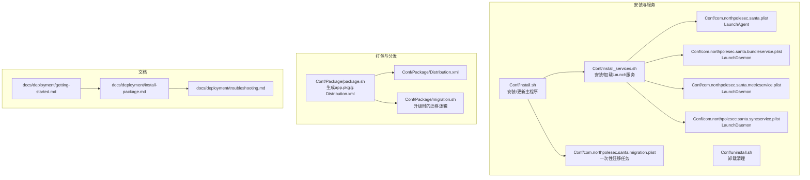
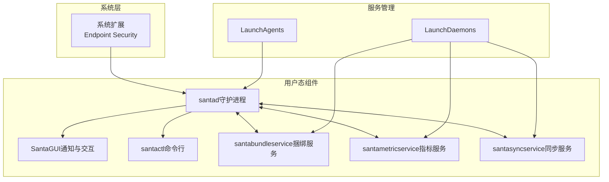
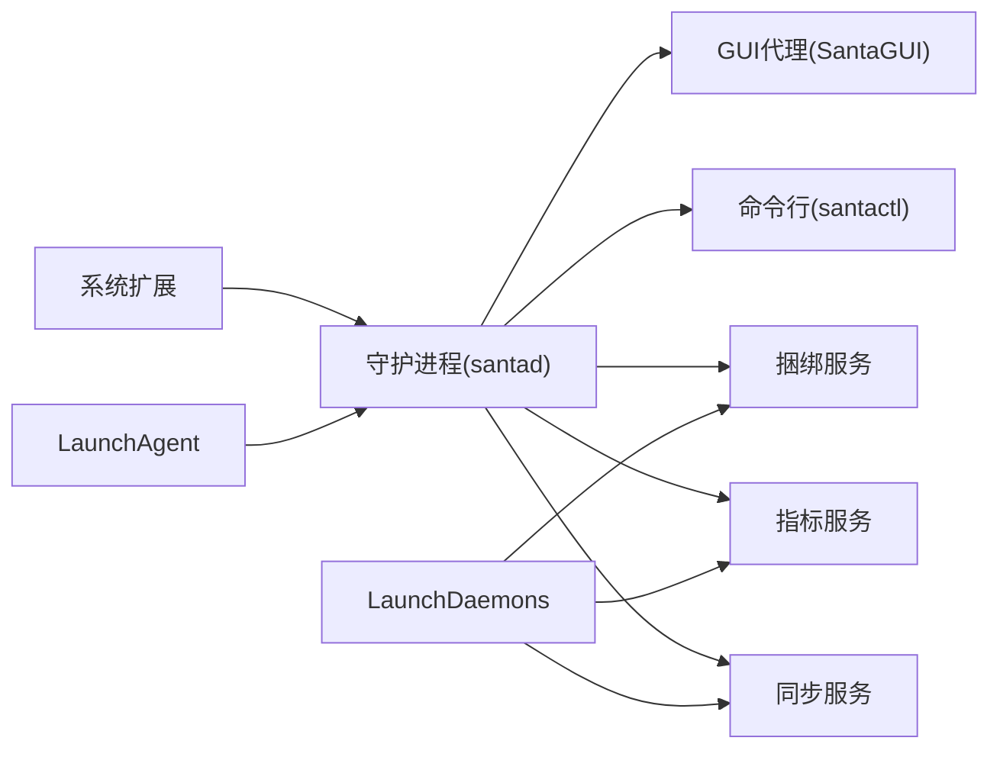
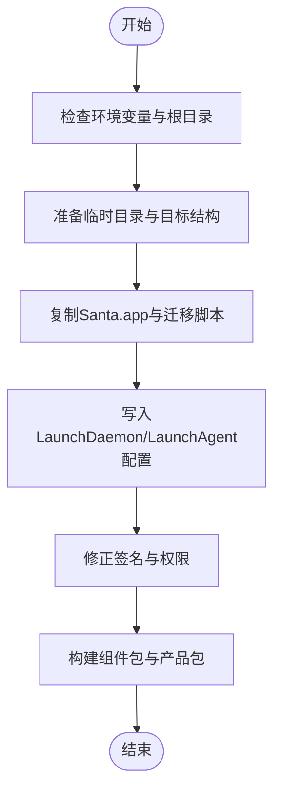

# 部署选项

<cite>
**本文引用的文件**
- [README.md](file://README.md)
- [Conf/install.sh](file://Conf/install.sh)
- [Conf/install_services.sh](file://Conf/install_services.sh)
- [Conf/uninstall.sh](file://Conf/uninstall.sh)
- [Conf/com.northpolesec.santa.plist](file://Conf/com.northpolesec.santa.plist)
- [Conf/com.northpolesec.santa.bundleservice.plist](file://Conf/com.northpolesec.santa.bundleservice.plist)
- [Conf/com.northpolesec.santa.metricservice.plist](file://Conf/com.northpolesec.santa.metricservice.plist)
- [Conf/com.northpolesec.santa.syncservice.plist](file://Conf/com.northpolesec.santa.syncservice.plist)
- [Conf/com.northpolesec.santa.migration.plist](file://Conf/com.northpolesec.santa.migration.plist)
- [Conf/Package/package.sh](file://Conf/Package/package.sh)
- [Conf/Package/Distribution.xml](file://Conf/Package/Distribution.xml)
- [Conf/Package/migration.sh](file://Conf/Package/migration.sh)
- [docs/docs/deployment/getting-started.md](file://docs/docs/deployment/getting-started.md)
- [docs/docs/deployment/install-package.md](file://docs/docs/deployment/install-package.md)
- [docs/docs/deployment/troubleshooting.md](file://docs/docs/deployment/troubleshooting.md)
</cite>

## 目录
1. [简介](#简介)
2. [项目结构](#项目结构)
3. [核心组件](#核心组件)
4. [架构总览](#架构总览)
5. [详细组件分析](#详细组件分析)
6. [依赖关系分析](#依赖关系分析)
7. [性能考虑](#性能考虑)
8. [故障排查指南](#故障排查指南)
9. [结论](#结论)
10. [附录](#附录)

## 简介
本指南面向IT管理员与DevOps工程师，围绕Santa在macOS上的多种部署方式提供系统化、可操作的部署指导。内容涵盖：安装包部署（MDM、Munki、手动、Homebrew）、手动部署脚本、系统扩展与TCC权限要求、LaunchDaemon与LaunchAgent的差异与服务管理、企业级批量部署最佳实践（配置分发、升级策略、服务监控）、部署前检查清单以及常见问题的解决方案。

## 项目结构
Santa的部署相关实现主要集中在Conf目录下的安装/卸载脚本、LaunchDaemon/LaunchAgent配置以及打包脚本；配套文档位于docs/docs/deployment中，提供了从入门到安装包部署、迁移、故障排查的完整流程。

图表来源
- [Conf/install.sh](file://Conf/install.sh#L1-L68)
- [Conf/install_services.sh](file://Conf/install_services.sh#L1-L64)
- [Conf/uninstall.sh](file://Conf/uninstall.sh#L1-L42)
- [Conf/com.northpolesec.santa.plist](file://Conf/com.northpolesec.santa.plist#L1-L22)
- [Conf/com.northpolesec.santa.bundleservice.plist](file://Conf/com.northpolesec.santa.bundleservice.plist#L1-L33)
- [Conf/com.northpolesec.santa.metricservice.plist](file://Conf/com.northpolesec.santa.metricservice.plist#L1-L27)
- [Conf/com.northpolesec.santa.syncservice.plist](file://Conf/com.northpolesec.santa.syncservice.plist#L1-L27)
- [Conf/com.northpolesec.santa.migration.plist](file://Conf/com.northpolesec.santa.migration.plist#L1-L21)
- [Conf/Package/package.sh](file://Conf/Package/package.sh#L1-L77)
- [Conf/Package/Distribution.xml](file://Conf/Package/Distribution.xml#L1-L17)
- [Conf/Package/migration.sh](file://Conf/Package/migration.sh#L1-L41)
- [docs/docs/deployment/getting-started.md](file://docs/docs/deployment/getting-started.md#L1-L21)
- [docs/docs/deployment/install-package.md](file://docs/docs/deployment/install-package.md#L1-L196)
- [docs/docs/deployment/troubleshooting.md](file://docs/docs/deployment/troubleshooting.md#L1-L116)

章节来源
- [README.md](file://README.md#L1-L152)
- [docs/docs/deployment/getting-started.md](file://docs/docs/deployment/getting-started.md#L1-L21)
- [docs/docs/deployment/install-package.md](file://docs/docs/deployment/install-package.md#L1-L196)
- [docs/docs/deployment/troubleshooting.md](file://docs/docs/deployment/troubleshooting.md#L1-L116)

## 核心组件
- 安装与升级主流程
  - 主程序安装/更新入口：[Conf/install.sh](file://Conf/install.sh#L1-L68)
  - 服务安装/加载入口：[Conf/install_services.sh](file://Conf/install_services.sh#L1-L64)
  - 升级迁移辅助：[Conf/Package/migration.sh](file://Conf/Package/migration.sh#L1-L41)、[Conf/com.northpolesec.santa.migration.plist](file://Conf/com.northpolesec.santa.migration.plist#L1-L21)
- 服务定义
  - 用户态代理（LaunchAgent）：[Conf/com.northpolesec.santa.plist](file://Conf/com.northpolesec.santa.plist#L1-L22)
  - 后台服务（LaunchDaemon）：捆绑服务、指标服务、同步服务
    - [Conf/com.northpolesec.santa.bundleservice.plist](file://Conf/com.northpolesec.santa.bundleservice.plist#L1-L33)
    - [Conf/com.northpolesec.santa.metricservice.plist](file://Conf/com.northpolesec.santa.metricservice.plist#L1-L27)
    - [Conf/com.northpolesec.santa.syncservice.plist](file://Conf/com.northpolesec.santa.syncservice.plist#L1-L27)
- 卸载清理：[Conf/uninstall.sh](file://Conf/uninstall.sh#L1-L42)
- 打包与分发
  - 生成app.pkg与Distribution.xml：[Conf/Package/package.sh](file://Conf/Package/package.sh#L1-L77)、[Conf/Package/Distribution.xml](file://Conf/Package/Distribution.xml#L1-L17)

章节来源
- [Conf/install.sh](file://Conf/install.sh#L1-L68)
- [Conf/install_services.sh](file://Conf/install_services.sh#L1-L64)
- [Conf/uninstall.sh](file://Conf/uninstall.sh#L1-L42)
- [Conf/com.northpolesec.santa.plist](file://Conf/com.northpolesec.santa.plist#L1-L22)
- [Conf/com.northpolesec.santa.bundleservice.plist](file://Conf/com.northpolesec.santa.bundleservice.plist#L1-L33)
- [Conf/com.northpolesec.santa.metricservice.plist](file://Conf/com.northpolesec.santa.metricservice.plist#L1-L27)
- [Conf/com.northpolesec.santa.syncservice.plist](file://Conf/com.northpolesec.santa.syncservice.plist#L1-L27)
- [Conf/com.northpolesec.santa.migration.plist](file://Conf/com.northpolesec.santa.migration.plist#L1-L21)
- [Conf/Package/package.sh](file://Conf/Package/package.sh#L1-L77)
- [Conf/Package/Distribution.xml](file://Conf/Package/Distribution.xml#L1-L17)
- [Conf/Package/migration.sh](file://Conf/Package/migration.sh#L1-L41)

## 架构总览
下图展示了Santa在macOS上的部署与运行架构：系统扩展负责二进制执行与文件访问的授权决策；用户态组件通过XPC通信协作；LaunchDaemon/LaunchAgent负责生命周期管理与自动加载；MDM/Munki等工具用于企业级分发与强制执行。

图表来源
- [README.md](file://README.md#L13-L21)
- [Conf/com.northpolesec.santa.plist](file://Conf/com.northpolesec.santa.plist#L1-L22)
- [Conf/com.northpolesec.santa.bundleservice.plist](file://Conf/com.northpolesec.santa.bundleservice.plist#L1-L33)
- [Conf/com.northpolesec.santa.metricservice.plist](file://Conf/com.northpolesec.santa.metricservice.plist#L1-L27)
- [Conf/com.northpolesec.santa.syncservice.plist](file://Conf/com.northpolesec.santa.syncservice.plist#L1-L27)

## 详细组件分析

### 安装包部署（MDM、Munki、手动、Homebrew）
- MDM部署
  - 使用MDM推送安装包，推荐启用“审计与强制”模式以确保安装且不可移除。
  - 分发的PKG已签名与公证，适合直接部署。
  - 参考：[docs/docs/deployment/install-package.md](file://docs/docs/deployment/install-package.md#L32-L50)
- Munki部署
  - 将PKG作为受管安装项加入清单，支持强制安装与重装。
  - 参考：[docs/docs/deployment/install-package.md](file://docs/docs/deployment/install-package.md#L51-L113)
- 手动安装
  - Finder双击或使用命令行安装器进行安装。
  - 参考：[docs/docs/deployment/install-package.md](file://docs/docs/deployment/install-package.md#L115-L124)
- Homebrew安装
  - 通过Homebrew安装，需sudo权限。
  - 参考：[docs/docs/deployment/install-package.md](file://docs/docs/deployment/install-package.md#L125-L146)
- 验证安装
  - 使用santactl查看版本与状态，确认守护进程、缓存、数据库、同步信息等。
  - 参考：[docs/docs/deployment/install-package.md](file://docs/docs/deployment/install-package.md#L148-L196)

章节来源
- [docs/docs/deployment/install-package.md](file://docs/docs/deployment/install-package.md#L1-L196)

### 手动部署（脚本与服务）
- 主程序安装/更新
  - 自动判断是否需要通过santactl进行升级，必要时创建临时允许规则以保证升级路径畅通。
  - 参考：[Conf/install.sh](file://Conf/install.sh#L1-L68)
- 服务安装/加载
  - 在系统扩展启动前由系统扩展调用，完成Launch服务的卸载、迁移、复制与加载。
  - 参考：[Conf/install_services.sh](file://Conf/install_services.sh#L1-L64)
- 升级迁移
  - 升级期间等待旧版Google Santa完全停用后，再移动新版本并加载系统扩展。
  - 参考：[Conf/Package/migration.sh](file://Conf/Package/migration.sh#L1-L41)、[Conf/com.northpolesec.santa.migration.plist](file://Conf/com.northpolesec.santa.migration.plist#L1-L21)
- 卸载清理
  - 卸载系统扩展、移除Launch服务、删除应用与日志配置，必要时刷新syslogd。
  - 参考：[Conf/uninstall.sh](file://Conf/uninstall.sh#L1-L42)

章节来源
- [Conf/install.sh](file://Conf/install.sh#L1-L68)
- [Conf/install_services.sh](file://Conf/install_services.sh#L1-L64)
- [Conf/Package/migration.sh](file://Conf/Package/migration.sh#L1-L41)
- [Conf/com.northpolesec.santa.migration.plist](file://Conf/com.northpolesec.santa.migration.plist#L1-L21)
- [Conf/uninstall.sh](file://Conf/uninstall.sh#L1-L42)

### LaunchDaemon与LaunchAgent的配置差异与服务管理
- LaunchAgent（用户态）
  - 作用：随用户登录启动，保持守护进程运行，关联应用标识。
  - 配置示例：[Conf/com.northpolesec.santa.plist](file://Conf/com.northpolesec.santa.plist#L1-L22)
- LaunchDaemon（系统态）
  - 作用：系统范围后台服务，按需启动与常驻，通过Mach服务暴露接口。
  - 配置示例：
    - [Conf/com.northpolesec.santa.bundleservice.plist](file://Conf/com.northpolesec.santa.bundleservice.plist#L1-L33)
    - [Conf/com.northpolesec.santa.metricservice.plist](file://Conf/com.northpolesec.santa.metricservice.plist#L1-L27)
    - [Conf/com.northpolesec.santa.syncservice.plist](file://Conf/com.northpolesec.santa.syncservice.plist#L1-L27)
- 服务管理方式
  - 安装/加载：install_services脚本统一处理复制、卸载旧版本、加载新服务。
  - 参考：[Conf/install_services.sh](file://Conf/install_services.sh#L47-L64)
- 迁移服务
  - 升级时一次性任务，完成后自动移除。
  - 参考：[Conf/com.northpolesec.santa.migration.plist](file://Conf/com.northpolesec.santa.migration.plist#L1-L21)

章节来源
- [Conf/com.northpolesec.santa.plist](file://Conf/com.northpolesec.santa.plist#L1-L22)
- [Conf/com.northpolesec.santa.bundleservice.plist](file://Conf/com.northpolesec.santa.bundleservice.plist#L1-L33)
- [Conf/com.northpolesec.santa.metricservice.plist](file://Conf/com.northpolesec.santa.metricservice.plist#L1-L27)
- [Conf/com.northpolesec.santa.syncservice.plist](file://Conf/com.northpolesec.santa.syncservice.plist#L1-L27)
- [Conf/install_services.sh](file://Conf/install_services.sh#L47-L64)
- [Conf/com.northpolesec.santa.migration.plist](file://Conf/com.northpolesec.santa.migration.plist#L1-L21)

### 企业级部署最佳实践
- 批量安装
  - 使用MDM或Munki统一推送安装包，启用“审计与强制”模式确保合规。
  - 参考：[docs/docs/deployment/install-package.md](file://docs/docs/deployment/install-package.md#L32-L50)
- 配置分发
  - 通过配置文件与系统扩展/TCC/通知等配置文件集中管理，确保一致性。
  - 参考：[docs/docs/deployment/getting-started.md](file://docs/docs/deployment/getting-started.md#L1-L21)
- 服务监控
  - 使用santactl status与日志流进行健康检查与问题定位。
  - 参考：[docs/docs/deployment/install-package.md](file://docs/docs/deployment/install-package.md#L148-L196)、[docs/docs/deployment/troubleshooting.md](file://docs/docs/deployment/troubleshooting.md#L77-L86)

章节来源
- [docs/docs/deployment/install-package.md](file://docs/docs/deployment/install-package.md#L1-L196)
- [docs/docs/deployment/getting-started.md](file://docs/docs/deployment/getting-started.md#L1-L21)
- [docs/docs/deployment/troubleshooting.md](file://docs/docs/deployment/troubleshooting.md#L77-L86)

### 系统要求与权限
- macOS版本
  - 发布物包含目标架构声明，适用于x86_64与arm64平台。
  - 参考：[Conf/Package/Distribution.xml](file://Conf/Package/Distribution.xml#L1-L17)
- 系统扩展权限
  - 必须在系统设置中启用Endpoint Security扩展，并处于“已激活且启用”状态。
  - 参考：[docs/docs/deployment/troubleshooting.md](file://docs/docs/deployment/troubleshooting.md#L46-L76)
- 全盘访问（TCC/PPPC）
  - 需为守护进程授予全盘访问权限。
  - 参考：[docs/docs/deployment/troubleshooting.md](file://docs/docs/deployment/troubleshooting.md#L31-L45)
- 管理员权限
  - 多数安装/卸载/服务管理操作需要root权限。
  - 参考：[Conf/install.sh](file://Conf/install.sh#L1-L6)、[Conf/uninstall.sh](file://Conf/uninstall.sh#L1-L8)

章节来源
- [Conf/Package/Distribution.xml](file://Conf/Package/Distribution.xml#L1-L17)
- [docs/docs/deployment/troubleshooting.md](file://docs/docs/deployment/troubleshooting.md#L31-L76)
- [Conf/install.sh](file://Conf/install.sh#L1-L6)
- [Conf/uninstall.sh](file://Conf/uninstall.sh#L1-L8)

### 部署前检查清单
- 系统扩展状态
  - 检查系统扩展列表，确认状态为“已激活且启用”。
  - 参考：[docs/docs/deployment/troubleshooting.md](file://docs/docs/deployment/troubleshooting.md#L46-L76)
- 权限配置
  - 确认已授予全盘访问与系统扩展权限。
  - 参考：[docs/docs/deployment/troubleshooting.md](file://docs/docs/deployment/troubleshooting.md#L31-L76)
- 配置文件
  - 确保配置文件已正确下发（如系统扩展/TCC/通知等）。
  - 参考：[docs/docs/deployment/getting-started.md](file://docs/docs/deployment/getting-started.md#L1-L21)
- 验证安装
  - 使用santactl status与doctor命令进行验证与诊断。
  - 参考：[docs/docs/deployment/install-package.md](file://docs/docs/deployment/install-package.md#L148-L196)、[docs/docs/deployment/troubleshooting.md](file://docs/docs/deployment/troubleshooting.md#L23-L30)

章节来源
- [docs/docs/deployment/troubleshooting.md](file://docs/docs/deployment/troubleshooting.md#L23-L76)
- [docs/docs/deployment/getting-started.md](file://docs/docs/deployment/getting-started.md#L1-L21)
- [docs/docs/deployment/install-package.md](file://docs/docs/deployment/install-package.md#L148-L196)

### 常见部署问题与解决方案
- 无法与守护进程通信
  - 使用doctor命令检查配置与环境问题。
  - 参考：[docs/docs/deployment/troubleshooting.md](file://docs/docs/deployment/troubleshooting.md#L23-L30)
- 系统扩展未启用或处于等待状态
  - 在系统设置中启用扩展；必要时强制加载系统扩展。
  - 参考：[docs/docs/deployment/troubleshooting.md](file://docs/docs/deployment/troubleshooting.md#L46-L76)
- 全盘访问未授予
  - 在系统设置中为守护进程开启全盘访问。
  - 参考：[docs/docs/deployment/troubleshooting.md](file://docs/docs/deployment/troubleshooting.md#L31-L45)
- 日志与诊断
  - 使用日志流查看守护进程调试信息。
  - 参考：[docs/docs/deployment/troubleshooting.md](file://docs/docs/deployment/troubleshooting.md#L77-L86)

章节来源
- [docs/docs/deployment/troubleshooting.md](file://docs/docs/deployment/troubleshooting.md#L23-L86)

## 依赖关系分析
- 组件耦合
  - 系统扩展与守护进程强耦合，守护进程依赖系统扩展提供的事件与决策能力。
  - 用户态组件通过XPC通信，彼此校验签名一致性。
  - 参考：[README.md](file://README.md#L78-L82)
- 服务依赖
  - LaunchDaemon负责系统级后台服务，LaunchAgent负责用户态代理。
  - 参考：[Conf/com.northpolesec.santa.plist](file://Conf/com.northpolesec.santa.plist#L1-L22)、[Conf/com.northpolesec.santa.bundleservice.plist](file://Conf/com.northpolesec.santa.bundleservice.plist#L1-L33)、[Conf/com.northpolesec.santa.metricservice.plist](file://Conf/com.northpolesec.santa.metricservice.plist#L1-L27)、[Conf/com.northpolesec.santa.syncservice.plist](file://Conf/com.northpolesec.santa.syncservice.plist#L1-L27)
- 外部依赖
  - MDM/Munki用于大规模分发；打包脚本依赖pkgbuild/productbuild等系统工具。
  - 参考：[docs/docs/deployment/install-package.md](file://docs/docs/deployment/install-package.md#L32-L50)、[Conf/Package/package.sh](file://Conf/Package/package.sh#L60-L77)

图表来源
- [README.md](file://README.md#L13-L21)
- [Conf/com.northpolesec.santa.plist](file://Conf/com.northpolesec.santa.plist#L1-L22)
- [Conf/com.northpolesec.santa.bundleservice.plist](file://Conf/com.northpolesec.santa.bundleservice.plist#L1-L33)
- [Conf/com.northpolesec.santa.metricservice.plist](file://Conf/com.northpolesec.santa.metricservice.plist#L1-L27)
- [Conf/com.northpolesec.santa.syncservice.plist](file://Conf/com.northpolesec.santa.syncservice.plist#L1-L27)

章节来源
- [README.md](file://README.md#L13-L21)
- [docs/docs/deployment/install-package.md](file://docs/docs/deployment/install-package.md#L32-L50)
- [Conf/Package/package.sh](file://Conf/Package/package.sh#L60-L77)

## 性能考虑
- 缓存与决策
  - 守护进程对允许的二进制进行缓存，减少重复决策开销。
  - 参考：[README.md](file://README.md#L83-L85)
- 资源占用
  - 通过status输出可观察CPU与内存占用峰值，评估部署规模影响。
  - 参考：[docs/docs/deployment/install-package.md](file://docs/docs/deployment/install-package.md#L158-L195)
- 同步与事件上传
  - 同步服务与事件上传可能产生网络与磁盘I/O，建议在企业环境中合理规划带宽与存储。
  - 参考：[docs/docs/deployment/install-package.md](file://docs/docs/deployment/install-package.md#L189-L195)

[本节为通用性能讨论，不涉及具体文件分析]

## 故障排查指南
- 基础诊断
  - 使用santactl status与doctor命令快速定位问题。
  - 参考：[docs/docs/deployment/install-package.md](file://docs/docs/deployment/install-package.md#L148-L196)、[docs/docs/deployment/troubleshooting.md](file://docs/docs/deployment/troubleshooting.md#L10-L30)
- 系统扩展与权限
  - 检查systemextensionsctl列表，必要时强制加载系统扩展。
  - 参考：[docs/docs/deployment/troubleshooting.md](file://docs/docs/deployment/troubleshooting.md#L46-L76)
- 日志与遥测
  - 使用日志流查看守护进程调试信息，结合遥测文档理解运行状态。
  - 参考：[docs/docs/deployment/troubleshooting.md](file://docs/docs/deployment/troubleshooting.md#L77-L86)

章节来源
- [docs/docs/deployment/install-package.md](file://docs/docs/deployment/install-package.md#L148-L196)
- [docs/docs/deployment/troubleshooting.md](file://docs/docs/deployment/troubleshooting.md#L10-L86)

## 结论
Santa的部署方案覆盖从单机手动安装到企业级MDM/Munki的大规模分发。通过系统扩展与用户态组件的协同、LaunchDaemon/LaunchAgent的职责分离，以及完善的安装/卸载与迁移脚本，能够满足不同规模组织的安全与合规需求。建议在部署前完成系统扩展与权限配置，并利用santactl与日志进行持续监控与问题定位。

[本节为总结性内容，不涉及具体文件分析]

## 附录

### 安装包打包与分发流程

图表来源
- [Conf/Package/package.sh](file://Conf/Package/package.sh#L1-L77)
- [Conf/Package/Distribution.xml](file://Conf/Package/Distribution.xml#L1-L17)

章节来源
- [Conf/Package/package.sh](file://Conf/Package/package.sh#L1-L77)
- [Conf/Package/Distribution.xml](file://Conf/Package/Distribution.xml#L1-L17)