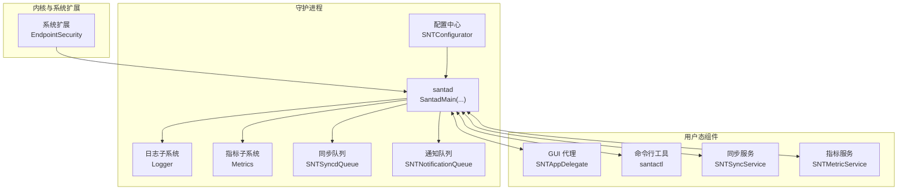
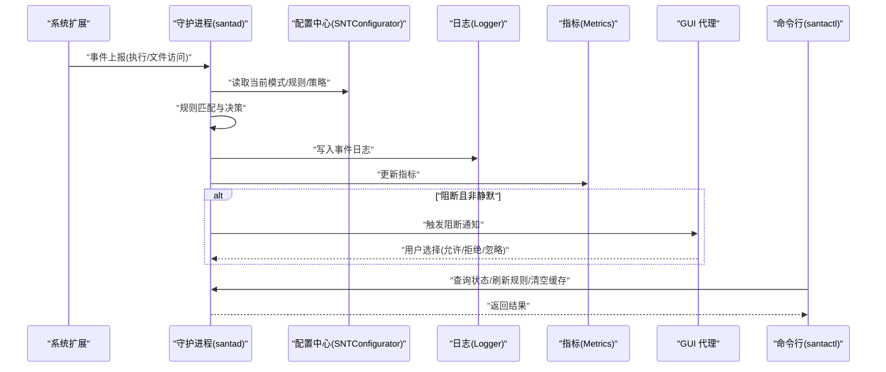
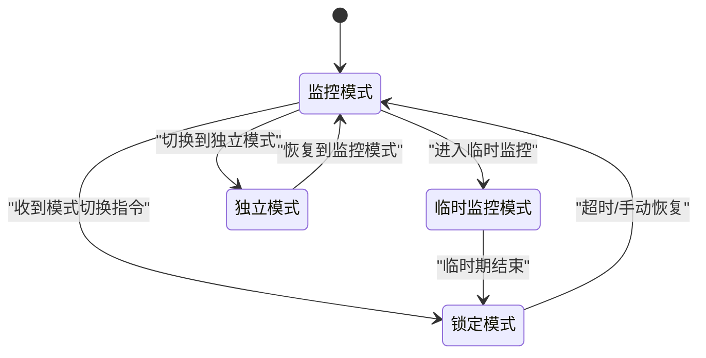
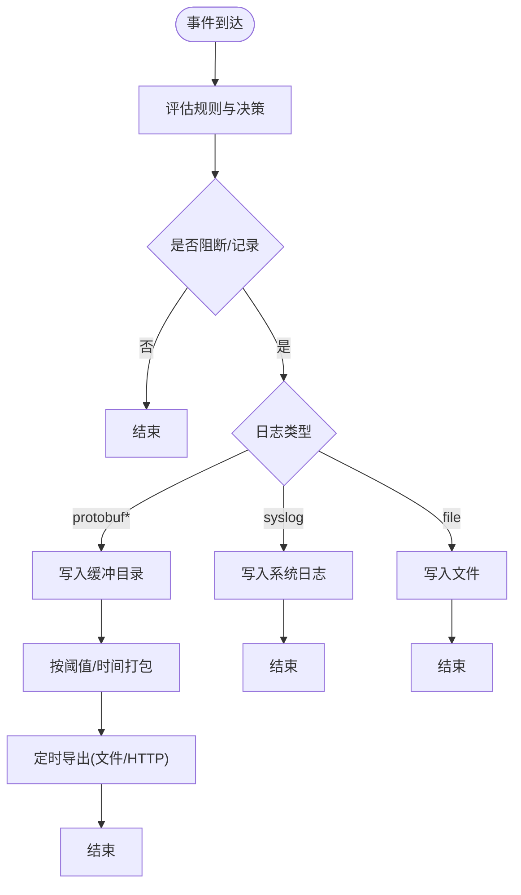
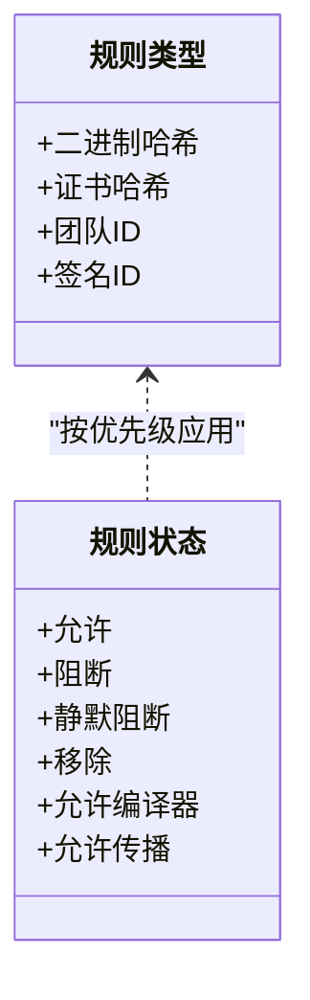
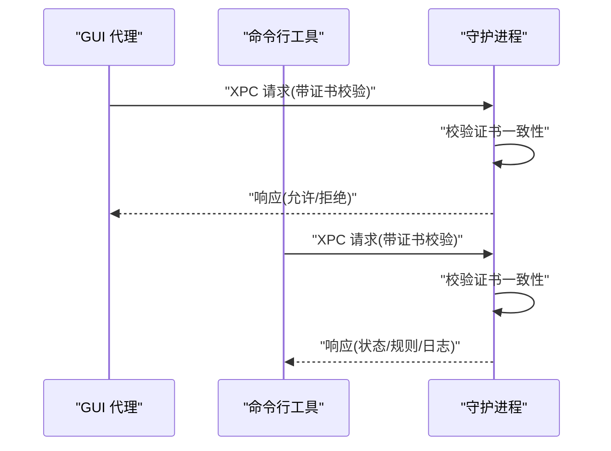
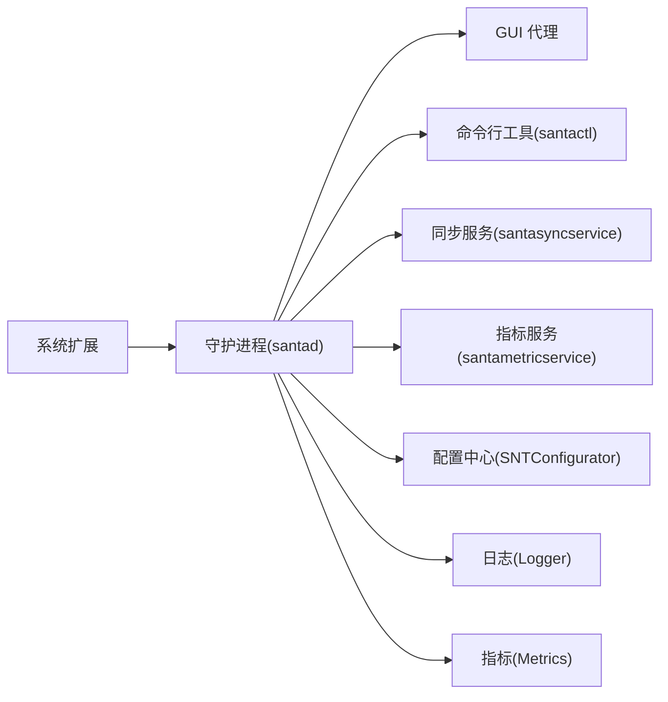
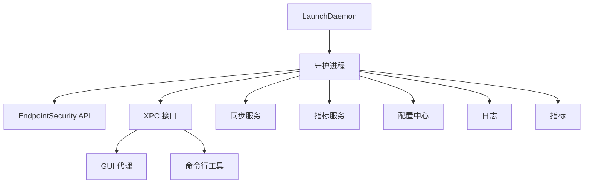

# 项目概述

<cite>
**本文引用的文件**
- [README.md](file://README.md)
- [Santad.h](file://Source/santad/Santad.h)
- [main.mm（守护进程入口）](file://Source/santad/main.mm)
- [SNTConfigurator.h](file://Source/common/SNTConfigurator.h)
- [SNTCommonEnums.h](file://Source/common/SNTCommonEnums.h)
- [main.mm（GUI代理入口）](file://Source/gui/main.mm)
- [main.mm（命令行工具入口）](file://Source/santactl/main.mm)
- [com.northpolesec.santa.plist](file://Conf/com.northpolesec.santa.plist)
- [SNTSyncService.h](file://Source/santasyncservice/SNTSyncService.h)
- [SNTMetricService.h](file://Source/santametricservice/SNTMetricService.h)
</cite>

## 目录
1. [简介](#简介)
2. [项目结构](#项目结构)
3. [核心组件](#核心组件)
4. [架构总览](#架构总览)
5. [详细组件分析](#详细组件分析)
6. [依赖分析](#依赖分析)
7. [性能考虑](#性能考虑)
8. [故障排查指南](#故障排查指南)
9. [结论](#结论)
10. [附录](#附录)

## 简介
Santa 是一个专为 macOS 设计的二进制与文件访问授权系统。其核心目标是通过系统扩展在内核侧拦截执行与文件访问事件，结合本地数据库与可选的远程同步策略，对未知或违规二进制进行阻断，并向用户与管理员提供可观测、可审计、可集中管理的安全能力。项目强调“防御纵深”理念，既适合个人使用也适用于大规模企业环境。

Santa 的关键特性包括：
- 多模式运行：监控模式与锁定模式，支持临时监控模式与静默模式。
- 基于代码签名的规则体系：支持按二进制哈希、证书、团队标识、签名ID等维度进行白名单/黑名单控制。
- 路径正则规则：以 ICU 正则表达式实现灵活的路径级限制。
- 事件日志与遥测：支持多种日志输出格式与批量导出，便于审计与分析。
- 用户态组件互信：守护进程、GUI 代理、命令行工具通过 XPC 通信并校验证书一致性。
- 同步服务：可与官方或开源同步服务器对接，实现快速策略下发与状态同步。

**章节来源**
- [README.md](file://README.md#L13-L85)

## 项目结构
Santa 采用模块化分层组织，围绕“系统扩展 + 守护进程 + 用户态组件”的架构展开：
- 系统扩展：负责内核事件采集与决策。
- 守护进程（santad）：处理事件、评估规则、写入日志、协调同步与通知。
- GUI 代理：在需要时弹窗提示用户并收集交互。
- 命令行工具（santactl）：用于查询状态、刷新规则、查看日志、管理缓存等。
- 同步服务（santasyncservice）：与远端服务器交互，拉取策略与上传事件。
- 指标服务（santametricservice）：聚合与导出指标数据。
- 配置与安装脚本：提供 plist、安装脚本与打包配置。

**图表来源**
- [Santad.h](file://Source/santad/Santad.h#L35-L51)
- [main.mm（守护进程入口）](file://Source/santad/main.mm#L104-L151)
- [SNTConfigurator.h](file://Source/common/SNTConfigurator.h#L31-L120)
- [SNTSyncService.h](file://Source/santasyncservice/SNTSyncService.h#L15-L21)
- [SNTMetricService.h](file://Source/santametricservice/SNTMetricService.h#L15-L21)
- [main.mm（GUI代理入口）](file://Source/gui/main.mm#L56-L94)
- [main.mm（命令行工具入口）](file://Source/santactl/main.mm#L39-L84)

**章节来源**
- [README.md](file://README.md#L13-L85)
- [com.northpolesec.santa.plist](file://Conf/com.northpolesec.santa.plist#L1-L22)

## 核心组件
- 系统扩展（内核侧）
  - 通过 EndpointSecurity API 订阅执行与文件访问事件，进行实时拦截与决策。
  - 与守护进程通过 XPC 通信，传递事件与结果。
- 守护进程（santad）
  - 主入口负责初始化配置、日志、指标、同步队列、通知队列等，并启动事件循环。
  - 执行控制器负责评估规则与决策；编译器控制器支持“允许编译器”类规则的传播。
  - 进程树与富化器用于增强事件上下文信息。
- GUI 代理
  - 在阻断场景下弹窗提示用户，支持静默模式与密码回退等配置。
  - 提供系统扩展激活/卸载的便捷操作。
- 命令行工具（santactl）
  - 将复杂管理任务拆分为多个子命令，统一入口解析与路由。
- 同步服务（santasyncservice）
  - 与远端服务器交互，完成预检、规则下载、事件上传、后置处理等流程。
- 指标服务（santametricservice）
  - 聚合指标并通过文件或 HTTP 写出，支持多种格式与批量导出。

**章节来源**
- [Santad.h](file://Source/santad/Santad.h#L35-L51)
- [main.mm（守护进程入口）](file://Source/santad/main.mm#L104-L151)
- [main.mm（GUI代理入口）](file://Source/gui/main.mm#L56-L94)
- [main.mm（命令行工具入口）](file://Source/santactl/main.mm#L39-L84)
- [SNTSyncService.h](file://Source/santasyncservice/SNTSyncService.h#L15-L21)
- [SNTMetricService.h](file://Source/santametricservice/SNTMetricService.h#L15-L21)

## 架构总览
Santa 的整体运行时由“内核事件采集 + 守护进程决策 + 用户态组件交互”构成。系统扩展负责事件捕获，守护进程负责规则评估与日志/指标输出，GUI 与命令行提供人机交互与运维能力，同步与指标服务支撑集中化管理与可观测性。

**图表来源**
- [Santad.h](file://Source/santad/Santad.h#L35-L51)
- [SNTConfigurator.h](file://Source/common/SNTConfigurator.h#L31-L120)
- [main.mm（守护进程入口）](file://Source/santad/main.mm#L104-L151)

## 详细组件分析

### 组件一：多模式运行机制（监控模式与锁定模式）
- 模式定义
  - 监控模式：默认模式，仅记录未知或被阻断的二进制，不强制阻止。
  - 锁定模式：仅允许已列入白名单的二进制运行。
  - 临时监控模式：在限定时间内自动从锁定模式切换回监控模式，便于应急处置。
  - 独立模式（Standalone）：本地独立运行，通常配合生物识别与密码回退。
- 规则优先级
  - 代码签名规则优先级高于路径规则，确保更细粒度的控制。
- 配置来源
  - 可通过同步服务器下发模式变更，也可本地静态规则覆盖。

**图表来源**
- [SNTCommonEnums.h](file://Source/common/SNTCommonEnums.h#L84-L90)
- [SNTConfigurator.h](file://Source/common/SNTConfigurator.h#L31-L60)
- [SNTConfigurator.h](file://Source/common/SNTConfigurator.h#L665-L685)

**章节来源**
- [README.md](file://README.md#L46-L59)
- [SNTCommonEnums.h](file://Source/common/SNTCommonEnums.h#L84-L90)
- [SNTConfigurator.h](file://Source/common/SNTConfigurator.h#L31-L60)
- [SNTConfigurator.h](file://Source/common/SNTConfigurator.h#L665-L685)

### 组件二：事件日志记录与导出
- 日志类型
  - 支持 syslog、文件、protobuf/maildir、流式压缩等多种格式。
- 导出配置
  - 可设置批次阈值、最大文件数、导出间隔与超时，便于大规模环境下的高效传输。
- 速率限制
  - 对文件访问授权违规的日志输出提供全局速率限制，避免噪声影响。

**图表来源**
- [SNTConfigurator.h](file://Source/common/SNTConfigurator.h#L191-L210)
- [SNTConfigurator.h](file://Source/common/SNTConfigurator.h#L228-L270)
- [SNTConfigurator.h](file://Source/common/SNTConfigurator.h#L271-L317)

**章节来源**
- [SNTConfigurator.h](file://Source/common/SNTConfigurator.h#L191-L210)
- [SNTConfigurator.h](file://Source/common/SNTConfigurator.h#L228-L317)

### 组件三：基于代码签名的规则系统
- 规则类型
  - 二进制哈希、证书哈希、团队ID、签名ID等，支持“静默阻断”等变体。
- 优先级与覆盖
  - 最具体规则优先，允许在不同粒度上叠加控制。
- 编译器传播
  - “允许编译器”规则可传播至其产出物，减少手工维护成本。

**图表来源**
- [SNTCommonEnums.h](file://Source/common/SNTCommonEnums.h#L50-L83)
- [SNTConfigurator.h](file://Source/common/SNTConfigurator.h#L55-L79)
- [SNTConfigurator.h](file://Source/common/SNTConfigurator.h#L764-L771)

**章节来源**
- [README.md](file://README.md#L55-L69)
- [SNTCommonEnums.h](file://Source/common/SNTCommonEnums.h#L50-L83)
- [SNTConfigurator.h](file://Source/common/SNTConfigurator.h#L55-L79)
- [SNTConfigurator.h](file://Source/common/SNTConfigurator.h#L764-L771)

### 组件四：用户态组件互信与 XPC 通信
- 互信机制
  - 各用户态组件通过 XPC 通信前校验彼此签名证书一致性，防止中间人攻击。
- 关键接口
  - 控制接口、同步接口、指标接口、通知接口等均通过 XPC 暴露。

**图表来源**
- [README.md](file://README.md#L78-L85)
- [Santad.h](file://Source/santad/Santad.h#L19-L34)

**章节来源**
- [README.md](file://README.md#L78-L85)
- [Santad.h](file://Source/santad/Santad.h#L19-L34)

### 组件五：系统扩展、守护进程、GUI 代理、命令行工具的职责与关系
- 系统扩展：事件采集与拦截。
- 守护进程：规则评估、日志/指标、同步、通知、编译器传播、进程树富化。
- GUI 代理：阻断提示、系统扩展激活/卸载、用户交互。
- 命令行工具：查询状态、刷新规则、清空缓存、打印日志、版本信息等。

**图表来源**
- [Santad.h](file://Source/santad/Santad.h#L35-L51)
- [main.mm（守护进程入口）](file://Source/santad/main.mm#L104-L151)
- [main.mm（GUI代理入口）](file://Source/gui/main.mm#L56-L94)
- [main.mm（命令行工具入口）](file://Source/santactl/main.mm#L39-L84)
- [SNTSyncService.h](file://Source/santasyncservice/SNTSyncService.h#L15-L21)
- [SNTMetricService.h](file://Source/santametricservice/SNTMetricService.h#L15-L21)

**章节来源**
- [Santad.h](file://Source/santad/Santad.h#L35-L51)
- [main.mm（GUI代理入口）](file://Source/gui/main.mm#L56-L94)
- [main.mm（命令行工具入口）](file://Source/santactl/main.mm#L39-L84)

## 依赖分析
- 组件耦合
  - 守护进程与系统扩展之间通过 EndpointSecurity API 与 XPC 强耦合，保证低延迟与高可靠性。
  - 用户态组件通过 XPC 与守护进程解耦，便于独立演进与替换。
- 外部依赖
  - 同步服务依赖远端服务器（官方 Workshop 或开源方案），支持推送与批量同步。
  - 指标服务支持文件与 HTTP 两种导出方式，便于与 SIEM/日志平台集成。
- 配置与安装
  - 使用 LaunchDaemon 配置守护进程随系统启动，保持长期可用。

**图表来源**
- [Santad.h](file://Source/santad/Santad.h#L35-L51)
- [com.northpolesec.santa.plist](file://Conf/com.northpolesec.santa.plist#L1-L22)

**章节来源**
- [com.northpolesec.santa.plist](file://Conf/com.northpolesec.santa.plist#L1-L22)

## 性能考虑
- 缓存机制：对已判定的允许项进行缓存，降低重复决策开销。
- 前缀过滤：内核侧对路径前缀进行过滤，减少不必要的事件传递。
- 日志与指标：支持流式与压缩输出，降低磁盘与网络压力。
- 资源监控：守护进程内置看门狗线程，监控 CPU/内存峰值并发出告警。

**章节来源**
- [README.md](file://README.md#L83-L85)
- [SNTConfigurator.h](file://Source/common/SNTConfigurator.h#L118-L167)
- [main.mm（守护进程入口）](file://Source/santad/main.mm#L45-L89)

## 故障排查指南
- 常见问题
  - 仅阻断执行，不保护动态库加载与替换；脚本执行不在当前覆盖范围。
- 同步与策略
  - 若无法连接同步服务器，请检查基础 URL、代理、额外请求头与认证配置。
- 日志与导出
  - 检查日志类型与缓冲目录大小阈值，必要时调整导出批次与超时。
- 模式切换
  - 使用临时监控模式进行应急处置，避免长时间锁定导致业务中断。

**章节来源**
- [README.md](file://README.md#L99-L112)
- [SNTConfigurator.h](file://Source/common/SNTConfigurator.h#L544-L584)
- [SNTConfigurator.h](file://Source/common/SNTConfigurator.h#L228-L270)
- [SNTConfigurator.h](file://Source/common/SNTConfigurator.h#L665-L685)

## 结论
Santa 通过“系统扩展 + 守护进程 + 用户态组件”的协同设计，在 macOS 上实现了高可靠、可审计、可集中管理的二进制与文件访问授权能力。其多模式运行、基于代码签名的规则体系、完善的日志与指标导出，以及与同步服务的紧密集成，使其既能满足个人用户的自我保护需求，也能胜任企业级的大规模部署与合规审计。

## 附录
- 系统要求与部署
  - 通过官方文档了解系统要求、安装包与配置模板。
- 与其他安全解决方案的对比
  - 可参考官方文档的部署与对比章节，结合自身环境选择合适的策略与工具链。

**章节来源**
- [README.md](file://README.md#L22-L44)